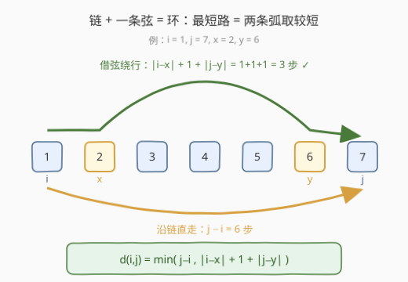
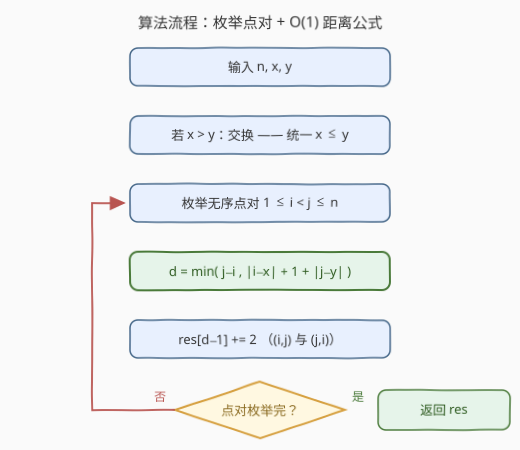
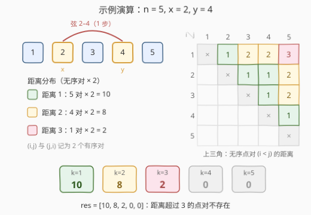

# 按距离统计房屋对数目I

- **题目名称**：按距离统计房屋对数目 I
- **链接**：[3015. 按距离统计房屋对数目 I](https://leetcode.cn/problems/count-the-number-of-houses-at-a-certain-distance-i/)
- **难度**：中等
- **标签**：广度优先搜索、图、前缀和

## 1. 题目概述

给你三个**正整数** `n`、`x`、`y`。城市中存在编号从 `1` 到 `n` 的房屋，`n−1` 条街道把 `i` 与 `i+1`（`1 ≤ i < n`）顺次相连，排成一条链；**另有一条**街道连接编号为 `x` 与 `y` 的房屋（`x` 可以等于 `y`）。

对每个 `k`（`1 ≤ k ≤ n`），统计满足「从 `house₁` 到 `house₂` 最少经过的街道数为 `k`」的**有序房屋对** `[house₁, house₂]` 数量。返回下标从 1 开始、长度为 `n` 的数组 `result`，`result[k]` 即距离为 `k` 的有序对数。

**示例 1**：

```text
输入：n = 3, x = 1, y = 3
输出：[6,0,0]
解释：链 1–2–3 加上弦 1–3 构成三元环，任意两房之间距离都是 1，
     3 个无序对 × 2 = 6 个有序对。
```

**示例 2**：

```text
输入：n = 5, x = 2, y = 4
输出：[10,8,2,0,0]
解释：弦 2–4 把部分点对的距离缩短：距离 1 的有序对 10 个，
     距离 2 的 8 个，距离 3 的 2 个（详见 2.4 演算）。
```

**示例 3**：

```text
输入：n = 4, x = 1, y = 1
输出：[6,4,2,0]
解释：x = y 时额外边是自环，任何最短路都不会使用，退化为纯链：
     距离 k 的有序对 = 2×(n−k)。
```

**约束条件**：

- $2 \le n \le 100$
- $1 \le x, y \le n$

> ⚠️ 两个读题细节：
> 1. **有序对**：`(1,2)` 与 `(2,1)` 是两个不同的对，各计一次——因此 $\sum_k \text{result}[k] = n(n-1)$，这是最方便的自检不变式。
> 2. **`x` 可以等于 `y`**：此时额外边是自环（自己连自己），对任何最短路都无贡献，等价于没有这条边。

---

## 2. 解题思路

### 2.1 暴力思路：从每个房屋跑 BFS

图只有 $n$ 个点、$n$ 条边（链上 $n-1$ 条 + 额外 1 条），从每个源点做一次 BFS 得到它到其余各点的最短路，再把 $n \times (n-1)$ 个有序距离逐个进桶。时间 $O(n^2)$（每轮 BFS 摊还 $O(1)$ 处理每条边），$n \le 100$ 时约 $10^4$ 规模，轻松通过（代码见第 5 节）。更无脑的 Floyd–Warshall 是 $O(n^3) = 10^6$，同样能过。

「建图 → BFS」对**任何图**都成立，是必须掌握的通用解法；但它完全没有利用本题「链 + 一条弦」的特殊结构——结构里其实藏着一个 $O(1)$ 的距离闭式。

### 2.2 核心观察：链 + 弦 = 环，最短路 = 两条弧取较短



整张图就是一条链 $1 \to 2 \to \dots \to n$，外加一条弦 $x$–$y$。不妨设 $x \le y$（否则交换，因为边是无向的）。考察任意点对 $i < j$，最短路只有两类候选：

- **沿链直走**：链是一棵树，树上 $i$ 到 $j$ 的路径唯一，长度就是 $j - i$；
- **借弦绕行**：先沿链走到 $x$（$|i-x|$ 步），过弦（$1$ 步），再沿链走到 $j$（$|j-y|$ 步），合计 $|i-x| + 1 + |j-y|$。

$$d(i,j) = \min\bigl(\,j - i,\ \ |i - x| + 1 + |j - y|\,\bigr)$$

> 💡 **为什么只列这两个候选就够了**：任何路径要么不经过弦（树路唯一，长 $j-i$），要么经过弦。经过弦的路径中，最短的必是「树路到 $x$ 或 $y$ → 过弦一次 → 树路到 $j$」，两个方向的长度分别是 $|i-x|+1+|j-y|$ 与 $|i-y|+1+|j-x|$；由不等式 $|i-x|+|j-y| \le |i-y|+|j-x|$（$i\le j$、$x\le y$ 时恒成立，绝对差的 Monge 性质），前者总不大于后者，故只需保留一项。至于把弦走两次的路径：来回绕弦至少多花 2 步，且 $|i-x|+|j-x| \ge |i-j|$（链上的三角不等式），总长至少是「直走 + 2」，不可能成为最短路。

> ⚠️ **$x = y$（自环）无需特判**：此时 $|i-x| + |j-x| \ge |i-j|$（三角不等式），「绕行」恒比直走至少多 1 步，公式自动退化为 $d = j-i$，即纯链。

于是本题**根本不用建图**：枚举所有 $i < j$，$O(1)$ 算出距离，按距离进桶计数，每个无序对贡献 2 个有序对（$(i,j)$ 与 $(j,i)$）。

### 2.3 算法流程图



1. 若 $x > y$ 则交换，统一成 $x \le y$（公式对 $x=y$ 自环同样成立）；
2. 双重循环枚举 $1 \le i < j \le n$；
3. $d = \min(j-i,\ |i-x|+1+|j-y|)$；
4. `res[d-1] += 2`（一个无序对 = 两个有序对）；
5. 返回 `res`。

### 2.4 示例演算



以示例 2 `n=5, x=2, y=4` 逐对套公式（$x \le y$ 已满足）：

| i | j | 直走 $j-i$ | 绕行 $\|i-x\|+1+\|j-y\|$ | $d$ | 备注 |
|---|---|-----------|--------------------------|-----|------|
| 1 | 2 | 1 | 1+1+2 = 4 | **1** | |
| 1 | 3 | 2 | 1+1+1 = 3 | **2** | |
| 1 | 4 | 3 | 1+1+0 = 2 | **2** | ★ 弦更短 |
| 1 | 5 | 4 | 1+1+1 = 3 | **3** | ★ 弦更短 |
| 2 | 3 | 1 | 0+1+1 = 2 | **1** | |
| 2 | 4 | 2 | 0+1+0 = 1 | **1** | ★ 弦更短 |
| 2 | 5 | 3 | 0+1+1 = 2 | **2** | ★ 弦更短 |
| 3 | 4 | 1 | 1+1+0 = 2 | **1** | |
| 3 | 5 | 2 | 1+1+1 = 3 | **2** | |
| 4 | 5 | 1 | 2+1+1 = 4 | **1** | |

距离 1 的无序对 5 个 → 有序 $5\times2=10$；距离 2 的 4 个 → $8$；距离 3 的 1 个 → $2$。`res = [10, 8, 2, 0, 0]` ✓。带 ★ 的四对是「绕弦更短」的点对——弦 2–4 把 $(2,4)$ 从 2 缩到 1，把 $(1,4)$、$(2,5)$ 从 3 缩到 2，把 $(1,5)$ 从 4 缩到 3。

---

## 3. 参考代码

### C++（公式枚举，O(n²)）

```cpp
class Solution {
  public:
    vector<int> countOfPairs(int n, int x, int y) {
        if (x > y) swap(x, y);            // 统一 x <= y（边无向）
        vector<int> res(n, 0);
        for (int i = 1; i <= n; ++i)
            for (int j = i + 1; j <= n; ++j) {
                int d = min(j - i, abs(i - x) + 1 + abs(j - y));
                res[d - 1] += 2;          // (i,j) 与 (j,i) 两个有序对
            }
        return res;
    }
};
```

### Python（公式枚举，O(n²)）

```python
class Solution:
    def countOfPairs(self, n: int, x: int, y: int) -> List[int]:
        if x > y:
            x, y = y, x                   # 统一 x <= y（边无向）
        res = [0] * n
        for i in range(1, n + 1):
            for j in range(i + 1, n + 1):
                d = min(j - i, abs(i - x) + 1 + abs(j - y))
                res[d - 1] += 2           # (i,j) 与 (j,i)
        return res
```

> 💡 **自检技巧**：$\sum \text{res}$ 应恰等于 $n(n-1)$。若不等，多半是「有序对漏乘 2」或「距离公式抄错」。写代码时把这个断言留在本地测试里，一次就能揪出大部分笔误。

---

## 4. 复杂度分析

| 维度 | 复杂度 | 说明 |
|------|--------|------|
| 时间复杂度 | $O(n^2)$ | 枚举全部 $\binom{n}{2}$ 个无序对，每对 $O(1)$ 求距离 |
| 空间复杂度 | $O(1)$ | 仅答案数组（返回值不计入），无需建图 |

BFS 版同为 $O(n^2)$ 时间，但需要 $O(n)$ 的队列与距离数组，且常数更大；$n \le 100$ 时两者都绰绰有余。若数据放大（见第 5 节的 3017），两者都会超时，必须转向 $O(n)$ 的差分计数。

---

## 5. 扩展：BFS 通用写法与通往 3017 的 O(n) 差分

**BFS 通用解法**（官方 hint 推荐；换任何边集都成立，适合当保底实现）：

```python
from collections import deque

class Solution:
    def countOfPairs(self, n: int, x: int, y: int) -> List[int]:
        g = [[] for _ in range(n + 1)]
        for i in range(1, n):             # 链：i — i+1
            g[i].append(i + 1)
            g[i + 1].append(i)
        g[x].append(y)                    # 弦：x — y（x == y 时是自环，BFS 天然不受影响）
        g[y].append(x)

        res = [0] * n
        for s in range(1, n + 1):         # 每个源点做一次 BFS
            dist = [-1] * (n + 1)
            dist[s] = 0
            q = deque([s])
            while q:
                u = q.popleft()
                for v in g[u]:
                    if dist[v] == -1:
                        dist[v] = dist[u] + 1
                        res[dist[v] - 1] += 1
                        q.append(v)
        return res
```

**通往 3017**：[3017. 按距离统计房屋对数目 II](https://leetcode.cn/problems/count-the-number-of-houses-at-a-certain-distance-ii/) 把 $n$ 放大到 $10^5$，BFS 与公式枚举双双 $O(n^2) \approx 10^{10}$ 超时。思路仍是同一个公式 $d = \min(j-i,\ |i-x|+1+|j-y|)$，但不再逐对计数，而是**按点对与环 $[x, y]$ 的相对位置分类**：

- **环内—环内**：$x \le i < j \le y$，即环长 $L = y-x+1$ 上的循环距离 $\min(s,\ L-s)$，其中 $s = j-i$，按 $s$ 聚合有闭式（每个 $k < L/2$ 恰有 $L$ 个无序对）；
- **环外同侧**：弦是绕路，$d = j - i$，线段上数距离为 $k$ 的对数是 $\max(\text{len}-k,\ 0)$；
- **环内—环外 / 环外异侧**：$d$ 是关于点对下标的 $\min(\text{线性},\ \text{线性})$ 分段函数。

每一类的计数都能写成「对某下标区间统一加常数」，用**差分数组**整段打标记、最后前缀和还原，总时间 $O(n)$。这正是本题标签里「前缀和」的来历——小数据版用不上，大数据版（3017）是主菜。

---

## 6. 面试要点

1. **为什么最短路 = min(沿链直走, 借弦绕行)？弦可能走两次吗？**

   - 不经过弦的路径在树（链）上唯一，长 $j-i$；经过弦的路径中，最短的是「树路 → 过弦一次 → 树路」。走两次弦的路径来回多花至少 2 步，且 $|i-x|+|j-x| \ge |i-j|$（三角不等式），总长 ≥ 直走 + 2，不可能更短。故候选只有「不过弦」与「过弦一次（两个方向）」，取最小即得。

2. **公式为什么只需 $|i-x|+1+|j-y|$ 一项？**

   - 过弦两个方向的长度 $|i-x|+1+|j-y|$ 与 $|i-y|+1+|j-x|$ 满足 Monge 不等式：$i \le j$、$x \le y$ 时前者恒不大于后者。把两项都写进 `min` 也完全正确，只是冗余。

3. **`x == y` 自环需要特判吗？**

   - 不需要。$|i-x|+|j-x| \ge |i-j|$ 恒成立（三角不等式），「绕行」恒 ≥ 直走 + 1，公式自动退化为纯链 $d = j-i$。BFS 写法里自环更是天然无害（`dist` 已访问判定直接跳过）。

4. **有序对还是无序对？怎么自检？**

   - 题目按 $[\text{house}_1, \text{house}_2]$ 计数且示例中 `(1,2)`、`(2,1)` 都出现，是**有序**对且两点不同。实现上枚举 $i<j$ 再乘 2 最不易错；自检不变式：$\sum \text{res} = n(n-1)$。

5. **为什么可以不用 BFS？什么时候又必须用？**

   - 本题图是「链 + 一条弦」，结构特殊到两点距离有 $O(1)$ 闭式，枚举即可，省掉建图与队列。BFS 是不依赖结构的通用武器——一旦边集任意改动，闭式立刻失效而 BFS 依然正确。面试先讲 BFS 立住通用框架，再给出公式解展示「先通用后特化」，层次感更好。

6. **`n` 放大到 $10^5$（即 3017）怎么办？**

   - 逐对计数 $O(n^2)$ 行不通。改分类讨论 + 差分：按点对与环 $[x,y]$ 的相对位置分四类，每类距离是关于下标的分段线性函数，用差分数组对下标区间整段打标记，$O(n)$ 收工。

---

## 7. 同类练习题

- [3017. 按距离统计房屋对数目 II](https://leetcode.cn/problems/count-the-number-of-houses-at-a-certain-distance-ii/)：本题的数据放大版，公式不变、计数改分类讨论 + 差分 $O(n)$
- [542. 01 矩阵](https://leetcode.cn/problems/01-matrix/)（[题解](../0501-0600/542_01矩阵.md)）：多源 BFS 求每格到最近 0 的距离，BFS 距离场的入门模板
- [1162. 地图分析](https://leetcode.cn/problems/as-far-from-land-as-possible/)（[题解](../1101-1200/1162_地图分析.md)）：多源 BFS 求最远距离，同「BFS 求全源距离」家族
- [1109. 航班预订统计](https://leetcode.cn/problems/corporate-flight-bookings/)（[题解](../1101-1200/1109_航班预订统计.md)）：差分数组模板题，通往 3017 $O(n)$ 解法的核心工具
- [994. 腐烂的橘子](https://leetcode.cn/problems/rotting-oranges/)（[题解](../0901-1000/994_腐烂的橘子.md)）：多源 BFS 逐层扩散统计距离，图上距离计数的另一经典形态
