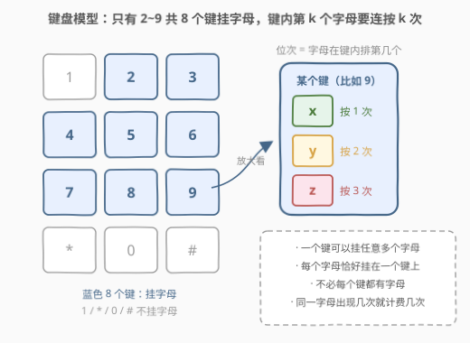
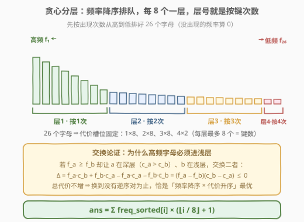
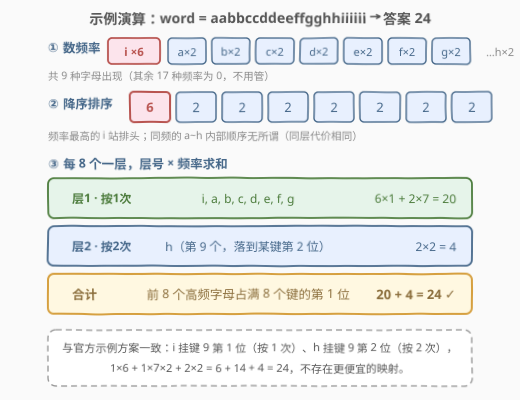

# 输入单词需要的最少按键次数II

- **题目名称**：输入单词需要的最少按键次数 II
- **链接**：[3016. 输入单词需要的最少按键次数 II](https://leetcode.cn/problems/minimum-number-of-pushes-to-type-word-ii/)
- **难度**：中等
- **标签**：贪心、哈希表、字符串、计数、排序

## 1. 题目概述

给你一个字符串 `word`，由小写英文字母组成。电话键盘上的按键与不同小写英文字母集合相映射，可以通过按压按键来组成单词：按键上第 1 个字母按 1 次输入，第 2 个字母按 2 次，第 3 个字母按 3 次，依此类推。

现在允许你把编号 `2` 到 `9` 的**共 8 个按键**重新映射到不同字母集合：

- 每个按键可以映射到**任意数量**的字母（也可以不映射任何字母）；
- 每个字母必须**恰好**映射到一个按键上。

返回输入 `word` 所需的**最少**按键次数。

**示例 1**：

```text
输入：word = "abcde"
输出：5
解释：a~e 分别挂在 5 个不同键的第 1 位，每个字母按 1 次即可。
```

**示例 2**：

```text
输入：word = "xyzxyzxyzxyz"
输出：12
解释：x/y/z 各出现 4 次，各挂一个键的第 1 位，总代价 4×1 + 4×1 + 4×1 = 12。
     注意键 9 可以空着——不必让每个键都有字母。
```

**示例 3**：

```text
输入：word = "aabbccddeeffgghhiiiiii"
输出：24
解释：i 出现 6 次占某键第 1 位；a~g 各出现 2 次占另外 7 个键的第 1 位；
     h 出现 2 次只能落到某键第 2 位（按 2 次）。
     总代价 = 6×1 + 2×7×1 + 2×2 = 24。
```

**约束条件**：

- $1 \le \text{word.length} \le 10^5$
- `word` 仅由小写英文字母组成

> ⚠️ 读题陷阱：① 不必让每个键都有字母，也不必让字母在键间均匀分布——**一个键挂 20 个字母也合法**，只是挂得越深按得越多；② 同一字母每次出现都要计费，所以「高频字母」才是优化重点；③ 只有 8 个键（2~9），$1/0/*/$ `#` 不挂字母。

---

## 2. 解题思路

### 2.1 暴力思路

把 26 个字母分到 8 个键上，每个键内部的字母还有先后次序（位次决定代价），方案总数是 $26!$ 量级的组合爆炸——哪怕 $n \le 10^5$ 只是用来计频率，搜索空间本身就把暴力判了死刑。

退一步的「结构化暴力」：注意到答案只与每个字母的**位次**有关（见下节），于是枚举「26 个频率到 26 个槽位」的全排列验证小数据——仍是 $26!$。必须挖出槽位结构，把指数级搜索压成一次排序。

### 2.2 核心观察：代价只看位次，槽位多重集固定，降序配对即最优



**观察一：键的身份不重要，位次才重要。** 设字母 $c$ 挂在某个键的第 $p$ 位，则它每次出现贡献 $p$ 次按键，总代价为

$$\text{ans} = \sum_{c} \text{freq}(c) \times \text{pos}(c)$$

具体挂在键 2 还是键 9 完全无关紧要——只要位次一样，代价就一样。

**观察二：槽位的代价多重集是固定的。** 8 个键中的每一个都能提供第 1 位、第 2 位、第 3 位……各一个槽，所以：

- 位次为 1 的槽恰好有 **8 个**（代价 1）；
- 位次为 2 的槽恰好有 **8 个**（代价 2）；
- 位次为 3 的槽恰好有 **8 个**（代价 3）；
- 位次为 4 的槽只剩 **2 个**（26 个字母 $= 8+8+8+2$）。

无论怎么映射，26 个字母拿到的代价多重集永远是 $\{1{\times}8,\ 2{\times}8,\ 3{\times}8,\ 4{\times}2\}$。问题从「设计键盘」坍缩成「**把 26 个频率指派给固定的代价槽**」——一个纯指派问题。

**观察三：重排不等式 / 交换论证定最优指派。** 要最小化 $\sum f_i \times c_i$，两组数应**逆序配对**：频率降序 × 代价升序。



用交换论证证明：若 $f_a \ge f_b$，却让 $a$ 占了深槽（$c_a > c_b$）、$b$ 占浅槽，交换二者后总代价变化

$$\Delta = f_a c_b + f_b c_a - f_a c_a - f_b c_b = (f_a - f_b)(c_b - c_a) \le 0$$

即交换后总代价**不增**。反复消去逆序对，最终局面「频率降序依次填槽」就是全局最优。

> 💡 **一句话算法**：频率降序排序，第 $i$ 个（0 下标）字母放进某键的第 $\lfloor i/8 \rfloor + 1$ 位，$\text{ans} \mathrel{+}= \text{freq}[i] \times (\lfloor i/8 \rfloor + 1)$。同频字母之间怎么排都一样（同层代价相同），所以答案与具体键位方案无关、唯一确定。

### 2.3 算法流程

```text
① 统计频率：freq[26] 一遍扫描计数           O(n)
② 降序排序：对 26 个频率排序                O(26 log 26)
③ 分层求和：ans += freq[i] * (i/8 + 1)     O(26)
```

三步全是平凡的线性/常数操作，没有回溯、没有搜索——核心洞察全在 2.2 的「槽位多重集固定」上。

### 2.4 示例演算



以示例 3 `word = "aabbccddeeffgghhiiiiii"` 走一遍：

| 步骤 | 内容 | 结果 |
|------|------|------|
| ① 计数 | `i×6`，`a~h` 各 `×2`（共 9 种字母出现） | freq = {i:6, a..h:2} |
| ② 降序 | 频率最高的 i 站排头 | [6, 2,2,2,2,2,2,2,2] |
| ③ 层 1（按 1 次） | 排序后第 0~7 个：i, a, b, c, d, e, f, g | $6 \times 1 + 2 \times 7 = 20$ |
| ③ 层 2（按 2 次） | 第 8 个：h 落到某键第 2 位 | $2 \times 2 = 4$ |
| 合计 | — | $20 + 4 = \mathbf{24}$ ✓ |

恰好与官方示例的映射一致（i 挂键 9 第 1 位、h 挂键 9 第 2 位）——贪心给出的不仅是最优**代价**，也直接还原出一种最优**方案**。

---

## 3. 参考代码

### C++（值域数组计数 + 降序排序）

```cpp
class Solution {
  public:
    int minimumPushes(string word) {
        int freq[26] = {0};                      // 26 个字母计数
        for (char c : word) ++freq[c - 'a'];

        sort(begin(freq), end(freq), greater<int>());  // 频率降序

        int ans = 0;
        for (int i = 0; i < 26; ++i)             // 前 8 个按 1 次，接着 8 个按 2 次……
            ans += freq[i] * (i / 8 + 1);
        return ans;                              // 最坏 4×10^5，int 足够
    }
};
```

### Python（Counter + 排序一行流）

```python
class Solution:
    def minimumPushes(self, word: str) -> int:
        freq = sorted(Counter(word).values(), reverse=True)
        return sum(f * (i // 8 + 1) for i, f in enumerate(freq))
```

> 💡 没出现的字母频率为 0，乘任何代价都是 0，排序时自然沉底，无需特判。C++ 版对整个 `freq[26]` 排序（含 0），Python 版 `Counter` 只含出现过的字母，两者等价。

---

## 4. 复杂度分析

| 维度 | 复杂度 | 说明 |
|------|--------|------|
| 时间复杂度 | $O(n + 26 \log 26)$ | 计数一遍 $O(n)$；对 26 个频率排序、分层求和均为常数级，整体即 $O(n)$ |
| 空间复杂度 | $O(26)$ | 计数数组大小恒为 26（哈希版为出现过的字母数，$\le 26$） |

其中 $n = \text{len(word)}$。瓶颈只在读入串计数，$n = 10^5$ 轻松通过。

---

## 5. 扩展：为什么不需要 Huffman 编码

「按键次数最小化」很容易让人联想到 **Huffman 编码**（高频符号配短码）。但本题**不需要**树形构造，直接分层即最优，原因有二：

1. **没有前缀约束**。Huffman 解决的是「任何码字不能是另一码字的前缀」，因为解码需要切分边界；而本题每个字母独立输入（连按同键 $p$ 次，输入完一个字母再输下一个），词与词之间的边界由人而不是码字结构决定——约束消失，Huffman 的「合并代价上浮」优势不复存在。
2. **代价结构是纯加法的固定槽位**。本题每个键提供任意位次的槽，代价多重集 $\{1{\times}8, 2{\times}8, \cdots\}$ 与映射方案无关，问题退化为线性指派，重排不等式一步到位；Huffman 的树槽代价集合（叶深）是构造出来的变量，两者问题结构不同。

**泛化**：若可用键数改为 $k$（字母表大小任意），公式直接变为 $\text{ans} = \sum_i \text{freq}[i] \times (\lfloor i/k \rfloor + 1)$——「每 $k$ 个一层」仍是重排不等式的逆序配对，代码只需把 `8` 换成 `k`。若再加「每个键最多挂 $m$ 个字母」的约束，层宽变为 $\min(k, \cdot)$ 的截断，思路不变。

---

## 6. 面试要点

1. **为什么频率降序填槽是最优的？怎么严格证明？**

   - 交换论证：任取频率 $f_a \ge f_b$ 但 $a$ 的代价槽更深（$c_a > c_b$）的一对字母，交换后总代价变化 $\Delta = (f_a - f_b)(c_b - c_a) \le 0$，不增。逆序对全部消去后的「降序×升序」配对就是最优——这正是**重排不等式**的逆序配对形态。

2. **代价槽位的数量为什么恰好是「每层 8 个」？**

   - 8 个键各自都能提供任意位次，所以位次 $p$ 的槽恰有 8 个（只要还有字母去占）。26 个字母按层填充得到 $\{1{\times}8, 2{\times}8, 3{\times}8, 4{\times}2\}$，与具体映射方案无关——这是把「设计键盘」坍缩成「指派问题」的关键一步。

3. **答案会不会溢出 int？要不要 long long？**

   - 26 个字母最多分 4 层，单字母代价 $\le 4$，总代价 $\le 4n \le 4 \times 10^5$，int（上限约 $2.1 \times 10^9$）绰绰有余。但若面试官把字母表放大/代价放大，乘积就可能越界——用 `long long` 累加是更稳的肌肉记忆。

4. **同频字母之间的顺序影响答案吗？具体的键位方案唯一吗？**

   - 不影响。同频字母在同一层内代价相同，互换无差；键位方案（哪个字母挂哪个键）也大量等价——答案只由「频率多重集 + 槽位多重集」决定，这也是为什么代码里连字母本身都不用保留，排序频率数组即可。

5. **题目里「每个键可以映射任意数量的字母」这个条件起了什么作用？**

   - 它保证了槽位多重集固定且「每层 8 个」随时可用——任何位次的槽都充足（8 键 × 任意深）。如果反过来限制「每键最多 3 个字母」，槽位多重集会变成 $\{1{\times}8, 2{\times}8, 3{\times}8\}$ 截断，26 个字母放不下，问题性质就变了。

---

## 7. 同类练习题

- [621. 任务调度器](https://leetcode.cn/problems/task-scheduler/)（[题解](../0601-0700/621_任务调度器.md)）：同款「频率 × 代价槽位」贪心框架，高频任务优先占便宜位置
- [767. 重构字符串](https://leetcode.cn/problems/reorganize-string/)（[题解](../0701-0800/767_重构字符串.md)）：按频率贪心安排放置位置，高频字母先占偶数位，思想同源
- [1648. 销售价值减少的颜色球](https://leetcode.cn/problems/sell-diminishing-valued-colored-balls/)：「按数量分层 × 单价递减求和」，分层计价手法的进阶应用
- [2870. 使数组为空的最少操作次数](https://leetcode.cn/problems/minimum-number-of-operations-to-make-array-empty/)：计数 + 按余数分类贪心，计数家族的另一道变形
