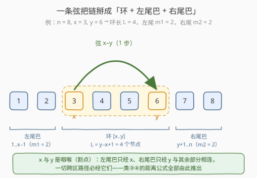
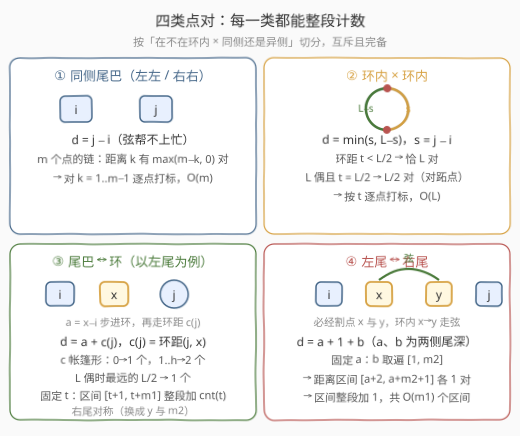
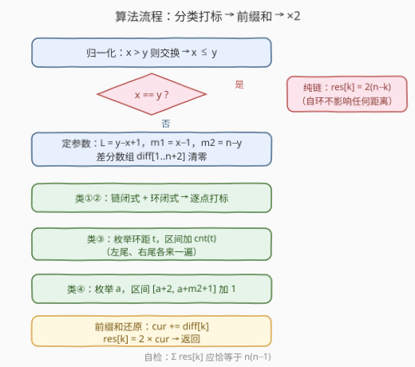
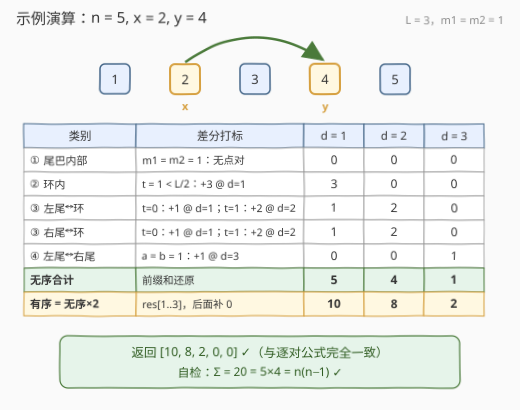

# LeetCode 按距离统计房屋对数目II 题解

## 1. 题目概述

- **标题 / 题号**：按距离统计房屋对数目 II（#3017，hard）
- **链接**：https://leetcode.cn/problems/count-the-number-of-houses-at-a-certain-distance-ii/
- **难度**：困难
- **标签**：图、前缀和、差分数组

**题意**：题意与 [3015. 按距离统计房屋对数目 I](https://leetcode.cn/problems/count-the-number-of-houses-at-a-certain-distance-i/) 完全相同，唯一区别是数据范围：`n` 从 $100$ 放大到 $10^5$。

给你三个**正整数** `n`、`x`、`y`。城市中存在编号从 `1` 到 `n` 的房屋，`n−1` 条街道把 `i` 与 `i+1`（`1 ≤ i < n`）顺次相连，排成一条链；**另有一条**街道连接编号为 `x` 与 `y` 的房屋（`x` 可以等于 `y`）。

对每个 `k`（`1 ≤ k ≤ n`），统计满足「从 `house₁` 到 `house₂` 最少经过的街道数为 `k`」的**有序房屋对** `[house₁, house₂]` 数量。返回下标从 1 开始、长度为 `n` 的数组 `result`。

**示例 1**：

```text
输入：n = 3, x = 1, y = 3
输出：[6,0,0]
解释：链 1–2–3 加上弦 1–3 构成三元环，任意两房之间距离都是 1，
     3 个无序对 × 2 = 6 个有序对。
```

**示例 2**：

```text
输入：n = 5, x = 2, y = 4
输出：[10,8,2,0,0]
解释：弦 2–4 把部分点对的距离缩短：距离 1 的有序对 10 个，
     距离 2 的 8 个，距离 3 的 2 个（详见 2.4 演算）。
```

**示例 3**：

```text
输入：n = 4, x = 1, y = 1
输出：[6,4,2,0]
解释：x = y 时额外边是自环，任何最短路都不会使用，退化为纯链：
     距离 k 的有序对 = 2×(n−k)。
```

**约束**：

- $2 \le n \le 10^5$
- $1 \le x, y \le n$

> ⚠️ 两个读题细节（同 3015）：**有序对**——`(1,2)` 与 `(2,1)` 各计一次，$\sum_k \text{result}[k] = n(n-1)$ 是最方便的自检不变式；**`x` 可以等于 `y`**——额外边是自环，等价于没有这条边。

## 2. 解题思路

### 2.1 暴力思路：把 3015 的解法原样搬过来会怎样

3015（$n \le 100$）的两条路——从每个源点跑一遍 BFS、或枚举所有点对套 $O(1)$ 闭式 $d = \min(j-i,\ |i-x|+1+|j-y|)$——时间都是 $O(n^2)$。本题 $n \le 10^5$：$O(n^2) \approx 10^{10}$ 次操作，超出时限约四个数量级，连「逐对进桶」这个动作本身都嫌多。

出路：**不再看每一个点对，改看每一类点对**。把全部 $\binom{n}{2}$ 个无序对按「与环 $[x, y]$ 的相对位置」切成少数几类，每一类的距离分布要么有闭式、要么是连续区间——用**差分数组**（区间 $[l, r]$ 整段加 $v$：`diff[l] += v; diff[r+1] -= v`，最后前缀和还原，见 [1109. 航班预订统计](https://leetcode.cn/problems/corporate-flight-bookings/)）批量打标，总时间 $O(n)$。

### 2.2 核心观察：环 + 两条尾巴，四类点对



不妨设 $x \le y$（边无向，交换无碍）。$x = y$ 是自环，直接退化纯链 `res[k] = 2(n−k)`。以下设 $x < y$，记三个区段：

- **环**：弦 $x$–$y$ 与链上 $x..y$ 段围成环，环节点数 $L = y - x + 1$；
- **左尾巴**：$1..x-1$，共 $m_1 = x - 1$ 个节点；**右尾巴**：$y+1..n$，共 $m_2 = n - y$ 个节点；
- $m_1 + L + m_2 = n$。

> 💡 **割点视角（类③④的根基）**：左尾巴与图的其余部分只通过边 $(x-1,\,x)$ 相连，右尾巴只通过 $(y,\,y+1)$ 相连——$x$、$y$ 是整张图的「咽喉」。任何跨区路径必经它们：左尾进环必过 $x$，右尾进环必过 $y$，左尾到右尾则两个都要过。



任何无序点对 $\{i, j\}$（$i < j$）按位置唯一落入下面四类，**互斥且完备**：

**① 同侧尾巴**（都在左尾或都在右尾）：弦完全帮不上忙（要绕弦得先进环再原路折返，白走冤枉路），$d = j - i$。$m$ 个节点的链上距离 $k$ 的无序对数是 $\max(m - k,\ 0)$——对 $k \in [1, m-1]$ 逐点打标，$O(m)$。

**② 环内点对**（$x \le i < j \le y$）：环上两点的距离是**两条弧取较短**，$d = \min(s,\ L - s)$，其中 $s = j - i \in [1, L-1]$。环的对称性给出闭式：环距 $t$ 的无序对数，当 $t < L/2$ 时**恰为 $L$**（每个节点在两侧各有一个环距 $t$ 的节点，$L \times 2 \div 2$）；$L$ 为偶数且 $t = L/2$ 时为 $L/2$（每个节点只剩唯一的**对跖点**）。$O(L)$ 逐点打标。

**③ 尾巴—环**（一侧尾巴 × 环内）：以左尾为例。左尾点 $i$ 到环内点 $j$ 必经 $x$ 进环，设 $a = x - i \in [1, m_1]$，则

$$d = a + c(j), \qquad c(j) = \min(j - x,\ y - j + 1)$$

其中 $c(j)$ 是 $j$ 在环上到入口 $x$ 的**环距**。$c$ 的取值分布是「帐篷形」：

| $c(j)$ | $0$ | $1$ | $\dots$ | $\lfloor (L-1)/2 \rfloor$ | $L/2$（$L$ 偶） |
|--------|-----|-----|---------|---------------------------|-----------------|
| 节点数 | $1$ | $2$ | $\dots$ | $2$ | $1$ |

（环上到定点的环距为 $t \ge 1$ 的节点两侧各一个共 2 个；唯独 $L$ 偶时最远的 $L/2$ 只有一个。）

**固定 $c(j) = t$**：让 $a$ 取遍 $[1, m_1]$，距离 $a + t$ 便取遍连续区间 $[t+1,\ t + m_1]$，且**每个距离恰好一个点对**——于是「每个 $t$ 做一次区间加」就把这一整类搞定：往 $[t+1,\ t+m_1]$ 整段加 $\mathrm{cnt}(t)$。右尾对称（入口换成 $y$、尾长换成 $m_2$，帐篷形相同）。

**④ 左尾—右尾**：必经割点 $x$ 与 $y$，中间那段是环上 $x \to y$ 的最短路——走弦，$1$ 步（$y - x \ge 1$）。于是连 $\min$ 都不用取：

$$d = a + 1 + b, \qquad a \in [1, m_1],\ b \in [1, m_2]$$

固定 $a$：$b$ 取遍 $[1, m_2]$，距离取遍区间 $[a+2,\ a + m_2 + 1]$ 各一个点对——区间加 1，共 $O(m_1)$ 个区间。

> 💡 **区间性从哪来**：类③④中固定一个自由参数（环距 $t$ 或尾深 $a$）后，距离 = 常数 + 另一个**连续取值**的参数，于是这一族点对的距离布满一段连续区间且每个距离恰一次。这是「把 $O(\text{点对数})$ 的计数压缩成 $O(\text{参数种数})$ 个区间加」的结构性原因，也是本题「前缀和」标签的真正含义（差分与前缀和互为逆运算）。

四类贡献先按**无序对**口径累加进差分数组，最后前缀和还原、统一 $\times 2$ 得有序对。

### 2.3 算法流程图



1. 若 $x > y$ 则交换；若 $x = y$，直接返回 `res[k] = 2(n−k)`；
2. 计算 $L$、$m_1$、$m_2$，`diff[1..n+2]` 清零；
3. **类①**：对两条尾巴分别把 $m - k$ 加到 `diff[k]`（$k = 1..m-1$）；
4. **类②**：按闭式给 `diff[t]` 加 $L$（或 $L/2$）；
5. **类③**：对左、右尾各一遍：$t = 0..\lfloor L/2 \rfloor$，把 $\mathrm{cnt}(t)$ 区间加到 $[t+1,\ t+m]$；
6. **类④**：$a = 1..m_1$，把 $1$ 区间加到 $[a+2,\ a+m_2+1]$；
7. 前缀和还原：`cur += diff[k]`，`res[k] = 2 × cur`；
8. 自检 $\sum \text{res} = n(n-1)$ 后返回。

### 2.4 示例演算



以示例 2 `n = 5, x = 2, y = 4`（$L = 3$，$m_1 = m_2 = 1$；左尾 $\{1\}$、环 $\{2,3,4\}$、右尾 $\{5\}$）：

| 类 | 差分打标 | d=1 | d=2 | d=3 |
|----|----------|-----|-----|-----|
| ① 尾巴内部 | $m_1 = m_2 = 1$：无点对 | 0 | 0 | 0 |
| ② 环内 | $t = 1 < L/2 = 1.5$：+3 | 3 | 0 | 0 |
| ③ 左尾↔环 | $t=0$：+1；$t=1$：+2 | 1 | 2 | 0 |
| ③ 右尾↔环 | $t=0$：+1；$t=1$：+2 | 1 | 2 | 0 |
| ④ 左尾↔右尾 | $a = b = 1$：+1 | 0 | 0 | 1 |
| **无序合计** | 前缀和还原 | **5** | **4** | **1** |
| **有序 = ×2** | | **10** | **8** | **2** |

距离 4、5 无点对，补 0 得 `[10, 8, 2, 0, 0]` ✓；$\sum = 20 = 5 \times 4$ ✓。与 3015 中逐对套公式算出的距离表逐项一致——四类分法没有漏掉任何点对。

## 3. 参考代码

### C++（分类 + 差分，O(n)）

```cpp
class Solution {
  public:
    vector<long long> countOfPairs(int n, int x, int y) {
        if (x > y) swap(x, y);                 // 统一 x <= y（边无向）
        vector<long long> res(n);
        if (x == y) {                          // 自环：退化纯链
            for (int k = 1; k <= n; ++k) res[k - 1] = 2LL * (n - k);
            return res;
        }
        int L = y - x + 1, m1 = x - 1, m2 = n - y;      // 环长、两条尾巴
        vector<long long> diff(n + 2);
        auto add = [&](int l, int r, long long v) {     // [l, r] 区间加 v
            if (l > r || l > n) return;
            r = min(r, n);
            diff[l] += v;
            diff[r + 1] -= v;
        };

        for (int m : {m1, m2})                 // 类①：同侧尾巴
            for (int k = 1; k < m; ++k) add(k, k, m - k);

        if (L % 2 == 1)                        // 类②：环内点对
            for (int t = 1; t <= L / 2; ++t) add(t, t, L);
        else {
            for (int t = 1; t < L / 2; ++t) add(t, t, L);
            add(L / 2, L / 2, L / 2);          // 对跖点
        }

        int h = (L - 1) / 2;                   // 类③：尾巴 <-> 环
        for (int m : {m1, m2}) {
            if (m == 0) continue;
            add(1, m, 1);                      // c = 0：入口本身
            for (int t = 1; t <= h; ++t) add(t + 1, t + m, 2);
            if (L % 2 == 0) add(L / 2 + 1, L / 2 + m, 1);  // 对跖点
        }

        if (m1 >= 1 && m2 >= 1)                // 类④：左尾 <-> 右尾
            for (int a = 1; a <= m1; ++a) add(a + 2, a + 1 + m2, 1);

        long long cur = 0;
        for (int k = 1; k <= n; ++k) {         // 前缀和还原，×2 变有序
            cur += diff[k];
            res[k - 1] = 2 * cur;
        }
        return res;
    }
};
```

### Python（分类 + 差分，O(n)）

```python
class Solution:
    def countOfPairs(self, n: int, x: int, y: int) -> List[int]:
        if x > y:
            x, y = y, x                        # 统一 x <= y（边无向）
        if x == y:                             # 自环：退化纯链
            return [2 * (n - k) for k in range(1, n + 1)]

        L, m1, m2 = y - x + 1, x - 1, n - y    # 环长、两条尾巴
        diff = [0] * (n + 2)

        def add(l, r, v):                      # [l, r] 区间加 v
            if l > r or l > n:
                return
            diff[l] += v
            diff[min(r, n) + 1] -= v

        for m in (m1, m2):                     # 类①：同侧尾巴
            for k in range(1, m):
                add(k, k, m - k)

        if L % 2 == 1:                         # 类②：环内点对
            for t in range(1, L // 2 + 1):
                add(t, t, L)
        else:
            for t in range(1, L // 2):
                add(t, t, L)
            add(L // 2, L // 2, L // 2)        # 对跖点

        h = (L - 1) // 2                       # 类③：尾巴 <-> 环
        for m in (m1, m2):
            if m == 0:
                continue
            add(1, m, 1)                       # c = 0：入口本身
            for t in range(1, h + 1):
                add(t + 1, t + m, 2)
            if L % 2 == 0:
                add(L // 2 + 1, L // 2 + m, 1)  # 对跖点

        if m1 >= 1 and m2 >= 1:                # 类④：左尾 <-> 右尾
            for a in range(1, m1 + 1):
                add(a + 2, a + 1 + m2, 1)

        res, cur = [], 0
        for k in range(1, n + 1):              # 前缀和还原，×2 变有序
            cur += diff[k]
            res.append(2 * cur)
        return res
```

> 💡 **溢出提醒**：单个 $\text{res}[k] \le 2(n-1)$ 并不溢出 `int`，但前缀和中间量 `cur` 会一路累计到 $n(n-1)/2 \approx 5 \times 10^9$，超过 `int32`；C++ 中间数组与返回类型（官方签名即 `vector<long long>`）都必须用 `long long`，Python 天然无碍。
>
> 💡 **对拍自检**：本地用 3015 的 $O(n^2)$ 公式枚举或 BFS 做暴力，对 $n \le 8$ 的全部 $(x, y)$ 组合与随机大 $n$ 对拍，并断言 $\sum \text{res} = n(n-1)$——四类分法一旦漏类或多算，这两个检查立刻报警。

## 4. 复杂度分析

| 维度 | 复杂度 | 说明 |
|------|--------|------|
| 时间复杂度 | $O(n)$ | 类① $O(m_1) + O(m_2)$、类② $O(L)$、类③ $O(L + m_1 + m_2)$ 个区间、类④ $O(m_1)$ 个区间，均为不超过 $n$ 的线性扫描；外加一次 $O(n)$ 前缀和 |
| 空间复杂度 | $O(n)$ | 差分数组 `diff` 与答案数组（返回值不计） |

$n = 10^5$ 实测毫秒级完成，对比暴力 $O(n^2) \approx 10^{10}$——结构分析换来的加速是实打实的四个数量级。

## 5. 扩展：官方 hint 的「基线修正」视角

官方提示给出另一条等价路线：先假设没有弦——纯链上距离 $k$ 的有序对恰有 $2(n-k)$ 个（hint 1）；再对每一类「被弦缩短」的点对做**修正**：旧距离 $-2$、新距离 $+2$（hint 3），修正量同样按区间批量打标（hint 4）。两种视角殊途同归：

- 本文的「**从零构造**」按四类直接累加，不用区分「谁被缩短了、缩到多少」；
- 「**基线修正**」起点更显然（纯链公式张口就来），但修正项的分类更绕。

面试时两个视角都点一句——「先给纯链基线，再按结构分四类重算」，层次感立刻出来。

再多给一条弦还行吗？一般不行——两条弦会把图变成「环环相扣」的复杂形态，环距不再有帐篷形闭式，只能退回逐源 BFS $O(n^2)$（带权时 Dijkstra）。本题的 $O(n)$ 完全建立在「**恰好一条弦**」的特殊结构上；识别「结构特殊 → 值得特化」与「结构一般 → 退回通用算法」的边界，正是这道题想训练的判断力。

## 6. 面试要点

1. **四类分法为什么完备且互斥？**

   - 任何点对（$i < j$）按「$i$ 在不在环内 × $j$ 在不在环内 + 同侧还是异侧」唯一落入：同侧尾巴（左左/右右）、环内×环内、尾巴↔环（左环/右环）、异侧尾巴（左右）。$m_1 + L + m_2 = n$ 保证不重不漏；用 $\sum \text{res} = n(n-1)$ 兜底自检。

2. **为什么左尾↔右尾必经 $x$ 和 $y$？**

   - 删除 $x$ 后左尾巴与图断开（$x$ 是割点）、删除 $y$ 后右尾断开。任何左尾→右尾的路径必须依次穿过 $x$ 与 $y$，中间一段是环上 $x \to y$ 的最短路 = 弦 1 步，故 $d = a + 1 + b$，连 $\min$ 都不用取。

3. **环距 $t$ 的对数为什么是 $L$（或 $L/2$）？**

   - 环上每个点到定点的环距为 $t$（$t < L/2$）的点恰有 2 个（沿两个方向各走 $t$ 步），$L$ 个点 × 2 ÷ 2（无序）= $L$；$t = L/2$（$L$ 偶）时两个方向到达同一点（对跖点），只剩 $L/2$ 对。

4. **类③的「区间性」是怎么发现的？**

   - 固定环距 $c(j) = t$ 后，距离 $= a + t$ 随 $a \in [1, m_1]$ 连续取遍 $[t+1, t+m_1]$，且每个距离恰一对。「一个自由参数 → 一段连续距离区间」是差分批量计数的信号；若两个参数都以非单位系数影响距离，区间性就没了，得另寻结构。

5. **`x == y` 和 `x == y−1` 两个边界怎么处理？**

   - `x == y`：自环，任何最短路都不用，直接返回纯链公式 $2(n-k)$；`x == y−1`（弦连相邻两点，$L = 2$）：**无需特判**——类②给 $(x, y)$ 距离 1，类③的 $c$ 只取 $\{0, 1\}$，类④的 $d = a+1+b$ 与不走弦时相同，公式自动退化。

6. **中间量会溢出吗？**

   - 单个 `res[k]` 不溢 `int`，但差分前缀和 `cur` 累计到 $n(n-1)/2 \approx 5 \times 10^9$ 超出 `int32`。C++ 的中间数组与返回值用 `long long`；Python 无此顾虑。

## 同类练习题

| # | 题目 | 与本题的关联 |
|---|------|-------------|
| 3015 | [按距离统计房屋对数目 I](https://leetcode.cn/problems/count-the-number-of-houses-at-a-certain-distance-i/)（[题解](../3001-3100/3015_按距离统计房屋对数目I.md)） | 同一道题的小数据版，先掌握 $O(1)$ 距离闭式与 BFS 保底，再来看 $O(n)$ 差分 |
| 1184 | [公交站间的距离](https://leetcode.cn/problems/distance-between-bus-stops/)（[题解](../1101-1200/1184_公交站间的距离.md)） | 环上两点距离 = 两条弧取较短，类② 的热身 |
| 1109 | [航班预订统计](https://leetcode.cn/problems/corporate-flight-bookings/)（[题解](../1101-1200/1109_航班预订统计.md)） | 差分数组区间加的模板题，类③④ 的核心工具 |
| 1526 | [形成目标数组的子数组最少增加次数](https://leetcode.cn/problems/minimum-number-of-increments-on-subarrays-to-form-a-target-array/)（[题解](../1501-1600/1526_形成目标数组的子数组最少增加次数.md)） | 差分求「相邻差值」的进阶应用，再体会差分与前缀和互逆 |
