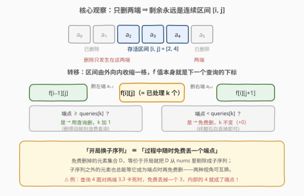
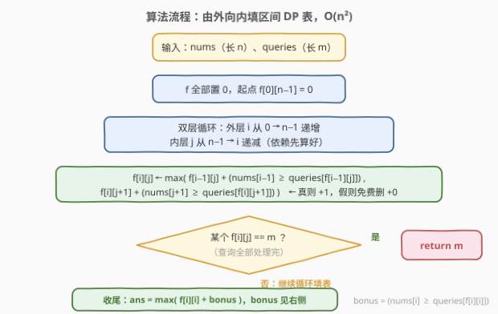

# LeetCode 可处理的最大删除操作数 I 题解

## 1. 题目概述

- **标题 / 题号**：可处理的最大删除操作数 I（#3018，hard）
- **链接**：https://leetcode.cn/problems/maximum-number-of-removal-queries-that-can-be-processed-i/
- **难度**：困难
- **标签**：数组、动态规划、区间 DP

> ⚠️ 本题为 LeetCode 付费题，题意描述根据官方示例用例与 hints 重建，可能与官方题面有出入。

**题意**：给定下标从 0 开始的数组 `nums` 和 `queries`。开始时可以执行以下操作**最多一次**：

- 用 `nums` 的**子序列**替换 `nums`。

随后按 `queries` 的给定顺序处理查询；对于 `queries[i]`：

- 如果 `nums` 的第一个**和**最后一个元素都**小于** `queries[i]`（数组为空时同样无法处理），则查询处理**结束**；
- 否则，从 `nums` 中选择第一个**或**最后一个元素（要求其**大于或等于** `queries[i]`）并将其**删除**。

返回通过以最佳方式执行操作，最多能处理的查询数。

**示例 1**：

```text
输入：nums = [1,2,3,4,5], queries = [1,2,3,4,6]
输出：4
解释：不执行操作，依次删除 1,2,3,4；第 5 个查询 6 面对唯一的端点 5，5 < 6 删不动，停止。
```

**示例 2**：

```text
输入：nums = [2,3,2], queries = [2,2,3]
输出：3
解释：依次删除左 2、右 2、3，三个查询全部处理完。
```

**示例 3**：

```text
输入：nums = [3,4,3], queries = [4,3,2]
输出：2
解释：先把 nums 替换成子序列 [4,3]：查询 4 删掉 4，查询 3 删掉 3。
      若不替换，第一个查询 4 面对两端 3、3，立刻卡死，答案 0。
```

**约束**：

- $1 \le \text{nums.length} \le 1000$
- $1 \le \text{queries.length} \le 1000$
- $1 \le \text{nums}[i], \text{queries}[i] \le 10^9$

## 2. 解题思路

### 2.1 暴力思路

最直观的做法：枚举 `nums` 的全部 $2^n$ 个子序列，对每个子序列模拟查询处理——每一步若有多个可删端点就分支搜索所有选择。总复杂度是指数级，$n = 1000$ 下完全不可行。

两个观察可以把两层指数一起干掉：

1. **删除只发生在两端** ⇒ 任意时刻剩余元素永远是原数组的**连续区间** $[i, j]$——子序列的具体形态不重要，重要的只有区间的边界；
2. **「开局换子序列」可以被吸收进 DP**——见下节。

### 2.2 核心观察：两端删除 +「免费删」的区间 DP



**观察 1：状态是区间。** 每次删除只取首或尾，所以剩余集合从完整的 $[0, n-1]$ 出发，每次收缩一格，任意时刻都是连续区间 $[i, j]$，共 $O(n^2)$ 个状态。

**观察 2：换子序列 $\iff$ 随时可以「免费删」一个端点。** 把过程中免费丢掉的元素集合记为 $D$，这等价于开局就把 $D$ 剔除（即选子序列 $\text{nums} \setminus D$）：被剔除的元素只会让两端「更早变深」，不影响其余删除的合法性；反过来，开局选定的子序列之外的所有元素，也可以等它们成为端点时再逐个免费删。于是「开局一次性换子序列」可以规范成 DP 中的一种**零代价转移**。

**规范化（交换论证）**：免费删只在「待处理查询删不动该端」时才需要——若端点 $e \ge q$（当前查询）却想免费删它，不如直接用 $q$ 删掉 $e$（多处理一个查询），再把原本留给 $q$ 的那个元素改为免费删，删除集合不变、处理数不减；若 $q$ 之后什么都不删，用 $q$ 删 $e$ 还能净赚一步。因此转移里**条件为真时一律 $+1$，为假时一律 $+0$**，不会漏掉最优解。

**状态定义**：$f[i][j]$ = 数组恰好收缩到区间 $[i, j]$ 时，**已处理的最大查询数** $k$。此时下一个待处理的查询正是 $\text{queries}[f[i][j]]$——**dp 值本身就是查询下标**，这是本题状态设计最「反直觉」的一步。

**转移**（区间由外向内逐格收缩，$f[0][n-1] = 0$ 为起点）：

$$f[i][j] = \max\begin{cases} f[i-1][j] + \big(\text{nums}[i-1] \ge \text{queries}[f[i-1][j]]\big) & \text{删左端（真：查询删 } +1\text{；假：免费删 } +0\text{）}\\[4pt] f[i][j+1] + \big(\text{nums}[j+1] \ge \text{queries}[f[i][j+1]]\big) & \text{删右端（同理）} \end{cases}$$

**答案收集**：区间只剩一个元素 $[i, i]$ 时，它既是首也是尾，还能再吃一个查询（条件 $\text{nums}[i] \ge \text{queries}[f[i][i]]$ 时 $+1$），删完即空、过程终止：

$$\text{ans} = \max_{0 \le i < n}\ f[i][i] + \big(\text{nums}[i] \ge \text{queries}[f[i][i]]\big)$$

中途任何 $f[i][j] = m$ 说明全部查询处理完，直接返回 $m$。

> 💡 **为什么答案只看单元素区间？** 若过程在较宽的区间上「卡住」（两端都小于待处理查询），免费删可以继续把两端白丢掉、$k$ 不会减少，一路退到单元素甚至空——所以卡住状态的收益已被 $\max f[i][i] + \text{bonus}$ 覆盖，无需单独枚举。

> ⚠️ **循环顺序**：$f[i][j]$ 依赖上一行的 $f[i-1][j]$ 和本行更靠右的 $f[i][j+1]$，因此外层 $i$ 递增、内层 $j$ 从 $n-1$ 向 $i$ 递减，保证依赖先算好。

### 2.3 算法流程图



双层循环填表，每个状态 $O(1)$ 转移；提前命中 $f = m$ 即刻返回，否则收尾扫一遍单元素区间加上 bonus。

### 2.4 示例演算

![示例演算：nums=[3,4,3]](../images/p3018_example_walkthrough.svg)

以示例 3 `nums = [3,4,3], queries = [4,3,2]` 走完整流程——本题的精髓全在第一步的**免费删**：

| 步骤 | 待处理查询 | 剩余区间 | 动作 | 已处理 $k$ |
|------|-----------|---------|------|-----------|
| 初始 | $\text{queries}[0]=4$ | $[0,2]$：`3 4 3` | 两端 $3,3 < 4$，查询删不动 | 0 |
| ① | $\text{queries}[0]=4$ | $[1,2]$：`4 3` | **免费删**左端 3（对应开局取子序列 $[4,3]$） | 0 |
| ② | $\text{queries}[0]=4$ | $[2,2]$：`3` | $4 \ge 4$，用查询删左端 4 | 1 |
| ③ | $\text{queries}[1]=3$ | 空 | $3 \ge 3$，用查询删 3 | 2 |
| 收尾 | $\text{queries}[2]=2$ | 空 | 空数组无法继续 | 答案 2 ✓ |

DP 视角：$f[1][2] = 0$（免费删）$\to f[2][2] = 1$（查询删 4）$\to$ bonus：$\text{nums}[2]=3 \ge \text{queries}[1]=3$，得 2。对照不开局替换的版本：第一查询 4 面对两端 $3,3$ 直接卡死，答案 0——**免费删把「内部元素」4 救成了「端点」**，这正是子序列操作的全部价值。

## 3. 参考代码

### C++

```cpp
class Solution {
  public:
    int maximumProcessableQueries(vector<int>& nums, vector<int>& queries) {
        int n = nums.size(), m = queries.size();
        // f[i][j]：数组恰好收缩到 [i, j] 时已处理的最大查询数
        vector f(n, vector<int>(n, 0));
        for (int i = 0; i < n; i++) {
            for (int j = n - 1; j >= i; j--) {
                if (i > 0)  // 左端回退：nums[i-1] 用下一个查询删(+1)，删不动则免费删(+0)
                    f[i][j] = max(f[i][j],
                        f[i - 1][j] + (nums[i - 1] >= queries[f[i - 1][j]] ? 1 : 0));
                if (j + 1 < n)  // 右端回退：同理处理 nums[j+1]
                    f[i][j] = max(f[i][j],
                        f[i][j + 1] + (nums[j + 1] >= queries[f[i][j + 1]] ? 1 : 0));
                if (f[i][j] == m) return m;  // 查询全部处理完，提前收工
            }
        }
        int ans = 0;
        for (int i = 0; i < n; i++)  // 单元素区间还能再吃一个查询
            ans = max(ans, f[i][i] + (nums[i] >= queries[f[i][i]] ? 1 : 0));
        return ans;
    }
};
```

### Python

```python
class Solution:
    def maximumProcessableQueries(self, nums: List[int], queries: List[int]) -> int:
        n, m = len(nums), len(queries)
        f = [[0] * n for _ in range(n)]  # f[i][j]：收缩到 [i, j] 时已处理的最大查询数
        for i in range(n):
            for j in range(n - 1, i - 1, -1):
                if i:  # 左端回退：查询删(+1) 或 免费删(+0)
                    f[i][j] = max(f[i][j], f[i - 1][j] + (nums[i - 1] >= queries[f[i - 1][j]]))
                if j + 1 < n:  # 右端回退：同理
                    f[i][j] = max(f[i][j], f[i][j + 1] + (nums[j + 1] >= queries[f[i][j + 1]]))
                if f[i][j] == m:
                    return m  # 查询全部处理完，提前收工
        return max(f[i][i] + (nums[i] >= queries[f[i][i]]) for i in range(n))
```

> 💡 `f == m` 的提前返回同时保证了后续所有 `queries[f[...]]` 下标安全：任何等于 $m$ 的 $f$ 值一旦产生就立刻返回，被使用的 $f$ 恒小于 $m$。

## 4. 复杂度分析

| 维度 | 复杂度 | 说明 |
|------|--------|------|
| 时间复杂度 | $O(n^2)$ | $n^2$ 个区间状态，每个 $O(1)$ 转移；$n \le 1000$ 约 $10^6$ 次运算 |
| 空间复杂度 | $O(n^2)$ | 二维 dp 表；区间由外向内收缩，无法像普通区间 DP 那样滚动掉一维 |

> 💡 转移只读「上一行 $i-1$」和「本行右侧 $j+1$」，理论上可以滚动数组压到 $O(n)$，但会牺牲可读性，$n \le 1000$ 下没必要。

## 5. 扩展：如果没有「换子序列」操作

去掉开局替换（即没有免费删），问题会变得更简单也更「死」：转移里条件为假的分支直接不合法（不可达），dp 表中大量状态为 $-\infty$，答案也不再是 $\max f[i][i] + \text{bonus}$，而是**所有可达状态的最大 $f$ 值**——因为一旦卡住，过程当场终止，没有免费删兜底。

以示例 3 对比：无替换版本在 $[0,2]$ 面对查询 4 时两端 $3,3$ 删不动，答案直接为 0；有替换版本答案 2。可以看到「换子序列」才是本题真正的考点：它把「删不掉的绊脚石」变成可以白丢的代价，让区间的收缩路径重新连通。

另一个值得体会的点：本题把**「已处理查询数」当作 dp 值、用 dp 值本身索引下一个查询**，而不是更常见的「把查询编号塞进状态」。若真的把 $k$ 塞进状态则需 $O(n^2 m)$——$10^9$ 级别直接超时；依赖「同一区间下更大的 $k$ 不会更差」的单调性（可通过随机对拍验证）才能压回 $O(n^2)$，这是本题定为困难的核心原因。

## 6. 面试要点

1. **为什么剩余元素一定是原数组的连续区间？**

   - 删除只能取当前数组的首或尾，从完整区间 $[0, n-1]$ 出发每次收缩一格边界，归纳可知任意时刻剩余集合都是连续区间——这才允许用 $O(n^2)$ 个区间状态覆盖指数级的子序列选择。

2. **「开局换一次子序列」这个操作怎么融进 DP？**

   - 等价于「过程中随时可以免费删掉一个端点」：免费删掉的元素集合 $D$ 换成开局剔除即可，反之亦然。再用交换论证规范化：仅当待处理查询删不动该端时才免费删，否则一律用查询删——所以转移就是一个布尔加法。

3. **转移里 `queries[f[i-1][j]]` 拿 dp 值当数组下标，不怕越界吗？**

   - 任何 $f$ 值一旦等于 $m$ 就提前 `return m`，因此参与转移的 $f$ 恒 $< m$，下标天然安全。这个提前返回既是剪枝也是边界保护。

4. **答案为什么取 $\max\big(f[i][i] + \text{bonus}\big)$，而不是所有 $f[i][j]$ 的最大值？**

   - 卡在宽区间上时，免费删可以继续白丢两端、$k$ 不减，最终退到单元素区间；单元素既是首也是尾，还能再处理一个查询，之后数组为空必须停止。所以单元素区间的收集公式已覆盖所有终局。

5. **同一区间可能以不同的 $k$ 到达，只保留最大的 $k$ 合并，为什么安全？**

   - 直觉上：到达同一区间意味着删掉了同一批外围元素，$k$ 更大说明把更多外围元素交给了查询去删、进度更靠前，局面不会更差。严格证明较繁琐，工程上可用「暴力枚举子序列 + 分支模拟」与 DP 随机对拍验证一致性（本文实现已对拍数千组）。

## 同类练习题

| # | 题目 | 与本题的关联 |
|---|------|-------------|
| 1770 | [执行乘法运算的最大分数](https://leetcode.cn/problems/maximum-score-from-performing-multiplication-operations/) | 同为「每步从首或尾取数」的区间 DP，$[i,j]$ 状态设计的直系模板题 |
| 877 | [石子游戏](https://leetcode.cn/problems/stone-game/) | 两端取数的博弈型区间 DP 入门（本库已收录题解） |
| 1690 | [石子游戏 VII](https://leetcode.cn/problems/stone-game-vii/) | 两端取数 + 前缀和优化的区间博弈，转移方向与本题同款 |
| 1039 | [多边形三角剖分的最低得分](https://leetcode.cn/problems/minimum-score-triangulation-of-polygon/) | 经典区间 DP，体会「由外向内 / 由内向外」两种填表方向 |
| 1547 | [切棍子的最小成本](https://leetcode.cn/problems/minimum-cost-to-cut-a-stick/) | 区间 DP + 端点虚拟化（两端各补一个哨兵），与本题「边界回退一格」的转移如出一辙 |
