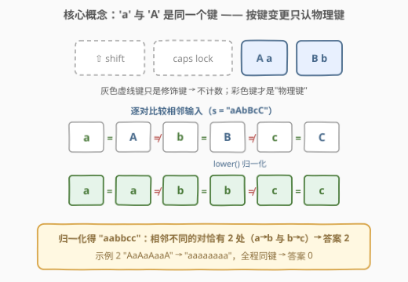
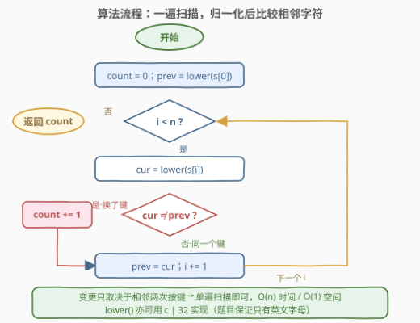
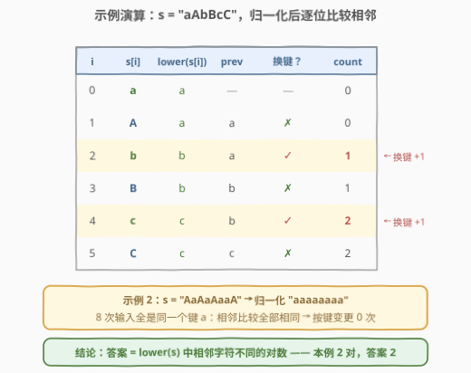

# 按键变更的次数

- **题目名称**：按键变更的次数
- **链接**：[3019. 按键变更的次数](https://leetcode.cn/problems/number-of-changing-keys/)
- **难度**：简单
- **标签**：字符串

## 1. 题目概述

给你一个下标从 **0** 开始的字符串 `s`，由用户输入产生。**按键变更**的定义是：使用与**上一次使用的按键不同**的键。例如 `s = "ab"` 发生一次按键变更，而 `s = "bBBb"` 不存在按键变更。

返回用户输入过程中按键变更的次数。

**注意**：`shift` 或 `caps lock` 等修饰键**不计入**按键变更——也就是说，先输入 `'a'` 再输入 `'A'` 不算按键变更。

**示例 1**：

```text
输入：s = "aAbBcC"
输出：2
解释：
  'a' → 'A'：同一个键（大小写由 caps lock/shift 决定），不变更
  'A' → 'b'：按键变更
  'b' → 'B'：同一个键，不变更
  'B' → 'c'：按键变更
  'c' → 'C'：同一个键，不变更
  共 2 次按键变更。
```

**示例 2**：

```text
输入：s = "AaAaAaaA"
输出：0
解释：全程只按 'a'/'A' 对应的同一个键，不存在按键变更。
```

**约束条件**：

- $1 \le \text{s.length} \le 100$
- `s` 仅由英文大写和小写字母组成

> ⚠️ 唯一的读题陷阱：**大小写不算换键**。`'a'` 与 `'A'` 是同一个物理键，大小写差异来自 `shift` / `caps lock` 这些修饰键，而修饰键不计入。若直接比较原字符，示例 1 会误得 4 而不是 2。

---

## 2. 解题思路

### 2.1 暴力思路

按题意模拟：从头到尾扫描，维护「上一次按的键」，每读一个字符就与上一个字符比较，不是同一个键就计数 +1。判定本身是 $O(1)$ 的，整个模拟自然是一次遍历 $O(n)$——本题的「暴力」与最优解同构，唯一的坑在「同一个键」怎么判。

**错误示范**（不做归一化直接比较原字符）：

```python
def countKeyChanges(self, s: str) -> int:
    return sum(s[i] != s[i - 1] for i in range(1, len(s)))  # 错！
```

对 `"aAbBcC"` 它数出 4 对不同（`a≠A`、`A≠b`、`b≠B`、`B≠c`、`c≠C` 中前四处原字符不同），而正确答案只有 2。错因：把 `'a'→'A'` 这种「同键异形」的切换误判成了换键。

### 2.2 核心观察：大小写归一化 + 数相邻不同



两个关键事实：

1. **判定只依赖相邻两次输入**——第 $i$ 次是否换键，只取决于 $s[i-1]$ 与 $s[i]$ 是否同一个键，与更早的历史无关。所以答案是纯粹的**局部计数**：

$$\text{ans}=\#\{\,i : \text{lower}(s[i]) \ne \text{lower}(s[i-1]),\ 1 \le i \le n-1\,\}$$

2. **"同一个键" = 忽略大小写**。ASCII 中 `'A'`~`'Z'` 是 $65\sim90$，`'a'`~`'z'` 是 $97\sim122$，同一字母大小写恰差 $32 = 0x20$。把每个字符**归一化成小写**（`tolower` 或 `c | 0x20`）后再比较，`'a'` 与 `'A'` 就视作同一个键了。

> 💡 归一化后问题退化为：**数 `lower(s)` 中相邻字符不同的对数**——一个标准的「一遍扫描 + 计数」签到模型。

### 2.3 算法流程图



流程一句话：`prev` 初始化为 `lower(s[0])` → 从 $i=1$ 扫到 $n-1$，每次算 `cur = lower(s[i])`，`cur ≠ prev` 则计数 +1 → 更新 `prev = cur` → 扫完返回计数。不需要哈希、不需要 DP，一个计数器加一个「上一次的键」就够了。

### 2.4 示例演算



以 `s = "aAbBcC"` 走一遍：归一化得 `"aabbcc"`，相邻比较为 `=` `≠` `=` `≠` `=`，两个 `≠` 分别出现在 `a→b` 与 `b→c` 处，答案 **2**。再看示例 2 `"AaAaAaaA"`：归一化 `"aaaaaaaa"`，8 个字符同一个键，全程无变更，答案 **0**。

---

## 3. 参考代码

### C++（`tolower` 版）

```cpp
class Solution {
  public:
    int countKeyChanges(string s) {
        int ans = 0;
        for (int i = 1; i < (int)s.size(); ++i)
            if (tolower(s[i]) != tolower(s[i - 1])) ++ans;
        return ans;
    }
};
```

### C++（位运算版）

```cpp
class Solution {
  public:
    int countKeyChanges(string s) {
        int ans = 0;
        for (int i = 1; i < (int)s.size(); ++i)
            ans += ((s[i] | 32) != (s[i - 1] | 32));
        return ans;
    }
};
```

### Python（索引版）

```python
class Solution:
    def countKeyChanges(self, s: str) -> int:
        t = s.lower()
        return sum(t[i] != t[i - 1] for i in range(1, len(t)))
```

### Python（`pairwise` 一行版，Python 3.10+）

```python
from itertools import pairwise

class Solution:
    def countKeyChanges(self, s: str) -> int:
        return sum(a != b for a, b in pairwise(s.lower()))
```

> 💡 位运算版里 `s[i] | 32`：题目保证只有英文字母，大写字母第 5 位（值 $32$）为 0、小写为 1，或上 32 即统一到小写视角。注意这一技巧**只对字母安全**（如 `'@' | 32` 会变成 `` '`' ``），通用场景请用 `tolower`。

---

## 4. 复杂度分析

| 维度 | 复杂度 | 说明 |
|------|--------|------|
| 时间复杂度 | $O(n)$ | 一遍扫描，每个字符做一次 $O(1)$ 的归一化与比较；$n \le 100$ 实际是常数级 |
| 空间复杂度 | $O(1)$ | C++ 与 Python 索引版只用常数变量；Python 的 `s.lower()` 与 `pairwise` 一行版会产生 $O(n)$ 的新串，属语言层面的便利开销 |

---

## 5. 扩展：归一化的三种姿势

本题的「灵魂操作」是把大小写归一化，面试时可展示三种实现：

1. **库函数**：C++ `tolower(c)` / Python `str.lower()`——可读性最好，首选；
2. **位运算**：`c | 0x20`——利用大小写仅差第 5 位的 ASCII 结构，置 1 统一到小写（仅字母安全，本题成立）；
3. **分支版**：`c >= 'A' && c <= 'Z' ? c + 32 : c`——即 [709. 转成小写字母](https://leetcode.cn/problems/to-lower-case/) 要求手撕的实现，`+32` 与 `| 0x20` 在「该位原本为 0」的前提下等价。

顺手记住两个邻居：`c & ~0x20`（或 `c & 0xDF`）统一到大写视角；`c ^ 0x20` 大小写互换。它们共同的基础是 ASCII 用一个 bit 位编码大小写这一设计。

---

## 6. 面试要点

1. **`'a'` → `'A'` 为什么不算按键变更？**

   - 两者对应同一个物理字母键，大小写差异由 `shift` / `caps lock` 修饰键产生，而题目规定修饰键不计入。因此比较前必须先做大小写归一化。

2. **`c | 0x20` 为什么能统一大小写？什么时候不安全？**

   - ASCII 中同一字母大小写相差 $0x20$（第 5 位）：大写该位为 0、小写为 1，置 1 后都映射到小写。它只对英文字母保证正确，本题约束恰好如此；输入含任意字符时应改用 `tolower`。

3. **为什么单遍扫描就够，不需要 DP 或哈希？**

   - 换键判定只依赖**相邻**两次输入（当前键 vs 上一键），计数具有局部性；不存在更长的依赖关系，所以一个「上一次的键」变量 + 计数器即可完成全部状态维护。

4. **时间与空间复杂度是多少？**

   - $O(n)$ 时间：每个字符一次 $O(1)$ 比较；$O(1)$ 空间：索引版只保留 `prev`/计数器（Python 一行版的切片/`lower` 副本是 $O(n)$ 临时空间）。

5. **变体追问：若大小写也算不同键、或按 shift 也计一次，怎么改？**

   - 前者去掉归一化，直接比较原字符；后者需要维护大小写状态机（当前是否大写模式、上一次实际按键），把修饰键的按下也纳入计数与「上一次按键」的更新。

---

## 7. 同类练习题

- [709. 转成小写字母](https://leetcode.cn/problems/to-lower-case/)：本题 `lower()` 的手撕版，练习 ASCII ±32 / `| 0x20` 的底层原理
- [125. 验证回文串](https://leetcode.cn/problems/valid-palindrome/)：大小写 + 非字母字符双重归一化后再比较，归一化思想进阶
- [520. 检测大写字母](https://leetcode.cn/problems/detect-capital/)：大小写语义规则的判定，同练对 ASCII 大小写结构的敏感度
- [1544. 整理字符串](https://leetcode.cn/problems/make-the-string-great/)：「相邻 + 大小写」的另一面——同字母异大小写相邻配对消除（栈）
- [2129. 将标题首字母大写](https://leetcode.cn/problems/capitalize-the-title/)：大小写规范化输出，正反双向转换练习
