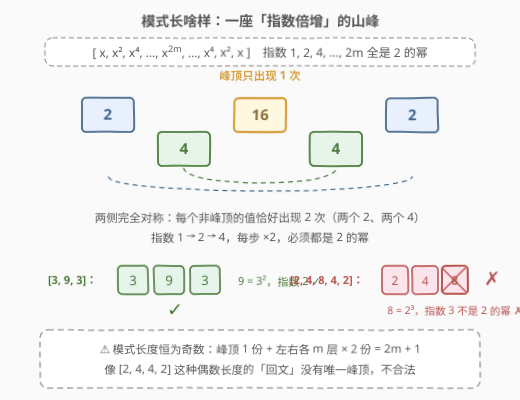
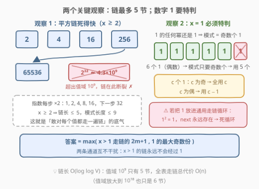
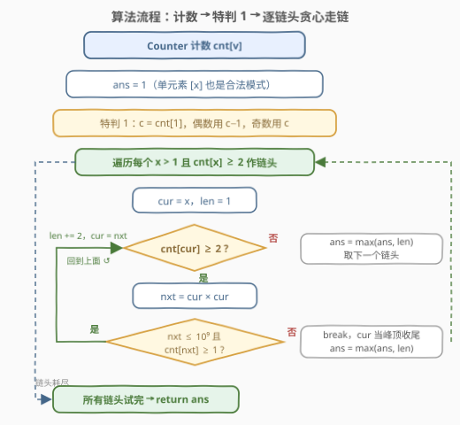

# LeetCode 子集中元素的最大数量 题解

## 1. 题目概述

- **标题 / 题号**：子集中元素的最大数量（#3020，medium）
- **链接**：https://leetcode.cn/problems/find-the-maximum-number-of-elements-in-subset/
- **难度**：中等
- **标签**：数组、哈希表、枚举

**题意**：给你一个**正整数**数组 `nums`，需要从中选出一个子集，把这些元素放进一个下标从 0 开始的数组里，使其遵循以下模式：

$$[x,\ x^2,\ x^4,\ \dots,\ x^{k/2},\ x^{k},\ x^{k/2},\ \dots,\ x^4,\ x^2,\ x]$$

其中指数 $k$ 可以是任何非负的 2 的幂（$k \in \{1, 2, 4, 8, \dots\}$）。换句话说，合法的数组是一座「**指数倍增**」的对称山峰：从 $x$ 出发，指数不断翻倍爬到峰顶 $x^k$，再对称地降回来。返回满足条件的子集的**元素数量最大值**。

**示例 1**：

```text
输入：nums = [5,4,1,2,2]
输出：3
解释：选择子集 {4,2,2}，排成 [2,4,2]，满足 2² = 4。
```

**示例 2**：

```text
输入：nums = [1,3,2,4]
输出：1
解释：任何单个元素都符合模式（k = 1 时退化为 [x]），例如子集 {1}。
```

**约束**：

- $2 \le \text{nums.length} \le 10^5$
- $1 \le \text{nums}[i] \le 10^9$

> ⚠️ 读题陷阱：模式长度**恒为奇数**——峰顶 $x^k$ 只出现 **1 次**，两侧每个值各出现 **2 次**；指数必须依次是 $1, 2, 4, \dots$（2 的幂），所以 $[2,4,8,4,2]$ 里 $8 = 2^3$ 不合法；像 $[2,4,4,2]$ 这种偶数长度的「回文」没有唯一峰顶，同样不合法。

## 2. 解题思路

### 2.1 暴力思路

模式由「链头 $x$ + 峰顶高度」唯一确定，所以一个直接的暴力是：枚举每个元素作为 $x$，再枚举模式长度，逐个检查构造它需要的值够不够用。但如果不预先计数，每次「数一数某个值有几个」都要重扫一遍数组，整体是 $O(n^2)$ 量级，$n = 10^5$ 时达 $10^{10}$ 次操作，必然超时；至于枚举全部 $2^n$ 个子集再逐一验证，更无从谈起。

先花 $O(n)$ 做一次**哈希计数**，把「这个值有几个」变成 $O(1)$ 查询，暴力检查立刻降维。

### 2.2 核心观察：哈希计数 + 链式倍增枚举



把模式拆开看，一个链头为 $x$、共 $m+1$ 层的模式需要的「原料」是：

| 层 | 值 | 需要的份数 |
|----|----|-----------|
| 第 $0 \sim m-1$ 层（两侧） | $x^{2^0}, x^{2^1}, \dots, x^{2^{m-1}}$ | **每值 ≥ 2** |
| 第 $m$ 层（峰顶） | $x^{2^m}$ | **≥ 1** |

总元素数 $= 2m + 1$。于是问题变成：**以每个 $x$ 为链头，沿着 $x \to x^2 \to x^4 \to \cdots$ 走链，能走多远？**



两个关键观察让「走链」便宜到可以随便走：

1. **链死得极快**：每平方一次指数就翻倍。$x \ge 2$ 时链上第 $i$ 个值至少是 $2^{2^i}$，而 $2^{32} \approx 4.3 \times 10^9 > 10^9$，所以链长 $\le 5$（$2 \to 4 \to 16 \to 256 \to 65536$ 后断裂），$x > 1$ 的答案上界只有 $9$。这也是官方提示「只需检查所有小于 10 的长度」的由来。
2. **$x = 1$ 必须特判**：1 的任何幂还是 1，「链」退化为**任意奇数个 1**——设 1 出现 $c$ 次，贡献为 $c$（$c$ 为奇）或 $c - 1$（$c$ 为偶）。⚠️ 若把 1 混进通用走链循环，$1^2 = 1$ 使 `next` 永远存在，直接死循环。

> 💡 **为什么只以 $\text{cnt}[x] \ge 2$ 的值作链头也不会漏**：只出现 1 次的值 $v$ 要么单独成 $[v]$（长度 1，被答案初值覆盖），要么只能当某条链的**峰顶**——而那条链从更小的链头走过来时自然会用上它。链上非峰顶的层才需要 $\ge 2$ 份，峰顶只要 $\ge 1$ 份。

### 2.3 算法流程图



### 2.4 示例演算

![示例演算：nums=[5,4,1,2,2]](../images/p3020_example_walkthrough.svg)

以 `nums = [5,4,1,2,2]` 走一遍完整流程：

| 步骤 | 操作 | 结果 |
|------|------|------|
| 1 | Counter 计数 | $\{5{:}1,\ 4{:}1,\ 1{:}1,\ 2{:}2\}$ |
| 2 | 特判 1：$c = 1$ 为奇数 | 候选 $= 1$ |
| 3 | 链头 $x = 2$（cnt = 2 ≥ 2）：`cur=2, len=1`；cnt[2] ≥ 2 且 4 在表中 → `len=3, cur=4`；cnt[4] = 1 < 2 停 | 候选 $= 3$ ★ |
| 4 | $x = 4, 5$：cnt < 2，当不了链头（单元素已被初值 1 覆盖） | — |

最终 `ans = 3`，即子集 $\{2,2,4\}$ 排成 $[2,4,2]$，与示例一致。

## 3. 参考代码

### C++（哈希计数 + 贪心走链）

```cpp
class Solution {
  public:
    int maximumLength(vector<int>& nums) {
        unordered_map<long long, int> cnt;
        for (int x : nums) ++cnt[x];

        int ans = 1;                          // 任何单元素 [x] 都合法
        if (auto it = cnt.find(1); it != cnt.end()) {
            int c = it->second;               // 1 的模式 = 奇数个 1
            ans = max(ans, c % 2 ? c : c - 1);
        }

        for (auto& [x, c] : cnt) {
            if (x == 1 || c < 2) continue;    // 链头自身要出现在两侧，需 >= 2 份
            long long cur = x;
            int len = 1;
            while (cnt[cur] >= 2) {           // cur 能放两侧，尝试把峰顶升到 cur²
                long long nxt = cur * cur;    // (1e9)² = 1e18，long long 不溢出
                if (nxt > 1000000000LL || cnt.count(nxt) == 0) break;
                len += 2;                     // 两侧各 +1，峰顶换成 nxt
                cur = nxt;                    // cur 始终在表里，operator[] 不会插入
            }
            ans = max(ans, len);
        }
        return ans;
    }
};
```

### Python

```python
class Solution:
    def maximumLength(self, nums: List[int]) -> int:
        cnt = Counter(nums)
        ans = 1                              # 任何单元素 [x] 都合法
        if cnt[1]:
            c = cnt[1]                       # 1 的模式 = 奇数个 1
            ans = max(ans, c - (c % 2 == 0))
        for x, c in cnt.items():
            if x == 1 or c < 2:              # 链头自身要出现在两侧，需 >= 2 份
                continue
            cur, length = x, 1
            while cnt[cur] >= 2:             # cur 能放两侧，尝试把峰顶升到 cur²
                nxt = cur * cur
                if nxt not in cnt:
                    break
                length += 2                  # 两侧各 +1，峰顶换成 nxt
                cur = nxt
            ans = max(ans, length)
        return ans
```

> 💡 两份代码逻辑完全一致。C++ 中哈希表的键用 `long long`：`cur * cur` 最大 $10^{18}$，超出 `int` 但仍在 `long long`（上限约 $9.2 \times 10^{18}$）范围内；先判 `nxt > 1e9` 再查表，既提前剪枝又省掉无意义的大数哈希。

## 4. 复杂度分析

| 维度 | 复杂度 | 说明 |
|------|--------|------|
| 时间复杂度 | $O(n)$ | 计数 $O(n)$；每个不同值最多走 5 步链（$2^{32} > 10^9$ 掐断），总计 $O(n + D \cdot \log\log V)$，而 $\log\log 10^9 \approx 5$ 是常数 |
| 空间复杂度 | $O(D)$ | 哈希表存 $D$ 个不同值，$D \le n$ |

其中 $n = \text{len(nums)}$，$D$ 为不同值个数，$V = 10^9$ 为值域上限。

## 5. 扩展：链长为什么是 $O(\log\log V)$？

链上第 $i$ 个值是 $x^{2^i} \ge 2^{2^i}$，要求它 $\le V$ 即 $2^i \le \log_2 V$，解得 $i \le \log_2 \log_2 V$。代入 $V = 10^9$：$\log_2 V \approx 29.9$，$\log_2 29.9 \approx 4.9$，即 $i \le 4$，链最多 5 个值。这个**双重对数**增长极其缓慢——值域放大到 $10^{18}$ 也只是 6 个值。所以无论值域多大，「枚举所有链头 + 贪心走链」永远近似线性。

对比 [128. 最长连续序列](https://leetcode.cn/problems/longest-consecutive-sequence/)：同样是「哈希 + 只从链头起链」（128 只从没有前驱的数起链，本题只从 cnt ≥ 2 的值起链），但 128 的链长可达 $n$，必须小心保证每个值只被访问常数次；本题链长被 $\log\log V$ 天然掐死，随便走都不会超时。

一个变体方向：若把「指数是 2 的幂」改成「指数是任意正整数」（即 $[x, x^2, x^3, \dots, x^k, \dots, x^3, x^2, x]$），链不再倍增而是每步乘一个 $x$，链长退化为 $O(\log V)$——做法仍是哈希计数 + 走链，只是上界变松。

## 6. 面试要点

1. **为什么模式长度一定是奇数？每个值各需要几份？**

   - 结构决定：山峰只有一个峰顶 $x^{2^m}$，出现 **1 次**；两侧对称，其余每层各 **2 次**。所以合法模式长度 $= 2m+1$，构造条件是「非峰顶层 cnt ≥ 2，峰顶层 cnt ≥ 1」；$[2,4,4,2]$ 这类偶数长回文没有唯一峰顶，不合法。

2. **为什么 x = 1 必须特判？漏掉会怎样？**

   - 1 的任何幂都是 1，模式退化为「奇数个 1」，贡献为 $c$ 或 $c-1$。若混进通用走链循环，$1^2 = 1$ 使 `next` 永远存在，死循环；这也是代码里 `if (x == 1) continue` 的由来。

3. **链长上界怎么推？为什么敢对每个值都走一遍链？**

   - 每步平方使指数翻倍，$x \ge 2$ 时第 $i$ 个值 $\ge 2^{2^i}$；$2^{32} > 10^9$ 掐断链，链长 ≤ 5、模式长度 ≤ 9。总代价 $O(D \times 5) = O(n)$，这正是「看似暴力的走链」实际是线性算法的原因。

4. **只以 cnt ≥ 2 的值作链头，会漏解吗？**

   - 不会。出现 1 次的值只能当峰顶或单独成 $[x]$：当峰顶时，那条链从更小的链头走过来会覆盖它；单独成 $[x]$ 时长度 1 被 `ans` 初值覆盖。而链头自身要出现在两侧，cnt < 2 根本起不了链。

5. **C++ 实现有哪些坑？**

   - `cur * cur` 最大 $10^{18}$，`int` 会溢出，键和临时变量都用 `long long`（上限约 $9.2 \times 10^{18}$，安全）；走链循环里 `cnt[cur]` 用了 `operator[]`，靠「cur 始终在表里」这一不变式保证不会插入新元素、不会使遍历迭代器失效。

## 同类练习题

| # | 题目 | 与本题的关联 |
|---|------|-------------|
| 128 | [最长连续序列](https://leetcode.cn/problems/longest-consecutive-sequence/) | 哈希 + 只从链头（无前驱的数）起链，与本题「只从 cnt ≥ 2 的值起链」同款思想 |
| 846 | [一手顺子](https://leetcode.cn/problems/hand-of-straights/)（[题解](../0801-0900/846_一手顺子.md)） | 计数 + 贪心按份数拼结构（顺子），同属「份数够不够拼出目标形态」 |
| 1296 | [划分数字的连续区间](https://leetcode.cn/problems/divide-array-in-sets-of-k-consecutive-numbers/)（[题解](../1201-1300/1296_划分数组为连续数字的集合.md)） | 846 的泛化版，计数 + 逐组消耗 |
| 2244 | [完成任务的最少轮数](https://leetcode.cn/problems/minimum-rounds-to-complete-all-tasks/)（[题解](../2201-2300/2244_完成所有任务需要的最少轮数.md)） | 计数后判断频次能否被 2/3 消耗，频次可行性判断的另一变体 |
