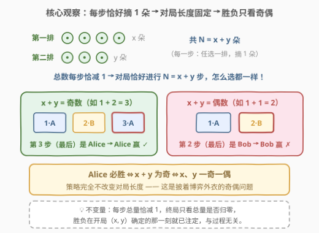
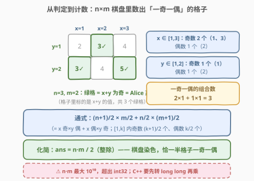
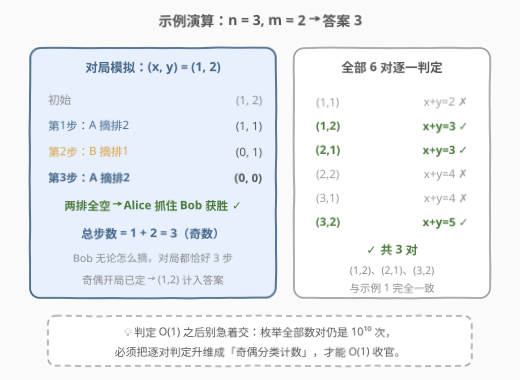

# Alice和Bob玩鲜花游戏

- **题目名称**：Alice和Bob玩鲜花游戏
- **链接**：[3021. Alice 和 Bob 玩鲜花游戏](https://leetcode.cn/problems/alice-and-bob-playing-flower-game/)
- **难度**：中等
- **标签**：数学、博弈、奇偶性

## 1. 题目概述

Alice 和 Bob 在一片田野上玩一个回合制游戏，两人之间有两排花：**第一排 x 朵，第二排 y 朵**。游戏规则：

1. Alice 先行动；
2. 每一次行动中，当前玩家必须**选择其中一排**，从这排摘走**一朵**鲜花；
3. 一次行动结束后，如果**两排上都没有剩下鲜花**，那么**当前玩家**抓住对手并赢得游戏的胜利。

给你两个整数 `n` 和 `m`，求满足以下条件的数对 `(x, y)` 的数目：

- 按上述规则，**Alice 必定赢得游戏**；
- 第一排花数 $x \in [1, n]$，第二排花数 $y \in [1, m]$。

**示例 1**：

```text
输入：n = 3, m = 2
输出：3
解释：以下数对满足题目要求：(1,2)、(3,2)、(2,1)。
```

**示例 2**：

```text
输入：n = 1, m = 1
输出：0
解释：没有数对满足题目要求。
```

**约束条件**：

- $1 \le n, m \le 10^5$

> ⚠️ 读题陷阱：本题不是让你模拟对局，而是**计数**——数有多少个初始局面 $(x, y)$ 先手必胜。胜负判定要做成 $O(1)$，计数还要再压成公式，两层都不能暴力。

---

## 2. 解题思路

### 2.1 暴力思路

最朴素的做法分两层：

- **判定层**：对给定 $(x, y)$ 判断先手是否必胜。写记忆化博弈搜索 `win(a, b)`（状态 = 两排剩余朵数，轮到谁谁走，转移 = 任选一非空排摘一朵），状态数 $O(nm)$；
- **枚举层**：把 $x \in [1, n]$、$y \in [1, m]$ 全枚举一遍，逐对调用判定。

两层叠加即 $O(nm)$ 起步，而 $n, m \le 10^5$ 意味着**光枚举所有数对就是 $10^{10}$ 次**——直接爆炸。出路只有一条：先证明胜负判定有 $O(1)$ 规律，再把「逐对判定」压缩成「分类计数」。

### 2.2 核心观察：每步恰摘 1 朵 → 对局长度固定 → 胜负只看奇偶



这是全题的命门，推理链逐环扣紧：

1. **每次行动净效果恒定**：不管选哪排，全场花的总数都**恰好减少 1 朵**，没有任何一步能让总数跳变或不变；
2. **对局长度由此被钉死**：开局共 $x + y$ 朵，游戏在总数归零时结束，所以对局**恰好进行 $x + y$ 步**——与双方怎么选完全无关；
3. **赢家 = 走最后一步的人**：把两排同时摘空的那一步是第 $x + y$ 步，执行它的「当前玩家」获胜；
4. **步数编号与先后手绑定**：Alice 走第 $1, 3, 5, \dots$ 步（奇数步），Bob 走第 $2, 4, 6, \dots$ 步（偶数步）。

四条合起来：

$$\text{Alice 必胜} \iff x + y \text{ 为奇数} \iff x, y \text{ 一奇一偶}$$

> 💡 **策略无关的「假博弈」**：题面包装成你来我往的回合制游戏，但「每步总量恰减 1」这一不变量让所有选择都失去意义——胜负在 $(x, y)$ 确定的瞬间就已注定。识别这类题的信号：**每步变化量固定 + 终局条件只看总量** → 是奇偶问题，不是博弈问题，别急着上博弈 DP / SG 函数。

### 2.3 从判定到计数：奇偶分类 → O(1) 公式



有了「一奇一偶」的 $O(1)$ 判定还不够——逐对枚举仍是 $10^{10}$ 次。要把判定**批量化**成计数：$[1, k]$ 内奇数有 $\lceil k/2 \rceil = (k+1)/2$ 个、偶数有 $\lfloor k/2 \rfloor = k/2$ 个，按「谁奇谁偶」分两类相乘再相加：

$$\text{ans} = \underbrace{\frac{n+1}{2} \cdot \frac{m}{2}}_{x\ \text{奇} \times y\ \text{偶}} + \underbrace{\frac{n}{2} \cdot \frac{m+1}{2}}_{x\ \text{偶} \times y\ \text{奇}}$$

代入示例 1（$n=3, m=2$）：$2 \times 1 + 1 \times 1 = 3$ ✓。

这公式还能一步化简。把 $n \times m$ 的格子想成**棋盘黑白染色**：格子 $(x, y)$ 的 $x+y$ 为奇当且仅当落在同一色格上。当 $nm$ 为偶数时两色各占一半；当 $n, m$ 全为奇数时偶数格恰好多 1 个（四角都是偶数格，如 $(1,1)$）。两种情况统一为：

$$\text{ans} = \left\lfloor \frac{n \cdot m}{2} \right\rfloor$$

代数验证：设 $n = 2a + p$、$m = 2b + q$（$p, q \in \{0, 1\}$），分类公式 $= 2ab + pb + aq$；而 $\lfloor nm/2 \rfloor = \lfloor (4ab + 2aq + 2pb + pq)/2 \rfloor = 2ab + aq + pb$（$pq \in \{0,1\}$ 整除后归零），两者恒等。再用示例 2 检验：$n = m = 1$ 时 $\lfloor 1/2 \rfloor = 0$ ✓。

> ⚠️ **溢出陷阱**：$n, m \le 10^5$ 时 $n \cdot m \le 10^{10}$，超出 32 位 int 上限（约 $2.1 \times 10^9$）。C++ 必须先转 `long long` 再乘——这也是官方函数签名返回 `long long` 的原因。Python 原生大整数无此问题。

### 2.4 示例演算



以示例 1（$n=3, m=2$）完整走两件事：

**（a）对 $(1, 2)$ 模拟一次对局**，直观感受「步数固定」：初始 $(1,2)$ → A 摘排2 得 $(1,1)$ → B 摘排1 得 $(0,1)$ → A 摘排2 得 $(0,0)$，两排全空，Alice 抓住 Bob 获胜。总步数 $= 1 + 2 = 3$（奇），且 Bob 换任何摘法对局仍是 3 步——先手必赢板上钉钉。

**（b）6 个候选数对逐一判定**：

| 数对 | $x+y$ | 奇偶 | Alice 赢？ |
|------|-------|------|-----------|
| (1,1) | 2 | 偶 | ✗ |
| (1,2) | 3 | 奇 | ✓ |
| (2,1) | 3 | 奇 | ✓ |
| (2,2) | 4 | 偶 | ✗ |
| (3,1) | 4 | 偶 | ✗ |
| (3,2) | 5 | 奇 | ✓ |

✓ 共 3 对：$(1,2)$、$(2,1)$、$(3,2)$，与示例输出一致，也与公式 $\lfloor 3 \times 2 / 2 \rfloor = 3$ 吻合。

---

## 3. 参考代码

### C++（O(1) 闭合公式）

```cpp
class Solution {
  public:
    long long flowerGame(int n, int m) {
        // 「一奇一偶」的组合数，恰为 n*m/2 向下取整；先转 long long 防溢出
        return static_cast<long long>(n) * m / 2;
    }
};
```

### C++（分类计数版，与推导一一对应）

```cpp
class Solution {
  public:
    long long flowerGame(int n, int m) {
        long long oddN = (n + 1) / 2, evenN = n / 2;   // [1,n] 内奇/偶个数
        long long oddM = (m + 1) / 2, evenM = m / 2;   // [1,m] 内奇/偶个数
        return oddN * evenM + evenN * oddM;            // x奇×y偶 + x偶×y奇
    }
};
```

### Python

```python
class Solution:
    def flowerGame(self, n: int, m: int) -> int:
        return n * m // 2
```

> 💡 面试建议：先讲清「策略无关 → 奇偶判定」的因果链，再给分类计数版（可复现推导过程），最后指出可化简为 $\lfloor nm/2 \rfloor$。直接甩一行公式而不解释为什么策略不影响胜负，等于没做这道题。

---

## 4. 复杂度分析

| 维度 | 复杂度 | 说明 |
|------|--------|------|
| 时间复杂度 | $O(1)$ | 一次乘法 + 一次整除（分类计数版也仅 4 次除法 + 2 次乘加） |
| 空间复杂度 | $O(1)$ | 常数个变量 |
| 暴力对照 | $O(nm)$ | $n, m \le 10^5$ 时达 $10^{10}$，必然超时——判定再快也救不了枚举层 |

---

## 5. 扩展：规则一变形，何时变成「真博弈」？

本题的 $O(1)$ 结论依赖两个前提：**每步总量恰减 1**、**终局只看总量是否归零**。改动任一前提，奇偶论证即失效，需要真正的博弈工具：

- **每步可摘任意多朵**（如「任选一排摘走任意正整数朵」）：变成 Nim 型游戏，用 **SG 函数**求解（入门见 [292. Nim 游戏](https://leetcode.cn/problems/nim-game/)，结论 $n \bmod 4 \neq 0$）。
- **收益不对称**（摘走的花归自己、比总分）：变成**博弈 DP / Minimax**，如 [877. 石子游戏](https://leetcode.cn/problems/stone-game/) 的区间 DP、[486. 预测赢家](https://leetcode.cn/problems/predict-the-winner/)。
- **步长固定但终局条件复杂**（如「谁先面对某排为 0 谁输」）：奇偶分析仍可能奏效，但要重新核对终局判定，如 [2029. 石子游戏 IX](https://leetcode.cn/problems/stone-game-ix/) 的余数分类讨论。

一句话方法论：**先找不变量（每步总变化量、终局条件）——不变量足够简单时博弈退化成数学，否则才上 DP / SG**。

---

## 6. 面试要点

1. **为什么本题中策略完全不影响胜负？**

   - 每次行动无论选哪排，总数都恰减 1，对局长度被钉死在 $x + y$ 步；走最后一步的人获胜，而第 $x+y$ 步归谁只由 $x+y$ 的奇偶决定。所有「选择」对局面长度零影响，胜负与过程无关。

2. **「Alice 赢 ⟺ $x+y$ 为奇」的完整推理链是什么？**

   - 总数每步减 1 → 局长恒为 $x+y$ → 摘空两排的那步是第 $x+y$ 步 → 先手独占奇数步 → $x+y$ 为奇时最后一步落在 Alice 手里。再由 $x + y \equiv x - y \pmod 2$ 得等价说法「一奇一偶」。

3. **怎么从「判定」走到 $O(1)$ 计数？中间容易卡在哪？**

   - 判定 $O(1)$ 后如果还想枚举数对，仍是 $O(nm) = 10^{10}$ 会超时；必须按奇偶分类计数 $\frac{n+1}{2} \cdot \frac{m}{2} + \frac{n}{2} \cdot \frac{m+1}{2}$，再化简为 $\lfloor nm/2 \rfloor$。常见卡点是「忘了枚举层本身是平方级」。

4. **这题有什么实现层面的坑？**

   - 溢出：$10^5 \times 10^5 = 10^{10}$ 超 int32，C++ 里直接写 `n * m / 2`（int 乘法）会溢出，必须先 cast 成 `long long`；整除要在乘法之后做（先 `/2` 会丢精度，如 $n=m=10^5$ 时 $n \cdot (m/2)$ 恰好没丢，但 $n$ 奇 $m$ 奇时会少算）。

5. **如何向面试官证明结论而不是「看起来对」？**

   - 两条路：(a) 不变量论证（如上）；(b) 小规模对拍——记忆化 `win(a, b)` 暴力与奇偶判定在 $a, b \le 20$ 内全量比对，闭合公式再与 $O(nm)$ 逐对计数在 $n, m \le 50$ 内对拍。能主动提对拍思路是加分项。

---

## 7. 同类练习题

- [292. Nim 游戏](https://leetcode.cn/problems/nim-game/)：「找规律出 O(1) 公式」的假博弈代表作，结论 $n \bmod 4 \neq 0$，与本题同属策略无关型
- [877. 石子游戏](https://leetcode.cn/problems/stone-game/)（[题解](../0801-0900/877_石子游戏.md)）：真博弈——收益不对称、需要区间 DP + Minimax，与本题「策略无关」形成鲜明对照
- [486. 预测赢家](https://leetcode.cn/problems/predict-the-winner/)：博弈 DP 入门，判断先手能否不输，练「先手必胜/不败」的状态设计
- [319. 灯泡开关](https://leetcode.cn/problems/bulb-switcher/)：纯数学找规律推闭合公式 $\lfloor\sqrt{n}\rfloor$，训练「从模拟到公式」的化简直觉
- [2029. 石子游戏 IX](https://leetcode.cn/problems/stone-game-ix/)：胜负由奇偶性与余数分类主导的博弈，练「按局面分类讨论」的严谨性
