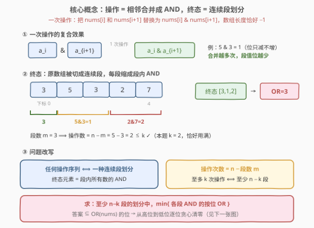
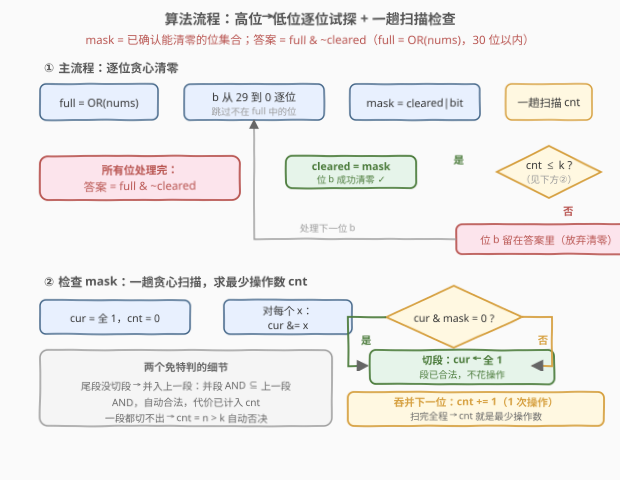

# LeetCode 给定操作次数内使剩余元素的或值最小 题解

## 1. 题目概述

- **标题 / 题号**：给定操作次数内使剩余元素的或值最小（#3022，hard）
- **链接**：https://leetcode.cn/problems/minimize-or-of-remaining-elements-using-operations/
- **难度**：困难
- **标签**：贪心、位运算、数组

**题意**：给你一个下标从 0 开始的整数数组 `nums` 和一个整数 $k$。

一次操作中，你可以选择满足 $0 \le i < \text{nums.length} - 1$ 的一个下标 $i$，并将 $\text{nums}[i]$ 和 $\text{nums}[i+1]$ **替换为一个数字** $\text{nums}[i] \mathbin{\&} \text{nums}[i+1]$（按位 AND）。注意每次操作后数组长度 **减 1**。

请返回**至多 $k$ 次操作**内，`nums` 中所有剩余元素按位 **OR** 结果的**最小值**。

**示例 1**：

```text
输入：nums = [3,5,3,2,7], k = 2
输出：3
解释：
1. 合并 nums[0]、nums[1] → [1,3,2,7]；
2. 合并 nums[2]、nums[3] → [1,3,2]。
最终 OR = 1 | 3 | 2 = 3。
```

**示例 2**：

```text
输入：nums = [7,3,15,14,2,8], k = 4
输出：2
解释：连续 4 次操作可得到 [2,0]，OR = 2。
```

**示例 3**：

```text
输入：nums = [10,7,10,3,9,14,9,4], k = 1
输出：15
解释：不执行任何操作，OR = 15 已经是最小值。
```

**约束**：

- $1 \le \text{nums.length} \le 10^5$
- $0 \le \text{nums}[i] < 2^{30}$
- $0 \le k < \text{nums.length}$

> ⚠️ 操作对象是**相邻**的两个元素，且合并后长度减 1——这两点决定了「操作 ⟺ 连续段划分」的等价关系，是全题的突破口。

## 2. 解题思路

### 2.1 暴力思路

每一步操作有 $O(n)$ 种选法，至多执行 $k \le n-1$ 步，搜索树规模约 $n^{n}$，$n = 10^5$ 下完全不可行；即便用哈希对数组状态做记忆化，状态空间仍是指数级。

> 💡 **转换视角**：不要模拟「一步步怎么操作」，而是刻画「终态长什么样」——终态由**不变量**（连续段 + 段内 AND）完全刻画，再把「最小化 OR」拆成**逐位的 0/1 决策**。

### 2.2 核心观察：操作 ⟺ 连续段划分，再从高位到低位逐位清零



**观察 1（操作的本质）**：每次操作把相邻两数合并成它们的 AND。归纳可知，任何操作序列的终态都等价于：**把原数组切成若干连续段，每段缩成段内所有数的 AND**；反之任何切法都能实现。设切成了 $m$ 段，则恰好用掉 $n - m$ 次操作。于是问题改写为：

> 在「至少切成 $n-k$ 段」的所有划分中，最小化**各段 AND 的按位 OR**。

**观察 2（OR 按位独立，高位优先）**：设 $\text{full} = \text{nums}[0] \,|\, \text{nums}[1] \,|\, \cdots$，答案一定是 `full` 的子掩码（OR 只会保留出现过的位）。OR 的每一位独立贡献 $2^b$，而**高位一个 1 抵过低位所有 1**，所以让答案最小应当**优先把高位清零**。

于是从高位 $b=29$ 到低位 $b=0$ 逐位决策，维护 $\text{mask}$ = **已确认能全部清零的位集合**：

- 对出现在 `full` 中的位 $b$，试探 $\text{mask}' = \text{mask} \mid (1 \ll b)$；
- 检查：**是否存在 ≤ k 次操作的方案，使每个剩余元素与 $\text{mask}'$ 按位与全为 0**；
- 可行（最少操作数 ≤ k）→ 位 $b$ 确认清零，$\text{mask} \leftarrow \text{mask}'$；不可行 → 位 $b$ 留在答案中。

最终答案 $= \text{full} \mathbin{\&} \sim \text{mask}$。注意检查时**未决策的低位不受约束**——它们「允许留下」，这正是逐位贪心能独立检查的原因。

> 💡 「每个元素都与 mask 不相交」⟺「所有元素的 OR 与 mask 不相交」——检查按元素逐个做即可。

**观察 3（可行性检查 = 一趟贪心扫描）**：给定 mask，求「让每段 AND 都与 mask 不相交」的**最少操作数**（即最多段数）。从左到右扫描，`cur` 累积当前段的 AND：

- 若 $\text{cur} \mathbin{\&} \text{mask} = 0$：本段已合法，**立刻切段**（免费），`cur` 重置为全 1；
- 否则 $\text{cnt}{+}{+}$：当前段必须继续吞并下一个元素（花 1 次操作）。

扫描结束，`cnt` 恰好就是最少操作数。两个关键细节：

- **尾段未切段怎么办**：若扫到末尾 `cur & mask ≠ 0`，把尾段**并入上一段**——并段的 AND $\subseteq$ 上一段的 AND（AND 的元素越多位越少），上一段合法则并段自动合法；其代价恰好就是尾段最后一个元素在扫描中多计的那一次 `cnt`。
- **全体 AND 仍与 mask 相交怎么办**：任何连续段的 AND 都是全体 AND 的超集，永远切不出合法段，扫描一次都不切段，$\text{cnt} = n > k$ 自动否决——**无需特判**。

### 2.3 算法流程图



整体流程：先求 `full`，再从高位到低位逐位试探；每一位做一趟 $O(n)$ 扫描计 `cnt`，`cnt ≤ k` 即确认清零。

### 2.4 示例演算

![示例演算：nums=[3,5,3,2,7], k=2](../images/p3022_example_walkthrough.svg)

以示例 1 `nums = [3,5,3,2,7], k = 2` 走一遍（$\text{full} = 3|5|3|2|7 = 7 = 111_2$，全体 AND $= 0$）：

**试清 bit 2（值 4）**：$\text{mask} = 100_2$。

| 元素 | cur（段 AND） | cur & mask | 动作 | cnt |
|------|------|------|------|-----|
| 3 | 011 | 0 | 切段 `[3]` | 0 |
| 5 | 101 | 100 ≠ 0 | 吞并下一位 | 1 |
| 3 | 001 | 0 | 切段 `[5,3]→1` | 1 |
| 2 | 010 | 0 | 切段 `[2]` | 1 |
| 7 | 111 | 100 ≠ 0 | 尾段并入上一段 `[2,7]→2` | 2 |

$\text{cnt} = 2 \le k = 2$ ✓ → 划分 `[3],[5,3],[2,7]`，各段 AND 为 $3,1,2$，OR $= 3$，bit 2 成功清零。

**试清 bit 1（值 2）**：$\text{mask} = 110_2$。扫描：$3$（cur=011，不清零）cnt=1 → $5$（cur=001，切段）→ $3$（cur=011，不清零）cnt=2 → $2$（cur=010，不清零）cnt=3 → $7$（cur=010，尾段不清零）cnt=4。$\text{cnt} = 4 > 2$ ✗ → bit 1 留在答案。

**试清 bit 0（值 1）**：$\text{mask} = 101_2$。扫描：$3$（cur=011）cnt=1 → $5$（cur=001）cnt=2 → $3$（cur=001）cnt=3 → $2$（cur=000，切段）→ $7$（cur=111，尾段）cnt=4。$\text{cnt} = 4 > 2$ ✗ → bit 0 留在答案。

最终 $\text{mask} = 100_2$，答案 $= 111_2 \mathbin{\&} \sim 100_2 = 011_2 = 3$ ✓。

## 3. 参考代码

### C++

```cpp
class Solution {
  public:
    int minOrAfterOperations(vector<int>& nums, int k) {
        int full = 0;
        for (int x : nums) full |= x;

        int cleared = 0;                       // 已确认能清零的位集合
        for (int b = 29; b >= 0; --b) {
            if (!((full >> b) & 1)) continue;  // 该位本来就不在 OR 里
            int mask = cleared | (1 << b);     // 试探再清掉位 b
            int cnt = 0, cur = -1;             // -1 即全 1，& 后变 nums[i]
            for (int x : nums) {
                cur &= x;
                if ((cur & mask) == 0) cur = -1;   // 本段合法，立刻切段
                else if (++cnt > k) break;         // 必须吞并下一位：1 次操作
            }
            if (cnt <= k) cleared = mask;      // 位 b 确认清零
        }
        return full & ~cleared;
    }
};
```

### Python

```python
class Solution:
    def minOrAfterOperations(self, nums: List[int], k: int) -> int:
        full = 0
        for x in nums:
            full |= x

        cleared = 0                      # 已确认能清零的位集合
        for b in range(29, -1, -1):
            if not (full >> b) & 1:      # 该位本来就不在 OR 里
                continue
            mask = cleared | (1 << b)    # 试探再清掉位 b
            cnt, cur = 0, -1             # -1 即全 1，& 后变 nums[i]
            for x in nums:
                cur &= x
                if cur & mask == 0:
                    cur = -1             # 本段合法，立刻切段
                else:
                    cnt += 1             # 必须吞并下一位：1 次操作
                    if cnt > k:
                        break
            if cnt <= k:
                cleared = mask           # 位 b 确认清零
        return full & ~cleared
```

> 💡 两个实现细节：`cur` 初始化为 `-1`（补码全 1），首次 `cur &= x` 后即等于 $x$；`cnt > k` 提前 break，避免无谓扫完全程。C++ 中 `int` 30 位以内无溢出风险。

## 4. 复杂度分析

| 维度 | 复杂度 | 说明 |
|------|--------|------|
| 时间复杂度 | $O(30 \cdot n)$ | 外层枚举 30 个二进制位，每位一趟 $O(n)$ 扫描（可提前 break）；$n \le 10^5$ 时约 $3 \times 10^6$ 次位运算 |
| 空间复杂度 | $O(1)$ | 只用 `full`、`cleared`、`mask`、`cur`、`cnt` 等常数个变量 |

> 💡 $\text{nums}[i] < 2^{30}$，故只需枚举 bit $29 \sim 0$。总操作预算 $k \le n-1$ 与 30 个位互不冲突——每位检查是独立的 $O(n)$，不叠加。

## 5. 扩展：两个贪心的正确性证明

**引理 1（切段趁早：扫描给出最少操作数）**。设贪心扫描的切段位置为 $p_1 < p_2 < \cdots < p_t$（第 $j$ 段为 $(p_{j-1}, p_j]$）。对任意合法划分的第 $j$ 刀 $c_j$，归纳可证 $c_j \ge p_j$：

- $j=1$：$p_1$ 是**最早**使前缀 AND 与 mask 不相交的位置，而 $c_1$ 处前缀 AND 合法，故 $c_1 \ge p_1$；
- 归纳步：设 $c_{j-1} \ge p_{j-1}$。合法划分的第 $j$ 段 $(c_{j-1}, c_j]$ 的 AND 与 mask 不相交；而区间 $[p_{j-1}+1,\, c_j] \supseteq [c_{j-1}+1,\, c_j]$，**AND 的区间越大、保留的位越少**，故前者 AND 是后者的子掩码，也与 mask 不相交——贪心第 $j$ 段从 $p_{j-1}+1$ 出发，最晚在 $c_j$ 就会切段，即 $p_j \le c_j$。

若某划分有 $t+1$ 段，则 $c_{t+1}$ 存在，由归纳 $p_{t+1} \le c_{t+1} \le n-1$ 也应存在，与贪心只切了 $t$ 刀矛盾（尾段未切时贪心扫到 $n-1$ 仍未合法）。故任何合法划分至多 $t$ 段；而贪心构造「前 $t-1$ 段 + 尾段并入第 $t$ 段」恰有 $t$ 段（并段 AND $\subseteq$ 第 $t$ 段 AND，自动合法）。所以最多段数为 $t$，最少操作数 $= n - t = \text{cnt}$（每个元素计一次 cnt，除了触发切段的 $t$ 个）。∎

**引理 2（高位优先的最优性）**。逐位贪心维护的结论是：对每个被放弃的位 $b$，集合 $M_b = \{\text{已确认的高位}\} \cup \{b\}$ **不可行**（任一方案必有剩余元素与 $M_b$ 相交）。设某方案答案 $A' <$ 贪心答案 $A$，取两者清零位集合的最高差异位 $b^*$：$A' < A$ 要求 $A'$ 清了 $b^*$ 而 $A$ 没清。$b^*$ 以上的位两者相同，故 $A'$ 的清零集合 $\supseteq M_{b^*}$，则 $A'$ 的方案中必有剩余元素与 $M_{b^*}$ 相交——与 $A'$ 清零集合包含 $M_{b^*}$ 矛盾。∎

**最终 mask 的可行性**：每次确认位 $b$ 时检查的集合恰为「当时已确认的位 ∪ {b}」；后确认的位检查时集合只增不减，**最后一次成功检查的集合就是最终 mask**，故最终 mask 整体可行。∎

> 💡 **一句话**：位与位之间「可行集合只增不减」保证了贪心一致性，「AND 区间越大位越少」的单调性保证了扫描最优性——两个单调性撑起整个解法。

## 6. 面试要点

1. **为什么操作序列等价于「连续段划分」？操作数和段数什么关系？**

   - 每次操作合并相邻两数为 AND，归纳可得终态每个元素 = 某连续段的 AND，各段恰好覆盖全数组；反之任意划分都可由左到右逐段合并实现。$m$ 段恰好花 $n - m$ 次操作，故「至多 $k$ 次操作」⟺「至少 $n-k$ 段」。

2. **为什么从高位到低位逐位决策是最优的，而不是状压/整体最小化？**

   - OR 的位独立贡献 $2^b$，高位的 1 数值上压倒所有低位之和的差值；贪心优先清高位，对被放弃的位有引理 2 的交换论证兜底。整体最小化是 NP 难方向的划分问题，逐位拆解利用了「可行性对位集合单调」的性质。

3. **可行性检查中为什么「切段要趁早」？尾段没切完怎么办？**

   - 段 AND 随区间扩大单调丢位：某前缀一旦合法，延长只会更合法，早切段给后面留更多划分空间（引理 1 的 $c_j \ge p_j$）。尾段扫完仍未合法时并入上一段：并段 AND 是上一段 AND 的子掩码，自动合法，代价恰好被尾段最后一个元素的 cnt 覆盖。

4. **为什么不用特判「全体 AND 与 mask 相交」的不可行情形？**

   - 任何连续段的 AND 都是全体 AND 的超集（AND 的元素越少位越多），全体 AND 与 mask 相交则任何段都不合法，扫描中一次都不会切段，$\text{cnt} = n > k$（因 $k \le n-1$），检查自动失败。

5. **这题和同一周赛的「3012 通过操作使数组长度最小」有何异同？**

   - 都是「操作改写数组 + 刻画终态 + 贪心/不变量一步到位」：3012 不限次数、问终态长度，围绕最小值的取模不变量分类；3022 限 $k$ 次、问终态 OR，围绕「连续段 AND」逐位贪心。共同点是都**拒绝逐步模拟**，先问「什么终态可达」。

## 同类练习题

| # | 题目 | 与本题的关联 |
|---|------|-------------|
| 3012 | [通过操作使数组长度最小](https://leetcode.cn/problems/minimize-length-of-array-using-operations/)（[题解](3012_通过操作使数组长度最小.md)） | 同族「操作改写数组 + 终态不变量」贪心，取模版 vs 本题按位版 |
| 1521 | [找到最接近目标值的函数值](https://leetcode.cn/problems/find-a-value-of-a-mysterious-function-closest-to-target/) | 连续子数组 AND 的最值，「AND 区间越大位越少」单调性的滑窗应用 |
| 3171 | [找到按位或最接近 K 的子数组](https://leetcode.cn/problems/find-subarray-with-bitwise-or-closest-to-k/) | 子数组 OR 逼近目标值，按位计数滑窗，与本题共用「按位独立」视角 |
| 3097 | [或值至少 K 的最短子数组 II](https://leetcode.cn/problems/shortest-subarray-with-or-at-least-k-ii/) | 子数组 OR 与阈值比较，位计数 + 滑窗进阶 |
| 2680 | [最大或值](https://leetcode.cn/problems/maximum-or/) | OR 最优化 + 左移增益，同样依赖「高位优先」的贪心直觉 |
