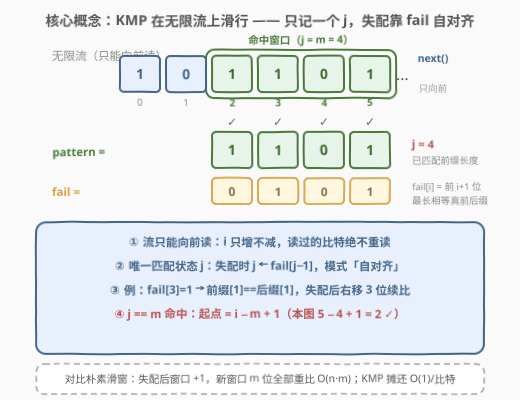
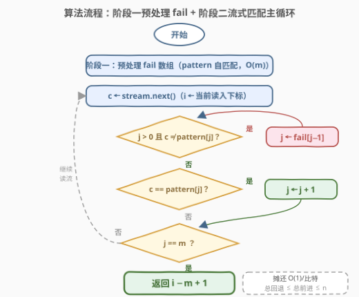

# 在无限流中寻找模式I

- **题目名称**：在无限流中寻找模式 I
- **链接**：[3023. 在无限流中寻找模式 I](https://leetcode.cn/problems/find-pattern-in-infinite-stream-i/)
- **难度**：中等
- **标签**：数组、交互、字符串匹配、滑动窗口、哈希函数、滚动哈希

> ⚠️ 本题为 LeetCode **付费题**（`isPaidOnly`）。下方题意描述、示例与约束依据官方样例与姊妹题 3037 重建，如有出入请以官方为准；算法与示例输出已用自洽代码验证。

## 1. 题目概述

给定一个二进制数组 `pattern`（只含 0/1）和一个 `InfiniteStream` 类的对象 `stream`，表示一条**无限长**的二进制流（每个元素是 0 或 1）。

`InfiniteStream` 的接口定义（以 Java 为例）：

```java
class InfiniteStream {
    public InfiniteStream(int[] bits);  // 用一段比特序列初始化内部流
    public int next();                  // 返回流中的下一个比特位（0 或 1）
}
```

要求返回模式在流中**第一次出现**的起始下标 $i$（流从 0 开始编号），即对所有 $0 \le j < \text{pattern.length}$ 都满足：

$$\text{stream}[i+j] = \text{pattern}[j]$$

题目保证模式一定会在流中出现；`next()` 的调用次数有上限（I 版较宽松，$10^5$ 量级）。

**示例 1**：

```text
输入：stream（前 5 位）= [1,1,1,0,1]，pattern = [0,1]
输出：3
解释：下标 3 开始的 2 个比特 [0,1] 恰好等于 pattern。
```

**示例 2**：

```text
输入：stream（前 1 位）= [0]，pattern = [0]
输出：0
解释：下标 0 处即命中。
```

**示例 3**：

```text
输入：stream（前 6 位）= [1,0,1,1,0,1]，pattern = [1,1,0,1]
输出：2
解释：下标 2 开始的 4 个比特 [1,1,0,1] 恰好等于 pattern。
```

**约束条件**（依据官方样例与姊妹题 3037 重建）：

- $1 \le \text{pattern.length} \le 100$
- `pattern` 仅含 0/1
- 保证答案存在；`next()` 调用次数上限约 $10^5$

> 💡 **读题关键**：这是一道**交互题**——流只能通过 `next()` 向前读，**不能随机访问、不能回头**。算法必须是**在线（online）**的：每读到一个比特就即时处理，历史比特不能重扫。这正是 KMP 的主场：它天生只依赖「已匹配前缀长度 $j$ + 失配数组」，单遍扫描、常数匹配状态。

---

## 2. 解题思路

### 2.1 暴力思路：滑动窗口整体比较

把最近读到的 $m$ 个比特（$m$ = pattern 长度）存进一个队列当滑动窗口：

1. 每读入一个新比特 `c = stream.next()`，`c` 进队尾；队列长度超过 $m$ 就弹出队首；
2. 队列长度恰为 $m$ 时，把整个窗口与 `pattern` 逐位比较，完全相等就返回起点 $i - m + 1$。

时间 $O(n \cdot m)$（$n$ 为命中时已读入的比特数）。本题 $m \le 100$、$n$ 约 $10^5$，至多 $10^7$ 次比较，稳过——但姊妹题 3037 把 $m$ 放大到 $10^5$，$10^{10}$ 次比较直接爆炸，必须升级。

### 2.2 核心观察：KMP 是天生的流式算法



普通 KMP 在「完整文本」上找 pattern。把它搬到无限流上，关键发现是：**KMP 的匹配阶段根本不需要随机访问文本**——它只维护两个状态：

- $i$：当前读入的比特下标（**只增不减**）；
- $j$：**当前已匹配的 pattern 前缀长度**（失配时会回退）。

每读到一个新比特 $c$，做三件事：

1. **失配回退**：当 $j > 0$ 且 $c \ne \text{pattern}[j]$ 时，$j \leftarrow \text{fail}[j-1]$，反复直到能接上或 $j = 0$；
2. **匹配推进**：若 $c = \text{pattern}[j]$，则 $j \leftarrow j + 1$；
3. **命中判定**：$j = m$ 时模式完整出现，起点即 $i - m + 1$。

其中失配数组 $\text{fail}[i]$ 定义为 pattern 前 $i+1$ 个字符的**最长相等真前后缀**长度，只用 pattern 自己就能预处理，与流无关。

> 💡 **为什么回退到 fail[j−1] 安全不漏**：失配时，已匹配的 $j$ 个比特恰好等于 pattern 前缀 $\text{pattern}[0..j-1]$。下一个可能的起点必须满足「pattern 的某个前缀 == 这段的后缀」，最长者恰由 $\text{fail}[j-1]$ 给出；对齐更长必然在这 $j$ 位内就自相矛盾，对齐更短则被更长者覆盖。所以一步跳到**最长相等前后缀**，既安全又不遗漏。

### 2.3 算法流程图



分两阶段：

**阶段一（离线，与流无关）**：对 pattern 自匹配求 `fail` 数组，$O(m)$。

**阶段二（在线主循环）**：`i = 0, 1, 2, …` 循环：

1. `c ← stream.next()`；
2. `while j > 0 且 c ≠ pattern[j]`：`j ← fail[j-1]`；
3. `if c == pattern[j]`：`j ← j + 1`；
4. `if j == m`：**返回 `i - m + 1`**；
5. 否则读下一个比特。

> 💡 **摊还分析**：$j$ 每轮至多 +1，全程总增量 $\le n$；而 $j$ 恒非负，故内层 while 的**总回退量 ≤ 总增量 ≤ n**。即使把 while 展开计价，匹配阶段仍是 $O(n)$——这就是 KMP 对暴力 $O(nm)$ 的胜利。

### 2.4 示例演算

![示例演算：stream=[1,0,1,1,0,1]，pattern=[1,1,0,1] 逐步追踪 j](../images/p3023_example_walkthrough.svg)

以示例 3 演算。先离线求 fail，pattern = `[1,1,0,1]`：

| i | pattern[i] | 求 fail[i] 的过程 | fail[i] |
|---|-----------|------------------|---------|
| 0 | 1 | 单字符无真前后缀 | 0 |
| 1 | 1 | 前缀 `[1]` == 后缀 `[1]` | 1 |
| 2 | 0 | 无相等真前后缀 | 0 |
| 3 | 1 | 前缀 `[1]` == 后缀 `[1]` | 1 |

即 fail = `[0,1,0,1]`。然后流式匹配，逐步追踪 $j$：

| i | c | 回退动作 | j（本轮末） | 说明 |
|---|---|----------|------------|------|
| 0 | 1 | — | 1 | 1 == pattern[0]，接上 |
| 1 | 0 | j: 1→0（fail[0]=0） | 0 | 回退后 0 ≠ pattern[0]=1，停在 0 |
| 2 | 1 | — | 1 | 重新接上 pattern[0] |
| 3 | 1 | — | 2 | 续接 pattern[1] |
| 4 | 0 | — | 3 | 续接 pattern[2] |
| 5 | 1 | — | **4 = m** | 命中！返回 5 − 4 + 1 = **2** ✓ |

注意 i=1 这一步：失配后 $j$ 直接掉回 0，但**已经读过的比特一次都不用重读**——这正是 KMP 流式可行的精髓。对比朴素滑动窗口：窗口起点 +1 后要把新窗口的 $m$ 位全部重比一遍。

---

## 3. 参考代码

### C++（KMP 流式匹配）

```cpp
/**
 * class InfiniteStream {
 * public:
 *     InfiniteStream(vector<int>& bits);
 *     int next();
 * };
 */
class Solution {
  public:
    int findPattern(InfiniteStream* stream, vector<int>& pattern) {
        int m = pattern.size();

        // 阶段一：预处理失配数组（pattern 自匹配，与流无关）
        vector<int> fail(m, 0);
        for (int i = 1; i < m; ++i) {
            int j = fail[i - 1];
            while (j > 0 && pattern[i] != pattern[j]) j = fail[j - 1];
            if (pattern[i] == pattern[j]) ++j;
            fail[i] = j;
        }

        // 阶段二：流式匹配，j = 已匹配的 pattern 前缀长度
        int j = 0;
        for (int i = 0;; ++i) {               // i = 当前读入比特的下标
            int c = stream->next();
            while (j > 0 && c != pattern[j]) j = fail[j - 1];
            if (c == pattern[j]) ++j;
            if (j == m) return i - m + 1;     // 起点 = 命中下标 − 模式长 + 1
        }
        return -1;                            // 题目保证存在，不会到达
    }
};
```

### Python（KMP 流式匹配 + 滑动窗口对照版）

KMP 版（正解，$O(n+m)$）：

```python
class Solution:
    def findPattern(self, stream: 'InfiniteStream', pattern: List[int]) -> int:
        m = len(pattern)

        # 阶段一：预处理失配数组
        fail = [0] * m
        for i in range(1, m):
            j = fail[i - 1]
            while j and pattern[i] != pattern[j]:
                j = fail[j - 1]
            if pattern[i] == pattern[j]:
                j += 1
            fail[i] = j

        # 阶段二：流式匹配
        j = 0                                  # 已匹配的 pattern 前缀长度
        i = 0                                  # 当前读入比特的下标
        while True:
            c = stream.next()
            while j and c != pattern[j]:       # 失配：前缀自对齐
                j = fail[j - 1]
            if c == pattern[j]:
                j += 1
            if j == m:
                return i - m + 1
            i += 1
```

滑动窗口对照版（$O(n \cdot m)$，仅够过本题 I 版）：

```python
class Solution:
    def findPattern(self, stream: 'InfiniteStream', pattern: List[int]) -> int:
        m = len(pattern)
        win = deque()                          # 最近 m 个比特
        i = 0
        while True:
            win.append(stream.next())
            if len(win) > m:
                win.popleft()
            if len(win) == m and list(win) == pattern:
                return i - m + 1
            i += 1
```

> 💡 **面试节奏**：先点破「流不能回头」这个约束，给滑动窗口当 baseline，主动指出 $O(nm)$ 在 II 版会超时，再引出 KMP 的在线性质——这是本题完整的故事线。

---

## 4. 复杂度分析

| 维度 | 复杂度 | 说明 |
|------|--------|------|
| 时间复杂度 | $O(n + m)$ | 预处理 fail $O(m)$ + 流式匹配摊还 $O(n)$（$j$ 的总回退量 ≤ 总增量 ≤ $n$） |
| 空间复杂度 | $O(m)$ | 失配数组 fail；匹配状态仅 $i, j, c$ 三个变量，$O(1)$ |
| 交互代价 | $n$ 次 `next()` | 每个比特只读一次、绝不回头，是流式匹配的最优交互次数 |

（滑动窗口版：时间 $O(n \cdot m)$，空间 $O(m)$——I 版能过，II 版超时。）

---

## 5. 扩展：二进制专属优化与姊妹题 3037

**位掩码滚动窗口（无碰撞「哈希」）**：字母表只有 {0,1}，长度 $m$ 的窗口可直接编码成一个整数（Python 大整数原生支持）：

```python
class Solution:
    def findPattern(self, stream: 'InfiniteStream', pattern: List[int]) -> int:
        m = len(pattern)
        mask = (1 << m) - 1
        target = 0
        for b in pattern:                      # pattern 的整数编码
            target = (target << 1) | b
        h = 0
        i = 0
        while True:
            h = ((h << 1) | stream.next()) & mask   # 左移进新位，截掉最高位
            if i >= m - 1 and h == target:
                return i - m + 1
            i += 1
```

每个新比特 $O(1)$ 完成一次整窗比较，且**精确无碰撞**——$m$ 位窗口与 $[0, 2^m)$ 中的整数一一对应，哈希函数是双射。这本质上是 187「重复的 DNA 序列」滚动哈希思想在基数 2 下的完美形态（4 字母表需要 2 bit/字符且依赖哈希表去重，二进制则连哈希表都省了）。C++ 中 $m \le 100$ 超出 `unsigned long long`，需拆双字比较或干脆用 KMP。

**姊妹题 [3037. 在无限流中寻找模式 II](https://leetcode.cn/problems/find-pattern-in-infinite-stream-ii/)（困难，付费）**：把 $m$ 放大到 $10^5$ 并收紧 `next()` 调用上限，滑动窗口与逐位重比双双失效，KMP（官方 hint 直接点名）成为唯一正解。先在本题练熟 KMP 的流式写法，3037 就是换个数据范围的同一道题——典型的「I 小数据放行暴力 / II 放大逼出正解」双题套路（同 3010/3013、153/154 家族）。

---

## 6. 面试要点

1. **流式匹配为什么必须「在线算法」？滑动窗口差在哪？**

   - `next()` 只能向前且调用次数有上限。滑动窗口每读一个比特要重比整窗 $m$ 位，$O(nm)$——I 版 $m \le 100$ 能过，II 版 $m$ 到 $10^5$ 即超时。KMP 每比特摊还 $O(1)$，是流式场景的标准答案。

2. **失配时跳到 `fail[j-1]`，为什么不会跳过头漏掉解？**

   - 失配时已匹配的 $j$ 位等于 pattern 前缀；下一个可行起点必须满足「pattern 某前缀 == 这段的后缀」，最长者恰为 $\text{fail}[j-1]$。对齐更长必在这 $j$ 位内自相矛盾，更短者被更长的覆盖——一步跳最长相等前后缀，安全且不漏。

3. **总时间为什么是 $O(n+m)$ 而不是 $O(nm)$？**

   - 摊还/势能论证：$j$ 每轮至多 +1，总增量 $\le n$；$j \ge 0$，while 的总回退量 $\le$ 总增量。内层循环的总执行次数 $O(n)$，并非每轮 $O(m)$。

4. **返回值为什么是 `i - m + 1`？**

   - 命中时第 $m$ 个匹配字符的下标是 $i$，模式占 $[i-m+1,\ i]$，起点即 $i-m+1$。流式算法没存历史比特，这个公式就是唯一的起点记录方式——手滑写成 `i - m` 是最常见 bug。

5. **二进制字母表还能怎么利用？**

   - 窗口可编码为 $m$ 位整数（滚动位掩码），与 pattern 编码直接判等，$O(1)$ 且无碰撞（双射）；是 187 滚动哈希的基数-2 完美版。$m$ 大到超出机器字长时（如 II 版 $10^5$），回到 KMP。

---

## 7. 同类练习题

- [28. 找出字符串中第一个匹配项的下标](https://leetcode.cn/problems/find-the-index-of-the-first-occurrence-in-a-string/)（[题解](../0001-0100/28_找出字符串中第一个匹配项的下标.md)）：KMP 母题 `strStr`，完整字符串版，本题为它的「无限流」形态
- [3037. 在无限流中寻找模式 II](https://leetcode.cn/problems/find-pattern-in-infinite-stream-ii/)：本题姊妹篇（付费，困难），$m$ 放大到 $10^5$，滑动窗口失效、KMP 成为唯一正解
- [1392. 最长快乐前缀](https://leetcode.cn/problems/longest-happy-prefix/)（[题解](../1301-1400/1392_最长快乐前缀.md)）：失配数组（前缀函数）的单独考察——求整串最长相等真前后缀
- [187. 重复的DNA序列](https://leetcode.cn/problems/repeated-dna-sequences/)（[题解](../0101-0200/187_重复的DNA序列.md)）：滚动哈希定长窗口查重，本文「位掩码窗口」思想的字母表版
- [459. 重复的子字符串](https://leetcode.cn/problems/repeated-substring-pattern/)（[题解](../0401-0500/459_重复的子字符串.md)）：用 fail 数组判周期性，前缀函数的又一经典应用
