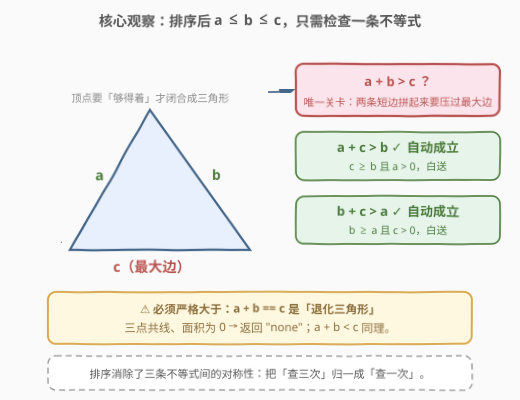
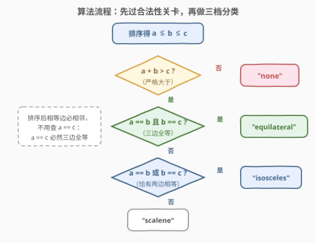
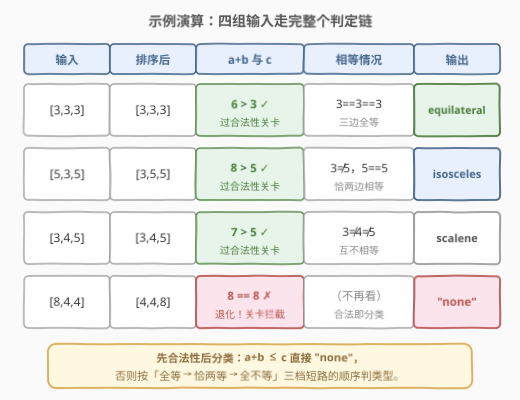

# 三角形类型

- **题目名称**：三角形类型
- **链接**：[3024. 三角形类型](https://leetcode.cn/problems/type-of-triangle/)
- **难度**：简单
- **标签**：数组、数学、排序

## 1. 题目概述

给你一个下标从 **0** 开始、长度为 **3** 的整数数组 `nums`，需要用它们来构造**三角形**。

- 如果一个三角形的**所有边长度相等**，那么这个三角形称为 **equilateral**（等边）。
- 如果一个三角形**恰好有两条边长度相等**，那么这个三角形称为 **isosceles**（等腰）。
- 如果一个三角形**三条边的长度互不相同**，那么这个三角形称为 **scalene**（不等边）。

如果这个数组无法构成一个三角形，请你返回字符串 `"none"`，否则返回一个字符串表示这个三角形的类型。

**示例 1**：

```text
输入：nums = [3,3,3]
输出："equilateral"
解释：由于三条边长度相等，所以可以构成一个等边三角形，返回 "equilateral"。
```

**示例 2**：

```text
输入：nums = [3,4,5]
输出："scalene"
解释：任意两边之和都大于第三边，可以构成三角形；三条边长度互不相等，返回 "scalene"。
```

**补充示例 3**（覆盖 `"none"` 分支）：

```text
输入：nums = [8,4,4]
输出："none"
解释：排序后 a=4, b=4, c=8，a+b=8 不大于 c=8，无法构成三角形。
```

**约束条件**：

- $\text{nums.length} == 3$
- $1 \le \text{nums}[i] \le 100$

> 💡 读题关键：判定分两层——第一层「**能不能**构成三角形」（三角形不等式），第二层「**是什么**类型」（相等边的个数）。先合法、后分类，顺序不能乱：非法输入没有类型可言。

---

## 2. 解题思路

### 2.1 暴力思路：写全三条不等式 + 三重相等判断

不排序，直接把三条**三角形不等式**全部写出来：

$$\text{nums}[0] + \text{nums}[1] > \text{nums}[2],\quad \text{nums}[0] + \text{nums}[2] > \text{nums}[1],\quad \text{nums}[1] + \text{nums}[2] > \text{nums}[0]$$

三条全过再判类型：`x==y && y==z` 三边全等；`x==y || y==z || x==z` 恰有两边相等；否则不等边。

这当然正确——三条不等式各自独立检查，把对称性当成三个不同的问题来对待。但它的冗余是有代价的：条件写三条容易漏一条（尤其手写时把 `>` 误写成 `>=`），相等判断在未排序时要覆盖 $(x,y),(y,z),(x,z)$ **三种两两组合**，分支多、易错。数组长度恒为 3 时两种写法复杂度同阶，正解的价值不在速度，而在**把判定归一、把代码写对**。

### 2.2 核心观察：排序后只剩一条关键不等式



将三条边排序为 $a \le b \le c$，三条三角形不等式中**只有一条需要检查**：

1. **$a + c > b$ 自动成立**：因为 $c \ge b$ 且 $a \ge 1 > 0$，所以 $a + c \ge b + a > b$；
2. **$b + c > a$ 自动成立**：因为 $b \ge a$ 且 $c > 0$，所以 $b + c \ge a + c > a$；
3. **$a + b > c$ 是唯一关卡**：$c$ 是最大边，两条短边拼起来必须**严格大于**它，剩下两条不等式里它都是「加数」，天然帮衬。

> 💡 这就是排序的经典用途之一——**消除对称性**：三条边地位本相同，排序后「谁大谁小」定了，三条同类约束就坍缩成一条关键约束。976（最大周长）、611（有效三角形个数）用的都是同一个归一化。

> ⚠️ **必须严格大于**：$a + b == c$ 是「退化三角形」——三点共线、面积为 0，不构成三角形，返回 `"none"`。判等时写成 `a + b >= c` 是本题最常见的错误。

类型判定同样受益于排序：**相等元素排序后必相邻**，只需检查 $a == b$ 和 $b == c$ 两个相邻对，连 $a == c$ 都不用查——$a == c$ 且 $a \le b \le c$ 会强制 $a == b == c$，已被等边分支覆盖。

### 2.3 算法流程：先过合法性关卡，再做三档分类



四个步骤**短路**排列：

1. 排序得 $a \le b \le c$（3 个元素，常数次比较）；
2. 若 $a + b \le c$，返回 `"none"`（合法性关卡，含退化情形）；
3. 若 $a == b$ 且 $b == c$，返回 `"equilateral"`；
4. 若 $a == b$ 或 $b == c$，返回 `"isosceles"`（走到这里必不是等边）；否则返回 `"scalene"`。

> 💡 分类顺序有讲究：**全等 → 恰两等 → 全不等**，从最强条件往弱走，每步只需回答一个问题；若把等腰判断放最前面，等边三角形会先命中「有两边相等」而误判——除非额外加 `&& !(a==b&&b==c)` 补丁。

### 2.4 示例演算



| 输入 | 排序后 | $a+b$ vs $c$ | 相等情况 | 输出 |
|------|--------|--------------|----------|------|
| `[3,3,3]` | `[3,3,3]` | $6 > 3$ ✓ | `3==3==3` | `"equilateral"` |
| `[5,3,5]` | `[3,5,5]` | $8 > 5$ ✓ | `3≠5，5==5` | `"isosceles"` |
| `[3,4,5]` | `[3,4,5]` | $7 > 5$ ✓ | 全不等 | `"scalene"` |
| `[8,4,4]` | `[4,4,8]` | $8 == 8$ ✗ | （不再看） | `"none"` |

注意 `[5,3,5]`：原始顺序下相等的两边（5 和 5）并不相邻，排序后 `[3,5,5]` 才让它们贴在一起——这正是「排序后相等边必相邻」的意义。

---

## 3. 参考代码

### C++（排序 + 关卡判定）

```cpp
class Solution {
  public:
    string triangleType(vector<int>& nums) {
        sort(nums.begin(), nums.end());
        int a = nums[0], b = nums[1], c = nums[2];
        if (a + b <= c) return "none";               // 退化或无法构成
        if (a == b && b == c) return "equilateral";  // 三边全等
        if (a == b || b == c) return "isosceles";    // 恰有两边相等
        return "scalene";                            // 互不相等
    }
};
```

### Python（sorted 解包一行完成排序）

```python
class Solution:
    def triangleType(self, nums: List[int]) -> str:
        a, b, c = sorted(nums)
        if a + b <= c:
            return "none"
        if a == b == c:          # Python 链式比较，即 a==b 且 b==c
            return "equilateral"
        if a == b or b == c:
            return "isosceles"
        return "scalene"
```

> 💡 不想排序也可以用**求和技巧**：合法 $\iff$ $\max \times 2 < \text{sum}$。因为排序后 $c$ 是最大边，$a+b>c \iff a+b+c > 2c$。类型判定则统计 `sum(x == y for ...)` 相等对数或用 `len(set(nums))`：1 种边长等边、2 种等腰、3 种不等边。两种写法都正确，但排序版把不等式与判等统一在 $a \le b \le c$ 的框架下，推理链最短。

---

## 4. 复杂度分析

| 维度 | 复杂度 | 说明 |
|------|--------|------|
| 时间复杂度 | $O(1)$ | 数组长度恒为 3，排序退化为常数次比较；一般化为任意长度 $n$ 则为 $O(n \log n)$（排序主导） |
| 空间复杂度 | $O(1)$ | 仅三个变量 `a` / `b` / `c`；Python `sorted` 会建新列表，但长度仍为 3 |

---

## 5. 扩展：三角形不等式家族

**变体一：从「判定一个」到「计数/最优化」**。同一条 $a+b>c$ 关卡可以长出整族题：

- [976. 三角形的最大周长](https://leetcode.cn/problems/largest-perimeter-triangle/)：排序后**从大到小**枚举连续三元组 $(c, b, a)$，遇到第一个 $a+b>c$ 即为最大周长——每一步仍是本题的关卡判定，只是方向反了（贪心选最大 $c$）；
- [611. 有效三角形的个数](https://leetcode.cn/problems/valid-triangle-number/)：排序后固定最大边 $c$，用**双指针**数满足 $a+b>c$ 的对数，把单次判定摊成批量计数（本仓库已有题解）；
- [2971. 找到最大周长的多边形](https://leetcode.cn/problems/find-polygon-with-the-largest-perimeter/)：不等式推广到 $n$ 边形——除最大边外其余边之和 $>$ 最大边，排序 + 后缀和一路检查。

**变体二：边长允许为 0 或负数？** 本题约束 $1 \le \text{nums}[i] \le 100$ 恒为正。若允许 0，排序归一的推理「$a \ge 1 > 0$ 白送两条不等式」会失效（$a=0$ 时 $a+c>b$ 不再自动成立），需要回到暴力版把三条不等式查全。**先看约束再选简化**，是这类「显然成立」推理的安全带。

---

## 6. 面试要点

1. **为什么排序后只需检查 $a+b>c$ 一条不等式？**

   - 排序得 $a \le b \le c$ 后，$c$ 作为最大边只在 $a+b>c$ 中「被挑战」；在另外两条不等式里 $c$ 是加数（$a+c>b$、$b+c>a$），由 $c \ge b \ge a > 0$ 分别推出 $a+c \ge a+b > b$ 与 $b+c \ge a+c > a$，天然成立。

2. **$a+b == c$ 算不算三角形？判等符号错在哪？**

   - 不算。$a+b==c$ 时三点共线（可以用鞋带公式验证面积为 0），是退化情形，返回 `"none"`。所以关卡必须写**严格**大于，`>=` 是错的。

3. **为什么判等只查 $a==b$ 和 $b==c$，不查 $a==c$？**

   - 排序后相等元素必相邻。若 $a==c$，由 $a \le b \le c$ 夹逼出 $a==b==c$，必然先命中等边分支；未排序时则需要查全 $(a,b),(b,c),(a,c)$ 三对。

4. **不排序怎么做？两种思路的取舍？**

   - 思路一：三条不等式全查 + 三对相等全比，正确但分支多；思路二：求和技巧 $\max \times 2 < \text{sum}$ 判合法 + `len(set(nums))` 判类型，代码短。排序版的优势是把推理收敛到「最大边」一个焦点上，扩展性最好（976/611/2971 全是它的延伸）。

5. **这道简单题的「考点」到底是什么？**

   - 排序**消除对称性**的意识：地位对等的元素排个序，多条同类约束坍缩成一条关键约束；以及边界敏感度（严格 `>`、退化三角形、先合法后分类的短路顺序）。算法本身是幼儿园知识，工程上写对的人并不多。

---

## 7. 同类练习题

- [976. 三角形的最大周长](https://leetcode.cn/problems/largest-perimeter-triangle/)：同一道 $a+b>c$ 关卡，从大到小贪心找首个合法三元组，本题判定的「最优化」近亲
- [611. 有效三角形的个数](https://leetcode.cn/problems/valid-triangle-number/)：排序 + 固定最大边 + 双指针，把单次判定摊成批量计数（本仓库已有题解）
- [2971. 找到最大周长的多边形](https://leetcode.cn/problems/find-polygon-with-the-largest-perimeter/)：三角形不等式推广到 $n$ 边形（其余边之和 $>$ 最大边），归一化思想的再上一层
- [812. 最大三角形面积](https://leetcode.cn/problems/largest-triangle-area/)：三角形家族的另一端，鞋带公式 + 三重枚举，与本题互补的「几何计算」方向
