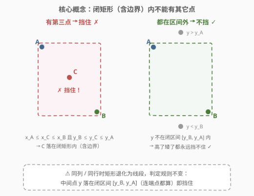
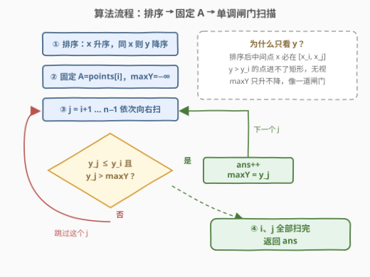

# 人员站位的方案数 I

- **题目名称**：人员站位的方案数 I
- **链接**：[3025. 人员站位的方案数 I](https://leetcode.cn/problems/find-the-number-of-ways-to-place-people-i/)
- **难度**：中等
- **标签**：几何、数组、排序、枚举

## 1. 题目概述

给定一个 $n \times 2$ 的二维数组 `points`，表示二维平面上的点坐标，`points[i] = [x_i, y_i]`。

计算**点对** $(A, B)$ 的数量，其中：

- $A$ 在 $B$ 的**左上角**（即 $x_A \le x_B$ 且 $y_A \ge y_B$），并且
- 它们围成的**闭矩形**中（含边界；两点同列或同行时退化为线段）**没有其它点**（包括边界上的点），除了 $A$ 和 $B$ 自身。

返回点对数量。

**示例 1**：

```text
输入：points = [[1,1],[2,2],[3,3]]
输出：0
解释：所有点都在同一条斜线上，任何两点中 A 都无法位于 B 的左上角。
```

**示例 2**：

```text
输入：points = [[6,2],[4,4],[2,6]]
输出：2
解释：合法点对：(4,4)→(6,2) 与 (2,6)→(4,4)；
     (2,6)→(6,2) 不合法，因为 (4,4) 在矩形内部。
```

**示例 3**：

```text
输入：points = [[3,1],[1,3],[1,1]]
输出：2
解释：合法点对：(1,1)→(3,1)（水平线段）与 (1,3)→(1,1)（竖直线段）；
     (1,3)→(3,1) 不合法，因为 (1,1) 在矩形边界上。
```

**约束条件**：

- $2 \le n \le 50$
- `points[i].length == 2`
- $0 \le x_i, y_i \le 50$
- 点对**两两不同**（无重合点）

> ⚠️ 读题陷阱：①矩形是**闭**的——落在边界（包括线段内部）上的第三点也算「挡住」；②$A$、$B$ 同列或同行时矩形退化为线段，同样合法，判定规则不变；③点对按「谁是左上角」定向，$(A,B)$ 与 $(B,A)$ 只有 $A$ 在左上那一种定向可数，不会重复计数。

---

## 2. 解题思路

### 2.1 暴力思路

枚举所有**有序对** $(i, j)$：先判定 $i$ 是否在 $j$ 的左上角（$x_i \le x_j$ 且 $y_i \ge y_j$）；若是，再枚举第三点 $k$，判定它是否落在闭矩形 $[x_i, x_j] \times [y_j, y_i]$ 内。三重循环时间 $O(n^3)$，$n \le 50$ 时约 $1.25 \times 10^5$ 次判定，轻松通过。但只要 $n$ 涨到上千（如姊妹题 3027 的 $n \le 1000$）就会到 $10^9$ 量级，面试必须给出平方做法。

### 2.2 核心观察：排序让「x 落在矩形内」自动成立



把所有点按 **$x$ 升序；$x$ 相同时 $y$ 降序** 排列，然后固定下标 $i$ 的点作为左上角 $A$，向右扫描 $j = i+1, \dots, n-1$：

1. **$x$ 条件白送**：任何夹在 $i < k < j$ 之间的点都满足 $x_i \le x_k \le x_j$（排序保证），即中间点的横坐标**必然落在矩形横向范围里**。于是「点 $k$ 是否挡住 $(A, B)$」只剩一个纵坐标条件：$y_j \le y_k \le y_i$。
2. **$y > y_i$ 的点永远无害**：矩形上边界就是 $y_i$，纵坐标超过 $y_i$ 的中间点根本进不了任何以 $A$ 为左上角的矩形，可以直接无视。
3. **维护 `maxY`**：设 `maxY` = 已扫过的中间点里「$y \le y_i$ 的那部分点」的纵坐标最大值（初始 $-\infty$）。则点对 $(i, j)$ 合法当且仅当：

$$y_j \le y_i \quad \text{且} \quad y_j > \text{maxY}$$

> 💡 **为什么这样就够了**：剩下的可疑点（$y \le y_i$ 的中间点）里，只要「最高的那个」都低于 $y_j$（即 $\text{maxY} < y_j$），说明**全部**中间点都严格沉在矩形底边 $y_j$ 之下——矩形里自然一个点都没有。反之若 $\text{maxY} \ge y_j$，那个取到最大值的点 $k$ 满足 $y_j \le y_k \le y_i$，且 $x$ 条件自动成立，正好挡在矩形里。

> ⚠️ **为什么同列必须 $y$ 降序**：同列两点 $A=(x, 5)$、$B=(x, 3)$，$A$ 在 $B$ 左上。若同列按 $y$ 升序排，$B$ 会排在 $A$ 前面，固定 $B$ 扫描时 $A$ 已在身后，这个合法对就被漏数了。$y$ 降序保证**同列时上面的点排前面**，左上角的下标必小于右下角，每个合法对恰好被枚举一次。

### 2.3 算法流程图



```text
排序（x 升序，同 x 则 y 降序）
for i in 0..n-1:            # 固定左上角 A = points[i]
    maxY = -∞
    for j in i+1..n-1:      # 向右扫右下角候选 B
        if points[j].y <= A.y and points[j].y > maxY:
            ans += 1        # 闭矩形为空，计数
            maxY = points[j].y
return ans
```

`maxY` 像一道**只升不降的闸门**：每数一个合法的 $B$，闸门就抬到 $y_j$，之后纵坐标不超过闸门的候选（必然被之前的某个点挡住）统统过滤掉；而纵坐标高于 $y_i$ 的点连闸门都碰不到，天然无害。

### 2.4 示例演算

![示例演算：points=[[6,2],[4,4],[2,6]] 的完整扫描过程](../images/p3025_example_walkthrough.svg)

以示例 2 `points = [[6,2],[4,4],[2,6]]` 演算。排序（$x$ 升序、同 $x$ 则 $y$ 降序）后为 `[[2,6],[4,4],[6,2]]`：

| $i$（$A$） | $j$（$B$） | $y_j \le y_i$？ | $y_j > \text{maxY}$？ | 计数？ | `maxY` | 说明 |
|-----------|-----------|----------------|----------------------|--------|--------|------|
| $(2,6)$ | $(4,4)$ | $4 \le 6$ ✓ | $4 > -\infty$ ✓ | ✅ +1 | $4$ | 矩形内无点 |
| $(2,6)$ | $(6,2)$ | $2 \le 6$ ✓ | $2 > 4$ ✗ | ❌ | $4$ | $(4,4)$ 在矩形内部，挡住 |
| $(4,4)$ | $(6,2)$ | $2 \le 4$ ✓ | $2 > -\infty$ ✓ | ✅ +1 | $2$ | 矩形内无点 |

最终 `ans = 2`，与示例一致。

再看示例 3 `[[3,1],[1,3],[1,1]]`，排序后为 `[[1,3],[1,1],[3,1]]`：

- $A=(1,3)$：$B=(1,1)$ 合法（竖直线段上无第三点，$1 > -\infty$ 计数，`maxY`=1）；$B=(3,1)$ 被挡——$1 > 1$ 不成立，正是 $(1,1)$ 压在矩形**边界**上的体现（闭矩形，边界也算挡住）。
- $A=(1,1)$：$B=(3,1)$ 合法（水平线段 $y=1$，$1 > -\infty$ 计数）。

合计 2，同样吻合。

---

## 3. 参考代码

### C++（排序 + 单调闸门，$O(n^2)$）

```cpp
class Solution {
  public:
    int numberOfPairs(vector<vector<int>>& points) {
        sort(points.begin(), points.end(), [](const auto& a, const auto& b) {
            return a[0] != b[0] ? a[0] < b[0] : a[1] > b[1];  // x 升序，同 x 则 y 降序
        });
        int n = points.size(), ans = 0;
        for (int i = 0; i < n; ++i) {
            int y1 = points[i][1];
            int maxY = INT_MIN;               // 已扫中间点（y<=y1 部分）的最高纵坐标
            for (int j = i + 1; j < n; ++j) {
                int y2 = points[j][1];
                if (y2 <= y1 && y2 > maxY) {  // B 在 A 下方且闭矩形为空
                    ++ans;
                    maxY = y2;                // 抬高闸门
                }
            }
        }
        return ans;
    }
};
```

### Python（暴力对照版 + $O(n^2)$ 版）

暴力 $O(n^3)$ 版（思路直白，作「保底正确」的参考实现）：

```python
class Solution:
    def numberOfPairs(self, points: List[List[int]]) -> int:
        n, ans = len(points), 0
        for i in range(n):
            for j in range(n):
                if i == j:
                    continue
                ax, ay = points[i]
                bx, by = points[j]
                if not (ax <= bx and ay >= by):   # i 不在 j 左上
                    continue
                if all(not (ax <= p[0] <= bx and by <= p[1] <= ay)
                       for k, p in enumerate(points) if k not in (i, j)):
                    ans += 1
        return ans
```

排序 + 单调闸门 $O(n^2)$ 版（与 C++ 逻辑一致）：

```python
class Solution:
    def numberOfPairs(self, points: List[List[int]]) -> int:
        points.sort(key=lambda p: (p[0], -p[1]))
        n, ans = len(points), 0
        for i in range(n):
            y1 = points[i][1]
            max_y = -inf
            for j in range(i + 1, n):
                y2 = points[j][1]
                if max_y < y2 <= y1:      # 闭矩形为空的充要条件
                    ans += 1
                    max_y = y2
        return ans
```

> 💡 Python 的链式比较 `max_y < y2 <= y1` 恰好把两个判定条件写成一个不等式链，语义与推导逐字对应。

---

## 4. 复杂度分析

| 维度 | 复杂度 | 说明 |
|------|--------|------|
| 时间复杂度 | $O(n^2)$ | 排序 $O(n \log n)$ + 外层固定 $A$、内层扫 $B$ 的双重循环 $O(n^2)$，前者被后者吸收 |
| 空间复杂度 | $O(1)$ | 只用常数个变量（`maxY`、`ans`），不计排序自身的 $O(\log n)$ 栈空间 |

其中 $n = \text{len(points)}$。暴力版时间 $O(n^3)$、空间 $O(1)$：$n \le 50$ 时可行，$n \ge 10^3$ 时超时——这正是 3025 与 3027 的分水岭（见第 5 节）。

---

## 5. 扩展：姊妹题 3027 与闸门的正确性细节

**[3027. 人员站位的方案数 II](https://leetcode.cn/problems/find-the-number-of-ways-to-place-people-ii/)** 把规模放大到 $n \le 1000$、坐标 $|x|, |y| \le 10^9$。本节 $O(n^2)$ 解法**原封不动直接通过**：坐标域扩大毫无影响（全程只做比较，不做值域桶），$10^6$ 次比较轻松跑完；而 $O(n^3)$ 暴力（$10^9$ 次）直接出局。两题同一天周赛出品，出题人就是想让你从暴力升级到平方做法。

**`maxY` 只在计数时更新，为什么漏不掉信息？** 注意 `maxY` 的语义是「已扫中间点中 $y \le y_i$ 那部分的最大值」：纵坐标高于 $y_i$ 的点被跳过是**故意的**——它们永远进不了以 $A$ 为左上角的矩形，参与取最大只会误伤后面合法的候选（把闸门抬到矩形上边界之上，导致漏数）。而被计数的 $y_j$ 一定满足 $y_j \le y_i$，每次更新都合法地抬高闸门到「已见过的、不高于 $y_i$ 的最高点」。

**为什么不会重数或漏数？** 一个合法对中左上角 $A$ 与右下角 $B$ 的关系只可能是：$x_A < x_B$，或 $x_A = x_B$ 且 $y_A > y_B$（点两两不同）。两种情况排序后 $A$ 的下标都严格小于 $B$，于是该对**恰好**在外层循环走到 $A$、内层扫到 $B$ 时被计数一次；内层条件 $y_j \le y_i$ 又天然排除了 $B$ 在 $A$ 上方的定向，无重复。

---

## 6. 面试要点

1. **为什么排序后中间点的横坐标条件「自动成立」？**

   - 排序按 $x$ 升序，夹在下标 $i < k < j$ 之间的点必有 $x_i \le x_k \le x_j$，恰好就是闭矩形的横向范围。于是「$k$ 是否挡住 $(A,B)$」从二维判定坍缩成一维：只看 $y_k$ 是否落在 $[y_j, y_i]$。

2. **同列时为什么必须按 $y$ 降序？**

   - 合法对允许 $A$、$B$ 同列（$x_A = x_B$，$y_A > y_B$，矩形退化为竖线段）。若同列按 $y$ 升序，右下角 $B$ 会排在 $A$ 前面，固定 $A$ 向右扫时再也遇不到 $B$，漏数。$y$ 降序保证同列时上方的点在前，左上角下标必小。

3. **`maxY` 为什么不用「所有中间点的最大值」，而要忽略 $y > y_i$ 的点？**

   - 高于 $y_i$ 的点进不了任何以 $A$ 为左上角的闭矩形（上边界就是 $y_i$），不忽略它们会把闸门抬得过高，把后面原本合法（矩形确实为空）的候选误判为被挡住。正确语义是「中间点里 $y \le y_i$ 部分的最大值」。

4. **边界上的点算不算挡住？对代码有什么影响？**

   - 算，题目明确闭矩形含边界。代码里判定的区间 $[y_j, y_i]$ 两端都是闭的：中间点 $y_k = y_j$（压在底边/线段上）或 $y_k = y_i$（压在顶边上）都算挡住。示例 3 中 $(1,1)$ 压在 $(1,3)$-$(3,1)$ 矩形边界上导致该对不合法，就是靠闭区间端点挡下的。

5. **$n$ 放大到 1000（3027）怎么办？还能更好吗？**

   - $O(n^2)$ 枚举（约 $10^6$）依然轻松。再往下压并不容易：本质是数「二维支配矩形为空」的点对，与最近点对、空矩形等问题同族，通常需要复杂的数据结构；周赛出题人的预期答案就是平方做法，不必过度优化。

---

## 7. 同类练习题

- [3027. 人员站位的方案数 II](https://leetcode.cn/problems/find-the-number-of-ways-to-place-people-ii/)：本题的放大版（$n \le 1000$），同一个 $O(n^2)$ 解法直接通过，验证你有没有真的写出平方做法
- [149. 直线上最多的点数](https://leetcode.cn/problems/max-points-on-a-line/)（[题解](../0101-0200/149_直线上最多的点数.md)）：同为「固定一点 + 按几何关系分组计数」的枚举套路，用斜率哈希代替这里的闸门
- [447. 回旋镖的数量](https://leetcode.cn/problems/number-of-boomerangs/)：固定锚点枚举其余点、按距离分组，与本题「固定 $A$ 扫 $B$」的双层枚举结构一致
- [939. 最小面积矩形](https://leetcode.cn/problems/minimum-area-rectangle/)：枚举对角点对 + 哈希查另一对角，点对枚举思想在矩形问题上的另一应用
- [1232. 缀点成线](https://leetcode.cn/problems/check-if-it-is-a-straight-line/)：共线判定的几何基本功，面试常作为本题的热身追问
