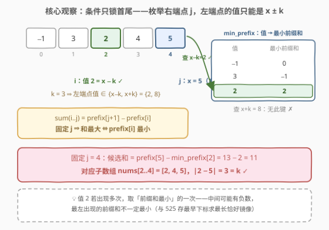
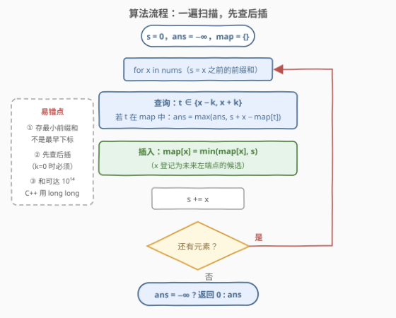
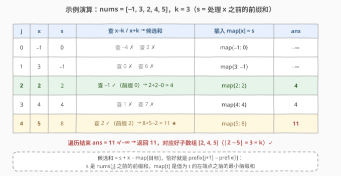

# 最大好子数组和

- **题目名称**：最大好子数组和
- **链接**：[3026. 最大好子数组和](https://leetcode.cn/problems/maximum-good-subarray-sum/)
- **难度**：中等
- **标签**：数组、哈希表、前缀和

## 1. 题目概述

给你一个长度为 $n$ 的数组 `nums` 和一个**正**整数 $k$。

如果 `nums` 的一个子数组中，第一个元素和最后一个元素**差的绝对值恰好**为 $k$，我们称这个子数组为**好**的。换句话说，如果子数组 `nums[i..j]` 满足 $|\text{nums}[i] - \text{nums}[j]| = k$，那么它是一个好子数组。

请你返回 `nums` 中**好**子数组的**最大**和，如果没有好子数组，返回 0。

**示例 1**：

```text
输入：nums = [1,2,3,4,5,6], k = 1
输出：11
解释：好子数组有 [1,2]、[2,3]、[3,4]、[4,5] 和 [5,6]。
     最大子数组和为 11，对应的子数组为 [5,6]。
```

**示例 2**：

```text
输入：nums = [-1,3,2,4,5], k = 3
输出：11
解释：好子数组有 [-1,3,2] 和 [2,4,5]。最大子数组和为 11，
     对应的子数组为 [2,4,5]。
```

**示例 3**：

```text
输入：nums = [-1,-2,-3,-4], k = 2
输出：-6
解释：好子数组有 [-1,-2,-3] 和 [-2,-3,-4]。最大子数组和为 -6，
     对应的子数组为 [-1,-2,-3]。
```

**约束条件**：

- $2 \le \text{nums.length} \le 10^5$
- $-10^9 \le \text{nums}[i] \le 10^9$
- $1 \le k \le 10^9$

> ⚠️ 读题陷阱：① 好子数组的和**可以是负数**（示例 3 的答案是 −6），所以不能用 0 当「最大值」的初始值；② 条件只约束**首尾两个元素**，中间元素完全自由——这是本题能线性求解的根源。

---

## 2. 解题思路

### 2.1 暴力思路

枚举每一对 $(i, j)$（$i < j$），判断 $|\text{nums}[i] - \text{nums}[j]| = k$ 是否成立；成立则用前缀和 $O(1)$ 算出 $\text{sum}(i..j) = \text{prefix}[j+1] - \text{prefix}[i]$ 打擂台。时间 $O(n^2)$、空间 $O(n)$。$n = 10^5$ 时约 $10^{10}$ 次判断，必然超时。

浪费在哪？**子数组和**这一侧已经用前缀和压到 $O(1)$ 了，瓶颈在**枚举左端点**——而好子数组的条件其实只把左端点的「值」钉死了，根本不需要逐个位置去试。

### 2.2 核心观察：前缀和 + 哈希表维护「值 → 最小前缀和」



把条件拆开，整个问题化成三步：

1. **条件只锁两端**：$|\text{nums}[i] - \text{nums}[j]| = k$ 等价于 $\text{nums}[i] = \text{nums}[j] - k$ **或** $\text{nums}[i] = \text{nums}[j] + k$。**枚举右端点 $j$（记 $x = \text{nums}[j]$），左端点的值只剩两种可能**，中间元素完全不参与判定。

2. **前缀和改写目标**：$\text{sum}(i..j) = \text{prefix}[j+1] - \text{prefix}[i]$。固定 $j$ 后 $\text{prefix}[j+1]$ 是定值，于是

$$\text{sum}(i..j) \text{ 最大} \iff \text{prefix}[i] \text{ 最小}$$

3. **哈希表一键定位**：维护 $\text{minPrefix}[v] = $ 已扫描部分中，所有满足 $\text{nums}[i] = v$ 的位置 $i$ 里**最小的** $\text{prefix}[i]$。每个 $j$ 先用 $x-k$、$x+k$ 两个键查表更新答案，再把自己（连同当前前缀和）插入表里，作为后续右端点的左端点候选。

> 💡 **为什么存「最小前缀和」而不是「最左出现位置」**：本题优化的是**和**，与 $\text{prefix}[i]$ 直接挂钩；数组含负数时，最左出现位置的前缀和不一定最小（如 `[3,−10,3,6]`、$k=3$：取后面的 3 做左端点和为 9，取最前面的 3 只有 2）。这与 [525. 连续数组](../0501-0600/525_连续数组.md) 存「最早下标」（优化**长度**）恰好形成镜像。

### 2.3 算法流程图



一遍扫描，每个元素做三件事：**查**（用 $x \pm k$ 找左端点）→ **插**（把自己登记为未来左端点）→ **累加**（更新前缀和）。

> ⚠️ **先查后插**：本题 $k \ge 1$，$x \pm k \ne x$，即使先插后查也不会匹配到当前元素自身；但若变体允许 $k = 0$，先插后查就会把「单元素子数组」错误地算进答案（$|x - x| = 0 = k$ 恰好成立）。统一按先查后插写，语义是「右端点只与**已扫过**的元素配对」。

### 2.4 示例演算



以 `nums = [-1,3,2,4,5]`、`k = 3` 走一遍完整流程（$s$ 为处理当前元素**之前**的前缀和）：

| j | x | s | 查 x±k → 候选和 | 插入 map | ans |
|---|---|---|-----------------|----------|-----|
| 0 | −1 | 0 | 查 −4 ✗ / 2 ✗ | map{−1:0} | −∞ |
| 1 | 3 | −1 | 查 0 ✗ / 6 ✗ | map{3:−1} | −∞ |
| 2 | 2 | 2 | 查 −1 ✓（前缀 0）→ 2+2−0 = 4 | map{2:2} | 4 |
| 3 | 4 | 4 | 查 1 ✗ / 7 ✗ | map{4:4} | 4 |
| 4 | 5 | 8 | 查 2 ✓（前缀 2）→ 8+5−2 = 11 ★ | map{5:8} | 11 |

遍历结束 `ans = 11`，对应好子数组 `[2,4,5]`（$|2-5| = 3 = k$），与示例 2 一致。注意 $j=4$ 时查到的 `map[2] = 2` 正是 $j=2$ 那一步插入的——**今天插入的键，服务于明天的查询**。

---

## 3. 参考代码

### C++

```cpp
class Solution {
  public:
    long long maximumSubarraySum(vector<int>& nums, int k) {
        unordered_map<int, long long> minPrefix;   // 值 v -> 值为 v 的位置之前，最小的前缀和
        long long s = 0;                           // s = 当前元素之前的前缀和
        long long ans = LLONG_MIN;                 // −∞ 表示还没遇到好子数组
        for (int x : nums) {
            for (int target : {x - k, x + k}) {    // 左端点值只有两种可能
                auto it = minPrefix.find(target);
                if (it != minPrefix.end())         // 候选和 = prefix[j] + x - prefix[i]
                    ans = max(ans, s + x - it->second);
            }
            auto it = minPrefix.find(x);           // x 登记为未来左端点候选
            if (it == minPrefix.end()) minPrefix.emplace(x, s);
            else it->second = min(it->second, s);  // 同值多次出现，前缀和取最小
            s += x;
        }
        return ans == LLONG_MIN ? 0 : ans;
    }
};
```

### Python

```python
class Solution:
    def maximumSubarraySum(self, nums: List[int], k: int) -> int:
        min_prefix = {}                    # 值 v -> 值为 v 的位置之前的最小前缀和
        s = 0                              # 当前元素之前的前缀和
        ans = None                         # None 表示还没遇到好子数组
        for x in nums:
            for target in (x - k, x + k):  # 左端点值只有两种可能
                if target in min_prefix:
                    cand = s + x - min_prefix[target]
                    if ans is None or cand > ans:
                        ans = cand
            if x not in min_prefix or s < min_prefix[x]:
                min_prefix[x] = s          # x 登记为未来左端点候选
            s += x
        return ans if ans is not None else 0
```

> 💡 两个实现细节：① 候选和写成 $s + x - \text{minPrefix}[t]$，不必单独维护 $\text{prefix}[j+1]$；② 答案可能为负，C++ 用 `LLONG_MIN`、Python 用 `None` 做哨兵，结尾统一转 0。

---

## 4. 复杂度分析

| 维度 | 复杂度 | 说明 |
|------|--------|------|
| 时间复杂度 | $O(n)$ | 每个元素 2 次哈希查询 + 1 次插入，均摊 $O(1)$ |
| 空间复杂度 | $O(n)$ | 哈希表最多存 $n$ 个不同的值 |

其中 $n = \text{len(nums)}$。子数组和最大可达 $10^5 \times 10^9 = 10^{14}$，C++ 必须用 `long long`（32 位 `int` 上限约 $2.1 \times 10^9$）。

---

## 5. 扩展：三个变体讨论

**变体一：$k = 0$ 时怎么办？** 条件变成首尾同值。此时「先查后插」从「好习惯」升级为**硬性要求**——若先插后查，$x$ 会查到自己刚插入的键，把长度 1 的「子数组」也算进答案。其余逻辑不变。

**变体二：求最小好子数组和？** 对称地，哈希表改存**最大**前缀和 $\text{maxPrefix}[v]$，候选和取 $\min$ 打擂。甚至可以同一遍扫描同时维护两张表，一次求出最大和与最小和。

**变体三：统计好子数组的个数？** 哈希表改存每个值出现的**次数**，每个 $j$ 把 $\text{cnt}[x-k] + \text{cnt}[x+k]$ 累加进答案——这正是 [560. 和为 K 的子数组](https://leetcode.cn/problems/subarray-sum-equals-k/) 的计数套路。可见「前缀和 + 哈希表」家族里，**存什么取决于问什么**：存最小前缀和求最大和、存最早下标求最长长度、存次数求方案数。

---

## 6. 面试要点

1. **为什么枚举右端点后，左端点只有两个候选值？**

   - 好子数组的条件 $|\text{nums}[i] - \text{nums}[j]| = k$ 只涉及首尾两个位置的**值**。固定 $j$（$x = \text{nums}[j]$）后解绝对值方程，得 $\text{nums}[i] \in \{x-k,\ x+k\}$；$k \ge 1$ 保证两值不同，中间元素完全自由。

2. **哈希表里为什么存「最小前缀和」而不是「最左出现下标」？**

   - 固定 $j$ 后 $\text{sum}(i..j) = \text{prefix}[j+1] - \text{prefix}[i]$，和最大 $\iff \text{prefix}[i]$ 最小。数组含负数时最左位置的前缀和未必最小（如 `[3,−10,3,6]`、$k=3$：后面的 3 给出和 9，最前面的 3 只有 2），所以必须对同值的所有位置维护前缀和的 $\min$。

3. **先查后插还是先插后查，有区别吗？**

   - 本题 $k \ge 1$、$x \pm k \ne x$，两种顺序结果相同；但 $k = 0$ 的变体必须先查后插，否则单元素子数组会混进答案。标准写法是先查后插，语义为「右端点只与已扫过的元素配对」。

4. **为什么答案初始值不能是 0？**

   - 好子数组的和可以是负数（示例 3 返回 −6）。用 0 初始化会把「和为负的好子数组」错误地吞成 0。正确做法：$-\infty$（或 `None`）做哨兵，结尾判断「从未命中才返回 0」。

5. **溢出风险在哪？**

   - 和的量级：$10^5 \times 10^9 = 10^{14}$，超 32 位整型，C++ 必须用 `long long`。哈希键 $x \pm k$ 的量级：最大 $2 \times 10^9$，仍在 `int` 范围内（上限约 $2.147 \times 10^9$），但已贴近边界，面试时值得主动指出。

---

## 7. 同类练习题

- [560. 和为 K 的子数组](https://leetcode.cn/problems/subarray-sum-equals-k/)：前缀和 + 哈希计数的开山之作，存「前缀和 → 出现次数」
- [525. 连续数组](https://leetcode.cn/problems/contiguous-array/)（[题解](../0501-0600/525_连续数组.md)）：存「最早下标」求最长长度，与本题存「最小前缀和」求最大和互为镜像
- [974. 和可被 K 整除的子数组](https://leetcode.cn/problems/subarray-sums-divisible-by-k/)（[题解](../0901-1000/974_和可被K整除的子数组.md)）：同余定理把前缀和压到余数域再哈希计数
- [930. 和相同的二元子数组](https://leetcode.cn/problems/binary-subarrays-with-sum/)：560 的 01 数组特化版，练手「前缀和 + 哈希」计数模板
