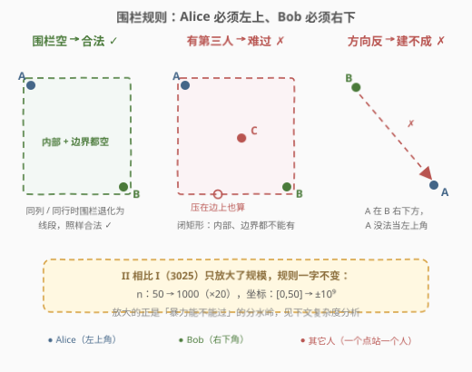
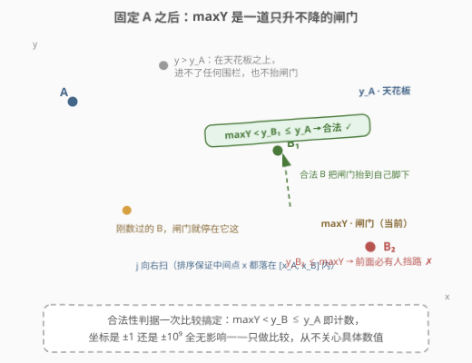
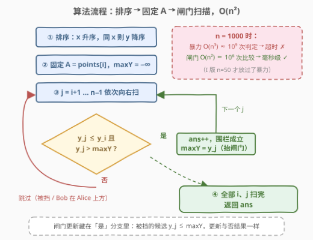

# LeetCode 人员站位的方案数 II 题解

## 1. 题目概述

- **标题 / 题号**：人员站位的方案数 II（#3027，hard）
- **链接**：https://leetcode.cn/problems/find-the-number-of-ways-to-place-people-ii/
- **难度**：困难
- **标签**：几何、数组、数学、枚举、排序

**题意**：给定一个 $n \times 2$ 的二维数组 `points`，表示二维平面上的点坐标，`points[i] = [x_i, y_i]`。这 $n$ 个点要安排 $n$ 个人站位（每个点恰好一人），其中包括 Alice 和 Bob。

Alice 想跟 Bob 单独玩耍，于是 Alice 会以**自己的坐标为左上角**、**Bob 的坐标为右下角**建立一个矩形围栏（注意：围栏可能不包含任何区域，即退化为一条线段）。如果围栏的**内部或边缘**上有任何其他人，Alice 都会难过。

在 Alice 不会难过的前提下，返回 Alice 和 Bob 可以选择的**点对**数目。

**示例 1**：

```text
输入：points = [[1,1],[2,2],[3,3]]
输出：0
解释：所有点都在同一条斜线上，Alice 无法成为任何人的左上角。
```

**示例 2**：

```text
输入：points = [[6,2],[4,4],[2,6]]
输出：2
解释：合法安排：(4,4)→(6,2) 与 (2,6)→(4,4)；
      (2,6)→(6,2) 不合法，因为 (4,4) 的人站在围栏内部。
```

**示例 3**：

```text
输入：points = [[3,1],[1,3],[1,1]]
输出：2
解释：合法安排：(1,1)→(3,1)（水平线段）与 (1,3)→(1,1)（竖直线段）；
      (1,3)→(3,1) 不合法，因为 (1,1) 的人站在围栏边界上。
```

**约束**：

- $2 \le n \le 1000$
- `points[i].length == 2`
- $-10^9 \le x_i, y_i \le 10^9$
- `points[i]` 点对**两两不同**

> ⚠️ 读题陷阱：①围栏由 Alice、Bob 的位置**唯一确定**——Alice 必须恰在左上角、Bob 必须恰在右下角，方向反了连围栏都建不起来；②围栏是**闭**的，落在内部**或边缘**上的第三人都算「有人」；③两人同列或同行时围栏退化为线段，同样合法；④三个示例与 [3025. 人员站位的方案数 I](https://leetcode.cn/problems/find-the-number-of-ways-to-place-people-i/) 完全一致，唯一区别是规模——$n$ 从 $50$ 放大到 $1000$，坐标从 $[0,50]$ 扩到 $\pm 10^9$。

## 2. 解题思路

### 2.1 暴力思路：立方枚举在本题出局

I 版（3025）的暴力做法：枚举所有有序对 $(i, j)$，先判定 $i$ 是否在 $j$ 的左上角（$x_i \le x_j$ 且 $y_i \ge y_j$），再枚举第三点 $k$ 检查它是否落在闭矩形 $[x_i, x_j] \times [y_j, y_i]$ 内。三重循环 $O(n^3)$，$n \le 50$ 时约 $1.25 \times 10^5$ 次判定轻松通过。

但本题 $n \le 1000$：$O(n^3) \approx 10^9$ 次判定，远超时限；而点对本身就有 $\binom{1000}{2} \approx 5 \times 10^5$ 个，**枚举点对这一层（$O(n^2)$）是免不了的**，能优化的只有「逐点判空」这一层——本题的考点正是把内层 $O(n)$ 的矩形判空优化成 $O(1)$。

### 2.2 核心观察：排序 + 单调闸门

先把围栏规则画出来，就能读出判定条件的形状：



把所有点按 **$x$ 升序；$x$ 相同时 $y$ 降序** 排列，然后固定下标 $i$ 的点作为左上角 $A$（Alice），向右扫描 $j = i+1, \dots, n-1$ 作为右下角 $B$（Bob）的候选。排序带来两个红利：

1. **$x$ 条件白送**：排序保证 $A$ 的下标必不大于合法 $B$ 的下标，且任何夹在 $i < k < j$ 之间的点都满足 $x_i \le x_k \le x_j$——中间点的横坐标**必然落在围栏的横向范围里**。于是「点 $k$ 是否挡住 $(A, B)$」从二维判定坍缩成一维：只看 $y_k$ 是否落在 $[y_j, y_i]$ 内。
2. **同列不漏**：同列两点 $x$ 相同、上面的 $y$ 大，按 $y$ 降序排则上面的点在前——竖线段围栏的合法对（如示例 3 的 $(1,3) \to (1,1)$）恰好也满足 $i < j$，不会被漏数。

于是一维判定只剩两个区间端点：上边界 $y_i$（Alice 的纵坐标）是**天花板**，高于它的中间点永远进不了任何以 $A$ 为左上角的围栏；而在天花板之下的中间点里，**最高的那个**就是唯一的「怀疑对象」。设

$$\text{maxY} = \max \{ y_k \mid i < k < j,\ y_k \le y_i \}$$

则点对 $(i, j)$ 合法当且仅当：

$$y_j \le y_i \quad \text{且} \quad y_j > \text{maxY}$$

**直观理解**：`maxY` 像一道**只升不降的闸门**——每确认一个合法的 $B$，闸门就抬到 $y_j$；之后纵坐标不超过闸门的候选，其围栏里必然藏着之前扫过的某个点，被闸门当场拦下；而纵坐标高于天花板 $y_i$ 的点连闸门都够不着，天然无害。



> 💡 **为什么这样就够了**：闸门之下的候选 $B$（$y_j \le \text{maxY}$），取到最大值的那个点 $k$ 满足 $y_j \le y_k \le y_i$ 且 $x_i \le x_k \le x_j$，正好挡在闭围栏里；闸门之上的候选（$\text{maxY} < y_j \le y_i$），所有天花板之下的中间点都严格沉在 $y_j$ 之下，围栏里一个点都没有。一个变量就完成了整段区间的判空。

> ⚠️ **坐标扩到 $\pm 10^9$ 有影响吗？** 完全没有。整个算法只做**比较**，从不关心坐标的具体数值，也不建值域桶；$|y| \le 10^9 < 2^{31}$，C++ 里 `int` 都绰绰有余。规模放大的真正压力全在 $n$ 上，而这正是从 $O(n^3)$ 升级到 $O(n^2)$ 要解决的问题。

### 2.3 算法流程图



```text
排序（x 升序，同 x 则 y 降序）
for i in 0..n-1:            # 固定左上角 A = points[i]
    maxY = -∞
    for j in i+1..n-1:      # 向右扫右下角候选 B
        if points[j].y <= A.y and points[j].y > maxY:
            ans += 1        # 闭矩形为空，计数
            maxY = points[j].y
return ans
```

### 2.4 示例演算

官方三个示例与 I 版相同，这里换一组更能展示闸门动态的点，一次看全「计数抬闸、上方跳过、闸门拦截」三种现象：

![示例演算：[[1,5],[2,3],[3,4],[4,2],[5,1]] 的完整扫描过程](../images/p3027_example_walkthrough.svg)

取 `points = [[1,5],[2,3],[3,4],[4,2],[5,1]]`，排序后顺序不变：

| $i$（$A$） | $j$（$B$） | 判定 | 计数？ | `maxY` |
|-----------|-----------|------|--------|--------|
| $(1,5)$ | $(2,3)$ | $3 \le 5$，$3 > -\infty$ | ✅ +1 | $3$ |
| $(1,5)$ | $(3,4)$ | $4 \le 5$，$4 > 3$ | ✅ +1 | $4$ |
| $(1,5)$ | $(4,2)$ | $2 \le 4$ ✗ | ❌ 被 $(3,4)$ 挡 | $4$ |
| $(2,3)$ | $(3,4)$ | $4 > 3$，在 $A$ 上方 | ⏭️ 跳过，**不抬闸门** | $-\infty$ |
| $(2,3)$ | $(4,2)$ | $2 \le 3$，$2 > -\infty$ | ✅ +1 | $2$ |
| $(2,3)$ | $(5,1)$ | $1 \le 2$ ✗ | ❌ 被 $(4,2)$ 挡 | $2$ |
| $(3,4)$ | $(4,2)$ | $2 \le 4$，$2 > -\infty$ | ✅ +1 | $2$ |
| $(3,4)$ | $(5,1)$ | $1 \le 2$ ✗ | ❌ 被 $(4,2)$ 挡 | $2$ |
| $(4,2)$ | $(5,1)$ | $1 \le 2$，$1 > -\infty$ | ✅ +1 | $1$ |

最终 `ans = 2 + 1 + 1 + 1 = 5`。注意第 4 行：$(3,4)$ 高于 $A=(2,3)$，既不计数**也不抬闸门**——若错误地把它吸收进 `maxY`，第 5 行的 $(4,2)$（$2 < 4$）就会被误判为被挡，漏数一对。

## 3. 参考代码

### C++（排序 + 单调闸门，$O(n^2)$）

```cpp
class Solution {
  public:
    int numberOfPairs(vector<vector<int>>& points) {
        sort(points.begin(), points.end(), [](const auto& a, const auto& b) {
            return a[0] != b[0] ? a[0] < b[0] : a[1] > b[1];  // x 升序，同 x 则 y 降序
        });
        int n = points.size(), ans = 0;
        for (int i = 0; i < n; ++i) {
            int y1 = points[i][1];
            int maxY = INT_MIN;               // 哨兵：|y| <= 1e9 < |INT_MIN|，安全
            for (int j = i + 1; j < n; ++j) {
                int y2 = points[j][1];
                if (y2 <= y1 && y2 > maxY) {  // B 在 A 下方且闭矩形为空
                    ++ans;
                    maxY = y2;                // 抬闸门
                }
            }
        }
        return ans;
    }
};
```

### Python（同一逻辑）

```python
class Solution:
    def numberOfPairs(self, points: List[List[int]]) -> int:
        points.sort(key=lambda p: (p[0], -p[1]))
        n, ans = len(points), 0
        for i in range(n):
            y1 = points[i][1]
            max_y = -inf
            for j in range(i + 1, n):
                y2 = points[j][1]
                if max_y < y2 <= y1:          # 链式比较 = 两个判定条件
                    ans += 1
                    max_y = y2
        return ans
```

> 💡 代码只在「计数」分支更新 `maxY`：被挡的候选满足 $y_j \le \text{maxY}$，更新与否不影响最大值，两种写法等价；把更新放进计数分支，语义恰好是「每数一个合法 $B$，闸门抬到 $y_B$」，与推导一一对应。暴力 $O(n^3)$ 对照实现见 [3025 题解](3025_人员站位的方案数I.md)。

## 4. 复杂度分析

| 维度 | 复杂度 | 说明 |
|------|--------|------|
| 时间复杂度 | $O(n^2)$ | 排序 $O(n \log n)$ + 双重循环 $O(n^2)$，前者被后者吸收；$n = 1000$ 时约 $5 \times 10^5$ 对、$10^6$ 次比较，毫秒级 |
| 空间复杂度 | $O(1)$ | 只用常数个变量（`maxY`、`ans`），不计排序自身的 $O(\log n)$ 栈空间 |

与 I 版对比：判定规则完全相同，暴力 $O(n^3)$ 在 $n = 50$（约 $10^5$）可行、在 $n = 1000$（$10^9$）出局，本题就是逼你交出平方做法。

## 5. 扩展：离散化 + 二维前缀和（官方 hint 的另一条 $O(n^2)$ 路线）

官方提示还给出一条思路：坐标具体数值不重要，可以把所有 $x$、$y$ **离散化**到 $[1, n]$，得到一张 $n \times n$ 的 0/1 网格（每格至多一个点），再做**二维前缀和**。之后枚举点对 $(A, B)$：$A$ 支配 $B$ 时，用容斥四角查询闭矩形内的点数，等于 $2$（恰为 $A$、$B$ 自身）即合法。

- 复杂度：离散化 $O(n \log n)$ + 前缀和表 $O(n^2)$ + 枚举点对 $O(n^2)$，总计同为 $O(n^2)$，但空间升到 $O(n^2)$（$n = 1000$ 时约 $10^6$ 个 `int`，4MB 尚可），代码量与常数都明显更大——两版对比之下，闸门法是更优选择。
- 这条路线的价值在「**值域大 → 离散化**」的通用套路，以及前缀和天然支持「任意矩形内点数」这类在线查询，若题目改成多次询问矩形判空，它反而更合适。

能否突破平方？「数空支配矩形对」与支配对计数同族，理论上可用分治/扫描线压复杂度，但实现繁重且 $n \le 1000$ 下毫无收益，周赛与面试的预期答案就是 $O(n^2)$，不必恋战。

## 6. 面试要点

1. **$n = 1000$ 时暴力大概多少运算量，为什么不行？**

   - $O(n^3) \approx 10^9$ 次矩形判定，每步含若干次比较，总量 $10^9$ 级，一般判题机 1 秒只能跑 $10^8 \sim 10^9$ 次简单运算，必然超时。而点对本身有 $5 \times 10^5$ 个，$O(n^2)$ 枚举不可避免，优化点在把每个点对的判空从 $O(n)$ 降到 $O(1)$。

2. **排序为什么规定「同 $x$ 则 $y$ 降序」？换成升序会怎样？**

   - 合法对允许两人同列（围栏退化为竖线段，$x_A = x_B$ 且 $y_A > y_B$）。同列按 $y$ 升序会把下面的点排前面，固定上面的 $A$ 向右扫时再也遇不到 $B$，漏数；降序保证同列时上面的点在前，每个合法对恰好被枚举一次，不重不漏。

3. **高于 $y_i$ 的点为什么要跳过、连闸门都不更新？**

   - 天花板就是 $y_i$，纵坐标高于它的点进不了任何以 $A$ 为左上角的闭围栏，永远无害；若错误地把它吸收进 `maxY`，闸门会被抬到天花板之上，后面围栏确实为空的候选被误判为被挡，导致漏数（见 2.4 演算第 4~5 行）。

4. **坐标范围扩到 $\pm 10^9$，写 C++ 要注意什么？**

   - 本算法只做比较，`int` 完全够用（$|y| \le 10^9 < 2^{31} - 1$），哨兵 `INT_MIN` 也安全；真正要警惕的是别走「值域数组/桶」的老路（$2 \times 10^9$ 的值域开不了数组），离散化才行——这正是官方 hint 4 的铺垫。

5. **被挡的候选（$y_j \le \text{maxY}$）不更新闸门，为什么不会漏信息？**

   - `maxY` 的语义是「已扫点中 $y \le y_i$ 部分的最大值」；被挡候选 $y_j \le \text{maxY}$，取 max 后值不变，更新是空操作。把它写进计数分支只是紧凑写法，两种实现逐点等价。

## 同类练习题

| # | 题目 | 与本题的关联 |
|---|------|-------------|
| 3025 | [人员站位的方案数 I](https://leetcode.cn/problems/find-the-number-of-ways-to-place-people-i/)（[题解](3025_人员站位的方案数I.md)） | 本题缩小版（$n \le 50$），可先用 $O(n^3)$ 暴力保底，再升级到同一个平方解法 |
| 836 | [矩形重叠](https://leetcode.cn/problems/rectangle-overlap/) | 闭矩形位置关系判定的基本功（四个方向的「不重叠」取反），本题的挡路判定是它的一维坍缩版 |
| 939 | [最小面积矩形](https://leetcode.cn/problems/minimum-area-rectangle/) | 枚举对角点对 + 哈希查另一对角，「点对 + 矩形」枚举思想的另一应用 |
| 149 | [直线上最多的点数](https://leetcode.cn/problems/max-points-on-a-line/) | 固定一点按几何关系分组计数，与本题「只做比较、拒绝浮点」的精确处理一脉相承 |
| 447 | [回旋镖的数量](https://leetcode.cn/problems/number-of-boomerangs/) | 固定锚点、向外双层枚举，与「固定 $A$ 扫 $B$」的循环结构完全同构 |
