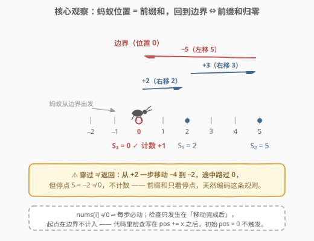
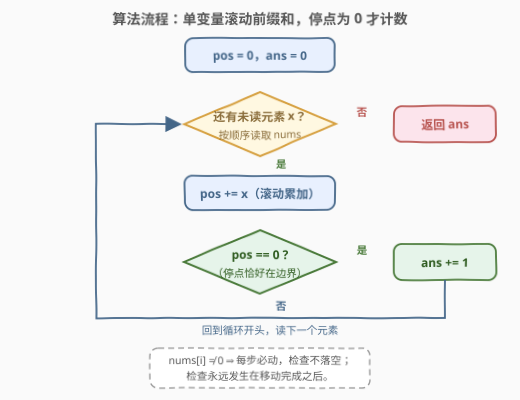
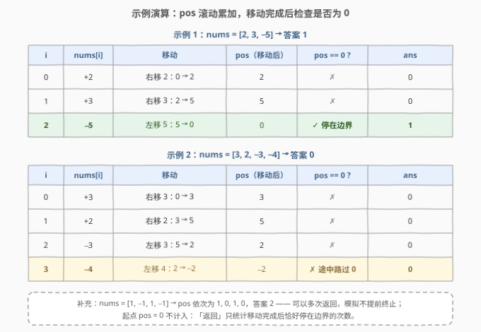

# 边界上的蚂蚁

- **题目名称**：边界上的蚂蚁
- **链接**：[3028. 边界上的蚂蚁](https://leetcode.cn/problems/ant-on-the-boundary/)
- **难度**：简单
- **标签**：数组、前缀和、模拟

## 1. 题目概述

**边界**上有一只蚂蚁，它有时向**左**走，有时向**右**走。

给你一个**非零**整数数组 `nums`。蚂蚁会按顺序读取 `nums` 中的元素，从第一个元素开始直到结束。每一步，蚂蚁会根据当前元素的值移动：

- 如果 `nums[i] < 0`，向**左**移动 $-\text{nums}[i]$ 单位；
- 如果 `nums[i] > 0`，向**右**移动 $\text{nums}[i]$ 单位。

返回蚂蚁**返回**到边界上的次数。

**注意**：

- 边界两侧有无限的空间。
- 只有在蚂蚁移动了 $|\text{nums}[i]|$ 单位后才检查它是否位于边界上。换句话说，如果蚂蚁只是在移动过程中穿过了边界，则不会计算在内。

**示例 1**：

```text
输入：nums = [2,3,-5]
输出：1
解释：第 1 步后，蚂蚁距边界右侧 2 单位远。
第 2 步后，蚂蚁距边界右侧 5 单位远。
第 3 步后，蚂蚁位于边界上。
所以答案是 1。
```

**示例 2**：

```text
输入：nums = [3,2,-3,-4]
输出：0
解释：第 1~4 步后，蚂蚁分别在边界右侧 3、5、2 单位远和左侧 2 单位远处。
蚂蚁从未返回到边界上，所以答案是 0。
```

**补充示例 3**（覆盖「多次返回」分支）：

```text
输入：nums = [1,-1,1,-1]
输出：2
解释：每两步回到边界一次，共返回 2 次——返回后模拟继续，不会提前结束。
```

**约束条件**：

- $1 \le \text{nums.length} \le 100$
- $-10 \le \text{nums}[i] \le 10$
- $\text{nums}[i] \ne 0$

> 💡 读题关键：三个细节决定对错——① 位置是**带符号**的（右正左负）；② 检查只发生在**每步移动完毕后**，途中穿过边界不算；③ 蚂蚁**起点就在边界上**，但那不算「返回」。把这三点翻译成一个变量，答案就出来了。

---

## 2. 解题思路

### 2.1 暴力思路：每一步都从头累加位移

最直接的模拟：对每个下标 $i$，从头累加求出前 $i+1$ 个元素的**总位移**，再判断它是否为 $0$：

```python
ans = 0
for i in range(len(nums)):
    if sum(nums[: i + 1]) == 0:  # 每步重新求和
        ans += 1
```

正确性没问题，但每步都做一遍 $O(i)$ 的累加，总复杂度 $O(n^2)$。更隐蔽的冗余在于：第 $i$ 步的总位移与第 $i-1$ 步只差一个 $\text{nums}[i]$，从头算等于把同样的加法重复做了 $n$ 遍。

另一种常见的绕路写法是维护「距边界的距离 + 当前方向」两个变量，按正负分支讨论。能做对，但把一个**带符号数轴**问题拆成了两个无符号量，分支多、易错——方向本来就该由符号承担。

### 2.2 核心观察：位置 = 前缀和，回到边界 ⇔ 前缀和归零



把边界设为**原点**，向右为正、向左为负，那么每一步的移动量恰是 $\text{nums}[i]$ 本身（负数自带方向）。于是第 $i$ 步结束时的位置就是**前缀和**：

$$S_i = \text{nums}[0] + \text{nums}[1] + \cdots + \text{nums}[i]$$

三个题面细节被前缀和**一次性全部编码**：

1. **回到边界 ⇔ $S_i = 0$**：位置是原点，当且仅当前缀和归零；
2. **穿过不算**：一步之内从 $a$ 连续移动到 $a + x$，中途不停留，$S_i$ 只记录**停点**——从 $+2$ 一步移到 $-2$ 途中路过 $0$，但 $S_i = -2 \ne 0$，天然不计数；
3. **起点不算**：初始 $S = 0$ 发生在任何移动**之前**，只要把检查写在累加之后，它就永远不会被触发。

> 💡 $\text{nums}[i] \ne 0$ 的约束也在暗中帮忙：它保证**每步必动**。若允许 $\text{nums}[i] = 0$，「移动 0 单位后仍停在边界算不算返回」就会变成题意歧义——约束替出题人把坑填了。

> ⚠️ 「位置 = 前缀和」是本题唯一需要建立的认识。剩下的就是把前缀和写成一个滚动变量 $S_i = S_{i-1} + \text{nums}[i]$，从 $O(n^2)$ 降到 $O(n)$——这正是 2.1 暴力里被浪费掉的那个递推关系。

### 2.3 算法流程：单变量滚动前缀和



1. 初始化位置 `pos = 0`、答案 `ans = 0`；
2. 顺序读取每个元素 `x`：`pos += x`（滚动前缀和，$O(1)$ 更新）；
3. 移动完成后检查：若 `pos == 0`，则 `ans += 1`（穿过不触发、起点不触发）；
4. 所有元素读完，返回 `ans`。

注意**计数后不提前退出**：示例 3 中蚂蚁在第 2、4 步两次回到边界，循环必须走完。

### 2.4 示例演算



| 输入 | pos 逐步变化 | 归零次数 | 答案 |
|------|--------------|----------|------|
| `[2,3,-5]` | $2 \to 5 \to 0$ | 第 3 步 ✓ | $1$ |
| `[3,2,-3,-4]` | $3 \to 5 \to 2 \to -2$ | 无（第 4 步从 $2$ 到 $-2$ 途中路过 $0$，不算） | $0$ |
| `[1,-1,1,-1]` | $1 \to 0 \to 1 \to 0$ | 第 2、4 步 ✓ | $2$ |

---

## 3. 参考代码

### C++（滚动前缀和）

```cpp
class Solution {
  public:
    int returnToBoundaryCount(vector<int>& nums) {
        int pos = 0, ans = 0;
        for (int x : nums) {
            pos += x;              // 滚动前缀和：本步移动后的位置
            if (pos == 0) ans++;   // 停点恰好在边界，计数（穿过/起点不会触发）
        }
        return ans;
    }
};
```

### Python（三元表达式压成一行循环体）

```python
class Solution:
    def returnToBoundaryCount(self, nums: List[int]) -> int:
        pos = ans = 0
        for x in nums:
            pos += x
            if pos == 0:
                ans += 1
        return ans
```

> 💡 函数式一行版：`return sum(p == 0 for p in accumulate(nums))`——`itertools.accumulate` 逐项吐出前缀和，`p == 0` 是布尔值，`sum` 直接完成计数。面试写循环版更稳，一行版适合当「你还能更短吗」的彩蛋。

---

## 4. 复杂度分析

| 维度 | 复杂度 | 说明 |
|------|--------|------|
| 时间复杂度 | $O(n)$ | 每个元素处理一次：一次加法 + 一次判等，均为 $O(1)$ |
| 空间复杂度 | $O(1)$ | 只用 `pos` / `ans` 两个变量；前缀和不需要存数组，滚动即可 |

---

## 5. 扩展：前缀和的第一课

本题是**前缀和的最小完整样本**：定义（前 $i$ 项之和）、实现（滚动变量）、优化动机（避免重复累加）齐全。沿着它有三个进阶方向：

- **换个统计量**：位置序列还是那个前缀和，只是问的问题不同——[1732. 找到最高海拔](https://leetcode.cn/problems/find-the-highest-altitude/)问前缀和的 $\max$；[724. 寻找数组的中心下标](https://leetcode.cn/problems/find-pivot-index/)用「总和 − 前缀」把一段和拆成左右两段比较。
- **判零 → 判通用条件**：本题数前缀和等于 $0$ 的次数；[974. 和可被 K 整除的子数组](https://leetcode.cn/problems/subarray-sums-divisible-by-k/)数的是**同余**（前缀和模 $K$ 相等），判零只是模 $K$ 余 $0$ 的特例。
- **历史前缀要随机访问**：本题只看当前值，一个变量够用；一旦要「找到此前某个满足条件的前缀」（如 [525. 连续数组](https://leetcode.cn/problems/contiguous-array/)存最早下标、[3026. 最大好子数组和](https://leetcode.cn/problems/maximum-good-subarray-sum/)维护同值最小前缀和），滚动变量就要升级成**哈希表**——邻号 3026 正是同一套前缀和骨架配上哈希的版本。

> 💡 判断该用「一个变量」还是「一张哈希表」的准则：只关心**当前**前缀和 → 变量；需要回查**历史**前缀和 → 数组或哈希。

---

## 6. 面试要点

1. **为什么「穿过边界」不算？前缀和怎么保证这一点？**

   - 题面规定检查只在移动 $|\text{nums}[i]|$ 单位**完成后**进行。前缀和 $S_i$ 恰好只记录每步的**停点**，一步之内路过哪里它一概不知——所以 `pos == 0` 的判断天然只命中「恰好停在边界」，穿过的情形（如 $2 \to -2$，$S_i = -2$）自动落空。

2. **蚂蚁起点就在边界上，为什么不计入答案？代码体现在哪？**

   - 「返回」语义上指移动之后回到原地。代码里检查写在 `pos += x` **之后**、位于循环体内，初始的 `pos = 0` 从未经过检查——顺序即语义，这是本题最容易手滑加一的地方。

3. **`nums[i] != 0` 这个约束用在哪里？去掉会怎样？**

   - 它保证每步必动，检查时机良定义。若允许 $0$，「移动 0 单位后仍停在边界算不算返回」将产生歧义（计数与否取决于解读），约束消除了这种边界争论——读约束时要意识到它同时在**赠送确定性**。

4. **这题和标准「前缀和数组」是什么关系？**

   - 滚动变量就是**空间压缩到 $O(1)$ 的前缀和**。只依赖当前前缀时无需数组；需要随机访问历史前缀（974 的同余计数、525 的最早下标、3026 的最小前缀和）时才展开成数组 / 哈希表。能说清「何时可以压缩」，才算真懂前缀和。

5. **数据范围小到 $n \le 100$，$O(n^2)$ 也能过，为什么还强调递推？**

   - 面试考察的不是运行时间，而是能否识别「相邻状态只差一步」这一结构。同样的识别力放在 $n \le 10^5$ 的题里就是过与不过的差距；而且认清「位置 = 前缀和」后，方向分支、距离+方向双变量这些复杂写法会被自然淘汰。

---

## 7. 同类练习题

- [1732. 找到最高海拔](https://leetcode.cn/problems/find-the-highest-altitude/)：同一列前缀和，只把「数归零」换成「取最大」，练前缀和的统计量切换
- [724. 寻找数组的中心下标](https://leetcode.cn/problems/find-pivot-index/)：用总和与前缀和拆出左右两段和，前缀和的「拆段」用法入门
- [974. 和可被 K 整除的子数组](https://leetcode.cn/problems/subarray-sums-divisible-by-k/)：把「前缀和 == 0」推广为「前缀和模 K 同余」+ 哈希计数（本仓库已有题解）
- [525. 连续数组](https://leetcode.cn/problems/contiguous-array/)：前缀和 + 哈希存最早下标，回查历史前缀的起步题（本仓库已有题解）
- [3026. 最大好子数组和](https://leetcode.cn/problems/maximum-good-subarray-sum/)：本题邻号，同一套前缀和骨架升级为「哈希维护同值最小前缀和」（本仓库已有题解）
