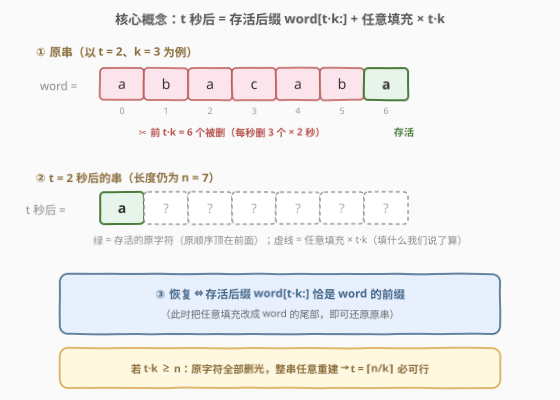
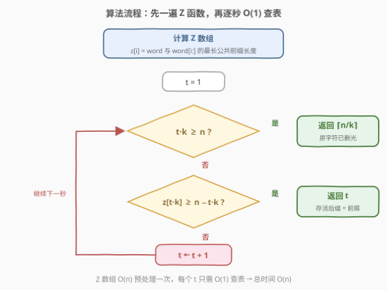
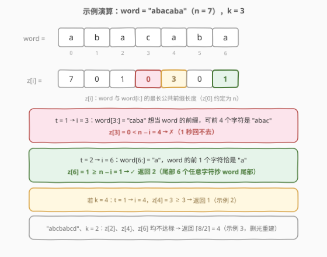

# LeetCode 将单词恢复初始状态所需的最短时间 I 题解

## 1. 题目概述

- **标题 / 题号**：将单词恢复初始状态所需的最短时间 I（#3029，medium）
- **链接**：https://leetcode.cn/problems/minimum-time-to-revert-word-to-initial-state-i/
- **难度**：中等
- **标签**：字符串、字符串匹配、哈希函数、滚动哈希

**题意**：给你一个下标从 **0** 开始的字符串 `word` 和一个整数 `k`。

在每一秒，你必须执行以下操作：

- 移除 `word` 的前 `k` 个字符。
- 在 `word` 的末尾添加 `k` 个任意字符。

**注意**：添加的字符不必和移除的字符相同。但是，必须在每一秒钟都执行**两种**操作。

返回将 `word` 恢复到其**初始**状态所需的**最短**时间（该时间必须大于零）。

**示例 1**：

```text
输入：word = "abacaba", k = 3
输出：2
解释：第 1 秒，移除前缀 "aba"，添加 "bac"，word 变为 "cababac"。
     第 2 秒，移除前缀 "cab"，添加 "aba"，word 变为 "abacaba"，恢复初态。
```

**示例 2**：

```text
输入：word = "abacaba", k = 4
输出：1
解释：第 1 秒，移除前缀 "abac"，添加 "caba"，word 变为 "abacaba"，恢复初态。
```

**示例 3**：

```text
输入：word = "abcbabcd", k = 2
输出：4
解释：每秒移除前 2 个字符并在末尾添加相同字符，4 秒后恢复初态。
```

**约束**：

- $1 \le \text{word.length} \le 50$
- $1 \le k \le \text{word.length}$
- `word` 仅由小写英文字母组成。

> ⚠️ 读题陷阱：① 每秒**必须**执行两种操作——只删不加或只加不删都不行，字符串长度恒为 $n$；② 末尾添加的是「**任意**」字符，填什么由我们掌控，这是求解的关键自由度；③ 答案必须大于零，哪怕 `word` 天然满足条件也至少要 1 秒。

## 2. 解题思路

### 2.1 暴力思路：逐秒枚举 + startswith

先回答「$t$ 秒后 `word` 长什么样」。每秒删前 $k$ 个、尾补 $k$ 个，长度始终为 $n$；由于删除永远发生在最前面、追加永远发生在最后面，**原字符始终排在任意字符前面且相对顺序不变**。归纳可得：$t$ 秒共删掉前 $t \cdot k$ 个**原字符**、补上 $t \cdot k$ 个**任意字符**，于是

$$t \text{ 秒后} \quad \text{word} = \underbrace{\text{word}[t \cdot k:]}_{\text{存活后缀，} n - t\cdot k \text{ 个}} \;+\; \underbrace{\text{任意字符} \times t \cdot k}_{\text{我们说了算}}$$

「任意」由我们选，所以恢复初态 $\iff$ **存活后缀 `word[t·k:]` 恰好是 `word` 的一个前缀**（长度 $n - t\cdot k$），此时把缺的尾部照抄上去即可；若 $t \cdot k \ge n$，原字符已全部删光，整串任意重建，必然可行。

于是暴力解法：$t$ 从 1 枚举到 $\lceil n/k \rceil$，逐个判定 `word.startswith(word[t*k:])`。$n \le 50$ 时至多 50 次判定、每次 $O(n)$，轻松通过：

```python
class Solution:
    def minimumTimeToInitialState(self, word: str, k: int) -> int:
        n = len(word)
        for t in range(1, n + 1):
            if t * k >= n or word.startswith(word[t * k:]):
                return t
```

$O(n^2/k)$ 的判定在 II 题（3031，$n \le 10^6$）下会超时，需要把每个判定降到 $O(1)$。

### 2.2 核心观察：Z 函数一次扫描，判定全部 O(1)



「`word[i:]` 是否为 `word` 的前缀」等价于「`word` 与 `word[i:]` 的最长公共前缀长度 $\ge n - i$」——这正是 **Z 函数**的定义：$z[i] = \text{word}$ 与 $\text{word}[i:]$ 的 LCP 长度。Z 函数一遍线性扫描求出所有 $z[i]$，之后每个 $t$ 只需 $O(1)$ 查表：

$$z[t \cdot k] \ge n - t \cdot k \iff \text{word}[t \cdot k:] \text{ 是 word 的前缀}$$

> 💡 换个说法：把「秒数 $t$」翻译成「起点 $i = t \cdot k$」（必须是 $k$ 的倍数格点），问题就变成「哪些格点开头的后缀能当前缀」——Z 数组一次性把所有起点的答案都算好了，题目只是在这些格点里挑最靠前的一个。

### 2.3 算法流程图



流程分两阶段：**预处理**一遍 Z 数组；**主循环**里 $t$ 从 1 递增，先判 $t \cdot k \ge n$（删光必可行，返回 $\lceil n/k \rceil$），再判 $z[t \cdot k] \ge n - t \cdot k$（存活后缀是前缀，返回 $t$），都不成立则 $t \gets t + 1$。

### 2.4 示例演算



以 `word = "abacaba"`（$n = 7$）、$k = 3$ 走一遍。先算 Z 数组 $z = [7, 0, 1, 0, 3, 0, 1]$（约定 $z[0] = n$），再逐秒判定：

| $t$ | $i = t\cdot k$ | 存活后缀 `word[i:]` | 需等于的前缀 | $z[i]$ | $n - i$ | 判定 |
|-----|----------------|---------------------|--------------|--------|---------|------|
| 1 | 3 | `"caba"` | `"abac"` | 0 | 4 | ✗ |
| 2 | 6 | `"a"` | `"a"` | 1 | 1 | ✓ 返回 2 |

- $t = 1$：存活后缀 `"caba"` 的首字符 `c` 与 `word` 首字符 `a` 就对不上，1 秒回不去；
- $t = 2$：存活后缀只剩 `"a"`，恰好是 `word` 的前缀，尾部 6 个任意字符照抄 `word` 的尾部 `"bacaba"` 即还原——答案 2。

对照示例 2（$k=4$）：$t=1 \to i=4$，$z[4] = 3 \ge 3$ ✓，返回 1。对照示例 3（`"abcbabcd"`、$k=2$）：$z[2] = z[6] = 0$、$z[4] = 3 < 4$ 全不达标，落到兜底分支返回 $\lceil 8/2 \rceil = 4$（原字符删光重建）。

## 3. 参考代码

### C++

```cpp
class Solution {
  public:
    int minimumTimeToInitialState(string word, int k) {
        int n = word.size();
        vector<int> z(n, 0);
        for (int i = 1, l = 0, r = 0; i < n; i++) {
            if (i < r) z[i] = min(r - i, z[i - l]);      // 窗口内：从 z[i-l] 继承
            while (i + z[i] < n && word[z[i]] == word[i + z[i]]) z[i]++;
            if (i + z[i] > r) l = i, r = i + z[i];       // 扩张匹配窗口 [l, r)
        }
        for (int t = 1; t * k < n; t++)
            if (z[t * k] >= n - t * k) return t;         // 存活后缀是前缀
        return (n + k - 1) / k;                          // 删光重建的兜底
    }
};
```

### Python

```python
class Solution:
    def minimumTimeToInitialState(self, word: str, k: int) -> int:
        n = len(word)
        z = [0] * n
        l = r = 0
        for i in range(1, n):
            if i < r:
                z[i] = min(r - i, z[i - l])             # 窗口内：从 z[i-l] 继承
            while i + z[i] < n and word[z[i]] == word[i + z[i]]:
                z[i] += 1
            if i + z[i] > r:
                l, r = i, i + z[i]                      # 扩张匹配窗口 [l, r)
        t = 1
        while t * k < n:
            if z[t * k] >= n - t * k:                   # 存活后缀是前缀
                return t
            t += 1
        return t                                        # = ceil(n/k)，删光重建
```

> 💡 实现细节：兜底不必单独算 $\lceil n/k \rceil$——`while` 退出时的 $t$ 恰好就是第一个满足 $t \cdot k \ge n$ 的值；C++ 版写成 `(n + k - 1) / k` 与之等价。

## 4. 复杂度分析

| 维度 | 复杂度 | 说明 |
|------|--------|------|
| 时间复杂度 | $O(n)$ | Z 函数线性（`while` 每推进一格，窗口右端点 $r$ 就 +1，$r$ 单调不减且 $\le n$）；主循环至多 $\lceil n/k \rceil$ 次 $O(1)$ 查表 |
| 空间复杂度 | $O(n)$ | Z 数组 |

其中 $n = \text{len(word)}$。本题 $n \le 50$，暴力 $O(n^2/k)$ 也够用；II 题 $n \le 10^6$ 时线性解法直接复用。

## 5. 扩展：KMP border 与滚动哈希（通往 3031 II）

**KMP border 视角**：`word[i:]` 是 `word` 的前缀 $\iff$ 长度 $n - i$ 是 `word` 的一个 **border**（最长相等前后缀）。KMP 前缀函数的 fail 链 $\pi[n] \to \pi[\pi[n]] \to \cdots$ 恰好枚举出所有 border 长度 $b$。设答案候选 $t = (n - b) / k$，要求 $(n - b)$ 能被 $k$ 整除且 $t \ge 1$；最终答案为所有合法 border 对应的最小 $t$，再与 $\lceil n/k \rceil$ 取 $\min$。例如 `"abacaba"` 的 border 集合是 $\{3, 1\}$：$k=4$ 时 $b=3$ 给出 $t=1$（示例 2）；$k=3$ 时 $b=1$ 给出 $t=2$（示例 1）。⚠️ 必须沿 fail 链枚举**全部** border——合法 border 未必是链顶 $\pi[n]$（如 `"aabaabaa"`、$k=2$：链顶 $b=5$ 不整除，深一层的 $b=2$ 才给出 $t=3$）。

**滚动哈希视角**（对应本题标签 Rolling Hash）：预处理前缀哈希 $h[i]$ 与幂次 $B^i$，则「`word[i:]` 是否为前缀」$\iff h[n-i] = h[n] - h[i] \cdot B^{\,n-i}$，每个 $i$ 同样 $O(1)$ 判定。总复杂度 $O(n)$，但有极小概率哈希冲突（双哈希可忽略）；Z 函数无冲突风险，最稳。

**II 题（[3031](https://leetcode.cn/problems/minimum-time-to-revert-word-to-initial-state-ii/)）**：把 $n$ 放大到 $10^6$、难度升为困难，逐秒 `startswith` 的 $O(n^2/k)$ 必须换成上述任一线性做法——本文 Z 函数代码原封不动即可通过。

## 6. 面试要点

1. **为什么 $t$ 秒后字符串一定是「`word[t·k:]` + 任意字符 × $t\cdot k$」？**

   - 归纳：每秒删的都是当前串**最前** $k$ 个字符。原字符永远排在任意字符前面（删从头删、加往尾加），所以 $t$ 秒删掉的恰好是原串的前 $t\cdot k$ 个字符；存活的 $n - t\cdot k$ 个原字符保持原顺序顶在最前面，后面全是任意填充。

2. **为什么 $\lceil n/k \rceil$ 一定是答案上界？**

   - $t = \lceil n/k \rceil$ 时 $t \cdot k \ge n$，原字符全部删光，整个串都是我们任意填的——直接照抄一遍原串即可恢复。所以枚举到 $\lceil n/k \rceil$ 必然命中，这也是主循环的天然终止条件。

3. **$z[i] \ge n - i$ 为什么等价于「`word[i:]` 是前缀」？**

   - $z[i]$ 是 `word` 与 `word[i:]` 的 LCP 长度；`word[i:]` 自身长度为 $n - i$，LCP 达到 $n - i$ 意味着 `word` 的前 $n-i$ 个字符与 `word[i:]` 完全相同——后缀恰好做了前缀。

4. **Z 函数为什么是 $O(n)$ 而不是 $O(n^2)$？**

   - `while` 循环每成功一次都把维护的匹配窗口右端点 $r$ 推大 1，而 $r$ 单调不减且 $\le n$，所以总推进次数 $\le n$；窗口内的 $z$ 值靠 $z[i-l]$ 以 $O(1)$ 继承，均摊每位置 $O(1)$。

5. **除 Z 函数外还有哪些线性做法？各自的坑？**

   - KMP border 链：合法 border 可能藏在 fail 链深处，只看 $\pi[n]$ 会漏解，必须整条链枚举；滚动哈希：实现最短但要防冲突（双哈希或大模数），$n \le 10^6$ 时还需注意用 $O(1)$ 乘法取模避免溢出。三者复杂度同为 $O(n)$。

## 同类练习题

| # | 题目 | 与本题的关联 |
|---|------|-------------|
| 3031 | [将单词恢复初始状态所需的最短时间 II](https://leetcode.cn/problems/minimum-time-to-revert-word-to-initial-state-ii/) | 本题的困难版，$n \le 10^6$，逼你把暴力判定升级为 Z/KMP/哈希 |
| 1392 | [最长快乐前缀](https://leetcode.cn/problems/longest-happy-prefix/)（[题解](../1301-1400/1392_最长快乐前缀.md)） | 求最长 border 本身，fail 链顶端就是答案，KMP 视角入门 |
| 459 | [重复的子字符串](https://leetcode.cn/problems/repeated-substring-pattern/)（[题解](../0401-0500/459_重复的子字符串.md)） | $n - \pi[n]$ 是最小循环节长度，border 思维的另一面 |
| 28 | [找出字符串中第一个匹配项的下标](https://leetcode.cn/problems/find-the-index-of-the-first-occurrence-in-a-string/)（[题解](../0001-0100/28_找出字符串中第一个匹配项的下标.md)） | KMP/Z 函数的模板题，先练手感再来本题 |
| 187 | [重复的 DNA 序列](https://leetcode.cn/problems/repeated-dna-sequences/)（[题解](../0101-0200/187_重复的DNA序列.md)） | 滚动哈希模板题，本题标签 Rolling Hash 的出处 |
