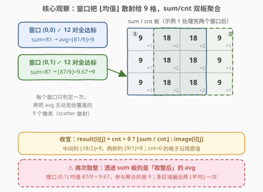
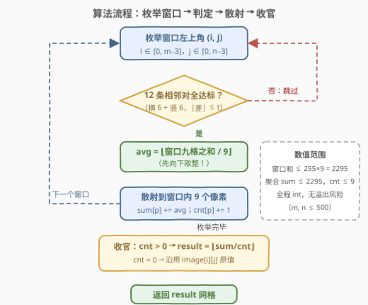
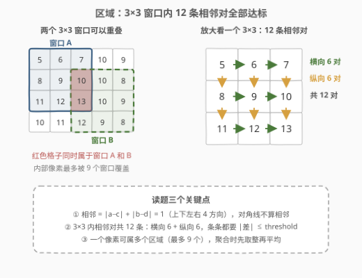
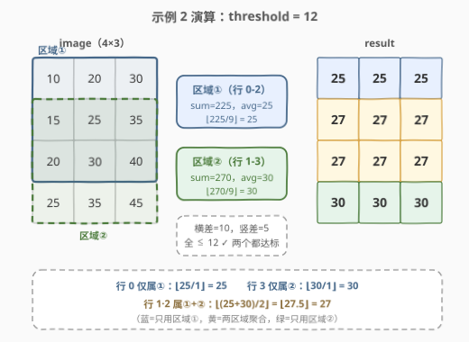

# LeetCode 找出网格的区域平均强度 题解

## 1. 题目概述

- **标题 / 题号**：找出网格的区域平均强度（#3030，medium）
- **链接**：https://leetcode.cn/problems/find-the-grid-of-region-average/
- **难度**：中等
- **标签**：数组、矩阵、枚举

**题意**：给你一个下标从 **0** 开始、大小为 $m \times n$ 的网格 `image`，表示一张灰度图，其中 `image[i][j]` 是 $[0..255]$ 内的像素强度。另给一个**非负**整数 `threshold`。

- **相邻像素**：`image[a][b]` 与 `image[c][d]` 满足 $|a-c| + |b-d| = 1$（即上下左右四方向相邻）。
- **区域**：一个 $3 \times 3$ 子网格，且内部**任意两个相邻像素**的强度**绝对差小于等于** `threshold`。
- 区域内的所有像素都属于该区域，而一个像素**可以属于多个区域**。

需要计算同样大小的网格 `result`：

- `result[i][j]` 是 `image[i][j]` 所属区域的**平均强度**，**向下取整**；
- 若属于多个区域，则是这些区域「**取整后的平均强度**」的**平均值**，再**向下取整**；
- 若不属于任何区域，`result[i][j] = image[i][j]`。

**示例 1**：

```text
输入：image = [[5,6,7,10],[8,9,10,10],[11,12,13,10]], threshold = 3
输出：[[9,9,9,9],[9,9,9,9],[9,9,9,9]]
解释：存在两个区域。区域 1 均值为 9；区域 2 均值为 9.67，向下取整为 9。
两区域平均为 (9 + 9) / 2 = 9。所有像素都属于区域 1、区域 2 或两者，故全为 9。
```

**示例 2**：

```text
输入：image = [[10,20,30],[15,25,35],[20,30,40],[25,35,45]], threshold = 12
输出：[[25,25,25],[27,27,27],[27,27,27],[30,30,30]]
解释：区域 1（行 0-2）均值 25，区域 2（行 1-3）均值 30；
行 1、2 的像素同时属于两者，取 ⌊(25 + 30) / 2⌋ = 27。
```

**示例 3**：

```text
输入：image = [[5,6,7],[8,9,10],[11,12,13]], threshold = 1
输出：[[5,6,7],[8,9,10],[11,12,13]]
解释：唯一的 3×3 窗口中纵向相邻对差值为 3 > 1，不存在任何区域，原样返回。
```

**约束**：

- $3 \le n, m \le 500$
- $0 \le \text{image}[i][j] \le 255$
- $0 \le \text{threshold} \le 255$

> 💡 读题三个坑：①「相邻」是曼哈顿距离 1，**对角线不算**；② $3 \times 3$ 内相邻对共 **12 对**（横 6 竖 6），判定是 $\le$（**含等于**，示例 3 里差值 1 对 threshold 1 是达标的）；③ 取整有**两次**——区域均值先各自向下取整，多区域聚合后再向下取整，示例 1 中 $87/9 = 9.67$ 参与聚合的是 9。

## 2. 解题思路

### 2.1 暴力思路：以像素为中心，逐个收集所属区域

`result` 的每个格子都要「知道自己属于哪些区域」，最直接的想法是以**像素**为中心反查：把全图 $(m-2)(n-2)$ 个 $3 \times 3$ 窗口都扫一遍，凡是覆盖 $(i,j)$ 且 12 条相邻对全达标的，就收集它的 $\lfloor$ 均值 $\rfloor$。这样每个像素都要遍历全部窗口，总计 $O\big(mn \cdot (m-2)(n-2)\big)$ 次窗口检查，$m = n = 500$ 时约 $6 \times 10^{10}$ 量级，直接超时。

稍微改进就能发现冗余所在：覆盖 $(i,j)$ 的窗口，其左上角必然落在 $[i-2, i] \times [j-2, j]$ 这个 $3 \times 3$ 邻域内（再裁剪到合法范围），所以每个像素只需枚举 **至多 9 个**候选窗口，复杂度降到 $O(mn \cdot 9 \cdot 12)$，已经能过。但这份代码有个别扭之处：**同一个窗口会被它覆盖的 9 个像素各验证一遍**（×9 重复），而且「找区域」与「算答案」的逻辑搅在一起，既慢又容易写错。

### 2.2 核心观察：反转视角——从「像素收集」到「窗口散射」



把枚举的主体从**像素**换成**窗口**，一切就顺了：

1. 每个 $3 \times 3$ 窗口只**判定一次**（12 条相邻对），达标就算出 $\text{avg} = \lfloor \text{sum}/9 \rfloor$；
2. 窗口把 avg **主动洒（scatter）**给覆盖的 9 个像素：`sum[p] += avg`、`cnt[p] += 1`；
3. 全部窗口处理完后统一收官：
   $$\text{result}[i][j] = \begin{cases} \lfloor \text{sum}[i][j] / \text{cnt}[i][j] \rfloor, & \text{cnt}[i][j] > 0 \\ \text{image}[i][j], & \text{cnt}[i][j] = 0 \end{cases}$$

两张累计板 `sum` / `cnt` 把「多区域取平均」拆成**加分**和**收官除法**两个阶段：分子恰好是 $\sum_k \lfloor \text{avg}_k \rfloor$（题目要求的「取整后均值的和」），分母恰好是区域个数——聚合自动完成。这正是 **gather（各像素收网）→ scatter（窗口播种）** 的经典视角反转：窗口作为信息的「生产者」主动分发，像素只被动累加，同一份判定结果天然被 9 个像素共享，一处判定、处处受益。

> ⚠️ **两次取整**：洒进 `sum` 板的必须是**取整后**的 avg。若图省事先累加原始窗口和、最后统一除（例如 $(\text{sum}_1 + \text{sum}_2) / 18$），在「区域均值带小数」时就会算错——构造反例：两区域均值 $9.67$ 与 $10.5$，正确答案是 $\lfloor (9+10)/2 \rfloor = 9$，错误做法得 $\lfloor (9.67+10.5)/2 \rfloor = 10$。示例 1 的官方解释（用 9 而非 9.67 参与聚合）就是在强调这一点。

### 2.3 算法流程：枚举 → 判定 → 散射 → 收官



区域的定义与 12 条相邻对的位置如下图所示——横向相邻对 $3 \text{行} \times 2 = 6$ 条，纵向相邻对 $3 \text{列} \times 2 = 6$ 条，**对角线上的两点不算相邻、无需比较**：



具体步骤：

1. **枚举**：窗口左上角 $(i, j)$，$i \in [0, m-3]$，$j \in [0, n-3]$，共 $(m-2)(n-2)$ 个；
2. **判定**：检查窗口内 12 条相邻对是否全都 $|\text{差}| \le \text{threshold}$（发现一条超标即可短路退出）；
3. **散射**：达标则求 9 格之和得 $\text{avg} = \lfloor \text{sum}/9 \rfloor$，对窗口内 9 格执行 `sum += avg`、`cnt += 1`；
4. **收官**：遍历全图，`cnt > 0` 的格子取 $\lfloor \text{sum}/\text{cnt} \rfloor$，否则沿用原值。

> 💡 数值范围放心用 `int`：窗口和 $\le 255 \times 9 = 2295$；一个像素至多被 9 个窗口覆盖，聚合 `sum ≤ 2295`、`cnt ≤ 9`，全程远离 `int` 上限。

### 2.4 示例演算



以示例 2 走完全流程（$m=4, n=3$，只有两个窗口 $(0,0)$ 与 $(1,0)$）：

| 窗口 | 覆盖范围 | 12 对检查 | sum | ⌊sum/9⌋ |
|------|----------|-----------|-----|---------|
| $(0,0)$ | 行 0-2 × 列 0-2 | 横差全 10、竖差全 5，$\le 12$ ✓ | 225 | 25 |
| $(1,0)$ | 行 1-3 × 列 0-2 | 同上 ✓ | 270 | 30 |

散射后的聚合按行看：

- **行 0**（仅区域①）：`sum=25, cnt=1` → $\lfloor 25/1 \rfloor = 25$；
- **行 1、2**（①+②）：`sum=55, cnt=2` → $\lfloor 55/2 \rfloor = \lfloor 27.5 \rfloor = 27$；
- **行 3**（仅区域②）：`sum=30, cnt=1` → $30$。

与预期输出完全一致。示例 1 则演示了两次取整：窗口 $(0,1)$ 均值 $87/9 = 9.67$，洒出去的是 9；示例 3 演示了 `cnt=0` 的兜底分支——唯一窗口纵向差 3 超过 threshold 1，全图无区域，原样返回。

## 3. 参考代码

### C++（枚举窗口 + 散射累计）

```cpp
class Solution {
  public:
    vector<vector<int>> resultGrid(vector<vector<int>>& image, int threshold) {
        int m = image.size(), n = image[0].size();
        vector<vector<int>> sum(m, vector<int>(n, 0)), cnt(m, vector<int>(n, 0));

        for (int i = 0; i + 2 < m; i++) {
            for (int j = 0; j + 2 < n; j++) {
                bool ok = true;  // 12 条相邻对：横 6 + 竖 6，超标即短路
                for (int a = 0; a < 3 && ok; a++)
                    for (int b = 0; b < 3 && ok; b++) {
                        if (b < 2 && abs(image[i + a][j + b] - image[i + a][j + b + 1]) > threshold) ok = false;
                        if (a < 2 && abs(image[i + a][j + b] - image[i + a + 1][j + b]) > threshold) ok = false;
                    }
                if (!ok) continue;

                int s = 0;  // 窗口九格之和
                for (int a = 0; a < 3; a++)
                    for (int b = 0; b < 3; b++) s += image[i + a][j + b];
                int avg = s / 9;  // 第一次向下取整

                for (int a = 0; a < 3; a++)  // 散射给 9 个像素
                    for (int b = 0; b < 3; b++) {
                        sum[i + a][j + b] += avg;
                        cnt[i + a][j + b]++;
                    }
            }
        }

        vector<vector<int>> res(m, vector<int>(n));
        for (int i = 0; i < m; i++)
            for (int j = 0; j < n; j++)
                res[i][j] = cnt[i][j] ? sum[i][j] / cnt[i][j] : image[i][j];  // 第二次向下取整
        return res;
    }
};
```

### Python（生成器判定 + 双板散射）

```python
class Solution:
    def resultGrid(self, image: List[List[int]], threshold: int) -> List[List[int]]:
        m, n = len(image), len(image[0])
        s = [[0] * n for _ in range(m)]
        cnt = [[0] * n for _ in range(m)]

        for i in range(m - 2):
            for j in range(n - 2):
                # 横向 6 对 + 纵向 6 对，全达标才是区域
                ok = all(abs(image[i + a][j + b] - image[i + a][j + b + 1]) <= threshold
                         for a in range(3) for b in range(2)) and \
                     all(abs(image[i + a][j + b] - image[i + a + 1][j + b]) <= threshold
                         for a in range(2) for b in range(3))
                if not ok:
                    continue
                avg = sum(image[i + a][j + b] for a in range(3) for b in range(3)) // 9
                for a in range(3):        # 散射：avg 发给窗口内 9 格
                    for b in range(3):
                        s[i + a][j + b] += avg
                        cnt[i + a][j + b] += 1

        return [[s[i][j] // cnt[i][j] if cnt[i][j] else image[i][j]
                 for j in range(n)] for i in range(m)]
```

> 💡 两份代码都把「判定、散射、收官」写成三段独立逻辑——视角换成窗口后，每段各自单一职责，这正是 scatter 结构带来的可读性红利。

## 4. 复杂度分析

| 维度 | 复杂度 | 说明 |
|------|--------|------|
| 时间复杂度 | $O(mn)$ | $(m-2)(n-2)$ 个窗口，每个窗口常数工作（12 次判定 + 9 次求和 + 9 次散射 + 收官一遍全图）；$m = n = 500$ 时约 $10^7$ 次基本操作 |
| 空间复杂度 | $O(mn)$ | `sum` / `cnt` 两块累计板（不计返回矩阵）；数值上 `sum ≤ 2295`、`cnt ≤ 9`，`int` 足够 |

## 5. 扩展：把「12 对判定」也摊销掉——二维前缀和

窗口判定本身是 $O(1)$（固定 12 对），但若窗口尺寸推广为 $k \times k$，朴素判定就是每窗 $O(k^2)$、总体 $O(mn k^2)$。标准优化是**把「超标」预处理成 0/1 矩阵再做二维前缀和**：

1. 预处理 `badH[i][j]`（横向对 $(i,j)$-$(i,j+1)$ 是否超标）与 `badV[i][j]`（纵向对），取值 0/1；
2. 分别做二维前缀和（[304. 二维区域和检索](https://leetcode.cn/problems/range-sum-query-2d-immutable/) 的四角容斥同款）；
3. 窗口 $(i,j)$ 合法 $\iff$ 其覆盖的 6 条横向对与 6 条纵向对的「超标计数」之和为 0，两次容斥 $O(1)$ 出结果。

本题 $k=3$ 用不上这层优化（常数反而更大），但 [2132. 用邮票贴满网格图](https://leetcode.cn/problems/stamping-the-grid/) 就是这套「$3 \times 3$ 窗口 + 前缀和 $O(1)$ 判定」的完整体，值得对照练习。

## 6. 面试要点

1. **gather 和 scatter 的差别在哪？为什么 scatter 更优？**

   - gather 以像素为中心：每个像素枚举覆盖自己的 ≤9 个窗口并逐一判定，同一窗口被它的 9 个像素重复验证 9 遍；scatter 以窗口为中心：每窗口只判定一次，把结果主动分发给 9 个像素（`sum/cnt` 累计）。两者都是 $O(mn)$，但 scatter 常数小 9 倍，且「判定、散射、收官」三段解耦，正确性更好论证。

2. **两次取整的顺序错在哪？能举个反例吗？**

   - 必须先对每个区域的均值各自 $\lfloor \rfloor$，聚合平均后再 $\lfloor \rfloor$ 一次。反例：两区域均值 $9.67$ 与 $10.5$，正确 $\lfloor (9+10)/2 \rfloor = 9$；若直接平均原始值得 $\lfloor 10.08 \rfloor = 10$。官方示例 1 也明确用 9 而非 9.67 参与聚合。

3. **「12 对」怎么数出来的？对角线要比吗？**

   - $3 \times 3$ 内横向相邻对 $3 \times 2 = 6$ 条、纵向 $3 \times 2 = 6$ 条，共 12。相邻定义为 $|a-c| + |b-d| = 1$，对角线两点距离为 2，**不算相邻也无需比较**——多比对角线虽然有时碰巧不改变结果，但属于对题意的误解。

4. **`cnt = 0` 或网格不足 $3 \times 3$ 怎么办？**

   - `cnt = 0` 说明该像素不属于任何区域，`result[i][j] = image[i][j]`（示例 3 全图如此）。本题约束 $m, n \ge 3$；即使更小，`for (i; i + 2 < m)` 循环自然不执行，代码无需特判。

5. **数值范围与判定符号有什么要注意的？**

   - 像素 $\le 255$，窗口和 $\le 2295$，聚合 `sum ≤ 2295`、`cnt ≤ 9`，`int` 全程安全。判定是 $|\text{差}| \le \text{threshold}$ **含等于**（示例 3 中差值 1 对 threshold 1 达标，是纵向差 3 把窗口毙掉的），写成 `<` 会漏掉合法区域。

## 同类练习题

| # | 题目 | 与本题的关联 |
|---|------|-------------|
| 304 | [二维区域和检索 - 矩阵不可变](https://leetcode.cn/problems/range-sum-query-2d-immutable/) | 二维前缀和 + 四角容斥模板，本文扩展节 $O(1)$ 判定的基石（本仓库已有题解） |
| 1314 | [矩阵区域和](https://leetcode.cn/problems/matrix-block-sum/) | 固定大小窗口的区域和聚合，窗口枚举的直接亲戚 |
| 2132 | [用邮票贴满网格图](https://leetcode.cn/problems/stamping-the-grid/) | 同为 $3 \times 3$ 窗口 + 二维前缀和 $O(1)$ 判定，本文扩展的完整形态 |
| 1277 | [统计全为 1 的正方形子矩阵](https://leetcode.cn/problems/count-square-submatrices-with-all-ones/) | 固定尺寸子矩阵的枚举与逐对判定 |
| 598 | [区间加法 II](https://leetcode.cn/problems/range-addition-ii/) | 「先散射增量、后统一收官」思想的最小样例 |
