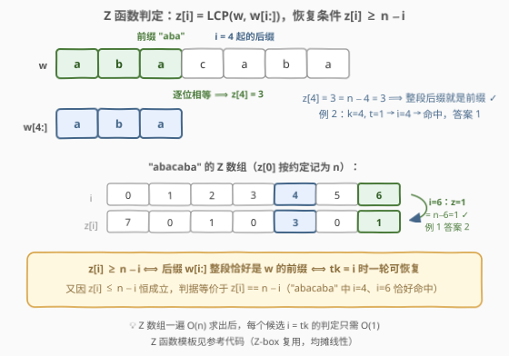
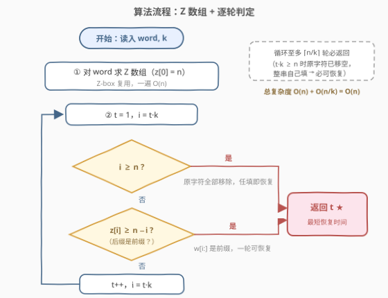
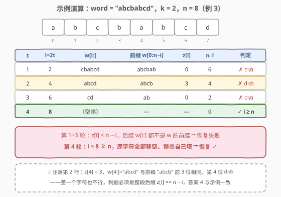

# 将单词恢复初始状态所需的最短时间 II

- **题目名称**：将单词恢复初始状态所需的最短时间 II
- **链接**：[3031. 将单词恢复初始状态所需的最短时间 II](https://leetcode.cn/problems/minimum-time-to-revert-word-to-initial-state-ii/)
- **难度**：困难
- **标签**：字符串、字符串匹配、哈希函数、滚动哈希

## 1. 题目概述

给你一个下标从 **0** 开始的字符串 `word` 和一个整数 $k$。

在每一秒，你必须**依次**执行以下两种操作：

1. 移除 `word` 的**前 $k$ 个**字符；
2. 在 `word` 的**末尾添加 $k$ 个任意**字符。

注意添加的字符不必和移除的字符相同，但每一秒**必须**两种操作都执行。返回将 `word` 恢复到其**初始状态**所需的**最短**时间（该时间必须大于零）。

**示例 1**：

```text
输入：word = "abacaba", k = 3
输出：2
解释：第 1 秒移除前缀 "aba"、末尾添加 "bac"，word 变为 "cababac"；
     第 2 秒移除前缀 "cab"、末尾添加 "aba"，word 变为 "abacaba"，恢复初始状态。
```

**示例 2**：

```text
输入：word = "abacaba", k = 4
输出：1
解释：第 1 秒移除前缀 "abac"、末尾添加 "caba"，word 变为 "abacaba"。
```

**示例 3**：

```text
输入：word = "abcbabcd", k = 2
输出：4
解释：每一秒移除前 2 个字符、末尾添加相同的字符，4 秒后恢复初始状态。
```

**约束条件**：

- $1 \le \text{word.length} \le 10^6$
- $1 \le k \le \text{word.length}$
- `word` 仅由小写英文字母组成

> ⚠️ 读题陷阱：① 「添加**任意**字符」意味着尾部新字符完全由我们掌控——这不是简单的循环移位，尾巴是"自由填充区"；② 每秒**必须两种操作都做**，不能只删不加，字符串长度始终为 $n$；③ 答案必须大于零；④ $n$ 高达 $10^6$，需要 $O(n)$ 级算法，$O(n^2)$ 及以上不可接受。

---

## 2. 解题思路

### 2.1 暴力思路

按题意逐个尝试 $t = 1, 2, \dots$：$t$ 秒后原字符整体左移了 $tk$ 位，判断「**剩余后缀 `word[tk:]` 是否恰好等于 `word` 的前 $n - tk$ 个字符**」，每次比较 $O(n)$；再加上 $tk \ge n$ 时必可恢复（见下文），枚举上界为 $\lceil n/k \rceil$。总时间 $O(n^2 / k)$——$n = 10^6$、$k = 1$ 时高达 $10^{12}$，必然超时。姊妹题 [3029. 将单词恢复初始状态所需的最短时间 I](https://leetcode.cn/problems/minimum-time-to-revert-word-to-initial-state-i/) 把 $n$ 缩到 $50$，就是这个暴力；本题 $n = 10^6$，**判定必须提速到 $O(1)$**。

浪费在哪？每个候选位置 $i = tk$ 的「后缀是否为前缀」判定都从零开始逐字符比较，而相邻候选之间、以及各后缀与前缀之间高度自相似——这正是 **Z 函数**（扩展 KMP）用武之地：一次 $O(n)$ 预处理，之后每个位置 $O(1)$ 出答案。

### 2.2 核心观察：t 秒后的结构 = 「后缀 + 自由填充区」

![核心概念：t 秒后 word = w[tk:] + 任意字符](../images/p3031_shift_concept.svg)

**结构引理**：当 $tk \le n$ 时，$t$ 秒后的字符串形如

$$\underbrace{w[tk:]}_{\text{长度 } n - tk} + \underbrace{X}_{\text{长度 } tk\text{，每个字符任选}}$$

对 $t$ 归纳：$t = 1$ 时显然成立。设 $t-1$ 秒后为 $w[(t-1)k:] + X$（$|X| = (t-1)k$）；第 $t$ 秒移除前 $k$ 个字符——若 $tk \le n$，移除的恰好全是原字符段 $w[(t-1)k : tk]$，剩下 $w[tk:] + X$，再补 $k$ 个任意字符拼成 $X'$，得 $w[tk:] + X + X'$，自由区长度恰为 $tk$。✓

于是「$t$ 秒后能恢复初始状态」等价于：

$$w[0 : n - tk] = w[tk : n] \iff \text{后缀 } w[tk:] \text{ 整段是 } w \text{ 的前缀}$$

（前 $n - tk$ 格被原后缀占据、必须逐位相同；尾部 $tk$ 格自由填，恰好补齐。）

再看 $tk \ge n$ 的时刻：原字符已被移除干净，整串都是自己填的任意字符——**必然可以恢复**。所以答案有上界 $\lceil n/k \rceil$，枚举 $t$ 一定在循环内命中。

**「后缀是前缀」如何 $O(1)$ 判定？** Z 函数：$z[i]$ 定义为 $w$ 与其后缀 $w[i:]$ 的最长公共前缀长度。后缀 $w[i:]$（长度 $n - i$）整段成为前缀 $\iff z[i] \ge n - i$；又因 $z[i] \le n - i$ 恒成立，判据即 $z[i] = n - i$。



> 💡 **两句话总结**：把「模拟操作」翻译成「$t$ 秒后串的结构」，恢复条件浓缩成判据 $z[tk] \ge n - tk$；操作的不确定性（任意字符）反而帮我们把尾部变成"想填什么填什么"的自由区，只剩前段后缀需要与前缀重合。

### 2.3 算法流程图



预处理一遍 Z 数组，然后 $t$ 从 $1$ 递增、$i = tk$ 步进 $k$ 跳着查：$i \ge n$（移空）或 $z[i] \ge n - i$（后缀即前缀）任一成立即返回 $t$。循环至多 $\lceil n/k \rceil$ 轮，整体线性。

### 2.4 示例演算



以例 3 `word = "abcbabcd"`、$k = 2$、$n = 8$ 走一遍（$z = [8,0,0,0,3,0,0,0]$）：

| t | i = 2t | w[i:] | 前缀 w[0:n−i] | z[i] | n−i | 判定 |
|---|--------|-------|----------------|------|-----|------|
| 1 | 2 | cbabcd | abcbab | 0 | 6 | ✗ 首字符 c≠a |
| 2 | 4 | abcd | abcb | 3 | 4 | ✗ 前 3 位相同、第 4 位 d≠b |
| 3 | 6 | cd | ab | 0 | 2 | ✗ c≠a |
| 4 | 8 | （空串） | — | — | 0 | ✓ i≥n，原字符移空、任填即恢复 |

前 3 轮后缀都不是前缀，第 4 轮 $i = 8 \ge n$ 命中「移空」分支，答案 $t = 4$，与示例一致。特别留意第 2 行：$z[4] = 3$ 已经"很接近"，但**差一个字符也不行**——判据必须是整段 $z[i] = n - i$。

---

## 3. 参考代码

### C++

```cpp
class Solution {
  public:
    int minimumTimeToInitialState(string word, int k) {
        int n = word.size();
        vector<int> z(n);
        z[0] = n;                                  // 约定 z[0]=n（本题不会用到）
        for (int i = 1, l = 0, r = 0; i < n; i++) {
            if (i < r) z[i] = min(r - i, z[i - l]);        // 复用 Z-box 内已知信息
            while (i + z[i] < n && word[z[i]] == word[i + z[i]]) z[i]++;
            if (i + z[i] > r) { l = i; r = i + z[i]; }     // 扩张最右 Z-box
        }
        for (int t = 1; t * k <= n + k - 1; t++) {         // t 上界 = ⌈n/k⌉
            int i = t * k;
            if (i >= n || z[i] == n - i) return t;         // 移空 或 后缀即前缀
        }
        return -1;                                          // 不可达，仅安抚编译器
    }
};
```

### Python

```python
class Solution:
    def minimumTimeToInitialState(self, word: str, k: int) -> int:
        n = len(word)
        z = [0] * n
        z[0] = n
        l = r = 0
        for i in range(1, n):
            if i < r:
                z[i] = min(r - i, z[i - l])       # 复用 Z-box 内已知信息
            while i + z[i] < n and word[z[i]] == word[i + z[i]]:
                z[i] += 1
            if i + z[i] > r:
                l, r = i, i + z[i]
        t, i = 1, k
        while True:
            if i >= n or z[i] == n - i:           # 移空 或 后缀即前缀
                return t
            t += 1
            i += k
```

> 💡 实现细节：① 循环上界 $\lceil n/k \rceil$ 对应 $t \cdot k \le n + k - 1$，此时 $t \cdot k \ge n$ 必走「移空」分支返回，故 `while True` 不会死循环；② $t \cdot k \le n + k - 1 \le 2 \times 10^6$，`int` 不溢出；③ $z[0]$ 两种约定（$0$ 或 $n$）都不影响本题——$t \ge 1$ 保证 $i = tk \ge k \ge 1$，永不查 $z[0]$。

---

## 4. 复杂度分析

| 维度 | 复杂度 | 说明 |
|------|--------|------|
| 时间复杂度 | $O(n)$ | Z 数组一遍线性（Z-box 均摊）；枚举 $t$ 至多 $\lceil n/k \rceil$ 轮、每轮 $O(1)$ |
| 空间复杂度 | $O(n)$ | Z 数组 $z[0..n-1]$ |

其中 $n = \text{len(word)}$。$n = 10^6$ 时 C++ 毫秒级；Python 的 Z 函数循环约 $10^6$ 次，配合线性枚举同样可通过。

---

## 5. 扩展：滚动哈希与 KMP 前缀函数解法

**滚动哈希（题目标签之一）**：预处理前缀哈希 $h[i] = (h[i-1] \cdot B + w_i) \bmod P$ 与幂次 $B^i$，即可 $O(1)$ 比较任意子串相等。对每个 $i = k, 2k, \dots$ 直接比较 $\text{hash}(w[0:n-i])$ 与 $\text{hash}(w[i:n])$。总 $O(n)$，代码更短，但 $n = 10^6$ 的对抗性数据下单哈希（尤其自然溢出）可能被卡，稳妥需双哈希——这正是 Z 函数（确定性）更受青睐的原因。

**KMP 前缀函数（border 链）**：「后缀是前缀」的长度 $n - tk$ 恰是 $w$ 的 **border**（相等前后缀）长度。答案最小 $\iff tk$ 最小 $\iff$ border 最长且满足 $n - L$ 是 $k$ 的倍数、$\ge k$。从 $\pi[n-1]$ 出发沿 $\pi[\pi[\cdots]-1]$ 逐级下降枚举**所有** border（总长 $O(n)$），碰到第一个满足 $(n - L) \bmod k = 0$ 的即得答案；border 链走完仍不满足则返回 $\lceil n/k \rceil$。用例 1 验证：$\pi[6]=3 \to L=3$，$tk = 4$ 非 $k=3$ 倍数 ✗；下一级 $L = \pi[2] = 1$，$tk = 6 = 2k$ ✓，答案 2。✓

**对比**：Z 函数解法"逐个候选位置查询"，KMP 解法"从最长 border 往下走"，殊途同归；两者都与 [2223. 构造字符串的总得分和](https://leetcode.cn/problems/sum-of-scores-of-built-strings/)（[题解](../2201-2300/2223_构造字符串的总得分和.md)）中 Z 函数与前缀函数的对偶关系一脉相承。

---

## 6. 面试要点

1. **如何论证「t 秒后 = w[tk:] + 任意字符」？**

   - 对 $t$ 归纳：每秒移 $k$ 补 $k$，长度守恒为 $n$；只要 $tk \le n$，每秒移除的 $k$ 个字符恰好全部来自原字符段，原字符整体左移 $k$ 位，累计移走前 $tk$ 个，尾部累计暴露 $tk$ 个自由位。关键是「每秒必须两种操作都做」保证了长度不变、结构可归纳。

2. **为什么 tk ≥ n 时必可恢复？答案上界是多少？**

   - $tk \ge n$ 时原字符已被全部移除，整串都是我们亲手填的任意字符，照着初始串逐位填回去即可。故答案 $\le \lceil n/k \rceil$，枚举 $t$ 必在循环内返回，不会死循环。

3. **判据为什么是 z[i] ≥ n − i？与 z[i] == n − i 等价吗？**

   - 后缀 $w[i:]$ 长度恰为 $n - i$，它"整段是前缀" $\iff$ 与 $w$ 的 LCP 覆盖整个后缀 $\iff z[i] \ge n - i$；而 $z[i]$ 是 $w[i:]$ 与前缀的公共前缀长度，天然 $\le n - i$，故两写法等价。注意"部分匹配"（如例 3 中 $z[4] = 3 < 4$）不算命中。

4. **Z 函数为什么是 O(n) 而不是 O(n²)？**

   - 维护当前最右 Z-box $[l, r)$。新位置 $i < r$ 时，$w[i:]$ 与 $w[i-l:]$ 在 box 内对齐同段，可直接复用 $z[i-l]$（截断到 $r - i$）跳过已知匹配；朴素扩展只发生在 $r$ 右移时，$r$ 单调不降且 $\le n$，均摊 $O(n)$。与 KMP 前缀函数同属「自匹配信息复用」范式。

5. **如果改用滚动哈希，要注意什么？**

   - $n = 10^6$ 且判据是哈希相等（非位置查询），单模数/自然溢出哈希存在被构造数据碰撞卡掉的风险，比赛场景用双哈希或大随机模数；Z 函数是确定性算法，无此顾虑，代价是代码略长。面试时可先给哈希版再主动升级 Z 函数，展示权衡意识。

---

## 7. 同类练习题

- [3029. 将单词恢复初始状态所需的最短时间 I](https://leetcode.cn/problems/minimum-time-to-revert-word-to-initial-state-i/)：同一题面、$n \le 50$ 的暴力版，先做它再回头体会「判定提速」的必要性
- [2223. 构造字符串的总得分和](https://leetcode.cn/problems/sum-of-scores-of-built-strings/)（[题解](../2201-2300/2223_构造字符串的总得分和.md)）：Z 函数定义题，系统练习「每个后缀与前缀的 LCP」一遍线性求法
- [1392. 最长快乐前缀](https://leetcode.cn/problems/longest-happy-prefix/)（[题解](../1301-1400/1392_最长快乐前缀.md)）：求最长 border（前缀函数 $\pi$ 的直接应用），与本题 KMP 解法同源
- [214. 最短回文串](https://leetcode.cn/problems/shortest-palindrome/)（[题解](../0201-0300/214_最短回文串.md)）：用 border 求最长回文前缀，自匹配预处理的又一经典应用
- [686. 重复叠加字符串匹配](https://leetcode.cn/problems/repeated-string-match/)：另一道「补齐后判断包含」的字符串题，练习枚举上界的估计与线性匹配
