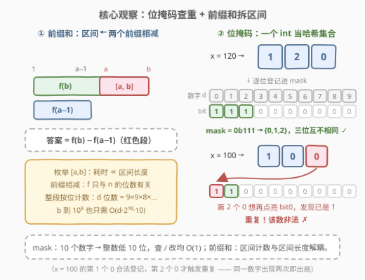
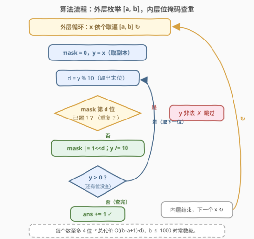
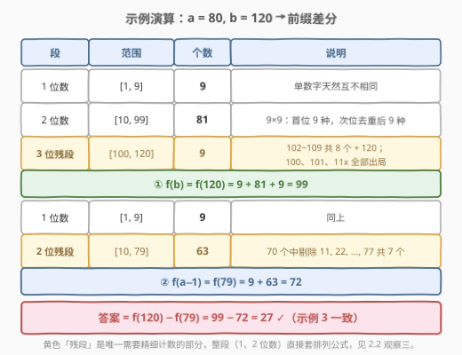

# 统计各位数字都不同的数字个数II

- **题目名称**：统计各位数字都不同的数字个数II
- **链接**：[3032. 统计各位数字都不同的数字个数 II](https://leetcode.cn/problems/count-numbers-with-unique-digits-ii/)
- **难度**：简单
- **标签**：哈希表、数学、动态规划

## 1. 题目概述

> ⚠️ 本题为 LeetCode 付费题，题意描述根据官方示例用例与 hints 重建，可能与官方题面有出入。

给你两个**正整数** `a` 和 `b`，返回**闭区间** `[a, b]` 内**各位数字都不同**的数字个数。

一个数「各位数字都不同」，指它的十进制表示中没有任何数字出现两次及以上：`120` 的各位是 1、2、0，互不相同，合法；`100` 中数字 `0` 出现两次，`11`、`99`、`121` 同理，均非法。

**示例 1**：

```text
输入：a = 1, b = 20
输出：19
解释：除 11 以外，区间 [1, 20] 内的所有数字的各位数字都不同。
```

**示例 2**：

```text
输入：a = 9, b = 19
输出：10
解释：9、10、12~19 的各位数字都不同（11 除外），共 10 个。
```

**示例 3**：

```text
输入：a = 80, b = 120
输出：27
解释：区间 [80, 120] 内共有 41 个整数，其中 27 个数字的各位数字都不同。
```

**约束条件**：

- $1 \le a \le b \le 1000$

> 💡 读题关键：这是一道「**区间计数**」题——统计满足某性质的数有多少个，而不是把它们找出来。性质「各位互不相同」是**逐位判定**的，天然适合把一个数拆成数字序列来检查；而「区间」二字则暗示了前缀和的用武之地。

---

## 2. 解题思路

### 2.1 暴力思路：逐个数转字符串查重

对 $[a, b]$ 中每个数 $x$，拆出十进制各位，用**哈希集合**查重：`len(set(str(x))) == len(str(x))` 成立则计数加一。

数据规模极小（$b \le 1000$：区间至多 1000 个数，每个至多 4 位），一次遍历即可通过，官方 hint 给的也正是这条路线。它的「低效」只在常数：数字只有 0–9 十种，动用一整个哈希集合有点杀鸡用牛刀——**一个 10 bit 的整数**就能干同样的活。

### 2.2 核心观察：位掩码查重 + 前缀和拆区间



**观察一（位掩码）：10 个数字恰好装进一个整数的低 10 位。** 用 `mask` 的第 $d$ 位记录数字 $d$ 是否出现过：查重是 `mask >> d & 1`，登记是 `mask |= 1 << d`，两步 $O(1)$、零哈希开销。这是**状态压缩**最小号的应用——哈希集合被压成一个整数（与 [526. 优美的排列](https://leetcode.cn/problems/beautiful-arrangement/) 用 bitmask 记已用集合同一思路）。

**观察二（前缀和）：区间计数拆成两个前缀相减。** 定义

$$f(n) = [1, n] \text{ 内各位数字都不同的数的个数}$$

则闭区间答案为 $f(b) - f(a-1)$。看似绕路，实则把答案与**区间长度**解耦：$f(n)$ 只与 $n$ 的**位数**有关——直接枚举 $[a,b]$ 要走 $b-a+1$ 步，而前缀版每查一个 $f$ 只需 $O(d \cdot 2^{10} \cdot 10)$（见第 5 节），$b$ 放大到 $10^9$ 也不虚。这与 [304. 二维区域和检索](../0301-0400/304_二维区域和检索%20-%20数组不可变.md)「预处理前缀、查询作差」是同一个骨架。

**观察三（排列计数）：整段的合法个数是排列数。** 不贴上界的完整 $d$ 位数段（如全部 2 位数、全部 3 位数）不必逐个数，直接套**无重复排列**：

$$9 \times 9 \times 8 \times 7 \times \cdots \times (11-d)$$

首位不能取 0（9 种），之后每位只需避开已用数字（0 此时可用，依次 9、8、7… 种）。例如 2 位数 $9 \times 9 = 81$ 个、3 位数 $9 \times 9 \times 8 = 648$ 个。只有与 $n$ 同位数的「**残段**」（如 $f(120)$ 中的 $[100, 120]$）才需要逐位精细计数。

> ⚠️ **鸽笼原理封顶**：数字只有 10 种，**位数超过 10 的数必然有重复数字**。因此全空间合法数有限（$\sum_{d=1}^{10} 9 \times 9 \times \cdots$），位掩码状态 $2^{10}$ 也恰好够用——这不是巧合，是同一件事的两面。

### 2.3 算法流程：外层枚举，内层位掩码查重



主解（暴力版）按两层组织：

1. **外层**：`x` 依个取遍 $[a, b]$；
2. **内层**：`mask = 0`，在 `x` 的副本 `y` 上循环——取末位 `d = y % 10`；若 `mask` 第 $d$ 位已置 1，该数非法，立即跳出；否则登记 `mask |= 1 << d` 并去掉末位 `y /= 10`；
3. `y` 归零说明各位查完且无冲突，`ans += 1`。

### 2.4 示例演算



用示例 3（$a=80, b=120$）走一遍前缀差分：

- **$f(120) = 9 + 81 + 9 = 99$**：1 位数 9 个、2 位数 $9 \times 9 = 81$ 个整段直数；残段 $[100, 120]$ 中合法的是 $102 \sim 109$（8 个）与 $120$（1 个），而 $100$（两个 0）、$101$（两个 1）、$110 \sim 119$（两个 1）全部出局；
- **$f(79) = 9 + 63 = 72$**：残段 $[10, 79]$ 共 70 个两位数，剔除 $11, 22, \ldots, 77$ 共 7 个重复数字；
- **答案 $= 99 - 72 = 27$**，与示例一致。

三个示例的前缀差分核对：

| 输入 | $f(b)$ | $f(a-1)$ | 答案 |
|------|--------|----------|------|
| `a=1, b=20` | $9 + 10 = 19$ | $f(0) = 0$ | $19$ |
| `a=9, b=19` | $9 + 9 = 18$ | $f(8) = 8$ | $10$ |
| `a=80, b=120` | $99$ | $72$ | $27$ |

---

## 3. 参考代码

### C++（位掩码逐数检查）

```cpp
class Solution {
  public:
    int numberCount(int a, int b) {
        int ans = 0;
        for (int x = a; x <= b; ++x)
            if (uniqueDigits(x)) ++ans;
        return ans;
    }
  private:
    // 位掩码查重：低 10 位依次对应数字 0~9
    bool uniqueDigits(int x) {
        int mask = 0;
        for (; x; x /= 10) {
            int d = x % 10;
            if (mask >> d & 1) return false;  // 数字 d 已出现过
            mask |= 1 << d;                   // 登记 d
        }
        return true;
    }
};
```

### Python（集合一行版）

```python
class Solution:
    def numberCount(self, a: int, b: int) -> int:
        return sum(len(set(str(x))) == len(str(x)) for x in range(a, b + 1))
```

> 💡 两个版本语义等价，位掩码版只是把哈希集合换成整数的低 10 位。注意本题保证 $a \ge 1$；若把下界放宽到 0，`0` 是单数字应算合法——位掩码版对 `x = 0` 的空循环恰好返回 `true`，而数位 DP 版默认不数 0（见第 5 节），两者约定不同，改动时留意。

---

## 4. 复杂度分析

| 维度 | 复杂度 | 说明 |
|------|--------|------|
| 时间复杂度 | $O((b-a+1) \cdot d)$ | $d$ 为 $b$ 的位数（本题 $\le 4$）：每个数各位检查一次；$b \le 1000$ 时至多 4000 次位操作，常数级 |
| 空间复杂度 | $O(1)$ | 位掩码版仅一个 `mask` 整数；集合版每个数临时建 $\le 10$ 个元素的集合，亦为 $O(1)$ |

---

## 5. 扩展：数位 DP——把 b 放大到 10^9

若约束变成 $1 \le a \le b \le 10^9$，$O(b-a)$ 的枚举必然超时，前缀差分 + **数位 DP** 登场：$f(n)$ 的残段用记忆化搜索逐位试填，状态只需四个量——`i`（填到第几位）、`mask`（已用数字集合）、`tight`（是否仍贴着 $n$ 的上界）、`started`（是否已填过非前导零的数字）。复杂度 $O(d \cdot 2^{10} \cdot 10)$，与 $n$ 的大小无关（代码风格与 [2376. 统计特殊整数](../2301-2400/2376_统计特殊整数.md)的通用框架完全一致，那题就是本扩展的成品形态）：

```python
from functools import lru_cache

class Solution:
    def numberCount(self, a: int, b: int) -> int:
        def count(n: int) -> int:            # f(n)：[1, n] 内各位互不相同的数的个数
            if n <= 0:
                return 0
            s = str(n)

            @lru_cache(None)
            def dfs(i, mask, tight, started):
                if i == len(s):
                    return 1 if started else 0   # 填过有效数字才计数
                up = int(s[i]) if tight else 9
                ans = 0
                for d in range(up + 1):
                    if not started and d == 0:
                        ans += dfs(i + 1, mask, False, False)  # 前导零，不写入掩码
                    elif mask >> d & 1:
                        continue                             # 数字 d 已用，剪枝
                    else:
                        ans += dfs(i + 1, mask | (1 << d), tight and d == up, True)
                return ans

            return dfs(0, 0, True, False)

        return count(b) - count(a - 1)
```

### C++

```cpp
class Solution {
  public:
    int numberCount(int a, int b) { return count(b) - count(a - 1); }
  private:
    int count(int n) {                      // f(n)：[1, n] 内各位互不相同的数的个数
        if (n <= 0) return 0;
        string s = to_string(n);
        int m = s.size();
        vector<vector<int>> memo(m, vector<int>(1 << 10, -1));
        function<int(int, int, bool, bool)> dfs =
            [&](int i, int mask, bool tight, bool started) -> int {
            if (i == m) return started ? 1 : 0;
            if (!tight && memo[i][mask] != -1) return memo[i][mask];
            int up = tight ? s[i] - '0' : 9;
            int ans = 0;
            for (int d = 0; d <= up; ++d) {
                if (!started && d == 0)
                    ans += dfs(i + 1, mask, false, false);   // 前导零，不写入掩码
                else if (mask >> d & 1)
                    continue;                                // 数字 d 已用，剪枝
                else
                    ans += dfs(i + 1, mask | (1 << d), tight && d == up, true);
            }
            if (!tight) memo[i][mask] = ans;
            return ans;
        };
        return dfs(0, 0, true, false);
    }
};
```

> 💡 `memo` 以 $(i, \text{mask})$ 为键是安全的：`mask == 0` 当且仅当 `started == false`（首位非零数字一旦填入必然点亮至少一个 bit），两个状态不会串味。

---

## 6. 面试要点

1. **为什么位掩码能代替哈希集合？**

   - 数字只有 0~9 十种，整数的低 10 位一位对一个数字：第 $d$ 位为 1 ⇔ 数字 $d$ 已出现。查询 `mask >> d & 1`、登记 `mask |= 1 << d` 均 $O(1)$，无哈希与装箱开销。这是状态压缩在「查重」上的最小应用。

2. **前缀和在这里解决什么问题？**

   - 把闭区间 $[a, b]$ 的计数拆成 $f(b) - f(a-1)$ 两个前缀计数，使代价与**区间长度**解耦、只依赖 $n$ 的**位数**。区间计数问题（区间和、区间频率）的通用范式。

3. **d 位数的合法个数公式是什么？为什么首位是 9 不是 10？**

   - $9 \times 9 \times 8 \times \cdots \times (11-d)$。首位取 0 会退化成更少位数，故只有 9 种；第二位起 0 可用但须避开已用数字，依次 9、8、7…。本质是**无重复排列**。

4. **位数超过 10 的数为什么必然非法？**

   - 鸽笼原理：只有 10 种数字，11 位必有两处相同。全空间合法数有限，位掩码 $2^{10}$ 个状态恰好覆盖——约束与数据结构在此闭合。

5. **如果 b 达到 10^9，代码怎么改？**

   - 暴力 $O(b-a)$ 超时，改前缀差分 + 数位 DP：`dfs(i, mask, tight, started)` 记忆化搜索，状态数 $d \cdot 2^{10}$，总复杂度 $O(d \cdot 2^{10} \cdot 10)$。[2376. 统计特殊整数](https://leetcode.cn/problems/count-special-integers/)（[站内题解](../2301-2400/2376_统计特殊整数.md)）就是这副模板。

---

## 7. 同类练习题

- [357. 统计各位数字都不同的数字个数](https://leetcode.cn/problems/count-numbers-with-unique-digits/)：本题的「单点前缀」雏形——统计 $[0, n]$ 内合法数，经典排列计数入门
- [2376. 统计特殊整数](https://leetcode.cn/problems/count-special-integers/)（[站内题解](../2301-2400/2376_统计特殊整数.md)）：本题的 $10^9$ 泛化版，数位 DP + 位掩码的标准成品
- [1012. 至少有 1 位重复的数字](https://leetcode.cn/problems/numbers-with-repeated-digits/)（[站内题解](../1001-1100/1012_至少有1位重复的数字.md)）：正难则反——数「重复」的个数用 $n - f(n)$ 求差
- [967. 连续差相同的数字](https://leetcode.cn/problems/numbers-with-same-consecutive-differences/)：反向「构造」各位互不相同的数（相邻位差恒为 k），DFS 生成，与计数版互补
