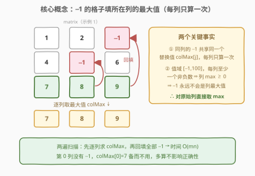
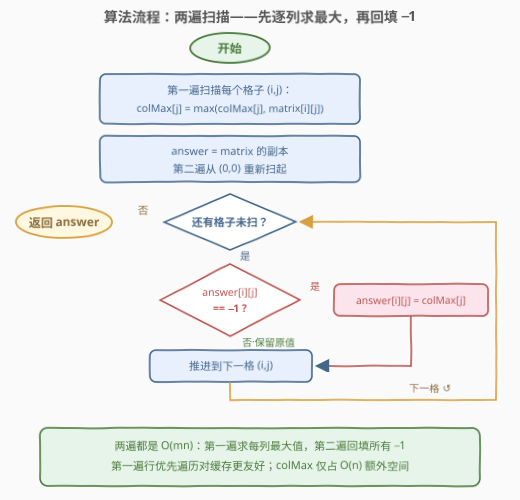
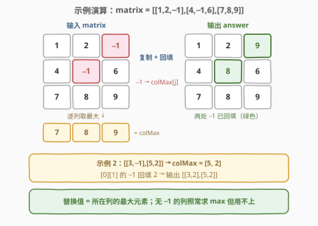

# LeetCode 修改矩阵 题解

## 1. 题目概述

- **标题 / 题号**：修改矩阵（#3033，easy）
- **链接**：https://leetcode.cn/problems/modify-the-matrix/
- **难度**：简单
- **标签**：数组、矩阵

**题意**：给你一个下标从 **0** 开始、大小为 `m x n` 的整数矩阵 `matrix`，新建一个下标从 **0** 开始、名为 `answer` 的矩阵。先使 `answer` 与 `matrix` 相等，接着将其中每个值为 `-1` 的元素替换为**所在列**的**最大元素**。

返回矩阵 `answer`。

**示例 1**：

```text
输入：matrix = [[1,2,-1],[4,-1,6],[7,8,9]]
输出：[[1,2,9],[4,8,6],[7,8,9]]
解释：
  - 将单元格 [1][1] 中的 -1 替换为列 1 中的最大值 8
  - 将单元格 [0][2] 中的 -1 替换为列 2 中的最大值 9
```

**示例 2**：

```text
输入：matrix = [[3,-1],[5,2]]
输出：[[3,2],[5,2]]
```

**约束**：

- `m == matrix.length`，`n == matrix[i].length`
- $2 \le m, n \le 50$
- $-1 \le \text{matrix}[i][j] \le 100$
- 测试用例保证：**每列至少包含一个非负整数**

> ⚠️ 读题注意两点：① 替换依据是**所在列**的最大元素，不是行；② `-1` 是整个值域里的最小值，且每列至少有一个非负数，所以列最大值一定 $\ge 0$——这个"不起眼"的保证正是本题能直接对原始列取 max 的根基（见 2.2）。

## 2. 解题思路

### 2.1 暴力思路

对每个值为 `-1` 的格子，现场扫描它所在的**整列**求出最大值，再填入。一次列扫描花费 $O(m)$，若某列有 $k$ 个 `-1`，这一列就要重复扫 $k$ 遍，总时间 $O(m^2 n)$。在 $m, n \le 50$ 的规模下当然也能过，但浪费显而易见：**同一列里所有 `-1` 的替换值是同一个数**，没理由算 $k$ 遍。

### 2.2 核心观察：列最大值预处理（每列只算一次）



三个关键事实把问题化简到极致：

1. **替换值按列共享**：第 $j$ 列里所有 `-1` 的替换值都是同一个 $\text{colMax}[j]$。于是先花 $O(mn)$ 把 $n$ 个列最大值**预处理**出来，再花 $O(mn)$ 回填——每列只算一次最大值。

2. **`-1` 永远不是列最大值**：值域为 $[-1, 100]$，即 `-1` 就是可能的最小值；又因每列至少一个非负整数，故 $\text{colMax}[j] \ge 0 > -1$。**推论**：对原始列直接取 `max` 即可，无需跳过 `-1`；甚至「先回填再取 max」与「先取 max 再回填」结果也一致——回填进来的值恰是列最大值，既不会抬高也不会拉低它。

3. **单趟正向扫描不够**：正向扫到某个 `-1` 时，该列更大的值可能还没出现（如示例 1 列 2 的 `-1` 在第 0 行，最大值 9 在第 2 行）。所以每列至少要**完整读一遍**；两遍法（求 max 一遍 + 回填一遍）让每个格子恰好被访问两次，已是常数因子意义下的最优。

### 2.3 算法流程图



流程一句话：`colMax` 初始化为 $-1$ → **第一遍**扫全部格子，顺手维护每列最大值 → 复制出 `answer` → **第二遍**重扫全部格子，遇到 `-1` 就填 `colMax[j]` → 返回。全程没有排序、没有哈希，两层 `for` 嵌套足矣。

### 2.4 示例演算



以示例 1 走一遍：先逐列取最大——$\text{colMax} = [\max(1,4,7),\ \max(2,-1,8),\ \max(-1,6,9)] = [7, 8, 9]$；再回填——`[0][2]` 的 `-1` 填 $\text{colMax}[2]=9$，`[1][1]` 的 `-1` 填 $\text{colMax}[1]=8$，得到 `[[1,2,9],[4,8,6],[7,8,9]]`。注意第 0 列没有 `-1`，`colMax[0]=7` 备而不用。示例 2 同理：$\text{colMax}=[5,2]$，`[0][1]` 的 `-1` 填 2，得 `[[3,2],[5,2]]`。

## 3. 参考代码

### C++（行优先两遍 + colMax 预处理）

```cpp
class Solution {
  public:
    vector<vector<int>> modifiedMatrix(vector<vector<int>>& matrix) {
        int m = matrix.size(), n = matrix[0].size();
        vector<int> colMax(n, -1);
        for (int i = 0; i < m; ++i)
            for (int j = 0; j < n; ++j)
                colMax[j] = max(colMax[j], matrix[i][j]);

        vector<vector<int>> answer = matrix;   // 副本，不污染输入
        for (int i = 0; i < m; ++i)
            for (int j = 0; j < n; ++j)
                if (answer[i][j] == -1) answer[i][j] = colMax[j];
        return answer;
    }
};
```

### C++（列优先、每列两趟）

```cpp
class Solution {
  public:
    vector<vector<int>> modifiedMatrix(vector<vector<int>>& matrix) {
        int m = matrix.size(), n = matrix[0].size();
        for (int j = 0; j < n; ++j) {
            int mx = -1;
            for (int i = 0; i < m; ++i) mx = max(mx, matrix[i][j]);
            for (int i = 0; i < m; ++i)
                if (matrix[i][j] == -1) matrix[i][j] = mx;
        }
        return matrix;
    }
};
```

> ⚠️ 列优先版直接**原地修改**了 `matrix`，判题只看返回值所以能 AC；但题面明确要求新建 `answer`，且不污染输入是更安全的工程习惯——调用方可能还要复用原矩阵。

### Python（`zip(*)` 转置取列）

```python
class Solution:
    def modifiedMatrix(self, matrix: List[List[int]]) -> List[List[int]]:
        col_max = [max(col) for col in zip(*matrix)]   # 转置：列变元组
        return [
            [col_max[j] if v == -1 else v for j, v in enumerate(row)]
            for row in matrix
        ]
```

> 💡 `zip(*matrix)`：`*` 把 `m` 行解包成 `zip` 的 `m` 个参数，`zip` 依次取出各参数的第 k 个元素拼成元组——恰是第 k **列**。这是 Python 转置矩阵的惯用法。

## 4. 复杂度分析

| 维度 | 复杂度 | 说明 |
|------|--------|------|
| 时间复杂度 | $O(mn)$ | 两遍扫描，每个格子各访问两次，每次 $O(1)$ |
| 空间复杂度 | $O(n)$ 额外 | `colMax` 数组；返回的 `answer` 占 $O(mn)$ 但属输出，通常不计入 |
| 原地变体 | $O(1)$ 额外 | 列优先版直接在 `matrix` 上回填，代价是污染输入 |

## 5. 扩展：两个值得琢磨的变体

1. **「边替换边取 max」会怎样？** 若题面改成"替换值取**当前矩阵**该列的最大值"（已被回填的格子也参与比较），答案不变：回填进来的值恰等于列最大值，既不会引入更大的值，也不会移除任何值，列最大值保持不动。这一「替换不变性」正是 2.2 事实 2 的另一种说法。

2. **去掉「每列至少一个非负数」的保证会怎样？** 若某列全是 `-1`，则 $\text{colMax}[j] = -1$，"替换"退化为恒等操作，语义上仍自洽；题目的保证只是确保替换值一定来自某个"真实"元素（$\ge 0$），避免这种退化情形干扰理解。

## 6. 面试要点

1. **求列最大值时需要跳过 `-1` 吗？**

   - 不需要。值域 $[-1, 100]$ 中 `-1` 是最小值，且每列至少一个非负整数保证 $\text{colMax} \ge 0 > -1$，`-1` 永远赢不了 `max`；对原始列直接取 `max` 结果相同。

2. **能不能只扫一遍就完成回填？**

   - 不能在单趟正向扫描里"边扫边填"：扫到某个 `-1` 时，该列更靠下的更大值可能还没读到。每列至少要完整读一遍；两遍法（先求 `colMax` 再回填）每个格子恰好访问两次，已是最优。

3. **题目为什么强调"每列至少包含一个非负整数"？**

   - 它保证列最大值 $\ge 0$，替换值一定是某个真实元素而非另一个 `-1`；同时它也是「无需跳过 `-1`」「先替换后取 max 结果不变」这两条性质的成立边界。

4. **原地修改输入再返回，可以吗？**

   - 判题只比对返回值，原地版能 AC；但题面要求新建 `answer`，且不污染输入（写时复制的思维）在工程上更安全。面试中主动说出这一权衡是加分项。

5. **Python 的 `zip(*matrix)` 为什么得到的是"列"？**

   - `*matrix` 将各行解包为 `zip` 的多个参数，`zip` 按位置聚合各参数的第 k 个元素，得到第 k 列的元组——等价于矩阵转置。

## 同类练习题

| # | 题目 | 与本题的关联 |
|---|------|-------------|
| 867 | [转置矩阵](https://leetcode.cn/problems/transpose-matrix/) | 本题 Python 解里 `zip(*)` 转置的手撕版，练习行列索引互换 `res[j][i] = matrix[i][j]` |
| 566 | [重塑矩阵](https://leetcode.cn/problems/reshape-the-matrix/) | 矩阵遍历 + 坐标线性化 `(i,j) ↔ idx`，同练二维索引映射 |
| 1672 | [最富有客户的资产总量](https://leetcode.cn/problems/richest-customer-wealth/) | 按行求和取最大，与本题按列取最大互为镜像遍历 |
| 1572 | [矩阵对角线元素的和](https://leetcode.cn/problems/matrix-diagonal-sum/) | 按对角线轨迹遍历矩阵，练习非常规遍历顺序与中心格去重 |
| 1351 | [统计有序矩阵中的负数](https://leetcode.cn/problems/count-negative-numbers-in-a-sorted-matrix/) | 在矩阵中按值定位元素，利用行列有序性从左下角出发 $O(m+n)$ 计数 |
