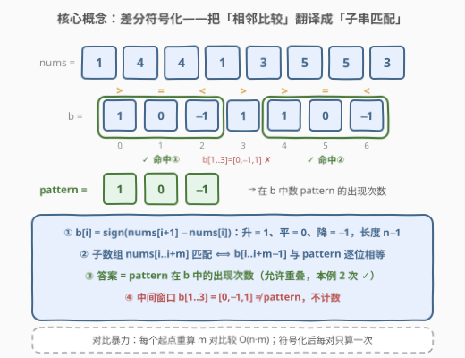
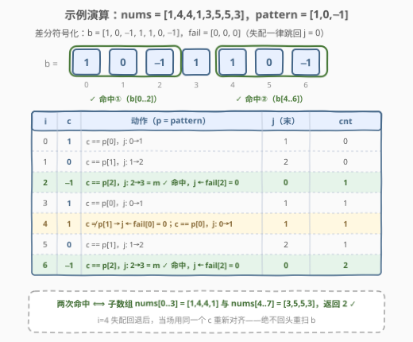

# 匹配模式数组的子数组数目 I

- **题目名称**：匹配模式数组的子数组数目 I
- **链接**：[3034. 匹配模式数组的子数组数目 I](https://leetcode.cn/problems/number-of-subarrays-that-match-a-pattern-i/)
- **难度**：中等
- **标签**：数组、字符串匹配、哈希函数、滚动哈希

## 1. 题目概述

给定下标从 0 开始、长度为 $n$ 的整数数组 `nums`，和下标从 0 开始、长度为 $m$ 的整数数组 `pattern`（只包含整数 $-1$、$0$ 和 $1$）。

大小为 $m+1$ 的子数组 $\text{nums}[i..j]$ 如果对于每个元素 `pattern[k]` 都满足以下条件，则称该子数组**匹配**模式数组 `pattern`：

- 如果 $\text{pattern}[k] = 1$，那么 $\text{nums}[i+k+1] > \text{nums}[i+k]$
- 如果 $\text{pattern}[k] = 0$，那么 $\text{nums}[i+k+1] = \text{nums}[i+k]$
- 如果 $\text{pattern}[k] = -1$，那么 $\text{nums}[i+k+1] < \text{nums}[i+k]$

请你返回匹配 `pattern` 的 `nums` 子数组的**数目**。

**示例 1**：

```text
输入：nums = [1,2,3,4,5,6], pattern = [1,1]
输出：4
解释：模式 [1,1] 说明要找长度为 3 且严格上升的子数组。
[1,2,3]、[2,3,4]、[3,4,5] 和 [4,5,6] 都匹配，共 4 个。
```

**示例 2**：

```text
输入：nums = [1,4,4,1,3,5,5,3], pattern = [1,0,-1]
输出：2
解释：第一个元素 < 第二个元素、第二个 = 第三个、第三个 > 第四个。
子数组 [1,4,4,1] 与 [3,5,5,3] 匹配，共 2 个。
```

**约束条件**：

- $2 \le n = \text{nums.length} \le 100$
- $1 \le \text{nums}[i] \le 10^9$
- $1 \le m = \text{pattern.length} < n$
- $-1 \le \text{pattern}[i] \le 1$

> 💡 **读题关键**：`pattern` 约束的从来不是元素本身的值，而是**相邻元素之间的大小关系**——`pattern[k]` 只管 $\text{nums}[i+k]$ 与 $\text{nums}[i+k+1]$ 这一对。把每一对相邻元素的关系浓缩成一个符号（升/平/降），题目就从「数组比较」变成了「子串匹配」。

---

## 2. 解题思路

### 2.1 暴力思路：枚举起点逐项校验

枚举每个起点 $i$（共 $n-m$ 个），对每个 $k \in [0, m)$ 现场计算 $\text{nums}[i+k+1]$ 与 $\text{nums}[i+k]$ 的大小符号，与 $\text{pattern}[k]$ 比对，全部相符则计数 $+1$。时间 $O(n \cdot m)$，空间 $O(1)$。本题 $n \le 100$，最坏约 $10^4$ 次比较，稳过。

但暴力有个隐藏浪费：**相邻起点的大量比较结果是重复算的**——起点 $i$ 与 $i+1$ 的两个窗口共享 $m-1$ 对相邻元素，它们的符号完全一样，却被重算了 $m-1$ 次。姊妹题 3036 把 $n$ 放大到 $10^6$，$O(n \cdot m)$ 达 $10^{12}$ 直接爆炸，必须消除这份重复。

### 2.2 核心观察：差分符号化——把「数值比较」翻译成「子串计数」



定义**符号数组**：

$$b[i] = \operatorname{sign}\big(\text{nums}[i+1] - \text{nums}[i]\big) \in \{-1, 0, 1\}, \quad 0 \le i < n-1$$

即把每一对相邻元素的大小关系编码为 $1$（升）/$0$（平）/$-1$（降）。于是：

$$\text{nums}[i..i+m]\ \text{匹配 pattern}\ \Longleftrightarrow\ b[i..i+m-1] = \text{pattern}$$

因为 `pattern[k]` 约束的恰是第 $k$ 对相邻元素，与子数组的其它部分无关——**$m+1$ 长子数组的匹配性，与 $b$ 中 $m$ 长窗口的相等性一一对应**。原问题就此规约为字符串匹配的计数版母题：

> **统计 `pattern` 在 $b$ 中的出现次数（允许重叠）。**

注意「允许重叠」是刚需而非可选项：不同起点的子数组天然共享元素（示例 1 中 $[1,2,3]$ 与 $[2,3,4]$ 共享 2、3），对应 `pattern` 在 $b$ 中的出现**可以重叠**，一个都不能漏。

I 版 $b$ 长度不超过 99，规约后用切片比较 $\texttt{b[i:i+m] == pattern}$ 也够用；但要 $O(n+m)$ 线性、且同一份代码能在 II 版（$n \le 10^6$）直接通用，就用 **KMP 计数版**：预处理失配数组 `fail`（`pattern` 自匹配），再单遍扫描 $b$，命中时计数并沿 `fail` 链续搜。

### 2.3 算法流程图

![算法流程：符号化 → 预处理 fail → 单遍扫描计数，命中后 j 回退到 fail[m−1] 续搜](../images/p3034_algorithm_flow.svg)

三个阶段：

1. **差分符号化**：一趟 $O(n)$ 生成 $b$；
2. **预处理 fail**：`pattern` 自匹配求最长相等真前后缀，$O(m)$；
3. **单遍扫描计数**：对每个 $c \in b$，失配则沿 `fail` 链回退，匹配则 $j{+}{+}$；$j = m$ 时 $\text{cnt}{+}{+}$，并令 $j \leftarrow \text{fail}[m-1]$——**这一步是允许重叠计数的关键**：它表示「pattern 的某个前缀已被刚消费的字符接上」，重叠的下一个出现不会漏。

### 2.4 示例演算



以示例 2 演算。$\text{nums} = [1,4,4,1,3,5,5,3]$，符号化得 $b = [1, 0, -1, 1, 1, 0, -1]$；$\text{pattern} = [1,0,-1]$ 无相等真前后缀，$\text{fail} = [0,0,0]$。追踪 $j$：

| i | c | 动作 | j（末） | cnt |
|---|---|------|---------|-----|
| 0 | 1  | $c = p[0]$，$j{:}\ 0{\to}1$ | 1 | 0 |
| 1 | 0  | $c = p[1]$，$j{:}\ 1{\to}2$ | 2 | 0 |
| 2 | −1 | $c = p[2]$，$j{:}\ 2{\to}3 = m$ **命中**，$j \leftarrow \text{fail}[2] = 0$ | 0 | 1 |
| 3 | 1  | $c = p[0]$，$j{:}\ 0{\to}1$ | 1 | 1 |
| 4 | 1  | $c \ne p[1]$ → $j \leftarrow \text{fail}[0] = 0$；再比 $c = p[0]$，$j{:}\ 0{\to}1$ | 1 | 1 |
| 5 | 0  | $c = p[1]$，$j{:}\ 1{\to}2$ | 2 | 1 |
| 6 | −1 | $c = p[2]$，$j{:}\ 2{\to}3 = m$ **命中**，$j \leftarrow \text{fail}[2] = 0$ | 0 | 2 |

两次命中分别对应子数组 $\text{nums}[0..3] = [1,4,4,1]$ 与 $\text{nums}[4..7] = [3,5,5,3]$，返回 **2** ✓。注意 $i=4$ 这一步：失配回退到 $j=0$ 后**当场**用同一个 $c$ 重新对齐，绝不回头重扫 $b$——这是 KMP 摊还线性的精髓。

---

## 3. 参考代码

### C++（差分符号化 + KMP 计数，$O(n+m)$）

```cpp
class Solution {
  public:
    int countMatchingSubarrays(vector<int>& nums, vector<int>& pattern) {
        int n = nums.size(), m = pattern.size();

        // 阶段一：差分符号化 b[i] = sign(nums[i+1] - nums[i])，长度 n-1
        vector<int> b;
        b.reserve(n - 1);
        for (int i = 0; i + 1 < n; ++i)
            b.push_back(nums[i + 1] > nums[i] ? 1 : nums[i + 1] == nums[i] ? 0 : -1);

        // 阶段二：KMP 预处理失配数组（pattern 自匹配）
        vector<int> fail(m, 0);
        for (int i = 1; i < m; ++i) {
            int j = fail[i - 1];
            while (j > 0 && pattern[i] != pattern[j]) j = fail[j - 1];
            if (pattern[i] == pattern[j]) ++j;
            fail[i] = j;
        }

        // 阶段三：单遍扫描 b，统计 pattern 的出现次数（含重叠）
        int cnt = 0, j = 0;
        for (int c : b) {
            while (j > 0 && c != pattern[j]) j = fail[j - 1];  // 失配回退
            if (c == pattern[j]) ++j;                          // 匹配推进
            if (j == m) {                                      // 完整命中
                ++cnt;
                j = fail[j - 1];   // 关键：接住可重叠的下一次出现
            }
        }
        return cnt;
    }
};
```

### Python（KMP 计数版 + 切片暴力对照版）

KMP 版（正解，$O(n+m)$，II 版同代码直通）：

```python
class Solution:
    def countMatchingSubarrays(self, nums: List[int], pattern: List[int]) -> int:
        n, m = len(nums), len(pattern)

        # 阶段一：差分符号化，b[i] = sign(nums[i+1] - nums[i])
        b = [(nums[i + 1] > nums[i]) - (nums[i + 1] < nums[i]) for i in range(n - 1)]

        # 阶段二：KMP 预处理失配数组
        fail = [0] * m
        for i in range(1, m):
            j = fail[i - 1]
            while j and pattern[i] != pattern[j]:
                j = fail[j - 1]
            if pattern[i] == pattern[j]:
                j += 1
            fail[i] = j

        # 阶段三：单遍扫描计数（含重叠）
        cnt = j = 0
        for c in b:
            while j and c != pattern[j]:      # 失配回退
                j = fail[j - 1]
            if c == pattern[j]:               # 匹配推进
                j += 1
            if j == m:                        # 完整命中
                cnt += 1
                j = fail[j - 1]               # 接住可重叠的下一次出现
        return cnt
```

切片暴力对照版（$O(n \cdot m)$，I 版 $n \le 100$ 足够，胜在短）：

```python
class Solution:
    def countMatchingSubarrays(self, nums: List[int], pattern: List[int]) -> int:
        b = [(y > x) - (y < x) for x, y in zip(nums, nums[1:])]
        m = len(pattern)
        return sum(b[i:i + m] == pattern for i in range(len(b) - m + 1))
```

> 💡 **面试节奏**：先给暴力当 baseline 并点出「相邻窗口重复计算」的浪费，再做差分符号化的规约（本题的得分点），最后视要求补 KMP 或说明 I 版切片够用——这是本题完整的故事线。

---

## 4. 复杂度分析

| 维度 | 复杂度 | 说明 |
|------|--------|------|
| 时间复杂度 | $O(n + m)$ | 符号化 $O(n)$ + 预处理 fail $O(m)$ + 扫描摊还 $O(n)$（$j$ 的总回退量 ≤ 总前进量 ≤ $n-1$） |
| 空间复杂度 | $O(n + m)$ | 符号数组 $b$ 占 $O(n)$，fail 占 $O(m)$；若边扫边算 sign 可省去 $b$，降到 $O(m)$ |
| 暴力对照 | $O(n \cdot m)$ / $O(1)$ | I 版 $n \le 100$ 可过；II 版 $n \le 10^6$ 超时 |

---

## 5. 扩展：姊妹题 3036 与其他线性解法

**姊妹题 [3036. 匹配模式数组的子数组数目 II](https://leetcode.cn/problems/number-of-subarrays-that-match-a-pattern-ii/)（困难）**：题面逐字相同，唯一区别是 $n \le 10^6$。差分符号化 + KMP 的代码一字不改直接通过；暴力与切片比较双双失效。又是典型的「I 版小数据放行暴力 / II 版放大逼出线性」双题套路（同 3010/3013、3023/3037 家族）。

**Z 函数解法**：拼接 $\text{pattern} + [2] + b$（分隔符 2 不在字母表 $\{-1,0,1\}$ 中），对拼接串求 Z 数组，$b$ 段内 $z_i \ge m$ 的位置数即答案。与 KMP 同为 $O(n+m)$，写熟哪个用哪个。

**滚动哈希**（官方标签点名）：把 $-1/0/1$ 映射为 $0/1/2$，多项式哈希逐窗滚动与 `pattern` 的哈希比对——但存在碰撞概率，需双模数或命中后逐位验证兜底。小字母表还有个精确技巧：每符号 2 bit 打包，$m \le 32$ 可塞进一个 `uint64` 直接判等（Python 大整数无此限制），无哈希碰撞，是 187「重复的 DNA 序列」滚动哈希思想在本题的化身。

---

## 6. 面试要点

1. **差分符号化为什么是等价变换？会丢信息吗？**

   - `pattern[k]` 只约束相邻对 $(\text{nums}[i+k],\ \text{nums}[i+k+1])$，而 $b$ 恰好逐对记录了符号，所以子数组匹配 ⟺ 对应 $m$ 个符号逐位相等。确实丢了「具体数值」（如 $[1,3]$ 与 $[1,5]$ 的符号都是 1），但匹配性只依赖符号——丢掉的恰是无用信息。

2. **KMP 命中后为什么必须 $j \leftarrow \text{fail}[m-1]$，归零会怎样？**

   - 计数版必须允许**重叠出现**。反例：$\text{pattern} = [1,1]$、$b = [1,1,1]$（对应 $\text{nums} = [1,2,3,4]$）。若命中后 $j \leftarrow 0$，则在 $i=1$ 命中后 $j$ 清零，$i=2$ 只推进到 1，漏掉起点 1 的匹配，得 1 而正确答案是 2。$\text{fail}[m-1] = 1$ 的含义是「pattern 前 1 位已被刚消费的字符接上」，重叠匹配不丢。归零不是慢，是**漏解**。

3. **本题数据范围到底要不要写 KMP？**

   - I 版 $n \le 100$：切片比较 $O(n \cdot m) \le 10^4$ 足够，工程上更简单；KMP 的价值在 II 版 $n \le 10^6$ 与面试展示。能主动说清这个权衡是加分项，说明你不是无脑上模板。

4. **fail 数组的含义与求法？**

   - $\text{fail}[i]$ = `pattern[0..i]` 的最长相等真前后缀长度。`pattern` 自匹配递推：失配沿 fail 链回退，$O(m)$。同 28（strStr）、1392（最长快乐前缀）的前缀函数。

5. **为什么官方标签里有哈希函数/滚动哈希？**

   - 规约后是纯子串匹配计数，字母表仅 3 个符号，滚动哈希（187 同款）是官方预期解之一；KMP 是其无碰撞的精确替代。回答时点出「规约 → 子串匹配」这一步，两类解法就都顺理成章。

---

## 7. 同类练习题

- [3036. 匹配模式数组的子数组数目 II](https://leetcode.cn/problems/number-of-subarrays-that-match-a-pattern-ii/)：本题姊妹篇（困难），$n$ 放大到 $10^6$，暴力失效、线性匹配成为必须
- [28. 找出字符串中第一个匹配项的下标](https://leetcode.cn/problems/find-the-index-of-the-first-occurrence-in-a-string/)（[题解](../0001-0100/28_找出字符串中第一个匹配项的下标.md)）：KMP 母题 `strStr`，本题为它的「计数 + 数组规约」形态
- [1392. 最长快乐前缀](https://leetcode.cn/problems/longest-happy-prefix/)（[题解](../1301-1400/1392_最长快乐前缀.md)）：前缀函数（fail 数组）的单独考察
- [187. 重复的DNA序列](https://leetcode.cn/problems/repeated-dna-sequences/)（[题解](../0101-0200/187_重复的DNA序列.md)）：滚动哈希定长窗口查重，本文「符号编码 + 滚动比对」思想的字母表版
- [3023. 在无限流中寻找模式 I](https://leetcode.cn/problems/find-pattern-in-infinite-stream-i/)（[题解](../3001-3100/3023_在无限流中寻找模式I.md)）：KMP 的流式形态，本题 fail 链续搜的进阶应用
