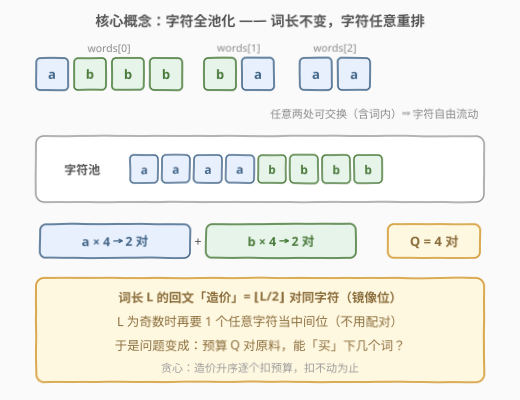
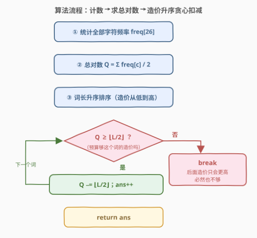

# LeetCode 回文字符串的最大数量 题解

## 1. 题目概述

- **标题 / 题号**：回文字符串的最大数量（#3035，medium）
- **链接**：https://leetcode.cn/problems/maximum-palindromes-after-operations/
- **难度**：中等
- **标签**：贪心、哈希表、字符串、计数、排序

**题意**：给你一个下标从 **0** 开始的字符串数组 `words`，长度为 `n`。你可以执行以下操作**任意次**（**包括零次**）：

- 选择整数 $i, j, x, y$，满足 $0 \le i, j \lt n$，$0 \le x \lt \text{words}[i].\text{length}$，$0 \le y \lt \text{words}[j].\text{length}$，**交换**字符 $\text{words}[i][x]$ 和 $\text{words}[j][y]$。

注意 $i$ 和 $j$ 可以相等（词内也能交换）。返回执行若干操作后，`words` 中可以包含的**回文串的最大数量**。

**示例 1**：

```text
输入：words = ["abbb","ba","aa"]
输出：3
解释：交换 words[0][0] 与 words[1][0]，words 变为 ["bbbb","aa","aa"]，三个串全是回文。
```

**示例 2**：

```text
输入：words = ["abc","ab"]
输出：2
解释：两次交换后 words 变为 ["aca","bb"]，两个串都是回文。
```

**示例 3**：

```text
输入：words = ["cd","ef","a"]
输出：1
解释："a" 本身是回文；可以证明无法得到更多回文。
```

**约束**：

- $1 \le \text{words.length} \le 1000$
- $1 \le \text{words}[i].\text{length} \le 100$
- `words[i]` 仅由小写英文字母组成

> ⚠️ 读题关键：操作只**挪动**字符、不增删字符，所以每个词的**长度永远不会变**——「词长」是每个词的固有属性，而「词里装哪些字符」是完全自由的。看穿这一点，题目瞬间退化。

## 2. 解题思路

### 2.1 暴力思路

最朴素的方向是枚举「哪些词最终成为回文」这个子集，再验证字符够不够用：子集有 $2^n$ 个（$n \le 1000$），直接爆炸。至于真的去模拟一串串交换操作更无从下手——操作可以任意嵌套，搜索空间无限大。

突破口在于先把「操作」翻译成它的**真实含义**：任意两处字符可以交换（含词内），由交换的传递性，这等价于**把全部字符倒进一个池子，再任意装回各个词**。于是无限的交换序列被压缩成一个有限的多重集合划分问题，$2^n$ 的子集枚举也能被贪心一步到位。

### 2.2 核心观察：字符全池化 + 成对计数 + 按长度贪心



**观察 1（操作 = 自由重排）**：所有字符可以任意重新分配到任何位置，唯一不变的是每个词的长度 $L_i$。

**观察 2（回文的造价）**：长度为 $L$ 的回文串由 $\lfloor L/2 \rfloor$ 对**同字符**的镜像位，加上（$L$ 为奇数时）1 个**任意字符**的中间位构成。设全局字符频率为 $f_c$，则整个字符池最多能提供

$$Q = \sum_{c='a'}^{'z'} \lfloor f_c / 2 \rfloor$$

对同字符。

**观察 3（中间位不用省）**：奇数长度词的中间位可以是**任何**字符，甚至来自「拆开的一对」——所以唯一的约束就是「已选词的造价之和 $\le Q$」，中间位永远凑得齐（严格论证见第 5 节）。

于是问题变成：**预算 $Q$ 对原料，每个词的造价是 $\lfloor L_i/2 \rfloor$，最多能「买」下几个词？** 每个词的价值都一样（+1 个回文），当然从最便宜的买起——把词长**升序排序**，逐个扣减 $Q$，扣不动为止。

> 💡 **交换论证**：若某个最优解买了贵词 $x$（造价 $c_x$）却没买便宜词 $y$（$c_y \le c_x$），把 $x$ 换成 $y$ 后总价只降不升，仍可行且个数不变。反复替换可得：**「取 $k$ 个造价最小的词」对任意 $k$ 都最优**，所以按造价升序贪心能取到最大个数。

### 2.3 算法流程图



### 2.4 示例演算

![示例演算：words=["abbb","ba","aa"]](../images/p3035_example_walkthrough.svg)

以示例 1 `words = ["abbb","ba","aa"]` 走一遍完整流程：

| 步骤 | 操作 | 结果 |
|------|------|------|
| 1 | 全局字符计数 | $f_a = 4$，$f_b = 4$ |
| 2 | 求总对数 | $Q = 2 + 2 = 4$ |
| 3 | 词长升序排序 | $[2, 2, 4]$，造价 $[1, 1, 2]$ |
| 4 | 逐词扣预算 | 造价 1：$Q{:}4{\to}3$；造价 1：$Q{:}3{\to}2$；造价 2：$Q{:}2{\to}0$ |

最终 `ans = 3`，一种具体分配是 $[\text{"aa"}, \text{"aa"}, \text{"bbbb"}]$，与示例一致。

顺带验证示例 3 `["cd","ef","a"]`：每个字符都只出现 1 次，$Q = 0$；长度 1 的词造价 0「白拿」（`"a"` 本身就是回文），长度 2 的词造价 1 买不起，故 `ans = 1`。

> ⚠️ **贪心顺序是必要的**：设词长 $[2,2,8]$、$Q = 4$。若先喂造价 4 的长词，$Q$ 清零只得 1 个回文；先喂造价 1、1 的两个短词则可得 2 个。便宜优先才能最大化个数。

## 3. 参考代码

### C++（成对计数 + 词长排序贪心）

```cpp
class Solution {
  public:
    int maxPalindromesAfterOperations(vector<string>& words) {
        int freq[26] = {0};
        for (const auto& w : words)
            for (char c : w) ++freq[c - 'a'];

        int pairs = 0;                               // 全池同字符对总数 Q
        for (int c : freq) pairs += c / 2;

        vector<int> lens;
        for (const auto& w : words) lens.push_back((int)w.size());
        sort(lens.begin(), lens.end());              // 造价 = ⌊L/2⌋，升序消耗

        int ans = 0;
        for (int L : lens) {
            int need = L / 2;
            if (pairs < need) break;                 // 后面造价只高不低，必然不够
            pairs -= need;
            ++ans;
        }
        return ans;
    }
};
```

### Python

```python
class Solution:
    def maxPalindromesAfterOperations(self, words: List[str]) -> int:
        freq = Counter(c for w in words for c in w)
        pairs = sum(v // 2 for v in freq.values())   # 全池同字符对总数 Q
        ans = 0
        for L in sorted(map(len, words)):            # 造价 = ⌊L/2⌋，升序消耗
            need = L // 2
            if pairs < need:
                break                                # 后面造价只高不低，必然不够
            pairs -= need
            ans += 1
        return ans
```

> 💡 两份代码逻辑完全一致：计数 → 求 $Q$ → 词长升序 → 逐词扣预算。数据规模很小（总字符 $\le 10^5$，$Q \le 5 \times 10^4$），`int` 绰绰有余，无需担心溢出。

## 4. 复杂度分析

| 维度 | 复杂度 | 说明 |
|------|--------|------|
| 时间复杂度 | $O(\sum L_i + n \log n)$ | 遍历所有字符计数 $O(\sum L_i)$（$\le 10^5$），词长排序 $O(n \log n)$，扣预算一轮 $O(n)$ |
| 空间复杂度 | $O(n)$ | 词长数组；计数仅 26 个整数，可视为 $O(1)$ |

其中 $n = \text{len(words)}$，$\sum L_i$ 为所有词的总长度。若直接原地按长度排序 `words`（比较器只比 `size()`，不搬字符串），额外空间可降到 $O(26)$。

## 5. 扩展：为什么中间字符不需要单独预算？

**命题**：一组词 $S$ 能同时变成回文 $\iff$ $\sum_{i \in S} \lfloor L_i/2 \rfloor \le Q$。

**必要性**：每个长 $L_i$ 的回文词内部恰含 $\lfloor L_i/2 \rfloor$ 对互不重叠的同字符对（镜像位），不同词占用的字符实例也不重叠；而全池同字符对的上限是 $Q = \sum_c \lfloor f_c/2 \rfloor$，故造价总和不能超过 $Q$。

**充分性（构造）**：设 $P = \sum_{i \in S} \lfloor L_i/2 \rfloor$，$M$ 为 $S$ 中奇长词的个数。

1. 按各字符依次取出 $P$ 对同字符（$P \le Q$ 保证取得出），分给各词做镜像位；
2. 此时池中还剩 $T - 2P$ 个字符（$T$ 为总字符数），而中间位只需 $M$ 个。由 $2P + M = \sum_{i \in S} L_i \le T$ 知 $T - 2P \ge M$，随便挑即可——**这就是「拆一对当两个中间位」的出处**：取对时少取一对，那两个字符自然留在池里当中间位候选；
3. 剩下的字符塞给未选中的词（它们不要求是回文），恰好填满。

所以中间位永远不构成瓶颈，唯一约束就是「对数够不够」。

**变体思考**：若把操作限制为「只能词内交换」（$i = j$），则字符无法跨词流动，退化为逐词判定「自身字符能否排成回文」——统计该词中出现奇数次的字符种数是否 $\le 1$（[409. 最长回文串](https://leetcode.cn/problems/longest-palindrome/) 的单词版判定）。对比之下更能体会本题「全池化」这一步的威力。

## 6. 面试要点

1. **为什么任意交换等价于「字符全池化自由分配」？**

   - 任意两个位置（含同一词内）都能交换，由交换的传递性（冒泡排序原理），任意字符可以挪到任意槽位；槽位总数与每个词的长度不变。所以只需关心「多重字符集合怎么分进固定长度的槽」。

2. **为什么按词长升序贪心是对的？**

   - 每个词价值相同（都贡献 1 个回文），最大化个数等价于最小化总价：取 $k$ 个回文的最低总价 = $k$ 个最小造价之和。交换论证：贵词换便宜词仍可行。反例：词长 $[2,2,8]$、$Q=4$，便宜优先得 2 个，贵者优先只得 1 个。

3. **奇数长度词的中间字符为什么不用担心不够？**

   - 中间位可以是任何字符，且总量上 $\sum_{i \in S} L_i \le T$ 保证取完对后剩余字符足够覆盖所有中间位（见第 5 节构造）；一对拆开还能当两个中间位用。唯一的硬约束是同字符对数 $Q$。

4. **循环里为什么可以 break 而不是 continue？**

   - 造价 $\lfloor L/2 \rfloor$ 随词长升序**单调不减**，当前词都买不起，后面的更买不起，直接终止。

5. **实现上有什么细节？**

   - 只需 `freq[26]` 计数与词长数组，排序排长度即可（比较 `size()`，不必搬动字符串）；$Q$ 与造价上限约 $5 \times 10^4$，`int` 足够。

## 同类练习题

| # | 题目 | 与本题的关联 |
|---|------|-------------|
| 409 | [最长回文串](https://leetcode.cn/problems/longest-palindrome/)（[题解](../0401-0500/409_最长回文串.md)） | 同款「成对字符计数」——数出对数与落单字符拼**一个**最长回文，本题是「拼尽可能多个回文」的分布式版本 |
| 2131 | [连接两字母单词得到的最长回文串](https://leetcode.cn/problems/longest-palindrome-by-concatenating-two-letter-words/)（[题解](../2101-2200/2131_连接两字母单词得到的最长回文串.md)） | 两字母词正反配对的贪心计数，回文配对思想的进阶变体 |
| 767 | [重构字符串](https://leetcode.cn/problems/reorganize-string/)（[题解](../0701-0800/767_重构字符串.md)） | 按字符频率贪心分配位置，同属「频率计数 + 贪心重排」家族 |
| 1710 | [卡车上的最大单元数](https://leetcode.cn/problems/maximum-units-on-a-truck/)（[题解](../1701-1800/1710_卡车上的最大单元数.md)） | 固定预算下按单位收益排序贪心，与本题「预算 $Q$ 按造价升序消耗」结构同构 |
