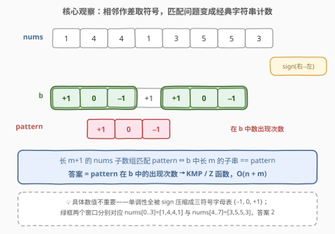
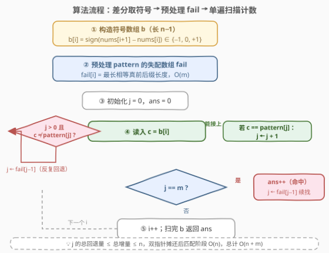
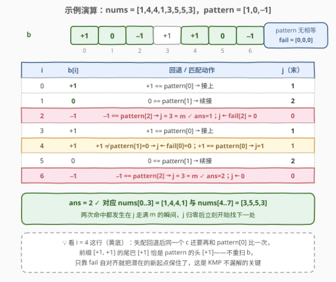

# 匹配模式数组的子数组数目II

- **题目名称**：匹配模式数组的子数组数目 II
- **链接**：[3036. 匹配模式数组的子数组数目 II](https://leetcode.cn/problems/number-of-subarrays-that-match-a-pattern-ii/)
- **难度**：困难
- **标签**：数组、字符串匹配、哈希函数、滚动哈希

## 1. 题目概述

给你一个下标从 **0** 开始长度为 $n$ 的整数数组 `nums`，和一个下标从 0 开始长度为 $m$ 的整数数组 `pattern`，`pattern` 数组只包含整数 $-1$、$0$ 和 $1$。

大小为 $m + 1$ 的子数组 $nums[i..j]$ 如果对于每个元素 $pattern[k]$ 都满足以下条件，那么我们说这个子数组**匹配**模式数组 `pattern`：

- 如果 $pattern[k] == 1$，那么 $nums[i+k+1] > nums[i+k]$；
- 如果 $pattern[k] == 0$，那么 $nums[i+k+1] == nums[i+k]$；
- 如果 $pattern[k] == -1$，那么 $nums[i+k+1] < nums[i+k]$。

请你返回匹配 `pattern` 的 `nums` 子数组的**数目**。

**示例 1**：

```text
输入：nums = [1,2,3,4,5,6], pattern = [1,1]
输出：4
解释：模式 [1,1] 说明要找长度为 3 且严格上升的子数组。
[1,2,3]、[2,3,4]、[3,4,5]、[4,5,6] 都匹配，共 4 个。
```

**示例 2**：

```text
输入：nums = [1,4,4,1,3,5,5,3], pattern = [1,0,-1]
输出：2
解释：子数组 [1,4,4,1] 和 [3,5,5,3] 匹配，共 2 个。
```

**约束条件**：

- $2 \le n = \text{nums.length} \le 10^6$
- $1 \le \text{nums}[i] \le 10^9$
- $1 \le m = \text{pattern.length} < n$
- $-1 \le \text{pattern}[i] \le 1$

> 💡 **读题关键**：匹配条件只关心**相邻元素的大小关系**（升 / 平 / 降），与具体数值无关。把 $n$ 放大到 $10^6$ 是本题与姊妹题 3034（$n \le 100$，暴力可过）唯一的区别——数据范围逼出 $O(n + m)$ 的线性字符串匹配算法。

---

## 2. 解题思路

### 2.1 暴力思路：枚举起点逐位检查

枚举每个起点 $i \in [0,\ n-m-1]$，逐个检查 $m$ 个相邻对的方向是否与 `pattern` 一致：

```python
ans = 0
for i in range(n - m):
    if all(((nums[i+k+1] > nums[i+k]) - (nums[i+k+1] < nums[i+k])) == pattern[k]
           for k in range(m)):
        ans += 1
```

时间 $O(n \cdot m)$。3034（I 版）$n \le 100$ 稳过；本题 $n, m$ 同为 $10^6$ 量级，最坏 $10^{12}$ 次比较必然超时。观察暴力低效的根源：起点 +1 后，新窗口与旧窗口有 $m-1$ 对相邻关系完全重合，却被整体重比——典型的字符串匹配场景，上 KMP。

### 2.2 核心观察：相邻作差取符号，归约为字符串计数



匹配条件只涉及 $nums[i+k+1]$ 与 $nums[i+k]$ 的大小关系，于是构造**符号数组**（官方 hint 1）：

$$b[i] = \text{sign}\big(\text{nums}[i+1] - \text{nums}[i]\big) = \begin{cases} +1 & \text{nums}[i+1] > \text{nums}[i] \\ 0 & \text{nums}[i+1] = \text{nums}[i] \\ -1 & \text{nums}[i+1] < \text{nums}[i] \end{cases}$$

$b$ 的长度为 $n-1$。于是有等价关系：

> **长 $m+1$ 的 `nums` 子数组匹配 `pattern` $\iff$ $b$ 中长 $m$ 的子串逐位等于 `pattern`。**

原问题被无损归约为最经典的模型：**统计模式串 `pattern` 在文本 `b` 中的出现次数**——KMP / Z 函数 / 滚动哈希任选，都能 $O(n+m)$。

> ⚠️ **易错点**：$b$ 的长度是 $n-1$ 而不是 $n$；答案上界是 $n-m$（不是 $n-m+1$），因为 `nums` 的候选子数组长为 $m+1$，起点至多到 $n-m-1$。用 KMP 在 $b$ 上数出 $m$ 长窗口个数，恰好自动对齐这个上界。

### 2.3 算法流程图：KMP 计数三阶段



在标准 KMP 的匹配循环上加一个**计数分支**即可：

1. **阶段一（差分）**：构造 $b[i] = \text{sign}(\text{nums}[i+1] - \text{nums}[i])$，$O(n)$；
2. **阶段二（自匹配）**：对 `pattern` 求失配数组 $\text{fail}[i]$ = 前 $i+1$ 个元素的最长相等真前后缀长度，$O(m)$；
3. **阶段三（扫描计数）**：单遍扫 $b$，维护「已匹配的 pattern 前缀长度 $j$」：
   - 失配（$j > 0$ 且 $c \ne \text{pattern}[j]$）：$j \leftarrow \text{fail}[j-1]$，反复直到能接上；
   - 匹配推进：$c = \text{pattern}[j]$ 时 $j \leftarrow j+1$；
   - **命中**：$j = m$ 时 $\text{ans} \leftarrow \text{ans} + 1$，再 $j \leftarrow \text{fail}[j-1]$ **继续扫描**——这一步保证重叠出现也被计入（例如 `b = [1,1,1,1]`、`pattern = [1,1]` 应数出 3 处而非 2 处）。

> 💡 **摊还分析**：$j$ 每读一个字符至多 +1，总增量 $\le n-1$；$j$ 恒非负，故 while 的总回退量 $\le$ 总增量。匹配阶段 $O(n)$，全程 $O(n + m)$，扛住 $10^6$。

### 2.4 示例演算



以示例 2 演算。$b = [1, 0, -1, 1, 1, 0, -1]$；`pattern = [1,0,-1]` 无任何相等真前后缀，$\text{fail} = [0,0,0]$。逐步追踪 $j$：

| i | b[i] | 动作 | j（末） |
|---|------|------|---------|
| 0 | +1 | $+1 = p[0]$ → 接上 | 1 |
| 1 | 0 | $0 = p[1]$ → 续接 | 2 |
| 2 | −1 | $-1 = p[2]$ → $j=3=m$ ✓ **ans=1**，$j \leftarrow \text{fail}[2]=0$ | 0 |
| 3 | +1 | $+1 = p[0]$ → 接上 | 1 |
| 4 | +1 | $1 \ne p[1]=0$ → $j \leftarrow \text{fail}[0]=0$；$+1 = p[0]$ → $j=1$ | 1 |
| 5 | 0 | $0 = p[1]$ → 续接 | 2 |
| 6 | −1 | $-1 = p[2]$ → $j=3=m$ ✓ **ans=2**，$j \leftarrow 0$ | 0 |

返回 $\text{ans} = 2$ ✓，对应 $nums[0..3] = [1,4,4,1]$ 与 $nums[4..7] = [3,5,5,3]$。注意 $i=4$ 这一步：失配回退后**同一个 $c$ 立刻与 $p[0]$ 重新比较**，潜在的新起点靠 fail 自对齐保住，$b$ 从不重扫。

---

## 3. 参考代码

### C++（KMP 计数，$O(n+m)$）

```cpp
class Solution {
  public:
    int countMatchingSubarrays(vector<int>& nums, vector<int>& pattern) {
        int n = nums.size(), m = pattern.size();

        // 阶段一：相邻差取符号，得到长 n-1 的"文本串" b
        vector<int> b(n - 1);
        for (int i = 0; i + 1 < n; ++i)
            b[i] = nums[i + 1] > nums[i] ? 1 : (nums[i + 1] == nums[i] ? 0 : -1);

        // 阶段二：pattern 自匹配求失配数组
        vector<int> fail(m, 0);
        for (int i = 1; i < m; ++i) {
            int j = fail[i - 1];
            while (j > 0 && pattern[i] != pattern[j]) j = fail[j - 1];
            if (pattern[i] == pattern[j]) ++j;
            fail[i] = j;
        }

        // 阶段三：单遍扫描 b，j = 已匹配的 pattern 前缀长度
        int ans = 0, j = 0;
        for (int c : b) {
            while (j > 0 && c != pattern[j]) j = fail[j - 1];
            if (c == pattern[j]) ++j;
            if (j == m) {              // 完整命中一次
                ++ans;
                j = fail[j - 1];       // 归位续扫，重叠出现也能数到
            }
        }
        return ans;
    }
};
```

### Python（KMP 计数，$O(n+m)$）

```python
class Solution:
    def countMatchingSubarrays(self, nums: List[int], pattern: List[int]) -> int:
        n, m = len(nums), len(pattern)

        # 阶段一：相邻差取符号
        b = [(nums[i + 1] > nums[i]) - (nums[i + 1] < nums[i]) for i in range(n - 1)]

        # 阶段二：预处理失配数组
        fail = [0] * m
        for i in range(1, m):
            j = fail[i - 1]
            while j and pattern[i] != pattern[j]:
                j = fail[j - 1]
            if pattern[i] == pattern[j]:
                j += 1
            fail[i] = j

        # 阶段三：单遍扫描计数
        ans = j = 0
        for c in b:
            while j and c != pattern[j]:      # 失配：前缀自对齐
                j = fail[j - 1]
            if c == pattern[j]:
                j += 1
            if j == m:                        # 命中一次
                ans += 1
                j = fail[j - 1]               # 继续找（可重叠）
        return ans
```

> 💡 Python 的 `(a > b) - (a < b)` 是 `sign(a - b)` 的惯用零分支写法；$n = 10^6$ 时建议少用 `numpy`（转换开销）多用心推导的列表式，正常解释器速度可过。

---

## 4. 复杂度分析

| 维度 | 复杂度 | 说明 |
|------|--------|------|
| 时间复杂度 | $O(n + m)$ | 差分 $O(n)$ + 预处理 fail $O(m)$ + 扫描 $b$ 摊还 $O(n)$（$j$ 总回退量 ≤ 总增量） |
| 空间复杂度 | $O(n + m)$ | 符号数组 $b$ 长 $n-1$；fail 长 $m$。若想省 $O(n)$，可在扫描时**边算边用** $b[i]$，无需显式存下（见下方扩展） |
| 对比暴力 | $O(n \cdot m)$ | $n, m \sim 10^6$ 时相差约 $10^6$ 倍，II 版的生死线 |

---

## 5. 扩展：Z 函数与滚动哈希

**Z 函数拼接法**：把 `pattern`、一个不在字母表的分隔符（如 $2$）、$b$ 拼成一串 $s$，求 Z 数组后，$z[i] \ge m$（$i$ 落在 $b$ 段内）的位置就是一次完整出现：

```python
class Solution:
    def countMatchingSubarrays(self, nums: List[int], pattern: List[int]) -> int:
        n, m = len(nums), len(pattern)
        b = [(nums[i + 1] > nums[i]) - (nums[i + 1] < nums[i]) for i in range(n - 1)]
        s = pattern + [2] + b                      # 2 不属于 {−1,0,1}，天然分隔
        L = len(s)
        z = [0] * L
        l = r = 0
        for i in range(1, L):
            if i < r:
                z[i] = min(r - i, z[i - l])
            while i + z[i] < L and s[z[i]] == s[i + z[i]]:
                z[i] += 1
            if i + z[i] > r:
                l, r = i, i + z[i]
        return sum(1 for i in range(m + 1, L) if z[i] >= m)
```

**滚动哈希**（本题标签之一）：对 `pattern` 和 $b$ 做多项式哈希（基数如 131，模大质数，双哈希防碰撞），滑窗 $O(1)$ 更新比对，总 $O(n+m)$。思路与 187「重复的 DNA 序列」同源，但哈希有极小概率误判；KMP / Z 是**精确**解，面试优先。

**流式化**：若题目改成「无限流 + 只能向前读一次」，把阶段一的差分改成在线维护 `prev`，每个新元素 $O(1)$ 算出符号喂给 KMP 即可——正是 3023/3037「在无限流中寻找模式」的形态，三个阶段里只有差分从数组遍历变成流式增量。

---

## 6. 面试要点

1. **为什么想到差分取符号？匹配条件和数值大小有关吗？**

   - 条件只比较相邻元素的大于 / 等于 / 小于，与差值具体多少无关。$\text{sign}$ 把整段信息压缩成三符号字母表 $\{-1, 0, +1\}$，问题瞬间变成「统计模式串出现次数」这一教科书模型，KMP / Z / 哈希全套工具直接可用。

2. **KMP 计数和普通 KMP 查找差在哪一步？**

   - 查找版命中即返回；计数版命中后要做两件事：`ans++`，然后 `j = fail[j-1]` 把 $j$ 归位到最长相等真前后缀**继续扫**。漏掉第二件事会丢掉**重叠出现**——如 $b = [1,1,1,1]$、`pattern = [1,1]` 应答 3，错误写法只会数出 2。

3. **失配跳到 `fail[j-1]`，为什么不会漏解？**

   - 失配时已匹配的 $j$ 位恰等于 pattern 前缀；下一个可能起点必须满足「pattern 某前缀 == 这段的后缀」，最长者即 $\text{fail}[j-1]$。对齐更长必在这 $j$ 位内自相矛盾，更短者被更长者覆盖——一步跳最长相等前后缀，安全且不漏。

4. **总时间为什么是 $O(n+m)$ 而不是 $O(nm)$？**

   - 势能/摊还论证：$j$ 每轮至多 +1，总增量 $\le n-1$；$j \ge 0$ 恒成立，故 while 的总回退量不超过总增量。内层循环总代价 $O(n)$，并非每轮 $O(m)$。

5. **答案上界是多少？和 $b$ 的长度怎么对上？**

   - `nums` 候选子数组长 $m+1$，起点范围 $[0,\ n-m-1]$，上界 $n-m$ 个；$b$ 长 $n-1$，长 $m$ 窗口也是 $n-m$ 个，两边天然一致。手滑把 $b$ 写成长 $n$ 或窗口数当成 $n-m+1$，是最常见的差一错误。

---

## 7. 同类练习题

- [3034. 匹配模式数组的子数组数目 I](https://leetcode.cn/problems/number-of-subarrays-that-match-a-pattern-i/)：本题姊妹篇（简单），$n \le 100$ 暴力可过，用来验证差分思路最方便
- [28. 找出字符串中第一个匹配项的下标](https://leetcode.cn/problems/find-the-index-of-the-first-occurrence-in-a-string/)（[题解](../0001-0100/28_找出字符串中第一个匹配项的下标.md)）：KMP 母题 `strStr`，本题是其「计数」变体（命中不返回、继续找）
- [3023. 在无限流中寻找模式 I](https://leetcode.cn/problems/find-pattern-in-infinite-stream-i/)（[题解](../3001-3100/3023_在无限流中寻找模式I.md)）：同一套 KMP 状态机的「流式在线」形态，只维护 $j$ 一个状态
- [459. 重复的子字符串](https://leetcode.cn/problems/repeated-substring-pattern/)（[题解](../0401-0500/459_重复的子字符串.md)）：fail 数组判周期性，前缀函数的又一经典应用
- [3008. 找出数组中的美丽下标 II](https://leetcode.cn/problems/find-beautiful-indices-in-the-given-array-ii/)：同款「I 小数据放行暴力 / II 放大数据逼出 $O(n)$ 匹配」双题套路，KMP 定位 + 有序双扫统计
