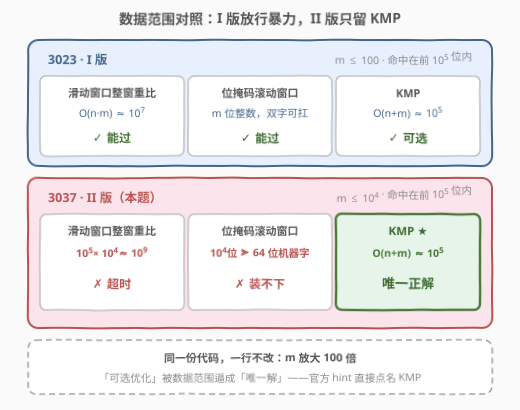
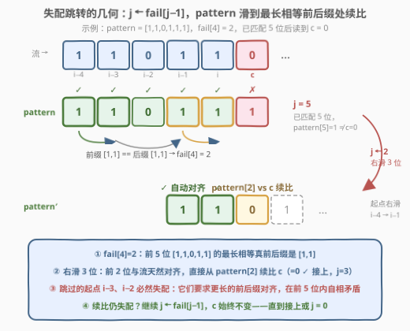
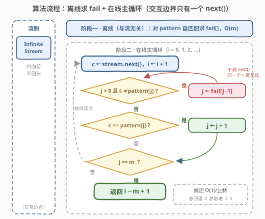
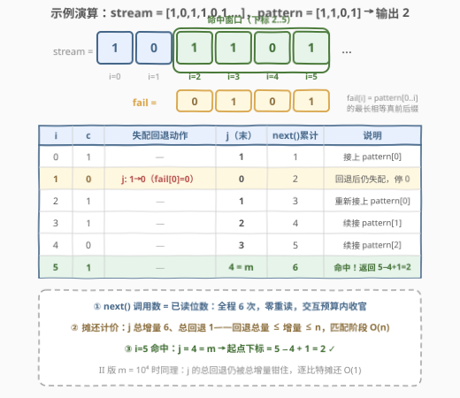

# LeetCode 在无限流中寻找模式II 题解

> ⚠️ 本题为 LeetCode **付费题**。题意与约束取自官方题面的公开镜像并已与官方样例核对，算法与示例输出均用自洽代码验证；如与官方题面有出入，请以官方为准。

## 1. 题目概述

- **标题 / 题号**：在无限流中寻找模式 II（#3037，hard）
- **链接**：https://leetcode.cn/problems/find-pattern-in-infinite-stream-ii/
- **难度**：困难
- **标签**：数组、交互、字符串匹配、滑动窗口、哈希函数、滚动哈希

**题意**：给定一个二进制数组 `pattern`（只含 0/1）和一个 `InfiniteStream` 类的对象 `stream`，表示一条**下标从 0 开始的二进制位无限流**。

`InfiniteStream` 的接口定义（以 Java 为例）：

```java
class InfiniteStream {
    public InfiniteStream(int[] bits);  // 用一段比特序列初始化，流由它无限循环生成
    public int next();                  // 从流中读取下一个二进制位（0 或 1）并返回
}
```

返回模式在流中**第一次出现**的**开始下标** $i$，即对所有 $0 \le j < m$（$m$ = pattern 长度）都满足：

$$\text{stream}[i+j] = \text{pattern}[j]$$

**示例 1**：

```text
输入：stream = [1,1,1,0,1,1,1,...]，pattern = [0,1]
输出：3
解释：模式 [0,1] 第一次出现在 [1,1,1,0,1,...] 的高亮部分，从下标 3 开始。
```

**示例 2**：

```text
输入：stream = [0,0,0,0,...]，pattern = [0]
输出：0
解释：下标 0 处即命中。
```

**示例 3**：

```text
输入：stream = [1,0,1,1,0,1,1,0,1,...]，pattern = [1,1,0,1]
输出：2
解释：模式 [1,1,0,1] 第一次出现在 [1,0,1,1,0,1,...] 的高亮部分，从下标 2 开始。
```

**约束**：

- $1 \le \text{pattern.length} \le 10^4$
- `pattern` 只包含 0 或 1
- `stream` 只包含 0 或 1
- 生成的输入保证：模式的开始下标在流的**前 $10^5$ 个二进制位**中

> 💡 **读题关键**：与姊妹题 [3023. 在无限流中寻找模式 I](https://leetcode.cn/problems/find-pattern-in-infinite-stream-i/) 逐字对比，**题面唯一的变化是约束**——$m$ 从 $\le 100$ 放大到 $\le 10^4$（×100）。这是一道**交互题**：流只能通过 `next()` 向前读，不能随机访问、不能回头，算法必须**在线**。数据范围这一步放大，把 I 版所有「靠整窗重比蒙混过关」的做法全部逼死，只剩线性在线算法——官方 hint 只有一句：*Use the KMP algorithm.*

## 2. 解题思路

### 2.1 暴力思路：为什么它在 II 版必死



先盘点 I 版（3023，$m \le 100$）能过的三种做法，再代入 II 版的规模做乘法（$n \le 10^5 + m \approx 1.1 \times 10^5$ 为命中时已读位数）：

| 做法 | 单步代价 | I 版（$m \le 100$） | II 版（$m \le 10^4$） |
|------|----------|--------------------|----------------------|
| 滑动窗口整窗重比 | $O(m)$ / 比特 | $10^7$ ✓ 能过 | $10^9$ ✗ 超时 |
| 位掩码滚动窗口 | $O(m/64)$ / 比特 | 双字可扛 ✓ | $10^4$ 位 $\gg$ 64 位机器字 ✗ |
| KMP | $O(1)$ 摊还 / 比特 | $10^5$ ✓（可选） | $10^5$ ★ 唯一正解 |

关键心算：$10^5 \times 10^4 = 10^9$ 次逐位比较——Python 上百秒起步，C++ 也大概率卡死。位掩码窗口（把 $m$ 位窗口编码成整数直接判等，I 版的「无碰撞完美哈希」）也随 $m$ 越过机器字长而失效：$10^4$ 位超出 64 位字 156 倍，C++ 拆字比较退回 $O(m)$，Python 大整数每次左移截断成本 $O(m/64)$，总量 $O(nm/64) \approx 1.7 \times 10^8$ 字操作，常数吃满照样超时。

> ⚠️ **不能「回头重读」更堵死了旁门左道**：`next()` 只向前，任何「对齐失败就退回去重读」的方案在交互层面就不合法。结论：必须让**每读一个比特的摊还工作量为 $O(1)$**、匹配状态 $O(m)$——即线性字符串匹配。官方 hint 直接点名 KMP。

### 2.2 核心观察：KMP 是天生的流式算法



KMP 的匹配阶段对文本的**访问模式**是：从左到右、每个字符**恰好读一次**——这与 `next()` 的供给方式完美同构。整套算法的运行状态只有两个整数：

- $i$：当前读入的比特下标（**只增不减**，驱动 `next()`）；
- $j$：**已匹配的 pattern 前缀长度**（失配时沿 fail 回退，但**绝不触发重读**）。

每读到一个新比特 $c$，做三件事：

1. **失配回退**：当 $j > 0$ 且 $c \ne \text{pattern}[j]$ 时，$j \leftarrow \text{fail}[j-1]$，反复直到能接上或 $j = 0$；
2. **匹配推进**：若 $c = \text{pattern}[j]$，则 $j \leftarrow j + 1$；
3. **命中判定**：$j = m$ 时模式完整出现，起点即 $i - m + 1$。

失配数组 $\text{fail}[i]$ 定义为 pattern 前 $i+1$ 位的**最长相等真前后缀**长度，只用 pattern 自己就能预处理，与流无关。

> 💡 **为什么跳到 fail[j−1] 安全不漏**：失配时，已匹配的 $j$ 位恰好等于 pattern 前缀。下一个可能的起点必须满足「pattern 的某个前缀 == 这段的后缀」，最长者恰由 $\text{fail}[j-1]$ 给出；对齐更长必然在这 $j$ 位内自相矛盾，更短者被更长者覆盖。所以跳过中间起点（如概念图中的 $i-3$、$i-2$）既安全又不遗漏。**回退只挪 pattern、不挪读指针——$c$ 保持不变，反复与新对齐的 $\text{pattern}[j]$ 比较**，这正是「零重读」的机制。

### 2.3 算法流程图



分两阶段：

**阶段一（离线，读流之前完成）**：对 pattern 自匹配求 `fail` 数组，$O(m)$。

**阶段二（在线主循环）**：`i = 0, 1, 2, …` 循环：

1. `c ← stream.next()`（**唯一交互点**，每轮至多 1 次）；
2. `while j > 0 且 c ≠ pattern[j]`：`j ← fail[j−1]`（**不调 next()**）；
3. `if c == pattern[j]`：`j ← j + 1`；
4. `if j == m`：**返回 `i − m + 1`**；否则读下一个比特。

> 💡 **摊还分析**：$j$ 每轮至多 +1，全程总增量 $\le n$；而 $j$ 恒非负，故内层 while 的**总回退量 ≤ 总增量 ≤ n**。即使把 while 展开计价，匹配阶段仍是 $O(n)$——这就是 KMP 对暴力 $O(nm)$ 的胜利，与 $m$ 的大小无关，II 版的 $10^4$ 丝毫撼动不了它。

### 2.4 示例演算



以示例 3 演算。先离线求 fail，pattern = `[1,1,0,1]`：

| i | pattern[i] | 求 fail[i] 的过程 | fail[i] |
|---|-----------|------------------|---------|
| 0 | 1 | 单字符无真前后缀 | 0 |
| 1 | 1 | 前缀 `[1]` == 后缀 `[1]` | 1 |
| 2 | 0 | 无相等真前后缀 | 0 |
| 3 | 1 | 前缀 `[1]` == 后缀 `[1]` | 1 |

即 fail = `[0,1,0,1]`。然后流式匹配，逐步追踪 $j$ 与交互代价：

| i | c | 失配回退动作 | j（本轮末） | next() 累计 | 说明 |
|---|---|--------------|------------|-------------|------|
| 0 | 1 | — | 1 | 1 | 1 == pattern[0]，接上 |
| 1 | 0 | j: 1→0（fail[0]=0） | 0 | 2 | 回退后仍失配，停在 0 |
| 2 | 1 | — | 1 | 3 | 重新接上 pattern[0] |
| 3 | 1 | — | 2 | 4 | 续接 pattern[1] |
| 4 | 0 | — | 3 | 5 | 续接 pattern[2] |
| 5 | 1 | — | **4 = m** | 6 | 命中！返回 5 − 4 + 1 = **2** ✓ |

两个观察直击 II 版题眼：

- **next() 调用数 = 已读位数**：全程 6 次、零重读。任何算法都必须至少读到命中末位（下标 5）才能确认答案，所以 $n$ 次 `next()` 已经是**交互次数下界**——KMP 同时做到了时间与交互双最优。
- **i=1 的失配**：$j$ 从 1 回退到 0，读指针 $i$ 纹丝不动。朴素滑窗此刻要把新窗口 4 位重比一遍；$m = 10^4$ 时就是每比特 1 万次重比——差距被数据范围放大了 100 倍。

## 3. 参考代码

### C++（KMP 流式匹配）

```cpp
/**
 * class InfiniteStream {
 * public:
 *     InfiniteStream(vector<int>& bits);
 *     int next();
 * };
 */
class Solution {
  public:
    int findPattern(InfiniteStream* stream, vector<int>& pattern) {
        int m = pattern.size();

        // 阶段一（离线）：预处理失配数组，O(m)，与流无关
        vector<int> fail(m, 0);
        for (int i = 1; i < m; ++i) {
            int j = fail[i - 1];
            while (j > 0 && pattern[i] != pattern[j]) j = fail[j - 1];
            if (pattern[i] == pattern[j]) ++j;
            fail[i] = j;
        }

        // 阶段二（在线）：j = 已匹配的 pattern 前缀长度
        int j = 0;
        for (int i = 0;; ++i) {               // i = 当前读入比特的下标
            int c = stream->next();           // 唯一交互点，每轮至多 1 次
            while (j > 0 && c != pattern[j]) j = fail[j - 1];   // 回退不重读
            if (c == pattern[j]) ++j;
            if (j == m) return i - m + 1;     // 起点 = 命中下标 − 模式长 + 1
        }
        return -1;                            // 题目保证存在，不会到达
    }
};
```

### Python（KMP 流式匹配）

```python
class Solution:
    def findPattern(self, stream: 'InfiniteStream', pattern: List[int]) -> int:
        m = len(pattern)

        # 阶段一（离线）：预处理失配数组
        fail = [0] * m
        for i in range(1, m):
            j = fail[i - 1]
            while j and pattern[i] != pattern[j]:
                j = fail[j - 1]
            if pattern[i] == pattern[j]:
                j += 1
            fail[i] = j

        # 阶段二（在线）：流式匹配
        j = 0                                  # 已匹配的 pattern 前缀长度
        i = 0                                  # 当前读入比特的下标
        while True:
            c = stream.next()                  # 唯一交互点
            while j and c != pattern[j]:       # 失配：前缀自对齐，c 不重读
                j = fail[j - 1]
            if c == pattern[j]:
                j += 1
            if j == m:
                return i - m + 1
            i += 1
```

> 💡 **与 3023 的代码逐行相同**——这正是 I/II 双题的考点本身：同一份实现，在 $m \le 100$ 时是「可选优化」，在 $m \le 10^4$ 时是「唯一生路」。面试中遇到本题，先复述约束做数量级心算（$10^5 \times 10^4 = 10^9$），再引出 KMP 的在线性质，故事线就完整了。

## 4. 复杂度分析

| 维度 | 复杂度 | 说明 |
|------|--------|------|
| 时间复杂度 | $O(n + m)$ | 预处理 fail $O(m)$ + 流式匹配摊还 $O(n)$（$j$ 的总回退量 ≤ 总增量 ≤ $n$）；$n \le 10^5 + m - 1$ 为命中时已读位数 |
| 空间复杂度 | $O(m)$ | 失配数组 fail；匹配状态仅 $i, j, c$ 三个变量，$O(1)$ |
| 交互代价 | $n$ 次 `next()` | 每个比特只读一次、绝不回头；任何算法必须读到命中末位才能确认，$n$ 次即交互下界 |

对照：滑动窗口 $O(n \cdot m) \approx 10^9$ ✗；位掩码窗口 $O(n \cdot m / 64) \approx 1.7 \times 10^8$ 字操作 ✗；KMP $O(n + m) \approx 1.1 \times 10^5$ ✓。

## 5. 扩展：滚动哈希与「周期流」的两个追问

**追问一：标签里的 Rolling Hash 能用吗？** 能，但要接受「期望」而非「确定」：把 $m$ 位窗口哈希成一对大整数（双哈希防碰撞），每个新比特 $O(1)$ 更新：

```python
class Solution:
    def findPattern(self, stream: 'InfiniteStream', pattern: List[int]) -> int:
        m = len(pattern)
        MOD1, MOD2, B = 1_000_000_007, 998_244_353, 131

        t1 = t2 = 0
        for c in pattern:                       # pattern 的双哈希
            t1, t2 = (t1 * B + c) % MOD1, (t2 * B + c) % MOD2

        p1, p2 = pow(B, m, MOD1), pow(B, m, MOD2)
        h1 = h2 = 0
        win = deque()
        i = 0
        while True:
            c = stream.next()
            win.append(c)
            h1, h2 = (h1 * B + c) % MOD1, (h2 * B + c) % MOD2
            if len(win) > m:                    # 滚出最老一位
                old = win.popleft()
                h1 = (h1 - old * p1) % MOD1
                h2 = (h2 - old * p2) % MOD2
            if len(win) == m and (h1, h2) == (t1, t2):
                return i - m + 1                # 双哈希碰撞概率可忽略
            i += 1
```

期望 $O(n + m)$。但要清楚它的两个软肋：双哈希仍有 $10^{-18}$ 量级的碰撞概率（判题是确定性的，极端构造数据可攻击）；若哈希命中后再逐位验证，最坏退化回 $O(n \cdot m)$。**确定性 + 最坏线性 + 交互最优**，三者只有 KMP 全占——这也是官方 hint 点名 KMP 而非哈希的原因。

**追问二：流其实是周期的，能利用吗？** 能。流由 `bits`（长 $L$）无限循环生成，于是「pattern 在流中出现」等价于「pattern 是 `bits` 无限拼接的子串」。经典结论（[686. 重复叠加字符串匹配](https://leetcode.cn/problems/repeated-string-match/)）：只需拼接

$$k = \left\lceil \frac{m + L - 1}{L} \right\rceil \text{ 份}$$

再对这份 $kL \le m + 2L$ 长的有限文本跑**一次离线 KMP**，$O(kL + m)$ 内出答案——如果接口能直接给 `bits` 数组，根本不必逐位交互。本题交互接口不暴露 `bits`，逐位 KMP 已达交互下界，周期性无从利用；但「周期流 ⟹ 有限拼接离线匹配」是面试里漂亮的加分追问。

## 6. 面试要点

1. **I/II 双题代码一字不改，难度为何差一档？**

   - 数据范围是题目的一部分：$m$ ×100 后，暴力从 $10^7$ 涨到 $10^9$ 次比较直接超时。拿到题先做数量级心算再选算法——本题考的就是这个判断。

2. **KMP 凭什么「天生」支持流式输入？**

   - 匹配阶段对文本的访问是**单向、单遍**的：状态只有 $(i, j)$，每个比特读一次、用一次。fail 只依赖 pattern 可离线预处理。相比之下，Z 函数要整串、后缀数组要随机访问，都做不到在线。

3. **失配跳到 fail[j−1]，为什么不会跳过头漏掉解？**

   - 失配时已匹配的 $j$ 位等于 pattern 前缀；下一个可行起点必须满足「pattern 某前缀 == 这段的后缀」，最长者恰为 $\text{fail}[j-1]$。对齐更长必在这 $j$ 位内自相矛盾，更短者被更长的覆盖——跳最长的，安全且不漏。

4. **内层 while 反复回退，总时间为什么还是 O(n + m)？**

   - 摊还/势能论证：$j$ 每轮至多 +1，总增量 $\le n$；$j \ge 0$，while 的总回退量 $\le$ 总增量。内层循环总执行次数 $O(n)$，与 $m$ 的大小无关——II 版 $m = 10^4$ 也撼动不了。

5. **滚动哈希和 KMP 怎么选？**

   - 滚动哈希期望 $O(n+m)$、实现短，但有碰撞概率（双哈希可压到 $10^{-18}$ 量级），命中若逐位验证最坏退化 $O(nm)$。交互判题是确定性的、且要交互次数最优——KMP 确定性线性 + $n$ 次 `next()` 达下界，是本题的标准答案。

## 同类练习题

| # | 题目 | 与本题的关联 |
|---|------|-------------|
| 3023 | [在无限流中寻找模式 I](https://leetcode.cn/problems/find-pattern-in-infinite-stream-i/)（[题解](../3001-3100/3023_在无限流中寻找模式I.md)） | 本题姊妹篇（中等），$m \le 100$ 暴力可过，同一份 KMP 代码两题通吃——先做它再回看本文的复杂度分析 |
| 28 | [找出字符串中第一个匹配项的下标](https://leetcode.cn/problems/find-the-index-of-the-first-occurrence-in-a-string/)（[题解](../0001-0100/28_找出字符串中第一个匹配项的下标.md)） | KMP 母题 `strStr`，完整字符串版，本题为它的「无限流」形态 |
| 3036 | [匹配模式数组的子数组数目 II](https://leetcode.cn/problems/number-of-subarrays-that-match-a-pattern-ii/)（[题解](../3001-3100/3036_匹配模式数组的子数组数目II.md)） | 同期「I 放行暴力 / II 放大逼出 KMP」双题的计数版，同一个套路两种考法 |
| 1392 | [最长快乐前缀](https://leetcode.cn/problems/longest-happy-prefix/)（[题解](../1301-1400/1392_最长快乐前缀.md)） | 失配数组（前缀函数）的单独考察——求整串最长相等真前后缀 |
| 686 | [重复叠加字符串匹配](https://leetcode.cn/problems/repeated-string-match/) | 本文扩展节「周期流 ⟹ 有限拼接离线匹配」结论的出处，$\lceil (m+L-1)/L \rceil$ 份拼接的由来 |
