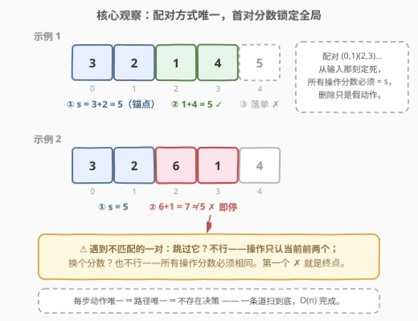
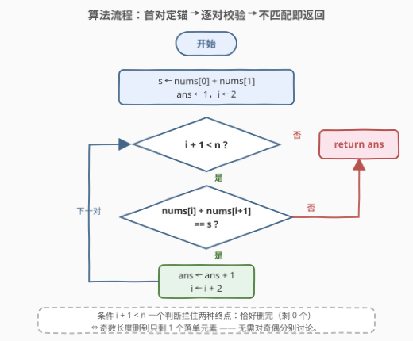
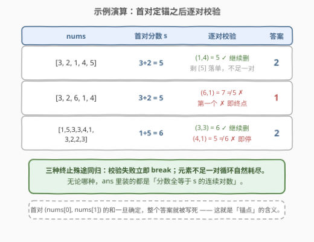

# LeetCode 相同分数的最大操作数目 I 题解

## 1. 题目概述

- **标题 / 题号**：相同分数的最大操作数目 I（#3038，easy）
- **链接**：https://leetcode.cn/problems/maximum-number-of-operations-with-the-same-score-i/
- **难度**：简单
- **标签**：数组、模拟

**题意**：给你一个整数数组 `nums`，只要 `nums` **至少包含 2 个元素**，你就可以执行以下操作：

- 选择 `nums` 中的**前两个**元素并将它们删除。

一次操作的**分数**是被删除两个元素之和。

在确保**所有操作分数相同**的前提下，求**最多**能进行多少次操作。

**示例 1**：

```text
输入：nums = [3,2,1,4,5]
输出：2
解释：
- 删除前两个元素，分数为 3 + 2 = 5，nums = [1,4,5]。
- 删除前两个元素，分数为 1 + 4 = 5，nums = [5]。
只剩 1 个元素，无法继续操作。
```

**示例 2**：

```text
输入：nums = [3,2,6,1,4]
输出：1
解释：
- 删除前两个元素，分数为 3 + 2 = 5，nums = [6,1,4]。
下一次操作的分数为 6 + 1 = 7 ≠ 5，无法继续操作。
```

**补充示例 3**（覆盖「中途断供」分支）：

```text
输入：nums = [1,5,3,3,4,1,3,2,2,3]
输出：2
解释：首对分数 1 + 5 = 6；第二对 3 + 3 = 6 ✓；
第三对 4 + 1 = 5 ≠ 6，必须停止，答案是 2。
```

**约束**：

- $2 \le \text{nums.length} \le 100$
- $1 \le \text{nums}[i] \le 1000$

> 💡 读题关键：三个词决定本题难度——①「**前两个**」：操作对象固定，没有挑选余地；②「**所有操作分数相同**」：第一次分数一旦确定，后续每一对都被它卡死；③「**最多**」：能继续就继续，直到对子分数不同或元素不足两个。三件事合起来意味着：根本不存在分支，一条道走到黑即可。

## 2. 解题思路

### 2.1 暴力思路：老老实实删除，老老实实比较

最直接的模拟：循环检查 `nums` 长度是否 ≥ 2，每次取出前两个元素求和，与第一次的分数比较，相等则计数并**真的把它们删掉**：

```python
s = nums[0] + nums[1]      # 第一次操作必然发生（n ≥ 2）
nums = nums[2:]            # 切片生成新数组
ans = 1
while len(nums) >= 2:
    if nums[0] + nums[1] != s:
        break
    ans += 1
    nums = nums[2:]        # 每轮复制整个后缀
```

正确，但每轮 `nums[2:]` 都要复制一份长度递减的后缀，总代价 $O(n^2)$；C++ 里对应 `vector::erase(begin, begin+2)`，同样是 $O(n)$ 的整体搬移。

另一种更隐蔽的绕路：把「最多」二字读成了**可以挑选怎么删**，于是写回溯 / DP 枚举删除方案。这是读题失误——操作**只能**作用于当前前两个元素，每一步没有任何选择权，搜索空间里只有一条路径，DP 无从谈起。

### 2.2 核心观察：配对唯一，首对锁分



三个观察把问题压成一次线性扫描：

1. **配对唯一**：每一步只能删「当前前两个」，删掉一对后下一对恰好顶上来。等价于原数组的固定切分——$(0,1), (2,3), (4,5), \cdots$，谁和谁配对**从输入那一刻就定死了**；
2. **首对锁分**：约束 $n \ge 2$ 保证第一次操作必然发生，它的分数 $s = \text{nums}[0] + \text{nums}[1]$ 就是全局锚点——后续每一对的分数都必须等于 $s$；
3. **不匹配即断**：一旦某一对 $\text{nums}[i] + \text{nums}[i+1] \ne s$，既不能**跳过**这对（跳过等于凭空少删两个元素，而操作只能从队首开始），也不能**改分数**（所有操作分数必须相同），只能立即终止。

于是「删除」完全不必发生——下标 $i$ 从 $2$ 开始每次前进 $2$，边走边比较即可：

$$\text{ans} = 1 + \max \{\, k : \text{nums}[2j] + \text{nums}[2j+1] = s,\ \forall\, 1 \le j \le k \,\}$$

> 💡 判断一道「模拟题」该用多重的武器，只看一件事：**当前局面有没有多个合法动作可选**。本题每步唯一动作 → 一条路径 → 直接扫；一旦动作有分支（如系列进阶版 3040 允许删前两个**或**后两个），才轮到搜索 / DP 登场。

### 2.3 算法流程：双下标步进扫描



1. 锚定分数：$s \leftarrow \text{nums}[0] + \text{nums}[1]$，答案初始化 `ans = 1`（第一次操作白送）；
2. 下标 `i = 2` 起步，循环条件 `i + 1 < n`——同时挡住两种终止情形：恰好剩 0 个元素、奇数长度剩 1 个落单元素；
3. 校验当前对：$\text{nums}[i] + \text{nums}[i+1] = s$ 则 `ans += 1` 且 `i += 2` 继续下一对；
4. 校验失败立即 `return ans`（跳过与改分都被题意封死）；
5. 循环自然耗尽（元素不足一对）同样返回 `ans`。

### 2.4 示例演算



| 输入 | 首对分数 $s$ | 逐对校验 | 答案 |
|------|--------------|----------|------|
| `[3,2,1,4,5]` | $3+2=5$ | $(1,4)=5$ ✓；剩 $[5]$ 落单，不足一对 | $2$ |
| `[3,2,6,1,4]` | $3+2=5$ | $(6,1)=7 \ne 5$ ✗，立即停止 | $1$ |
| `[1,5,3,3,4,1,3,2,2,3]` | $1+5=6$ | $(3,3)=6$ ✓；$(4,1)=5 \ne 6$ ✗ | $2$ |

## 3. 参考代码

### C++（首对定锚 + 步进 2 扫描）

```cpp
class Solution {
  public:
    int maxOperations(vector<int>& nums) {
        int n = nums.size();
        int s = nums[0] + nums[1];   // 首对分数：全局锚点（n ≥ 2 保证必发生）
        int ans = 1;
        for (int i = 2; i + 1 < n; i += 2) {
            if (nums[i] + nums[i + 1] != s) break;  // 不能跳过、不能改分 → 立即停
            ans++;
        }
        return ans;
    }
};
```

### Python（同一骨架）

```python
class Solution:
    def maxOperations(self, nums: List[int]) -> int:
        s = nums[0] + nums[1]                 # 首对分数：全局锚点
        ans = 1
        for i in range(2, len(nums) - 1, 2):  # i + 1 < n：落单/耗尽自然出界
            if nums[i] + nums[i + 1] != s:
                break                         # 一旦不等，后续再无机会
            ans += 1
        return ans
```

> 💡 函数式彩蛋：`itertools.takewhile` 的语义恰好与题意同构——「一旦不满足立即停，后面哪怕再有相等也不看」：`return 1 + sum(takewhile(lambda t: t, (nums[i] + nums[i+1] == s for i in range(2, len(nums) - 1, 2))))`。面试写循环版，一行版用来展示对工具语义的理解。

## 4. 复杂度分析

| 维度 | 复杂度 | 说明 |
|------|--------|------|
| 时间复杂度 | $O(n)$ | 每对元素只被求和、比较一次，均为 $O(1)$；不匹配即提前退出，最好情况更快 |
| 空间复杂度 | $O(1)$ | 只用 `s` / `ans` / `i` 三个变量，原地扫描，无需任何复制或删除 |

## 5. 扩展：当操作有了分支——3040 与区间记忆化

本题之所以是纯模拟，全靠「只能删前两个」封死了选择权。系列进阶版 [3040. 相同分数的最大操作数目 II](https://leetcode.cn/problems/maximum-number-of-operations-with-the-same-score-ii/) 把规则放宽为：**删除前两个或后两个**（中间不行）。一步两个合法动作，路径不再唯一：

- 局面由「当前剩余区间 $[l, r]$」完全刻画；
- 每步两种转移：删首对（分数 $\text{nums}[l] + \text{nums}[l+1]$）或删尾对（分数 $\text{nums}[r-1] + \text{nums}[r]$）；
- 每个局面的最优值只依赖子区间 → **记忆化搜索 / 区间 DP**，$O(n^2)$ 个状态各 $O(1)$ 转移。

两个题摆在一起恰好是一条完整的学习路径：**无分支 → 线性扫描；有分支 → 记忆化搜索**。判断分支的存在性，就是判断该用「模拟」还是「搜索」的分水岭。

## 6. 面试要点

1. **这题为什么不需要 DP 或贪心？关键判断依据是什么？**

   - DP / 贪心服务于「当前有多条路可走」的决策问题。本题操作对象被题面钉死为**当前前两个元素**，每一步动作唯一，从初始到终止只有一条路径——没有决策就没有最优子结构可以利用，一次线性扫描即是全部。

2. **第一次操作的分数为什么可以直接当「锚点」？会不会存在不做第一次操作更优的情况？**

   - 不会。题意要求在「所有操作分数相同」下**最大化次数**：若一次操作都不做，答案是 0；而 $n \ge 2$ 保证第一次操作必然可执行，答案至少为 1。且后续配对方式唯一，第一次分数 $s$ 必然约束所有后续操作，不存在换一个 $s$ 更优的可能——首对怎么配不由你选。

3. **遇到一对分数不匹配时，能否跳过它继续看后面的对？**

   - 不能。操作只能作用于**当前数组的前两个元素**，「跳过一对」意味着不通过操作就移走两个元素，题目没有这个动作；而带着不匹配的分数继续操作又违反「所有分数相同」。所以第一个不匹配的对就是终点，`break` 是唯一正确动作。

4. **循环条件 `i + 1 < n` 在处理边界时 cover 了哪几种情况？**

   - 两种「元素不足一对」的终止：偶数长度恰好删完（剩 0 个），奇数长度删到只剩最后 1 个落单元素。两者都表现为「下一对的第二个下标越界」，一个条件同时拦住，无需对奇偶分别讨论。

5. **如果数组长度 $n \le 10^6$，你的解法需要改动吗？反过来，$n \le 100$ 时写 $O(n^2)$ 的删除版有问题吗？**

   - 本题解已是 $O(n)$ / $O(1)$，百万级照跑不误，无需改动；$n \le 100$ 时删除版（每轮 `erase` / 切片搬移）也能 AC，但面试官真正想听的是你能否识别「删除是假动作、下标步进是真动作」——识别不出这层等价性，同样的冗余模式会原样带进大数据量的题里。

## 同类练习题

| # | 题目 | 与本题的关联 |
|---|------|-------------|
| 3040 | [相同分数的最大操作数目 II](https://leetcode.cn/problems/maximum-number-of-operations-with-the-same-score-ii/) | 同系列进阶，删前两个或后两个引入分支，练「模拟 → 记忆化搜索」的升级判断 |
| 2789 | [合并后数组中的最大元素](https://leetcode.cn/problems/largest-element-in-an-array-after-merge-operations/) | 同样一次遍历的强制模拟（从右往左合并），练「无分支 → 直接扫」的识别 |
| 561 | [数组拆分](https://leetcode.cn/problems/array-partition/) | 固定两两配对下的最值问题，对照本题「配对不由你选」与它「配对方式自选」的差异 |
| 1827 | [最少操作使数组递增](https://leetcode.cn/problems/minimum-operations-to-make-the-array-increasing/) | 单指针一次遍历模拟，巩固「读清动作唯一性再选武器」的习惯 |
