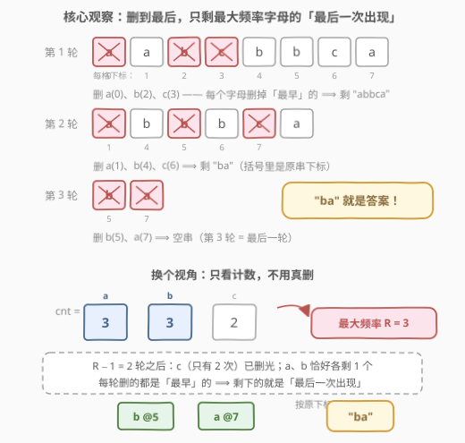
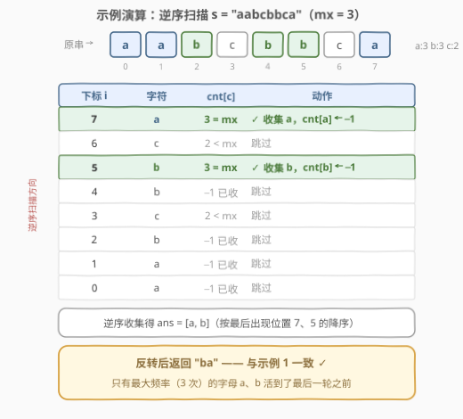

# LeetCode 进行操作使字符串为空 题解

## 1. 题目概述

- **标题 / 题号**：进行操作使字符串为空（#3039，medium）
- **链接**：https://leetcode.cn/problems/apply-operations-to-make-string-empty/
- **难度**：中等
- **标签**：数组、哈希表、计数、字符串

**题意**：给你一个字符串 `s`。请你进行以下操作直到 `s` 为 **空**：

- 每次操作**依次**遍历 `'a'` 到 `'z'`，如果当前字符出现在 `s` 中，那么删除出现位置**最早**的该字符（如果存在的话）。

也就是说：**每一轮**操作，按字母表顺序把 26 个字母各检查一遍，每个「仍在 `s` 中」的字母都会被删掉**恰好一个**（它当前最早出现的那个位置）。请你返回进行**最后一次**操作**之前**的字符串 `s`。

**示例 1**：

```text
输入：s = "aabcbbca"
输出："ba"
解释：
第 1 轮：删 a(下标0)、b(下标2)、c(下标3) → s = "abbca"
第 2 轮：删 a(下标1)、b(下标4)、c(下标6) → s = "ba"
第 3 轮：删 b、a → s = ""（最后一轮）
最后一次操作之前，s = "ba"。
```

**示例 2**：

```text
输入：s = "abcd"
输出："abcd"
解释：四个字母各出现 1 次，第 1 轮就把它们全删光，
最后一次（第 1 轮）操作之前 s 就是原串 "abcd"。
```

**约束**：

- $1 \le \text{s.length} \le 5 \times 10^5$
- `s` 只包含小写英文字母。

> ⚠️ 读题陷阱：一轮操作**不是**只删一个字符，而是「`a` 到 `z` 各删一个（如果存在）」，一轮最多删 26 个；返回的是**最后一次操作之前**的状态，即倒数第二个非空状态。

## 2. 解题思路

### 2.1 暴力思路：直接模拟

最直白的做法是把每轮操作老老实实模拟出来：每轮按 `'a'`..`'z'` 顺序，对每个还存在的字母找到它当前最早出现的位置并删除，直到 `s` 为空，期间记录倒数第二个状态。

问题在于**轮数**：设某字母出现 $k$ 次，它需要恰好 $k$ 轮才能删完，所以总轮数 $= \max_c \text{cnt}[c]$。最坏情况（比如 `s = "aaaa...a"`）总轮数达到 $n = 5\times10^5$，而每轮还要在长度约 $n$ 的串里找最早出现位置，朴素模拟总代价 $O(n \cdot \max \text{cnt}) \sim O(n^2) = 2.5\times10^{11}$，必然超时。即便用「每个字母一个位置队列」优化到 $O(n + 26\cdot\max\text{cnt})$，也是绕了远路——本题根本不需要真的删。

### 2.2 核心观察：逆向拆解「谁活到了最后一轮」



正向模拟太贵，那就**逆向思考**：不看"怎么删"，直接算"最后一轮之前还剩谁"。

- **轮数固定**：每一轮，每个仍存在的字母恰好被删一个。字母 $c$ 出现 $\text{cnt}[c]$ 次，就要 $\text{cnt}[c]$ 轮才删完，所以整个字符串被删空需要恰好

$$R = \max_{c} \text{cnt}[c]$$

轮（由出现最多的字母"拖堂"决定）。

- **最后一轮之前的快照**：即进行了 $R-1$ 轮之后。此时字母 $c$ 剩下 $\text{cnt}[c] - (R-1)$ 个：

  - 若 $\text{cnt}[c] < R$：剩余 $\le 0$，早已删光，**一个不剩**；
  - 若 $\text{cnt}[c] = R$：恰好**剩 1 个**。

- **剩下的那一个是哪个**？每轮删的都是该字母**当前最早**的出现位置，删了 $R-1$ 次后剩下的必然是它的**最后一次出现**。

> 💡 **一句话结论**：答案是「所有出现次数等于最大频率 $R$ 的字母，各取其最后一次出现，按原字符串中的先后顺序拼接」。示例 1 中 `a:3, b:3, c:2`，最大频率 3，只有 `a`、`b` 幸存，各自的最后出现分别在下标 7 和 5，按原顺序拼出 `"ba"`——与模拟结果完全一致。题目 hints 也点破了这一点：*Before the last operation, only the most frequent characters will remain.*

### 2.3 算法流程：计数 + 逆序扫描收集


把结论翻译成算法只需两趟扫描：

1. **第一趟（正向）**：统计每个字母的出现次数 `cnt[26]`，求最大频率 `mx = max(cnt)`；
2. **第二趟（逆向）**：从右往左扫描 `s`。逆序扫描时，**第一次**遇到某个字符，遇到的正是它的**最后一次出现**——若此时 `cnt[c] == mx`，就把 `c` 收集进答案，并把 `cnt[c]` 置为 `-1`（哨兵值，标记"已收集"，后续再遇到直接跳过）；
3. **反转**：逆序收集到的序列按"最后出现位置"降序排列，反转后即为原顺序，返回。

> ⚠️ 逆序扫描的两个易错点：一是**去重**——同一字母可能逆序遇到多次，只有第一次（最后出现）该收，用置 `-1` 的办法 $O(1)$ 判重（等价于一个 `seen` 集合）；二是**别忘反转**——收集顺序与目标顺序恰好相反。

### 2.4 示例演算



以 `s = "aabcbbca"`（下标 0..7）走一遍流程。计数得 `a:3, b:3, c:2`，`mx = 3`，幸存候选是 `a`、`b`。逆序扫描：

| 步骤 | 下标 i | 字符 | cnt[c] | 动作 |
|------|--------|------|--------|------|
| 1 | 7 | a | 3 == mx | ✅ 收集 `a`，cnt[a] 置 −1 |
| 2 | 6 | c | 2 ≠ mx | 跳过 |
| 3 | 5 | b | 3 == mx | ✅ 收集 `b`，cnt[b] 置 −1 |
| 4 | 4 | b | −1（已收） | 跳过 |
| 5 | 3 | c | 2 ≠ mx | 跳过 |
| 6 | 2 | b | −1（已收） | 跳过 |
| 7 | 1 | a | −1（已收） | 跳过 |
| 8 | 0 | a | −1（已收） | 跳过 |

收集序列为 `["a", "b"]`（按最后出现位置 7、5 降序），反转得 `"ba"`，与示例 1 一致。

## 3. 参考代码

### C++（值域数组 + 逆序收集）

```cpp
class Solution {
  public:
    string lastNonEmptyString(string s) {
        int cnt[26] = {0};
        for (char c : s) ++cnt[c - 'a'];          // 第一趟：计数
        int mx = *max_element(cnt, cnt + 26);      // 最大频率 = 总轮数

        string ans;
        for (int i = (int)s.size() - 1; i >= 0; --i) {
            int c = s[i] - 'a';
            if (cnt[c] == mx) {                    // mx 频率字母的最后一次出现
                ans.push_back(s[i]);
                cnt[c] = -1;                       // 哨兵：标记已收集，防重复
            }
        }
        reverse(ans.begin(), ans.end());           // 逆序收集 → 原顺序
        return ans;
    }
};
```

### Python（Counter + reversed）

```python
class Solution:
    def lastNonEmptyString(self, s: str) -> str:
        cnt = Counter(s)
        mx = max(cnt.values())                     # 最大频率 = 总轮数

        ans = []
        for c in reversed(s):                      # 逆序：首次遇到即最后出现
            if cnt[c] == mx:
                ans.append(c)
                cnt[c] = -1                        # 哨兵：标记已收集
        return ''.join(reversed(ans))
```

正向替代写法（记录最后位置 + 按位置排序，思路等价、更贴近定义）：

```python
class Solution:
    def lastNonEmptyString(self, s: str) -> str:
        cnt, last = Counter(s), {}
        for i, c in enumerate(s):
            last[c] = i                            # 每个字母的最后出现位置
        mx = max(cnt.values())
        winners = sorted((c for c in cnt if cnt[c] == mx), key=last.get)
        return ''.join(winners)
```

> 💡 三种写法复杂度同阶。逆序扫描版不需要 `last` 字典和排序，常数最小；正向版把"最后出现"显式落表，更贴近 2.2 的定义推导，适合当参考实现。

## 4. 复杂度分析

| 维度 | 复杂度 | 说明 |
|------|--------|------|
| 时间复杂度 | $O(n + \Sigma)$ | 正向计数 $O(n)$ + 求最大值/逆序扫描 $O(n + \Sigma)$，字母表 $\Sigma = 26$ 为常数，整体线性 |
| 空间复杂度 | $O(\Sigma)$ | 计数数组仅 26 个桶（不含输出串）；输出串长度 $\le 26$（每字母至多贡献 1 个字符） |

其中 $n = \text{len}(s)$。$n = 5\times10^5$ 下线性算法轻松通过；答案串长度有上界 26，也是一个佐证——最后一轮最多删 26 个字符。

## 5. 扩展：换一类删除规则的对称变体

本题的关键是"每轮删**最早**出现的"，所以幸存者是最后出现。两个有趣的对称变体：

- **变体一（删最晚）**：若每轮删除每个字母**最晚**出现的，则 $R-1$ 轮后幸存的是最大频率字母的**第一次出现**——算法完全对称，改为**正向**扫描收集首次出现即可。
- **变体二（按原顺序删）**：若每轮从头到尾删每个存在字母的第一个，和本题等价（"最早出现"就是当前第一个）。

更一般的心法是：**遇到"反复操作直到空/稳定"的过程题，先算操作轮数 $R$，再看 $R-1$ 轮后的快照**——往往能跳过整个模拟过程直接构造答案，与 [3007. 价值和小于等于 K 的最大数字](../3001-3100/3007_价值和小于等于K的最大数字.md) 的"二分跳过逐个枚举"同属"逆向构造"一族。

## 6. 面试要点

1. **为什么总轮数恰好是 $\max \text{cnt}$，不会更多或更少？**

   - 每轮每个仍存在的字母恰好被删一个，所以字母 $c$ 恰好需要 $\text{cnt}[c]$ 轮才删完；整个串删空的时刻由"最晚下课"的字母决定，即 $R = \max_c \text{cnt}[c]$。频率更低的字母提前离场，不会拖到第 $R$ 轮之后。

2. **为什么最后一轮之前恰好剩「最大频率字母的最后出现」？**

   - $R-1$ 轮后字母 $c$ 剩 $\text{cnt}[c] - (R-1)$ 个：$\text{cnt}[c] < R$ 时 $\le 0$ 已删光；$\text{cnt}[c] = R$ 时恰剩 1 个。又因为每轮删的都是**当前最早**的，连续删掉 $R-1$ 个"最早的"之后，剩下的必然是**最后一次出现**的那个。

3. **逆序扫描为什么天然找到"最后出现"？去重怎么处理？**

   - 从右往左扫，某个字母**第一次**被遇到的位置就是它在原串中的最后出现。用 `cnt[c] = -1` 把已收集字母的计数改成不可能等于 `mx` 的哨兵值，等价于 `seen` 集合判重，但复用计数数组、零额外空间。

4. **暴力模拟的复杂度瓶颈在哪？什么样的输入最卡？**

   - 轮数 $=\max\text{cnt}$ 最坏可达 $n$（全同字符，如 `"aaaa"`），朴素每轮扫描找最早出现是 $O(n)$，总计 $O(n^2)$，$n = 5\times10^5$ 时约 $2.5\times10^{11}$ 必超时。即使换成每字母位置队列（总删除次数恰为 $n$，轮数由 `max` 撑着）做到近线性，代码量和常数也远逊于"计数 + 直接构造"。

5. **答案串的长度上界是多少？为什么？**

   - 至多 26：幸存者从"最大频率字母"里各取一个，小写字母只有 26 种。这也是个快速自检——若实现输出长度超过 26 的"答案"，一定错了。

## 同类练习题

| # | 题目 | 与本题的关联 |
|---|------|-------------|
| 3005 | [最大频率元素计数](https://leetcode.cn/problems/count-elements-with-maximum-frequency/)（[题解](../3001-3100/3005_最大频率元素计数.md)） | 同样只关注"最大频率层"，本题的计数前哨站 |
| 451 | [根据字符出现频率排序](https://leetcode.cn/problems/sort-characters-by-frequency/)（[题解](../0401-0500/451_根据字符出现频率排序.md)） | 字符计数 + 按频率重排，计数家族经典 |
| 387 | [字符串中的第一个唯一字符](https://leetcode.cn/problems/first-unique-character-in-a-string/)（[题解](../0301-0400/387_字符串中的第一个唯一字符.md)） | 计数 + 定位特殊位置（首/末出现），与逆序收集最后出现同技巧 |
| 1647 | [字符频次唯一的最小删除次数](https://leetcode.cn/problems/minimum-deletions-to-make-character-frequencies-unique/)（[题解](../1601-1700/1647_字符频次唯一的最小删除次数.md)） | 对字符频率做删除操作的另一变体，频率思维进阶 |
| 767 | [重构字符串](https://leetcode.cn/problems/reorganize-string/)（[题解](../0701-0800/767_重构字符串.md)） | 按频率贪心放置，"最大频率决定可行性"的另一面 |
