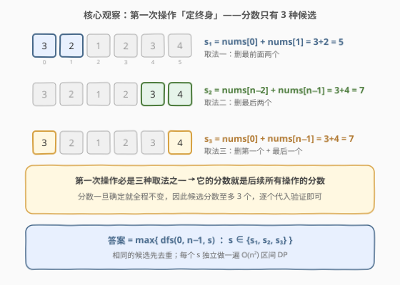
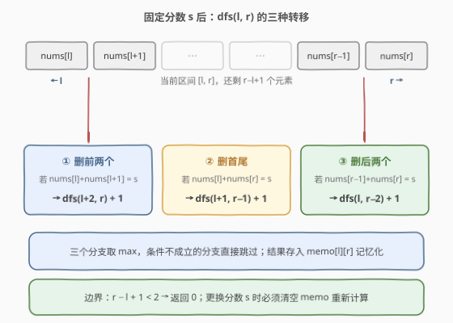
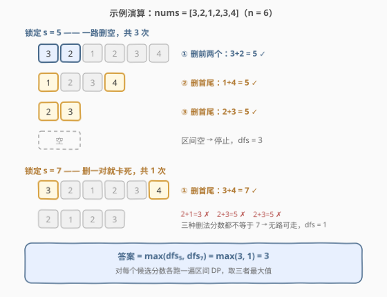

# 相同分数的最大操作数目II

- **题目名称**：相同分数的最大操作数目 II
- **链接**：[3040. 相同分数的最大操作数目 II](https://leetcode.cn/problems/maximum-number-of-operations-with-the-same-score-ii/)
- **难度**：中等
- **标签**：数组、动态规划、记忆化搜索、区间 DP

## 1. 题目概述

给你一个整数数组 `nums`（**至少**包含 2 个元素），每次可以执行以下三种操作中的**任意**一个：

1. 选择 `nums` 中**最前面两个**元素并删除它们；
2. 选择 `nums` 中**最后两个**元素并删除它们；
3. 选择 `nums` 中**第一个和最后一个**元素并删除它们。

一次操作的**分数**是被删除两个元素之和。在确保**所有操作分数相同**的前提下，求最多能进行多少次操作。

**示例 1**：

```text
输入：nums = [3,2,1,2,3,4]
输出：3
解释：
- 删前两个，分数 3+2=5，nums = [1,2,3,4]
- 删首尾，分数 1+4=5，nums = [2,3]
- 删首尾，分数 2+3=5，nums = []
三次操作分数均为 5，无法继续，返回 3。
```

**示例 2**：

```text
输入：nums = [3,2,6,1,4]
输出：2
解释：删前两个（3+2=5），再删后两个（1+4=5），至多 2 次。
```

**约束条件**：

- $2 \le \text{nums.length} \le 2000$
- $1 \le \text{nums}[i] \le 1000$

> 💡 本题是 [3038. 相同分数的最大操作数目 I](https://leetcode.cn/problems/maximum-number-of-operations-with-the-same-score-i/) 的进阶版：I 只能删前两个，一遍贪心扫描即可；II 三种删法任选，必须上**区间 DP**。

---

## 2. 解题思路

### 2.1 暴力思路

每一步有三种删法，直接递归枚举所有决策树是 $O(3^{n/2})$ 指数级，`n = 2000` 必然爆炸。

但注意到一个关键结构：**无论怎么删，剩下的元素永远是原数组的一段连续区间** `[l, r]`——删前两个区间变成 `[l+2, r]`，删后两个变成 `[l, r-2]`，删首尾变成 `[l+1, r-1]`。不同的决策路径会反复到达同一个区间，**重叠子问题**极多，天然适合记忆化 / 区间 DP。

### 2.2 核心观察：分数只有 3 种候选 + 固定分数的区间 DP



突破口在「**所有操作分数相同**」这个约束上：

> **第一次操作删掉的必然是 `(nums[0], nums[1])`、`(nums[n-2], nums[n-1])`、`(nums[0], nums[n-1])` 三者之一，它的分数就此锁定了后续每一次操作的分数。**

因此分数候选至多 3 个：

$$
s_1 = \text{nums}[0] + \text{nums}[1],\quad s_2 = \text{nums}[n-2] + \text{nums}[n-1],\quad s_3 = \text{nums}[0] + \text{nums}[n-1]
$$

**固定分数 $s$ 之后**，问题变成纯粹的区间 DP。定义：

> `dfs(l, r)` = 在区间 `nums[l..r]` 上、每次操作分数都恰好为 $s$ 时，能执行的最大操作次数。

三种转移，各自的前提是被删两数之和等于 $s$（不满足的分支直接跳过）：

$$
\text{dfs}(l, r) = \max\begin{cases}
\text{dfs}(l+2,\ r) + 1, & \text{nums}[l] + \text{nums}[l{+}1] = s \quad(\text{删前两个})\\[4pt]
\text{dfs}(l,\ r{-}2) + 1, & \text{nums}[r{-}1] + \text{nums}[r] = s \quad(\text{删后两个})\\[4pt]
\text{dfs}(l{+}1,\ r{-}1) + 1, & \text{nums}[l] + \text{nums}[r] = s \quad(\text{删首尾})
\end{cases}
$$

**边界**：$r - l + 1 < 2$（区间剩不足 2 个元素）时返回 $0$。

**最终答案**：$\max\limits_{s \in \{s_1, s_2, s_3\}} \text{dfs}(0, n-1, s)$。由 $n \ge 2$ 知第一次操作总能进行，答案至少为 1。

### 2.3 算法流程图



整体流程：

1. 计算三个候选分数 $s_1, s_2, s_3$（去重）；
2. 对每个候选 $s$：清空记忆化表，从 `dfs(0, n-1)` 出发（或自底向上递推）求该分数下的最大操作次数；
3. 取所有候选结果的最大值。

> ⚠️ **换分数必须清空 memo**：`memo[l][r]` 缓存的是「**在分数 $s$ 下**的最优值」，$s$ 一换最优值就完全不同，状态必须按 $s$ 隔离——这正是跑 3 遍独立 DP 的原因。

### 2.4 示例演算



以 `nums = [3,2,1,2,3,4]` 为例，候选分数为 $\{5,\ 7\}$：

**锁定 $s = 5$**：

| 步骤 | 当前区间 | 删法 | 分数 | 剩余区间 |
|------|----------|------|------|----------|
| ① | `[3,2,1,2,3,4]` | 删前两个 3,2 | 5 ✓ | `[1,2,3,4]` |
| ② | `[1,2,3,4]` | 删首尾 1,4 | 5 ✓ | `[2,3]` |
| ③ | `[2,3]` | 删首尾 2,3 | 5 ✓ | 空 |

得 `dfs₅(0, 5) = 3`。

**锁定 $s = 7$**：只能先删首尾 3,4（分数 7），剩 `[2,1,2,3]`，此后三种删法的分数是 3、5、5，全都不等于 7，卡死，`dfs₇(0, 5) = 1`。

**答案** = max(3, 1) = **3**。

---

## 3. 参考代码

### C++（自顶向下记忆化搜索）

```cpp
class Solution {
  public:
    int maxOperations(vector<int>& nums) {
        int n = nums.size();
        vector<vector<int>> memo(n, vector<int>(n, -1));
        // dfs(l, r) = 在 nums[l..r] 上、每步分数均为 s 的最大操作次数
        auto dfs = [&](auto&& dfs, int l, int r, int s) -> int {
            if (r - l + 1 < 2) return 0;
            int &res = memo[l][r];
            if (res != -1) return res;
            res = 0;
            if (nums[l] + nums[l + 1] == s) res = max(res, dfs(dfs, l + 2, r, s) + 1);
            if (nums[r - 1] + nums[r] == s) res = max(res, dfs(dfs, l, r - 2, s) + 1);
            if (nums[l] + nums[r] == s)     res = max(res, dfs(dfs, l + 1, r - 1, s) + 1);
            return res;
        };
        int s1 = nums[0] + nums[1];
        int s2 = nums[n - 2] + nums[n - 1];
        int s3 = nums[0] + nums[n - 1];
        int ans = 0;
        for (int s : {s1, s2, s3}) {
            for (auto &row : memo) fill(row.begin(), row.end(), -1);  // 换分数必须清空
            ans = max(ans, dfs(dfs, 0, n - 1, s));
        }
        return ans;
    }
};
```

### Python（自底向上区间 DP）

```python
class Solution:
    def maxOperations(self, nums: List[int]) -> int:
        n = len(nums)

        def solve(s: int) -> int:
            # dp[l][r] = 在 nums[l..r] 上、每步分数均为 s 的最大操作次数
            dp = [[0] * n for _ in range(n)]
            for l in range(n - 2, -1, -1):        # 左端点从右往左
                for r in range(l + 1, n):          # 右端点从左往右
                    best = 0
                    if nums[l] + nums[l + 1] == s:
                        best = max(best, 1 + (dp[l + 2][r] if l + 2 <= r else 0))
                    if nums[r - 1] + nums[r] == s:
                        best = max(best, 1 + (dp[l][r - 2] if r - 2 >= l else 0))
                    if nums[l] + nums[r] == s:
                        best = max(best, 1 + dp[l + 1][r - 1])
                    dp[l][r] = best
            return dp[0][n - 1]

        candidates = {nums[0] + nums[1], nums[-2] + nums[-1], nums[0] + nums[-1]}
        return max(solve(s) for s in candidates)
```

> 💡 **Python 为什么用递推而不是递归？** 每次操作区间缩短 2，递归深度最大可达 $n/2 = 1000$，恰好顶在 Python 默认递归栈上限（1000）附近，容易 `RecursionError`。递推版从 `l` 大、`r` 小的短区间出发：`dp[l][r]` 依赖的 `dp[l+2][r]`（`l` 更大）、`dp[l][r-2]`（`r` 更小）、`dp[l+1][r-1]`（`l` 更大）都已被算好，枚举顺序天然正确。

---

## 4. 复杂度分析

| 维度 | 复杂度 | 说明 |
|------|--------|------|
| 时间复杂度 | $O(n^2)$ | 至多 3 个候选分数，每个做一遍 $O(n^2)$ 区间 DP；$n = 2000$ 时约 $1.2 \times 10^7$ 次转移 |
| 空间复杂度 | $O(n^2)$ | 二维 dp / memo 表；每个分数复用同一张表（换分数时清空） |

---

## 5. 扩展：细节与优化

- **候选去重**：三个候选可能重合——极端例子是所有元素相同（如全为 1），此时 $s_1 = s_2 = s_3$，用哈希集合去重后只需跑 1 遍 DP（上面的 Python 代码用 `set`，C++ 可自行去重）。
- **要不要把 $s$ 塞进状态？** 写成 `dp[l][r][s]` 三维在理论上是等价的，但 $s$ 的取值域有 2001 种、实际可达的至多 3 个，开三维表纯属浪费——「外层枚举分数、内层跑二维 DP」就是它最省空间的形态。
- **与 3038（I 版）的联系**：I 只允许删前两个，分数被首对直接锁定为 $\text{nums}[0] + \text{nums}[1]$，一遍线性扫描贪心匹配即可，$O(n)$；II 把「两端都能删」引入后区间不再线性收缩，才需要区间 DP——对比两题能清楚看到「决策自由度」如何抬升复杂度。

---

## 6. 面试要点

1. **为什么分数候选只有 3 种？**
   - 第一次操作只能是删前两 / 后两 / 首尾三者之一，而被删的数由当前数组（完整的原数组）唯一确定。第一次的分数就是全程分数，所以候选至多 $s_1, s_2, s_3$ 三个，枚举即可，无需更多搜索。

2. **为什么剩下的元素一定用区间 `[l, r]` 就能刻画？**
   - 三种删除都只从数组两端各摘走 0、1 或 2 个元素，中间部分永远不被触碰，所以任意时刻存活元素是原数组的连续段。两端决策 → 区间状态，这是区间 DP 的标志性结构。

3. **换一个分数 $s$ 时为什么必须清空 memo？**
   - `memo[l][r]` 的语义绑定在特定 $s$ 上；同一个区间在不同分数下的最优操作次数不同（示例中 $s=5$ 得 3 次、$s=7$ 得 1 次），不清空会拿旧分数的答案污染新分支。

4. **自底向上递推的枚举顺序为什么是 `l` 从大到小、`r` 从小到大？**
   - 转移依赖 `dp[l+2][r]`、`dp[l+1][r-1]`（`l` 更大的行）与 `dp[l][r-2]`（同行更小的 `r`）。`l` 倒序保证更大行先算好，`r` 正序保证同行左侧先算好，两个方向合起来覆盖全部依赖。

5. **递归深度的上界是多少？哪些语言要小心？**
   - 每操作一次区间至少缩短 2，链式递归深度 $\le n/2 = 1000$。C++ 默认栈轻松承受；Python 默认递归上限恰好是 1000，贴边易爆栈，建议改写为递推或先调大 `sys.setrecursionlimit`。

---

## 7. 同类练习题

- [3038. 相同分数的最大操作数目 I](https://leetcode.cn/problems/maximum-number-of-operations-with-the-same-score-i/)：本题的简化版，只能删前两个，分数由首对锁定，一遍贪心扫描 $O(n)$
- [486. 预测赢家](https://leetcode.cn/problems/predict-the-winner/)：博弈型区间 DP 母题，同样「两端决策 → 区间状态」，体会目标不同（分数差 vs 操作次数）带来的转移差异
- [1690. 石子游戏 VII](https://leetcode.cn/problems/stone-game-vii/)：两端取数的博弈区间 DP，对比「最大化自身」与「最小化对手」的转移写法
- [1039. 多边形三角剖分的最低得分](https://leetcode.cn/problems/minimum-score-triangulation-of-polygon/)：区间 DP 按分割点划分子区间的经典变体，与本题按「两端删除」划分子区间互为补充
