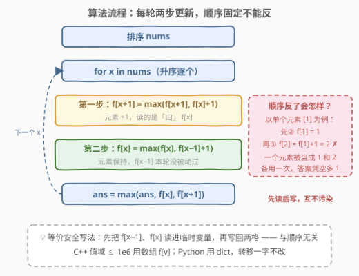

# LeetCode 修改数组后最大化数组中的连续元素数目 题解

## 1. 题目概述

- **标题 / 题号**：修改数组后最大化数组中的连续元素数目（#3041，hard）
- **链接**：https://leetcode.cn/problems/maximize-consecutive-elements-in-an-array-after-modification/
- **难度**：困难
- **标签**：数组、动态规划、排序

**题意**：给你一个下标从 0 开始、只包含**正整数**的数组 `nums`。开始时，你可以将数组中**任意数量**的元素增加**至多 1**（即每个元素独立地选择 +0 或 +1）。修改完成后，从最终数组中选出**一个或更多**元素，要求这些元素升序排序后是**连续**的——比方说 `[3, 4, 5]` 是连续的，但 `[3, 4, 6]` 和 `[1, 1, 2, 3]` 不是连续的。返回最多可以选出的元素数目。

**示例 1**：

```text
输入：nums = [2,1,5,1,1]
输出：3
解释：将下标 0 和 3 处的元素各增加 1，得到 [3,1,5,2,1]；
     选出 [3,1,2]，排序后为 [1,2,3]，是连续的，最多 3 个。
```

**示例 2**：

```text
输入：nums = [1,4,7,10]
输出：1
解释：彼此相距太远，最多只能选 1 个元素。
```

**约束**：

- $1 \le \text{nums.length} \le 10^5$
- $1 \le \text{nums}[i] \le 10^6$

> ⚠️ 读题陷阱：「连续」指**互不相同的连续整数**——$[1,1,2,3]$ 因为 1 重复而不合法。所以两个同值元素想同时入选，必须一个保持、一个 +1。另外「增加至多 1」是**每个元素独立可选**的 +0/+1，不是全局只能对一个元素加一次。

## 2. 解题思路

### 2.1 暴力思路

「每个元素 +0 或 +1」共有 $2^n$ 种组合，直接枚举修改方案再逐个验证显然不可行。退一步：既然选出的集合只与**最终值**有关，先**排序**，再做经典 LIS 式 DP。设 $dp[i][d]$（$d \in \{0, 1\}$）表示第 $i$ 个元素最终落在值 $\text{nums}[i] + d$、且以它结尾的最长连续段长度，转移为

$$dp[i][d] = 1 + \max\{\, dp[j][d'] \;:\; j < i,\ \text{nums}[j] + d' + 1 = \text{nums}[i] + d \,\}$$

答案是所有 $dp[i][d]$ 的最大值。正确性没有问题，但转移要向前枚举前驱，最坏情况（大量重复值挤在一起）是 $O(n^2)$——$n = 10^5$ 时达 $10^{10}$ 次操作，必然超时。

### 2.2 核心观察：排序 + 值域 DP

![核心概念：元素 x 的两条落点与 f[v] 的含义](../images/p3041_dp_value_map.svg)

重新审视上面的转移：$dp[i][d]$ 的转移**只关心前驱的「最终值」** $\text{nums}[j] + d'$，根本不关心下标 $j$ 是谁。于是可以把整层 DP 压缩到**值域**上：

$$f[v] = \text{以值 } v \text{ 结尾的最长连续段长度}$$

排序后从左往右处理每个元素 $x$，它只有两个落点，各对应一条 $O(1)$ 更新：

| 选择 | 落点 | 更新 |
|------|------|------|
| 保持 $x$ | 值 $x$ | $f[x] \leftarrow \max(f[x],\ f[x-1] + 1)$ |
| 升到 $x+1$ | 值 $x+1$ | $f[x+1] \leftarrow \max(f[x+1],\ f[x] + 1)$ |

答案就是 $\max_v f[v]$。

> 💡 **为什么排序后一遍扫就够**：排序保证处理 $x$ 时，所有最终值 $\le x$ 的可能前驱都已写入 $f$；而 $x$ 的两个落点能接上的前驱状态恰好只有 $f[x-1]$ 和 $f[x]$ 两格。重复值也无需特判：第二个 $x$ 到来时读到的 $f[x]$ 已包含第一个 $x$ 的贡献，$f[x+1] = f[x] + 1$ 正好表达「一个 $x$ 保持、另一个 $x$ 升 1」。

> ⚠️ **两条更新必须先算 $f[x+1]$ 再算 $f[x]$**：第一步读的必须是**旧的** $f[x]$（本轮元素还没占用值 $x$）。若先写 $f[x]$ 再写 $f[x+1]$，同一个元素会先当 $x$、再当 $x+1$ 被链两次——连单个元素 $[1]$ 都会被算出 $f[2] = 2$ 的荒谬答案。详见 2.3 流程图右侧的反例。

### 2.3 算法流程图



### 2.4 示例演算

![示例演算：[2,1,5,1,1] 的完整 DP 过程](../images/p3041_example_walkthrough.svg)

以 `nums = [2,1,5,1,1]`（排序后 `[1,1,1,2,5]`）走一遍完整流程：

| 轮次 | 本轮 $x$ | ① $f[x+1] \leftarrow \max(\text{旧}, f[x]+1)$ | ② $f[x] \leftarrow \max(\text{旧}, f[x-1]+1)$ | 关键变化 | ans |
|------|------|------|------|------|------|
| 1 | 1 | $f[2] = 0+1 = 1$ | $f[1] = 0+1 = 1$ | 初始两格 | 1 |
| 2 | 1 | $f[2] = \max(1, 1+1) = 2$ | $f[1]$ 不变 | 两个 1 分工：保持 + 升 2 | 2 |
| 3 | 1 | $f[2] = \max(2, 2)$ 不变 | 不变 | — | 2 |
| 4 | 2 | $f[3] = 2+1 = 3$ ★ | $f[2] = 2$ | 值 $\{1,2,3\}$ 凑齐 | 3 |
| 5 | 5 | $f[6] = 1$ | $f[5] = 1$ | 孤立值，另起一段 | 3 |

最终 `ans = 3`：第 1 个 1 保持为 1、第 2 个 1 升成 2、元素 2 升成 3，选出 $[1,2,3]$，与示例一致。

## 3. 参考代码

### C++（排序 + 值域数组 DP）

```cpp
class Solution {
  public:
    int maxSelectedElements(vector<int>& nums) {
        sort(nums.begin(), nums.end());
        int mx = nums.back();                      // nums[i] >= 1，f[x-1] 不会越界
        vector<int> f(mx + 2, 0);                  // f[v]: 以值 v 结尾的最长连续段长度
        int ans = 0;
        for (int x : nums) {
            f[x + 1] = max(f[x + 1], f[x] + 1);    // 先「升 1」：读的是旧 f[x]
            f[x] = max(f[x], f[x - 1] + 1);        // 再「保持」：f[x-1] 本轮没被动过
            ans = max({ans, f[x], f[x + 1]});
        }
        return ans;
    }
};
```

### Python

```python
class Solution:
    def maxSelectedElements(self, nums: List[int]) -> int:
        nums.sort()
        f = defaultdict(int)                       # f[v]: 以值 v 结尾的最长连续段长度
        ans = 0
        for x in nums:
            f[x + 1] = max(f[x + 1], f[x] + 1)     # 先「升 1」：读的是旧 f[x]
            f[x] = max(f[x], f[x - 1] + 1)         # 再「保持」：f[x-1] 本轮没被动过
            ans = max(ans, f[x], f[x + 1])
        return ans
```

> 💡 两份代码逻辑完全一致。C++ 利用 $1 \le \text{nums}[i] \le 10^6$ 开 $O(V)$ 数组，比哈希表更快；Python 用 `defaultdict(int)`，缺失键自动按 0 参与计算。若担心顺序写反，可先把 `f[x-1]`、`f[x]` 读进临时变量再写回两格，与顺序无关。

## 4. 复杂度分析

| 维度 | 复杂度 | 说明 |
|------|--------|------|
| 时间复杂度 | $O(n \log n)$ | 排序主导；DP 主循环每个元素仅两次 $O(1)$ 更新 |
| 空间复杂度 | $O(V)$（数组版）/ $O(n)$（哈希版） | $V = \max(\text{nums}) + 2 \le 10^6 + 2$；哈希版只存出现过的值 |

## 5. 扩展：值域放大与「+至多 k」

**值域放大**：若把约束放宽到 $\text{nums}[i] \le 10^9$（数组开不下），把 C++ 的 `vector<int>` 换成 `unordered_map<int, int>`，转移一字不改，复杂度变为 $O(n \log n)$ 时间、$O(n)$ 空间。这是值域 DP 的通用取舍：**值域小用数组、值域大用哈希表**，状态定义与转移完全同构。

**增加至多 k**：若每个元素可选 $+0 \sim +k$，落点变成 $x, x+1, \dots, x+k$ 共 $k+1$ 个，更新变为

$$f[x+j] \leftarrow \max(f[x+j],\ f[x+j-1] + 1), \quad j = k, k-1, \dots, 1$$

**$j$ 必须从大到小**：先写高格再写低格，保证每步读到的 $f[x+j-1]$ 都是旧值，避免同一元素被链多次（与本题「先 $f[x+1]$ 后 $f[x]$」同一道理）。每轮 $O(k)$，总复杂度 $O(n \log n + nk)$。

## 6. 面试要点

1. **「连续」为什么不能有重复值？两个相同的数怎么处理？**

   - 题目明示 $[1,1,2,3]$ 不连续——选出的元素排序后必须是**互不相同**的连续整数。两个同值 $x$ 想同时入选，只能一个保持 $x$、另一个 +1 变 $x+1$。DP 中这体现为：第二个 $x$ 读到第一个 $x$ 写入的 $f[x]$，从而 $f[x+1] = f[x] + 1$，重复值反而成了拼长段的资源。

2. **状态为什么定义在「值域」而不是「下标」上？**

   - 转移只依赖前驱的最终值 $\text{nums}[j] + d'$，与下标无关；排序后按值扫描，就把 $O(n^2)$ 的「向前找前驱」压缩成 $O(1)$ 的格子查询。这是 LIS 系问题的通用提速思路，同款模板见 [1218. 最长定差子序列](https://leetcode.cn/problems/longest-arithmetic-subsequence-of-given-difference/) 的 $f[v] = f[v-d] + 1$。

3. **两条更新为什么必须先 $f[x+1]$ 后 $f[x]$？**

   - $f[x+1] \leftarrow f[x] + 1$ 必须读**旧的** $f[x]$。反例：单个元素 $[1]$，若先 $f[1] = f[0]+1 = 1$ 再 $f[2] = f[1]+1 = 2$，同一元素被当成 1 和 2 各用一次，答案错成 2。先写 $f[x+1]$（读旧 $f[x]$）再写 $f[x]$（读本轮未动的 $f[x-1]$）即可避免；等价做法是先把两个旧值读进临时变量。

4. **`f[x-1]` 会不会读到本轮刚写的数据？**

   - 不会。本轮只写 $f[x+1]$ 与 $f[x]$ 两格，$f[x-1]$ 不在其中；排序还保证未来元素（值 $\ge x$）的更新也不会倒灌回 $f[x-1]$。两步读的都是「过去时」的合法状态。

5. **C++ 开值域数组要注意什么？**

   - 上界取 $\text{nums.back()} + 2$（排序后最大值）而非固定 $10^6 + 2$，省内存且值域变化时不越界；$\text{nums}[i] \ge 1$ 保证 $x - 1 \ge 0$ 不会下标为负；值域升到 $10^9$ 时换 `unordered_map`，其余代码不动。

## 同类练习题

| # | 题目 | 与本题的关联 |
|---|------|-------------|
| 128 | [最长连续序列](https://leetcode.cn/problems/longest-consecutive-sequence/)（[题解](../0101-0200/128_最长连续序列.md)） | 同样是「值域上的连续段」，哈希去重后只从链头起链；本题多了「+0/+1 改值」的自由度 |
| 1218 | [最长定差子序列](https://leetcode.cn/problems/longest-arithmetic-subsequence-of-given-difference/)（[题解](../1201-1300/1218_最长定差子序列.md)） | 值域哈希 DP 的同款模板 $f[v] = f[v-d]+1$，按序列顺序一遍扫，无排序依赖 |
| 846 | [一手顺子](https://leetcode.cn/problems/hand-of-straights/)（[题解](../0801-0900/846_一手顺子.md)） | 计数 + 贪心拼连续值分组，与本题共享「连续 = 互不相同的相邻整数」这一定义 |
| 1296 | [划分数字的连续区间](https://leetcode.cn/problems/divide-array-in-sets-of-k-consecutive-numbers/)（[题解](../1201-1300/1296_划分数组为连续数字的集合.md)） | 846 的泛化版，把「重复值如何分流进各组」的贪心推到极致，可与本题的 DP 思路对照 |
