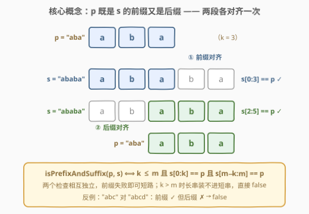
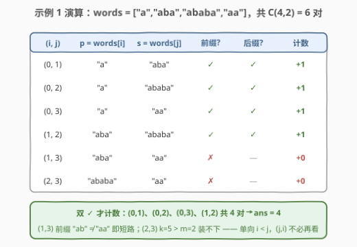
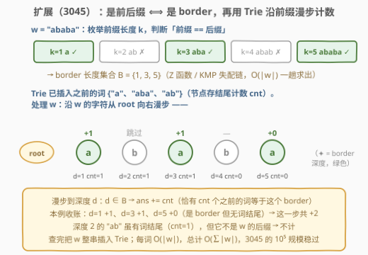

# 统计前后缀下标对 I

- **题目名称**：统计前后缀下标对 I
- **链接**：[3042. 统计前后缀下标对 I](https://leetcode.cn/problems/count-prefix-and-suffix-pairs-i/)
- **难度**：简单
- **标签**：字符串、数组、字符串匹配、字典树

## 1. 题目概述

给你一个下标从 **0** 开始的字符串数组 `words`。定义一个**布尔**函数 `isPrefixAndSuffix`，它接受两个字符串参数 `str1` 和 `str2`：

- 当 `str1` **同时**是 `str2` 的前缀（prefix）**和**后缀（suffix）时，`isPrefixAndSuffix(str1, str2)` 返回 `true`，否则返回 `false`。

例如，`isPrefixAndSuffix("aba", "ababa")` 返回 `true`，因为 `"aba"` 既是 `"ababa"` 的前缀，也是 `"ababa"` 的后缀；但 `isPrefixAndSuffix("abc", "abcd")` 返回 `false`（是前缀但不是后缀）。

以整数形式，返回满足 `i < j` 且 `isPrefixAndSuffix(words[i], words[j])` 为 `true` 的下标对 `(i, j)` 的**数量**。

**示例 1**：

```text
输入：words = ["a","aba","ababa","aa"]
输出：4
解释：成立的下标对包括：
  i=0, j=1：isPrefixAndSuffix("a", "aba") 为 true
  i=0, j=2：isPrefixAndSuffix("a", "ababa") 为 true
  i=0, j=3：isPrefixAndSuffix("a", "aa") 为 true
  i=1, j=2：isPrefixAndSuffix("aba", "ababa") 为 true
```

**示例 2**：

```text
输入：words = ["pa","papa","ma","mama"]
输出：2
解释：i=0, j=1（"pa" 对 "papa"）与 i=2, j=3（"ma" 对 "mama"）。
```

**示例 3**：

```text
输入：words = ["abab","ab"]
输出：0
解释：唯一的对是 (0, 1)，但 "abab" 比 "ab" 长，装不进去，为 false。
```

**约束条件**：

- $1 \le \text{words.length} \le 50$
- $1 \le \text{words[i].length} \le 10$
- `words[i]` 仅由小写英文字母组成

> ⚠️ 读题两个要点：① 计数是**单向**的 `i < j`——只有短串才可能成为长串的前后缀，所以 `(i, j)` 与 `(j, i)` 不对称，不能对称计数后除以 2；② `str1 == str2` 时整串自然是自身的前缀和后缀，**重复词两两成对**（如 `["a","a","a"]` 的答案是 3）。

---

## 2. 解题思路

### 2.1 暴力思路（即正解）

先算账：$n \le 50$、$L \le 10$，全部下标对只有 $\binom{50}{2} = 1225$ 个，每对判定至多比较 $2L = 20$ 个字符，总量约 $2.5 \times 10^4$ 次字符比较——常数级。**数据规模摆明了「暴力欢迎」，双重循环逐对判定就是出题人预期的解法**，任何「优化」在这里都是负收益。真正要写对的是那个判定函数。

记 $p = \text{words}[i]$（长度 $k$）、$s = \text{words}[j]$（长度 $m$），判定分三步：

1. 若 $k \gt m$，直接 `false`（长串装不进短串）；
2. 前缀检查：$s[0:k] == p$；
3. 后缀检查：$s[m-k:m] == p$。

### 2.2 核心观察：判定 = 两段子串比对



$$\text{isPrefixAndSuffix}(p, s) \iff k \le m \;\wedge\; s[0:k] = p \;\wedge\; s[m-k:m] = p$$

几个关键点：

- **两个检查相互独立**，可以短路：前缀不过关就不必看后缀（示例 3 的 `(1,3)` 对正是这样死的）。
- **边界即特判**：$k = m$ 时两个条件都退化为 $p = s$，即「相同词互为前后缀」，无需单独处理。
- **语言内置都在**：Python 的 `s.startswith(p)` / `s.endswith(p)`，C++20 的 `s.starts_with(p)` / `s.ends_with(p)`；它们对「$p$ 比 $s$ 长」自动返回 `False`，不会越界。

> 💡 C++ 老标准用 `compare` 时，**必须先判 $k \le m$**：`m - k` 为负会隐式转成巨大的 `size_t`，`compare` 收到越界下标直接抛 `out_of_range`——这个长度检查是安全性必需，不只是剪枝。

### 2.3 算法流程图


流程一句话：外层枚举右端 $j$、内层枚举左端 $i$（保证 $i \lt j$），对每一对依次过三道关卡（长度、前缀、后缀），全过则 `ans += 1`；全部对枚举完返回 `ans`。

### 2.4 示例演算



以示例 1 `words = ["a","aba","ababa","aa"]` 走一遍，$\binom{4}{2} = 6$ 对的判定如上图：前 4 对双 ✓ 各 +1；`(1,3)` 前缀 `"ab" ≠ "aa"` 短路；`(2,3)` 长度 $5 \gt 2$ 直接淘汰。最终 `ans = 4`，与示例一致。

---

## 3. 参考代码

### C++（`compare` 版，兼容老标准）

```cpp
class Solution {
  public:
    int countPrefixSuffixPairs(vector<string>& words) {
        int n = words.size(), ans = 0;
        for (int j = 1; j < n; ++j)
            for (int i = 0; i < j; ++i)
                if (check(words[i], words[j])) ++ans;
        return ans;
    }

  private:
    // p 能否同时作为 s 的前缀和后缀
    bool check(const string& p, const string& s) {
        int k = p.size(), m = s.size();
        if (k > m) return false;
        return s.compare(0, k, p) == 0 &&        // 前缀：s[0,k) == p
               s.compare(m - k, k, p) == 0;      // 后缀：s[m-k,m) == p
    }
};
```

### C++20（`starts_with` / `ends_with` 版）

```cpp
class Solution {
  public:
    int countPrefixSuffixPairs(vector<string>& words) {
        int ans = 0;
        for (int j = 1; j < (int)words.size(); ++j)
            for (int i = 0; i < j; ++i) {
                const auto& p = words[i], & s = words[j];
                ans += s.starts_with(p) && s.ends_with(p);
            }
        return ans;
    }
};
```

### Python（内置一行版）

```python
from itertools import combinations

class Solution:
    def countPrefixSuffixPairs(self, words: List[str]) -> int:
        return sum(
            s.startswith(p) and s.endswith(p)
            for p, s in combinations(words, 2)   # 按 (i, j) 且 i < j 的顺序枚举
        )
```

### Python（手写 check 版，对照 C++ 逻辑）

```python
class Solution:
    def countPrefixSuffixPairs(self, words: List[str]) -> int:
        def check(p: str, s: str) -> bool:
            k, m = len(p), len(s)
            return k <= m and s[:k] == p and s[m - k:] == p

        n = len(words)
        return sum(check(words[i], words[j]) for j in range(n) for i in range(j))
```

> 💡 `combinations(words, 2)` 恰好按「先到的当左端」的顺序产出全部 $i \lt j$ 对，与题目要求的一一对应；`startswith` / `endswith` 自带超长保护，Python 版连 `k <= m` 都不用写。

---

## 4. 复杂度分析

| 维度 | 复杂度 | 说明 |
|------|--------|------|
| 时间复杂度 | $O(n^2 \cdot L)$ | $\binom{n}{2}$ 对判定，每对至多 $2L$ 次字符比较；$n \le 50$、$L \le 10$ 时约 $2.5 \times 10^4$，常数级 |
| 空间复杂度 | $O(1)$ | 只用常数变量；Python 切片版会产生 $O(L)$ 的临时子串，量级可忽略 |

其中 $n = \text{len(words)}$，$L = \max \text{len(words[i])}$。

---

## 5. 扩展：3045 的规模升级 —— border 与 Trie

姊妹题 [3045. 统计前后缀下标对 II](https://leetcode.cn/problems/count-prefix-and-suffix-pairs-ii/) 把规模拉到 `words.length ≤ 10⁵`、`∑|words[i]| ≤ 10⁵`，$O(n^2)$ 双循环当场爆炸。本题标签里的「字典树 / 哈希函数 / 滚动哈希」正是为它准备的。

**关键概念：border（公共前后缀）**——既是 $s$ 前缀又是 $s$ 后缀的串。「`words[i]` 是 `words[j]` 的前后缀」⟺「`words[i]` 是 `words[j]` 的 **border**」。于是按序处理每个词 $w$ 时，问题变成：**有多少个之前的词恰是 $w$ 的某个 border？**



1. 用 **Z 函数**（或 KMP 失配链）$O(|w|)$ 求出 $w$ 的全部 border 长度集合 $B$：$k \in B \iff w[0:k] = w[|w|-k:]$；
2. 沿 $w$ 的字符在 Trie 上**漫步**（Trie 里存的是之前出现过的词，节点带结尾计数 `cnt`）：走到深度 $d$ 时若 $d \in B$，则 `ans += cnt`——此刻节点代表的串恰是 $w$ 的一个 border，且有 `cnt` 个之前的词与它相等；
3. 把 $w$ 整串插入 Trie，终点计数 +1，留给后面的词查。

每个词 $O(|w|)$，总计 $O(\sum |w|)$。

```python
class Solution:
    def countPrefixSuffixPairs(self, words: List[str]) -> int:
        root = {}                     # 嵌套 dict 当 Trie，'#' 存结尾计数
        ans = 0
        for w in words:
            m = len(w)
            z = [0] * m               # Z 函数：z[i] = w 与 w[i:] 的最长公共前缀长度
            z[0] = m
            l = r = 0
            for i in range(1, m):
                if i < r:
                    z[i] = min(r - i, z[i - l])
                while i + z[i] < m and w[z[i]] == w[i + z[i]]:
                    z[i] += 1
                if i + z[i] > r:
                    l, r = i, i + z[i]
            borders = {k for k in range(1, m + 1) if z[m - k] == k}

            node = root               # 沿前缀漫步，border 深度处收账
            for d, ch in enumerate(w, 1):
                node = node.get(ch)
                if node is None:
                    break
                if d in borders:
                    ans += node.get('#', 0)

            node = root               # 整串插入，留给后面的词查
            for ch in w:
                node = node.setdefault(ch, {})
            node['#'] = node.get('#', 0) + 1
        return ans
```

> 💡 为什么不直接「哈希表存历史词 + 枚举 $w$ 的 border 去查」？枚举 border 长度虽是 $O(|w|)$，但每次查询都要切出 $w[0:k]$ 这个子串做哈希键，单次 $O(k)$、总计最坏 $O(|w|^2)$——单个 $10^5$ 长的词就爆了。Trie 的妙处在于**漫步时顺带枚举了所有前缀**，一个字符都不用重复拷贝。

---

## 6. 面试要点

1. **为什么双重循环就是正解？**

   - 数据规模决定算法：$n \le 50$、$L \le 10$，下标对至多 $\binom{50}{2} = 1225$ 个，每对至多 $2L = 20$ 次字符比较，总量约 $2.5 \times 10^4$，任何语言瞬杀。此时引入 Trie / 哈希反而是过度设计，面试中应主动说明「算过账才敢暴力」。

2. **C++ 里怎么安全地判前缀 / 后缀？**

   - C++20 用 `starts_with` / `ends_with`；老标准用 `s.compare(0, k, p)` 与 `s.compare(m-k, k, p)`，但**必须先判 $k \le m$**，否则 `m - k` 下溢成巨大的 `size_t`，`compare` 抛 `out_of_range`。

3. **为什么 `(i, j)` 和 `(j, i)` 不能对称计数再除 2？**

   - 判定不对称：只有短串才可能是长串的前后缀；`(i, j)` 成立时（$p$ 是 $s$ 的前后缀），`(j, i)` 几乎必不成立（除非两串等长相同）。按 $i \lt j$ 单向枚举即可。

4. **相同字符串算一对吗？**

   - 算。$p = s$ 时整串既是自己的前缀又是自己的后缀，两个条件都自然成立；重复出现的词两两成对，如 `["a","a","a"]` 的答案是 $\binom{3}{2} = 3$。

5. **规模放大两千倍（3045）怎么办？**

   - 把「是前后缀」翻译成「是 border」：Z 函数 / KMP 失配链 $O(|w|)$ 求 border 集合，再用 Trie 存历史词、沿当前词的前缀漫步，border 深度处累加结尾计数，总 $O(\sum |w|)$。用哈希表存整串配 border 枚举也可行，但切子串做键最坏 $O(|w|^2)$。

---

## 7. 同类练习题

- [3045. 统计前后缀下标对 II](https://leetcode.cn/problems/count-prefix-and-suffix-pairs-ii/)（[题解](3045_统计前后缀下标对II.md)）：本题的大规模版，border + Z 函数 + Trie 的完整演练（第 5 节即其思路简版）
- [14. 最长公共前缀](https://leetcode.cn/problems/longest-common-prefix/)（[题解](../0001-0100/14_最长公共前缀.md)）：前缀比对的基本功，纵向 / 横向扫描两种写法
- [1392. 最长快乐前缀](https://leetcode.cn/problems/longest-happy-prefix/)：求单个串的最长 border（既是前缀又是后缀的最长真前缀），KMP / Z 函数模板题
- [459. 重复的子字符串](https://leetcode.cn/problems/repeated-substring-pattern/)：border 性质的经典应用——$n - \text{最长 border}$ 即最小循环节
- [208. 实现 Trie (前缀树)](https://leetcode.cn/problems/implement-trie-prefix-tree/)（[题解](../0201-0300/208_实现Trie.md)）：Trie 模板实现，3045 扩展解法的基石
