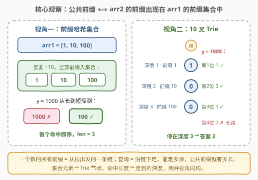
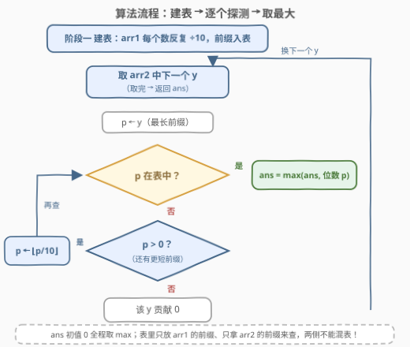
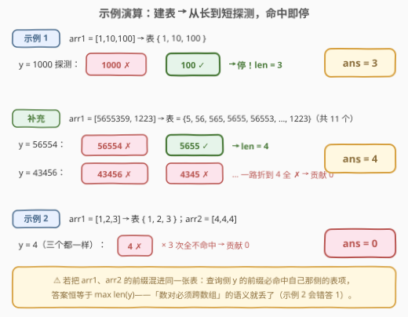

# LeetCode 最长公共前缀的长度 题解

## 1. 题目概述

- **标题 / 题号**：最长公共前缀的长度（#3043，medium）
- **链接**：https://leetcode.cn/problems/find-the-length-of-the-longest-common-prefix/
- **难度**：中等
- **标签**：字典树（Trie）、数组、哈希表、字符串

**题意**：给你两个**正整数**数组 `arr1` 和 `arr2`。

正整数的**前缀**是其**最左边**的一位或多位数字组成的整数。例如 `123` 是整数 `12345` 的前缀，而 `234` **不是**。

设若整数 `c` 是整数 `a` 和 `b` 的**公共前缀**，那么 `c` 需要同时是 `a` 和 `b` 的前缀。例如 `5655359` 和 `56554` 有公共前缀 `565` 和 `5655`，而 `1223` 和 `43456` 没有公共前缀。

你需要找出属于 `arr1` 的整数 `x` 和属于 `arr2` 的整数 `y` 组成的所有数对 `(x, y)` 之中**最长的公共前缀的长度**。返回该长度；若它们之间不存在公共前缀，则返回 `0`。

**示例 1**：

```text
输入：arr1 = [1,10,100], arr2 = [1000]
输出：3
解释：存在 3 个数对 (arr1[i], arr2[j])：
- (1, 1000) 的最长公共前缀是 1。
- (10, 1000) 的最长公共前缀是 10。
- (100, 1000) 的最长公共前缀是 100。
最长的公共前缀是 100，长度为 3。
```

**示例 2**：

```text
输入：arr1 = [1,2,3], arr2 = [4,4,4]
输出：0
解释：任何数对 (arr1[i], arr2[j]) 之中都不存在公共前缀，因此返回 0。
请注意，同一个数组内元素之间的公共前缀不在考虑范围内。
```

**补充示例 3**（覆盖「部分前缀命中」情形，取自题面说明）：

```text
输入：arr1 = [5655359, 1223], arr2 = [56554, 43456]
输出：4
解释：5655359 与 56554 的最长公共前缀是 5655，长度为 4；其余数对均无公共前缀。
```

**约束**：

- $1 \le \text{arr1.length}, \text{arr2.length} \le 5 \times 10^4$
- $1 \le \text{arr1}[i], \text{arr2}[i] \le 10^8$

> 💡 读题关键有三处：① 前缀从**最左边**起、**至少一位**（`123` 是 `12345` 的前缀，`234` 不是）；② 数对必须**跨数组**——同一数组内部元素的相似不算（示例 2 里 `arr2` 三个 `4` 互相有前缀 4，但不作数）；③ 要求的是最长公共前缀的**长度**，不是前缀本身。

## 2. 解题思路

### 2.1 暴力思路：双重循环逐对求 LCP

枚举全部 $n \times m$ 个数对 $(x, y)$：把两数转成十进制字符串，逐字符比较，得到该数对的最长公共前缀长度，全局取最大。单次比较 $O(L)$，总计

$$O(n \cdot m \cdot L) \;=\; 5 \times 10^4 \times 5 \times 10^4 \times 9 \;\approx\; 2.25 \times 10^{10}$$

约两百亿次字符比较，必然超时。慢的根源是**重复劳动**：同一个 `x` 要跟 `arr2` 里每个 `y` 各比较一遍，而它的前缀结构（1、10、100……）被反复拆了几万遍。破局点是把「数对级」比较升维成「数组级」查询——先把一侧的前缀信息一次性物化成一张表，另一侧只管来查。

### 2.2 核心观察：公共前缀 ⟺ 一侧前缀落在另一侧的前缀集合中



**转化**：「$x$ 与 $y$ 有长度为 $k$ 的公共前缀」⟺「$x$ 的前 $k$ 位恰好也是 $y$ 的一个前缀」⟺ 这个 $k$ 位整数**同时是** $x$ 和 $y$ 的前缀。于是问题等价于：

> 答案 = **arr2 的某个前缀**出现在 **arr1 的所有前缀构成的集合**中的最大长度。

两个数组角色对称，哪边建表都行。而「每个数的所有前缀」极其便宜——$10^8$ 只有 9 位，一个数至多 9 个前缀，两数组合计至多 $9(n+m) \approx 10^6$ 个，完全可以装进一张表：

- **视角一（前缀哈希集合）**：把 `arr1` 每个数**反复整除 10** 得到的全部前缀塞进 `HashSet`（这正是官方提示一、二）；再枚举 `arr2` 每个数的前缀——**从长到短**查，首个命中即是该数能贡献的最长公共前缀，更新答案后立刻换下一个数。
- **视角二（10 叉 Trie）**：把前缀集合组织成字典树——一个数的所有前缀天然是**从根出发的一条链**，链上深度为 $k$ 的节点恰好是这个数长度为 $k$ 的前缀。查询 $y$ 时按数字位逐层下走，**能走多深，公共前缀就有多长**，走到无路可走自然停下。

> 💡 两种视角同构：哈希集合的元素 = Trie 的节点；「枚举前缀查集合」=「沿链下走」。Trie 的优势是**一次行走天然最长优先**——不必从长到短枚举再 break，停下来的深度就是答案；哈希集合的优势是**十行代码、零结构预估**。本题两者复杂度同阶，面试上先写哪个、再主动聊另一个都是加分项。

> ⚠️ 枚举前缀用 `while x: ...; x //= 10`，终止哨兵是 `x == 0`：前缀**至少一位**，`0` 不是任何正整数的前缀。若写成 `while x >= 0` 会死循环（$0 // 10 = 0$）；若误把 0 入集合，查询侧折到 0 时会「命中」返回长度 1，而正确答案是 0。

### 2.3 算法流程：一边建表，一边探测



两个阶段串行，`ans` 初值为 0（天然覆盖「无任何公共前缀」）：

1. **建表**：遍历 `arr1`，对每个 $x$ 从整个数开始反复 $\lfloor x/10 \rfloor$，把沿途每个非零前缀放入表（Trie 则按十进制位逐位插入，路径即前缀链）；
2. **探测**：遍历 `arr2`，对每个 $y$ 从最长前缀（$y$ 本身）开始查表——命中则 $\text{ans} \leftarrow \max(\text{ans}, \text{当前前缀位数})$ 并**立即换下一个 $y$**（更短的前缀不可能更长）；未命中则去掉末位继续查；折到 0 仍未命中，该 $y$ 贡献 0；
3. 全部探测完返回 `ans`。

> ⚠️ 表里**只放 arr1 的前缀**，只拿 **arr2 的前缀**来查。若把两个数组的前缀混进同一张表，查询侧 $y$ 的前缀必然命中自己那侧放进来的表项，答案恒等于 $\max \text{len}(y)$——「数对必须跨数组」的语义（示例 2 的教训）就丢了。

### 2.4 示例演算



**示例 1**：`arr1 = [1,10,100]` 建表得 $\{1, 10, 100\}$。探测 `y = 1000`：`1000` ✗ → `100` ✓，命中即停，长度 3，`ans = 3`。

**补充示例 3**：`arr1 = [5655359, 1223]` 建表得 $\{5, 56, 565, 5655, 56553, 565535, 5655359, 1, 12, 122, 1223\}$（共 11 个）。探测 `y = 56554`：`56554` ✗ → `5655` ✓，长度 4；探测 `y = 43456`：`43456` ✗ → `4345` ✗ → … → `4` ✗，贡献 0。`ans = 4`。

**示例 2**：`arr1 = [1,2,3]` 建表得 $\{1, 2, 3\}$；`arr2 = [4,4,4]` 的每个 `y` 只有前缀 `4`，三次探测全 ✗，`ans = 0`。

## 3. 参考代码

### C++（10 叉 Trie 版）

```cpp
class Solution {
  public:
    int longestCommonPrefix(vector<int>& arr1, vector<int>& arr2) {
        // 10 叉 Trie：ch[u][d] = 节点 u 经数字 d 指向的孩子，-1 表示无
        vector<array<int, 10>> ch(1);
        ch[0].fill(-1);

        auto insert = [&](int x) {
            int u = 0;
            for (char c : to_string(x)) {
                int d = c - '0';
                if (ch[u][d] == -1) {
                    ch[u][d] = ch.size();
                    ch.emplace_back();
                    ch.back().fill(-1);
                }
                u = ch[u][d];
            }
        };
        for (int x : arr1) insert(x);   // 阶段一：arr1 逐位插入

        int ans = 0;
        for (int y : arr2) {            // 阶段二：arr2 沿链下走
            int u = 0, depth = 0;
            for (char c : to_string(y)) {
                int d = c - '0';
                if (ch[u][d] == -1) break;   // 走不动即停，depth 已是最长
                u = ch[u][d];
                depth++;
            }
            ans = max(ans, depth);
        }
        return ans;
    }
};
```

### Python（前缀哈希集合版）

```python
class Solution:
    def longestCommonPrefix(self, arr1: List[int], arr2: List[int]) -> int:
        seen = set()
        for x in arr1:                  # 阶段一：arr1 每个数的所有前缀入集合
            while x:                    # 前缀至少一位，0 作终止哨兵不入集合
                seen.add(x)
                x //= 10

        ans = 0
        for y in arr2:                  # 阶段二：从长到短探测
            while y:
                if y in seen:           # 首次命中即该 y 的最长，break 换下一个
                    ans = max(ans, len(str(y)))
                    break
                y //= 10
        return ans
```

> 💡 C++ 想省事也可用 `unordered_set<int>` 版：建表 `for (; x; x /= 10) seen.insert(x);`，探测 `for (; y; y /= 10) if (seen.count(y)) { ans = max(ans, (int)to_string(y).size()); break; }`——与 Python 版逐行对应，是最短写法；Trie 版胜在范式可迁移（见第 5 节）。

## 4. 复杂度分析

| 维度 | 复杂度 | 说明 |
|------|--------|------|
| 时间复杂度 | $O((n + m) \cdot L)$ | $L \le 9$ 为最长十进制位数（$10^8$ 共 9 位）；建表 $O(nL)$ + 探测 $O(mL)$，总量 $\le 9 \times 10^5$ 次基本操作 |
| 空间复杂度（哈希集合） | $O(n \cdot L)$ | 至多 $9n$ 个前缀整数入集合 |
| 空间复杂度（Trie） | $O(n \cdot L \cdot 10)$ | 至多 $9n \approx 4.5 \times 10^5$ 个节点，每节点 10 个孩子指针，最坏约 18 MB |

## 5. 扩展：三种实现与一个可迁移范式

**方法对比**：

| 方法 | 时间 | 空间 | 一句话点评 |
|------|------|------|-----------|
| 前缀哈希集合 | $O((n+m) \cdot L)$ | $O(nL)$ | 代码最短，官方提示直给的解法 |
| 10 叉 Trie | $O((n+m) \cdot L)$ | $O(nL \cdot 10)$ | 「集合 + 前缀结构」二合一，深度即答案 |
| 排序 + 二分 | $O((n + m)\log n \cdot L)$ | $O(nL)$ | 把 arr1 转字符串排序，每个 y 二分找插入点，只与左右邻居求 LCP——排序序中 LCP 向插入点单调，能做但多一个 $\log$，本题没必要 |

**范式迁移：「一侧建结构，另一侧查询」**。本题把 arr1 物化成 Trie/哈希再让 arr2 来查，本质是把 $O(n \times m)$ 的两两交互降为 $O(n + m)$ 的单向查询，是极其常用的降维套路：

- [421. 数组中两个数的最大异或值](https://leetcode.cn/problems/maximum-xor-of-two-numbers-in-an-array/)：数字按**二进制位**建 01-Trie，查询侧每走一步贪心选「相反位」最大化异或——本题 10 叉 Trie 的位运算兄弟；
- [454. 四数相加 II](https://leetcode.cn/problems/4sum-ii/)：前两数之和入哈希，后两数之差来查（本仓库已有题解）；
- [1. 两数之和](https://leetcode.cn/problems/two-sum/)：已遍历的数入哈希，当前数来查（本仓库已有题解）。

**若数值范围爆炸（如 $10^{18}$ 乃至大数）**：$L$ 变大，哈希/Trie 依旧线性于位数，只是常数变大；此时哈希键需存字符串（或滚动哈希），Trie 反而更稳——这也是面试官追问「数字更长怎么办」时的标准答案。

## 6. 面试要点

1. **本题和普通字符串 LCP 有何区别与联系？**

   - 无本质区别：整数转十进制字符串后，前缀就是字符串前缀，本题只是把「一组字符串内的 LCP」换成了「两个数组之间的 LCP」。可行性的钥匙是 $L \le 9$——位数小，前缀总数 $O((n+m)L)$ 才可枚举；若两个数组只各有一个数，直接逐位比较即可，建表反而多余。

2. **为什么「从长到短」枚举前缀并 break 是对的？**

   - 同一个 $y$ 的前缀形成一条长度严格递减的链（$y,\ \lfloor y/10 \rfloor,\ \dots$ 至一位数），从最长开始查，**首次命中**必是该 $y$ 可达的最长公共前缀，更短的不可能更长。若从短到长，必须查完全部前缀才能确定最大值，还不能提前停机。Trie 版没有这个讨论——一次行走天然在「走不动」处取得最大深度。

3. **枚举前缀的循环怎么写？0 为什么要特殊对待？**

   - `while x: seen.add(x); x //= 10`。前缀**至少一位**，`0` 不是任何正整数的前缀，正好用折位折出的 0 做终止哨兵。两个典型错误：`while x >= 0` 死循环（$0//10=0$）；把 0 误入集合后查询侧折到 0 误命中，把 0 写成 1。

4. **Trie 和哈希集合如何取舍？**

   - 复杂度同阶、都能过。哈希集合代码十行、无结构预估、Python 友好；Trie 有 10 倍孩子指针的空间放大（最坏 ≈18 MB），但免去了枚举与 break，更重要的是**思想可迁移**——换成二进制位是 421 的异或 Trie，换成字符是 208 的字符串 Trie。面试建议先按提示写哈希版，再主动升级 Trie 版聊范式。

5. **最容易翻车的两处？**

   - ① **两侧前缀混进同一张表**：查询侧 $y$ 的前缀必命中自己那侧的表项，答案恒等于 $\max \text{len}(y)$，「跨数组」语义丢失（示例 2 的 `arr2=[4,4,4]` 会错答 1）；② **ans 更新方式**：必须 `ans = max(ans, len)`；若写成 `ans = len` 又不 break，已命中的长前缀会被随后更短的命中覆盖。

## 同类练习题

| # | 题目 | 与本题的关联 |
|---|------|-------------|
| 208 | [实现 Trie (前缀树)](https://leetcode.cn/problems/implement-trie-prefix-tree/) | 本题 Trie 解法的基础设施，insert / search / startsWith 三件套（本仓库已有题解） |
| 14 | [最长公共前缀](https://leetcode.cn/problems/longest-common-prefix/) | 一族字符串的 LCP，本题是「跨两个整数数组求 LCP 最大长度」的亲戚（本仓库已有题解） |
| 421 | [数组中两个数的最大异或值](https://leetcode.cn/problems/maximum-xor-of-two-numbers-in-an-array/) | 同一 Trie 范式的二进制版——按位建 01-Trie，查询侧贪心走反位 |
| 648 | [单词替换](https://leetcode.cn/problems/replace-words/) | Trie 前缀匹配的字典应用——为每个单词找最短的词根前缀 |
| 1233 | [删除子文件夹](https://leetcode.cn/problems/remove-sub-folders-from-the-filesystem/) | 前缀包含关系的批量判定，排序与 Trie 两种打法与本题遥相呼应 |
