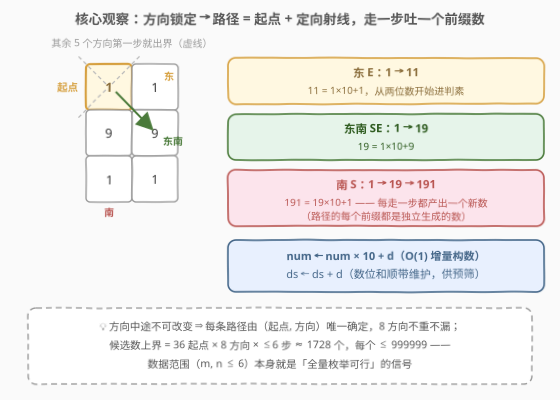
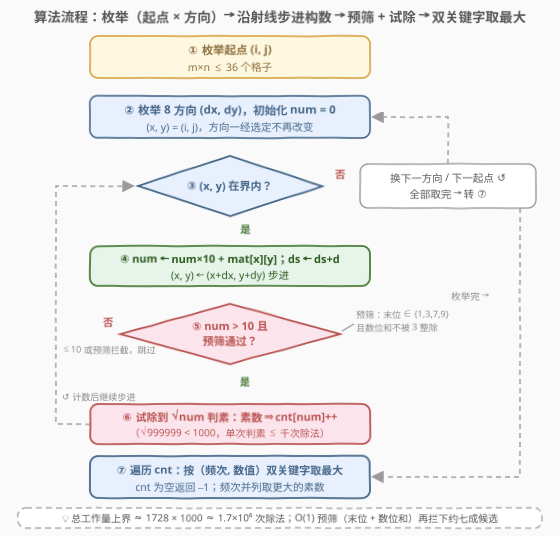
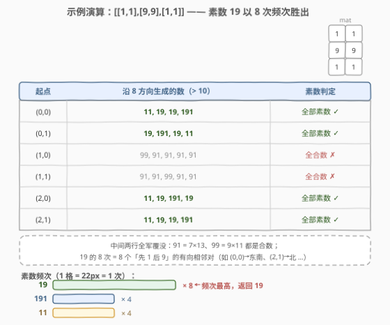

# 出现频率最高的素数

- **题目名称**：出现频率最高的素数
- **链接**：[3044. 出现频率最高的素数](https://leetcode.cn/problems/most-frequent-prime/)
- **难度**：中等
- **标签**：数组、哈希表、数学、枚举、矩阵、数论

## 1. 题目概述

给你一个大小为 $m \times n$、下标从 **0** 开始的二维矩阵 `mat`。在每个单元格，你可以按以下方式生成数字：

- 最多有 8 条路径可以选择：东、东南、南、西南、西、西北、北、东北；
- 选择其中一条路径，沿着这个方向移动，并将路径上的数字添加到正在形成的数字后面；
- 每一步都会生成数字：若路径上的数字是 `1, 9, 1`，则这个方向上会生成 `1, 19, 191` 三个数。

返回在遍历矩阵所创建的所有数字中，出现频率最高的、**大于** 10 的**素数**；如果不存在这样的素数，返回 `-1`。如果存在多个出现频率最高的素数，返回其中最大的那个。**注意：移动过程中不允许改变方向。**

**示例 1**：

```text
输入：mat = [[1,1],[9,9],[1,1]]
输出：19
解释：从 (0,0) 出发只有 3 个不出界方向：东生成 11，东南生成 19，南生成 19、191。
     从 (1,0)、(1,1) 出发只能拼出 99 与 91，均非素数。
     全部素数频次：19×8、191×4、11×4，频次最高的素数是 19。
```

**示例 2**：

```text
输入：mat = [[7]]
输出：-1
解释：唯一能生成的数字是 7——是素数但不大于 10，返回 -1。
```

**示例 3**：

```text
输入：mat = [[9,7,8],[4,6,5],[2,8,6]]
输出：97
解释：生成的素数有 97、79、47、67，各出现 1 次；频次并列时返回最大的 97。
```

**约束条件**：

- $1 \le m, n \le 6$
- $1 \le \text{mat}[i][j] \le 9$

> 💡 **读题关键**：三句话拆出全部模型要素——①「不允许改变方向」⇒ 路径是从起点出发的**定向射线**，(起点, 方向) 二元组唯一确定一条路径；②「每一步都会生成数字」⇒ 一条路径贡献它的**所有前缀数**（例：`1,9,1` 贡献 `1, 19, 191`）；③ $m, n \le 6$ ⇒ 候选总数与数值上界都极小，**暴力枚举就是正解**。

---

## 2. 解题思路

### 2.1 暴力思路：全量枚举路径 + 朴素判素

枚举这步躲不掉：对每个起点 $(i, j)$、每个方向 $(dx, dy)$，沿射线走到出界为止，每走一步 $num \leftarrow num \times 10 + d$ 得到一个前缀数。判素用最朴素的写法——从 $2$ 试除到 $v-1$：

```python
for i in range(m):
    for j in range(n):
        for dx, dy in DIRS:            # 8 个方向
            num, x, y = 0, i, j
            while 0 <= x < m and 0 <= y < n:
                num = num * 10 + mat[x][y]
                if num > 10 and is_prime_naive(num):   # 试除 2 .. v-1
                    cnt[num] += 1
                x, y = x + dx, y + dy
```

先算总账：路径条数 $\le 36 \times 8 = 288$ 条，每条 $\le \max(m,n) = 6$ 步 ⇒ 候选数 $\le 1728$ 个（含 $\le 10$ 的）；每个数 $\le 999999$。朴素试除对素数要除满 $v-1$ 次，最坏 $1728 \times 10^6 \approx 1.7 \times 10^9$ 次取模——C++ 勉强、Python 必超时。**优化的唯一主线是判素本身**，枚举结构无法再省。

### 2.2 核心观察：试除到 $\sqrt{v}$ + O(1) 预筛，压到 $10^6$ 级



**观察一：路径 = 起点 × 方向，总账很小。** 方向锁定 ⇒ 每条路径由 (起点, 方向) 唯一确定，8 方向互不重叠、不重不漏。全部路径 $\le 288$ 条、每条 $\le 6$ 步 ⇒ 候选数 $\le 1728$ 个，数值上界 $999999$——数据范围 $m, n \le 6$ 本身就是出题人给出的「全量枚举可行」信号。

**观察二：试除只需到 $\sqrt{v}$。** 因子成对出现 $(d,\ v/d)$，两者必有一个 $\le \sqrt{v}$：若 $v$ 有大于 $\sqrt{v}$ 的因子，必伴随一个小于 $\sqrt{v}$ 的因子已被发现。而 $\sqrt{999999} < 1000$，单次判素至多千次除法，总工作量上界 $1728 \times 1000 \approx 1.7 \times 10^6$——毫秒级，暴力枚举直接成为正解。

**观察三：两个 O(1) 预筛，先拦下约七成。** 候选全体 $> 10$，于是：

- **末位筛选**：末位 $\notin \{1, 3, 7, 9\}$ ⇒ 被 2 或 5 整除且大于 5 ⇒ 合数（`mat` 值域 1–9，根本不含 0）；
- **数位和筛选**：数位和被 3 整除 ⇒ 被 3 整除且大于 3 ⇒ 合数。

素数 2、3、5 本身 $\le 10$ 早已出局，所以预筛**零误杀**。粗略估计：末位筛掉 $\tfrac{5}{9} \approx 56\%$，剩下 $\tfrac{4}{9}$ 中又有约 $\tfrac{1}{3}$ 被数位和筛掉 ⇒ 只剩约三成候选真正进入试除。数位和可以沿路径增量维护 $ds \leftarrow ds + d$，与构数同价。

最后**双关键字取最大**：频次优先、并列取数值更大。示例 3 中 97、79、47、67 各出现 1 次，正是靠这一条返回 97。

### 2.3 算法流程图



四层结构：外两层枚举起点与方向；内层 `while` 沿射线步进、$O(1)$ 增量构数；每步先 $O(1)$ 预筛再 $O(\sqrt{v})$ 试除，素数计入哈希表；全部枚举完后按 (频次, 数值) 取最大，空表返回 $-1$。

### 2.4 示例演算



以示例 1 `mat = [[1,1],[9,9],[1,1]]` 演算。共生成 26 个 $> 10$ 的数，其中 16 个是素数：

| 起点 | 生成数（$>10$） | 素数贡献 |
|------|-----------------|----------|
| (0,0) | 11, 19, 19, 191 | $11{+}1,\ 19{+}2,\ 191{+}1$ |
| (0,1) | 19, 191, 19, 11 | $19{+}2,\ 191{+}1,\ 11{+}1$ |
| (1,0) | 99, 91, 91, 91, 91 | 0（$99 = 9{\times}11$，$91 = 7{\times}13$） |
| (1,1) | 91, 91, 99, 91, 91 | 0 |
| (2,0) | 11, 19, 191, 19 | $11{+}1,\ 19{+}2,\ 191{+}1$ |
| (2,1) | 11, 19, 19, 191 | $11{+}1,\ 19{+}2,\ 191{+}1$ |

汇总：**19×8、191×4、11×4** ⇒ 频次最高且唯一，返回 **19**。

> 💡 **频次从哪来**：19 的 8 次 = 矩阵中 8 个「先 1 后 9」的**有向**相邻格对（如 (0,0)→东南是 19，而反向 (1,1)→西北拼出的是 91=7×13）。同一数字串能被多少条射线的某一步拼出，频次就是多少——这正是「计数」标签的考点。
>
> ⚠️ **易错点**：① 只统计 $> 10$ 的数，起点本身那一位数（1–9）全部出局，示例 2 的 `[[7]]` 因此返回 $-1$；② 频次并列时要取**更大**的素数，不是更小的。

---

## 3. 参考代码

### C++（枚举 + 预筛 + 试除）

```cpp
class Solution {
  public:
    int mostFrequentPrime(vector<vector<int>>& mat) {
        int m = mat.size(), n = mat[0].size();
        static const int DIRS[8][2] = {{1,0},{1,1},{0,1},{-1,1},{-1,0},{-1,-1},{0,-1},{1,-1}};
        unordered_map<int, int> cnt;

        // 试除判素：先看 2，再只试奇数，到 √v 为止
        auto isPrime = [](int v) {
            if (v < 2) return false;
            if (v % 2 == 0) return v == 2;
            for (int d = 3; 1LL * d * d <= v; d += 2)
                if (v % d == 0) return false;
            return true;
        };

        for (int i = 0; i < m; ++i)
            for (int j = 0; j < n; ++j)
                for (auto& [dx, dy] : DIRS) {
                    int num = 0, ds = 0;          // 增量构数 + 数位和
                    int x = i, y = j;
                    while (x >= 0 && x < m && y >= 0 && y < n) {
                        int d = mat[x][y];
                        num = num * 10 + d;
                        ds += d;
                        int last = num % 10;      // O(1) 预筛：末位 + 数位和
                        if (num > 10 && (last == 1 || last == 3 || last == 7 || last == 9)
                            && ds % 3 != 0 && isPrime(num))
                            ++cnt[num];
                        x += dx, y += dy;         // 方向锁定，一路走到出界
                    }
                }

        int ans = -1, best = 0;                  // 双关键字：频次优先，并列取大
        for (auto& [v, c] : cnt)
            if (c > best || (c == best && v > ans))
                best = c, ans = v;
        return ans;
    }
};
```

### Python（枚举 + 预筛 + 试除）

```python
class Solution:
    def mostFrequentPrime(self, mat: List[List[int]]) -> int:
        m, n = len(mat), len(mat[0])
        cnt = Counter()

        def is_prime(v: int) -> bool:          # 试除到 √v，只试 2 与奇数
            if v < 2:
                return False
            if v % 2 == 0:
                return v == 2
            d = 3
            while d * d <= v:
                if v % d == 0:
                    return False
                d += 2
            return True

        DIRS = ((1, 0), (1, 1), (0, 1), (-1, 1), (-1, 0), (-1, -1), (0, -1), (1, -1))
        for i in range(m):
            for j in range(n):
                for dx, dy in DIRS:
                    num = ds = 0               # 增量构数，数位和顺带维护
                    x, y = i, j
                    while 0 <= x < m and 0 <= y < n:
                        d = mat[x][y]
                        num, ds = num * 10 + d, ds + d
                        # O(1) 预筛：末位 ∈ {1,3,7,9} 且数位和不被 3 整除
                        if num > 10 and num % 10 in (1, 3, 7, 9) and ds % 3 and is_prime(num):
                            cnt[num] += 1
                        x, y = x + dx, y + dy

        return max(cnt.items(), key=lambda kv: (kv[1], kv[0]))[0] if cnt else -1
```

> 💡 **实现细节**：Python 里 `ds % 3` 为真（非零）即数位和不被 3 整除，是判「非整除」的惯用真值写法；`max` 的 key 用元组 `(频次, 数值)`，元组字典序比较天然实现「频次优先、并列取大」；空表时 `max` 会抛异常，须先用三元式判空兜底返回 $-1$。

---

## 4. 复杂度分析

| 维度 | 复杂度 | 说明 |
|------|--------|------|
| 时间复杂度 | $O(m \cdot n \cdot 8 \cdot L \cdot \sqrt{V})$ | $L = \max(m, n) \le 6$ 为最长路径步数，$V \le 999999$ 为数值上界；代入得约 $1.7 \times 10^6$ 次除法上界，预筛后实际只有约三成候选真正进试除 |
| 空间复杂度 | $O(m \cdot n \cdot L)$ | 哈希表只存**不同的素数**，上界即候选数个数 $\le 1728$；其余均为 $O(1)$ 变量 |
| 对比朴素试除 | $O(m \cdot n \cdot 8 \cdot L \cdot V)$ | 试除到 $v-1$ 最坏约 $1.7 \times 10^9$ 次取模；剪到 $\sqrt{v}$ 直接缩为千分之一，Python 从超时变毫秒 |

---

## 5. 扩展：埃氏筛 O(1) 判素与记忆化

**埃氏筛预处理**：一次性筛出 $[2,\ 10^6]$ 的素数表，此后每次判素 $O(1)$：

```python
MX = 10 ** 6                                  # 数值上界 999999
is_p = bytearray([1]) * (MX + 1)
is_p[0] = is_p[1] = 0
for i in range(2, int(MX ** 0.5) + 1):
    if is_p[i]:
        is_p[i * i::i] = bytearray(len(range(i * i, MX + 1, i)))
# 主循环里：if num > 10 and is_p[num]: cnt[num] += 1
```

何时值得？筛一次约 $10^6$ 量级操作 + $10^6$ 字节空间。本题判素调用 $\le 1728$ 次，试除总代价与筛本身同量级，**试除反而更省空间**；但若矩阵放大到 $100 \times 100$（调用约 $8 \times 10^6$ 次），筛表 $O(1)$ 查询就明显占优——「试除还是打表」由调用次数与 $\sqrt{V}$ 的比值决定。

**记忆化**：同一素数会被反复判（示例 1 里 19 判了 8 次），用字典缓存 `is_prime` 结果即可；本题规模太小，收益有限，仅作思路。

**更大数值域**：若数值可达 $10^{18}$（比如矩阵更大、路径更长），试除不再可行，改用 Miller-Rabin——对 64 位整数，固定底数 $\{2,3,5,7,11,13,17,19,23,29,31,37\}$ 做确定性判素，单次 $O(\log^3 v)$。

---

## 6. 面试要点

1. **为什么试除到 $\sqrt{v}$ 就够？**

   - 因子成对 $(d,\ v/d)$ 且 $d \cdot (v/d) = v$，两者必有一个 $\le \sqrt{v}$。若 $v$ 是合数，最小质因子必 $\le \sqrt{v}$；扫到 $\sqrt{v}$ 仍无因子 ⇒ $v$ 是素数。本题 $\sqrt{999999} < 1000$，这是复杂度估计的关键数字。

2. **末位 / 数位和预筛为什么零误杀？**

   - 候选全体 $> 10$：末位 $\in \{2,4,5,6,8\}$ ⇒ $v$ 被 2 或 5 整除且 $v > 5$，必为合数；数位和被 3 整除 ⇒ $v$ 被 3 整除且 $v > 3$，必为合数。素数 2、3、5 本身 $\le 10$ 早已出局，因此筛掉的全是合数，没有一个真素数被误拦。

3. **「频次」从哪来？同一素数为什么会重复出现？**

   - 每条「起点 × 方向」射线的每一步前缀都是一个独立生成的数；同一数字串可由多条射线拼出。示例 1 中 19 的 8 次 = 8 个「先 1 后 9」的有向相邻对，反向拼出的 91 是合数不计——频次本质是「拼出该数的路径步数」总和。

4. **频次并列时怎么返回？**

   - (频次, 数值) 双关键字取最大：频次更高者胜，频次相同取数值更大。Python 一行 `max(cnt.items(), key=lambda kv: (kv[1], kv[0]))`；手写遍历要同时覆盖「频次更高」和「频次相等且数值更大」两个分支。示例 3 正是靠它返回 97。

5. **为什么不用担心溢出和前导零？**

   - $m, n \le 6$ ⇒ $num \le 999999$，`int` 绰绰有余；`mat` 值域 1–9 根本不含 0，也就没有前导零问题。若值域含 0，从起点开始构数同样无前导零概念，只需把末位筛选放宽一个分支（末位 0 ⇒ 被 10 整除 ⇒ 合数，现有 `num % 10 in (1,3,7,9)` 已自动覆盖）。

---

## 7. 同类练习题

- [204. 计数质数](https://leetcode.cn/problems/count-primes/)（[题解](../0201-0300/204_计数质数.md)）：埃氏筛母题，本文「扩展」的筛表判素就是它的直接搬运
- [762. 二进制表示中质数个计算置位数](https://leetcode.cn/problems/prime-number-of-set-bits-in-binary-representation/)：小范围判素 + 位计数，同样是「数值小 ⇒ 试除/打表够用」的规模判断练习
- [1175. 质数排列](https://leetcode.cn/problems/prime-arrangements/)：筛出 $[1, n]$ 的素数个数再接阶乘计数，判素与组合数学的串联
- [2523. 范围内最接近的两个质数](https://leetcode.cn/problems/closest-prime-numbers-in-range/)：区间埃氏筛 + 线性扫描，把筛法从「单点判素」升级为「批量生成」
- [212. 单词搜索 II](https://leetcode.cn/problems/word-search-ii/)（[题解](../0201-0300/212_单词搜索II.md)）：同属「网格 × 方向枚举」家族的困难版——方向可自由转向、需要 Trie + 剪枝，对比体会数据范围如何决定「无脑枚举」还是「结构化搜索」
