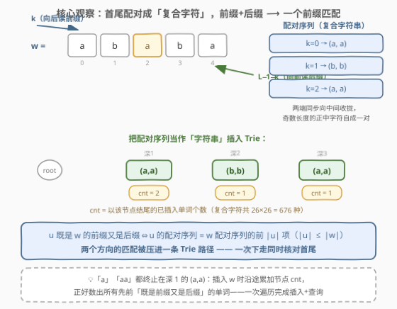
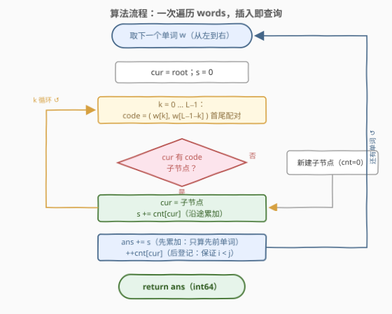
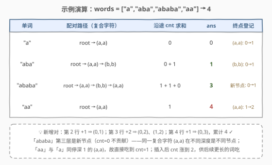

# LeetCode 统计前后缀下标对II 题解

## 1. 题目概述

- **标题 / 题号**：统计前后缀下标对 II（#3045，hard）
- **链接**：https://leetcode.cn/problems/count-prefix-and-suffix-pairs-ii/
- **难度**：困难
- **标签**：字典树、字符串匹配、哈希函数、扩展 KMP

**题意**：给你一个下标从 **0** 开始的字符串数组 `words`。定义布尔函数 `isPrefixAndSuffix(str1, str2)`：当 `str1` **同时**是 `str2` 的**前缀**和**后缀**时返回 `true`。例如 `isPrefixAndSuffix("aba", "ababa")` 为 `true`（既是开头也是结尾），而 `isPrefixAndSuffix("abc", "abcd")` 为 `false`（只是前缀、不是后缀）。

返回满足 $i < j$ 且 `isPrefixAndSuffix(words[i], words[j])` 为 `true` 的下标对 $(i, j)$ 的**数量**。

**示例 1**：

```text
输入：words = ["a","aba","ababa","aa"]
输出：4
解释：(0,1)、(0,2)、(0,3) —— "a" 是后面三个词的前缀+后缀；(1,2) —— "aba" 是 "ababa" 的前缀+后缀。
```

**示例 2**：

```text
输入：words = ["pa","papa","ma","mama"]
输出：2
解释：(0,1) "pa"↔"papa"； (2,3) "ma"↔"mama"。注意 "pa" 不是 "mama" 的前后缀。
```

**示例 3**：

```text
输入：words = ["abab","ab"]
输出：0
解释：唯一对 (0,1) 中 "abab" 比 "ab" 长，不可能成为其前缀/后缀。
```

**约束**：

- $1 \le \text{words.length} \le 10^5$
- $1 \le \text{words}[i].\text{length} \le 10^5$
- `words[i]` 仅由小写英文字母组成
- 所有 `words[i]` 的长度之和不超过 $5 \times 10^5$

> ⚠️ **读题关键**：与姊妹题 3042（$n \le 50$，暴力可过）唯一的区别就是数据规模——总长 $5 \times 10^5$ 逼出**线性**做法；同时 $n$ 可达 $10^5$，答案上界 $\binom{10^5}{2} \approx 5 \times 10^9$ **超出 int32，必须用 64 位**。

## 2. 解题思路

### 2.1 暴力思路

两重循环枚举 $(i, j)$，逐字符判断 `words[i]` 是否为 `words[j]` 的前缀+后缀：

```python
ans = 0
for i in range(n):
    for j in range(i + 1, n):
        a, b = words[i], words[j]
        k = len(a)
        if k <= len(b) and b[:k] == a and b[len(b) - k:] == a:
            ans += 1
```

单次判定 $O(\min(|a|, |b|))$，总计 $O(n^2 \cdot L)$，$n = 10^5$ 时约 $10^{11} \sim 10^{12}$ 次字符比较，必然超时。低效根源：每个 `words[j]` 被拿出来与所有先前单词**成对重比**，而「前缀 + 后缀」的结构信息完全没有被复用——需要一个**一次遍历、插入即查询**的结构。

### 2.2 核心观察：首尾配对成「复合字符」，两个条件压成一条前缀匹配



对长度为 $L$ 的单词 $w$，定义它的**配对序列**（第 $k$ 项是一个「复合字符」）：

$$p_k = \big(\, w[k],\ w[L-1-k] \,\big), \qquad k = 0, 1, \dots, L-1$$

即**左指针从前往后读、右指针从后往前读，两端同步向中间收拢**（奇数长度的正中字符自己和自己配对）。复合字符共有 $26 \times 26 = 676$ 种。

> 💡 **关键引理**：$u$ 既是 $w$ 的前缀又是后缀 $\iff$ $|u| \le |w|$ 且 **$u$ 的配对序列 $=$ $w$ 的配对序列的前 $|u|$ 项**。
>
> 证明要点：设 $m = |u|$。前缀条件即 $u[k] = w[k]$（$k < m$）；后缀条件即 $u[k] = w[L-m+k] = w[L-1-(m-1-k)]$。而配对序列第 $k$ 项对上恰好同时给出 $w[k] = u[k]$ 与 $w[L-1-k] = u[m-1-k]$——正是同一对条件。$\blacksquare$

于是问题归约为最经典的模型：**把每个单词的配对序列当作一个「字符串」插入 Trie**，节点上带计数器 `cnt` = 以该节点结尾的**先前**单词个数：

- 插入 `words[j]` 时，沿配对序列逐层下走，**把路径上每个节点的 `cnt` 累加**进答案——路径上深度 $m$ 处的 `cnt`，正是先前「配对序列前 $m$ 项完全相同」的单词个数，由引理即「既是前缀又是后缀」的个数；
- 走到终点后 `++cnt[终点]`，把当前单词登记进 Trie。

**先累加、后登记**：天然保证只统计 $i < j$，也避免单词和自己配对。而 $|u| \le |w|$ 无需特判——$w$ 的路径只有 $L$ 层，更长的 $u$ 根本不会出现在这条路径上（示例 3 的 `"abab"` vs `"ab"` 自动排除）。

### 2.3 算法流程图



要点：

- **插入即查询**：不需要「先插完再查」，下走一层就累加一层，单词只扫一遍，总时间 $O(S)$（$S = \sum |words[i]| \le 5 \times 10^5$）；
- **稀疏子节点**：复合字符虽有 676 种，但每个节点实际用到的转移极少——用哈希表存子节点（Python 的嵌套 `dict` 天然如此；C++ 切勿开 `children[676]` 数组：$5 \times 10^5$ 节点 $\times 676 \times 4\text{B} \approx 1.4\text{GB}$，直接爆内存）；
- **64 位答案**：全是同一个单词时答案约 $5 \times 10^9$，C++ 返回值用 `long long`。

### 2.4 示例演算



以示例 1 演算（见上图）：`"a"` 建出深 1 的 `(a,a)`；`"aba"` 走过 `(a,a)`（吃到 `cnt=1`，对应 $(0,1)$）再新建 `(b,b)`；`"ababa"` 走 `(a,a)→(b,b)→` 新建深 3 `(a,a)`，前两站各吃 1（对应 $(0,2)$、$(1,2)$）；`"aa"` 走 `(a,a)` 吃到 1（对应 $(0,3)$）。累计 $4$ ✓。

注意两个细节：**同一复合字符在不同深度是不同节点**（深 3 的 `(a,a)` 是新节点，`cnt=0` 不贡献）；先前的 `"a"` 已让深 1 `(a,a)` 的 `cnt` 变成 1，`"aa"` 插入后涨到 2，供后续更长的词继续吃。

## 3. 参考代码

### C++（复合字符 Trie，$O(S)$）

```cpp
class Solution {
  public:
    long long countPrefixSuffixPairs(vector<string>& words) {
        // 复合字符 (a,b) 编码为 a*26+b；用稀疏哈希表存子节点，避免 676 数组爆内存
        vector<unordered_map<int, int>> ch(1);   // ch[节点][编码] = 子节点号，0 号为根
        vector<long long> cnt(1, 0);             // 以该节点结尾的先前单词个数
        long long ans = 0;
        for (const string& w : words) {
            int L = w.size(), cur = 0;
            long long s = 0;
            for (int k = 0; k < L; ++k) {
                int code = (w[k] - 'a') * 26 + (w[L - 1 - k] - 'a');  // 首尾配对
                auto it = ch[cur].find(code);
                if (it == ch[cur].end()) {       // 不存在则新建
                    ch[cur][code] = ch.size();
                    ch.emplace_back();
                    cnt.push_back(0);
                    cur = ch.size() - 1;
                } else {
                    cur = it->second;
                }
                s += cnt[cur];                   // 沿途每个节点都可能是先前单词的结尾
            }
            ans += s;                            // 先累加：只统计 i < j 的先前单词
            ++cnt[cur];                          // 后登记：当前单词落在终点
        }
        return ans;
    }
};
```

### Python（嵌套 dict 当 Trie，$O(S)$）

```python
class Solution:
    def countPrefixSuffixPairs(self, words: List[str]) -> int:
        root = {}                          # 嵌套 dict 即 Trie
        cnt = {}                           # id(节点) -> 以该节点结尾的先前单词数
        ans = 0
        for w in words:
            L, node, s = len(w), root, 0
            for k in range(L):             # 双指针 k 与 L-1-k 同步收拢
                pair = (w[k], w[L - 1 - k])
                nxt = node.get(pair)
                if nxt is None:
                    nxt = node[pair] = {}
                node = nxt
                s += cnt.get(id(node), 0)
            ans += s                       # 先累加（只算 i < j）
            cnt[id(node)] = cnt.get(id(node), 0) + 1   # 后登记（当前单词）
        return ans
```

> 💡 Python 里嵌套 `dict` 的每个节点本身就是对象，`id()` 可当节点编号；这比「元组字符串 `w[:k] + '#' + w[L-k:]` 直接进哈希表」的写法省去重复构造键的 $O(L)$ 哈希开销。

## 4. 复杂度分析

| 维度 | 复杂度 | 说明 |
|------|--------|------|
| 时间复杂度 | $O(S)$ | $S = \sum \lvert words[i] \rvert \le 5 \times 10^5$；每个字符产生一次配对、一次哈希表下走与累加，均摊 $O(1)$ |
| 空间复杂度 | $O(S)$ | Trie 节点数 $\le S + 1$，每节点一个稀疏哈希表；`cnt` 与节点一一对应 |
| 对比暴力 | $O(n^2 L)$ | $\sim 10^{12}$ vs $\sim 5 \times 10^5$，II 版的生死线 |

## 5. 扩展：Z 函数枚举 border + 滚动哈希计数

换个视角：「$u$ 既是 $w$ 的前缀又是后缀」$\iff$ $|u|$ 是 $w$ 的 **border（边界）长度**（真前后缀相等，全长 $L$ 也算——对应 $u = w$ 自己）。用**扩展 KMP（Z 函数）**可 $O(L)$ 枚举出 $w$ 的全部 border 长度：$z[i] = L - i$（后缀 `w[i:]` 整段匹配前缀）$\Rightarrow$ $L-i$ 是 border。再维护哈希表 `cnt[字符串哈希] = 之前出现该字符串的单词数`，对每个 border 前缀 $O(1)$ 查询计数即可：

```python
class Solution:
    def countPrefixSuffixPairs(self, words: List[str]) -> int:
        MOD, B = (1 << 61) - 1, 131
        cnt = defaultdict(int)            # border 子串哈希 -> 之前出现该串的单词数
        ans = 0
        for w in words:
            L = len(w)
            z, l, r = [0] * L, 0, 0       # 扩展 KMP 求 Z 数组
            for i in range(1, L):
                if i < r:
                    z[i] = min(r - i, z[i - l])
                while i + z[i] < L and w[z[i]] == w[i + z[i]]:
                    z[i] += 1
                if i + z[i] > r:
                    l, r = i, i + z[i]
            h, p = [0] * (L + 1), [1] * (L + 1)   # 前缀哈希，O(1) 取任意 border 子串
            for i, c in enumerate(w):
                h[i + 1] = (h[i] * B + ord(c)) % MOD
                p[i + 1] = p[i] * B % MOD
            s = cnt[h[L]]                 # 全长 border：w 自身
            for i in range(1, L):
                if z[i] == L - i:         # 后缀 w[i:] 整段匹配前缀 → border 长 L-i
                    s += cnt[h[L - i]]
            ans += s
            cnt[h[L]] += 1
        return ans
```

> ⚠️ **易错点**：计数键必须是 **border 的内容**（字符串哈希），**不能只按长度计数**——`"pa"` 与 `"ma"` 都是长度 2，但只有 `"ma"` 是 `"mama"` 的前后缀，按长度会多数。border 也可用 KMP 的 `fail` 链（$L \to \text{fail}[L-1] \to \cdots$）枚举，效果相同；Trie 与 Z 两条路线都是 $O(S)$，Trie 无哈希碰撞风险、更稳，Z + 哈希不用建树、更省内存。

## 6. 面试要点

1. **为什么首尾配对能把「前缀+后缀」合成一个前缀匹配？**

   - 配对序列第 $k$ 项 $(w[k], w[L-1-k])$ 同时锁住**开头第 $k$ 位**和**结尾第 $k$ 位**。$u$ 的配对序列与 $w$ 的配对序列前 $m$ 项一致 $\iff$ $u[k]=w[k]$（前缀）且 $u[m-1-k]=w[L-1-k]$（后缀）对全部 $k$ 成立。两个方向的条件被压进同一条序列，一棵 Trie 同时管两端。

2. **为什么插入时沿途累加 cnt，而不是先插完再整树查询？**

   - 沿途累加让「查询」搭「插入」的顺风车：下走一层顺便读一次计数，单词只扫一遍。且**先累加、后登记**的顺序天然保证只数先前的单词（$i < j$），也不会把 $w$ 自己算进去（自己还没登记）。

3. **答案为什么要 `long long`？**

   - $10^5$ 个完全相同的单词，两两都成对，答案 $\binom{10^5}{2} \approx 5 \times 10^9 > 2^{31}-1 \approx 2.1 \times 10^9$。C++ 必须 `long long`；Python 原生大整数无感。

4. **子节点为什么用哈希表而不是 `children[676]` 数组？**

   - 节点总数可达 $5 \times 10^5$，数组版内存 $5 \times 10^5 \times 676 \times 4\text{B} \approx 1.4\text{GB}$。实际每个节点的出边远少于 676（单词路径上每节点通常只有常数条分支），稀疏哈希表把空间压到 $O(S)$。

5. **和 745「前缀和后缀搜索」是什么关系？**

   - 同为「复合字符 Trie」思想：745 把 `(prefix, suffix)` 拼接成 `pre + '#' + suf` 插入一棵 Trie；本题用 `(w[k], w[L-1-k])` 双向夹逼生成复合字符。共性是**把两个维度的匹配编码进一个维度**，让 Trie 的「前缀共享」同时为两个维度服务。

## 同类练习题

| # | 题目 | 与本题的关联 |
|---|------|-------------|
| 3042 | [统计前后缀下标对 I](https://leetcode.cn/problems/count-prefix-and-suffix-pairs-i/) | 本题姊妹篇（简单），$n \le 50$ 暴力可过，最适合先写暴力再对照本文线性解法 |
| 745 | [前缀和后缀搜索](https://leetcode.cn/problems/prefix-and-suffix-search/)（[题解](../0701-0800/745_前缀和后缀搜索.md)） | 「复合字符 Trie」的另一经典应用，把前缀与后缀拼接进同一棵 Trie |
| 208 | [实现 Trie（前缀树）](https://leetcode.cn/problems/implement-trie-prefix-tree/)（[题解](../0201-0300/208_实现Trie.md)） | Trie 基础模板，本题的前置知识 |
| 1392 | [最长快乐前缀](https://leetcode.cn/problems/longest-happy-prefix/)（[题解](../1301-1400/1392_最长快乐前缀.md)） | border（最长相等真前后缀）概念与 KMP/String-Hash 求法，扩展解法的前置 |
| 187 | [重复的 DNA 序列](https://leetcode.cn/problems/repeated-dna-sequences/)（[题解](../0101-0200/187_重复的DNA序列.md)） | 把多字符信息压缩编码成单个「字符」再哈希/建树，思想与复合字符编码同源 |
