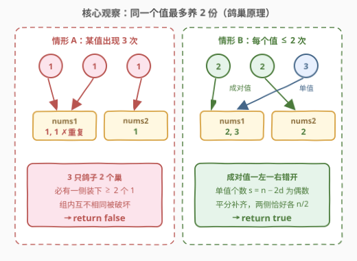
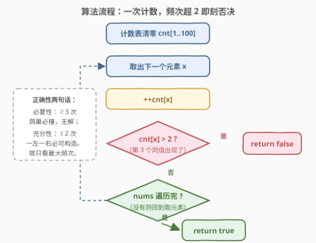
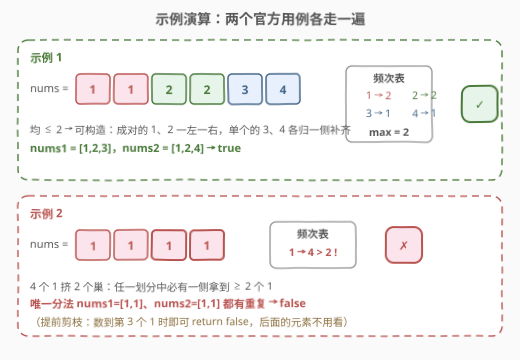

# 分割数组

- **题目名称**：分割数组
- **链接**：[3046. 分割数组](https://leetcode.cn/problems/split-the-array/)
- **难度**：简单
- **标签**：数组、哈希表、计数

## 1. 题目概述

给你一个长度为**偶数**的整数数组 `nums`，需要将它分割成 `nums1` 和 `nums2` 两部分，要求：

- $\text{nums1.length} == \text{nums2.length} == \text{nums.length} / 2$；
- `nums1` 应包含**互不相同**的元素；
- `nums2` 也应包含**互不相同**的元素。

如果能够分割数组就返回 `true`，否则返回 `false`。

**示例 1**：

```text
输入：nums = [1,1,2,2,3,4]
输出：true
解释：分割 nums 的可行方案之一是 nums1 = [1,2,3] 和 nums2 = [1,2,4]。
```

**示例 2**：

```text
输入：nums = [1,1,1,1]
输出：false
解释：分割 nums 的唯一可行方案是 nums1 = [1,1] 和 nums2 = [1,1]。但 nums1 和 nums2 都不是由互不相同的元素构成。因此，返回 false。
```

**约束条件**：

- $1 \le \text{nums.length} \le 100$
- $\text{nums.length} \% 2 == 0$
- $1 \le \text{nums}[i] \le 100$

> 💡 读题关键：题目只问**可行性**、不要求给出具体方案——这类「能不能」问题往往有一个封闭形式的判定条件，不必真的去搜索划分方式。注意「组内互不相同」是对 `nums1`、`nums2` **各自**的要求，`nums1` 与 `nums2` 之间允许有相同的值（示例 1 里两侧都有 1 和 2）。

---

## 2. 解题思路

### 2.1 暴力思路：枚举所有对半划分

最直接的想法是把「可行性」当成搜索问题：从 $n$ 个位置里选 $n/2$ 个归入 `nums1`、其余归入 `nums2`，共 $\binom{n}{n/2}$ 种选法；每种选法再用哈希集合检查两侧各自有无重复。

- $n = 100$ 时 $\binom{100}{50} \approx 10^{29}$，完全不可行；
- 即便用回溯 + 判重剪枝，本质上仍是在指数级的划分空间里找一条可行路径。

暴力失败的根源：**把判定问题当成了构造问题**。可行性其实由一个极简单的统计量——**每个值的出现次数**——完全决定，根本不需要知道元素在数组里的位置或顺序。

### 2.2 核心观察：鸽巢原理给出频次天花板 2



**必要性（出现 $\ge 3$ 次必失败）**：设某值 $v$ 出现 $k \ge 3$ 次。$k$ 个 $v$ 要放进 `nums1`、`nums2` 两个「巢」，由**鸽巢原理**，必有一侧分到 $\lceil k/2 \rceil \ge 2$ 个 $v$——该侧出现重复，方案非法。**无论怎么分都躲不开**，所以直接返回 `false`。

**充分性（所有值 $\le 2$ 次必成功）**：设出现 2 次的值有 $d$ 个、出现 1 次的值有 $s$ 个，则 $n = 2d + s$。构造划分：

1. 每个出现 2 次的值**一左一右**各放一个，两侧各得 $d$ 个且无重复；
2. 此时两侧还差 $\frac{n}{2} - d = \frac{s}{2}$ 个名额，把 $s$ 个单值**平分**补进去即可。

关键在于 $s = n - 2d$：$n$ 是偶数、$2d$ 是偶数，所以 $s$ **必为偶数**，恰好能平分——「两侧长度各 $n/2$」这个约束永远自动满足，不会额外卡人。

> 💡 结论一句话：**答案 $\iff$ 所有值的出现次数 $\le 2$**。判定条件只与频次有关，与元素顺序无关。

> ⚠️ 常见误区：担心「长度对半」会带来额外失败 case。不会——由上面 $s$ 为偶数的论证，长度约束在频次条件满足时永远可以配平；反过来，频次条件不满足时长短怎么分都救不回来。

### 2.3 算法流程：一次计数，频次超 2 即刻否决



一次遍历即可，甚至不需要扫完：

1. 建立计数表（值域 $1 \le x \le 100$，直接用长度 101 的数组；值域大就换哈希表）；
2. 遍历 `nums`，对每个 `x` 执行 `++cnt[x]`；
3. 若某次自增后 `cnt[x] > 2`，说明**第 3 个同值出现**，鸽巢必撞，立即 `return false`（提前剪枝，后面的元素不必再看）；
4. 顺利遍历完，说明所有频次 $\le 2$，`return true`。

### 2.4 示例演算



| 输入 | 频次表 | 最大频次 | 判定 | 说明 |
|------|--------|----------|------|------|
| `[1,1,2,2,3,4]` | `1→2, 2→2, 3→1, 4→1` | $2$ | `true` | 成对的 1、2 一左一右，单个的 3、4 各归一侧：`nums1=[1,2,3]`、`nums2=[1,2,4]` |
| `[1,1,1,1]` | `1→4` | $4 > 2$ | `false` | 4 个 1 挤 2 个巢，任一划分必有一侧 $\ge 2$ 个 1 |

注意示例 2 的提前剪枝：扫到**第 3 个** `1` 时即可返回 `false`，第 4 个 `1` 根本轮不到计数。

---

## 3. 参考代码

### C++（值域数组 + 提前剪枝）

```cpp
class Solution {
  public:
    bool isPossibleToSplit(vector<int>& nums) {
        int cnt[101] = {0};
        for (int x : nums) {
            if (++cnt[x] > 2) return false;  // 第 3 个同值出现，鸽巢必撞
        }
        return true;  // 所有频次 ≤ 2，必可构造划分
    }
};
```

### Python（Counter 一行判定）

```python
class Solution:
    def isPossibleToSplit(self, nums: List[int]) -> bool:
        return all(c <= 2 for c in Counter(nums).values())
```

> 💡 两种写法等价，取舍在于：C++ 版利用 $1 \le \text{nums}[i] \le 100$ 的值域约束开定长数组、$O(1)$ 空间，且边数边判可提前退出；Python 版把「计数 + 判定」交给 `Counter` 与 `all`，语义最短。若值域放大到 $10^9$，C++ 侧换 `unordered_map<int,int>` 即可，结论不变。

---

## 4. 复杂度分析

| 维度 | 复杂度 | 说明 |
|------|--------|------|
| 时间复杂度 | $O(n + V)$ | 遍历计数 $O(n)$，值域数组清零 $O(V)$，$V = 101$ 视作常数即 $O(n)$；提前剪枝最好时只看 3 个元素 |
| 空间复杂度 | $O(V)$ | 值域定长数组 $cnt[101]$，$V$ 为常数即 $O(1)$；值域无界时用哈希表为 $O(n)$ |

---

## 5. 扩展：从 2 组到 k 组，频次天花板随之抬升

本题结论可以整体推广：把 $n$（$k$ 的倍数）个元素分成 **$k$ 组、每组 $n/k$ 个且组内互不相同** $\iff$ **所有值的出现次数 $\le k$**。

- **必要性**同鸽巢：某值 $> k$ 次、只有 $k$ 个组，必有组内重复；
- **充分性**用「网格构造」：把 $k \times \frac{n}{k}$ 的网格**按列分组**，所有元素按频次降序排列后**列优先**依次填入。某值连续占据的格子跨列时每列至多占一格（因为一格竖着下来恰好 $k$ 格换一列），所以只要频次 $\le k$，任何一列（= 一组）内都不会重复。$k = 2$ 时这套构造退化成本题的「一左一右」。

另一个方向的变体是**收紧频次条件**：[2206. 将数组划分成相等数对](https://leetcode.cn/problems/divide-array-into-equal-pairs/) 要求把数组分成 $n/2$ 对**相等**的数对——判定条件从「频次 $\le 2$」换成「频次全为偶数」，同一个计数框架、只换谓词。可见这类题的通用范式是：**先统计频次，再把题意翻译成对频次的约束**。

---

## 6. 面试要点

1. **为什么某值出现 3 次就一定无解？**

   - 鸽巢原理：3 个相同的值放进 `nums1`、`nums2` 两个集合，必有某一侧分到至少 2 个，违反「组内互不相同」。出现 $k \ge 3$ 次同理（$\lceil k/2 \rceil \ge 2$）。

2. **为什么所有值出现 $\le 2$ 次就一定有解？两侧各 $n/2$ 的长度约束怎么办？**

   - 构造：成对值一左一右各放一个，两侧各得 $d$ 个；单值共 $s = n - 2d$ 个，因 $n$ 偶、$2d$ 偶故 $s$ 为偶数，平分后两侧恰好各 $\frac{n}{2}$。长度约束自动满足，不会成为额外的失败条件。

3. **只扫频次、不看元素位置，真的等价吗？会不会漏掉某种「顺序陷阱」？**

   - 会等价。必要性只依赖值的个数（鸽巢），充分性是显式构造，两者都与下标顺序无关。交换数组任意两个元素不改变频次表，也不改变可划分性。

4. **提前剪枝 `++cnt[x] > 2` 为什么是对的？会不会误杀？**

   - 自增后等于 3 意味着这是该值第 3 次出现，鸽巢论证立即生效，其后剩余元素无论是什么都救不回这个值——所以此刻返回 `false` 是完整判定，不是启发式。复杂度最好情况 $O(1)$（前 3 个元素同值）。

5. **如果改成每组 3 个互不相同的元素，条件怎么变？**

   - 变成「所有频次 $\le 3$」（设 $3 \mid n$），证明用第 5 节的网格构造：按频次降序列优先填 $3 \times \frac{n}{3}$ 网格，每列一组，频次 $\le 3$ 保证同值不共列。能现场把 $k=2$ 的论证推到一般 $k$，才算真正吃透鸽巢这一步。

---

## 7. 同类练习题

- [2206. 将数组划分成相等数对](https://leetcode.cn/problems/divide-array-into-equal-pairs/)：同一计数框架，判定谓词换成「所有频次为偶数」，一正一反刚好互补
- [961. 在长度 2N 的数组中找出重复 N 次的元素](https://leetcode.cn/problems/n-repeated-element-in-size-2n-array/)：同样是 $2n$ 数组的频次结构（其余值只出现 1 次、答案值出现 $n$ 次），鸽巢思想的近亲
- [1207. 独一无二的出现次数](https://leetcode.cn/problems/unique-number-of-occurrences/)：从「值 → 频次」再到「频次的频次」，计数套计数的入门进阶
- [1512. 好数对的数目](https://leetcode.cn/problems/number-of-good-pairs/)：频次计数的基本功，每个值贡献 $\binom{c}{2}$ 个数对
- [2870. 使数组为空的最少操作次数](https://leetcode.cn/problems/minimum-number-of-operations-to-make-array-empty/)：频次按 $2/3$ 分解的分类讨论，计数判定类题的中等难度延伸
