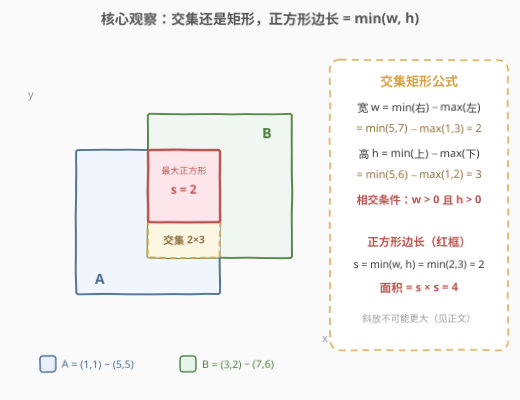
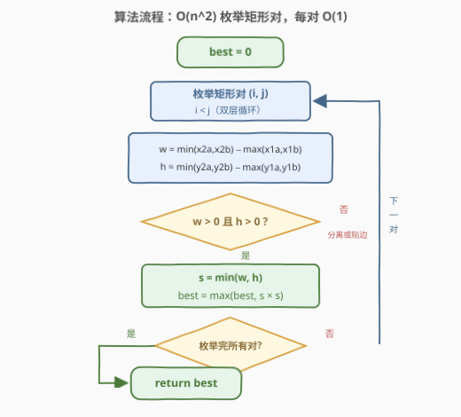
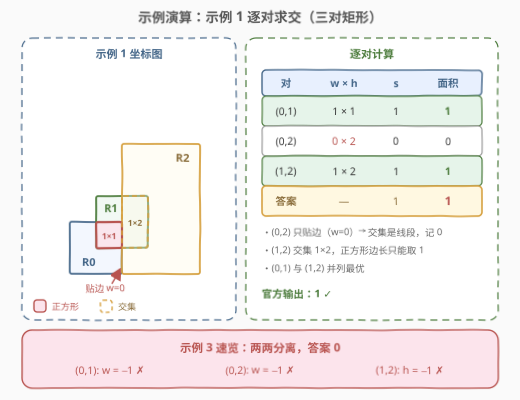
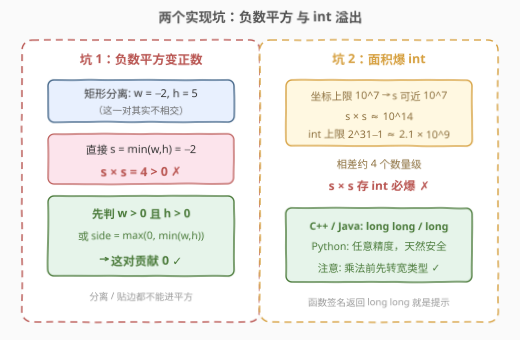

# LeetCode 求交集区域内的最大正方形面积 题解

## 1. 题目概述

- **标题 / 题号**：求交集区域内的最大正方形面积（#3047，medium）
- **链接**：https://leetcode.cn/problems/find-the-largest-area-of-square-inside-two-rectangles/
- **难度**：中等
- **标签**：几何、数组、数学

**题意**：二维平面上有 $n$ 个**轴对齐**矩形。给定两个下标从 0 开始的二维整数数组 `bottomLeft` 与 `topRight`（均为 $n \times 2$），其中 `bottomLeft[i]` 与 `topRight[i]` 分别是第 $i$ 个矩形的**左下角**与**右上角**坐标。

你可以任取**两个**矩形，它们的**交集**（若非空）形成一个区域。求能放入该区域**内部**的**最大正方形**的面积；若任何矩形对都不存在交集区域，返回 `0`。

**示例 1**：

```text
输入：bottomLeft = [[1,1],[2,2],[3,1]], topRight = [[3,3],[4,4],[6,6]]
输出：1
解释：边长为 1 的正方形可以放入矩形 0 和矩形 1 的交集区域，或矩形 1 和矩形 2 的交集区域。
因此最大面积是 1 * 1 = 1。可以证明，边长更大的正方形无法放入任何交集区域。
```

**示例 2**：

```text
输入：bottomLeft = [[1,1],[2,2],[1,2]], topRight = [[3,3],[4,4],[3,4]]
输出：1
解释：边长为 1 的正方形可以放入矩形 0 和矩形 1、矩形 1 和矩形 2，或所有三个矩形的交集区域。
因此最大面积是 1 * 1 = 1。可以证明，边长更大的正方形无法放入任何交集区域。
请注意，区域可以由多于两个矩形的交集构成。
```

**示例 3**：

```text
输入：bottomLeft = [[1,1],[3,3],[3,1]], topRight = [[2,2],[4,4],[4,2]]
输出：0
解释：不存在相交的矩形，因此返回 0。
```

**约束**：

- $n == \text{bottomLeft.length} == \text{topRight.length}$，$2 \le n \le 10^3$
- $1 \le \text{bottomLeft}[i][0], \text{bottomLeft}[i][1], \text{topRight}[i][0], \text{topRight}[i][1] \le 10^7$
- $\text{bottomLeft}[i][0] < \text{topRight}[i][0]$ 且 $\text{bottomLeft}[i][1] < \text{topRight}[i][1]$（每个矩形宽高均为正）

> 💡 读题关键：三件事定生死——① 区域由**恰好两个**矩形的交集构成，示例 2 末尾那句「区域可以由多于两个矩形的交集构成」只是备注（最优区域可能恰好被更多矩形共同覆盖），**不是**要你枚举矩形子集；② 正方形只需「放入」区域，之后会证明**轴对齐放置就是最优**，不必考虑斜放；③ 坐标上限 $10^7$ 意味着面积可达约 $10^{14}$，远超 32 位整数——函数签名返回 `long long` 本身就是官方提示。

## 2. 解题思路

### 2.1 暴力思路：枚举所有矩形对，逐对求最大内接正方形

$n \le 10^3$，矩形对总数 $\binom{n}{2} \approx 5 \times 10^5$；而每一对「求交集、求内接正方形」都是 $O(1)$——**干净的 $O(n^2)$ 枚举本身就是满分解**，没有 TLE 焦虑。本题真正的考点藏在三个实现细节里：**交集怎么算**、**正方形边长怎么定**、**数值范围会不会爆**。

容易绕的弯路：

- **枚举矩形子集**：被示例 2 的备注带偏，去枚举 $2^n$ 个子集的公共交集。不必——$k$ 个矩形的公共交集是其中**任意两个**矩形交集的子集（交集随矩形增多只减不增），枚举矩形对已覆盖一切情形；
- **对每对二分边长**：先猜边长再验证能否放进交集——内接正方形边长有封闭形式 $\min(w, h)$，二分纯属多余；
- **枚举正方形摆放位置**：正方形贴着交集左下角放即可，位置不影响边长上界。

### 2.2 核心观察：交集仍是轴对齐矩形，内接正方形边长 = min(w, h)



**观察一：两个轴对齐矩形的交集仍是轴对齐矩形**（或退化为空集 / 线段 / 点）。设两矩形分别为 $(x_1^{(a)}, y_1^{(a)}) \sim (x_2^{(a)}, y_2^{(a)})$ 与 $(x_1^{(b)}, y_1^{(b)}) \sim (x_2^{(b)}, y_2^{(b)})$，则交集的宽与高为：

$$
\begin{aligned}
w &= \min(x_2^{(a)},\ x_2^{(b)}) - \max(x_1^{(a)},\ x_1^{(b)}) \\
h &= \min(y_2^{(a)},\ y_2^{(b)}) - \max(y_1^{(a)},\ y_1^{(b)})
\end{aligned}
$$

一句话记忆：**左取大、右取小；下取大、上取小**。真正相交 $\iff w > 0$ 且 $h > 0$（$w = 0$ 或 $h = 0$ 只是贴边，交集退化为线段，面积为 0，不影响答案）。

**观察二：$w \times h$ 的矩形内能放入的最大正方形，边长恰为 $\min(w, h)$**：

- 边长 $s$ 的正方形放得进 $\iff s \le w$ 且 $s \le h \iff s \le \min(w, h)$；
- 取 $s = \min(w, h)$ 即达到上界，面积 $= \min(w, h)^2$。

**为什么斜放不会更大**：边长 $s$ 的正方形旋转 $\theta \in [0°, 90°]$ 后，水平与竖直方向的投影都是 $s(\cos\theta + \sin\theta) \ge s$——旋转只会让「占的地方」变大，绝不会更省。所以若 $s > \min(w, h)$，无论怎么转，某个方向必然超出；轴对齐的 $\min(w, h)$ 已是全局最优。

> ⚠️ 陷阱预警：矩形分离时 $w$ 或 $h$ 为负，此时 $\min(w, h)$ 可能是负数，**直接平方会「负负得正」**——例如 $w = -2, h = 5$ 时 $(-2)^2 = 4$，凭空捏造出不存在的面积。必须先判相交再平方，或写成 $\text{side} = \max(0, \min(w, h))$。

### 2.3 算法流程：双层枚举 + O(1) 求交



1. `best = 0`；
2. 双层循环枚举矩形对 $(i, j)$，$i < j$；
3. 用观察一的公式 $O(1)$ 求出交集宽高 $w, h$；
4. 若 $w > 0$ 且 $h > 0$：`side = min(w, h)`，`best = max(best, side × side)`；
5. 所有对枚举完，返回 `best`。

小优化：外层循环先把矩形 $i$ 的四个坐标缓存到局部变量，内层少几次下标寻址。对 $10^3$ 规模纯属顺手，不做也能过。

### 2.4 示例演算



以示例 1（`bottomLeft = [[1,1],[2,2],[3,1]]`，`topRight = [[3,3],[4,4],[6,6]]`）为例，三对矩形逐一求交：

| 矩形对 | 交集计算 | $w \times h$ | $s = \min(w,h)$ | 面积 |
|--------|----------|--------------|-----------------|------|
| $(0,1)$ | $x:\ [\max(1,2), \min(3,4)] = [2,3]$；$y:\ [2,3]$ | $1 \times 1$ | $1$ | $1$ |
| $(0,2)$ | $x:\ [\max(1,3), \min(3,6)] = [3,3]$；$y:\ [1,3]$ | $0 \times 2$ | $0$（贴边） | $0$ |
| $(1,2)$ | $x:\ [\max(2,3), \min(4,6)] = [3,4]$；$y:\ [2,4]$ | $1 \times 2$ | $1$ | $1$ |

三对里最大面积为 $1$，与官方输出一致。注意 $(0,2)$ 这对：矩形 0 的右边线 $x = 3$ 恰好贴着矩形 2 的左边线 $x = 3$，交集退化成一条**线段**（$w = 0$），放不下任何正方形。

示例 3 反向验证：三对的 $w$ 或 $h$ 均为负（完全分离），每对贡献 $0$，答案 $0$。

### 2.5 实现两个坑：负数平方 & 32 位溢出



| 坑 | 触发场景 | 后果 | 规避 |
|----|----------|------|------|
| 负数平方 | $w = -2, h = 5$，直接对 $\min(w,h)$ 平方 | $(-2)^2 = 4 > 0$，把「不相交」算出正面积 | 先判 $w > 0$ 且 $h > 0$；或 $\text{side} = \max(0, \min(w,h))$ |
| int 溢出 | 坐标上限 $10^7$，$s^2$ 最高约 $10^{14}$ | 超出 `int` 上限 $2^{31} - 1 \approx 2.1 \times 10^9$ 约四个数量级，答案错 | C++/Java 用 64 位类型，且**乘法前**先转宽类型；Python 天然大整数无此忧 |

## 3. 参考代码

### C++（O(n²) 枚举 + long long 防溢出）

```cpp
class Solution {
  public:
    long long largestSquareArea(vector<vector<int>>& bottomLeft,
                                vector<vector<int>>& topRight) {
        int n = bottomLeft.size();
        long long best = 0;
        for (int i = 0; i < n; ++i) {
            int lx = bottomLeft[i][0], ly = bottomLeft[i][1];
            int rx = topRight[i][0], ry = topRight[i][1];
            for (int j = i + 1; j < n; ++j) {
                // 左取大、右取小；下取大、上取小
                long long w = min(rx, topRight[j][0]) - max(lx, bottomLeft[j][0]);
                long long h = min(ry, topRight[j][1]) - max(ly, bottomLeft[j][1]);
                if (w > 0 && h > 0) {
                    long long side = min(w, h);     // 最大内接正方形边长
                    best = max(best, side * side);  // side 已是 long long，乘法安全
                }
            }
        }
        return best;
    }
};
```

### Python（side > 0 一并完成相交判定）

```python
class Solution:
    def largestSquareArea(self, bottomLeft: List[List[int]], topRight: List[List[int]]) -> int:
        best = 0
        n = len(bottomLeft)
        for i in range(n):
            x1, y1 = bottomLeft[i]
            x2, y2 = topRight[i]
            for j in range(i + 1, n):
                w = min(x2, topRight[j][0]) - max(x1, bottomLeft[j][0])
                h = min(y2, topRight[j][1]) - max(y1, bottomLeft[j][1])
                side = min(w, h)
                if side > 0:  # min(w,h)>0 等价于 w>0 且 h>0，分离/贴边一并拦截
                    best = max(best, side * side)
        return best
```

> 💡 两版细节差异：C++ 侧 `w`、`h`、`side`、`best` 全部 `long long`，`side * side` 是 64 位乘法，安全；Python 侧 `side > 0` 这个判断同时挡住了「分离（负值）」与「贴边（零）」两种情形，比显式写 `w > 0 and h > 0` 更短且等价——因为 $\min(w, h) > 0 \iff w > 0 \text{ 且 } h > 0$。

## 4. 复杂度分析

| 维度 | 复杂度 | 说明 |
|------|--------|------|
| 时间复杂度 | $O(n^2)$ | 枚举全部 $\binom{n}{2} \approx \frac{n^2}{2}$ 个矩形对，每对 $O(1)$ 求交集与边长；$n = 10^3$ 时约 $5 \times 10^5$ 次，轻松通过 |
| 空间复杂度 | $O(1)$ | 仅常数个标量变量（不计输入数组本身） |

## 5. 扩展：n 更大时怎么办？

本题 $n \le 10^3$，$O(n^2)$ 即预期解。若把 $n$ 放大到 $10^5$ 量级，就要往 $O(n \log n)$ 方向想：例如**按左边界排序 + 扫描线**维护「当前活跃矩形集合」，配合线段树 / 平衡树查询与当前矩形 $y$ 区间交最大的候选——本质是二维的「最大对重叠」问题，实现重、常数大，面试中能说出「排序 + 扫描线 + 区间最值维护」的方向即可。

两个变体也值得一想：

- **换成最大矩形**：交集里放面积最大的**矩形**，答案直接变成 $w \times h$（$\min$ 完全来自「正方形」这个约束）；
- **k 个矩形的公共交集**：与「矩形面积并」类问题（如 850. 矩形面积 II）同族，用扫描线 + 线段树维护覆盖次数，可推广到「被至少 k 个矩形覆盖的最大区域」。

## 6. 面试要点

1. **两个轴对齐矩形的交集怎么求？怎么判定相交？**

   - 左 $= \max(\text{两左})$，右 $= \min(\text{两右})$，下 $= \max(\text{两下})$，上 $= \min(\text{两上})$；$w = \text{右} - \text{左}$，$h = \text{上} - \text{下}$。相交 $\iff w > 0$ 且 $h > 0$；贴边（$w = 0$ 或 $h = 0$）交集退化为线段 / 点，放不下正方形，但对答案无影响（贡献 0）。

2. **为什么最大内接正方形边长是 $\min(w, h)$？斜着放会不会塞进更大的？**

   - 放入 $\iff s \le w$ 且 $s \le h$。斜放救不了：旋转 $\theta$ 后正方形两个方向的投影都是 $s(\cos\theta + \sin\theta) \ge s$，只会更占地方，所以 $s > \min(w, h)$ 时无论怎么转都会超界。

3. **为什么必须用 64 位整数？**

   - 坐标上限 $10^7$ → 边长可接近 $10^7$ → 面积接近 $10^{14}$，比 `int` 上限 $2^{31} - 1 \approx 2.1 \times 10^9$ 大约四个数量级。题目签名返回 `long long` 本身就是提示；C++ 里还要保证**乘法两侧**都是宽类型，只在存结果时转是不够的。

4. **矩形分离时直接对 $\min(w, h)$ 平方会发生什么？**

   - $w = -2, h = 5$ → $\min = -2$ → 平方得 $4$，「不相交」被算出正面积。规避：先判 $w > 0 \&\& h > 0$，或 $\text{side} = \max(0, \min(w, h))$，或像 Python 版那样用 `side > 0` 统一拦截。

5. **示例 2 说「区域可以由多于两个矩形的交集构成」，需要枚举子集吗？**

   - 不需要。题目只要求任取两个；且 $k$ 个矩形的公共交集 $\subseteq$ 其中任意两个的交集（交集单调收缩），对枚举的最优值不会漏掉任何情形。

## 同类练习题

| # | 题目 | 与本题的关联 |
|---|------|-------------|
| 836 | [矩形重叠](https://leetcode.cn/problems/rectangle-overlap/) | 同一套 max/min 公式退化为布尔判定（$w > 0$ 且 $h > 0$），本题的「判定版」前身 |
| 223 | [矩形面积](https://leetcode.cn/problems/rectangle-area/) | 两矩形覆盖面积 = 面积和 − 交集面积，交集公式同款，同样要当心溢出 |
| 391 | [完美矩形](https://leetcode.cn/problems/perfect-rectangle/) | 矩形几何 + 角点奇偶计数 + 面积守恒，几何模拟的综合进阶 |
| 3025 | [人员站位的方案数 I](https://leetcode.cn/problems/find-the-number-of-ways-to-place-people-i/) | 几何对枚举 + 排序剪枝，与本题同属「$O(n^2)$ 几何对枚举」家族 |
| 3027 | [人员站位的方案数 II](https://leetcode.cn/problems/find-the-number-of-ways-to-place-people-ii/) | 上一题的强化版，单调性剪枝更精细，体会 $n^2$ 家族往 $n \log n$ 走的优化路径 |
