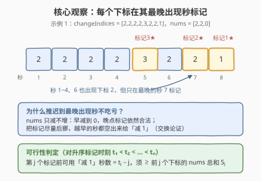
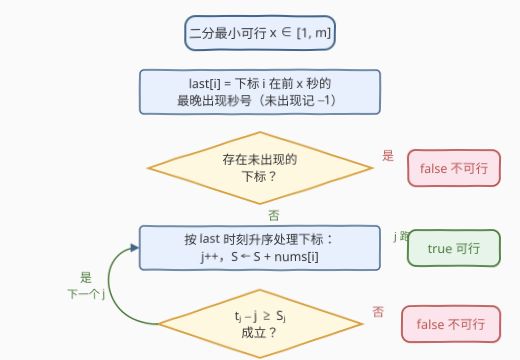
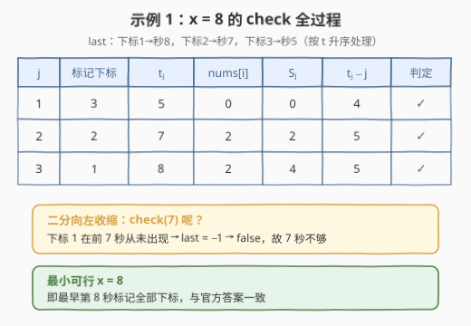

# 标记所有下标的最早秒数 I

- **题目名称**：标记所有下标的最早秒数 I
- **链接**：[3048. 标记所有下标的最早秒数 I](https://leetcode.cn/problems/earliest-second-to-mark-indices-i/)
- **难度**：中等
- **标签**：数组、二分查找、贪心

## 1. 题目概述

给你两个下标从 1 开始的整数数组 `nums` 和 `changeIndices`，长度分别为 $n$ 和 $m$。一开始 `nums` 的所有下标都**未标记**，任务是标记 `nums` 中**所有**下标。

从第 1 秒到第 $m$ 秒，对于每一秒 $s$，可以执行以下操作**之一**：

1. 选择范围 $[1, n]$ 中的一个下标 $i$，将 `nums[i]` 减少 1；
2. 如果 `nums[changeIndices[s]]` 等于 0，**标记**下标 `changeIndices[s]`；
3. 什么也不做。

返回范围 $[1, m]$ 中的一个整数，表示最优操作下标记所有下标的**最早秒数**；如果无法标记所有下标，返回 $-1$。

> 💡 换句话说：求最小的 $x$，使得**只使用前 $x$ 秒**就能把全部下标标记完。注意「标记」只能发生在第 $s$ 秒且 `changeIndices[s]` 恰好等于该下标、且其值已为 0 的时刻。

**示例 1**：

```text
输入：nums = [2,2,0], changeIndices = [2,2,2,2,3,2,2,1]
输出：8
解释：秒 1~4 依次把 nums[1]、nums[2] 各减 2 次；秒 5 标记下标 3（本来就是 0）；
      秒 6 标记下标 2；秒 7 发呆；秒 8 标记下标 1。最早第 8 秒全部标记。
```

**示例 2**：

```text
输入：nums = [1,3], changeIndices = [1,1,1,2,1,1,1]
输出：6
解释：秒 1~3 把 nums[2] 减 3 次；秒 4 标记下标 2；秒 5 把 nums[1] 减 1 次；秒 6 标记下标 1。
```

**示例 3**：

```text
输入：nums = [0,1], changeIndices = [2,2,2]
输出：-1
解释：下标 1 从不在 changeIndices 中出现，永远无法被标记。
```

**约束条件**：

- $1 \le n = \text{nums.length} \le 2000$
- $0 \le \text{nums}[i] \le 10^9$
- $1 \le m = \text{changeIndices.length} \le 2000$
- $1 \le \text{changeIndices}[i] \le n$

---

## 2. 解题思路

### 2.1 暴力思路

每一秒有三类操作可选，直接搜索所有操作序列是 $3^m$ 指数级爆炸。即便想到「标记只能发生在 `changeIndices[s]` 指向的下标、且其值恰好为 0 的秒」，正向模拟仍需逐秒做决策；而「答案是关于秒数的某个阈值」这一结构没有被利用。

真正该问的问题是：**给定前 $x$ 秒，能否标记所有下标？**——这是一个是/否判定，而且关于 $x$ **单调**：$x$ 秒够 ⇒ $x+1$ 秒一定也够（第 $x+1$ 秒发呆即可）。这立刻指向**二分答案**：二分最小的可行 $x$，若 $\text{check}(m)$ 都为假则返回 $-1$。

剩下的全部难点浓缩为一个 $O(n + m)$ 的贪心判定 `check(x)`。

### 2.2 核心观察：在最晚出现秒标记 + 计数判定



**观察 1：每个下标只需在其「最晚出现秒」考虑标记。**

固定 $x$，记 $\text{last}[i]$ 为下标 $i$ 在前 $x$ 秒中**最晚**出现的秒号。若某个下标从未出现，则它永远无法标记，直接不可行。

**交换论证**：任何可行方案中，把 $i$ 的标记从秒 $s$ 挪到 $\text{last}[i]$ 依然可行——`nums` 只减不增，早减到 0 晚点标记仍然合法；挪动只会把更早的秒腾出来给「减 1」（或发呆）。所以**只需检验「所有下标都在各自 last 时刻标记」这一种方案**，它不输给任何方案。

**观察 2：可行性归结为一个前缀计数不等式。**

各下标的 $\text{last}$ 时刻互不相同（每秒只出现一个下标），设升序排列为 $t_1 < t_2 < \cdots < t_n$，第 $j$ 个标记发生在 $t_j$、对应下标的值为 $v_j$，前缀和 $S_j = v_1 + \cdots + v_j$。则：

- **必要性**：前 $j$ 个下标的所有「减 1」（共 $S_j$ 次）必须发生在各自标记之前，即都在 $[1, t_j - 1]$ 内；而这 $t_j - 1$ 秒中还有 $j - 1$ 秒被前 $j-1$ 个标记占用（标记秒不能同时减 1）。所以 $S_j + (j-1) \le t_j - 1$，即 $t_j - j \ge S_j$。
- **充分性**：反之，把每个空闲秒按需分配给任意未清零的下标（减 1 不限定下标，任意秒可用），条件满足即可构造出完整方案。

于是 $\text{check}(x)$ = 「对所有 $j$：$t_j - j \ge S_j$」。

> ⚠️ **两个坑**：
>
> 1. **溢出**：$S_j$ 最大 $2000 \times 10^9 = 2 \times 10^{12}$，C++ 必须用 `long long`；
> 2. **值为 0 的下标也要占一个标记秒**：它贡献给 $S_j$ 的是 0，但占据一个 $t_j$、消耗一个 $j$，判定公式天然覆盖，无需特判。

### 2.3 算法流程图



整体框架就是「二分答案 + 线性贪心验证」：每次 `check(x)` 先扫前 $x$ 秒求 `last`（顺便发现未出现的下标），再按 last 时刻升序逐个核对 $t_j - j \ge S_j$。

### 2.4 示例演算



以示例 1 `nums = [2,2,0], changeIndices = [2,2,2,2,3,2,2,1]` 演算 $\text{check}(8)$：

| $j$ | 标记下标 | $t_j$ | $v_j$ | $S_j$ | $t_j - j$ | 判定 |
|-----|---------|-------|-------|-------|-----------|------|
| 1 | 3（秒 5 最晚出现） | 5 | 0 | 0 | 4 | ✓ |
| 2 | 2（秒 7 最晚出现） | 7 | 2 | 2 | 5 | ✓ |
| 3 | 1（秒 8 最晚出现） | 8 | 2 | 4 | 5 | ✓ |

全部通过 ⇒ 8 秒可行。而 $\text{check}(7)$ 中下标 1 从未出现 ⇒ 不可行，故答案 8。

再看示例 2 `nums = [1,3], changeIndices = [1,1,1,2,1,1,1]`，体会判定不等式的边界感：

| $x$ | last 映射 | 校验 | 结果 |
|-----|-----------|------|------|
| 6 | 下标 2→秒 4，下标 1→秒 6 | $j{=}1$：$4-1=3 \ge 3$ ✓；$j{=}2$：$6-2=4 \ge 4$ ✓ | 可行 |
| 5 | 下标 2→秒 4，下标 1→秒 5 | $j{=}2$：$5-2=3 < 4$ | 不可行 |

答案 6，与官方一致。注意 $j=1$ 那步 $3 \ge 3$ 恰好卡在边界上——**「减 1 必须严格在标记之前完成」**，同一秒不能既减又标。

---

## 3. 参考代码

### C++

```cpp
class Solution {
  public:
    int earliestSecondToMarkIndices(vector<int>& nums, vector<int>& changeIndices) {
        int n = nums.size(), m = changeIndices.size();

        // check(x)：只使用前 x 秒能否标记所有下标
        auto check = [&](int x) -> bool {
            vector<int> last(n + 1, -1);              // last[i]：i 在前 x 秒的最晚出现秒号
            for (int s = 1; s <= x; s++) last[changeIndices[s - 1]] = s;
            vector<int> order;                        // 按标记时刻升序的下标列表
            for (int i = 1; i <= n; i++) {
                if (last[i] < 0) return false;        // 有下标从未出现，无法标记
                order.push_back(i);
            }
            sort(order.begin(), order.end(),
                 [&](int a, int b) { return last[a] < last[b]; });

            long long sum = 0;                        // S_j：前 j 个下标的 nums 总和（会超 int）
            for (int j = 1; j <= n; j++) {
                int i = order[j - 1];
                sum += nums[i - 1];
                if ((long long)last[i] - j < sum) return false;  // t_j − j ≥ S_j 不成立
            }
            return true;
        };

        if (!check(m)) return -1;                     // 整个 m 秒都做不到，直接判死
        int lo = 1, hi = m;
        while (lo < hi) {                             // 二分最小可行 x
            int mid = lo + (hi - lo) / 2;
            if (check(mid)) hi = mid;
            else lo = mid + 1;
        }
        return lo;
    }
};
```

### Python

```python
class Solution:
    def earliestSecondToMarkIndices(self, nums: List[int], changeIndices: List[int]) -> int:
        n, m = len(nums), len(changeIndices)

        def check(x: int) -> bool:
            last = [-1] * (n + 1)              # last[i]：i 在前 x 秒的最晚出现秒号
            for s, i in enumerate(changeIndices[:x], 1):
                last[i] = s
            if -1 in last:                     # 有下标从未出现
                return False
            order = sorted(range(1, n + 1), key=lambda i: last[i])
            total = 0                          # S_j：前 j 个下标的 nums 前缀和
            for j, i in enumerate(order, 1):
                total += nums[i - 1]
                if last[i] - j < total:        # t_j − j ≥ S_j 不成立
                    return False
            return True

        if not check(m):
            return -1
        lo, hi = 1, m
        while lo < hi:                         # 二分最小可行 x
            mid = (lo + hi) // 2
            if check(mid):
                hi = mid
            else:
                lo = mid + 1
        return lo
```

> 💡 先做一次 `check(m)` 有双重作用：不可行时提前返回 $-1$，同时保证后续二分闭区间内必然存在可行解，循环结束时 `lo` 即答案。

---

## 4. 复杂度分析

| 维度 | 复杂度 | 说明 |
|------|--------|------|
| 时间复杂度 | $O((n \log n + m) \log m)$ | 二分 $O(\log m)$ 次；每次 check 求 last 为 $O(m)$、排序为 $O(n \log n)$ |
| 空间复杂度 | $O(n)$ | `last` 数组与按时刻排序的下标列表 |

> 💡 check 里的排序可以省掉：`last` 值域恰是 $[1, x]$ 内互异的秒号，开一个「秒号 → 下标」的桶正向扫一遍即 $O(n + m)$，总复杂度 $O((n + m) \log m)$。本题 $n, m \le 2000$ 两种写法都绰绰有余，但桶版是过 [3049. II](https://leetcode.cn/problems/earliest-second-to-mark-indices-ii/)（$n, m \le 10^5$）的稳妥姿势。

---

## 5. 扩展：思路从何而来 & 大数据版

这道题的思维链条值得复盘：**「求最早完成的时刻」⇒ 答案关于时间单调 ⇒ 二分答案**；判定内部**「操作高度可交换」（减 1 不限定秒与下标的配对）⇒ 不必构造逐秒方案，只需计数**；再由交换论证把标记规范化到最晚出现秒，把「构造」压缩成「一个前缀不等式」。三步环环相扣，缺一不可。

[3049. 标记所有下标的最早秒数 II](https://leetcode.cn/problems/earliest-second-to-mark-indices-ii/) 把规模提到 $n, m \le 10^5$、$\text{nums}[i] \le 10^9$：本题解法**原样通过**（注意前缀和用 64 位、排序换桶或保留 $O(n \log n)$ 均可）。反过来，若不借助单调性二分、而是从 $x = n$ 起线性递增地判定，单次 check 无法增量维护（新秒会改写 last 导致序关系全变），最坏仍是 $O(m \cdot (n + m))$，在 II 的规模下会超时——二分不是优化，是必需。

---

## 6. 面试要点

1. **二分的单调性怎么论证？**

   - 「$x$ 秒可行 ⇒ $x+1$ 秒可行」：把 $x$ 秒的可行方案原样保留、第 $x+1$ 秒发呆即可，方案前缀封闭。可行性关于 $x$ 单调，才能二分最小可行值。

2. **为什么「最晚出现秒标记」是最优策略？**

   - 交换论证：`nums` 只减不增，值一旦清零保持为零；把标记挪到更晚的 last 秒不破坏合法性，只会腾出更早的秒给减 1。故全部按 last 标记的方案支配所有其他方案。

3. **判定式 $t_j - j \ge S_j$ 的直观含义？**

   - 第 $j$ 个标记发生在 $t_j$：之前共有 $t_j - 1$ 秒，其中 $j - 1$ 秒已被前 $j-1$ 个标记占用，剩 $t_j - j$ 秒可做减 1；而前 $j$ 个下标共需 $S_j$ 次减 1 且全部必须完成于 $t_j$ 之前。逐 $j$ 校验即是充要条件。

4. **有哪些实现上的坑？**

   - 前缀和最大 $2000 \times 10^9$，C++ 用 `long long`；值为 0 的下标也占一个标记秒（公式自动覆盖，勿特判跳过）；同一秒不能既减又标（不等式用严格「之前」）；先 `check(m)` 判 $-1$。

5. **本题与 3049 II 的差异在哪，复杂度瓶颈如何处理？**

   - 仅数据规模不同（$10^5$ vs $2000$）。二分 $O(\log m)$ 次 check 的框架不变；check 内把按 last 排序改为按秒号建桶线性扫，即 $O(n + m)$，总量 $O((n+m)\log m)$ 轻松通过。

---

## 7. 同类练习题

- [3049. 标记所有下标的最早秒数 II](https://leetcode.cn/problems/earliest-second-to-mark-indices-ii/)：本题的大规模版（$n, m \le 10^5$），同一套「二分 + 最晚出现秒贪心」直接通过
- [875. 爱吃香蕉的珂珂](https://leetcode.cn/problems/koko-eating-bananas/)：二分答案入门，`check` 用 O(n) 贪心验证速度是否够（本库已收录题解）
- [1011. 在 D 天内送达包裹的能力](https://leetcode.cn/problems/capacity-to-ship-packages-within-d-days/)：同模板，二分船的运载能力，`check` 用贪心按天装货（本库已收录题解）
- [410. 分割数组的最大值](https://leetcode.cn/problems/split-array-largest-sum/)：二分「最大子数组和」，`check` 贪心划分子数组（本库已收录题解）
