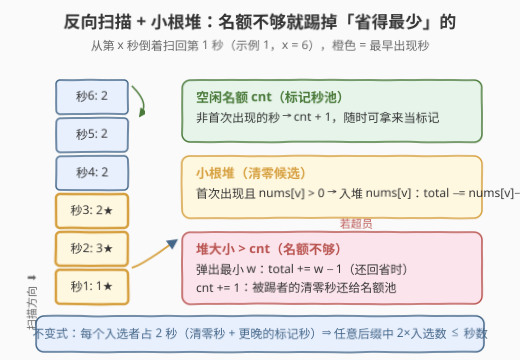
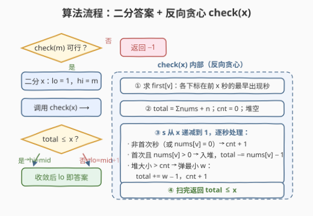
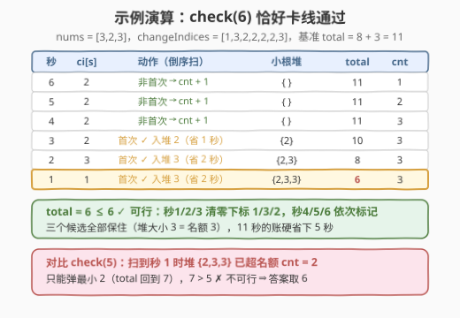

# LeetCode 标记所有下标的最早秒数 II 题解

## 1. 题目概述

- **标题 / 题号**：标记所有下标的最早秒数 II（#3049，hard）
- **链接**：https://leetcode.cn/problems/earliest-second-to-mark-indices-ii/
- **难度**：困难
- **标签**：贪心、数组、二分查找、堆（优先队列）

**题意**：给你两个下标从 1 开始的整数数组 `nums` 和 `changeIndices`，长度分别为 $n$ 和 $m$。一开始 `nums` 中所有下标都**未标记**，任务是标记 `nums` 中**所有**下标。

从第 1 秒到第 $m$ 秒（**包括**第 $m$ 秒），对于每一秒 $s$，可以执行以下操作**之一**：

1. 选择范围 $[1, n]$ 中的一个下标 $i$，将 `nums[i]` **减少** 1；
2. 将 `nums[changeIndices[s]]` 设置成任意的**非负**整数；
3. 选择范围 $[1, n]$ 中的一个下标 $i$，满足 `nums[i]` **等于** 0，并**标记**下标 $i$；
4. 什么也不做。

返回范围 $[1, m]$ 中的一个整数，表示最优操作下标记 `nums` 中**所有**下标的**最早秒数**；如果无法标记所有下标，返回 $-1$。

> 💡 与 [3048. I](https://leetcode.cn/problems/earliest-second-to-mark-indices-i/) 的两处关键差异：① 标记**不再要求** `changeIndices[s]` 恰好等于该下标——任意秒都能标记任意已清零的下标；② 多了「设为任意非负整数」这记重拳。$\text{nums}[i]$ 高达 $10^9$，逐次减 1 根本不现实，必须靠它一键清零——这正是本题升到困难的原因。

**示例 1**：

```text
输入：nums = [3,2,3], changeIndices = [1,3,2,2,2,2,3]
输出：6
解释：秒 1/2/3 分别把 nums[1]、nums[3]、nums[2] 设为 0；
      秒 4/5/6 依次标记下标 1、2、3。最早第 6 秒全部标记。
```

**示例 2**：

```text
输入：nums = [0,0,1,2], changeIndices = [1,2,1,2,1,2,1,2]
输出：7
解释：秒 1/2 直接标记本来就是 0 的下标 1、2；
      秒 3~5 把 nums[4] 减两次、nums[3] 减一次；秒 6/7 标记下标 3、4。
```

**示例 3**：

```text
输入：nums = [1,2,3], changeIndices = [1,2,3]
输出：-1
解释：秒数不够，无法标记所有下标。
```

**约束**：

- $1 \le n = \text{nums.length} \le 5000$
- $0 \le \text{nums}[i] \le 10^9$
- $1 \le m = \text{changeIndices.length} \le 5000$
- $1 \le \text{changeIndices}[i] \le n$

## 2. 解题思路

### 2.1 暴力思路

每秒有「减 1（$n$ 种）+ 清零（1 种）+ 标记（至多 $n$ 种）+ 发呆（1 种）」共 $O(n)$ 种选择，直接搜索操作序列是 $n^m$ 指数级爆炸；正向逐秒模拟做决策同样不可行。

真正该问的问题是：**给定前 $x$ 秒，能否标记所有下标？**——这是个是/否判定，且关于 $x$ **单调**：$x$ 秒够 ⇒ $x+1$ 秒一定也够（第 $x+1$ 秒发呆即可）。这立刻指向**二分答案**：若 $\text{check}(m)$ 为假返回 $-1$，否则二分最小可行 $x$。

剩下的全部难点浓缩为一个 $O(m \log n)$ 的贪心判定 $\text{check}(x)$。

### 2.2 核心观察：一键清零的「省时账本」+ 反向小根堆

![核心观察：一键清零省下 nums[v]−1 秒](../images/p3049_ops_and_saving.svg)

**观察 1（算清基准账）：完全不碰清零操作，总耗时为 $\sum \text{nums} + n$**——把每个值磨到 0 共需 $\sum \text{nums}$ 秒「减 1」，再花 $n$ 秒逐个标记。记这个基准为 $\text{total}$。

**观察 2（清零用在哪最划算）**：清零只能作用于 `nums[changeIndices[s]]`，对下标 $v$ 而言：

- 硬磨要 $\text{nums}[v] + 1$ 秒（$\text{nums}[v]$ 次减 1 + 1 次标记）；
- 改用清零只要 **2 秒**（1 秒清零 + 1 秒更晚的标记），净省 $\text{nums}[v] - 1$ 秒；
- 应该在 $v$ 在前 $x$ 秒的**最早出现秒** $\text{first}(v)$ 使用（出现越早，留给「更晚标记」的窗口 $(\text{first}(v), x]$ 越大，支配一切更晚的出现秒）；
- 值为 $0$ 的下标别用（净省 $-1$ 秒，倒赔）；值为 $1$ 的下标白忙（净省 $0$ 秒，无害）。

**观察 3（约束：每个入选者要占 2 秒）**：选中的 $v$ 占掉第 $\text{first}(v)$ 秒做清零，其标记必须落在开区间 $(\text{first}(v), x]$ 内的某一秒——即**每个入选者都要「预定」一个严格更晚的空闲秒**。于是对任意后缀 $[t, x]$ 都有 $2 \times |\{\text{入选者}: \text{first} \ge t\}| \le x - t + 1$。

**观察 4（反向扫描 + 小根堆一次算最优）**：从第 $x$ 秒**倒着**扫回第 1 秒，同时维护空闲名额 $\text{cnt}$ 与一个存 $\text{nums}[v]$ 的小根堆：

- 遇到**非最早出现秒**（或该下标值为 0）：这一秒随时可当标记用 → $\text{cnt} + 1$；
- 遇到 $v$ 的最早出现秒且 $\text{nums}[v] > 0$：入堆并记账 $\text{total} \mathrel{-}= \text{nums}[v] - 1$；若**堆大小超过 $\text{cnt}$**（标记名额不够），弹出堆里**省得最少**的 $w$：$\text{total} \mathrel{+}= w - 1$，同时 $\text{cnt} + 1$（被踢者的清零秒重新变空闲，还给名额池）。

扫完后 $\text{total} \le x$ 即可行。



> 💡 **为什么贪心最优？** 把时间轴倒过来看：每个入选的 $v$ 像一个「必须在 $\text{first}(v)$ 之前完成」的单位时长任务，收益 $\text{nums}[v] - 1$——这正是经典的**带截止期的单位任务调度**（Moore–Hodgson 算法）：按截止期顺序处理，堆里装不下就踢收益最小的。该问题的可行方案族是拟阵，交换论证保证「踢最小」不劣。至于 $\text{cnt} + 1$：被踢者的清零秒从「占用」变回「空闲」，名额池自然回血。

> ⚠️ **三个坑**：
>
> 1. **溢出**：$\sum \text{nums}$ 最大 $5000 \times 10^9 = 5 \times 10^{12}$，C++ 必须用 `long long`；
> 2. **未出现的下标也能标记**：与 3048 不同，标记不依赖 `changeIndices`，没出现过的下标照样走「硬磨 + 标记」的基准账，无需特判「从未出现 ⇒ 不可行」；
> 3. **跳过值为 0 的候选**：省 $-1$ 是倒贴，直接当普通秒计名额即可。

### 2.3 算法流程图



整体框架是「二分答案 + 反向贪心验证」：先 $\text{check}(m)$ 判死，再在 $[1, m]$ 上二分最小可行 $x$；每次 $\text{check}(x)$ 先求各下标最早出现秒，再倒序扫一遍维护「账本 + 名额 + 小根堆」。

### 2.4 示例演算



以示例 1 `nums = [3,2,3], changeIndices = [1,3,2,2,2,2,3]` 演算，基准 $\text{total} = 8 + 3 = 11$：

**check(6)**（从秒 6 倒着扫，$\text{first}$：下标 1→秒 1，下标 3→秒 2，下标 2→秒 3）：

| 秒 | ci[s] | 动作 | 小根堆 | total | cnt |
|----|-------|------|--------|-------|-----|
| 6 | 2 | 非首次 → cnt+1 | { } | 11 | 1 |
| 5 | 2 | 非首次 → cnt+1 | { } | 11 | 2 |
| 4 | 2 | 非首次 → cnt+1 | { } | 11 | 3 |
| 3 | 2 | 首次 ✓ 入堆 2（省 1 秒） | {2} | 10 | 3 |
| 2 | 3 | 首次 ✓ 入堆 3（省 2 秒） | {2,3} | 8 | 3 |
| 1 | 1 | 首次 ✓ 入堆 3（省 2 秒） | {2,3,3} | 6 | 3 |

$\text{total} = 6 \le 6$ ✓ 可行——三个候选恰好挤进三个名额，对应官方方案：秒 1/2/3 清零、秒 4/5/6 标记。

**check(5)**：倒序只有秒 5、4 贡献名额（cnt 停在 2），扫到秒 1 时堆 $\{2,3,3\}$ 超员 → 弹最小 2，$\text{total}$ 回到 7；$7 > 5$ ✗ 不可行。故答案 **6**。

再看示例 2 `nums = [0,0,1,2], changeIndices = [1,2,1,2,1,2,1,2]`：前 7 秒中下标 1、2 的最早出现秒上值均为 0，按守则跳过清零（否则倒赔）；下标 3、4 从未出现，走基准账。$\text{total} = 3 + 4 = 7 \le 7$ ✓，而 $\text{check}(6)$ 因 $\text{total} = 7 > 6$ 失败，答案 7。

## 3. 参考代码

### C++

```cpp
class Solution {
  public:
    int earliestSecondToMarkIndices(vector<int>& nums, vector<int>& changeIndices) {
        int n = nums.size(), m = changeIndices.size();
        long long base = n;                          // 基准账：Σnums + n（硬磨 + 逐个标记）
        for (int v : nums) base += v;

        // check(x)：只使用前 x 秒能否标记所有下标
        auto check = [&](int x) -> bool {
            vector<int> first(n, -1);                // first[v]：v 在前 x 秒的最早出现秒号(0 起)
            for (int s = x - 1; s >= 0; --s) first[changeIndices[s] - 1] = s;
            priority_queue<long long, vector<long long>, greater<long long>> pq;
            long long total = base;                  // 当前方案的总耗时（会超 int）
            int cnt = 0;                             // 空闲名额：已扫过秒中可当标记用的数量
            for (int s = x - 1; s >= 0; --s) {
                int v = changeIndices[s] - 1;
                if (first[v] == s && nums[v] > 0) {  // v 的最早出现秒且清零有赚
                    pq.push(nums[v]);
                    total -= nums[v] - 1;            // 净省 nums[v] − 1 秒
                    if ((int)pq.size() > cnt) {      // 标记名额不够：踢掉省得最少的
                        total += pq.top() - 1;
                        pq.pop();
                        ++cnt;                       // 被踢者的清零秒还给名额池
                    }
                } else {
                    ++cnt;                           // 这秒不当清零用，随时可标记
                }
            }
            return total <= x;
        };

        if (!check(m)) return -1;                    // 整个 m 秒都做不到，直接判死
        int lo = 1, hi = m;
        while (lo < hi) {                            // 二分最小可行 x
            int mid = lo + (hi - lo) / 2;
            if (check(mid)) hi = mid;
            else lo = mid + 1;
        }
        return lo;
    }
};
```

### Python

```python
class Solution:
    def earliestSecondToMarkIndices(self, nums: List[int], changeIndices: List[int]) -> int:
        n, m = len(nums), len(changeIndices)
        base = sum(nums) + n                        # 基准账：硬磨 + 逐个标记

        def check(x: int) -> bool:                  # 只用前 x 秒能否全部标记
            first = [-1] * n                        # first[v]：v 在前 x 秒的最早出现秒号
            for s in range(x - 1, -1, -1):
                first[changeIndices[s] - 1] = s
            heap, cnt, total = [], 0, base          # cnt：空闲名额（可当标记秒）
            for s in range(x - 1, -1, -1):
                v = changeIndices[s] - 1
                if first[v] == s and nums[v] > 0:   # 最早出现秒且清零有赚
                    heapq.heappush(heap, nums[v])
                    total -= nums[v] - 1            # 净省 nums[v] − 1 秒
                    if len(heap) > cnt:             # 名额不够：踢掉省得最少的
                        total += heapq.heappop(heap) - 1
                        cnt += 1                    # 被踢者的清零秒还给名额池
                else:
                    cnt += 1
            return total <= x

        if not check(m):
            return -1
        lo, hi = 1, m
        while lo < hi:                              # 二分最小可行 x
            mid = (lo + hi) // 2
            if check(mid):
                hi = mid
            else:
                lo = mid + 1
        return lo
```

> 💡 先做一次 `check(m)` 有双重作用：不可行时提前返回 $-1$，同时保证后续二分闭区间内必然存在可行解，循环结束时 `lo` 即答案。

## 4. 复杂度分析

| 维度 | 复杂度 | 说明 |
|------|--------|------|
| 时间复杂度 | $O(m \log m \log n)$ | 二分 $O(\log m)$ 次；每次 check 求 `first` 为 $O(m)$、倒序扫每秒至多一次堆操作 $O(\log n)$ |
| 空间复杂度 | $O(n)$ | `first` 数组 + 小根堆 |

$n, m \le 5000$ 下总量约 $10^7$ 量级，轻松通过。

## 5. 扩展：与 3048 I 的「同壳不同芯」

两题共用一个外壳：**「求最早完成时刻」⇒ 答案关于时间单调 ⇒ 二分答案 + 交换论证归一化方案**。但内芯完全不同，值得对照品味：

| | 3048 I | 3049 II |
|---|--------|---------|
| 标记约束 | 必须在 `changeIndices[s]` 指向该下标且值为 0 的秒 | 任意秒、任意已清零下标 |
| 清零操作 | 无 | 设为任意非负整数（本题灵魂） |
| 归一化 | 挪到**最晚**出现秒标记（越晚标记越省前面的秒） | 在**最早**出现秒清零（越早清零标记窗口越大） |
| 判定 | 前缀不等式 $t_j - j \ge S_j$，$O(n \log n)$ | 省时账本 + 反向小根堆，$O(m \log n)$ |
| 未出现的下标 | 直接不可行 | 照样硬磨标记，不影响可行性 |

方向感很有意思：I 里标记要**尽量晚**（把早秒腾给减 1），II 里清零要**尽量早**（给标记留窗口）——一动一静，都源于「标记必须发生在值归零之后」这同一条因果约束。

反向贪心那一步还有个经典血统：时间倒流后它就是**带截止期的单位任务调度**（Moore–Hodgson），同款贪心可见 [630. 课程表 III](https://leetcode.cn/problems/course-schedule-iii/)——「装不下就踢耗时最长/收益最小的」。

## 6. 面试要点

1. **二分的单调性怎么论证？**

   - 「$x$ 秒可行 ⇒ $x+1$ 秒可行」：把 $x$ 秒的可行方案原样保留、第 $x+1$ 秒发呆即可。可行性关于 $x$ 单调，才能二分最小可行值；先 `check(m)` 判 $-1$。

2. **为什么清零只考虑最早出现秒？**

   - 下标 $v$ 的标记必须严格晚于清零秒。用出现秒 $s' > \text{first}(v)$ 清零，标记窗口 $(s', x]$ 是 $(\text{first}(v), x]$ 的真子集，只会更难调度，省的秒数却相同——最早出现秒严格支配。

3. **小根堆里存什么？什么时候踢人？踢完为什么 cnt 要 +1？**

   - 存候选下标的 $\text{nums}[v]$（省时 $\text{nums}[v] - 1$）。堆大小代表「已预定的清零名额」，超过空闲名额 $\text{cnt}$ 说明有候选的标记秒排不下了，踢掉省得最少的；被踢者的清零秒从占用变空闲，名额池 +1。不变式：任意后缀中 $2 \times$ 入选数 $\le$ 秒数。

4. **值为 0 / 1 的候选怎么处理？为什么不能无脑全用清零？**

   - 值为 0：清零花 1 秒却没省任何减 1（基准只要 1 秒标记），净省 $-1$ 倒赔，直接跳过当普通秒计名额；值为 1：净省 0，入了堆也随时第一个被踢，无害。清零的本质是把 $\text{nums}[v] + 1$ 秒压成 2 秒，$\text{nums}[v]$ 越大越赚。

5. **有哪些实现上的坑？**

   - $\sum \text{nums}$ 最大 $5 \times 10^{12}$，C++ 记账必须 `long long`；`first` 要在**前 $x$ 秒**范围内求（不是前 $m$ 秒）；未出现的下标不需特判不可行（与 3048 相反），它们走基准账。

## 同类练习题

| # | 题目 | 与本题的关联 |
|---|------|-------------|
| 3048 | [标记所有下标的最早秒数 I](https://leetcode.cn/problems/earliest-second-to-mark-indices-i/) | 同系列前传，标记绑定出现秒、无清零操作，「最晚出现秒 + 前缀不等式」判定（本库已收录题解） |
| 630 | [课程表 III](https://leetcode.cn/problems/course-schedule-iii/) | 与本题反向贪心同源的 Moore–Hodgson 经典——按截止期顺序入堆，装不下踢耗时最长的 |
| 875 | [爱吃香蕉的珂珂](https://leetcode.cn/problems/koko-eating-bananas/) | 二分答案入门，`check` 用 O(n) 贪心验证（本库已收录题解） |
| 1011 | [在 D 天内送达包裹的能力](https://leetcode.cn/problems/capacity-to-ship-packages-within-d-days/) | 同模板，二分船的运载能力，`check` 用贪心按天装货（本库已收录题解） |
| 410 | [分割数组的最大值](https://leetcode.cn/problems/split-array-largest-sum/) | 二分「最大子数组和」，`check` 贪心划分子数组（本库已收录题解） |
