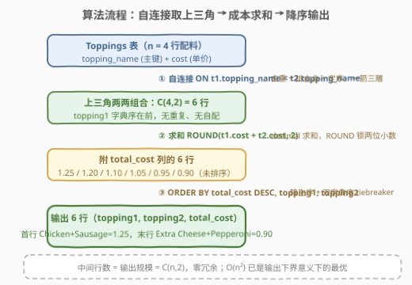
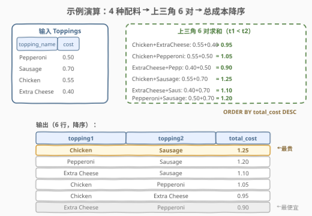

# 披萨配料成本分析

- **题目名称**：披萨配料成本分析
- **链接**：[3050. 披萨配料成本分析](https://leetcode.cn/problems/pizza-toppings-cost-analysis/)
- **难度**：中等
- **标签**：SQL、数据库、自连接（Self Join）、组合枚举、`ORDER BY`、上三角去重

> ⚠️ **注意**：本题是 LeetCode 数据库（SQL）类题目，在 leetcode.cn 上为 Plus/Premium 会员专享题，官方题面不可免费查看。本文题意根据**题目标题（Pizza Toppings Cost Analysis / 披萨配料成本分析）+ 官方示例用例的表结构与输入数据**重建，输出格式为最自然的工程解读，**可能与官方题面的精确列名/列顺序有出入**。核心 SQL 套路（自连接 + `<` 上三角枚举两两组合）不受题面细节影响。本文代码使用 SQL（及 pandas 对照）而非 C++/Python 算法。

## 1. 题目概述

你是一家披萨店的老板。店里的每种配料都有名称与单价，记录在 `Toppings` 表中。顾客点披萨时会**恰好选择两种不同的配料**。你想做一次成本分析：**枚举所有可能的配料两两组合，报告每种组合的总成本**。编写 SQL 查询，列出每一种「两种不同配料」的组合：

- 输出列 `topping1`、`topping2` 为两种配料名，约定 `topping1` 的字典序小于 `topping2`（即同一组合只输出一行，且名字小的在前）；
- 输出列 `total_cost` 为两种配料单价之和，保留两位小数；
- 结果按 `total_cost` **降序**排列；成本相同时按 `topping1`、`topping2` 字典序**升序**排列。

**表结构**（据官方示例用例重建）：

```text
表: Toppings
+--------------+----------+
| Column Name  | Type     |
+--------------+----------+
| topping_name | varchar  |   ← 配料名
| cost         | decimal  |   ← 该配料单价
+--------------+----------+
topping_name 是该表的主键（配料名唯一）。
cost 是添加该配料的单价（正数，两位小数）。
```

> 💡 **审题关键**：① 「两两**组合**」而非排列——$(A,B)$ 与 $(B,A)$ 是同一对披萨配料，只能输出一行；② 「两种**不同**配料」——$(A,A)$ 这种自己配自己的组合被排除；③ 输出约定 `topping1` 字典序在前——组合内还要**定序**。三件事（去重、排自身、定序）在 SQL 里可以用**一个连接条件**同时解决，这正是本题考点。

**示例 1**（据官方示例用例重建，输出为推断）：

```text
输入：
Toppings 表:
+--------------+------+
| topping_name | cost |
+--------------+------+
| Pepperoni    | 0.50 |
| Sausage      | 0.70 |
| Chicken      | 0.55 |
| Extra Cheese | 0.40 |
+--------------+------+

输出:
+--------------+--------------+------------+
| topping1     | topping2     | total_cost |
+--------------+--------------+------------+
| Chicken      | Sausage      | 1.25       |
| Pepperoni    | Sausage      | 1.20       |
| Extra Cheese | Sausage      | 1.10       |
| Chicken      | Pepperoni    | 1.05       |
| Chicken      | Extra Cheese | 0.95       |
| Extra Cheese | Pepperoni    | 0.90       |
+--------------+--------------+------------+
```

**解释**：

| 组合（字典序） | 计算 | total_cost | 排名 |
|----------------|------|-----------|------|
| Chicken, Sausage | $0.55 + 0.70$ | 1.25 | 1 |
| Pepperoni, Sausage | $0.50 + 0.70$ | 1.20 | 2 |
| Extra Cheese, Sausage | $0.40 + 0.70$ | 1.10 | 3 |
| Chicken, Pepperoni | $0.55 + 0.50$ | 1.05 | 4 |
| Chicken, Extra Cheese | $0.55 + 0.40$ | 0.95 | 5 |
| Extra Cheese, Pepperoni | $0.40 + 0.50$ | 0.90 | 6 |

> 💡 4 种配料共有 $\binom{4}{2} = 6$ 种两两组合（不是 $4 \times 3 = 12$ 种），最贵的是 Sausage 搭 Chicken（1.25），最便宜的是两个低价料 Extra Cheese 搭 Pepperoni（0.90）。
>
> ⚠️ 本题面为付费题重建，**输出列名 `topping1`/`topping2`/`total_cost` 及排序细则为推断**，以官方判定为准。但 SQL 核心逻辑（自连接枚举无序对 + 求和 + 排序）不受列名影响。

---

## 2. 解题思路

### 2.1 暴力思路：`<>` 连接生成全排列，事后归一化去重

过程式直觉：把 `Toppings` 和自己连接一遍，条件写「名字不相等」`t1.topping_name <> t2.topping_name`，得到所有有序对 $(A,B)$、$A \ne B$——共 $n(n-1) = 12$ 行（示例 $n=4$）。此时 $(A,B)$ 与 $(B,A)$ 成对出现，是重复的；再用 `LEAST`/`GREATEST` 把每行归一化成「字典序小的在前」，最后 `DISTINCT` 压掉重复：

```text
pairs = []
for t1 in Toppings:
    for t2 in Toppings:
        if t1.name != t2.name:                     # 12 行，含 (A,B) 和 (B,A)
            pairs.append((LEAST(t1.name,t2.name), GREATEST(t1.name,t2.name), t1.cost+t2.cost))
pairs = DISTINCT(pairs)                            # 砍回 6 行
sort pairs by (total_cost desc, topping1, topping2)
```

- **正确性**：`<>` 排除了 $(A,A)$ 自配；`LEAST/GREATEST + DISTINCT` 消掉镜像重复，最终恰剩 $\binom{n}{2}$ 行，正确。
- **效率**：先生成 **2 倍冗余**的 $n(n-1)$ 行，再靠 `DISTINCT`（内部隐式排序/哈希）去重——白做一半功再擦屁股，写法也啰嗦。

> ⚠️ 瓶颈在于「先制造重复、再消除重复」。突破口：把连接条件从「不相等」收紧为「严格小于」——让重复行**从源头就不生成**。

### 2.2 核心观察：`<` 连接——一个不等式同时完成去重与定序


关键洞察：任何一个无序对 $\{A, B\}$（$A \ne B$）的两个有序表示 $(A,B)$、$(B,A)$ 中，**恰好一个**满足字典序 $A < B$。于是把连接条件写成：

$$\texttt{t1.topping\_name < t2.topping\_name}$$

一行条件同时干了三件事：

| 目标 | `<` 是如何做到的 |
|------|------------------|
| ① **去重** | $(A,B)$ 与 $(B,A)$ 只保留 $A<B$ 的那个，每对组合恰好一行，无需 `DISTINCT` |
| ② **排自身** | $A<A$ 恒为假，$(A,A)$ 天然被排除，「两种**不同**配料」自动满足 |
| ③ **定序** | 保留的行天然满足 `topping1` 字典序 < `topping2`，输出列序直接对齐，无需 `LEAST/GREATEST` |

把 $n \times n$ 的自连接结果画成矩阵（行列都按配料名字典序排列）：**对角线**是 $t1 = t2$（同一配料，被 `<` 排除），**下三角**是 $t1 > t2$（镜像重复对，被 `<` 排除），**严格上三角**是 $t1 < t2$——恰好每对组合一行：

$$\#\text{输出行} = \binom{n}{2} = \frac{n(n-1)}{2}$$

> 💡 **口诀：组合枚选用 `<`，排列枚选用 `<>`**。凡是要「同表两两组合」，先想 `<` 上三角；只有明确要区分方向（如比赛的「主 vs 客」）才用 `<>`。这一招在 197（昨天比今天温度）、181（员工 vs 经理）等经典自连接题中反复出现，只是那里比的是**数值/日期**，本题比的是**字符串字典序**。

### 2.3 算法流程图



**逻辑执行步骤**：

| 步骤 | 表达式 | 作用 |
|------|--------|------|
| ① 自连接 | `FROM Toppings t1 JOIN Toppings t2 ON t1.topping_name < t2.topping_name` | 生成字典序严格上三角的两两组合，天然去重 + 排自身 + 定序 |
| ② 求和 | `ROUND(t1.cost + t2.cost, 2) AS total_cost` | 两种配料单价相加，`ROUND` 锁定两位小数 |
| ③ 排序 | `ORDER BY total_cost DESC, topping1, topping2` | 总成本降序；并列时按配料名字典序升序，保证输出确定 |

> 💡 **为什么 `INNER JOIN` 就够？** 表与自己连接，两侧行数相同、主键对齐，没有「匹配不上」的问题——自连接里 `JOIN` 与 `INNER JOIN` 等价，且永远不需要 `LEFT JOIN` 补空。

### 2.4 示例演算

以官方示例的 4 种配料走一遍「上三角 → 求和 → 排序」链路：



**上三角 6 对**（行 `t1`、列 `t2`，按字典序 Chicken < Extra Cheese < Pepperoni < Sausage）：

| t1 | t2 | 成本算式 | total_cost |
|----|----|----------|-----------|
| Chicken | Extra Cheese | $0.55 + 0.40$ | 0.95 |
| Chicken | Pepperoni | $0.55 + 0.50$ | 1.05 |
| Chicken | Sausage | $0.55 + 0.70$ | **1.25**（最贵） |
| Extra Cheese | Pepperoni | $0.40 + 0.50$ | 0.90 |
| Extra Cheese | Sausage | $0.40 + 0.70$ | 1.10 |
| Pepperoni | Sausage | $0.50 + 0.70$ | 1.20 |

**排序输出**（`total_cost` 降序）：1.25 → 1.20 → 1.10 → 1.05 → 0.95 → 0.90，恰好 6 行。

> 💡 **三个观察要点**：① 含 Sausage（0.70，最贵料）的三对包揽前三名——单料价格直接抬升组合排名；② 最便宜组合 Extra Cheese + Pepperoni（0.90）恰由两个次低价料构成，但**不**是最便宜料配第二便宜料之外的情形——排序以**和**为准，不按单料；③ 示例无并列成本，若两对成本相同则按 `topping1`、`topping2` 字典序升序决胜负，保证输出唯一确定。

---

## 3. 参考代码

### SQL（自连接 + `<` 上三角，推荐）

```sql
SELECT t1.topping_name AS topping1,
       t2.topping_name AS topping2,
       ROUND(t1.cost + t2.cost, 2) AS total_cost
FROM Toppings AS t1
JOIN Toppings AS t2
  ON t1.topping_name < t2.topping_name
ORDER BY total_cost DESC, topping1 ASC, topping2 ASC;
```

> 💡 **写法要点**：
> - 连接条件 `t1.topping_name < t2.topping_name` 是全题题眼——一个 `<` 同时完成**去重**（上三角）、**排自身**（`<` 不含等号）与**定序**（topping1 字典序在前）。
> - `ROUND(x, 2)`：`cost` 为 `decimal` 两位小数，求和后可能出现浮点尾差（`0.55+0.40` 在二进制浮点下不精确），`ROUND` 锁定展示精度，稳。
> - `ORDER BY total_cost DESC, topping1, topping2`：降主序 + 双字典序 tiebreaker，与题面约定一致；`ASC` 可省略（默认升序），显式写出更醒目。
> - 两表别名 `t1`/`t2` 必不可少——同表自连接不加别名会报「表名歧义」错误。

### SQL（暴力对照：`<>` + `LEAST/GREATEST` + `DISTINCT`）

```sql
SELECT DISTINCT
       LEAST(t1.topping_name, t2.topping_name)    AS topping1,
       GREATEST(t1.topping_name, t2.topping_name) AS topping2,
       ROUND(t1.cost + t2.cost, 2)                AS total_cost
FROM Toppings AS t1
JOIN Toppings AS t2
  ON t1.topping_name <> t2.topping_name
ORDER BY total_cost DESC, topping1 ASC, topping2 ASC;
```

> ⚠️ **对照要点**：结果与推荐解完全一致，但生成 $n(n-1) = 12$ 行（含镜像重复）再靠 `DISTINCT` 压回 6 行——先制造重复再消除重复。当 $n$ 变大时中间结果翻倍，`DISTINCT` 还要额外排序/哈希。面试中写出这一版说明理解了组合语义，但主动升级到 `<` 版才是加分项。

### Python（pandas）

```python
import pandas as pd

def pizza_toppings_cost_analysis(toppings: pd.DataFrame) -> pd.DataFrame:
    left = toppings.rename(columns={'topping_name': 'topping1', 'cost': 'cost1'})
    right = toppings.rename(columns={'topping_name': 'topping2', 'cost': 'cost2'})
    df = left.merge(right, how='cross')
    df = df[df['topping1'] < df['topping2']].copy()
    df['total_cost'] = (df['cost1'] + df['cost2']).round(2)
    return (df[['topping1', 'topping2', 'total_cost']]
            .sort_values(['total_cost', 'topping1', 'topping2'],
                         ascending=[False, True, True], ignore_index=True))
```

> 💡 **pandas 对照**：
> - `merge(how='cross')` 笛卡尔积等价于无条件自连接，得 $n^2 = 16$ 行；布尔掩码 `df['topping1'] < df['topping2']` 等价于 SQL 的 `ON t1.topping_name < t2.topping_name`——同一招：一个比较同时去重、排自身、定序。
> - 改名列（`topping1/cost1`、`topping2/cost2`）避免 cross merge 后缀 `.x/.y` 混乱。
> - `.round(2)` 对应 SQL 的 `ROUND(x, 2)`；`ascending=[False, True, True]` 对应 `ORDER BY total_cost DESC, topping1, topping2`。
> - ⚠️ 若 pandas 版本较低不支持 `how='cross'`（需 1.2.0+），可用 `left.assign(key=1).merge(right.assign(key=1), on='key').drop('key', axis=1)` 手工造笛卡尔积。

---

## 4. 复杂度分析

设 $n$ = `Toppings` 行数。

| 维度 | 复杂度 | 说明 |
|------|--------|------|
| **时间** | $O(n^2 \log n)$ | 生成 $\binom{n}{2}$ 行 + `ORDER BY` 排序，由排序主导 |
| **空间** | $O(n^2)$ | 连接中间结果即最终结果规模 |
| **中间行数** | $\binom{n}{2} = \frac{n(n-1)}{2}$ | 上三角恰好等于输出规模，**零冗余** |
| **是否需排序** | 是 | `ORDER BY total_cost DESC, topping1, topping2` |
| **JOIN 类型** | SELF JOIN（INNER） | 同表两次，`<` 条件切出上三角 |

> - **时间**：自连接产生 $\binom{n}{2}$ 行（示例 $n=4$ 时 6 行），每行 $O(1)$ 求和；`ORDER BY` 对 $\binom{n}{2}$ 行排序 $O(n^2 \log n)$，为主导项。
> - **空间**：连接结果物化 $\binom{n}{2}$ 行。
> - ⚠️ **$O(n^2)$ 是「最优」的**：输出本身就有 $\binom{n}{2}$ 行——任何正确算法至少要写这么多行，故生成上三角已是输出规模的线性级别，没有低于 $O(n^2)$ 的可能。这与 197/181 那类「自连接但输出 $O(n)$ 行」的题不同：那类题可用窗口函数把平方降到线性，本题**输出规模决定下界**。
> - **对比暴力 `<>` 版**：中间行数 $n(n-1)$ 是上三角版的 2 倍，外加 `DISTINCT` 的去重开销——常数更差，渐近相同。

---

## 5. 扩展

### 5.1 恰好 k 种配料：`<` 链多路自连接

若披萨改为**恰好 3 种不同配料**，把 `<` 链式串起来即可——`t1 < t2 < t3` 保证三个名字严格递增（即组合的唯一有序表示），输出 $\binom{n}{3}$ 行：

```sql
SELECT t1.topping_name AS topping1,
       t2.topping_name AS topping2,
       t3.topping_name AS topping3,
       ROUND(t1.cost + t2.cost + t3.cost, 2) AS total_cost
FROM Toppings AS t1
JOIN Toppings AS t2 ON t1.topping_name < t2.topping_name
JOIN Toppings AS t3 ON t2.topping_name < t3.topping_name
ORDER BY total_cost DESC, topping1, topping2, topping3;
```

> 💡 严格不等式链 $t_1 < t_2 < \cdots < t_k$ 是「k 元组合枚举」的通用 SQL 模板——每个组合恰对应一条递增序列，天然无重复。

### 5.2 允许重复配料：`<` 改 `<=`

若允许「双份 Pepperoni」这类重复选择，对角线 $(A,A)$ 也要保留——条件改为 `t1.topping_name <= t2.topping_name`，输出 $\binom{n}{2} + n = \frac{n(n+1)}{2}$ 行。**一个等号之差，语义从组合变多重组合**，务必与题面确认。

### 5.3 加约束 / 取 Top-1

- 只看预算内的组合：在最外层加 `HAVING total_cost <= 1.00`（或包一层 CTE 后 `WHERE`）；
- 只要最贵的一种：`ORDER BY total_cost DESC LIMIT 1`；
- 统计「每出现一个 Sausage 组合的成本总和」：在上三角查询外包 `GROUP BY` 聚合。

---

## 6. 面试要点

**Q1：为什么连接条件用 `<` 而不是 `<>`？**

> 无序对 $\{A,B\}$ 有两个有序表示 $(A,B)$、$(B,A)$，其中**恰好一个**满足字典序 $A<B$。用 `<` 连接，每对组合天然只出现一行——去重、排自身（$A<A$ 恒假）、定序（topping1 在前）一箭三雕。用 `<>` 则两个方向都生成，得到 $n(n-1)$ 行含镜像重复，还得补 `LEAST/GREATEST + DISTINCT` 收拾，中间结果翻倍且写法啰嗦。口诀：**组合用 `<`，排列用 `<>`**。

**Q2：`<` 连接之后为什么不需要 `DISTINCT`？会不会少行或漏对？**

> 不会。上三角与全部组合是**双射**：任取一对不同配料 $\{A,B\}$，设 $A<B$，则连接结果中恰有 $(t1{=}A,\ t2{=}B)$ 一行保留它、$(t1{=}B,\ t2{=}A)$ 一行被 `<` 过滤——一进一出，不多不少。行数恒为 $\binom{n}{2}$；`DISTINCT` 只在 `<>` 版里需要，因为那里同一组合有两个有序表示。

**Q3：字符串的 `<` 比较要注意什么？**

> SQL 中字符串比较依赖**排序规则（collation）**：大小写是否敏感、重音是否敏感都由它决定。MySQL 常见的 `_ci` 后缀表示大小写不敏感（`'apple' = 'APPLE'`），此时 `<` 按不区分大小的字典序；若需严格二进制序可用 `STRCMP` 或指定 `_bin` 排序规则。本题配料名首字母互不相同（C/E/P/S），任何常见 collation 结论一致；但生产环境中**排序规则不一致是自连接去重的经典坑**（两个表 join 列 collation 不同会报错或漏匹配）。

**Q4：题目若允许两种相同配料，只改哪里？**

> `t1.topping_name < t2.topping_name` 改成 `<=`。等号放进对角线 $(A,A)$（同一种配料选两份），输出从 $\binom{n}{2} = \frac{n(n-1)}{2}$ 行变为 $\frac{n(n+1)}{2}$ 行，多出的恰好 $n$ 行是「双份同料」。注意此时 `topping1 = topping2` 的行语义是「双份」，成本要算两遍（`t1.cost + t2.cost` 恰好自动正确）。

**Q5：这题时间复杂度 $O(n^2)$，还能优化吗？**

> 不能，也无需。输出本身就有 $\binom{n}{2} = O(n^2)$ 行，任何正确算法的写下界就是输出规模——生成上三角已是「对输出线性」。这与「自连接但输出 $O(n)$ 行」的题（如 197 找升温的昨天：中间 $n^2$、输出 $n$，可用窗口函数 `LAG` 降到 $O(n \log n)$）本质不同：**先问输出规模，再谈优化**。面试中点破这一点比优化本身更加分。

> 💡 **一句话总结**：3050 是 SQL **「自连接 + `<` 上三角枚举两两组合」**招牌题——核心模板 `FROM Toppings t1 JOIN Toppings t2 ON t1.topping_name < t2.topping_name` 一个不等式同时完成去重、排自身、定序，再 `ROUND(t1.cost + t2.cost, 2)` 求和、`ORDER BY total_cost DESC` 输出；输出规模 $\binom{n}{2}$ 即复杂度下界，$O(n^2)$ 已最优。

---

## 7. 同类练习题

- [602. 好友申请 II：谁有最多的好友](https://leetcode.cn/problems/friend-requests-ii-who-has-most-friends/)（[站内题解](../0601-0700/602_好友申请II谁有最多的好友.md)）：同为**同表两两关系**的自连接——请求表两个方向（ requester_id / accepter_id）各算一遍再聚合，对照本题「上三角只算一遍」的去重取舍
- [197. 上升的温度](https://leetcode.cn/problems/rising-temperature/)：自连接经典入门——`DATEDIFF(w1.recordDate, w2.recordDate) = 1 AND w1.temperature > w2.temperature`，比的是**日期/数值**，本题比的是**字符串字典序**，同一招不同比较维度
- [181. 超过经理收入的员工](https://leetcode.cn/problems/employees-earning-more-than-their-managers/)：自连接的「同表两种角色」形态——员工表连出经理视角后比工资，体会别名 `e`/`m` 与本题 `t1`/`t2` 的同构性
- [196. 删除重复的电子邮箱](https://leetcode.cn/problems/delete-duplicate-emails/)：自连接处理**重复行**——`p1.email = p2.email AND p1.id > p2.id` 保留最小 id，与本题 `<` 的「保一半、去一半」异曲同工（等值配重复、不等式定去留）

> 💡 以上 4 题覆盖自连接的「组合枚举 / 相邻比较 / 角色对照 / 去重保留」四种形态，配合本题可一次吃透 Self Join。
