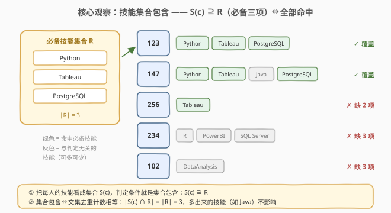
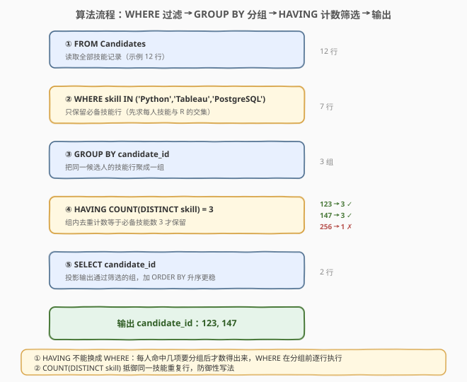
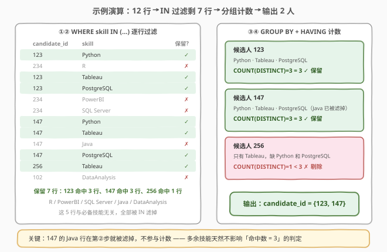

# LeetCode 寻找数据科学家职位的候选人 题解

## 1. 题目概述

- **标题 / 题号**：寻找数据科学家职位的候选人（#3051，easy）
- **链接**：https://leetcode.cn/problems/find-candidates-for-data-scientist-position/
- **难度**：简单
- **标签**：数据库、SQL、关系除法、`GROUP BY` + `HAVING`、`COUNT(DISTINCT)`、集合包含

> ⚠️ 本题为 LeetCode 付费题，题意描述根据官方示例用例与外部资料重建，可能与官方题面有出入。

**表结构**：`Candidates`

| 列名 | 类型 |
|------|------|
| candidate_id | int |
| skill | varchar |

- `(candidate_id, skill)` 是这张表的主键（联合主键）。
- 每行表示「候选人 `candidate_id` 掌握技能 `skill`」；同一候选人可以有多行（每项技能一行）。

**背景**：公司正在招聘**数据科学家**。该职位要求候选人**同时掌握**以下三项技能：

- `Python`
- `Tableau`
- `PostgreSQL`

**目标**：写一条 SQL 查询，找出**同时具备上述全部三项技能**的候选人，返回其 `candidate_id`（按升序排列）。

**示例 1**：

```text
输入：Candidates 表
+--------------+--------------+
| candidate_id | skill        |
+--------------+--------------+
| 123          | Python       |
| 234          | R            |
| 123          | Tableau      |
| 123          | PostgreSQL   |
| 234          | PowerBI      |
| 234          | SQL Server   |
| 147          | Python       |
| 147          | Tableau      |
| 147          | Java         |
| 147          | PostgreSQL   |
| 256          | Tableau      |
| 102          | DataAnalysis |
+--------------+--------------+

输出：
+--------------+
| candidate_id |
+--------------+
| 123          |
| 147          |
+--------------+
```

**解释**：

| candidate_id | 技能集合 | 是否覆盖三项必备技能 | 判定 |
|-------------|----------|----------------------|------|
| 123 | {Python, Tableau, PostgreSQL} | 覆盖 | ✓ 输出 |
| 234 | {R, PowerBI, SQL Server} | 一项都没有 | ✗ |
| 147 | {Python, Tableau, Java, PostgreSQL} | 覆盖（Java 是多余技能，不影响） | ✓ 输出 |
| 256 | {Tableau} | 只有 1 项 | ✗ |
| 102 | {DataAnalysis} | 一项都没有 | ✗ |

**约束条件**（重建推测）：

- `candidate_id` 为正整数，`skill` 为技能名字符串。
- 表中不存在完全相同的 `(candidate_id, skill)` 行（联合主键保证）。

> 💡 本题是 SQL **「关系除法」（Relational Division）** 的入门变体：判定「某候选人的技能集合**包含**一个固定的必备技能集合」。与 1045「买下所有产品的客户」同模板，只是这里必备集合是**字面量硬编码**（3 项），而不是来自另一张表——因此连子查询都不需要，一行 `HAVING COUNT(DISTINCT skill) = 3` 收工。

## 2. 解题思路

### 2.1 暴力思路：三重自连接逐技能对齐

最直接的写法：把 `Candidates` 表自连接 3 次，每次连接负责「钉死」一项必备技能——

```sql
SELECT DISTINCT c1.candidate_id
FROM Candidates c1
JOIN Candidates c2 ON c1.candidate_id = c2.candidate_id AND c2.skill = 'Tableau'
JOIN Candidates c3 ON c1.candidate_id = c3.candidate_id AND c3.skill = 'PostgreSQL'
WHERE c1.skill = 'Python';
```

逻辑正确（以 c1 锁 Python、c2 锁 Tableau、c3 锁 PostgreSQL，三者同 `candidate_id` 即三项全中），但明显笨重：

- **不可扩展**：必备技能每加一项就要多一层 `JOIN`，k 项技能 → k 重连接，SQL 文本随需求膨胀。
- **依赖 `DISTINCT` 收尾**：同一候选人的多行匹配会产生笛卡尔式的重复行，必须再兜一层去重。
- **语义不透明**：读代码的人要同时在脑子里维护三个别名，才能看出「包含三项技能」这一意图。

> ⚠️ 暴力思路的根本问题：把「**集合包含**」这一整体判定，拆成了 k 个两两对齐的连接条件。它没有抓住问题的本质——我们要问的是「这个人**命中了几项**必备技能」，而计数天然是 `GROUP BY` 的强项。

### 2.2 核心观察：技能集合包含 ⇔ 命中去重计数 = 3



**把每个候选人的技能看成一个集合** $S(c)$，职位要求是固定集合 $R = \{\text{Python}, \text{Tableau}, \text{PostgreSQL}\}$。判定条件就是**集合包含**：

$$S(c) \supseteq R \iff |S(c) \cap R| = |R| = 3$$

这个等价式是整道题的钥匙：

- **必要性**：若 $S(c) \supseteq R$，则 $R$ 的三个元素都在 $S(c)$ 里，交集就是 $R$ 本身，计数自然为 3。
- **充分性**：交集至多是 $R$（交集元素必属于 $R$），计数达到 3 意味着三项全中，没有缺漏。
- **多余技能免疫**：候选人的其它技能（如 147 的 Java）不属于 $R$，不进入交集，天然不影响判定——这正是「包含」而非「相等」的语义。

**翻译成 SQL 三步**：

1. `WHERE skill IN ('Python', 'Tableau', 'PostgreSQL')`——把每人的技能行限制在 $R$ 内，剩下的就是交集 $S(c) \cap R$；
2. `GROUP BY candidate_id`——把交集行按候选人归组；
3. `HAVING COUNT(DISTINCT skill) = 3`——组内**去重计数**等于 $|R| = 3$ 即全覆盖。

> 💡 **为什么是 `COUNT(DISTINCT)` 而不是 `COUNT(*)`**：本题 `(candidate_id, skill)` 是联合主键，同一技能不会重复出现，两者结果相同。但 `COUNT(DISTINCT skill)` 是**防御性写法**——若表结构没有主键约束、或脏数据导致同一技能出现多行，`COUNT(*)` 会把「Python 重复 3 次」误判为「命中 3 项」。集合语义的计数就该去重。

### 2.3 算法流程图



**逻辑执行步骤**：

| 步骤 | 子句 | 作用 | 本题对应 |
|------|------|------|----------|
| ① | `FROM Candidates` | 读取全部技能记录 | 示例 12 行 |
| ② | `WHERE skill IN (…)` | 只保留必备技能行（求每人交集） | 12 行 → 7 行 |
| ③ | `GROUP BY candidate_id` | 按候选人聚合成组 | 3 组：123 / 147 / 256 |
| ④ | `HAVING COUNT(DISTINCT skill) = 3` | 组内去重计数 = 3 才保留 | 123:3 ✓、147:3 ✓、256:1 ✗ |
| ⑤ | `SELECT candidate_id` | 投影输出 + 升序排序 | 输出 123, 147 |

> 💡 **`WHERE` 与 `HAVING` 的分工**：`WHERE` 在分组**前**逐行过滤（按技能名筛行），`HAVING` 在分组**后**按聚合值筛组（按命中数筛人）。「每项技能是否在必备清单里」是行级事实，交给 `WHERE`；「某人共命中几项」是组级事实，只能交给 `HAVING`——聚合计数在 `GROUP BY` 之后才产生，`WHERE` 里连 `COUNT` 都写不了。

### 2.4 示例演算

以示例 1 的 12 行数据走一遍完整流水线：



**步骤 ①②：FROM + WHERE IN（逐行过滤）**

| candidate_id | skill | 在 R 内？ | 保留？ |
|--------------|-------|-----------|--------|
| 123 | Python | ✓ | 保留 |
| 234 | R | ✗ | 丢弃 |
| 123 | Tableau | ✓ | 保留 |
| 123 | PostgreSQL | ✓ | 保留 |
| 234 | PowerBI | ✗ | 丢弃 |
| 234 | SQL Server | ✗ | 丢弃 |
| 147 | Python | ✓ | 保留 |
| 147 | Tableau | ✓ | 保留 |
| 147 | Java | ✗ | 丢弃 |
| 147 | PostgreSQL | ✓ | 保留 |
| 256 | Tableau | ✓ | 保留 |
| 102 | DataAnalysis | ✗ | 丢弃 |

过滤后剩 7 行：123 有 3 行、147 有 3 行、256 有 1 行。

**步骤 ③④：GROUP BY + HAVING（分组计数筛选）**

| 分组（candidate_id） | 组内技能（已去重） | COUNT(DISTINCT skill) | = 3 ? | 判定 |
|---------------------|--------------------|-----------------------|-------|------|
| 123 | Python, Tableau, PostgreSQL | 3 | 是 | 保留 |
| 147 | Python, Tableau, PostgreSQL（Java 已在第②步被滤掉） | 3 | 是 | 保留 |
| 256 | Tableau | 1 | 否 | 剔除 |

**步骤 ⑤：SELECT 输出**

| candidate_id |
|--------------|
| 123 |
| 147 |

> 💡 **注意 147 的 Java 行去哪了**：它在第②步 `WHERE IN` 时就被滤掉，根本不参与计数。这就是「先过滤再分组」的妙处——交集在分组前就已经算好，`HAVING` 只需比较计数。若不先过滤，就得在 `HAVING` 里写条件聚合（见解法 B）。

## 3. 参考代码

### SQL（解法 A：`IN` + `GROUP BY` + `HAVING`，推荐）

```sql
SELECT candidate_id
FROM Candidates
WHERE skill IN ('Python', 'Tableau', 'PostgreSQL')
GROUP BY candidate_id
HAVING COUNT(DISTINCT skill) = 3
ORDER BY candidate_id;
```

> 💡 **写法要点**：
> - **`WHERE … IN`**：先把每人技能限制在必备三项内（求交集），减小组的规模。
> - **`COUNT(DISTINCT skill) = 3`**：去重计数等于必备技能数，即三项全中；`DISTINCT` 抵御重复行。
> - **`ORDER BY candidate_id`**：升序输出；若判题不要求顺序也可省略，写上更稳。
> - ✓ **最推荐**：语义与「集合包含」一一对应，三行子句各司其职，且天然可扩展（见解法 C / 1045 母题）。

### SQL（解法 B：条件聚合，免子查询过滤）

```sql
SELECT candidate_id
FROM Candidates
GROUP BY candidate_id
HAVING SUM(skill = 'Python') > 0
   AND SUM(skill = 'Tableau') > 0
   AND SUM(skill = 'PostgreSQL') > 0
ORDER BY candidate_id;
```

> 💡 **解法 B 的思路**：不做 `WHERE` 预过滤，直接对全表分组，用**条件聚合**逐项点名——`SUM(skill = 'Python')` 统计组内 Python 行数（MySQL 布尔表达式返回 0/1），大于 0 即拥有该技能；三项同时 `AND` 起来即全覆盖。
>
> **与解法 A 的区别**：解法 B 不依赖 `IN` 清单与计数一致（技能清单出现在两处：三个条件各写一次），少了「清单改了忘同步计数」的风险面，但多了 `HAVING` 里的重复样板；MySQL 布尔求和写法在 PostgreSQL 中需换成 `SUM(CASE WHEN skill = 'Python' THEN 1 ELSE 0 END) > 0` 或 `COUNT(*) FILTER (WHERE …)`（标准写法 `COUNT(*) FILTER` 为 SQL:2003 特性，PostgreSQL/SQLite 3.30+ 支持，MySQL 8 尚不支持）。

### SQL（解法 C：双重 `NOT EXISTS`，关系除法范式）

```sql
SELECT DISTINCT c.candidate_id
FROM Candidates c
WHERE NOT EXISTS (
    SELECT 1
    FROM (SELECT 'Python' AS skill
          UNION ALL SELECT 'Tableau'
          UNION ALL SELECT 'PostgreSQL') req
    WHERE NOT EXISTS (
        SELECT 1
        FROM Candidates c2
        WHERE c2.candidate_id = c.candidate_id
          AND c2.skill = req.skill
    )
)
ORDER BY c.candidate_id;
```

> 💡 **解法 C 的思路**：这是关系代数中**关系除法** $R \div S$ 的标准 SQL 表达——外层「不存在一项必备技能」+ 内层「该候选人没有这项技能」，双重否定表全称肯定：**不存在候选人缺的必备技能 ⇔ 候选人拥有全部必备技能**。
>
> 与解法 A 语义完全等价，但范式更通用：当必备清单不是字面量而是独立的 `RequiredSkills` 表时，把 `FROM (… UNION ALL …)` 换成 `FROM RequiredSkills` 即可，一个字符都不用多改。缺点是嵌套两层相关子查询，可读性对新手不友好；现代优化器通常会把 `NOT EXISTS` 改写为反连接（Anti-Join），性能与聚合写法相近，但无索引时最坏是 $O(n \cdot k)$（$k$ 为必备技能数）。

### Python（pandas）

```python
import pandas as pd

def find_candidates(candidates: pd.DataFrame) -> pd.DataFrame:
    required = {'Python', 'Tableau', 'PostgreSQL'}
    hits = (candidates[candidates['skill'].isin(required)]
            .groupby('candidate_id')['skill']
            .nunique())
    return (pd.DataFrame({'candidate_id': hits[hits == len(required)].index})
            .sort_values('candidate_id'))
```

> 💡 **pandas 对照**（付费题无官方函数签名，函数名按题名约定）：
> - **`isin(required)`**：对应 `WHERE skill IN (…)`，布尔索引过滤行。
> - **`groupby(...)['skill'].nunique()`**：对应 `GROUP BY candidate_id` + `COUNT(DISTINCT skill)`，`nunique()` 就是去重计数。
> - **`hits == len(required)`**：命中数等于必备技能数（用 `len(required)` 而非魔法数字 3，清单变更时只改一处）。

## 4. 复杂度分析

设 $n$ 为 `Candidates` 表行数，$k$ 为必备技能数（本题 $k = 3$），$g$ 为候选人个数。

| 维度 | 解法 A（聚合，推荐） | 解法 B（条件聚合） | 解法 C（双重 NOT EXISTS） | pandas |
|------|----------------------|--------------------|---------------------------|--------|
| **时间** | $O(n)$ | $O(n)$ | 最坏 $O(n \cdot k)$，有索引/改写为反连接后 $\approx O(n)$ | $O(n)$ |
| **空间** | $O(g \cdot k)$ | $O(g)$ | $O(1)$ 额外（不含输出） | $O(n)$ |
| **可读性** | ✓ 三行各司其职 | ✓ 但样板重复 | ⚠ 嵌套两层，需懂关系除法 | ✓ 简洁 |
| **可扩展性** | ✓ 清单变表后改子查询 | ⚠ 每加一项技能多一个条件 | ✓✓ 范式级通用 | ✓ |
| **推荐度** | ✓ **首选** | ✓ 备选 | ✓ 学范式 | ✓ 验证用 |

> - **时间**：解法 A/B 都是「一次扫描 + 哈希分组」的线性过程；$k = 3$ 是常数，过滤后每组至多 $k$ 行，分组代价 $O(n)$。解法 C 的相关子查询在无索引时对外层每行（或每人）都要探测 $k$ 次内层，最坏 $O(n \cdot k)$，本题 $k$ 小到可以忽略。
> - **空间**：解法 A 分组时最多为每个候选人缓存 $k$ 行命中记录，即 $O(g \cdot k)$；解法 B 每组只维护 $k$ 个累加器，$O(g)$；pandas 需要把整个 DataFrame 载入内存，$O(n)$。
> - **索引**：`(skill, candidate_id)` 复合索引可以让 `WHERE skill IN (…)` 走索引范围扫描后直接覆盖分组（索引即 `(skill, candidate_id)` 序，命中行天然按技能聚簇）；`(candidate_id, skill)` 索引则加速解法 C 的内层探测。数据量大时，前者对本解法收益最大。

## 5. 扩展：从字面量清单到关系除法母题

本题的必备技能是**硬编码的 3 项字面量**，所以 `HAVING COUNT(DISTINCT skill) = 3` 里的 3 直接写死。真实的面试与生产场景中，「全集」往往来自**另一张表**且会随业务变化——这就升级为关系除法母题（对应 [1045. 买下所有产品的客户](https://leetcode.cn/problems/customers-who-bought-all-products/)）。

### 5.1 全集在表里：子查询动态计数

设必备技能表 `RequiredSkills(skill)`，只需把写死的 3 换成子查询：

```sql
SELECT candidate_id
FROM Candidates
WHERE skill IN (SELECT skill FROM RequiredSkills)
GROUP BY candidate_id
HAVING COUNT(DISTINCT skill) = (SELECT COUNT(*) FROM RequiredSkills);
```

清单加一项技能，查询一个字符不用改——这是「全集动态化」的标准手法。

### 5.2 `COUNT(*)` 与 `COUNT(DISTINCT)` 的选择

| 场景 | 写法 | 理由 |
|------|------|------|
| `(candidate_id, skill)` 联合主键（本题） | `COUNT(*)` 与 `COUNT(DISTINCT skill)` 等价 | 主键保证无重复行 |
| 无主键约束 / 允许重复投递 | 必须 `COUNT(DISTINCT skill)` | 「Python 重复 3 次」≠「命中 3 项」 |
| 全集表本身有重复 | 先 `SELECT DISTINCT skill FROM RequiredSkills` | 分子分母口径要一致 |

> 💡 计数判等式的隐含前提是「交集 ⊆ 全集」。1045 中 `Customer.product_key` 是外键指向 `Product`，保证买的一定在全集内；本题 `WHERE IN (…)` 主动把行限制在清单内，同样保证了这一前提。若数据可能「越界」（如技能表里混入了清单外的脏数据），必须先用 `IN`/`EXISTS` 限定范围，否则计数相等可能是「越界项凑数」造成的假命中。

### 5.3 关系除法的三种表达范式

| 范式 | 核心语句 | 特点 |
|------|----------|------|
| **聚合计数** | `GROUP BY + HAVING COUNT(DISTINCT …) = (SELECT COUNT …)` | 最直观，首选 |
| **条件聚合** | `HAVING SUM(cond1) > 0 AND SUM(cond2) > 0 …` | 免预过滤，但条件随 $k$ 膨胀 |
| **双重 `NOT EXISTS`** | 外层不存在缺项 + 内层验证缺项 | 关系代数 $R \div S$ 的标准表达，最通用 |

三者语义等价，面试中能讲清「聚合计数 ⇔ 双重否定」的转换关系，就等于把关系除法讲透了。

## 6. 面试要点

1. **为什么判定「三项全中」必须用 `HAVING` 而不能用 `WHERE`？**

   > `WHERE` 在 `GROUP BY` **之前**逐行执行，此时「某候选人共命中几项必备技能」这一聚合值还不存在；`WHERE` 中也不允许出现 `COUNT` 等聚合函数。技能是否在必备清单内是**行级**事实（`WHERE skill IN (…)`），命中几项是**组级**事实（`HAVING COUNT(DISTINCT skill) = 3`）。两者的分工正是 SQL 逻辑执行顺序（`FROM` → `WHERE` → `GROUP BY` → `HAVING` → `SELECT` → `ORDER BY`）的直接体现。

2. **`COUNT(*)` 和 `COUNT(DISTINCT skill)` 在本题里有什么区别？**

   > 本题 `(candidate_id, skill)` 是联合主键，组内技能天然无重复，两者结果相同。但若表没有主键约束、或上游数据可能重复（同一技能投递多次），`COUNT(*)` 会把「Python 重复出现 3 次」误判为「命中 3 项技能」；`COUNT(DISTINCT skill)` 按技能去重，真正表达「命中了几个**不同**技能」。语义上我们数的是集合大小，去重是必要的防御。

3. **如果候选人的技能表允许脏数据（技能名大小写不一，如 `python` / `Python`）怎么办？**

   > 在计数前做规范化：`WHERE LOWER(skill) IN ('python', 'tableau', 'postgresql')` 并同时 `GROUP BY candidate_id, LOWER(skill)`，或直接 `COUNT(DISTINCT LOWER(skill))`。注意函数包裹列后索引失效（非 SARGable），数据量大时可考虑冗余一列规范化后的技能名并建索引，或用函数索引。

4. **什么是关系除法？本题和 1045 的关系是什么？**

   > 关系除法 $R \div S$ 回答「$R$ 中哪些分组与 $S$ 的**所有**元素都发生了关联」——本题即「哪些候选人与三项必备技能都关联」。1045（客户买下**所有**产品）是全集来自另一张表的标准版，本题是把全集退化为字面量清单的简化版。核心公式同源：`HAVING COUNT(DISTINCT 关联列) = 全集大小`，或等价的双重 `NOT EXISTS`。

5. **数据量很大时如何优化这条查询？**

   > 三层优化：① **索引**——建 `(skill, candidate_id)` 复合索引，`WHERE skill IN (…)` 走范围扫描且索引序天然按 `(skill, candidate_id)` 聚簇，分组几乎免费；② **预过滤下推**——`IN` 清单把参与分组的数据从全表压到 $O(g \cdot k)$ 行，这是解法 A 比解法 B 快的关键（解法 B 全表分组后才在 `HAVING` 里丢条件）；③ **物化**——若技能清单高频变更且查询 QPS 高，可把「候选人 × 命中数」物化为汇总表，写路径维护计数。

> 💡 **一句话总结**：3051 是关系除法的「字面量版」入门题——核心就一句 `WHERE skill IN (三项) GROUP BY candidate_id HAVING COUNT(DISTINCT skill) = 3`。考点不在语法难度，而在三点：**把「同时具备 k 项」翻译成「去重计数 = k」的集合包含思维、`WHERE`/`HAVING` 的行级/组级分工、`COUNT(DISTINCT)` 对重复行的防御**。掌握这条公式，1045 的「买下所有产品」和一切「关联了全部」类 SQL 题都是同一把钥匙。

## 同类练习题

| # | 题目 | 与本题的关联 |
|---|------|-------------|
| 1045 | [买下所有产品的客户](https://leetcode.cn/problems/customers-who-bought-all-products/)（[题解](../1001-1100/1045_买下所有产品的客户.md)） | **关系除法母题**——本题的「全集动态化」完整版，必备清单来自 `Product` 表，`HAVING COUNT(DISTINCT …) = (SELECT COUNT(*) …)` 套同一公式，另有双重 `NOT EXISTS` 范式对照 |
| 2041 | [面试中被录取的候选人 🔒](https://leetcode.cn/problems/accepted-candidates-from-the-interviews/)（[题解](../2001-2100/2041_面试中被录取的候选人.md)） | 同为「候选人聚合判定」场景——在 `GROUP BY + HAVING` 上叠加多年经验与多轮面试的复合条件，是本题条件聚合思路的进阶练习 |
| 182 | [查找重复的电子邮箱](https://leetcode.cn/problems/duplicate-emails/)（[题解](../0101-0200/182_查找重复的电子邮箱.md)） | `GROUP BY + HAVING` 入门——182 比「次数 ≥ 2」，本题比「计数 = 3」，同一分组筛组模板换谓词 |
| 586 | [订单最多的客户](https://leetcode.cn/problems/customer-placing-the-largest-number-of-orders/)（[题解](../0501-0600/586_订单最多的客户.md)） | `GROUP BY + HAVING` 与聚合极值联动——`HAVING COUNT(*) = (SELECT MAX …)`，与 1045 的「计数 = 子查询」手法同构，巩固子查询阈值写法 |
| 1607 | [没有卖出的卖家 🔒](https://leetcode.cn/problems/sellers-with-no-sales/)（[题解](../1601-1700/1607_没有卖出的卖家.md)） | **反向覆盖**对照题——本题找「全覆盖」（全部技能命中），1607 找「零覆盖」（没有任何交易），两个方向的集合判定合起来覆盖按关联覆盖度筛行的完整光谱 |
