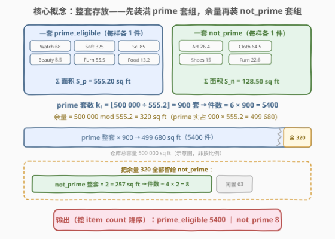
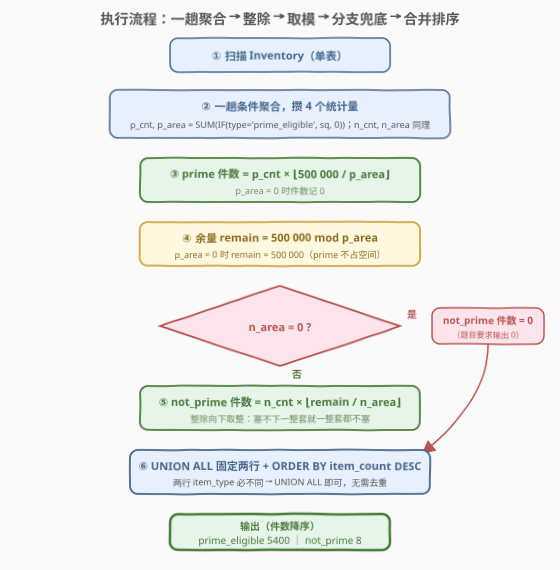
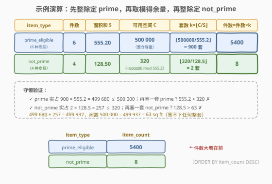

# LeetCode 最大化商品 题解

## 1. 题目概述

- **标题 / 题号**：最大化商品（#3052，hard）
- **链接**：https://leetcode.cn/problems/maximize-items/
- **难度**：困难
- **标签**：数据库、SQL、条件聚合、`SUM(IF)`、`FLOOR` 整除、`MOD` 取模、`UNION ALL`、除零与 `NULL` 防御、`IF`/`IFNULL`、CTE、LeetCode 锁题

> ⚠️ 本题为 LeetCode 付费题，题意描述根据官方示例用例与外部资料重建，可能与官方题面有出入。

**表结构**：`Inventory`

| 列名 | 类型 |
|------|------|
| item_id | int |
| item_type | varchar |
| item_category | varchar |
| square_footage | decimal |

- `item_id` 是这张表中具有唯一值的列。
- 每行包含：商品 id、商品类型（`prime_eligible` 主要商品 / `not_prime` 非主要商品）、商品类别、占地面积（平方英尺）。

**目标**：仓库容量为 $500{,}000$ 平方英尺。想**尽可能多地存储 `prime_eligible` 商品**，再用**剩余空间**存储最多数量的 `not_prime` 商品。编写解决方案，输出商品类型 `prime_eligible` 与 `not_prime` 各自能存储的**最大商品数**。

**注意**：

- 商品数必须是**整数**（放不下半套）。
- 若 `not_prime` 类的数量是 `0`，该分类也要**输出 `0`**。
- 返回结果按商品数**降序**排序。

**示例 1**：

```text
输入：
Inventory 表：
+---------+----------------+---------------+----------------+
| item_id | item_type      | item_category | square_footage |
+---------+----------------+---------------+----------------+
| 1374    | prime_eligible | Watches       | 68.00          |
| 4245    | not_prime      | Art           | 26.40          |
| 5743    | prime_eligible | Software      | 325.00         |
| 8543    | not_prime      | Clothing      | 64.50          |
| 2556    | not_prime      | Shoes         | 15.00          |
| 2452    | prime_eligible | Scientific    | 85.00          |
| 3255    | not_prime      | Furniture     | 22.60          |
| 1672    | prime_eligible | Beauty        | 8.50           |
| 4256    | prime_eligible | Furniture     | 55.50          |
| 6325    | prime_eligible | Food          | 13.20          |
+---------+----------------+---------------+----------------+

输出：
+----------------+------------+
| item_type      | item_count |
+----------------+------------+
| prime_eligible | 5400       |
| not_prime      | 8          |
+----------------+------------+
```

**解释**：

| 类型 | 件数 | 面积和 | 可存放套数 | 商品数 |
|------|------|--------|-----------|--------|
| prime_eligible | 6 种（68 + 325 + 85 + 8.5 + 55.5 + 13.2） | 555.20 | $\lfloor 500000 / 555.2 \rfloor = 900$ 套 | $6 \times 900 = 5400$ |
| not_prime | 4 种（26.4 + 64.5 + 15 + 22.6） | 128.50 | 剩余 $320$，$\lfloor 320 / 128.5 \rfloor = 2$ 套 | $4 \times 2 = 8$ |

> 💡 题眼藏在解释里：**"可以存放这 6 种物品的 900 件组合"**——商品不是零散挑着放，而是**整套存放**：同类型的所有商品"每样各一件"构成一个组合，仓库存的是组合的整数倍。一旦抓住这个模型，看似背包/装箱的组合优化就坍缩成**两步整除 + 一步取模**的纯算术。这也解释了为什么输出是 $5400$ 而不是 $58{,}823$（若允许只囤 8.5 sq ft 的小商品）。

**约束条件**（据重建题意）：

- `item_id` 唯一；`item_type` 取值仅 `prime_eligible` / `not_prime`。
- `square_footage` 为 `decimal` 类型（定点数，精确算术）。
- 输出固定两行：`prime_eligible` 与 `not_prime`（数量为 0 也输出 0），按 `item_count` 降序。

## 2. 解题思路

### 2.1 暴力思路：逐套模拟 / 应用层计算

乍看像装箱问题：不同商品面积各异，直觉是逐件贪心或动态规划。但两条"暴力路"都不对味：

- **逐套 `WHILE` 模拟**：面积还够一整套就计数 +1——结果正确（模型就是整套），但要循环 $500000 / S_p$ 次，且 SQL 里写循环别扭（得递归 CTE 硬凑）。
- **读进应用层（pandas）自己算**：可行，但把本该一条 `SELECT` 说的清楚事搬出数据库，违背 SQL 的声明式哲学。
- **真的当背包做**：方向就错了——整套模型下不存在"挑哪些商品"的决策，组合优化无从谈起。

> ⚠️ 暴力的根源是没看穿模型：**「整套存放」把"选哪些、放多少"的选择题变成了"能塞几套"的算术题**。看到"最大化数量"先别急着 DP，从示例解释里反推存储模型——本题解释中的"900 件组合"就是官方递的梯子。

### 2.2 核心观察：整套模型 → 整除定套数，取模得余量



**关键洞察**：设 $p\_cnt, p\_area$ 为 prime 商品的**种数**与**面积和**（$n\_cnt, n\_area$ 同理），则：

$$
\text{prime 套数} = \left\lfloor \frac{500000}{p\_area} \right\rfloor, \qquad \text{prime 件数} = p\_cnt \times \left\lfloor \frac{500000}{p\_area} \right\rfloor
$$

prime 优先占满后，**剩余空间恰是取模一步**：

$$
\text{remain} = 500000 \bmod p\_area = 500000 - \left\lfloor \frac{500000}{p\_area} \right\rfloor \times p\_area
$$

再把余量交给 not_prime 整套：

$$
\text{not\_prime 件数} = n\_cnt \times \left\lfloor \frac{\text{remain}}{n\_area} \right\rfloor
$$

以示例验证：$\lfloor 500000 / 555.2 \rfloor = 900$ 套 → $6 \times 900 = 5400$ 件；$\text{remain} = 500000 \bmod 555.2 = 320$；$\lfloor 320 / 128.5 \rfloor = 2$ 套 → $4 \times 2 = 8$ 件。与期望输出严丝合缝。

> 💡 三个"为什么"：
> - **为什么用 `FLOOR` 而不是 `ROUND`**：商品数必须是整数，且**放不下就一整套都不放**——只能向下取整。$900 \times 555.2 = 499{,}680 \le 500{,}000$，而 $901$ 套要 $500{,}235.2$，超了。
> - **为什么余量用 `MOD`**：$\text{remain} = 500000 - k_1 \times p\_area$ 与 $500000 \bmod p\_area$ 在正数域恒等（`MOD` 的定义），取模让"占用 + 余量"一步到位。
> - **为什么不怕精度坑**：`square_footage` 是 `decimal` 定点数，MySQL 对 DECIMAL 做精确算术，$500000 / 555.2$ 不会算成 $899.999\ldots$；若换成 `FLOAT`/`DOUBLE` 就要当心了（见 5.2）。

> ⚠️ **两处防御性分支**（官方测试未必要你防，但面试必问）：
> - **没有 not_prime 行**：$n\_area = 0$，除法 $320 / 0$ 在 MySQL 里返回 `NULL`（不报错），`NULL` 一路传播——但题目要求**输出 0**，必须 `IF`/`IFNULL` 显式兜底。注意 $0 \times \text{NULL} = \text{NULL}$ 而**不是 0**，指望 `COUNT(1) = 0` 把结果"带"成 0 是常见幻觉。
> - **没有 prime 行**：$p\_area = 0$ → prime 件数记 0，且**余量 = 整个 500 000**（prime 没占任何空间），同样需要 `IF` 分支。

### 2.3 算法流程图



**六步流水线**：

| 步骤 | 操作 | 作用 |
|------|------|------|
| ① | `FROM Inventory` | 单表扫描，无 `JOIN` |
| ② | 一趟条件聚合 | `SUM(IF(item_type=…))` 同一趟攒出 $p\_cnt, p\_area, n\_cnt, n\_area$ 四个统计量 |
| ③ | 整除 | prime 件数 $= p\_cnt \times \lfloor 500000 / p\_area \rfloor$ |
| ④ | 取模 | 余量 $= 500000 \bmod p\_area$（$p\_area=0$ 时余量 $=500000$） |
| ⑤ | 分支 + 整除 | $n\_area = 0$ → not_prime 件数 0；否则 $n\_cnt \times \lfloor \text{remain} / n\_area \rfloor$ |
| ⑥ | `UNION ALL` + `ORDER BY` | 固定输出两行，按 `item_count` 降序 |

> 💡 **CTE 复用而非子查询重复**：② 的聚合结果要喂给③④⑤三处，用 `WITH Stat AS (...)` 算一次、处处引用；若写成相关子查询，同一聚合可能被执行多遍。另：`UNION ALL` 而非 `UNION`——两行 `item_type` 必不相同，无需去重，`UNION` 的隐式去重纯浪费；末尾 `ORDER BY item_count DESC` 作用于**整个合并结果**（SQL 标准行为）。

### 2.4 示例演算

跟踪示例 1「聚合 → 整除 → 取模 → 再整除」全过程：



| 类型 | 件数 | 面积和 $S$ | 可用空间 $C$ | 套数 $k=\lfloor C/S \rfloor$ | 件数 $=$ 件数 $\times k$ |
|------|------|-----------|-------------|------------------------------|--------------------------|
| prime_eligible | 6 | 555.20 | 500 000 | 900 | **5400** |
| not_prime | 4 | 128.50 | 320（$=500000 \bmod 555.2$） | 2 | **8** |

**守恒校验**（防翻车的金标准）：

- prime 实占 $900 \times 555.2 = 499\,680 \le 500\,000$；再塞一套 prime？$555.2 > 320$ ✗
- not_prime 实占 $2 \times 128.5 = 257 \le 320$；再塞一套 not_prime？$128.5 > 63$ ✗
- 合计 $499\,680 + 257 = 499\,937$，闲置 $63$ sq ft——**塞不下任何一整套**，两侧都取到了整数上界，输出确认为最大值。

> 💡 若结果对不上，先查三件事：`FLOOR` 是否漏写（套数成了小数）、取模对象是否写错（对 $p\_area$ 取模而不是对件数）、除法顺序是否颠倒（$\lfloor C/S \rfloor$ 而非 $\lfloor S/C \rfloor$）。

## 3. 参考代码

### SQL（MySQL，解法 A：单趟条件聚合 + CTE，推荐）

```sql
# Write your MySQL query statement below
WITH
    Stat AS (
        SELECT
            SUM(item_type = 'prime_eligible')                        AS p_cnt,
            SUM(item_type = 'not_prime')                             AS n_cnt,
            SUM(IF(item_type = 'prime_eligible', square_footage, 0)) AS p_area,
            SUM(IF(item_type = 'not_prime',      square_footage, 0)) AS n_area
        FROM Inventory
    ),
    Calc AS (
        SELECT
            IF(p_area = 0, 0, p_cnt * FLOOR(500000 / p_area)) AS prime_cnt,
            IF(p_area = 0, 500000, 500000 % p_area)            AS remain,
            n_cnt,
            n_area
        FROM Stat
    )
SELECT 'prime_eligible' AS item_type, prime_cnt AS item_count
FROM Calc
UNION ALL
SELECT 'not_prime', IF(n_area = 0, 0, n_cnt * FLOOR(remain / n_area))
FROM Calc
ORDER BY item_count DESC;
```

> 💡 **写法要点**：
> - **一趟扫描攒四个统计量**：`SUM(IF(...))` 条件聚合，`Inventory` 只读一遍；`SUM(item_type = '...')` 是 MySQL 布尔简写（跨库请用 `SUM(CASE WHEN ... THEN 1 ELSE 0 END)`）。
> - **`IF(p_area = 0, 500000, 500000 % p_area)`**：没有 prime 商品时余量退化为整仓容量；`IF(p_area = 0, 0, ...)` 同理防 `500000 / 0` 的 `NULL` 传播到 prime 分支。
> - **`IF(n_area = 0, 0, ...)`**：没有 not_prime 商品时按题目要求输出 0，而不是 `NULL`。
> - **`ORDER BY item_count DESC`** 写在 `UNION ALL` 之后，对合并后的两行整体排序。

### SQL（解法 B：`JOIN` 聚合派生表，官方风格）

```sql
# Write your MySQL query statement below
WITH
    T AS (
        SELECT SUM(square_footage) AS s
        FROM Inventory
        WHERE item_type = 'prime_eligible'
    )
SELECT
    'prime_eligible' AS item_type,
    COUNT(1) * FLOOR(500000 / s) AS item_count
FROM Inventory JOIN T
WHERE item_type = 'prime_eligible'
UNION ALL
SELECT
    'not_prime',
    IFNULL(COUNT(1) * FLOOR(IF(s = 0, 500000, 500000 % s) / SUM(square_footage)), 0)
FROM Inventory JOIN T
WHERE item_type = 'not_prime'
ORDER BY item_count DESC;
```

> 💡 **写法要点**：
> - `T` 先算出 prime 面积和 $s$；两个分支各自 `JOIN T`（无 `ON` 即交叉连接，`T` 恒 1 行，行数不膨胀），分支内 `COUNT(1)` 是件数、`SUM(square_footage)` 是本类型面积和。
> - `IFNULL(..., 0)` 一处兜底两种 `NULL`：`FLOOR(NULL)`（$s$ 为 `NULL`，全表无 prime）与除零 `NULL`（无 not_prime，`SUM` 为 `NULL` 或 0）。
> - 对照解法 A：这版每个分支各扫一遍表（`T` 一遍 + 两分支各一遍），解法 A 一遍全攒齐——思路同源，A 更省。

### Python（pandas）

```python
import pandas as pd

def maximize_items(inventory: pd.DataFrame) -> pd.DataFrame:
    CAP = 500000
    prime = inventory[inventory['item_type'] == 'prime_eligible']
    other = inventory[inventory['item_type'] == 'not_prime']

    p_cnt, p_area = len(prime), prime['square_footage'].sum()
    n_cnt, n_area = len(other), other['square_footage'].sum()

    if p_area > 0:
        k1 = int(CAP // p_area)            # prime 套数 = ⌊CAP / p_area⌋
        prime_cnt = p_cnt * k1
        remain = CAP - k1 * p_area         # 等价于 CAP % p_area
    else:
        prime_cnt, remain = 0, CAP
    not_prime_cnt = n_cnt * int(remain // n_area) if n_area > 0 else 0

    return (pd.DataFrame({'item_type': ['prime_eligible', 'not_prime'],
                          'item_count': [prime_cnt, not_prime_cnt]})
            .sort_values('item_count', ascending=False))
```

> 💡 **pandas 对照**：
> - `isin`/布尔索引过滤对应 SQL 的 `WHERE item_type = ...`；`len` + `sum` 对应 `COUNT(1)` + `SUM(square_footage)`——解法 B 的两个分支在这里显式展开。
> - `//` 是 Python 的向下取整除（对浮点也成立），对应 `FLOOR(CAP / p_area)`；`CAP - k1 * p_area` 与 `CAP % p_area` 等价，写前者可避开浮点取模的边角行为。
> - `sort_values(ascending=False)` 对应 `ORDER BY item_count DESC`。
> - ⚠️ 浮点精度：`square_footage` 若经二进制浮点读入，整除边界处（如面积和恰为 500 时 $500000/500 = 1000$）可能塌成 999，稳妥可先 `round(p_area, 10)`——SQL 侧 `DECIMAL` 类型无此虑。

## 4. 复杂度分析

| 维度 | 复杂度 | 说明 |
|------|--------|------|
| **时间** | $O(n)$ | $n$ = `Inventory` 行数；解法 A 单趟扫描 + 4 个聚合器，整除/取模 $O(1)$；解法 B 表被读 3 遍（`T` 一遍 + 两分支各一遍），仍为线性常数放大 |
| **空间** | $O(1)$ | 聚合器与 CTE 结果均为常数个标量（`Stat`/`T` 恒 1 行）；无 `GROUP BY` 分组桶 |
| **输出** | $O(2)$ | 固定两行：`prime_eligible` 与 `not_prime` 各一条 |

**两种 SQL 解法对照**：

| 维度 | A 单趟条件聚合 | B `JOIN` 派生表 |
|------|---------------|-----------------|
| **扫描次数** | 1 次 | 3 次（优化器或可合并） |
| **统计量组织** | 4 个标量一处攒齐 | 面积和在 `T`、件数在分支内各自算 |
| **NULL 兜底** | `IF` 三处显式分支 | `IFNULL` + `IF(s=0, …)` 集中一处 |
| **可读性** | 公式与推导一一对应 | 与题面"先 prime 后 not_prime"叙事同构 |
| **推荐度** | ✓ **首选** | ✓ 亦可，面试口述快 |

> ⚠️ 本题示例仅 10 行，怎么写都是瞬过。复杂度的价值在**模型**：当 `Inventory` 上千万行时，解法 A 的一趟聚合与解法 B 的多趟扫描差距会被放大；而若没看穿"整套"模型、真去写逐套循环，复杂度会带上 $500000 / S_p$ 的因子。

## 5. 扩展：边界盘点与逐级取模链

### 5.1 边界情形盘点

| 情形 | 退化行为 | 防御写法 |
|------|----------|----------|
| 没有 not_prime 行 | $n\_area = 0$ → `FLOOR(x/0)` = `NULL` → `0 * NULL` = `NULL` | `IF(n_area = 0, 0, ...)` 输出 0（题目硬性要求） |
| 没有 prime 行 | $p\_area = 0$ → prime 件数应为 0，且余量 = 整仓 500 000 | `IF(p_area = 0, 0, ...)` + `IF(p_area = 0, 500000, 500000 % p_area)` |
| $p\_area$ 整除 500 000 | 余量 = 0 → `FLOOR(0 / n_area)` = 0 → not_prime 输出 0 | 无需特判，取模自然给出 0 |
| 表为空 | 两个 `IF` 分支各给出 0，仍输出两行 | 已被上两条覆盖 |

> 💡 **MySQL 除零冷知识**：`SELECT` 语境下 `x / 0` 不抛异常，返回 `NULL` 并附带 warning（存储过程等严格模式场景才可能报错）。所以除零的杀伤力不是崩溃，而是 **`NULL` 静默传播**——`COUNT(1) * FLOOR(NULL)` = `NULL`，输出里凭空少/错一行。防御口诀：**除法之前想分母，分母可能为零就 `IF`/`IFNULL`**。

### 5.2 精度陷阱：为什么 `decimal` 是"善意设定"

`FLOOR(500000 / S)` 只在 $S$ 精确时才可靠。若 `square_footage` 是 `FLOAT`/`DOUBLE`：

- 二进制无法精确表示 $555.2$（存成 $555.199999\ldots$ 或 $555.2000\ldots01$）；
- 商恰好压在整数边界时最危险：面积和恰为 $500$ 时 $500000 / 500 = 1000$ 本应整除，浮点算成 $999.9999\ldots$ 后 `FLOOR` 塌成 $999$，**凭空丢一整套**；
- `DECIMAL` 定点算术（MySQL 默认保留 65 位有效数字）让除法精确到定义为止，`FLOOR` 无此虑。pandas 侧读的是 `float64`，边界数据可 `round` 后再整除。

### 5.3 泛化：优先级链上的逐级取模

本题是两级优先级（prime → not_prime）。若有 $m$ 级优先类别 $T_1 \succ T_2 \succ \cdots \succ T_m$，同一套算术可以链式推广：

$$
k_i = \left\lfloor \frac{r_{i-1}}{S_i} \right\rfloor, \qquad r_i = r_{i-1} \bmod S_i, \qquad r_0 = 500000
$$

每级"整除定套数、取模传余量"，上游吃剩的才轮到下游——与本题 ③④⑤ 三步完全同构。面试被追问"三类商品怎么办"时，把这条例子递出去即可。

## 6. 面试要点

1. **这题标"困难"，为什么核心只是两步除法？**

   > 难在**建模**而非算术。题面说"最大化商品数"极易联想到背包/装箱，但示例解释"900 件组合"透露了**整套存放**模型：同类型商品每样一件构成组合，仓库存组合的整数倍。模型一旦确定，"选哪些"的选择题坍缩为"塞几套"的算术题——整除定套数、取模得余量。面试先确认存储模型，再动手写查询。

2. **`500000 % p_area` 和 `500000 - FLOOR(500000 / p_area) * p_area` 等价吗？**

   > 正数域恒等——这正是 `MOD` 的定义。MySQL 的 `%` 支持操作数为 `DECIMAL`（$500000 \bmod 555.2 = 320$）。分母为 0 时两者行为不同：前者得 `NULL`，后者也含 `FLOOR(500000/0)` = `NULL` 同样传播成 `NULL`——所以无论哪种写法，分母为零都要 `IF` 兜底。

3. **MySQL 里 `320 / 0` 会抛异常吗？`COUNT(1) * FLOOR(320/0)` 呢？**

   > `SELECT` 语境除零不报错，返回 `NULL`（仅 warning）。而 `NULL` 具有传播性：`FLOOR(NULL)` = `NULL`，且 **`0 * NULL` = `NULL` 而不是 0**——没有 not_prime 商品时 `COUNT(1)` 虽为 0，也救不回 `NULL`。必须 `IF(n_area = 0, 0, ...)` 或 `IFNULL(..., 0)` 显式输出 0，这恰好是题目 Note 的硬性要求。

4. **为什么用 `UNION ALL` 而不是 `UNION`？末尾的 `ORDER BY` 排的是谁？**

   > 两行 `item_type` 一个是 `'prime_eligible'` 一个是 `'not_prime'`，**必然不同**，去重毫无意义；`UNION` 的隐式去重还要多一趟排序/哈希。`UNION ALL` 保序拼接、零开销。末尾 `ORDER BY item_count DESC` 作用于**整个合并结果**（SQL 标准行为，排的不是第二个分支）——本题要求按件数降序，prime 5400 在前、not_prime 8 在后。

5. **如果 `square_footage` 是 `FLOAT` 而不是 `DECIMAL`，你的查询要改哪里？**

   > `FLOOR(500000 / S)` 在浮点下有边界塌位风险：面积和恰使商为整数时（如 $S = 500$，$500000/500 = 1000$），二进制误差把商算成 $999.999\ldots$，`FLOOR` 后**少一整套**。对策：读入后 `ROUND`/转 `DECIMAL` 再整除，或余量计算改用 `500000 - k * S` 并对 $k$ 做一次邻域校正。本题给 `decimal` 正是为了让 `FLOOR` 无精度之虞——但面试能主动指出这一点是加分项。

> 💡 **一句话总结**：3052 是"**披着优化外衣的算术题**"——整套模型把最大化问题坍缩为 $\lfloor C/S_p \rfloor$ 与 $C \bmod S_p$ 两步；工程上的真考点是 `FLOOR`/`MOD` 的整数语义、除零 `NULL` 的静默传播与 `UNION ALL` 合并输出。口诀：**整除定套数，取模传余量，分母为零先兜底**。

## 同类练习题

| # | 题目 | 与本题的关联 |
|---|------|-------------|
| 1193 | [每月交易 I](https://leetcode.cn/problems/monthly-transactions-i/)（[题解](../1101-1200/1193_每月交易I.md)） | 同款「一趟扫描 + `SUM(IF)` 条件聚合」攒多个统计量——本题 `Stat` CTE 四指标的基本功来源 |
| 1322 | [广告效果](https://leetcode.cn/problems/ads-performance/)（[题解](../1301-1400/1322_广告效果.md)） | 除零处理 `IFNULL`/`NULLIF` 专题——本题 $n\_area = 0$ 兜底的同款防御，CTR 计算是 `NULL` 传播的经典翻车现场 |
| 2893 | [计算每个区间内的订单](https://leetcode.cn/problems/calculate-orders-within-each-interval/)（[题解](../2801-2900/2893_计算每个区间内的订单.md)） | `CEIL`/`DIV` 算术分桶——整除家族的兄弟套路，体会向上/向下取整的方向选择 |
| 1211 | [查询结果的质量和占比](https://leetcode.cn/problems/queries-quality-and-percentage/)（[题解](../1201-1300/1211_查询结果的质量和占比.md)） | 单表聚合 + `ROUND`/`IF` 行内条件运算——「聚合里做逐行判断」的入门练习 |
| 1045 | [买下所有产品的客户](https://leetcode.cn/problems/customers-who-bought-all-products/)（[题解](../1001-1100/1045_买下所有产品的客户.md)） | `HAVING` 里聚合值与子查询比大小——另一形态的分组聚合判定，对照本题"聚合结果直接当输出"的用法 |
