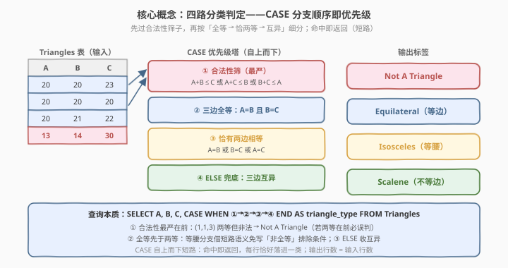
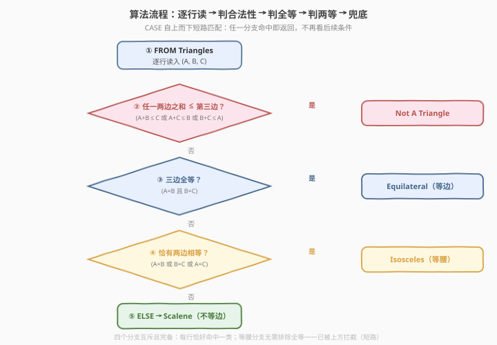
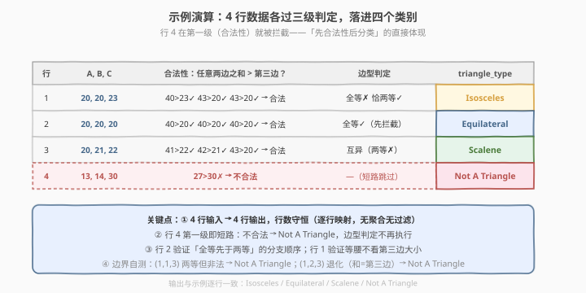

# 根据长度分类三角形

- **题目名称**：根据长度分类三角形
- **链接**：[3053. 根据长度分类三角形 🔒](https://leetcode.cn/problems/classifying-triangles-by-lengths/)
- **难度**：简单
- **标签**：数据库、SQL、`CASE WHEN`、多分支分类、三角形不等式、LeetCode 锁题

## 1. 题目概述

给定 `Triangles` 表，每行存放三条线段的长度 `A`、`B`、`C`。编写解决方案，对每行按边长把三角形分类，输出原三列并追加一列分类标签，结果顺序不限。

**分类规则**（按优先级从高到低）：

| 类别 | 条件 |
|------|------|
| `Not A Triangle` | 三边不满足三角形不等式（无法构成非退化三角形） |
| `Equilateral`（等边） | 三条边长度相等 |
| `Isosceles`（等腰） | 恰好两条边长度相等 |
| `Scalene`（不等边） | 三条边长度互不相同 |

**表结构**：

```text
Table: Triangles
+-------------+------+
| Column Name | Type |
+-------------+------+
| A           | int  |
| B           | int  |
| C           | int  |
+-------------+------+
(A, B, C) 是该表的主键（具有唯一值的列）。
该表的每一行包含三角形三条边的长度。
```

> ⚠️ **本题为 LeetCode 付费题**，题意描述根据官方示例用例与 hints 重建，可能与官方题面有出入。表结构与示例数据取自公开接口的 `jsonExampleTestcases`；四个分类的命名与语义对照 [610. 判断三角形](https://leetcode.cn/problems/triangle-judgement/)（同款表的 Yes/No 二分版）与 [3024. 三角形类型](../3001-3100/3024_三角形类型.md)（数组版同款四分类）重建，输出列名按惯例取 `triangle_type`，提交时以官方题面要求的列名为准。

**示例 1**：

```text
输入：
Triangles 表:
+----+----+----+
| A  | B  | C  |
+----+----+----+
| 20 | 20 | 23 |
| 20 | 20 | 20 |
| 20 | 21 | 22 |
| 13 | 14 | 30 |
+----+----+----+

输出：
+----+----+----+----------------+
| A  | B  | C  | triangle_type  |
+----+----+----+----------------+
| 20 | 20 | 23 | Isosceles      |
| 20 | 20 | 20 | Equilateral    |
| 20 | 21 | 22 | Scalene        |
| 13 | 14 | 30 | Not A Triangle |
+----+----+----+----------------+
```

**解释**：

- 行 `(20, 20, 23)`：20+20=40>23，三边构成三角形；恰有两边相等（20=20）→ `Isosceles`
- 行 `(20, 20, 20)`：三边全等，必为合法三角形 → `Equilateral`
- 行 `(20, 21, 22)`：任意两边之和大于第三边，三边互不相等 → `Scalene`
- 行 `(13, 14, 30)`：13+14=27<30，两边之和小于第三边，无法构成三角形 → `Not A Triangle`

**约束条件**：

- `(A, B, C)` 为 `Triangles` 表的主键
- `A`、`B`、`C` 为整数
- 结果以任意顺序返回，分类标签列为 `triangle_type`

> 💡 **审题关键**：① **先判「是不是三角形」，再谈「哪一类」**——不满足三角形不等式的行直接归 `Not A Triangle`，边长是否相等已无意义；② **等腰是「恰好」两边相等**——数学上等边是等腰的特例，但本题把等边单列一类，等腰只留「恰两等」；③ **分支顺序即优先级**——`CASE WHEN` 自上而下短路匹配，顺序错了对边界行（如 1,1,3）就会误判。

---

## 2. 解题思路

### 2.1 暴力思路：应用层 if-else 链

最直觉的过程式思维：取出每行的 `A`、`B`、`C`，在应用层套一串 if-else：

```text
for row in Triangles:
    a, b, c = row.A, row.B, row.C
    if  a+b<=c or a+c<=b or b+c<=a:  emit "Not A Triangle"
    elif a==b and b==c:              emit "Equilateral"
    elif a==b or  b==c or a==c:      emit "Isosceles"
    else:                            emit "Scalene"
```

逻辑完全正确——而这串 if-else 在 SQL 里恰好有一个一一对应的声明式结构：**`CASE WHEN` 多分支表达式**。分支顺序原样搬进 `CASE`，一句查询即得全部结果行。

### 2.2 核心观察：互斥分类靠 CASE 分支顺序保证



本题的知识拼图来自两道旧题，3053 是它们的合体：

| 来源 | 贡献的知识点 |
|------|--------------|
| [610. 判断三角形](../0601-0700/610_判断三角形.md) | 三角形不等式：**任意两边之和严格大于第三边**才构成非退化三角形 |
| [3024. 三角形类型](../3001-3100/3024_三角形类型.md) | 四分类定义：等边 / 等腰（恰两等）/ 不等边 / 无法构成 |

形式化地，设

$$\text{valid} \iff (A+B>C) \;\land\; (A+C>B) \;\land\; (B+C>A)$$

则分类函数为

$$
\text{type}(A,B,C)=
\begin{cases}
\text{Not A Triangle}, & \neg\,\text{valid} \\[4pt]
\text{Equilateral}, & A=B=C \\[4pt]
\text{Isosceles}, & A=B \;\lor\; B=C \;\lor\; A=C \\[4pt]
\text{Scalene}, & \text{其余}
\end{cases}
$$

**为什么这个顺序不能乱？** 三个陷阱逐一拆解：

1. **`Not A Triangle` 必须排第一**。反例行 `(1, 1, 3)`：恰有两边相等（1=1），但 1+1=2<3 根本不是三角形。若等腰判定在前，这行会被误判为 `Isosceles`。先过合法性筛子，再谈分类，是几何语义的正确翻译。
2. **`Equilateral` 必须排在 `Isosceles` 前**。等边 $(k,k,k)$ 必然满足 $A=B\lor B=C\lor A=C$，是等腰判定式的真子集。`CASE` 自上而下短路：等边行先被上一分支拦截，落到等腰分支的必然是「恰两等」——于是等腰条件**无需再写「非全等」的排除项**，`A=B OR B=C OR A=C` 裸条件即够。
3. **`Scalene` 兜底放 `ELSE`**。前三分支筛掉了「不合法」「全等」「恰两等」，剩下的自然三边互异且合法，`ELSE` 收尾。

> 💡 **顺序即优先级**：`CASE WHEN` 是 SQL 里少有的「自带顺序语义」的表达式——分支从上到下依次求值，命中即返回、后续短路。这一性质正是「分类优先级」的天然载体。把最严格的判定（合法性）放最前、把最宽松的判定（兜底）放最后，是写多分支分类的通用范式。

> ⚠️ **严格 `>` 而非 `>=`**：若 $a+b=c$（如 1, 2, 3），三边共线退化成线段，是「退化三角形」而非三角形，须归入 `Not A Triangle`。故不等式判定写 `A+B<=C`（含等于）即失败，与 610 的非退化要求一致。

### 2.3 算法流程



**逻辑执行步骤**：

| 步骤 | 子句/分支 | 作用 |
|------|-----------|------|
| ① | `FROM Triangles` | 行源：逐行读入 `(A, B, C)` |
| ② | `WHEN A+B<=C OR A+C<=B OR B+C<=A` | 合法性筛：任一不等式失败 → `Not A Triangle` |
| ③ | `WHEN A=B AND B=C` | 全等判定 → `Equilateral` |
| ④ | `WHEN A=B OR B=C OR A=C` | 恰两等判定（全等已被③拦截）→ `Isosceles` |
| ⑤ | `ELSE` | 兜底：合法且三边互异 → `Scalene` |
| ⑥ | `AS triangle_type` | 派生列命名，与原三列一并投影 |

> 💡 **无 `WHERE` / `GROUP BY` / `ORDER BY`**：本题是「逐行分类」——每行独立产出一个标签，无过滤（所有行都保留）、无聚合（行数守恒）、顺序不限。四个 `WHEN` 分支对每行至多命中一个，等价于一条 if-elif-elif-else 链。

### 2.4 示例演算

以示例 1 的 4 行 `Triangles` 为例，走一遍四路判定过程：



| 行 | A, B, C | 合法性（三不等式） | 全等？恰两等？ | 结论 |
|----|---------|--------------------|----------------|------|
| 1 | 20, 20, 23 | 40>23 ✓ 43>20 ✓ 43>20 ✓ → 合法 | 全等 ✗；恰两等 ✓（20=20） | **Isosceles** |
| 2 | 20, 20, 20 | 40>20 ✓ ×3 → 合法 | 全等 ✓ | **Equilateral** |
| 3 | 20, 21, 22 | 41>22 ✓ 42>21 ✓ 43>20 ✓ → 合法 | 全等 ✗；两等 ✗ | **Scalene** |
| 4 | 13, 14, 30 | 27>30 ✗ → **不合法** | （不再判定） | **Not A Triangle** |

- 4 行输入 → 4 行输出，行数守恒（逐行映射，无聚合无过滤）；
- 行 4 在第一级（合法性）就被拦截，后面的相等性判定**短路跳过**——这正是「先合法性后分类」的直接体现；
- 行 1 若把等腰判定提到全等之前仍得 `Isosceles`（它本就不全等），但行 2 会误判为 `Isosceles`——用行 2 即可验证分支顺序的正确性。

> 💡 **边界自测**：`(1, 1, 3)` 恰两等但不合法 → 顺序正确时输出 `Not A Triangle`（而非 `Isosceles`）；`(5, 5, 5)` 全等且合法 → `Equilateral`。把这两行加进本地测试即可覆盖最易错的两个分支次序。

---

## 3. 参考代码

### SQL（解法 A：CASE WHEN 四分支，推荐）

```sql
# Write your MySQL query statement below
SELECT A, B, C,
       CASE
           WHEN A + B <= C OR A + C <= B OR B + C <= A THEN 'Not A Triangle'
           WHEN A = B AND B = C                        THEN 'Equilateral'
           WHEN A = B OR B = C OR A = C                THEN 'Isosceles'
           ELSE 'Scalene'
       END AS triangle_type
FROM Triangles;
```

> 💡 **写法要点**：
> - **分支顺序 = 优先级**：合法性 → 全等 → 恰两等 → 兜底，一个都不能换位。`A=B AND B=C` 传递性蕴涵 `A=C`，写前两个等式即够。
> - 等腰分支**不需要排除全等**：`CASE` 自上而下短路，全等行已被上一分支接走，落到此处的必然「恰两等」。
> - 不等式判定含 `<=`：$a+b=c$ 的退化情形一并归入 `Not A Triangle`。
> - `CASE` 是 SQL 标准语法，MySQL / PostgreSQL / SQL Server 通用。

### SQL（解法 B：GREATEST 压缩不等式）

```sql
SELECT A, B, C,
       CASE
           WHEN A + B + C <= 2 * GREATEST(A, B, C) THEN 'Not A Triangle'
           WHEN A = B AND B = C                    THEN 'Equilateral'
           WHEN A = B OR B = C OR A = C            THEN 'Isosceles'
           ELSE 'Scalene'
       END AS triangle_type
FROM Triangles;
```

> 💡 **数学优化**（承接 [610](../0601-0700/610_判断三角形.md) 的 GREATEST 写法）：设 $c=\max(A,B,C)$，则「任意两边之和大于第三边」等价于「最小两边之和大于最大边」，即 $(A+B+C)-c>c \iff A+B+C>2c$。三条不等式压成一条，判定更紧凑；代价是可读性略降，需向读者解释「总和 > 2 倍最大边」的几何含义。

### Python（pandas）

```python
import pandas as pd
import numpy as np

def triangle_classification(triangles: pd.DataFrame) -> pd.DataFrame:
    a, b, c = triangles['A'], triangles['B'], triangles['C']
    valid = (a + b > c) & (a + c > b) & (b + c > a)
    ttype = np.select(
        condlist=[
            ~valid,
            (a == b) & (b == c),
            (a == b) | (b == c) | (a == c),
        ],
        choicelist=['Not A Triangle', 'Equilateral', 'Isosceles'],
        default='Scalene',
    )
    return triangles.assign(triangle_type=ttype)[['A', 'B', 'C', 'triangle_type']]
```

> 💡 **pandas 对照**：`np.select(condlist, choicelist, default)` 与 `CASE WHEN` 同构——条件列表自上而下求值，命中首个即取对应值，全部未命中走 `default`，**顺序语义完全一致**。注意用 `&` / `|` / `~` 做向量化的与/或/非（不是 `and` / `or` / `not`），且各条件已加括号防优先级错乱。`~valid` 对应「不满足不等式」，先排在 `condlist` 首位，与 SQL 分支顺序一一对应。

---

## 4. 复杂度分析

| 维度 | 复杂度 | 说明 |
|------|--------|------|
| **时间** | $O(n)$ | $n$ = `Triangles` 行数。每行常数次加法与比较（解法 A 三条不等式 + 至多三次相等判定；解法 B 一条不等式），与行数成正比，无排序无聚合 |
| **空间** | $O(1)$ 辅助 | 逐行求值，无中间结构；输出结果集 $n$ 行 4 列为 $O(n)$，是答案本身的规模 |
| **结果行数** | $O(n)$ | 一对一：输入 $n$ 行 → 输出 $n$ 行，每行恰好命中一个分类 |

> ⚠️ 本题是 SQL「逐行多分支分类」的标准形态——单趟扫描、每行 $O(1)$ 判定，瓶颈只在读取表本身。面试中说明「无聚合、无连接、分支短路匹配，单趟 $O(n)$」即可。

---

## 5. 扩展：同一几何知识的四种考法与边界大全

### 5.1 三角形家族「一题四吃」

| 题目 | 载体 | 分类数 | 核心差异 |
|------|------|--------|----------|
| [610. 判断三角形](../0601-0700/610_判断三角形.md) | SQL，表 `Triangle(x,y,z)` | 2（Yes/No） | 只判合法性，不谈类型 |
| 本题 3053 | SQL，表 `Triangles(A,B,C)` | 4 | 合法性 + 三类边型，`CASE` 四分支 |
| [3024. 三角形类型](../3001-3100/3024_三角形类型.md) | 数组 `nums[3]` | 4（小写标签） | 同款四分类，排序后 `a+b>c` 一式判定 |
| [611. 有效三角形的个数](../0601-0700/611_有效三角形的个数.md) | 数组 | 计数 | 排序 + 固定最大边 + 双指针数合法三元组 |

> 💡 同一条三角形不等式，SQL 里考「逐行判定」，数组里考「排序压缩 + 计数」。识别出「本题 = 610 的不等式 + 3024 的分类标签」后，3053 实际上没有新知识——**新题往往是旧知识的重新组合**。

### 5.2 边界案例大全（本地自测表）

| 三边 | 判定过程 | 输出 | 考点 |
|------|----------|------|------|
| 20, 20, 23 | 合法；恰两等 | Isosceles | 等腰不看第三边是否更小 |
| 20, 20, 20 | 合法；全等 | Equilateral | 全等优先于两等 |
| 1, 1, 3 | 1+1=2<3 不合法 | Not A Triangle | **两等但非法**——顺序陷阱 |
| 1, 2, 3 | 1+2=3 退化 | Not A Triangle | 严格 `>`，含等于即失败 |
| 0, 0, 0 | 0+0=0 退化 | Not A Triangle | 零边全等仍非法（若约束允许 0） |
| 4, 5, 6 | 合法；互异 | Scalene | 兜底分支 |

> ⚠️ `(1, 1, 3)` 是本题最毒的一行——它同时命中「两等」与「非法」两个特征，专测分支顺序。`(1, 2, 3)` 专测严格大于。本地评测把这两行加进去，能拦住九成的顺序错误。

### 5.3 CASE WHEN vs IF：为什么多分支只能用 CASE

`IF(cond, a, b)` 是 MySQL 专有的二分函数；四分类要么嵌套三层 `IF`（可读性崩塌），要么用 `CASE WHEN` 的扁平多分支。`CASE` 同时是 SQL 标准（跨库通用）与顺序短路语义的载体——多分支分类题几乎总是 `CASE` 的招牌场景，同款考法见 [608. 树节点](https://leetcode.cn/problems/tree-node/)（Root / Inner / Leaf 三分类）与 [1873. 计算特殊奖金](../1801-1900/1873_计算特殊奖金.md)。

---

## 6. 面试要点

1. **为什么「Not A Triangle」的判定必须放在 CASE 第一个分支？**

   > 三角形不等式是分类的**前置合法性筛子**：不满足「任意两边之和严格大于第三边」时，按边长相等性分类没有几何意义。反例行 `(1, 1, 3)`：恰有两边相等但 1+1<3，若等腰分支在前会误判为 `Isosceles`。把最严格的判定放最前，是 `CASE` 多分支的通用排序原则。

2. **等腰条件 `A=B OR B=C OR A=C` 为什么不用显式排除「三边全等」？**

   > `CASE WHEN` 自上而下短路求值：全等行 `(k,k,k)` 必然满足该或条件，但它在更早的 `A=B AND B=C` 分支已被拦截返回 `Equilateral`，根本走不到等腰分支。**分支顺序天然完成互斥化**，无需在每个分支重复排除前置分支的条件——这正是顺序语义的价值。

3. **本题与 610「判断三角形」的关系是什么？**

   > 610 是同一张表（列名 x,y,z）上的二分版：只输出 `Yes`/`No`。3053 = 610 的合法性判定 + 3024 的四分类标签，是「条件派生列」从单分支到多分支的自然升级。二者共用同一条三角形不等式与同一个 `CASE` 骨架，610 还提供了 `GREATEST` 压缩不等式的优化写法（总和 > 2 倍最大边）。

4. **为什么不等式判定用 `<=` 判失败而不是 `<`？**

   > 题目要求非退化三角形：$a+b=c$（如 1,2,3）时三边共线压扁成线段，不算三角形。判定「失败条件」写 `A+B<=C` 把「两边之和等于第三边」一并归入 `Not A Triangle`；若只写 `<`，退化行会漏进后面的边型分支造成误分类。

5. **为什么不需要 `WHERE` / `GROUP BY` / `ORDER BY`？**

   > 逐行分类：每行独立求一个标签，无行需过滤（不合法的行也要输出，标签是 `Not A Triangle` 而非丢弃）、无跨行聚合（`GROUP BY` 用于分组统计）、行序不限（无需 `ORDER BY`）。这是 `SELECT 原列 + CASE 派生列 FROM 表` 的最朴素投影模式——与 610 唯一的区别是分支从 1 个变成 4 个。

> 💡 **一句话总结**：3053 是「三角形不等式 + 边型四分类」的 SQL 合体题——**`CASE WHEN` 分支顺序即分类优先级：合法性 → 全等 → 恰两等 → 兜底**，顺序一错边界行必翻车。最大陷阱是 `(1,1,3)` 这类「两等但非法」的行；等腰分支借短路语义免写排除条件，是多分支 `CASE` 的教科书用法。数组版同款见 3024，合法性单考见 610，计数进阶见 611。

---

## 7. 同类练习题

- [610. 判断三角形](https://leetcode.cn/problems/triangle-judgement/)（[题解](../0601-0700/610_判断三角形.md)）：同款表的 SQL 二分版——只判能否构成三角形（Yes/No），本题是其「+三类边型」的多分支升级
- [3024. 三角形类型](https://leetcode.cn/problems/type-of-triangle/)（[题解](../3001-3100/3024_三角形类型.md)）：数组版同款四分类——排序后 `a+b>c` 一式判合法性，对照本题三个不等式的写法
- [608. 树节点](https://leetcode.cn/problems/tree-node/)：SQL `CASE WHEN` 多分支分类——按 `p_id` 判 Root / Inner / Leaf，与本题同为「分支顺序定互斥」的招牌场景
- [1873. 计算特殊奖金](https://leetcode.cn/problems/calculate-special-bonus/)（[题解](../1801-1900/1873_计算特殊奖金.md)）：`CASE WHEN` 条件派生列的单分支版——对照本题理解从二分到多分支的扩展
- [1211. 查询结果的质量和占比](https://leetcode.cn/problems/queries-quality-and-percentage/)（[题解](../1201-1300/1211_查询结果的质量和占比.md)）：`CASE WHEN` + `ROUND` 的比率映射——同一套条件派生模式用于数值计算场景
