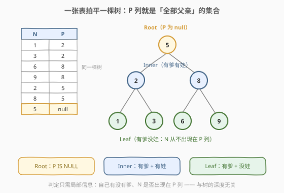
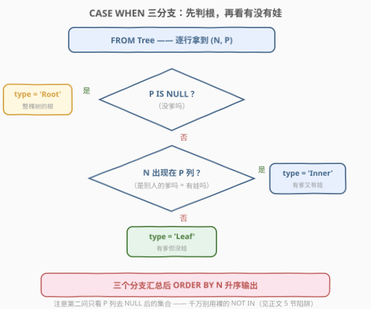
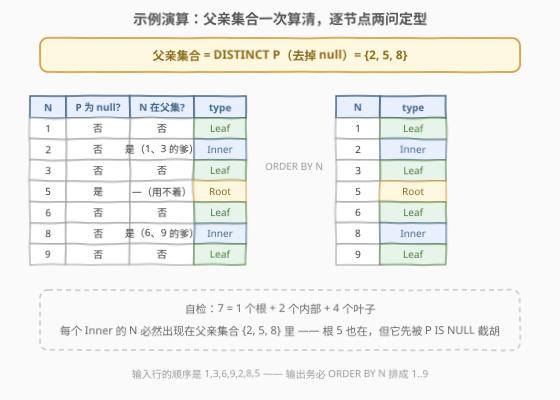
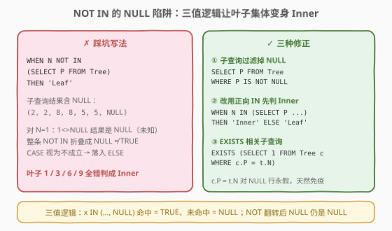

# 二叉树节点

- **题目名称**：二叉树节点
- **链接**：[3054. 二叉树节点](https://leetcode.cn/problems/binary-tree-nodes/)
- **难度**：中等
- **标签**：数据库、SQL、自连接、树

## 1. 题目概述

> ⚠️ 本题为 LeetCode 付费题，题意描述根据官方示例用例与外部资料重建，可能与官方题面有出入。（官方免费题 [608. 树的节点](https://leetcode.cn/problems/tree-node/) 题面注明「本题与 3054. 二叉树节点 一致」，可交叉印证。）

**表结构**：`Tree`

| 列名 | 类型 |
|------|------|
| N | int |
| P | int |

- `N` 是该表的主键，表示二叉树中一个节点的编号；`P` 表示它的**父节点**编号。
- 每行记录「节点 → 父节点」一条边；`P` 为 `NULL` 的行即整棵树的**根**。
- 给定的结构总是一棵**有效的二叉树**（恰有一个根，其余节点恰有一个父节点）。

树中的每个节点属于以下三种类型之一：

- `"Root"`：节点是根节点（`P` 为 `NULL`）；
- `"Leaf"`：节点是叶子节点（有父节点，但没有孩子）；
- `"Inner"`：节点是内部节点（既有父节点又有孩子）。

编写一个 SQL 查询，报告树中每个节点的类型，结果按 `N` **升序**排列。

**示例 1**：

```text
输入：Tree 表
+---+------+
| N | P    |
+---+------+
| 1 | 2    |
| 3 | 2    |
| 6 | 8    |
| 9 | 8    |
| 2 | 5    |
| 8 | 5    |
| 5 | null |
+---+------+

输出：
+---+-------+
| N | type  |
+---+-------+
| 1 | Leaf  |
| 2 | Inner |
| 3 | Leaf  |
| 5 | Root  |
| 6 | Leaf  |
| 8 | Inner |
| 9 | Leaf  |
+---+-------+

解释：
节点 5 是根节点，因为它的父节点为空，且它有孩子 2 和 8。
节点 2 和 8 是内部节点，因为它们有父节点 5，又有孩子（1、3 和 6、9）。
节点 1、3、6、9 是叶子节点，因为它们有父节点而没有孩子。
```

> 💡 读题关键：输入行的顺序（1, 3, 6, 9, 2, 8, 5）是乱的，**输出必须 `ORDER BY N` 排成 1→9**——这是本题与 608「任意顺序返回」在判题上的主要差别。另外注意**根的判定优先级最高**：根节点也可能有孩子，但它永远算 `Root` 而不是 `Inner`。

---

## 2. 解题思路

### 2.1 暴力思路：相关子查询逐行扫表

最直觉的写法是把「有没有孩子」翻译成**相关子查询**：对每一行节点 `t`，都去表里搜一遍 `EXISTS (SELECT 1 FROM Tree c WHERE c.P = t.N)`。

```sql
SELECT t.N,
       CASE
           WHEN t.P IS NULL THEN 'Root'
           WHEN EXISTS (SELECT 1 FROM Tree c WHERE c.P = t.N) THEN 'Inner'
           ELSE 'Leaf'
       END AS type
FROM Tree t;
```

语义完全正确（`c.P = t.N` 对 `P` 为 `NULL` 的行永假，天然避开空值），但在没有索引的判题环境里，外层每扫一行、内层就要再全表扫一遍，整体 $O(n^2)$。更「应用层思维」的暴力是把表读进程序里对每个节点各发一次查询，那就是经典的 N+1 查询问题，更不可取。

暴力低效的根源：**「孩子的存在性」被重复计算了**——其实整张表扫一遍就能把「谁有孩子」全部确定，根本不需要逐节点回表。

### 2.2 核心观察：类型只由两条局部布尔信息决定



**树不需要真的遍历**。表 `Tree` 本质上是把整棵树的边集「拍平」了：一列 `N` 是全部节点，一列 `P`（去掉 `NULL`）就是**全部父亲**的集合。于是每个节点的类型只取决于两个局部问题：

1. **自己有没有爹**——看本行 `P` 是否为 `NULL`；
2. **自己有没有娃**——看自己的 `N` 是否出现在「父亲集合」里（成了别人的 `P`）。

| `P IS NULL` | `N` 在父亲集合中 | 类型 |
|:---:|:---:|:---:|
| 是 | —（不必看） | `Root` |
| 否 | 是 | `Inner` |
| 否 | 否 | `Leaf` |

> 💡 一句话：**先把 `SELECT DISTINCT P ... WHERE P IS NOT NULL` 物化成父亲集合，分类就退化成每行两次 O(1) 判定**。`CASE` 的分支顺序也有讲究——`P IS NULL` 必须放在最前，保证「有孩子的根」先被截胡成 `Root`。

### 2.3 算法流程图



1. `FROM Tree` 逐行取 `(N, P)`；
2. `CASE` 三分支：先问 `P IS NULL`（→ `Root`），再问 `N IN (SELECT P FROM Tree WHERE P IS NOT NULL)`（→ `Inner`），否则 `Leaf`；
3. 最外层 `ORDER BY N` 升序输出 `(N, type)`。

> ⚠️ 第二问**千万别图省事写成裸的 `N NOT IN (SELECT P FROM Tree)`**——子查询里混着根节点那行的 `NULL`，三值逻辑会让所有叶子错判成 `Inner`，详见第 5 节的陷阱复盘。

### 2.4 示例演算



**第一步**算父亲集合：`SELECT DISTINCT P FROM Tree WHERE P IS NOT NULL` → `{2, 5, 8}`。

**第二步**逐节点两问定型（按 `N` 排好）：

| N | P 为 null? | N 在 {2,5,8} 中? | type |
|---|:---:|:---:|:---:|
| 1 | 否 | 否 | Leaf |
| 2 | 否 | 是（1、3 的爹） | Inner |
| 3 | 否 | 否 | Leaf |
| 5 | 是 | —（用不着） | Root |
| 6 | 否 | 否 | Leaf |
| 8 | 否 | 是（6、9 的爹） | Inner |
| 9 | 否 | 否 | Leaf |

**自检**：$7 = 1$ 个根 $+ 2$ 个内部 $+ 4$ 个叶子；每个 `Inner` 的 `N` 都确实出现在父亲集合里；根 `5` 也在父亲集合中（它是 2、8 的爹），但 `P IS NULL` 分支优先，仍正确输出 `Root`。

---

## 3. 参考代码

### MySQL（解法 A：`CASE` + `IN` 子查询，推荐）

```sql
# Write your MySQL query statement below
SELECT
    N,
    CASE
        WHEN P IS NULL THEN 'Root'                                  -- 没爹：根
        WHEN N IN (SELECT P FROM Tree WHERE P IS NOT NULL) THEN 'Inner'  -- 有娃：内部
        ELSE 'Leaf'                                                 -- 有爹没娃：叶子
    END AS type
FROM Tree
ORDER BY N;
```

### MySQL（解法 B：自连接 `LEFT JOIN` + `GROUP BY`，数孩子个数）

```sql
# Write your MySQL query statement below
SELECT
    t.N,
    CASE
        WHEN t.P IS NULL THEN 'Root'
        WHEN COUNT(c.N) = 0 THEN 'Leaf'    -- 左连接后一个孩子都没配上
        ELSE 'Inner'
    END AS type
FROM Tree t
LEFT JOIN Tree c ON c.P = t.N              -- c = t 的孩子们（0..n 行）
GROUP BY t.N, t.P
ORDER BY t.N;
```

> ⚠️ 解法 B 里数孩子必须用 `COUNT(c.N)` 而不是 `COUNT(*)`：`LEFT JOIN` 未命中时会补一条全 `NULL` 的行，`COUNT(*)` 会把它数成 1，把所有无孩子的节点误判成 `Inner`；`COUNT(列)` 自动忽略 `NULL`。另外 `GROUP BY` 要带上 `t.P`，否则只按 `N` 分组时 `t.P` 的取值在严格模式下属于未聚合列。

### Python（pandas）

```python
import pandas as pd


def binary_tree_nodes(tree: pd.DataFrame) -> pd.DataFrame:
    parents = set(tree['P'].dropna())          # 父亲集合（去掉 null）
    tree['type'] = tree.apply(
        lambda r: 'Root'
        if pd.isna(r['P'])
        else ('Inner' if r['N'] in parents else 'Leaf'),
        axis=1,
    )
    return tree[['N', 'type']].sort_values('N')
```

> 💡 三种写法同源：解法 A 把父亲集合交给子查询（一次物化，`IN` 逐行判定）；解法 B 用自连接显式展开「节点 × 孩子」再折叠计数，顺带能算出每个节点的**孩子数**（把 `COUNT(c.N)` 直接输出即可），是通往「统计型」树题的通用骨架；pandas 版则把集合判定搬进内存。若把解法 A 的 `IN` 换成 2.1 的 `EXISTS`，语义不变，代价是失去集合物化、退回逐行探测。

---

## 4. 复杂度分析

设 $n$ 为 `Tree` 表的行数。

| 维度 | 复杂度 | 说明 |
|------|--------|------|
| **时间复杂度** | $O(n)$（解法 A）/ $O(n \log n)$（解法 B） | 解法 A：子查询物化父亲集合 $O(n)$，每行 `IN` 判定视为 $O(1)$；解法 B：自连接后 $n + \text{边数} = O(n)$ 行参与 `GROUP BY` 排序 $O(n \log n)$。相关子查询版为 $O(n^2)$ |
| **空间复杂度** | $O(n)$ | 父亲集合 / 连接中间结果与原表同阶 |

> ⚠️ LeetCode SQL 判题数据量小（数百行量级），三种写法实际耗时都在毫秒级；复杂度差异只在面试口头分析时才有意义。

---

## 5. 扩展：`NOT IN` 的 NULL 陷阱复盘



「叶子 = 没出现在 `P` 列」，很容易顺手写出反向条件：

```sql
-- ✗ 错误写法：子查询没有过滤 NULL
CASE
    WHEN P IS NULL THEN 'Root'
    WHEN N NOT IN (SELECT P FROM Tree) THEN 'Leaf'   -- 全体叶子阵亡！
    ELSE 'Inner'
END
```

**实测后果**：叶子 1、3、6、9 全部错判成 `Inner`，只有根 5 幸存。原因在 SQL 的**三值逻辑**（TRUE / FALSE / NULL）：

1. 子查询结果是 `(2, 2, 8, 8, 5, 5, NULL)`——根节点那一行的 `P` 是 `NULL`；
2. `x NOT IN (...)` 等价于把 `x <> 每个元素` **AND** 起来。对 `N = 1`：`1 <> 2`、`1 <> 8`……全为 TRUE，但 `1 <> NULL` 的结果是 **NULL（未知）**，不是 TRUE；
3. `TRUE AND ... AND NULL = NULL`，于是整条 `NOT IN` 折叠成 NULL——**既不是 TRUE 也不是 FALSE**；
4. `CASE WHEN` 只认 TRUE，NULL 被当作不成立，落到 `ELSE 'Inner'`。四个叶子就此「变身」内部节点。

**三种修正**（均已实测通过）：

```sql
-- ① 子查询过滤掉 NULL（最直接）
WHEN N NOT IN (SELECT P FROM Tree WHERE P IS NOT NULL) THEN 'Leaf'

-- ② 改用正向 IN 先判 Inner：未命中时 IN 返回 NULL，同样落不到 WHEN 上，
--    恰好滑进 ELSE 的 'Leaf'，结果正确（但可读性上仍建议像 ① 一样过滤）
WHEN N IN (SELECT P FROM Tree) THEN 'Inner'
ELSE 'Leaf'

-- ③ EXISTS 相关子查询：c.P = t.N 对 NULL 行永假，天然免疫
WHEN EXISTS (SELECT 1 FROM Tree c WHERE c.P = t.N) THEN 'Inner'
```

> 💡 记忆锚点：**「NOT IN 的子查询里见不得 NULL」**。凡是要写 `NOT IN (SELECT 列 ...)`，先问一句这一列有没有 NULL；有，就加 `WHERE 列 IS NOT NULL`，或干脆改写成 `NOT EXISTS` / 正向 `IN`。这个坑与 [584. 寻找用户推荐人](https://leetcode.cn/problems/find-customer-referee/) 里 `<> NULL` 永远查不出结果是同一个根源：**与 NULL 的任何比较都产生 NULL**。

---

## 6. 面试要点

1. **为什么不需要递归遍历这棵树？**

   - 分类只需要**局部信息**：本行的 `P` 是否为 NULL（有没有爹）、`N` 是否出现在 `P` 列（有没有娃）。这两条信息表里本来就写着，一次集合运算即可；递归 / 树遍历求的是**全局信息**（深度、路径、祖先链），本题用不上。看到「树」就条件反射写递归 CTE，是典型的用力过猛。

2. **`N NOT IN (SELECT P FROM Tree)` 为什么会把叶子全判成 Inner？怎么修？**

   - 子查询含 NULL 时，未命中的 `N` 与 NULL 比较结果为 NULL，整条 `NOT IN` 折叠成 NULL，`CASE WHEN` 视为不成立落入 `ELSE`。修正三选一：子查询加 `WHERE P IS NOT NULL`；改写为正向 `WHEN N IN (...) THEN 'Inner'`；或用 `EXISTS`（等值连接对 NULL 行天然不匹配）。

3. **解法 B 中 `COUNT(c.N)` 与 `COUNT(*)` 的区别是什么？**

   - `LEFT JOIN` 未命中的行会补一条全 `NULL` 的右表行。`COUNT(*)` 数物理行（把它数成 1），导致无孩子的节点被误判为 `Inner`；`COUNT(c.N)` 只数非 NULL 值，未命中时为 0，语义正确。这是 `LEFT JOIN + 聚合` 模板里最高频的坑。

4. **只有一个节点的树输出什么？有孩子的根呢？**

   - 单节点表 `(1, NULL)` 输出 `Root`——`P IS NULL` 分支优先级最高，与它有没有孩子无关。`CASE` 的分支顺序（先判根）就是为这个语义服务的；若把「有娃 → Inner」放在最前，根就会被孩子「抢走」。

5. **如果改问「每个节点的深度」或「到根的距离」，思路要怎么升级？**

   - 这才是需要**递归 CTE** 的场景：锚定 `P IS NULL` 的根为 depth 0，递归 `JOIN` 上一层结果 `ON c.P = prev.N` 且 `depth + 1`，直到没有新行。本题的「父亲集合」是它的退化版——只问一跳邻接，所以一次扫描就够；问 k 跳以上就得递归展开。

> 💡 **一句话总结**：3054 是「拍平的树」上的一次集合判定题——`P IS NULL` 定根，`N IN (SELECT P WHERE P IS NOT NULL)` 定内部，其余是叶子，最后 `ORDER BY N`。真正的考点藏在细节里：`CASE` 分支顺序、`NOT IN` 的 NULL 三值逻辑陷阱、`LEFT JOIN` 后 `COUNT` 列与 `COUNT(*)` 的差别。

---

## 7. 同类练习题

- [608. 树的节点](https://leetcode.cn/problems/tree-node/)：本题的免费同款（列名 `id`/`p_id`、任意顺序返回），官方两题互相标注「一致」，适合先在这题上验证写法
- [181. 超过经理收入的员工](https://leetcode.cn/problems/employees-earning-more-than-their-managers/)：员工表自连接找上下级关系，`LEFT JOIN` 自连接的基本功
- [570. 至少有 5 名直接下属的经理](https://leetcode.cn/problems/managers-with-at-least-5-direct-reports/)：同样把「父亲列」当集合做孩子计数，`GROUP BY + HAVING` 统计型变体
- [584. 寻找用户推荐人](https://leetcode.cn/problems/find-customer-referee/)：SQL NULL 比较语义的经典入门坑（`<> NULL` 永不成立），与本题 `NOT IN` 陷阱同根同源
- [1978. 上级经理已离职的公司员工](https://leetcode.cn/problems/employees-whose-manager-left-the-company/)：上级关系表上的「不在集合中」判定，练 `NOT IN` / `NOT EXISTS` 的取舍
