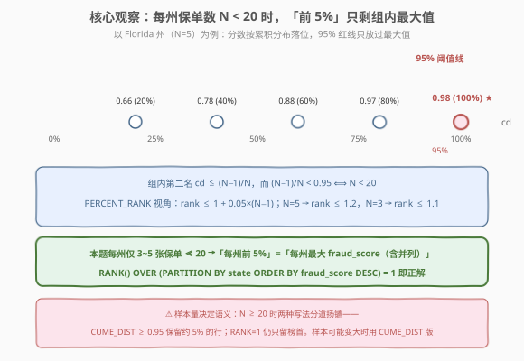
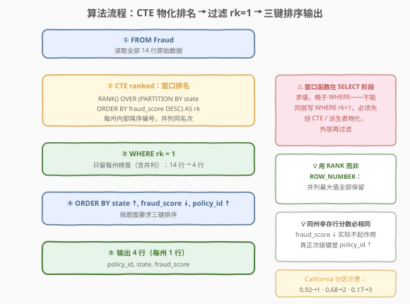
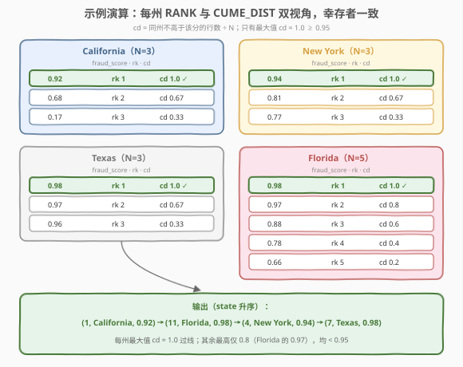

# 最高欺诈百分位数

- **题目名称**：最高欺诈百分位数
- **链接**：[3055. 最高欺诈百分位数](https://leetcode.cn/problems/top-percentile-fraud/)
- **难度**：中等
- **标签**：数据库、SQL、窗口函数、`RANK()`、`CUME_DIST()`、分组排名、LeetCode 锁题

## 1. 题目概述

> ⚠️ 本题为 LeetCode 付费题（锁题），题意描述根据官方示例用例与外部资料重建，可能与官方题面有出入。

**表结构**：`Fraud`

| 列名 | 类型 |
|------|------|
| policy_id | int |
| state | varchar |
| fraud_score | int |

- `policy_id` 是这张表中具有唯一值的列。
- 每行包含一份保单的编号 `policy_id`、所在州 `state` 和欺诈分数 `fraud_score`。
- 表结构标注 `fraud_score` 为 int，但示例数据是 `0.92` 一类小数——按 $[0,1]$ 区间的**概率分**理解（锁题题面转录的常见不一致，以示例为准）。

**背景**：LeetCode 保险公司开发了一个 ML 驱动的**预测模型**来检测欺诈索赔的**可能性**，于是把经验最丰富的理赔员分配去处理被模型标记出来的**前 `5%`** 索赔。

**目标**：写一条 SQL 查询，找出**每个州**内欺诈分数位于**前 `5` 百分位数**（top 5 percentile）的索赔记录。

**输出排序**：`state` **升序**，`fraud_score` **降序**，`policy_id` **升序**。

**示例 1**：

```text
输入：
Fraud 表：
+-----------+------------+-------------+
| policy_id | state      | fraud_score |
+-----------+------------+-------------+
| 1         | California | 0.92        |
| 2         | California | 0.68        |
| 3         | California | 0.17        |
| 4         | New York   | 0.94        |
| 5         | New York   | 0.81        |
| 6         | New York   | 0.77        |
| 7         | Texas      | 0.98        |
| 8         | Texas      | 0.97        |
| 9         | Texas      | 0.96        |
| 10        | Florida    | 0.97        |
| 11        | Florida    | 0.98        |
| 12        | Florida    | 0.78        |
| 13        | Florida    | 0.88        |
| 14        | Florida    | 0.66        |
+-----------+------------+-------------+

输出：
+-----------+------------+-------------+
| policy_id | state      | fraud_score |
+-----------+------------+-------------+
| 1         | California | 0.92        |
| 11        | Florida    | 0.98        |
| 4         | New York   | 0.94        |
| 7         | Texas      | 0.98        |
+-----------+------------+-------------+

解释：
- California 州只有 1 号保单（0.92）落入该州前 5 百分位；
- Florida 州只有 11 号保单（0.98）落入该州前 5 百分位；
- New York 州只有 4 号保单（0.94）落入该州前 5 百分位；
- Texas 州只有 7 号保单（0.98）落入该州前 5 百分位。
```

**解释拆解**：

| 州 | 保单数 N | 排序后 fraud_score | 最大值 | 入选 |
|------|----------|--------------------|--------|------|
| California | 3 | 0.17 / 0.68 / **0.92** | 0.92 | 1 号 |
| Florida | 5 | 0.66 / 0.78 / 0.88 / 0.97 / **0.98** | 0.98 | 11 号 |
| New York | 3 | 0.77 / 0.81 / **0.94** | 0.94 | 4 号 |
| Texas | 3 | 0.96 / 0.97 / **0.98** | 0.98 | 7 号 |

**约束条件**：

- `policy_id` 具有唯一值——一份保单一行，一个州可有多行。
- `fraud_score` 取值在 $[0,1]$（概率分）。
- 判题数据中**每个州的保单数很少**（示例为 3~5 张）——这是后文「前 5% 语义退化」的关键前提。
- 输出列顺序为 `policy_id, state, fraud_score`，且需按 `state` 升序排列。

> 💡 **审题关键**：①「每个州各自算」→ 窗口函数 `PARTITION BY state`，**不是**全局排名；②「前 5 百分位」是相对本州分布而言的**相对位置**，与分数绝对大小无关（0.94 在 New York 入选，0.97 在 Florida 落选）；③ 输出三键排序 `state`↑、`fraud_score`↓、`policy_id`↑；④ 并列最大值应**同时入选**（同州两张保单同为最高分，没有理由只留一张）→ 用 `RANK` 而非 `ROW_NUMBER`；⑤ 每州保单数远小于 20，「前 5%」实际退化为「每州最大值」——这是本题最核心的观察，详见 2.2。

---

## 2. 解题思路

### 2.1 暴力思路：相关子查询手算累积分布

「前 5 百分位」的字面定义是**累积分布**：一行属于前 5% ⟺ 同州中「分数不高于它」的行占比 ≥ 95%。最直觉的写法是逐行用相关子查询把这个占比算出来：

```sql
SELECT f.policy_id, f.state, f.fraud_score
FROM Fraud f
WHERE (
    SELECT COUNT(*) FROM Fraud f2
    WHERE f2.state = f.state AND f2.fraud_score <= f.fraud_score
) / (
    SELECT COUNT(*) FROM Fraud f3
    WHERE f3.state = f.state
) >= 0.95
ORDER BY f.state, f.fraud_score DESC, f.policy_id;
```

逻辑完全正确——这其实就是手工实现的 `CUME_DIST()`。但每一行都要把同州的行数两遍，整体 $O(n^2)$ 嵌套扫描；而且「同州」「排序」「占比」这些概念在集合层面重复计算，正是窗口函数（`PARTITION BY` + 排序 + 聚合一站式完成）要解决的问题。

### 2.2 核心观察：每州保单数 < 20 时，「前 5%」退化为「组内最大」



把「前 5 百分位」形式化为 **`CUME_DIST`（累积分布）≥ 0.95**，即定义 $\text{cd}(x) = \dfrac{\#\{\text{同州中 fraud\_score} \le x\}}{N}$：

- **组内最大值**：$\text{cd} = \dfrac{N}{N} = 1.0 \ge 0.95$，**永远入选**；
- **组内第二名**（与最大值无并列时）：$\text{cd} \le \dfrac{N-1}{N}$，而

$$\frac{N-1}{N} < 0.95 \iff 0.05N < 1 \iff N < 20$$

也就是说，**当一个州的保单数 $N < 20$ 时，第二名无论分数多高都过不了 95% 线**——「前 5%」退化为「组内最大值（含并列）」。换 `PERCENT_RANK` 视角结论相同：$\text{PERCENT\_RANK} = \dfrac{\text{rank}-1}{N-1} \ge 0.95 \iff \text{rank} \le 1 + 0.05(N-1)$，$N=5$ 时 $\text{rank} \le 1.2$，$N=3$ 时 $\text{rank} \le 1.1$——都只剩 rank 1。

本题判题数据每个州只有 3~5 张保单，$\ll 20$，所以：

> **「每州前 5 百分位」≡「每州最大 fraud_score（并列全保留）」**

一条 `RANK() OVER (PARTITION BY state ORDER BY fraud_score DESC) = 1` 即为正解。

> ⚠️ 这是「**样本量决定语义**」的典型例子：判题数据每州行数少，使「前 5%」的字面语义与「每州最大值」不可区分。若样本可能变大（$N \ge 20$），两种写法会分道扬镳——`CUME_DIST ≥ 0.95` 将保留约 5% 的行，`RANK = 1` 仍只留榜首。工程上更稳的写法是直接用 `CUME_DIST()` 表达百分位语义（参考代码解法 C）。

> 💡 **为什么是 `RANK` 不是 `ROW_NUMBER`**：若同州两张保单并列最大，两者的 `CUME_DIST` 都等于 1.0，都应入选；`RANK()` 给并列行相同名次（都是 1），而 `ROW_NUMBER()` 会强行编成 1、2 各不相同，`WHERE rn = 1` 会随机丢弃一张保单——语义错误。

### 2.3 算法流程图



**逻辑执行步骤**：

| 步骤 | 子句 | 作用 |
|------|------|------|
| ① | `FROM Fraud` | 读取全部 14 行原始数据 |
| ② | `RANK() OVER (PARTITION BY state ORDER BY fraud_score DESC)` | 每州内部按分数降序排名，并列同名次（4 个分区各自独立编号） |
| ③ | `WHERE rk = 1` | 只留每州榜首（含并列），14 行 → 4 行 |
| ④ | `ORDER BY state, fraud_score DESC, policy_id` | 按题目要求三键排序输出 |

> 💡 **窗口函数不能直接进 `WHERE`**：SQL 逻辑执行顺序为 `FROM → WHERE → GROUP BY → HAVING → SELECT`（窗口函数在 `SELECT` 阶段求值）`→ ORDER BY`。窗口列 `rk` 在 `WHERE` 执行时尚不存在，所以必须先经 CTE 或派生表**物化**一层排名结果，外层再过滤——这是 MySQL 窗口函数的高频考点，也是本题代码必须「套两层」的原因。

### 2.4 示例演算

以示例 1 的 14 行数据为例，跟踪「分区排名 → 过滤」全过程，并用 `CUME_DIST` 视角交叉验证：



**窗口分区后每州排名（fraud_score 降序）**：

| 州 | fraud_score（降序）与 rk | 幸存者 |
|------|--------------------------|--------|
| California | **0.92 (rk 1)** · 0.68 (rk 2) · 0.17 (rk 3) | 1 号 (0.92) |
| Florida | **0.98 (rk 1)** · 0.97 (rk 2) · 0.88 (rk 3) · 0.78 (rk 4) · 0.66 (rk 5) | 11 号 (0.98) |
| New York | **0.94 (rk 1)** · 0.81 (rk 2) · 0.77 (rk 3) | 4 号 (0.94) |
| Texas | **0.98 (rk 1)** · 0.97 (rk 2) · 0.96 (rk 3) | 7 号 (0.98) |

**CUME_DIST 视角交叉验证**（cd = 同州不高于该分行数 ÷ N）：

| 州 | 各行 CUME_DIST | 95% 线判定 |
|------|----------------|------------|
| California (N=3) | 0.17→0.33 · 0.68→0.67 · **0.92→1.0** | 仅 0.92 的 cd ≥ 0.95 |
| Florida (N=5) | 0.66→0.2 · 0.78→0.4 · 0.88→0.6 · 0.97→0.8 · **0.98→1.0** | 仅 0.98 的 cd ≥ 0.95 |
| New York (N=3) | 0.77→0.33 · 0.81→0.67 · **0.94→1.0** | 仅 0.94 的 cd ≥ 0.95 |
| Texas (N=3) | 0.96→0.33 · 0.97→0.67 · **0.98→1.0** | 仅 0.98 的 cd ≥ 0.95 |

两个视角幸存者完全一致——每州最大值的 cd = 1.0 过线，其余最高的也只有 0.8（Florida 的 0.97），离 0.95 还差一截。

**最终输出**（`state` 升序）：

```text
(1,  California, 0.92)
(11, Florida,    0.98)
(4,  New York,   0.94)
(7,  Texas,      0.98)
```

> 💡 注意 `rk = 1` 时同州幸存行分数必然相同（并列最大），三键排序中 `fraud_score DESC` 实际不起作用，真正的次级键是 `policy_id`；但若改用解法 C（可能幸存多档分数），三键排序就缺一不可。照题面把三个键写全是稳妥习惯。

---

## 3. 参考代码

### SQL（解法 A：`RANK()` 窗口 + CTE，推荐）

```sql
# Write your MySQL query statement below
WITH ranked AS (
    SELECT
        policy_id,
        state,
        fraud_score,
        RANK() OVER (
            PARTITION BY state
            ORDER BY fraud_score DESC
        ) AS rk
    FROM Fraud
)
SELECT policy_id, state, fraud_score
FROM ranked
WHERE rk = 1
ORDER BY state, fraud_score DESC, policy_id;
```

> 💡 **写法要点**：
> - `PARTITION BY state`：每州独立排名，对应「每个州各自算」；
> - `ORDER BY fraud_score DESC`：分数最高的 rk = 1；
> - `RANK()` 而非 `ROW_NUMBER()`：并列最大值全部保留；
> - CTE `ranked` 物化窗口列后，外层才能 `WHERE rk = 1`（窗口函数不能直接进 `WHERE`）；
> - 输出三键排序与题面逐字对齐。

### SQL（解法 B：`GROUP BY` 最大值 + 自连接，兼容 MySQL 5.x）

```sql
SELECT f.policy_id, f.state, f.fraud_score
FROM Fraud f
JOIN (
    SELECT state, MAX(fraud_score) AS top_score
    FROM Fraud
    GROUP BY state
) m ON f.state = m.state AND f.fraud_score = m.top_score
ORDER BY f.state, f.fraud_score DESC, f.policy_id;
```

> 💡 **无窗口函数时代的等价写法**：内层 `GROUP BY state` + `MAX(fraud_score)` 先算出每州榜首分数，外层**等值连接** `f.fraud_score = m.top_score` 把达到榜首分数的所有行找回来——并列最大天然全部匹配，语义与 `RANK() = 1` 完全一致。代价是两趟扫描加一次连接；窗口函数版本（解法 A）单趟排序即可。

### SQL（解法 C：`CUME_DIST()`，忠于「前 5%」字面语义）

```sql
SELECT policy_id, state, fraud_score
FROM (
    SELECT
        policy_id,
        state,
        fraud_score,
        CUME_DIST() OVER (
            PARTITION BY state
            ORDER BY fraud_score
        ) AS cd
    FROM Fraud
) t
WHERE cd >= 0.95
ORDER BY state, fraud_score DESC, policy_id;
```

> 💡 **百分位的「字面直译」**：`CUME_DIST()` 返回当前行在分区内的累积分布（同分区中排序值不大于当前行的行数占比），`cd >= 0.95` 正是「前 5 百分位」的定义。注意 `OVER` 里是 `ORDER BY fraud_score` **升序**——累积分布从最小值往最大值累积，最大值的 cd 恒为 1.0。在判题数据上与解法 A 结果一致；若某州保单数达到 20 以上，只有这个版本仍忠于题意（解法 A 会漏掉榜首之外的前 5% 行）。**样本量可能变大时选 C。**

### Pandas

```python
import pandas as pd


def top_percentile_fraud(fraud: pd.DataFrame) -> pd.DataFrame:
    top = fraud.groupby("state")["fraud_score"].transform("max")
    result = fraud[fraud["fraud_score"] == top]
    return (
        result.sort_values(
            ["state", "fraud_score", "policy_id"],
            ascending=[True, False, True],
        )[["policy_id", "state", "fraud_score"]]
        .reset_index(drop=True)
    )
```

> 💡 **pandas 对照**：`groupby("state")["fraud_score"].transform("max")` 把每州最大值**广播回每一行**（对应窗口函数的分区语义，返回与原表等长的 Series）；布尔索引 `fraud_score == top` 对应 `WHERE rk = 1`，并列最大值自然全保留；最后按三键排序并裁剪列顺序，与 SQL 输出对齐。

---

## 4. 复杂度分析

| 维度 | 复杂度 | 说明 |
|------|--------|------|
| **时间复杂度** | $O(n \log n)$ | 窗口函数需按 `(state, fraud_score)` 分区排序；解法 B 为两趟扫描 $O(n)$ + 连接（州数 $k \ll n$ 时近似线性） |
| **空间复杂度** | $O(n)$ | CTE / 派生表需物化整表加排名列 |

> - $n$ 为 `Fraud` 行数，$k$ 为州数。
> - **索引优化**：建 `(state, fraud_score)` 复合索引后，`PARTITION BY state ORDER BY fraud_score` 可直接沿用索引序（分组连续 + 组内有序），省掉排序；解法 B 的 `GROUP BY state + MAX(fraud_score)` 还可走 loose index scan，每组只读索引里最后一条。
> - LeetCode 判题数据小（每州几行），三种解法均在毫秒级，差异体现在语义忠实度与兼容性上。

---

## 5. 扩展：百分位的几种 SQL 表达与边界差异

### 5.1 「前 5%」的四种写法对比

| 写法 | 定义 | 判据 | N=100 无并列时保留 | N=5 时保留 |
|------|------|------|--------------------|-----------|
| `CUME_DIST()` | 同分区中值 ≤ 当前值的行占比 | $\ge 0.95$ | 前 6 行 | 仅第 1 名 |
| `PERCENT_RANK()` | $\frac{\text{rank}-1}{N-1}$ | $\ge 0.95$ | 前 5 行 | 仅第 1 名 |
| `NTILE(20)` | 均分 20 桶 | 桶号 = 1 | 前 5 行 | 仅第 1 名 |
| `RANK()` | 名次 | $= 1$ | 仅第 1 名 | 仅第 1 名 |

四个写法在 $N < 20$ 时殊途同归（都退化为组内最大），$N$ 变大后开始分野。边界也各有讲究：$N=20$ 时第二名的 `CUME_DIST` 恰为 $19/20 = 0.95$，按 $\ge$ 判据会入选（实际保留了前 10%），而 `PERCENT_RANK` 视角下它只有 $1/19 \approx 0.053$ 被排除——**整数行数下「前 5%」没有唯一完美定义**，含不含边界、并列怎么算，工程上必须与需求方对齐。

### 5.2 MySQL 没有 `PERCENTILE_CONT`

Oracle / PostgreSQL / SQL Server 提供 `PERCENTILE_CONT(0.95) WITHIN GROUP (ORDER BY ...)` 直接算分位数，MySQL（含 8.0）**没有**这个函数——只能用 `PERCENT_RANK` / `CUME_DIST` / `NTILE` 等价模拟。这是方言差异面试题的常客：被问「MySQL 怎么求 95 分位数」时，答 `CUME_DIST() OVER (...) >= 0.95` 或 `PERCENT_RANK() OVER (...) >= 0.95` 均可。

### 5.3 并列分数：RANK / DENSE_RANK / ROW_NUMBER 的选择

| 函数 | 序列示例（两行并列第 1） | 本题 `= 1` 是否正确 |
|------|--------------------------|---------------------|
| `RANK()` | 1, 1, 3（并列同名次，跳号） | ✅ 并列最大全保留 |
| `DENSE_RANK()` | 1, 1, 2（并列同名次，不跳号） | ✅ 并列最大仍是 1 |
| `ROW_NUMBER()` | 1, 2, 3（强行唯一编号） | ❌ 并列时随机丢弃 |

本题取榜首时 `RANK` 与 `DENSE_RANK` 等价（榜首名次恒为 1），差异要到「取每组前 N 名」才显现（[185. 部门工资前三高的所有员工](https://leetcode.cn/problems/department-top-three-salaries/) 正是为此用 `DENSE_RANK`）。

### 5.4 变体：若业务要求「严格前 5%」

有的业务定义「样本不足时不算」：$N < 20$ 时 $5\%$ 截断不足一行，应输出空集或整州跳过。此时需先 `COUNT(*) OVER (PARTITION BY state)` 拿到 $N$，再按 $\text{rank} \le \lceil 0.05N \rceil$ 之类的显式公式判定。这正反衬出本题题面的模糊之处——判题数据让所有合理定义收敛到同一答案。

---

## 6. 面试要点

1. **为什么「前 5 百分位」可以用 `RANK() = 1` 实现？**

   > 因为判题数据每个州只有 3~5 张保单。形式化：处于前 5% ⟺ `CUME_DIST ≥ 0.95`，而组内第二名的 `CUME_DIST ≤ (N−1)/N`，当 $N < 20$ 时恒小于 0.95——于是「前 5%」退化为「组内最大值（含并列）」。若 $N \ge 20$，必须改用 `CUME_DIST()` / `PERCENT_RANK()` 判定，否则会漏掉榜首之外的前 5% 行。面试答出「退化条件 $N < 20$」比背结论更加分。

2. **窗口函数为什么不能直接写在 `WHERE` 里？**

   > SQL 逻辑执行顺序是 `FROM → WHERE → GROUP BY → HAVING → SELECT → ORDER BY`，窗口函数在 `SELECT` 阶段、基于 `WHERE` 过滤后的行集求值——`WHERE` 执行时窗口列尚不存在。所以必须先经 CTE 或派生表物化排名列，外层再 `WHERE rk = 1`。同理窗口函数也不能进 `GROUP BY`/`HAVING`。

3. **`RANK`、`DENSE_RANK`、`ROW_NUMBER` 在本题怎么选？**

   > 并列最大值应全部入选：`RANK() = 1` 与 `DENSE_RANK() = 1` 都对（并列者名次均为 1）；`ROW_NUMBER() = 1` 会给并列行强行编 1、2，只留一行，语义错误。三者的差异在跳号（`RANK` 跳号、`DENSE_RANK` 不跳）与唯一性（`ROW_NUMBER` 唯一），取「每组前 N」时选 `DENSE_RANK`，取「恰好 N 行」时才用 `ROW_NUMBER`。

4. **`GROUP BY` + `MAX` + 自连接（解法 B）与窗口函数如何取舍？**

   > 等值连接 `f.fraud_score = m.top_score` 天然保留所有并列最大行，语义与 `RANK = 1` 一致；优点是兼容没有窗口函数的 MySQL 5.x，代价是两趟扫描加一次连接。窗口函数单趟排序搞定、可读性更好，但要求 8.0+。老版本兼容选 B，新版本可读性选 A——两边语义一致性是靠「MAX 等值匹配保留并列」保证的，这点要能说清。

5. **0.97 在 Florida 落选、0.94 在 New York 入选，说明什么？**

   > 百分位是**组内相对位置**而非分数绝对阈值：0.97 在 Florida 只排在第 2/5（cd = 0.8 < 0.95）落选；0.94 在 New York 是第 1/3（cd = 1.0）入选。这正是 `PARTITION BY state` 的意义——每个州有自己的分布。若误写成全局排名，会得出完全不同的答案（全局只剩 0.98 一档）。

> 💡 **一句话总结**：3055 是「**分组排名 + 百分位语义退化**」的组合题——「每州前 5%」在每组样本 $N < 20$ 时退化为「每州最大 fraud_score（含并列）」，一条 `RANK() OVER (PARTITION BY state ORDER BY fraud_score DESC) = 1` 收工；但要能讲清退化条件（`CUME_DIST` 第二名 $\le (N-1)/N < 0.95 \iff N < 20$）、窗口函数不能进 `WHERE`（CTE 物化）、以及 `RANK` 保留并列的设计。样本可能变大时，用 `CUME_DIST() ≥ 0.95` 才是忠于题意的写法。

---

## 7. 同类练习题

- [184. 部门工资最高的员工](https://leetcode.cn/problems/department-highest-salary/)（[题解](../0101-0200/184_部门工资最高的员工.md)）：每部门最高薪（含并列）——`GROUP BY + MAX + JOIN` 与窗口函数双解，与本题解法 A/B 完全同构
- [185. 部门工资前三高的所有员工](https://leetcode.cn/problems/department-top-three-salaries/)（[题解](../0101-0200/185_部门工资前三高的所有员工.md)）：`DENSE_RANK() <= 3` 取每组前三，RANK 三兄弟差异的招牌题
- [178. 分数排名](https://leetcode.cn/problems/rank-scores/)（[题解](../0101-0200/178_分数排名.md)）：`RANK` 与 `DENSE_RANK` 输出名次列的直接对比，窗口排名入门必刷
- [177. 第 N 高的薪水](https://leetcode.cn/problems/nth-highest-salary/)（[题解](../0101-0200/177_第N高的薪水.md)）：全局第 N 名的窗口 / `LIMIT OFFSET` 实现，排名家族的「取第 N 名」分支
- [586. 订单最多的客户](https://leetcode.cn/problems/customer-placing-the-largest-number-of-orders/)（[题解](../0501-0600/586_订单最多的客户.md)）：分组聚合后取全局最值，与本题「分组后取组内最优」互为镜像
