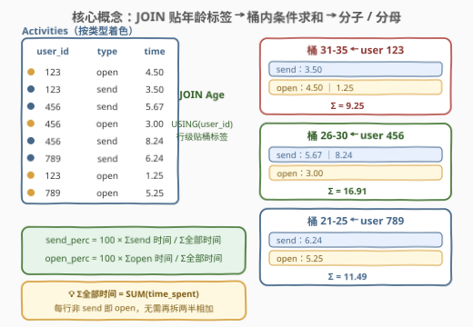
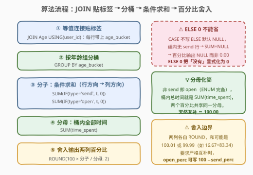
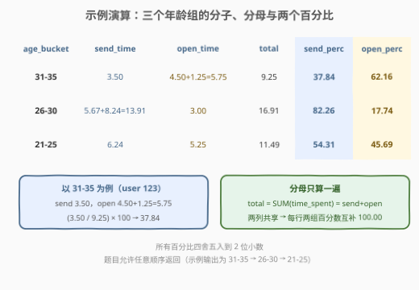

# 快照分析

- **题目名称**：快照分析
- **链接**：[3056. 快照分析](https://leetcode.cn/problems/snaps-analysis/)
- **难度**：中等
- **标签**：SQL、JOIN、GROUP BY、条件聚合、ROUND

## 1. 题目概述

> ⚠️ 本题为 LeetCode 付费题，题意描述根据官方示例用例与 hints 重建，可能与官方题面有出入。（题面已与社区镜像 doocs/leetcode 的官方中文翻译交叉核对，出入风险较低。）

Snap 记录了用户发送（`send`）和打开（`open`）快照的活动流水，每个用户属于一个年龄组（`age_bucket`）。编写解决方案，计算**每个年龄组**花在**发送**和**打开**快照上的总时间**百分比**，四舍五入到小数点后 `2` 位，以**任意顺序**返回结果表。

**表结构**：

```text
表：Activities
+---------------+---------+
| Column Name   | Type    |
+---------------+---------+
| activity_id   | int     |  ← 值互不相同的列
| user_id       | int     |
| activity_type | enum    |  ← ('send', 'open')
| time_spent    | decimal |
+---------------+---------+
包含活动 id、用户 id、活动类型和所花时间。

表：Age
+-------------+---------+
| Column Name | Type    |
+-------------+---------+
| user_id     | int     |  ← 值互不相同的列
| age_bucket  | enum    |  ← ('21-25', '26-30', '31-35')
+-------------+---------+
包含用户 id 和年龄组。
```

**示例 1**：

```text
输入：
Activities 表:
+-------------+---------+---------------+------------+
| activity_id | user_id | activity_type | time_spent |
+-------------+---------+---------------+------------+
| 7274        | 123     | open          | 4.50       |
| 2425        | 123     | send          | 3.50       |
| 1413        | 456     | send          | 5.67       |
| 2536        | 456     | open          | 3.00       |
| 8564        | 456     | send          | 8.24       |
| 5235        | 789     | send          | 6.24       |
| 4251        | 123     | open          | 1.25       |
| 1435        | 789     | open          | 5.25       |
+-------------+---------+---------------+------------+
Age 表:
+---------+------------+
| user_id | age_bucket |
+---------+------------+
| 123     | 31-35      |
| 789     | 21-25      |
| 456     | 26-30      |
+---------+------------+

输出：
+------------+-----------+-----------+
| age_bucket | send_perc | open_perc |
+------------+-----------+-----------+
| 31-35      | 37.84     | 62.16     |
| 26-30      | 82.26     | 17.74     |
| 21-25      | 54.31     | 45.69     |
+------------+-----------+-----------+

解释：
对于年龄组 31-35：
  - 只有一个用户属于该组，用户 ID 为 123。
  - 该用户花费在发送快照上的总时间为 3.50，打开快照的总时间为 4.50 + 1.25 = 5.75。
  - 总时间为 3.50 + 5.75 = 9.25。
  - 发送百分比 (3.50 / 9.25) × 100 = 37.84，打开百分比 (5.75 / 9.25) × 100 = 62.16。
对于年龄组 26-30：send 13.91 / open 3.00 / total 16.91 → 82.26 / 17.74。
对于年龄组 21-25：send 6.24 / open 5.25 / total 11.49 → 54.31 / 45.69。
所有百分比四舍五入到两位小数。
```

**约束条件**（依据示例重建）：

- `activity_id` 是 `Activities` 中值互不相同的列，`user_id` 是 `Age` 中值互不相同的列；
- `activity_type` 是 ENUM 类型，取值 `('send', 'open')`；`age_bucket` 取值 `('21-25', '26-30', '31-35')`；
- 输出列为 `age_bucket`、`send_perc`、`open_perc`，百分比保留 2 位小数，任意顺序返回。

> 💡 两个关键前提：① **`activity_type` 只有两类且完备**——每行时间要么计入 send 要么计入 open，桶内总时间就是 `SUM(time_spent)`，分母无需再拆成两半相加；② **两个百分比共享同一分母**——`send_perc + open_perc` 恒等于 100（舍入前）。抓住这两点，一趟 `GROUP BY` 就能同时拿到分子和分母。

---

## 2. 解题思路

### 2.1 暴力思路：应用层拉全表 / 每格一个子查询

最直觉的写法：把两张表全量拉到内存，用字典按年龄组分别累加 send、open 时间，再逐组算百分比：

```text
for row in Activities:                    # 拉全表
    bucket = age_map[row.user_id]
    agg[bucket][row.type] += row.time     # 应用层分组求和
for bucket in agg:                        # 再逐组算百分比
    print(bucket, round(100*send/total, 2), ...)
```

把数据库本来就最擅长的「分组聚合」搬到应用层重做，$n$ 行数据全部过网络。SQL 层的暴力版则是对**每个年龄组 × 每种类型**写一个相关子查询：

```sql
SELECT age_bucket,
       (SELECT ROUND(100 * SUM(time_spent) / (/* 再嵌一层求 total */) , 2)
        FROM Activities JOIN Age ... WHERE age_bucket = ... AND activity_type = 'send'),
       (SELECT ... 'open' ...)
FROM Age GROUP BY age_bucket;
```

同一张表被反复扫描，且 `activity_type` 这个**行方向的取值**被硬编码成多个列——这正是**条件聚合（conditional aggregation）**要一键解决的事。

### 2.2 核心观察：条件聚合——一趟 GROUP BY 同时拿到分子与分母



把问题拆成三步就一眼看穿：

1. **贴标签**：`JOIN Age USING(user_id)`——活动行本身没有年龄组，靠等值连接把 `age_bucket` 附到每一行上；
2. **分桶**：`GROUP BY age_bucket`——之后所有的 `SUM` 都自动「桶内」计算；
3. **行变列**：`activity_type` 是行方向的类别，要变成输出里的两**列** `send_perc` / `open_perc`，标准姿势就是**条件聚合**——`SUM(IF(activity_type='send', time_spent, 0))` 把「该桶内 send 行的时间之和」折叠成一个标量，open 同理。

而**分母**由于 `activity_type` 对每行完备二选一，直接 `SUM(time_spent)`（桶内全部行求和）即可，不需要 `send和 + open和` 再相加。

> 💡 **条件聚合的本质**：`IF(cond, t, 0)` 先把每行改写成「命中条件贡献 `t`、否则贡献 `0`」的数值列，`SUM` 再把它压成一个数——`GROUP BY` 的每一个组各自完成一次折叠，于是「组 × 类型」的二维表被压成「组一行、类型多列」的宽表。这是 SQL 里**行转列**最轻量的武器（比 `PIVOT` / 窗口函数都轻）。

> ⚠️ **`ELSE 0` 不能省**：`CASE WHEN` 不写 `ELSE` 时默认 `ELSE NULL`，若某组内没有任何 send 行，`SUM` 会返回 `NULL`（`SUM` 忽略 NULL 但全 NULL 组的结果是 `NULL`），整个百分比随之变成 `NULL` 而不是 `0.00`。`ELSE 0` 把「没有」显式化为 0。

### 2.3 算法流程图



**逻辑执行步骤**：

| 步骤 | 操作 | 作用 |
|------|------|------|
| ① | `JOIN Age USING(user_id)` | 每行活动附上 `age_bucket` 标签 |
| ② | `GROUP BY age_bucket` | 后续聚合自动按年龄组分桶 |
| ③ | `SUM(IF(type='send', time_spent, 0))`、`SUM(IF(type='open', time_spent, 0))` | 行方向类别 → 列方向分子 |
| ④ | `SUM(time_spent)` | 分母 = 桶内全部时间（ENUM 完备的化简） |
| ⑤ | `ROUND(100 × 分子 / 分母, 2)` | 输出 `send_perc` / `open_perc` |

### 2.4 示例演算

以示例 1 全量数据走一遍（`Activities JOIN Age` 后按 `age_bucket` 分桶求和）：



**分桶后的聚合明细**：

| age_bucket | send_time | open_time | total | send_perc | open_perc |
|------------|-----------|-----------|-------|-----------|-----------|
| 31-35 | 3.50 | 4.50 + 1.25 = 5.75 | 9.25 | (3.50/9.25)×100 = **37.84** | (5.75/9.25)×100 = **62.16** |
| 26-30 | 5.67 + 8.24 = 13.91 | 3.00 | 16.91 | (13.91/16.91)×100 = **82.26** | (3.00/16.91)×100 = **17.74** |
| 21-25 | 6.24 | 5.25 | 11.49 | (6.24/11.49)×100 = **54.31** | (5.25/11.49)×100 = **45.69** |

**输出**（任意顺序均可）：

```text
+------------+-----------+-----------+
| age_bucket | send_perc | open_perc |
+------------+-----------+-----------+
| 31-35      | 37.84     | 62.16     |
| 26-30      | 82.26     | 17.74     |
| 21-25      | 54.31     | 45.69     |
+------------+-----------+-----------+
```

注意每一行 `send_perc + open_perc = 100.00`——因为分子之和恰好等于分母（见 5.1 的舍入边界讨论）。

---

## 3. 参考代码

### 解法 A：JOIN + IF 条件聚合（MySQL，推荐）

```sql
# Write your MySQL query statement below
SELECT age_bucket,
       ROUND(100 * SUM(IF(activity_type = 'send', time_spent, 0)) / SUM(time_spent), 2) AS send_perc,
       ROUND(100 * SUM(IF(activity_type = 'open',  time_spent, 0)) / SUM(time_spent), 2) AS open_perc
FROM Activities
JOIN Age USING (user_id)
GROUP BY age_bucket;
```

> 💡 **写法要点**：
> - **`SUM(IF(..., time_spent, 0))` 一趟出分子**：在聚合函数内部做条件判断，「组 × 类型」二维聚合折叠成一行两列，无需子查询、无需自连接；
> - **分母直接 `SUM(time_spent)`**：每行非 send 即 open，桶内总时间就是全部行求和——`IF` 里的 `0` 不影响分母（分母是独立的另一个聚合）；
> - **`ELSE 0`（IF 第三参）保证空组语义**：某组只有 open 行时 send 分子为 `0`，输出 `0.00` 而非 `NULL`；
> - **两个 `ROUND` 各自独立**：都在最外层 SELECT 完成，`100 *` 要放在 `ROUND` 里侧。

### 解法 B：CTE 先聚合、再算百分比（标准 SQL 写法）

```sql
# Write your MySQL query statement below
WITH agg AS (
    SELECT age_bucket,
           SUM(CASE WHEN activity_type = 'send' THEN time_spent ELSE 0 END) AS send_time,
           SUM(CASE WHEN activity_type = 'open' THEN time_spent ELSE 0 END) AS open_time
    FROM Activities
    JOIN Age USING (user_id)
    GROUP BY age_bucket
)
SELECT age_bucket,
       ROUND(100 * send_time / (send_time + open_time), 2) AS send_perc,
       ROUND(100 * open_time / (send_time + open_time), 2) AS open_perc
FROM agg;
```

> 💡 **写法要点**：
> - **`CASE WHEN ... ELSE 0 END` 是跨库通用的条件聚合写法**（MySQL 的 `IF` 是方言）；PostgreSQL / SQLite 还可以用更优雅的 `SUM(time_spent) FILTER (WHERE activity_type = 'send')`；
> - **两级结构先聚合再计算**：分子只算一遍，百分比公式在干净的小结果集（每组一行）上展开，分母 `send_time + open_time` 与 `SUM(time_spent)` 在 ENUM 完备前提下等价，但若未来出现第三类活动，前者语义就变了——想保持「总时间」语义应改回 `SUM(time_spent)` 一并带出；
> - CTE 让「聚合」与「展示计算」解耦，面试时更易讲清中间结果。

### Python（pandas）

```python
import pandas as pd

def snap_analysis(activities: pd.DataFrame, age: pd.DataFrame) -> pd.DataFrame:
    m = activities.merge(age, on='user_id')
    g = m.groupby(['age_bucket', 'activity_type'], as_index=False)['time_spent'].sum()
    p = g.pivot(index='age_bucket', columns='activity_type', values='time_spent') \
          .fillna(0).reset_index()
    p.columns.name = None
    total = p['send'] + p['open']
    p['send_perc'] = (100 * p['send'] / total).round(2)
    p['open_perc'] = (100 * p['open'] / total).round(2)
    return p[['age_bucket', 'send_perc', 'open_perc']]
```

> 💡 **pandas 对照**：`groupby(['age_bucket','activity_type']).sum()` + `pivot` = SQL 的条件聚合「行转列」；`fillna(0)` 对应 `ELSE 0`（某组缺某类活动时透视出 NaN，必须补 0，否则百分比变 NaN）；`.round(2)` 对应 `ROUND(..., 2)`。若想更贴近 SQL 一步到位的写法，也可以 `m['send_t'] = m['time_spent'].where(m['activity_type'].eq('send'), 0)` 后直接 `groupby('age_bucket')[['send_t','open_t']].sum()`——与解法 A 逐行同构。

---

## 4. 复杂度分析

| 维度 | 复杂度 | 说明 |
|------|--------|------|
| **时间** | $O(n)$ | 连接按 `user_id` 哈希查找 $O(1)$/行，分组聚合一趟扫描（哈希分组）；走排序分组则为 $O(n \log n)$ |
| **空间** | $O(g)$ | $g$ = 年龄组数（ENUM 上限 3），聚合中间态每桶常数个累加器；连接阶段哈希表 $O(\min(n, u))$，$u$ 为 Age 表行数 |
| **输出行数** | $O(g)$ | 每个有活动的年龄组恰出一行 |

> ⚠️ 解法 A/B 都是单趟扫描 + 单次分组，没有相关子查询的 $O(n^2)$ 风险；性能瓶颈只在连接——`Age.user_id` 建索引（或作为主键）后连接退化为哈希/索引点查。

---

## 5. 扩展：舍入边界、人数占比变体与缺数据语义

### 5.1 `send_perc + open_perc` 一定等于 100.00 吗？

舍入**前**恒等于 100（分子之和 = 分母）；舍入**后**各自 `ROUND(x, 2)` 可能产生 $0.01$ 的漂移。例如 $\frac{5003}{30000} \to 16.68$ 与 $\frac{24997}{30000} \to 83.32$ 正好凑整，但构造 $16.665 : 83.335$ 这类比值时会得到 $16.67 + 83.34 = 100.01$。若业务要求两列**严格互补**，可写 `open_perc = 100 - send_perc`（先舍入再相减，和恒为 100.00，代价是第二列可能比「独立舍入」差半个 ulp）。本题判定按官方公式独立舍入，无需处理。

另外注意 **`ROUND` 的舍入规则差异**：MySQL 的 `ROUND` 是 half away from zero（`33.335 → 33.34`），pandas 的 `Series.round` 是 IEEE 半偶舍入且受浮点表示影响——跨语言实现同一报表时，`.xx5` 边界值可能差 `0.01`。

### 5.2 从「时间占比」到「人数占比」

把分子从「时间和」换成「行数和」，即统计**每个年龄组发送过快照的用户比例**：

```sql
SELECT age_bucket,
       ROUND(100 * COUNT(DISTINCT IF(activity_type = 'send', user_id, NULL)) / COUNT(DISTINCT user_id), 2) AS send_user_perc
FROM Activities JOIN Age USING (user_id)
GROUP BY age_bucket;
```

`IF(cond, val, NULL)` 配 `COUNT`（忽略 NULL）是条件计数的标配——`ELSE 0` 在 `COUNT` 语境要换成 `NULL`（`COUNT` 连 0 也数）。1173「即时食物配送 I」、1322「广告效果」都是这个家族。

### 5.3 连接方向与缺数据语义

本题用 `JOIN`（内连接）意味着：**有活动但不在 Age 表的用户被丢弃；在 Age 表但无活动的年龄组整组消失**。若产品语义是「没有活动的组也要出一行」，需要从 `Age` 侧 `LEFT JOIN`——但此时该组 `SUM(time_spent)` 为 `NULL`，除法结果为 `NULL`（MySQL 中除以 0 也返回 `NULL` 而非报错），输出自然呈现 `NULL` 百分比。要不要把 `NULL` 补成 `0.00`，属于语义选择：除零组「无数据」与「占比为零」是两回事，**面试时主动指出这一点比写对 JOIN 更加分**。

---

## 6. 面试要点

1. **条件聚合有哪几种写法？各自的可移植性如何？**

   - `SUM(IF(cond, t, 0))`：MySQL 方言，最短；
   - `SUM(CASE WHEN cond THEN t ELSE 0 END)`：标准 SQL，全库通用（解法 B）；
   - `SUM(t * (cond))`：MySQL 布尔表达式即 0/1 的隐式技巧，可读性差不推荐；
   - `SUM(t) FILTER (WHERE cond)`：SQL 标准扩展，PostgreSQL / SQLite 3.30+ 支持，语义最直白。
   面试默认写 `CASE WHEN`，被问「还有吗」再报 `IF` 与 `FILTER`。

2. **`ELSE 0` 能不能省？**

   - 省略后 `CASE` 默认 `ELSE NULL`。组内存在 send 行时 `SUM` 忽略 NULL、结果相同；但组内**没有** send 行时 `SUM` 返回 `NULL`，百分比整列输出 `NULL` 而非 `0.00`。`ELSE 0` 把「没有该类活动」显式化为 0，是防御性语义的体现（对应 pandas 透视后的 `fillna(0)`）。

3. **分母为什么可以直接写 `SUM(time_spent)`？**

   - `activity_type` 是 `('send','open')` 的 ENUM，对每行完备二选一，桶内 $\sum send + \sum open = \sum全部$，两个分子之和就是分母。这是一个**数据语义假设**——若引入第三类活动（如 `receive`），该化简失效，分母必须独立求和。答出来等于向面试官展示「知道自己在偷什么懒」。

4. **两个百分比之和在舍入后还恒为 100.00 吗？**

   - 不恒等。独立 `ROUND` 的误差各至多 $0.005$，和可能是 `100.01` 或 `99.99`（见 5.1）。要求严格互补时改写第二列为 `100 - send_perc`；本题按官方语义独立舍入即可。

5. **数据量大时这个查询怎么优化？**

   - 连接侧：`Age(user_id)` 建索引/主键，活动表按 `user_id` 探测；
   - 聚合侧：哈希分组本就 $O(n)$，若优化器走排序可考虑 `GROUP BY` 列与连接列一致的复合索引；
   - 架构侧：活动表远大于用户表时，可先按 `(user_id, activity_type)` 预聚合（每用户两行）再 JOIN，把连接输入从「活动行数」降到「用户数 × 2」——典型的**先聚合再连接**省连接代价手法。

> 💡 **一句话总结**：3056 的骨架是「**JOIN 贴标签 + 条件聚合把行方向的类别折叠成列方向的两个分子 + SUM(time_spent) 偷懒当分母 + ROUND 收尾**」。它与 1173 / 1322 的「百分比家族」一脉相承，考的不是 SQL 难度，而是能否一眼把「每组的分类占比」识别成一次 `GROUP BY` 就能解决的条件聚合题。

---

## 7. 同类练习题

- [1173. 即时食物配送 I](https://leetcode.cn/problems/immediate-food-delivery-i/)：`ROUND(AVG(条件)×100, 2)` 算首单即时率——「百分比 + 舍入」的最简入门
- [1322. 广告效果](https://leetcode.cn/problems/ads-performance/)：条件计数算 CTR——把本题的 `SUM(IF(...))` 换成 `COUNT(IF(...))` 的条件计数版
- [1211. 查询结果的质量和占比](https://leetcode.cn/problems/queries-quality-and-percentage/)：`ROUND(AVG(...), 2)` 出质量分与占比两列——同为「每组的双指标 + 舍入」
- [1251. 平均售价](https://leetcode.cn/problems/average-selling-price/)：JOIN + 分组聚合 + 除法出单价——两表连接聚合后再做除法的综合版
- [1075. 项目员工 I](https://leetcode.cn/problems/project-employees-i/)：JOIN + GROUP BY + AVG——本题「连接后分组聚合」骨架的最简形态
