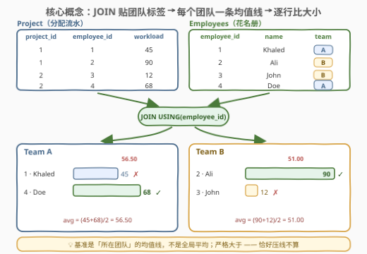
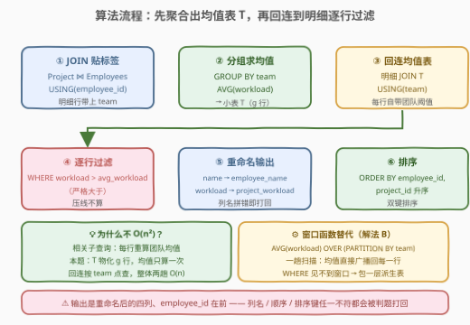
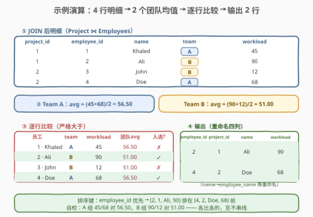
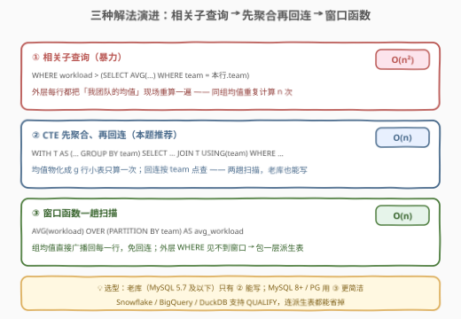

# 员工项目分配

- **题目名称**：员工项目分配
- **链接**：[3057. 员工项目分配](https://leetcode.cn/problems/employees-project-allocation/)
- **难度**：困难
- **标签**：数据库、SQL、JOIN、GROUP BY、AVG、CTE、窗口函数、LeetCode 锁题

## 1. 题目概述

> ⚠️ 本题为 LeetCode 付费题（锁题），题意描述根据官方示例用例与外部资料重建，可能与官方题面有出入。（题面已与社区镜像 doocs/leetcode 的官方中文翻译交叉核对，出入风险较低。）

**表结构**：

`Project` 表：

| 列名 | 类型 |
|------|------|
| project_id | int |
| employee_id | int |
| workload | int |

- `employee_id` 是这张表中值互不相同的列，且是 `Employees` 表的外键；
- 每行表示「`employee_id` 的员工正在 `project_id` 的项目上工作，工作量为 `workload`」。

`Employees` 表：

| 列名 | 类型 |
|------|------|
| employee_id | int |
| name | varchar |
| team | varchar |

- `employee_id` 是这张表的主键；每行包含一名员工的信息。

**任务**：编写一个解决方案，找出**分配到项目的工作量超过其所在团队所有员工平均工作量**的员工。

**输出格式**：`employee_id`、`project_id`、`employee_name`、`project_workload` 四列，按 `employee_id`、`project_id` **升序**排序。

**示例 1**：

```text
输入：
Project 表：
+-------------+-------------+----------+
| project_id  | employee_id | workload |
+-------------+-------------+----------+
| 1           | 1           |  45      |
| 1           | 2           |  90      |
| 2           | 3           |  12      |
| 2           | 4           |  68      |
+-------------+-------------+----------+
Employees 表：
+-------------+--------+------+
| employee_id | name   | team |
+-------------+--------+------+
| 1           | Khaled | A    |
| 2           | Ali    | B    |
| 3           | John   | B    |
| 4           | Doe    | A    |
+-------------+--------+------+

输出：
+-------------+------------+---------------+------------------+
| employee_id | project_id | employee_name | project_workload |
+-------------+------------+---------------+------------------+
| 2           | 1          | Ali           | 90               |
| 4           | 2          | Doe           | 68               |
+-------------+------------+---------------+------------------+

解释：
- 员工 1（Khaled，Team A）：工作量 45，Team A 平均工作量 56.50，未超过 → 排除。
- 员工 2（Ali，Team B）：工作量 90，Team B 平均工作量 51.00，超过 → 入选。
- 员工 3（John，Team B）：工作量 12，Team B 平均工作量 51.00，未超过 → 排除。
- 员工 4（Doe，Team A）：工作量 68，Team A 平均工作量 56.50，超过 → 入选。
```

> 💡 读题三个关键点：① 比较基准是「**所在团队**的平均工作量」——**组内求均值、逐行做比较**，不是全局平均，A 组和 B 组各有一条自己的「水位线」；② 「超过」是**严格大于**，恰好等于均值不算——最典型的边界是单人成组：avg 恒等于自己的 workload，必被排除；③ 输出要**重命名**（`name` → `employee_name`、`workload` → `project_workload`），且 `employee_id` 列在前、按 `employee_id, project_id` 双键升序——列名、列序、排序键任一不符都会被判题打回。

---

## 2. 解题思路

### 2.1 暴力思路：相关子查询逐行发问

最直觉的翻译是自然语言本身：「我这一行的 workload，大于**我所在团队**的平均值吗？」——对每一行，现场算一遍它所在团队的均值：

```sql
SELECT p.employee_id, p.project_id,
       e.name AS employee_name, p.workload AS project_workload
FROM Project p
JOIN Employees e ON p.employee_id = e.employee_id
WHERE p.workload > (
    SELECT AVG(p2.workload)
    FROM Project p2
    JOIN Employees e2 ON p2.employee_id = e2.employee_id
    WHERE e2.team = e.team                 -- 相关条件：逐行重算团队均值
)
ORDER BY p.employee_id, p.project_id;
```

语义完全正确（本机对示例与边界数据实测通过），但外层**每扫一行**，子查询就把两张表的连接重做一遍——同一个团队的均值被重复计算了 $n$ 遍，整体 $O(n^2)$。应用层暴力（把表拉进内存逐行查库）是同一问题的 N+1 查询翻版，更不可取。

暴力低效的根源：**「团队均值」是组级信息，却被当成行级信息反复求值**——它明明每个团队只需要算一次。

### 2.2 核心观察：组级统计量——先聚合一次，再「贴」回每一行



把问题拆成三问就一目了然：

1. **阈值在哪**：`workload` 在 `Project` 表、`team` 在 `Employees` 表——想按团队求平均，必须先 `JOIN` 给每条分配**贴上团队标签**；
2. **阈值是谁**：`GROUP BY team` + `AVG(workload)` 把明细折叠成一张 $g$ 行（$g$ = 团队数）的小表 `T(team, avg_workload)`——每个团队的均值**只算一次**；
3. **怎么比**：比较发生在**行级**——把 `T` 按 `team` **回连**到明细上，每行自带团队阈值，`WHERE workload > avg_workload` 一刀切。

> 💡 **「先聚合、再回连」**是「每行 vs 所在组统计量」类问题的通用骨架：组级信息先物化成小表（$g$ 行），再按键回连广播回明细行。窗口函数 `AVG() OVER (PARTITION BY team)` 是同一思想的语法糖——把「聚合 + 回连」合并成一趟扫描（见 5.1）。

> ⚠️ **均值的分母只含「有项目分配」的员工**：`T` 从内连接 `JOIN` 出发，团队里没参与任何项目的员工既不进分母、也不会出现在结果里。这是官方解法采用的口径，另外两种候选口径见 5.2 的对比。

### 2.3 算法流程图



| 步骤 | 操作 | 作用 |
|------|------|------|
| ① | `Project JOIN Employees USING(employee_id)` | 每条分配行贴上 `team` 标签 |
| ② | `GROUP BY team` + `AVG(workload)` → CTE `T` | 团队均值只算一次，$g$ 行小表 |
| ③ | 明细 `JOIN T USING(team)` | 每行带上自己团队的阈值 |
| ④ | `WHERE workload > avg_workload` | 严格大于，压线不算 |
| ⑤ | `name` / `workload` 重命名 | 输出列名与官方一致 |
| ⑥ | `ORDER BY employee_id, project_id` | 双键升序 |

### 2.4 示例演算



**第一步**（贴标签 + 分组求均值）：

| team | workload 明细 | avg_workload |
|------|---------------|--------------|
| A | 45（Khaled）、68（Doe） | $(45+68)/2 = 56.50$ |
| B | 90（Ali）、12（John） | $(90+12)/2 = 51.00$ |

**第二步**（回连后逐行比较，严格 `>`）：

| employee_id | name | team | workload | 团队 avg | workload > avg? | 入选 |
|---|---|---|---|---|:---:|:---:|
| 1 | Khaled | A | 45 | 56.50 | 否 | ✗ |
| 2 | Ali | B | 90 | 51.00 | 是 | ✓ |
| 3 | John | B | 12 | 51.00 | 否 | ✗ |
| 4 | Doe | A | 68 | 56.50 | 是 | ✓ |

**输出**（`ORDER BY employee_id, project_id`）：

```text
+-------------+------------+---------------+------------------+
| employee_id | project_id | employee_name | project_workload |
+-------------+------------+---------------+------------------+
| 2           | 1          | Ali           | 90               |
| 4           | 2          | Doe           | 68               |
+-------------+------------+---------------+------------------+
```

**自检**：A 组 2 人只入选 1 人（68 > 56.50），B 组只入选 1 人（90 > 51.00）；每行的比较基准都来自**自己所在**的组——A 组 45/68 对 56.50、B 组 90/12 对 51.00，互不串线。

---

## 3. 参考代码

### MySQL（解法 A：CTE 先聚合再回连，推荐）

```sql
# Write your MySQL query statement below
WITH T AS (
    SELECT team, AVG(workload) AS avg_workload
    FROM Project
    JOIN Employees USING (employee_id)   -- 贴上 team 标签才能按团队分组
    GROUP BY team
)
SELECT employee_id,
       project_id,
       name     AS employee_name,        -- 按要求重命名
       workload AS project_workload
FROM Project
JOIN Employees USING (employee_id)       -- 明细行
JOIN T USING (team)                      -- 回连团队阈值（g 行小表）
WHERE workload > avg_workload            -- 严格大于
ORDER BY employee_id, project_id;
```

> 💡 **写法要点**：
> - **`T` 必须从 `JOIN` 后的明细里算**：`team` 只在 `Employees` 表，绕开 JOIN 就无法按团队分组——这是本题最容易写错的第一步（常见错误：对 `Project` 单表 `GROUP BY team`，直接报「未知列」）；
> - **`USING` 合并同名列**：`JOIN ... USING (employee_id)` 后 `employee_id` 只剩一列，外层直接引用不歧义；`T` 只有 $g$ 行，回连按 `team` 等值匹配（哈希点查）；
> - **同一张连接要写两遍**（一次算均值、一次出明细）——这不是浪费，而是「聚合折叠了明细，明细还得自己再取一遍」的必然代价；窗口函数版可以把这两遍合成一遍。

### MySQL（解法 B：窗口函数一趟扫描）

```sql
# Write your MySQL query statement below
SELECT employee_id, project_id, employee_name, project_workload
FROM (
    SELECT p.project_id,
           p.employee_id,
           e.name     AS employee_name,
           p.workload AS project_workload,
           AVG(p.workload) OVER (PARTITION BY e.team) AS avg_workload
    FROM Project p
    JOIN Employees e ON p.employee_id = e.employee_id
) t
WHERE project_workload > avg_workload
ORDER BY employee_id, project_id;
```

> 💡 **写法要点**：
> - `AVG(...) OVER (PARTITION BY team)` = 「按 team 分组的均值」**广播回每一行**——聚合与回连合并成一趟扫描，免 CTE、免二次 JOIN；
> - **窗口函数不能直接写进 `WHERE`**：SQL 的逻辑执行顺序里 `WHERE` 先于 `SELECT`（窗口函数在此求值），`WHERE workload > AVG(...) OVER (...)` 会直接报错——必须包一层派生表（或 CTE）在外层过滤；
> - 需要 MySQL 8.0+（LeetCode 的 MySQL 8 判题环境可用）。

### Python（pandas）

```python
import pandas as pd


def employees_with_above_avg_workload(
    project: pd.DataFrame, employees: pd.DataFrame
) -> pd.DataFrame:
    m = project.merge(employees, on='employee_id')          # JOIN 贴 team 标签
    avg = m.groupby('team')['workload'].transform('mean')   # 组均值广播回每一行
    ans = m[m['workload'] > avg]                            # 严格大于
    return (
        ans[['employee_id', 'project_id', 'name', 'workload']]
        .rename(columns={'name': 'employee_name', 'workload': 'project_workload'})
        .sort_values(['employee_id', 'project_id'])
    )
```

> 💡 **pandas 对照**：`groupby('team').transform('mean')` 正是 `AVG() OVER (PARTITION BY team)` 的镜像——聚合结果按索引对齐**广播回每一行**，天然免去「先聚合再 merge 回来」两步；随后的布尔过滤、`rename`、`sort_values` 与 SQL 的 `WHERE`、`AS`、`ORDER BY` 一一对应。

---

## 4. 复杂度分析

设 $n$ 为 `Project` 的行数、$g$ 为团队数（$g \le n$）。

| 维度 | 复杂度 | 说明 |
|------|--------|------|
| **时间** | $O(n \log n)$ | 连接哈希查找 $O(n)$ + 分组聚合 $O(n)$ + 回连 $O(n)$；末尾 `ORDER BY` 排序 $O(n \log n)$。相关子查询版为 $O(n^2)$ |
| **空间** | $O(n + g)$ | 连接明细 $O(n)$；均值表 `T` 仅 $g$ 行；窗口版需物化带窗口列的中间结果 $O(n)$ |
| **输出行数** | $\le n$ | 每条分配行至多贡献一行（严格大于，压线行剔除） |

> ⚠️ 解法 A/B 都没有「逐行重算均值」的 $O(n^2)$ 路径；`Employees.employee_id` 是主键，连接侧天然可点查。LeetCode 判题数据量小，三版实际耗时都在毫秒级，复杂度差异主要在面试口头分析时体现。

---

## 5. 扩展：解法演进与两个语义边界

### 5.1 从 $O(n^2)$ 到 $O(n)$：相关子查询 → 先聚合再回连 → 窗口函数



三种写法语义完全等价（本机对示例与边界数据对拍一致），差别只在「团队均值被计算几次、结果怎么回到行上」：

- **相关子查询**：把「我和我组的均值比」逐行发问，写法最贴近自然语言，但每行触发一次全量重算，$O(n^2)$；
- **先聚合再回连**：把组级统计量物化成 $g$ 行小表再按键回连——**不依赖任何新语法**，MySQL 5.7 及更老的库也能写，兼容性最好；
- **窗口函数**：`AVG() OVER (PARTITION BY team)` 一步完成「分组聚合 + 广播回行」，是「每行 vs 组统计量」问题的现代标准答案；支持 `QUALIFY` 的方言连派生表包装都能省。

### 5.2 语义边界一：均值分母里算不算「没有项目的员工」？

题面说「各自团队**所有员工**的平均工作量」，但官方解法从**内连接**出发——只有出现在 `Project` 里的员工才进分母。三种口径对比：

```sql
-- 口径①（官方）：只有有分配的员工进分母
AVG(p.workload) FROM Project p JOIN Employees e USING (employee_id)

-- 口径②：全员进分母，但未分配者的 workload 是 NULL，而 AVG 忽略 NULL
--        —— 结果与口径①完全相同！
AVG(p.workload) FROM Employees e LEFT JOIN Project p ON p.employee_id = e.employee_id

-- 口径③：未分配者按 0 计入，真正拉低均值
AVG(COALESCE(p.workload, 0)) FROM Employees e LEFT JOIN Project p ...
```

> 💡 面试价值点：**`AVG` 忽略 `NULL`**——`LEFT JOIN` 未命中的行虽然进了分组，但 `NULL` 不参与平均，于是口径②与①殊途同归；想「按 0 计入」必须显式 `COALESCE`。另外口径②③下未分配员工的行 `workload` 为 `NULL`，而 `NULL > avg` 的结果是 `NULL`（不是 TRUE），照样被 `WHERE` 过滤——他们不会混进输出，只会（在口径③里）影响别人的阈值。

### 5.3 语义边界二：一个人能参加多个项目吗？

题面标注 `employee_id` 是 `Project` 中值互不相同的列（每人至多一个项目），此时「按分配行求平均」与「按员工求平均」等价。但 `ORDER BY employee_id, project_id` 里 `project_id` 这个排序键的存在，暗示出题人心里的表结构很可能是 `(project_id, employee_id)` 联合主键——**一人可多项目**。若真如此，官方解法的均值口径是「每条分配的平均」，而「每人平均工作量」（先按人汇总、再按团队平均）会是另一个数：

```sql
-- 一人多项目时的「按人」口径：先 SUM 到人，再 AVG 到团队
WITH per_emp AS (
    SELECT e.team, p.employee_id, SUM(p.workload) AS total_wl
    FROM Project p JOIN Employees e USING (employee_id)
    GROUP BY e.team, p.employee_id
), T AS (
    SELECT team, AVG(total_wl) AS avg_wl FROM per_emp GROUP BY team
)
SELECT pe.employee_id, pe.total_wl
FROM per_emp pe JOIN T USING (team)
WHERE pe.total_wl > avg_wl;
```

> ⚠️ 这类锁题的题面约束偶有转录不一致（[3055. 最高欺诈百分位数](https://leetcode.cn/problems/top-percentile-fraud/)（[题解](../3001-3100/3055_最高欺诈百分位数.md)）的 `fraud_score` 类型标注也有同类问题）。面试里的正确姿势是**先向面试官确认口径再落笔**：分母含不含未分配员工？均值按行还是按人？口径确认清楚，三种口径之间不过是三行代码的切换。

---

## 6. 面试要点

1. **为什么不能只用一次 `GROUP BY team` 直接出结果？**

   - `SELECT` 里同时要**行级列**（`project_id`、`name`、`workload`）和**组级聚合**（团队均值），单独 `GROUP BY team` 会把行折叠成每组一行，明细全部丢失；要么把组均值物化成小表再回连（解法 A），要么用窗口函数把组均值广播回行而不折叠（解法 B）。「行级与组级同框」正是窗口函数的教科书使用场景。

2. **窗口函数版为什么必须包一层派生表？**

   - SQL 逻辑执行顺序是 `FROM → WHERE → GROUP BY → HAVING → SELECT（含窗口）→ ORDER BY`，`WHERE` 执行时窗口函数尚未求值，`WHERE workload > AVG(...) OVER (...)` 直接报错。包装派生表让窗口列先算出来、外层再过滤；Snowflake / BigQuery / DuckDB 可用 `QUALIFY` 省掉这层包装。

3. **`AVG` 对 `NULL` 的处理在本题有什么实际影响？**

   - `AVG` 忽略 `NULL`：`LEFT JOIN` 后未分配员工的行进了分组但拉不动均值，均值口径与内连接相同；想按 0 计入必须 `COALESCE(workload, 0)`（见 5.2）。同时 `NULL > x` 结果是 `NULL`，`WHERE` 视为不成立——未分配员工天然不会出现在结果里。

4. **「严格大于」在边界数据上意味着什么？**

   - workload 恰好等于团队均值时不入选。最典型的边界是**单人成组**：组里只有一个人时 $\text{avg} = \text{workload}$，必然等于、必然排除——这个组永远不会有人入选；顺手写成 `>=` 会把这样的人全部错误地包含进来。

5. **数据量大了怎么优化？**

   - 连接侧：`Employees.employee_id` 是主键可点查，`Project(employee_id)` 建索引加速探测；
   - 聚合侧：哈希分组本就线性，`T` 只有 $g$ 行，回连代价可忽略；
   - 架构侧：明细远大于花名册时直接用窗口函数一趟扫描，或先按 `employee_id` 预聚合再连接，把中间结果压到一遍扫描；BI 场景可把 `T`（团队均值）物化为报表中间层。

> 💡 **一句话总结**：3057 的骨架是「**JOIN 贴团队标签 → 组级均值物化成 g 行小表（或窗口广播）→ 回连到行级严格大于过滤 → 重命名 + 双键排序**」。困难标签多半来自锁题初评，真正的考点是识别出「每行 vs 所在组统计量」这一模式，以及 `AVG` 忽略 `NULL`、窗口函数进不了 `WHERE` 这两个细节。

---

## 7. 同类练习题

- [1075. 项目员工 I](https://leetcode.cn/problems/project-employees-i/)（[题解](../1001-1100/1075_项目员工I.md)）：同款 `Project`/`Employees` 双表骨架的最简形态（JOIN + GROUP BY + AVG），免费题，适合先练手感
- [1126. 查询活跃业务](https://leetcode.cn/problems/active-businesses/)（[题解](../1101-1200/1126_查询活跃业务.md)）：与本题完全同构——每行业务事件数 vs 所在 event_type 的平均数，严格大于才算活跃
- [1077. 项目员工 III](https://leetcode.cn/problems/project-employees-iii/)（[题解](../1001-1100/1077_项目员工III.md)）：同款表结构的窗口函数进阶——`DENSE_RANK() OVER (PARTITION BY project_id)` 组内取最有经验员工
- [184. 部门工资最高的员工](https://leetcode.cn/problems/department-highest-salary/)（[题解](../0101-0200/184_部门工资最高的员工.md)）：「子查询组聚合 + 回连比较」的经典免费模板，本题解法 A 的入门形态
- [1251. 平均售价](https://leetcode.cn/problems/average-selling-price/)（[题解](../1201-1300/1251_平均售价.md)）：JOIN + 分组聚合 + 除法的组合拳，练「聚合结果的再利用」
