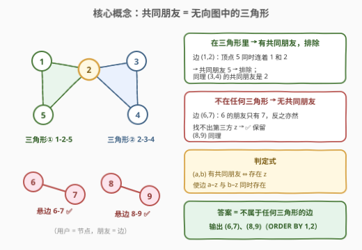
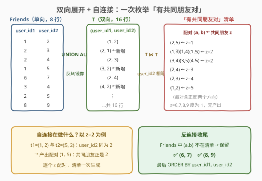
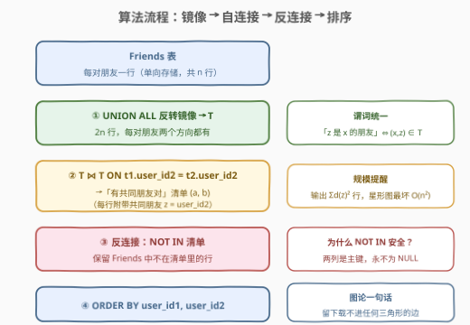
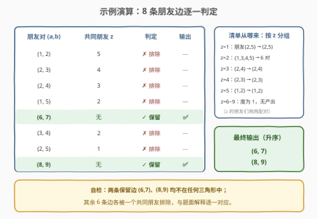

# LeetCode 没有共同朋友的朋友 题解

## 1. 题目概述

- **标题 / 题号**：没有共同朋友的朋友（#3058，medium）
- **链接**：https://leetcode.cn/problems/friends-with-no-mutual-friends/
- **难度**：中等
- **标签**：数据库、SQL、自连接、反连接、图

> ⚠️ 本题为 LeetCode 付费题，题意描述根据官方示例用例与外部资料（doocs/leetcode 题解仓库镜像的题面）重建，可能与官方题面有出入。

**表结构**：`Friends`

| 列名 | 类型 |
|------|------|
| user_id1 | int |
| user_id2 | int |

- `(user_id1, user_id2)` 是这张表的**主键**（有不同值的列组合）。
- 每一行包含 `user_id1`、`user_id2`，这两人**是朋友**（朋友关系是相互的，但每对只存一行）。

编写一个解决方案，找到彼此是朋友但**没有共同朋友**的**所有用户对**。

以 `user_id1, user_id2` **升序**返回结果表。

**示例 1**：

```text
输入：Friends 表
+----------+----------+
| user_id1 | user_id2 |
+----------+----------+
| 1        | 2        |
| 2        | 3        |
| 2        | 4        |
| 1        | 5        |
| 6        | 7        |
| 3        | 4        |
| 2        | 5        |
| 8        | 9        |
+----------+----------+

输出：
+----------+----------+
| user_id1 | user_id2 |
+----------+----------+
| 6        | 7        |
| 8        | 9        |
+----------+----------+

解释：
- 用户 1 和 2 是朋友，但他们有共同朋友 5，因此不包含在结果中。
- 用户 2 和 3 是朋友，他们有共同朋友 4；类似地用户 2 和 4 有共同朋友 3，都被排除。
- 用户 1 和 5 是朋友，但他们有共同朋友 2，因此排除。
- 用户 6 和 7、用户 8 和 9 是朋友，且没有共同朋友，因此包含在结果中。
- 用户 3 和 4 是朋友，他们有共同朋友 2；用户 2 和 5 有共同朋友 1，同样被排除。
输出表按 user_id1 升序排列。
```

> 💡 读题关键：①「共同朋友」指**第三方 z** 同时是两人的朋友，z 不能是这对朋友自己；② 表里每对朋友只存**一个方向**（如存了 `(1,2)` 就不会再存 `(2,1)`），但判「z 是 a 的朋友」时必须**两个方向都查**——这是本题最大的实现陷阱；③ 输出要 `ORDER BY user_id1, user_id2`。

## 2. 解题思路

### 2.1 暴力思路：逐对朋友、双重探测第三方

最直觉的做法：对 `Friends` 里的每一行 `(a, b)`，再去表里找一个 z，使得 z 是 a 的朋友**且** z 是 b 的朋友。麻烦立刻出现——由于每对朋友只存一个方向，「z 是 a 的朋友」这个谓词必须写成**双向 OR**：

```sql
-- 「z 是 a 的朋友」= 存在一行，正反两个方向至少命中一个
(f.user_id1 = a AND f.user_id2 = z) OR (f.user_id1 = z AND f.user_id2 = a)
```

于是完整暴力是三层嵌套：外层枚举朋友对 `(a, b)`，中层找 a 的朋友 z（双向 OR），内层验证 z 也是 b 的朋友（再来一个双向 OR）。SQL 写出来又长又慢——外层每行都要触发两次近似全表扫描，整体 $O(n^3)$ 级别。

暴力繁琐的根源不是「找共同朋友」本身，而是**「是朋友」这个判断在单向存储下是双向的**。把它先统一成单向，后面所有步骤都会变简单。

### 2.2 核心观察：双向展开 + 自连接生成「有共同朋友对」



**第一步：把无向关系补成双向**。朋友关系本质是**无向边**，表只存了一份。用 `UNION ALL` 做一次镜像，得到辅助表 `T`：

$$
T = \text{Friends} \cup \overrightarrow{\text{镜像}}(\text{Friends})
$$

`T` 里每对朋友 `(a, b)` 都有两个方向 `(a,b)`、`(b,a)`。从此「z 是 x 的朋友」简化为一条干净的谓词：`(x, z) ∈ T`。

**第二步：用自连接一次性枚举「有共同朋友的对」**。把 `T` 和 `T` 自己按 `user_id2` **等值连接**：

```sql
SELECT t1.user_id1 AS a, t2.user_id1 AS b
FROM T t1 JOIN T t2 ON t1.user_id2 = t2.user_id2
```

连接条件 `t1.user_id2 = t2.user_id2 = z` 的含义恰好是：**z 是 a 的朋友，同时 z 是 b 的朋友**——z 正是 a、b 的共同朋友！也就是说，这次自连接产出的全体 `(a, b)` 二元组，就是「**有共同朋友的对**」的完整清单（还附带赠送共同朋友 z 是谁）。

**第三步：反连接**。答案 = `Friends` 中**不在**这份清单里的行：

$$
\text{ans} = \{(a,b) \in \text{Friends} : (a,b) \notin \text{「有共同朋友对」}\}
$$

> 💡 图论视角：把用户当节点、朋友关系当边，「a、b 有共同朋友 z」⇔ 边 a–b 与边 a–z、边 b–z 围成一个**三角形**。所以本题等价于：**找出所有不属于任何三角形的边**。示例中 {1,2,5} 和 {2,3,4} 是两个三角形（每条边都被排除），而 6–7、8–9 是两条孤零零的悬边——正是答案。

> ⚠️ 为什么不会把「朋友本身」误当成共同朋友？比如对 `(1,2)`，会不会因为「2 是 1 的朋友、2 是 2 的朋友」而误判？不会——`T` 里不存在 `(2,2)` 这种自环行（表语义保证两人互异），`z = a` 或 `z = b` 的候选在连接时天然落空，无需额外排除条件。



### 2.3 算法流程图



1. **镜像展开**：`T = Friends UNION ALL 反转(Friends)`，2n 行，无向关系补全；
2. **自连接**：`T ⋈ T ON user_id2 相等`，产出全体「有共同朋友对 `(a, b)`」（附带共同朋友 z）；
3. **反连接**：`Friends` 中 `(user_id1, user_id2) NOT IN` 这份清单的行存活下来；
4. **排序输出**：`ORDER BY user_id1, user_id2`。

### 2.4 示例演算



**第一步**镜像：`T` 共 16 行（8 条边 × 2 个方向）。

**第二步**按共同朋友 z 分组做自连接（z 的朋友两两配对）：

| 共同朋友 z | z 的朋友们 | 生成的「有共同朋友对」 |
|:---:|:---|:---|
| 1 | {2, 5} | (2,5)、(5,2) |
| 2 | {1, 3, 4, 5} | (1,3)、(1,4)、(1,5)、(3,4)、(3,5)、(4,5) 及各自反向 |
| 3 | {2, 4} | (2,4)、(4,2) |
| 4 | {2, 3} | (2,3)、(3,2) |
| 5 | {1, 2} | (1,2)、(2,1) |
| 6 / 7 / 8 / 9 | 只有一个朋友 | 无法配对，不产出 |

**第三步**反连接，`Friends` 的 8 行逐一对照：

| 朋友对 | 共同朋友 | 判定 |
|:---:|:---:|:---:|
| (1, 2) | 5 | 排除 |
| (2, 3) | 4 | 排除 |
| (2, 4) | 3 | 排除 |
| (1, 5) | 2 | 排除 |
| (6, 7) | 无 | ✅ 保留 |
| (3, 4) | 2 | 排除 |
| (2, 5) | 1 | 排除 |
| (8, 9) | 无 | ✅ 保留 |

**输出**：`(6, 7)`、`(8, 9)`，按 `user_id1` 升序。与预期一致。

## 3. 参考代码

### MySQL（解法 A：`NOT IN` 反连接，推荐）

```sql
# Write your MySQL query statement below
WITH
    T AS (
        SELECT user_id1, user_id2 FROM Friends
        UNION ALL
        SELECT user_id2, user_id1 FROM Friends
    )
SELECT user_id1, user_id2
FROM Friends
WHERE (user_id1, user_id2) NOT IN (
    SELECT t1.user_id1, t2.user_id1
    FROM T AS t1
    JOIN T AS t2 ON t1.user_id2 = t2.user_id2
)
ORDER BY 1, 2;
```

### MySQL（解法 B：`NOT EXISTS` 相关子查询）

```sql
# Write your MySQL query statement below
WITH
    T AS (
        SELECT user_id1, user_id2 FROM Friends
        UNION ALL
        SELECT user_id2, user_id1 FROM Friends
    )
SELECT f.user_id1, f.user_id2
FROM Friends AS f
WHERE NOT EXISTS (
    SELECT 1
    FROM T AS t1
    JOIN T AS t2 ON t1.user_id2 = t2.user_id2
    WHERE t1.user_id1 = f.user_id1
      AND t2.user_id1 = f.user_id2
)
ORDER BY 1, 2;
```

> 💡 两版语义相同：解法 A 把「有共同朋友对」**一次性物化**成清单再整体排除，写法紧凑；解法 B 对每行朋友对**逐个探测**（问：存在共同朋友吗？），无需物化大清单。注意 `NOT EXISTS` 里的等值连接条件对方向天然成立——`T` 已是双向表，`t1.user_id1 = f.user_id1` 直接命中，不用再写 OR。

### Python（pandas）

```python
import pandas as pd


def friends_with_no_mutual_friends(friends: pd.DataFrame) -> pd.DataFrame:
    t = pd.concat(
        [
            friends[["user_id1", "user_id2"]],
            friends[["user_id2", "user_id1"]].rename(
                columns={"user_id2": "user_id1", "user_id1": "user_id2"}
            ),
        ]
    )
    merged = t.merge(t, on="user_id2", suffixes=("_a", "_b"))
    has_mutual = set(zip(merged["user_id1_a"], merged["user_id1_b"]))
    mask = friends.apply(
        lambda r: (r["user_id1"], r["user_id2"]) in has_mutual, axis=1
    )
    return friends[~mask].sort_values(["user_id1", "user_id2"])
```

> 💡 pandas 版与 SQL 解法 A 逐步同构：`concat` 镜像 = `UNION ALL`，`merge(on="user_id2")` = 按 z 自连接，`set(zip(...))` = 物化「有共同朋友对」清单，布尔掩码取反 = `NOT IN`。

## 4. 复杂度分析

设 $n$ 为 `Friends` 的行数，镜像后 $T$ 有 $2n$ 行，$d(z)$ 为用户 $z$ 在 $T$ 中的朋友数（度数）。

| 维度 | 复杂度 | 说明 |
|------|--------|------|
| **时间复杂度** | $O(n^2)$（最坏） | 自连接输出 $\sum_z d(z)^2$ 行——星形图（一人是所有人的朋友）时退化为 $O(n^2)$；稀疏普通图远小于此。`NOT IN` 判定与排序均为低阶项 |
| **空间复杂度** | $O(n^2)$（最坏） | 「有共同朋友对」清单最大与自连接输出同阶；普通图下 $O(n)$ 级 |

> ⚠️ LeetCode SQL 判题数据量小（几十行量级），实际耗时毫秒级；$O(n^2)$ 只在最坏图形态下出现，面试口头分析时点明「瓶颈在自连接输出规模 $\sum_z d(z)^2$」即可加分。

## 5. 扩展：从「判定」到「计数」——共同朋友个数与排名

把反连接改成 `LEFT JOIN + COUNT`，同一套骨架顺手升级成统计题：**报告每对朋友的共同朋友个数**（0 个即本题答案），甚至可以接窗口函数取「共同朋友最多的前 k 对」：

```sql
WITH
    T AS (
        SELECT user_id1, user_id2 FROM Friends
        UNION                                     -- 计数场景改用 UNION 去重
        SELECT user_id2, user_id1 FROM Friends
    ),
    Mutual AS (
        SELECT t1.user_id1 AS a, t2.user_id1 AS b, COUNT(*) AS cnt
        FROM T AS t1
        JOIN T AS t2 ON t1.user_id2 = t2.user_id2
        GROUP BY t1.user_id1, t2.user_id1         -- cnt = |N(a) ∩ N(b)|
    )
SELECT f.user_id1,
       f.user_id2,
       COALESCE(m.cnt, 0) AS mutual_cnt
FROM Friends AS f
LEFT JOIN Mutual AS m
    ON m.a = f.user_id1 AND m.b = f.user_id2      -- 无共同朋友 → NULL → 0
ORDER BY mutual_cnt DESC, 1, 2;
```

示例数据上运行可得：六条三角形边各 1 个共同朋友，`(6,7)`、`(8,9)` 为 0——`mutual_cnt = 0` 的行恰好就是本题输出。

两个细节：

1. **计数版要用 `UNION` 而非 `UNION ALL`**：若数据双向冗余存储（同时存在 `(1,2)` 和 `(2,1)`），`UNION ALL` 会让同一个 z 被数多次，`COUNT` 虚高；判定版不受影响（重复不改变 `NOT IN` 的成员关系）。
2. **双向冗余存储对判定版是天然鲁棒的**：`T` 里重复行只会让「有共同朋友对」清单里出现重复条目，`NOT IN` / `NOT EXISTS` 的布尔结果不变。这也是 2.2 先展开成双向表的第二个红利——**解法对「每对存一行」还是「两个方向都存」的数据约定都不敏感**。

再往上一层就是「朋友的朋友」（二度人脉）：在 `T` 上再叠一层连接或递归 CTE，就能做 k 度关系扩散，思路完全同构——本题的双向展开正是那类问题的地基。

## 6. 面试要点

1. **为什么第一步要做 `UNION ALL` 双向展开？不做行不行？**

   - 行，但每个「z 是 x 的朋友」谓词都得写正反两个方向的 OR，三层嵌套又长又易漏。展开后关系变成对称闭包，谓词统一成 `(x, z) ∈ T` 一条等值条件，自连接才能一步枚举所有共同朋友。代价只是 2 倍行数的中间表。

2. **`(user_id1, user_id2) NOT IN (子查询)` 在这里安全吗？什么时候会翻车？**

   - 安全。`NOT IN` 的 NULL 陷阱（对照 [3054](../3001-3100/3054_二叉树节点.md)）要求子查询输出列可能含 NULL 时必须过滤；本题两列共同构成主键，**永不为 NULL**，三值逻辑不会作祟。若是普通可空列，就应改写 `NOT EXISTS` 或在子查询里 `WHERE 列 IS NOT NULL`。

3. **自连接为什么不会把「朋友本人」或「自己与自己」误判成共同朋友？**

   - 共同朋友 z 需要同时满足 `(a, z) ∈ T` 和 `(b, z) ∈ T`。取 `z = b` 需要 `(b, b) ∈ T` 即「自己是自己的朋友」——表语义保证两人互异，自环行不存在，所以 z 自动落在 $\{a, b\}$ 之外，无需手写 `z <> a AND z <> b`。

4. **用图论的语言描述这题的答案？**

   - 用户是节点、朋友是边，「有共同朋友」⇔ 该边是某个**三角形**的一条边。答案即**不属于任何三角形的边**（示例中的悬边 6–7、8–9）。这个视角能直接迁移到大数据场景：三角形计数是图分析的基础算子（如 Spark GraphX 的 triangleCount）。

5. **数据量大时这套 SQL 的瓶颈在哪，怎么优化？**

   - 瓶颈是自连接输出规模 $\sum_z d(z)^2$——一个百万粉丝的「大 V」就会让输出爆炸。优化方向：给 `T(user_id2)` 建索引让等值连接走索引；只物化「度 ≥ 2」的用户参与配对（度 ≤ 1 的 z 不可能产出共同朋友）；或改写成解法 B 的 `NOT EXISTS` 让优化器半连接（semi-join）短路，避免物化整份清单。

> 💡 **一句话总结**：先把单向存储的朋友表 `UNION ALL` 镜像成双向表 `T`，再用 `T ⋈ T ON user_id2` 一次性枚举出「有共同朋友对」，最后反连接取 `Friends` 中不在清单里的行，`ORDER BY 1, 2` 收尾。图论一句话：**留下载不入任何三角形的边**。

## 同类练习题

| # | 题目 | 与本题的关联 |
|---|------|-------------|
| 1581 | [顾客可能会访问但不会进行任何交易](https://leetcode.cn/problems/customer-who-visited-but-did-not-make-any-transactions/) | `LEFT JOIN` / `NOT IN` 反连接「访问了却没交易」，练本题第三步的反连接骨架 |
| 1978 | [上级经理已离职的公司员工](https://leetcode.cn/problems/employees-whose-manager-left-the-company/) | 单列 `NOT IN` + NULL 过滤与 `NOT EXISTS` 的取舍，对照第 6 节第 2 问 |
| 570 | [至少有 5 名直接下属的经理](https://leetcode.cn/problems/managers-with-at-least-5-direct-reports/) | 自连接 + `GROUP BY + HAVING` 计数，练第 5 节「判定升级为计数」的写法 |
| 1971 | [寻找图中是否存在有效路径](https://leetcode.cn/problems/find-if-path-exists-in-graph/) | 同样是双向边表（edges 两列），练「无向图先补双向再搜索/并查集」的图基本功 |
| 3054 | [二叉树节点](https://leetcode.cn/problems/binary-tree-nodes/) | 本仓库上一篇拍平的树表题，`NOT IN` 的 NULL 三值逻辑陷阱详细复盘，与本题「为何这里 NOT IN 安全」互为对照 |
