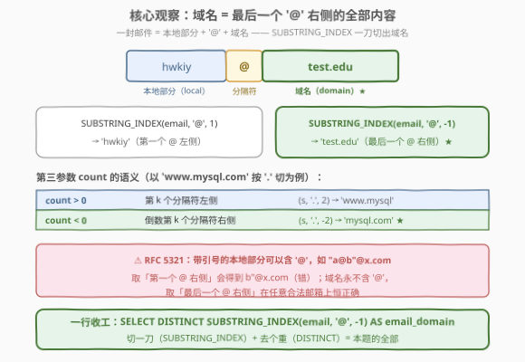
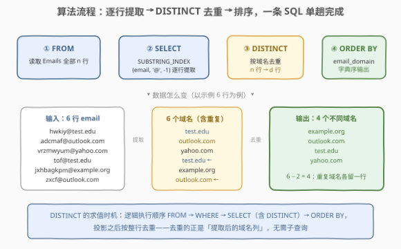
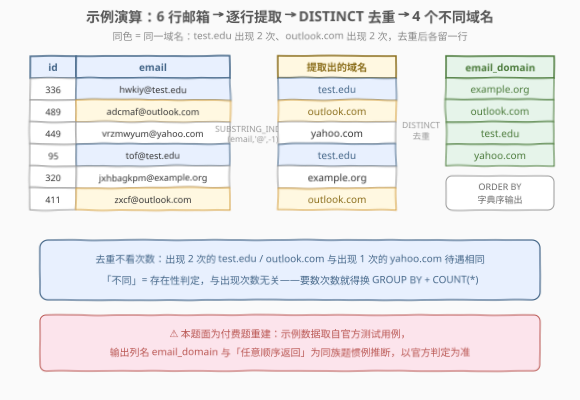

# LeetCode 找到所有不同的邮件域名 题解

## 1. 题目概述

- **标题 / 题号**：找到所有不同的邮件域名（#3059，easy）
- **链接**：https://leetcode.cn/problems/find-all-unique-email-domains/
- **难度**：简单
- **标签**：数据库、SQL、字符串处理、`SUBSTRING_INDEX`、`DISTINCT`/`GROUP BY`、LeetCode 锁题

> ⚠️ 本题为 LeetCode 付费题（锁题），题意描述根据官方示例用例与 hints 重建，可能与官方题面有出入。输出列名 `email_domain` 与「任意顺序返回」为按同族题惯例的推断，以官方判定为准。

**表结构**：`Emails`

| 列名 | 类型 |
|------|------|
| id | int |
| email | varchar |

- `id` 是这张表的主键。
- 每行包含一个电子邮件地址，形如 `用户名@域名`（如 `hwkiy@test.edu`）。
- 邮箱格式保证合法（至少含一个 `@`，域名非空）。

**背景**：邮件地址由**本地部分**（local part）与**域名**（domain）组成，二者以 `@` 分隔——`hwkiy@test.edu` 中 `hwkiy` 是用户名，`test.edu` 是域名。现在要对表里的邮箱做一次**域名盘点**。

**目标**：写一条 SQL 查询，找出 `Emails` 表中出现的**所有不同的邮件域名**——每个域名只输出一次，无论它出现在多少行邮箱里。

**输出**：单列 `email_domain`，按任意顺序返回（本篇代码按字典序输出，确定性更强）。

**示例 1**：

```text
输入：
Emails 表：
+-----+-----------------------+
| id  | email                 |
+-----+-----------------------+
| 336 | hwkiy@test.edu        |
| 489 | adcmaf@outlook.com    |
| 449 | vrzmwyum@yahoo.com    |
| 95  | tof@test.edu          |
| 320 | jxhbagkpm@example.org |
| 411 | zxcf@outlook.com      |
+-----+-----------------------+

输出：
+--------------+
| email_domain |
+--------------+
| example.org  |
| outlook.com  |
| test.edu     |
| yahoo.com    |
+--------------+

解释：
6 个邮箱提取出 6 个域名，其中 test.edu 出现 2 次（hwkiy@、tof@）、
outlook.com 出现 2 次（adcmaf@、zxcf@），去重后共 4 个不同域名。
```

**约束**：

- `id` 具有唯一值——一个邮箱一行。
- `email` 均为合法邮箱地址（含 `@`）。
- 判题数据量小（示例 6 行），不同域名数远小于行数。

> 💡 **审题关键**：① 任务拆成两半——**切**（从 `email` 里把域名切出来）+ **去重**（每个域名留一行）；② 「不同的」= `DISTINCT`/`GROUP BY`，与出现次数无关；③ 域名的严格定义是「**最后一个** `@` 之后的全部内容」——本地部分理论上可以含 `@`，域名永不含，这一点是 2.2 的核心。

## 2. 解题思路

### 2.1 暴力思路：把去重搬到应用层 / 用 NOT EXISTS 手写 DISTINCT

最直觉的「工程暴力」是把整表拉到应用层：

```sql
SELECT id, email FROM Emails;
```

然后在程序里对每个 `email` 做 `split('@')[-1]`，塞进 `HashSet`。逻辑当然对，但 $n$ 行数据全部过网络，集合去重这门 SQL 的看家本领被搬到应用层重做——纯报表查询的经典反模式。

SQL 层的「暴力」是手写去重——不用 `DISTINCT`，对每一行检查「有没有更早的行已经产出过相同域名」：

```sql
SELECT SUBSTRING_INDEX(e1.email, '@', -1) AS email_domain
FROM Emails e1
WHERE NOT EXISTS (
    SELECT 1 FROM Emails e2
    WHERE e2.id < e1.id
      AND SUBSTRING_INDEX(e2.email, '@', -1) = SUBSTRING_INDEX(e1.email, '@', -1)
)
ORDER BY email_domain;
```

语义正确（每个域名组里「id 最小的代表行」幸存），但外层每行都要让内层再全表扫一遍，整体 $O(n^2)$。两版暴力低效的根源相同：**集合级的「去重」被拆成了行级的重复劳动**——而这正是 `DISTINCT`（内部一次哈希/排序）一步完成的事。

### 2.2 核心观察：域名 = 最后一个 '@' 右侧的全部内容



一封邮件 = **本地部分 + `@` + 域名**。提取域名就是「按 `@` 切一刀，取右边」。MySQL 里这件事一个函数调用完成：

```sql
SUBSTRING_INDEX(email, '@', -1)
```

`SUBSTRING_INDEX(str, delim, count)` 的第三参数是灵魂：

| count | 语义 | 例（`'www.mysql.com'` 按 `'.'` 切） |
|-------|------|-------------------------------------|
| $k \gt 0$ | 第 $k$ 个分隔符**左侧**的全部内容 | `SUBSTRING_INDEX(s,'.',2)` → `www.mysql` |
| $k \lt 0$ | 倒数第 $\lvert k \rvert$ 个分隔符**右侧**的全部内容 | `SUBSTRING_INDEX(s,'.',-2)` → `mysql.com` |

于是 `SUBSTRING_INDEX(email, '@', -1)` = **最后一个** `@` 右侧的全部内容 = 域名。

> 💡 **为什么坚持「最后一个 `@`」而不是「第一个 `@` 右侧」**：RFC 5321 允许**带引号的本地部分**包含 `@`（如 `"john@home"@example.com`），而域名永不含 `@`。取「第一个 `@` 右侧」遇到这种数据会切错（得到 `home"@example.com`）；取「最后一个 `@` 右侧」在任意合法邮箱上恒正确。LeetCode 判题数据规整，两种写法都能过，但「按最脆弱的假设写、按最鲁棒的定义答」是 SQL 字符串题的通用心法。

再叠上去重，正解只有一行：

> **`SELECT DISTINCT SUBSTRING_INDEX(email, '@', -1) FROM Emails`** —— 切一刀（`SUBSTRING_INDEX`）+ 去个重（`DISTINCT`），本题的全部。

### 2.3 算法流程图



| 步骤 | 子句 | 作用 |
|------|------|------|
| ① | `FROM Emails` | 读取全部 $n$ 行 |
| ② | `SELECT SUBSTRING_INDEX(email,'@',-1)` | 逐行计算域名（行级标量表达式） |
| ③ | `DISTINCT` | 按输出列去重，$n$ 行 → $d$ 行（$d$ = 不同域名数） |
| ④ | `ORDER BY email_domain` | 字典序输出（题面允许任意顺序时可省） |

> 💡 SQL 逻辑执行顺序为 `FROM → WHERE → GROUP BY → SELECT（含 DISTINCT）→ ORDER BY`：标量函数在 `SELECT` 阶段**逐行**求值，`DISTINCT` 在投影之后按整行去重——所以 `DISTINCT` 看到的正是表达式结果列，天然对「提取后的域名」去重，无需子查询。

### 2.4 示例演算



**逐行提取**：

| id | email | SUBSTRING_INDEX(email,'@',-1) |
|----|-------|-------------------------------|
| 336 | hwkiy@test.edu | test.edu |
| 489 | adcmaf@outlook.com | outlook.com |
| 449 | vrzmwyum@yahoo.com | yahoo.com |
| 95 | tof@test.edu | test.edu ← 重复 |
| 320 | jxhbagkpm@example.org | example.org |
| 411 | zxcf@outlook.com | outlook.com ← 重复 |

**DISTINCT 去重**：6 行 → 4 行（`test.edu` 与 `outlook.com` 各出现 2 次、各留 1 行），字典序输出 `example.org / outlook.com / test.edu / yahoo.com`。

> ⚠️ **去重不看次数**：「不同的域名」只要**存在性**——出现 2 次的 `test.edu` 与出现 1 次的 `yahoo.com` 待遇完全相同。若业务要「每个域名多少人用」，那是 `GROUP BY` + `COUNT(*)` 的计数变体，见第 5 节。

## 3. 参考代码

### SQL（解法 A：`SUBSTRING_INDEX` + `DISTINCT`，推荐）

```sql
# Write your MySQL query statement below
SELECT DISTINCT SUBSTRING_INDEX(email, '@', -1) AS email_domain
FROM Emails
ORDER BY email_domain;
```

> 💡 **写法要点**：
> - `'@'` 是**字符串**分隔符，必须带引号——漏写会被当成列名报错；
> - `-1` 不可写成 `1`（那样取到的是本地部分 `hwkiy`）；
> - `ORDER BY email_domain` 引用别名排序，仅为输出确定；判题「任意顺序」时可省。

### SQL（解法 B：`GROUP BY` 表达式，通往计数变体）

```sql
# Write your MySQL query statement below
SELECT SUBSTRING_INDEX(email, '@', -1) AS email_domain
FROM Emails
GROUP BY SUBSTRING_INDEX(email, '@', -1)
ORDER BY email_domain;
```

> 💡 无聚合列时 `GROUP BY expr` 与 `DISTINCT expr` 语义等价（执行计划通常也相同）。选 `GROUP BY` 的理由是**可扩展**：第 5 节的计数变体只须在 `SELECT` 里加一个 `COUNT(*)`，而 `DISTINCT` 版要推倒重来。注意 MySQL 允许直接按表达式分组；标准 SQL 更稳的写法是先在 CTE 里物化域名列，再 `GROUP BY email_domain`。

### SQL（解法 C：`LOCATE` + `SUBSTRING`，可移植的「第一个 @」版）

```sql
# Write your MySQL query statement below
SELECT DISTINCT SUBSTRING(email, LOCATE('@', email) + 1) AS email_domain
FROM Emails
ORDER BY email_domain;
```

> 💡 `LOCATE('@', email)` 返回首个 `@` 的 1-based 下标，`+ 1` 跳过分隔符，`SUBSTRING` 从该处取到串尾。这三个函数在 MySQL / PostgreSQL（近亲 `POSITION`/`STRPOS`）/ SQLite（`instr`）里都有对应，是最「四海为家」的写法。代价：只认**第一个** `@`，对带引号本地部分的怪邮箱不鲁棒（见 2.2）。

### Pandas

```python
import pandas as pd


def find_all_unique_email_domains(emails: pd.DataFrame) -> pd.DataFrame:
    domains = emails["email"].str.split("@").str[-1]
    return (
        domains.drop_duplicates()
        .sort_values()
        .reset_index(drop=True)
        .to_frame(name="email_domain")
    )
```

> 💡 **pandas 对照**：`str.split("@")` 得到列表列，`.str[-1]` 取每个列表的**最后一个**元素——与 `SUBSTRING_INDEX(..., -1)` 的「最后一个 `@` 右侧」语义严格对应（写 `.str[1]` 才是「第一个 `@` 右侧」）；`drop_duplicates()` 对应 `DISTINCT`；`sort_values()` 对应 `ORDER BY`。一行链式完成 SQL 的三步。

## 4. 复杂度分析

| 维度 | 复杂度 | 说明 |
|------|--------|------|
| **时间复杂度** | $O(n \cdot L)$ | 单趟扫描 $n$ 行，每行对长度 $L$ 的字符串定位分隔符；`DISTINCT` 的哈希/排序去重在 $L$ 远小于 $n$ 时近似 $O(n)$ |
| **空间复杂度** | $O(d \cdot L)$ | $d$ 为不同域名数；去重结构与输出同阶 |

> - $n$ 为 `Emails` 行数，$L$ 为邮箱平均长度，$d \le n$ 为不同域名数。
> - **索引优化**：本查询是全表聚合，普通 B+ 树索引帮不上「提取后去重」；除非用生成列/函数索引把 `SUBSTRING_INDEX(email,'@',-1)` 物化成带索引的列（MySQL 8.0.13+ 支持函数索引），去重才能走索引序。
> - LeetCode 判题数据小（个位数行），各解法毫秒级；差异只在方言可移植性与扩展性上。

## 5. 扩展

### 5.1 各数据库的「取最后一个分隔符右侧」

| 数据库 | 写法 | 语义 |
|--------|------|------|
| MySQL | `SUBSTRING_INDEX(email,'@',-1)` | 最后一个 `@` 右侧 |
| PostgreSQL | `regexp_replace(email, '^.*@', '')` | 贪婪 `.*` 吃到**最后一个** `@` |
| SQL Server | `RIGHT(email, CHARINDEX('@', REVERSE(email)) - 1)` | 反转后找 `@` 即原串最后一个 |
| SQLite | `substr(email, instr(email,'@') + 1)` | 第一个 `@` 右侧（需数据规整） |

> ⚠️ **PostgreSQL 的 `SPLIT_PART(email,'@',2)` 是陷阱**：`split_part` 按**全部** `@` 切分后取第 2 段，本地部分含 `@` 时拿到的是中间段而非域名——它等价于「第一个 `@` 右侧」，不等价于 MySQL 的 `-1` 语义。跨库移植时先确认「切的是第几个分隔符」。

### 5.2 计数变体：每个域名有多少用户

把「是否存在」升级为「出现几次」，`GROUP BY` 一步到位：

```sql
SELECT SUBSTRING_INDEX(email, '@', -1) AS email_domain,
       COUNT(*) AS user_count
FROM Emails
GROUP BY SUBSTRING_INDEX(email, '@', -1)
ORDER BY user_count DESC, email_domain;
```

这就是 182「查找重复的电子邮箱」的域名版骨架——末尾追加 `HAVING COUNT(*) > 1`，还能找出「被多人共用的域名」。

### 5.3 健壮性清单：脏数据三连

| 脏数据 | 症状 | 防御 |
|--------|------|------|
| 不含 `@` | `SUBSTRING_INDEX` 原样返回整串，混进结果 | `WHERE email LIKE '%@%'` 预过滤 |
| 大小写不一（`Test.EDU` vs `test.edu`） | 被当成两个域名 | 提取后包 `LOWER(...)` 规范化（`_ci` collation 下分组本身不区分大小写，`_bin` 才区分） |
| 首尾空格 | `'a@test.edu '` 与 `a@test.edu` 不相等 | `TRIM(email)` 后再提取 |

> 💡 判题环境数据规整，以上均可省；**生产报表**里这三行防御是代码评审的常客——再次呼应「按最脆弱的假设写、按最鲁棒的定义答」。

## 6. 面试要点

1. **`SUBSTRING_INDEX` 第三参数正负各是什么语义？**

   > 正数 $k$：返回第 $k$ 个分隔符**左侧**的全部内容；负数 $-k$：返回倒数第 $k$ 个分隔符**右侧**的全部内容。例：`SUBSTRING_INDEX('www.mysql.com','.',-2)` = `mysql.com`。分隔符是字符串字面量；分隔符不存在时返回原串——这正是脏数据「不含 `@`」会原样漏进结果的原因。

2. **为什么强调「最后一个 `@`」而不是「第一个」？**

   > RFC 5321 允许带引号的本地部分包含 `@`（`"john@home"@example.com`），而域名永不含 `@`。取最后一个 `@` 右侧在任意合法邮箱上恒正确；取第一个 `@` 右侧在怪数据上会切错。LeetCode 数据规整两者皆可过，但答出这层鲁棒性分析是加分项。

3. **`DISTINCT` 与 `GROUP BY` 在纯去重场景的区别？**

   > 无聚合时语义等价、执行计划通常相同。差别在能力边界：`DISTINCT` 只能对整行输出列去重；`GROUP BY` 可附带聚合（`COUNT(*)`）、可用 `HAVING` 过滤组（如「共用人数 > 1 的域名」）。预见到计数需求时直接写 `GROUP BY`，演进成本最低。

4. **`DISTINCT` 在什么时机、按什么去重？**

   > 逻辑执行顺序 `FROM → WHERE → GROUP BY → SELECT（含 DISTINCT）→ ORDER BY`。`DISTINCT` 在投影**之后**对输出列整体去重——所以它去的是「表达式求值后的域名列」；`SELECT DISTINCT` 列了几个列就按几列**组合**去重，不是只按第一个列。

5. **若要求不区分大小写地统计域名，SQL 怎么写？**

   > 提取后包一层规范化：`SELECT DISTINCT LOWER(SUBSTRING_INDEX(email,'@',-1))`。另一个易踩的坑是 collation：`_ci`（大小写不敏感）排序规则下 `GROUP BY`/`=`/`DISTINCT` 本身就不区分大小写，`Test.EDU` 与 `test.edu` 会悄悄合并；`_bin` 下才是两个域名——「去重结果随 collation 变化」是跨环境迁库的经典事故来源。

> 💡 **一句话总结**：3059 是 SQL 字符串题的「一刀 + 一次去重」入门——`SUBSTRING_INDEX(email,'@',-1)` 切出「最后一个 `@`」右侧的域名（比「第一个 `@`」更鲁棒），`DISTINCT`/`GROUP BY` 一步去重。考点全在细节：第三参数正负语义、`DISTINCT` 的求值时机、跨库取「最后分隔符」的方言差异，以及计数变体与脏数据防御的延伸。

## 同类练习题

| # | 题目 | 与本题的关联 |
|---|------|-------------|
| 1517 | [查找拥有有效邮箱的用户](https://leetcode.cn/problems/find-users-with-valid-e-mails/)（[题解](../1501-1600/1517_查找拥有有效邮箱的用户.md)） | `REGEXP`/`LIKE` 判定邮箱格式合法性——同族「邮箱字符串」题，一个做**判定**（匹配），本题做**提取**（切分） |
| 1527 | [患某种疾病的患者](https://leetcode.cn/problems/patients-with-a-condition/)（[题解](../1501-1600/1527_患某种疾病的患者.md)） | `SUBSTRING`/`LOCATE`/`LIKE` 提取子串并过滤——`LOCATE` 定位分隔符的进阶应用 |
| 1667 | [修复表中的名字](https://leetcode.cn/problems/fix-name-in-a-table/)（[题解](../1601-1700/1667_修复表中的名字.md)） | `UPPER`/`LOWER`/`CONCAT` 字符串**变换**家族——与「提取」「判定」凑齐 SQL 字符串三板斧（切/判/变） |
| 196 | [删除重复的电子邮箱](https://leetcode.cn/problems/delete-duplicate-emails/)（[题解](../0101-0200/196_删除重复的电子邮箱.md)） | 去重家族的 `DELETE` 版——体会「查 distinct 集合」与「删多余行」的思维跨度 |
| 182 | [查找重复的电子邮箱](https://leetcode.cn/problems/duplicate-emails/)（[题解](../0101-0200/182_查找重复的电子邮箱.md)） | `GROUP BY + HAVING COUNT(*) > 1` 找重复——把本题的「计数变体」再推一步 |
