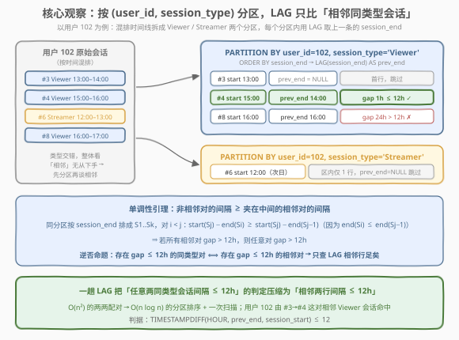
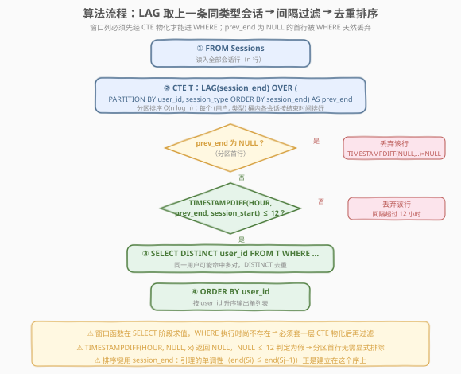
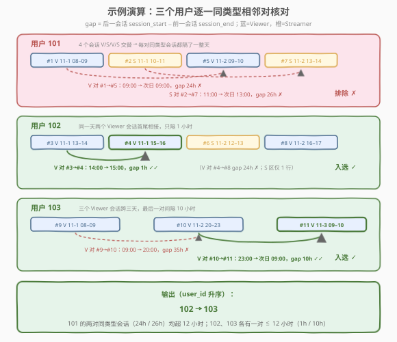

# 时间范围内的用户活动

- **题目名称**：时间范围内的用户活动
- **链接**：[3060. 时间范围内的用户活动](https://leetcode.cn/problems/user-activities-within-time-bounds/)
- **难度**：困难
- **标签**：数据库、SQL、窗口函数、`LAG()`、`TIMESTAMPDIFF()`、自连接、LeetCode 锁题

## 1. 题目概述

> ⚠️ 本题为 LeetCode 付费题（锁题），题意描述根据官方示例用例与外部资料重建，可能与官方题面有出入。（题面已与社区镜像 doocs/leetcode 的官方中文翻译交叉核对，出入风险较低。）

**表结构**：`Sessions`

| 列名 | 类型 |
|------|------|
| user_id | int |
| session_start | datetime |
| session_end | datetime |
| session_id | int |
| session_type | enum |

- `session_id` 是这张表中具有不同值的列。
- `session_type` 是 `('Viewer', 'Streamer')` 的一个 ENUM 类型。
- 每行记录一次用户会话：用户 id、开始时间、结束时间、会话 id 与会话类型（观看 / 直播）。

**目标**：编写一个解决方案，找出**至少有两个同类型会话**（无论是 **Viewer** 还是 **Streamer**）、且这两个会话**之间的间隔不超过 12 小时**的用户。**间隔** = 后一个会话的 `session_start` − 前一个会话的 `session_end`。返回单列 `user_id`，按**升序**排序。

**示例 1**：

```text
输入：
Sessions 表：
+---------+---------------------+---------------------+------------+--------------+
| user_id | session_start       | session_end         | session_id | session_type |
+---------+---------------------+---------------------+------------+--------------+
| 101     | 2023-11-01 08:00:00 | 2023-11-01 09:00:00 | 1          | Viewer       |
| 101     | 2023-11-01 10:00:00 | 2023-11-01 11:00:00 | 2          | Streamer     |
| 102     | 2023-11-01 13:00:00 | 2023-11-01 14:00:00 | 3          | Viewer       |
| 102     | 2023-11-01 15:00:00 | 2023-11-01 16:00:00 | 4          | Viewer       |
| 101     | 2023-11-02 09:00:00 | 2023-11-02 10:00:00 | 5          | Viewer       |
| 102     | 2023-11-02 12:00:00 | 2023-11-02 13:00:00 | 6          | Streamer     |
| 101     | 2023-11-02 13:00:00 | 2023-11-02 14:00:00 | 7          | Streamer     |
| 102     | 2023-11-02 16:00:00 | 2023-11-02 17:00:00 | 8          | Viewer       |
| 103     | 2023-11-01 08:00:00 | 2023-11-01 09:00:00 | 9          | Viewer       |
| 103     | 2023-11-02 20:00:00 | 2023-11-02 23:00:00 | 10         | Viewer       |
| 103     | 2023-11-03 09:00:00 | 2023-11-03 10:00:00 | 11         | Viewer       |
+---------+---------------------+---------------------+------------+--------------+

输出：
+---------+
| user_id |
+---------+
| 102     |
| 103     |
+---------+

解释：
- 用户 101 不包含在最终输出中：他们的 4 个会话 V/S/V/S 交替，没有间隔 ≤ 12 小时的同类型会话对
  （Viewer 对 #1→#5 间隔 24 小时，Streamer 对 #2→#7 间隔 26 小时，均超限）。
- 用户 102 包含在最终输出中：session_id 为 3 和 4 的两个 Viewer 会话间隔 1 小时，在 12 小时内。
- 用户 103 包含在最终输出中：session_id 为 10 和 11 的两个 Viewer 会话间隔 10 小时，
  在 12 小时内（尽管 #9→#10 间隔 35 小时超限，但只要有一对满足即可）。
输出表按 user_id 升序排列。
```

**约束条件**（依据示例与官方题面重建）：

- `session_id` 在表中取值互不相同；
- `session_type` 只能取 `'Viewer'` 或 `'Streamer'`；
- 每个会话 `session_start < session_end`，判题数据中同一用户的会话在时间上不重叠；
- 输出为单列 `user_id`，升序排列。

> 💡 **审题关键**：① 「同类型」是硬条件——Viewer 只和 Viewer 比，Streamer 只和 Streamer 比，不同类型之间的间隔再小也不算数（用户 205 场景：Viewer 与 Streamer 只隔 1 小时，仍不入选）；② 英文原文是 *"at least two sessions of the same type with a maximum gap of 12 hours between sessions"*——是**任意两个**同类型会话，并不要求时间上紧挨着；官方中文翻译的「连续会话」容易让人误以为必须相邻，实际上只要同类型会话中**存在一对**间隔 ≤ 12 小时即可（且它等价于存在一对「按结束时间排序后相邻」的同类型会话间隔 ≤ 12 小时，见 2.2）；③ 间隔按「前一会的**结束** → 后一会的**开始**」计算，跨天是常态；④ 「至少有两会」与「间隔 ≤ 12h」是**存在性**判定，一个用户可能有多对满足，输出要去重。

---

## 2. 解题思路

### 2.1 暴力思路：自连接枚举所有同类型会话对

题意的直译是「存在两个同类型会话，间隔 ≤ 12 小时」。最直觉的写法是把同一用户、同一类型的会话两两配对，逐对检查间隔：

```sql
SELECT DISTINCT a.user_id
FROM Sessions a
JOIN Sessions b
  ON a.user_id = b.user_id
 AND a.session_type = b.session_type
 AND a.session_end <= b.session_start          -- a 在前 b 在后
 AND TIMESTAMPDIFF(HOUR, a.session_end, b.session_start) <= 12
ORDER BY a.user_id;
```

逻辑完全正确——这就是对「存在满足条件的对」的暴力枚举。但同一分区（同用户同类型）的 $k$ 个会话要产生 $O(k^2)$ 个候选对：一个重度用户一年上千个 Viewer 会话，同一用户的自连接会膨胀出上百万行中间结果，再全部做时间差比较。**两两配对是多余的**——判定「存在一对间隔 ≤ 12h」根本不需要看所有对，这正是窗口函数 `LAG`（只看**相邻行**）要解决的问题。

### 2.2 核心观察：分区 + LAG，「任意对」退化为「相邻对」



把每个 `(user_id, session_type)` 分区内的会话按 `session_end` 升序排成 $S_1, S_2, \dots, S_k$。对任意 $i < j$ 定义间隔 $\text{gap}(S_i, S_j) = \text{start}(S_j) - \text{end}(S_i)$，则：

$$\text{gap}(S_i, S_j) = \text{start}(S_j) - \text{end}(S_i) \;\ge\; \text{start}(S_j) - \text{end}(S_{j-1}) = \text{gap}(S_{j-1}, S_j)$$

不等号成立只因 $\text{end}(S_i) \le \text{end}(S_{j-1})$——**非相邻对的间隔，至少不小于夹在终点前的那对相邻间隔**。于是：

> **存在间隔 ≤ 12h 的同类型对 ⟺ 存在间隔 ≤ 12h 的「按结束时间相邻」对**

「⟸」方向平凡（相邻对也是对）；「⟹」方向就是上面的单调性：若所有相邻对都超 12h，任何跨着别的会话的对只会更宽。这样 $O(k^2)$ 的存在性判定就压缩成了 $O(k)$ 的逐行比较——`LAG(session_end)` 恰好把每个分区里「按 `session_end` 排序的前一行结束时间」送到当前行手边，一趟窗口扫描完成全部判定。

以用户 102 为例：Viewer 分区三行 `#3(13–14)`、`#4(15–16)`、`#8(次日 16–17)`，LAG 依次给出 `NULL / 14:00 / 16:00`；`#4` 行的间隔 `15:00 − 14:00 = 1h ≤ 12h` 命中，102 入选——`#3→#8` 这对 24h 的非相邻对根本不用看。

> ⚠️ **为什么分区键是 `(user_id, session_type)` 而不是 `user_id`**：类型是配对的前提。若只按 `user_id` 分区，用户 101 的相邻会话是 V→S→V→S，相邻对全部「类型不同」，`LAG` 取到的是**异类型**会话的结束时间，间隔再小也不能算——这正是本题「困难」的陷阱所在：**排序观（整体时间线）与配对观（同类型子序列）必须分离**。

### 2.3 算法流程图



**逻辑执行步骤**：

| 步骤 | 子句 | 作用 |
|------|------|------|
| ① | `FROM Sessions` | 读入全部 $n$ 行会话 |
| ② | `LAG(session_end) OVER (PARTITION BY user_id, session_type ORDER BY session_end)` | 每个「用户 × 类型」分区内按结束时间排序，取上一行的 `session_end` 记为 `prev_session_end` |
| ③ | `WHERE TIMESTAMPDIFF(HOUR, prev_session_end, session_start) <= 12` | 间隔 ≤ 12 小时的行幸存；分区首行 `prev_session_end` 为 `NULL`，`TIMESTAMPDIFF(NULL, ..)` 返回 `NULL`，`NULL <= 12` 判定为假，**首行被天然过滤，无需显式排除** |
| ④ | `SELECT DISTINCT user_id` | 同一用户可能有多对满足（如多天反复观看），按用户去重 |
| ⑤ | `ORDER BY user_id` | 按题目要求升序输出 |

> 💡 **窗口函数不能直接进 `WHERE`**：SQL 逻辑执行顺序为 `FROM → WHERE → GROUP BY → HAVING → SELECT`（窗口函数在 `SELECT` 阶段求值）`→ ORDER BY`。窗口列 `prev_session_end` 在 `WHERE` 执行时尚不存在，必须先经 CTE 物化一层，外层再过滤——本题代码必须「套两层」的原因与 [3055](../3001-3100/3055_最高欺诈百分位数.md) 相同。

### 2.4 示例演算

对示例 1 的 11 行数据，按 `(user_id, session_type)` 分区后逐相邻对核对（gap = 当前行 `session_start` − LAG 给出的 `prev_session_end`）：



| 用户 | 分区 | 相邻对 | prev_end → start | gap | 判定 |
|------|------|--------|------------------|-----|------|
| 101 | Viewer：#1, #5 | #1 → #5 | 11-1 09:00 → 11-2 09:00 | 24h | ✗ |
| 101 | Streamer：#2, #7 | #2 → #7 | 11-1 11:00 → 11-2 13:00 | 26h | ✗ |
| 102 | Viewer：#3, #4, #8 | #3 → **#4** | 11-1 14:00 → 11-1 15:00 | **1h** | **✓** |
| 102 | Viewer：#3, #4, #8 | #4 → #8 | 11-1 16:00 → 11-2 16:00 | 24h | ✗ |
| 102 | Streamer：#6 | （仅 1 行） | NULL | — | 跳过 |
| 103 | Viewer：#9, #10, #11 | #9 → #10 | 11-1 09:00 → 11-2 20:00 | 35h | ✗ |
| 103 | Viewer：#9, #10, #11 | #10 → **#11** | 11-2 23:00 → 11-3 09:00 | **10h** | **✓** |

幸存的当前行是 `#4`（用户 102）与 `#11`（用户 103），`DISTINCT user_id` 后升序输出：

```text
102
103
```

用户 101 的两对相邻同类型会话间隔 24h / 26h 均超限；注意 101 整体时间线上相邻会话只有 1~3 小时间隔（如 #1 结束 09:00 → #2 开始 10:00），但类型不同——**若漏掉分区键里的 `session_type`，101 会被误判入选**，这是本题最容易踩的坑。

---

## 3. 参考代码

### SQL（解法 A：`LAG()` 窗口 + `TIMESTAMPDIFF()`，推荐）

```sql
# Write your MySQL query statement below
WITH T AS (
    SELECT
        user_id,
        session_start,
        LAG(session_end) OVER (
            PARTITION BY user_id, session_type
            ORDER BY session_end
        ) AS prev_session_end
    FROM Sessions
)
SELECT DISTINCT user_id
FROM T
WHERE TIMESTAMPDIFF(HOUR, prev_session_end, session_start) <= 12
ORDER BY user_id;
```

> 💡 **写法要点**：
> - `PARTITION BY user_id, session_type`：同用户**同类型**的会话才互相配对——类型是配对前提，漏写必错；
> - `ORDER BY session_end`：单调性引理正是建立在这个序上（见 2.2 与 5.2）；
> - `LAG(session_end)` 取上一条同类型会话的**结束**时间，间隔从「上一会结束」量到「当前会开始」；
> - 分区首行 `prev_session_end = NULL`，`TIMESTAMPDIFF(NULL, ..) = NULL`，`WHERE` 中 `NULL <= 12` 为假——首行自动出局，**无需 `COALESCE` 或 `IS NOT NULL`**；
> - `DISTINCT`：一个用户可能有多对满足（示例中若 103 的 #9→#10 也满足，103 仍只输出一次）。

### SQL（解法 B：自连接枚举会话对，兼容 MySQL 5.x）

```sql
SELECT DISTINCT a.user_id
FROM Sessions a
JOIN Sessions b
  ON a.user_id = b.user_id
 AND a.session_type = b.session_type
 AND a.session_end <= b.session_start
 AND TIMESTAMPDIFF(HOUR, a.session_end, b.session_start) <= 12
ORDER BY a.user_id;
```

> 💡 **题意的直译**：`a` 在前 `b` 在后的同类型会话对逐一配对，间隔 ≤ 12 小时即命中——不依赖 2.2 的引理，正确性一目了然。代价是同一分区 $k$ 行产生 $O(k^2)$ 个中间对；无窗口函数的老版本 MySQL（5.x）可用它兜底。前提是判题数据中同用户会话不重叠（示例数据满足），若允许重叠需改用解法 A（`LAG` 版对重叠会话天然给出负间隔，同样 ≤ 12h 命中，见 5.2）。

### Pandas

```python
import pandas as pd


def user_activities(sessions: pd.DataFrame) -> pd.DataFrame:
    sessions = sessions.sort_values(["user_id", "session_type", "session_end"])
    prev_end = sessions.groupby(["user_id", "session_type"])["session_end"].shift(1)
    ok = (sessions["session_start"] - prev_end) <= pd.Timedelta(hours=12)
    return (
        pd.DataFrame({"user_id": sessions.loc[ok, "user_id"].unique()})
        .sort_values("user_id")
        .reset_index(drop=True)
    )
```

> 💡 **pandas 对照**：`groupby(["user_id", "session_type"])["session_end"].shift(1)` 就是 `LAG`——分组即 `PARTITION BY`，`shift(1)` 即取上一行；`sort_values` 先把每个分组内排好序（`groupby.shift` 按当前顺序取上一行，不排序结果就错）。首行的 `shift` 结果是 `NaT`，`NaT <= Timedelta` 为 `False`，与 SQL 的 `NULL` 过滤语义一致；`datetime` 列相减得到 `Timedelta`，与 `pd.Timedelta(hours=12)` 直接比较，天然是**精确到毫秒**的判定（没有 SQL `TIMESTAMPDIFF(HOUR)` 的整时截断问题，见 5.1）。最后 `unique()` 去重并保持出现顺序，再显式 `sort_values` 对齐「升序」要求。

---

## 4. 复杂度分析

| 维度 | 复杂度 | 说明 |
|------|--------|------|
| **时间复杂度（解法 A）** | $O(n \log n)$ | 窗口函数需按 `(user_id, session_type, session_end)` 分区排序，$n$ 为 `Sessions` 行数；排序后每个分区一趟线性扫描 |
| **时间复杂度（解法 B）** | $O(n^2)$ 最坏 | 同一分区 $k$ 行自连接产生 $O(k^2)$ 个候选对；建 `(user_id, session_type, session_end)` 复合索引可把比较范围缩到同分区，但配对数仍随分区大小平方增长 |
| **空间复杂度** | $O(n)$ | 解法 A 的 CTE 需物化整表加 `prev_session_end` 列；解法 B 为连接缓冲 + 去重集合 |

> - LeetCode 判题数据小（示例仅 11 行），两种解法均毫秒级，差异体现在**可扩展性**：重度用户上千会话时解法 A 线性于行数，解法 B 平方爆炸。
> - **索引优化**：`(user_id, session_type, session_end)` 复合索引与窗口排序完全同构（分组连续 + 组内有序），可省掉排序；解法 B 的等值连接条件也能直接走该索引定位同分区候选。

---

## 5. 扩展

### 5.1 `TIMESTAMPDIFF(HOUR, ..)` 的整时截断陷阱

`TIMESTAMPDIFF(HOUR, t1, t2)` 返回**完整的小时数**（向下取整）：`TIMESTAMPDIFF(HOUR, '09:00', '21:30') = 12`。于是一个 **12 小时 30 分**的间隔会因 `12 <= 12` 被判通过——但按题意字面「间隔不超过 12 小时」，12.5h 应当排除。两种更精确的写法：

```sql
-- 写法 1：分钟粒度
WHERE TIMESTAMPDIFF(MINUTE, prev_session_end, session_start) <= 720
-- 写法 2：直接比较 datetime，语义零歧义（推荐）
WHERE session_start <= prev_session_end + INTERVAL 12 HOUR
```

本题判题数据的间隔均为整小时（1h / 10h / 24h / 26h / 35h），截断版与精确版结果一致；社区通行提交（含官方风格题解）多采用 `TIMESTAMPDIFF(HOUR, ..)` 版本。**面试口径**：先给 `HOUR` 版并主动指出截断语义，再补精确版——能讲清这个边界比背下哪个版本更能体现严谨度。

### 5.2 排序键为什么用 `session_end`？重叠会话怎么办？

- **不重叠数据**（本题判题数据）：同一分区内按 `start` 与按 `end` 排序结果一致，两个排序键等价；
- **允许重叠**（`start` 更早但 `end` 更晚的长会话套住短会话）：2.2 的单调性引理**只依赖 `end` 序**（$\text{end}(S_i) \le \text{end}(S_{j-1})$），按 `session_end` 排序时依然成立——LAG 相邻判定照常正确；且重叠对的间隔为负（`start` 早于 `prev_end`），负数 ≤ 12h 照样命中，符合「间隔不超过 12 小时」的直觉。而按 `session_start` 排序的版本在重叠数据下引理失效，可能出现漏判。
- **解法 B 的 `a.session_end <= b.session_start`** 在重叠数据下会漏掉「短会话套在长会话里」的对——若业务允许重叠，解法 B 需要把方向条件去掉、改成两个方向的间隔都检查，或直接用解法 A。

### 5.3 变体：时间连续性判定的三个方向

同一张「用户事件表」可以问出三个经典问题，套路各不相同：

| 变体 | 问法 | 套路 |
|------|------|------|
| 本题 | 同类型会话对间隔 ≤ 阈值？ | 分区 + `LAG` 差分一次比较 |
| [1454. 活跃用户](https://leetcode.cn/problems/active-users/) | 连续 5 天都有登录？ | 相邻日期差分 + `GROUP BY` 连续段（gaps and islands） |
| 3673. 查找僵尸会话 | 会话内行为模式异常？ | 按 `session_id` 分组的窗口聚合 + `HAVING` 多条件过滤 |

共同骨架都是「**按主体分区、按时间排序、相邻行做差**」——把 `LAG` 差分当成 SQL 里的「时间序列 diff」来用，一类题通吃。

---

## 6. 面试要点

1. **中文题面的「连续会话」和英文原文的 "at least two sessions of the same type" 有歧义，怎么理解？**

   > 以英文原文为准：存在**任意两个**同类型会话间隔 ≤ 12 小时即可，不要求它们在整体时间线上相邻。由单调性引理（非相邻对间隔 ≥ 夹在中间的相邻对间隔），这与「存在按 `session_end` 相邻的同类型会话对间隔 ≤ 12h」等价——所以 `LAG` 只查相邻行不会漏。面试遇到翻译歧义题，先复述自己采用的语义再写 SQL，是加分动作。

2. **为什么 `PARTITION BY` 必须带上 `session_type`？**

   > 类型是配对前提。用户 101 整体时间线上相邻会话只隔 1~3 小时，但全是 V→S 交替；若只按 `user_id` 分区，`LAG` 取到的是异类型会话的结束时间，101 会被误判入选。**整体时间线的相邻 ≠ 同类型序列的相邻**，这正是本题被标为困难的陷阱。

3. **`LAG` 在分区首行产生 `NULL`，怎么处理？**

   > 不用处理：`TIMESTAMPDIFF(HOUR, NULL, x)` 返回 `NULL`，`WHERE NULL <= 12` 判定为假，首行自动出局。这是 SQL 三值逻辑在窗口函数题里的惯用免费特性；反过来若判据是「间隔 > 12h 才入选」，`NULL` 的过滤方向就会出错，需要显式 `IS NOT NULL`。

4. **窗口函数为什么不能直接写在 `WHERE` 里？**

   > SQL 逻辑执行顺序是 `FROM → WHERE → GROUP BY → HAVING → SELECT → ORDER BY`，窗口函数在 `SELECT` 阶段、基于 `WHERE` 过滤后的行集求值——`WHERE` 执行时窗口列尚不存在。必须先经 CTE 或派生表物化，外层再过滤。同理窗口函数也不能进 `GROUP BY` / `HAVING`。

5. **`TIMESTAMPDIFF(HOUR, ..) <= 12` 有什么隐患？精确写法是什么？**

   > 它返回完整小时数（向下取整），12h30m 的间隔会被算成 12 而误通过。精确写法：`TIMESTAMPDIFF(MINUTE, prev, start) <= 720` 或直接 `session_start <= prev_session_end + INTERVAL 12 HOUR`。本题判题数据全为整小时间隔，两种版本结果一致，但边界意识必须讲出来。

> 💡 **一句话总结**：3060 是「**分区键设计 + LAG 相邻判定**」的组合题——`(user_id, session_type)` 双键分区把「同类型才配对」写进窗口定义，`LAG(session_end)` 配合单调性引理把「任意对间隔 ≤ 12h」的 $O(n^2)$ 存在性判定压缩成一趟 $O(n \log n)$ 的相邻行比较；首行靠 `NULL` 三值逻辑自动出局，输出 `DISTINCT user_id` 升序收工。能讲清「为什么只查相邻对就够」（引理）与「为什么分区必须带类型」（101 反例），本题的考点就全踩到了。

---

## 7. 同类练习题

- [180. 连续出现的数字](https://leetcode.cn/problems/consecutive-numbers/)（[题解](../0101-0200/180_连续出现的数字.md)）：`LAG` 判相邻三行数值相等——窗口取上一行的入门招牌题
- [197. 上升的温度](https://leetcode.cn/problems/rising-temperature/)（[题解](../0101-0200/197_上升的温度.md)）：「与昨天比较温度」，自连接版 `LAG` 语义，本题解法 B 的同款骨架
- [550. 游戏玩法分析 IV](https://leetcode.cn/problems/game-play-analysis-iv/)（[题解](../0501-0600/550_游戏玩法分析IV.md)）：`LAG` 找「次日回访安装日」——同样是相邻行日期差分 + 存在性去重
- [1454. 活跃用户](https://leetcode.cn/problems/active-users/)：判定连续 5 天登录的活跃用户——相邻日期差分升级为连续段（gaps and islands），时间连续性家族进阶
- [3673. 查找僵尸会话](https://leetcode.cn/problems/find-zombie-sessions/)：按 `session_id` 分组的窗口聚合 + 多条件 `HAVING`——同属「会话分析」主题的免费困难题
