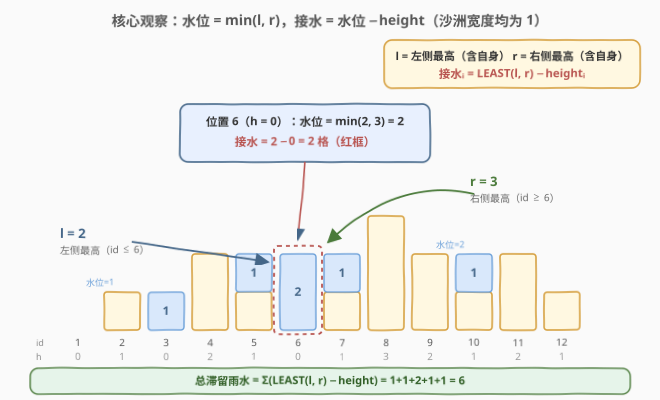
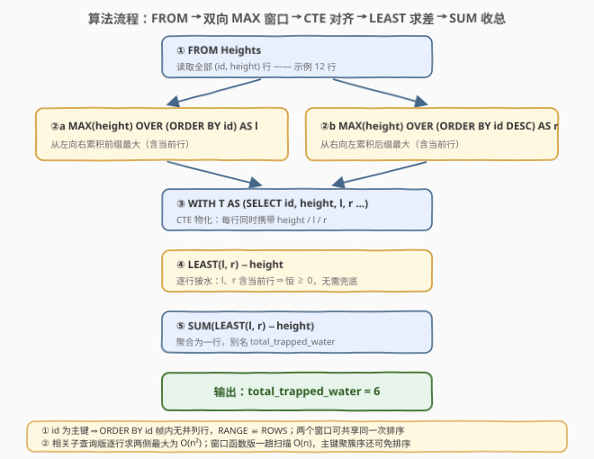
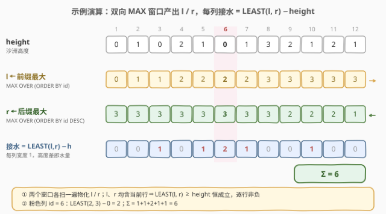

# 计算滞留雨水

- **题目名称**：计算滞留雨水
- **链接**：[3061. Calculate Trapping Rain Water 🔒](https://leetcode.cn/problems/calculate-trapping-rain-water/)
- **难度**：困难
- **标签**：数据库、SQL、窗口函数、前缀/后缀最大值、聚合求和

## 1. 题目概述

> ⚠️ 本题为 LeetCode 付费题，题意描述根据官方示例用例与外部资料重建，可能与官方题面有出入。

**表结构**：`Heights`

| 列名 | 类型 |
|------|------|
| id | int |
| height | int |

- `id` 是这张表的主键（值互不相同），且按升序给出（示例中为连续的 `1..n`）。
- 每行描述一根**沙洲**（官方用词，可理解为宽度为 `1` 的柱子）：位于位置 `id`，高度为 `height`。

**背景**：下雨后，雨水会滞留在沙洲之间的凹槽里。

**目标**：写一条 SQL 查询，计算景观中所有沙洲之间能滞留的**雨水总量**，以任意顺序返回结果表。

**输出格式**：单行单列 `total_trapped_water`。

**示例 1**：

```text
输入：Heights 表
+-----+--------+
| id  | height |
+-----+--------+
| 1   | 0      |
| 2   | 1      |
| 3   | 0      |
| 4   | 2      |
| 5   | 1      |
| 6   | 0      |
| 7   | 1      |
| 8   | 3      |
| 9   | 2      |
| 10  | 1      |
| 11  | 2      |
| 12  | 1      |
+-----+--------+

输出：
+---------------------+
| total_trapped_water |
+---------------------+
| 6                   |
+---------------------+
```

**解释**：高度图即 $[0,1,0,2,1,0,1,3,2,1,2,1]$——这正是 [42. 接雨水](../0001-0100/42_接雨水.md) 示例 1 的同一张高度图，蓝色部分滞留 6 个单位的雨水。

**约束条件**（重建推测）：

- `height` 为非负整数；
- `id` 互不相同且有序；
- 答案在 32 位整数范围内。

> 💡 本题就是 **42「接雨水」的 SQL 化**：把"数组逐列算水"翻译成"表逐行算水"。算法版的按列公式 $\min(\text{左最大}, \text{右最大}) - h_i$ 原封不动照搬，考点变成——**如何用 SQL 的窗口函数表达"前缀最大 / 后缀最大"**。

---

## 2. 解题思路

### 2.1 暴力思路：相关子查询逐行求左右最大值

按列公式需要每个位置的"左侧最高"与"右侧最高"。不熟悉窗口函数时的直译写法：对每一行 `h1`，用两个**相关子查询**分别求 `id ≤ h1.id` 与 `id ≥ h1.id` 的最大高度：

```sql
SELECT SUM(water) AS total_trapped_water
FROM (
    SELECT LEAST(
               (SELECT MAX(h2.height) FROM Heights h2 WHERE h2.id <= h1.id),
               (SELECT MAX(h3.height) FROM Heights h3 WHERE h3.id >= h1.id)
           ) - h1.height AS water
    FROM Heights h1
) t;
```

逻辑正确——子查询带 `<=` / `>=` 等号，两侧最大值都**含当前行**，所以差值天然非负（与 2.2 的不变式一致）。但代价明显：

- **每行两次范围扫描**：相关子查询与外层逐行关联，`id` 主键索引也只能把单次扫描降到 $O(n)$，总计 $O(n^2)$，百万行级别的表完全不可用。
- **语义被拆散**："沿 `id` 序累积最大值"这一整体扫描，被复制成了 $2n$ 个彼此独立的子查询，优化器很难看出它们共享同一条 `id` 序。

> ⚠️ 暴力思路的根本问题：把"沿序累积"这一**整体扫描**拆成了每行独立的重复计算。而"沿序累积统计"恰好是**窗口函数**的原生语义——一次扫描、逐行物化。

### 2.2 核心观察：水位 = LEAST(前缀最大, 后缀最大)



与 42 题完全同源的**按列视角**：

- 记 $l_i = \max_{j \le i} h_j$（**含当前行**的前缀最大），$r_i = \max_{j \ge i} h_j$（**含当前行**的后缀最大）；
- 位置 $i$ 的**水位**由两侧的"短板"决定：$\text{level}_i = \min(l_i, r_i)$——水会从较低的一侧溢出；
- 位置 $i$ 的接水量：$w_i = \min(l_i, r_i) - h_i$（沙洲宽度为 1，高度差即面积）；
- 答案 $= \sum_i w_i$。

上图以位置 6（$h=0$）为例：$l = 2$、$r = 3$，水位取短板 $2$，接水 $2 - 0 = 2$ 格。

两个关键细节，都是 SQL 版特有的考点：

1. **前缀/后缀最大要"含当前行"**：这样 $\min(l_i, r_i) \ge h_i$ 恒成立，逐行接水量天然非负，**不需要** `GREATEST(…, 0)` 兜底；
2. **窗口函数正好一次成型**：`MAX(height) OVER (ORDER BY id)` 默认帧是 `RANGE BETWEEN UNBOUNDED PRECEDING AND CURRENT ROW`——从首行累积到当前行（含），正是 $l_i$；把排序方向反过来 `ORDER BY id DESC`，即得 $r_i$。一个聚合函数 `MAX`、两个排序方向，前缀/后缀最大双双到手。

### 2.3 算法流程图



**逻辑执行步骤**：

| 步骤 | SQL 片段 | 作用 | 示例数据流 |
|------|----------|------|-----------|
| ① | `FROM Heights` | 读取全部 `(id, height)` | 12 行 |
| ②a | `MAX(height) OVER (ORDER BY id) AS l` | 从左累积前缀最大 | `0,1,1,2,2,2,2,3,3,3,3,3` |
| ②b | `MAX(height) OVER (ORDER BY id DESC) AS r` | 从右累积后缀最大 | `3,3,3,3,3,3,3,3,2,2,2,1` |
| ③ | `WITH T AS (…)` | 每行携带 height / l / r | 12 行 × 4 列 |
| ④ | `LEAST(l, r) − height` | 逐行接水（恒 ≥ 0） | `0,0,1,0,1,2,1,0,0,1,0,0` |
| ⑤ | `SUM(…)` | 聚合输出总量 | **6** |

> 💡 **两个窗口共享一次排序**：②a 与 ②b 只是 `id` 升序 / 降序之差，引擎通常一次排序（或直接利用主键序双向扫描）即可同时物化，不必担心"两遍窗口 = 两遍全表扫描"。

### 2.4 示例演算



对示例 1 的 12 行逐列套公式：

| id | height | l（前缀最大） | r（后缀最大） | LEAST(l, r) | 接水 |
|----|--------|--------------|--------------|-------------|------|
| 1 | 0 | 0 | 3 | 0 | 0 |
| 2 | 1 | 1 | 3 | 1 | 0 |
| 3 | 0 | 1 | 3 | 1 | **1** |
| 4 | 2 | 2 | 3 | 2 | 0 |
| 5 | 1 | 2 | 3 | 2 | **1** |
| 6 | 0 | 2 | 3 | 2 | **2** |
| 7 | 1 | 2 | 3 | 2 | **1** |
| 8 | 3 | 3 | 3 | 3 | 0 |
| 9 | 2 | 3 | 2 | 2 | 0 |
| 10 | 1 | 3 | 2 | 2 | **1** |
| 11 | 2 | 3 | 2 | 2 | 0 |
| 12 | 1 | 3 | 1 | 1 | 0 |
| | | | | **Σ** | **6** ✓ |

两个值得口头点出的位置：

- **id = 1**（$h=0$）：虽然右侧最高 $r=3$ 很高，但左侧最高 $l=0$——左边界没有墙，一滴水也接不住，短板效应的极端案例；
- **id = 9**（$h=2$）：$l=3 > r=2$，短板在右侧——它右侧再无更高的沙洲，水位被 $r=2$ 压平，恰好等于自身高度，接水 0。

---

## 3. 参考代码

### SQL（解法 A：窗口函数，推荐）

```sql
# Write your MySQL query statement below
WITH T AS (
    SELECT
        id,
        height,
        MAX(height) OVER (ORDER BY id)      AS l,
        MAX(height) OVER (ORDER BY id DESC) AS r
    FROM Heights
)
SELECT SUM(LEAST(l, r) - height) AS total_trapped_water
FROM T;
```

> 💡 **写法要点**：
> - **两个窗口只差排序方向**：`ORDER BY id` 前缀最大、`ORDER BY id DESC` 后缀最大；默认帧都**含当前行**，天然满足 $\min(l, r) \ge \text{height}$，无需防负兜底。
> - **`id` 是主键**：帧内不会出现并列 `id`，`RANGE` 与 `ROWS` 语义等价，不必显式写帧子句。
> - **`LEAST` 的方言差异**：MySQL / PostgreSQL / SQLite（`min(a, b)`）均可用；SQL Server 无 `LEAST`，写 `IIF(l < r, l, r)` 或 `CASE`。
> - **防御小细节**：表为空时 `SUM` 返回 `NULL`；若判题或业务要求 0，可套 `COALESCE(SUM(…), 0)`。

### SQL（解法 B：用户变量 running max，无窗口函数时代的经典写法）

```sql
SELECT SUM(LEAST(l, r) - height) AS total_trapped_water
FROM (
    SELECT a.id, a.height, a.l, b.r
    FROM (SELECT id, height, @l := GREATEST(@l, height) AS l
          FROM Heights, (SELECT @l := 0) init
          ORDER BY id) a
    JOIN (SELECT id, @r := GREATEST(@r, height) AS r
          FROM Heights, (SELECT @r := 0) init
          ORDER BY id DESC) b
        ON b.id = a.id
) t;
```

> 💡 **解法 B 的思路**：MySQL 8.0 之前没有窗口函数，靠"排序 + 用户变量"模拟前缀累积——派生表 `a` 按 `id` 升序扫描，`@l := GREATEST(@l, height)` 边扫边滚出前缀最大；派生表 `b` 按 `id` 降序同理滚出后缀最大；两表按 `id` 等值连接对齐后，公式照旧。
>
> ⚠️ 用户变量的求值顺序在标准 SQL 中没有保证，MySQL 8.0 已将"同一语句中赋值并读取用户变量"标记为**弃用**，特定优化下行为可能变化。此写法仅作历史回顾与原理印证（它就是窗口函数的手工展开），**判题与生产一律用解法 A**。2.1 的相关子查询版（O(n²)）同理只作暴力对照。

### Python（pandas）

```python
import pandas as pd


def calculate_trapped_rain_water(heights: pd.DataFrame) -> pd.DataFrame:
    h = heights.sort_values("id")["height"].reset_index(drop=True)
    l = h.cummax()
    r = h.loc[::-1].cummax().loc[::-1]
    water = pd.DataFrame({"l": l, "r": r}).min(axis=1) - h
    return pd.DataFrame({"total_trapped_water": [int(water.sum())]})
```

> 💡 **pandas 对照**（付费题无官方函数签名，函数名按题名约定）：
> - **`cummax()`**：即 `MAX OVER (ORDER BY …)` 的前缀最大；先 `[::-1]` 反转再 `cummax` 再反转回来，就是 `ORDER BY id DESC` 的后缀最大。
> - **`sort_values("id")`**：先按 `id` 定序再累积——对应"窗口的 `ORDER BY id`"，绝不依赖 DataFrame 的既有行序。
> - **`min(axis=1)`**：逐行取 `l` / `r` 较小者，即 `LEAST`。

---

## 4. 复杂度分析

设 $n$ 为 `Heights` 表行数。

| 维度 | 解法 A（窗口函数，推荐） | 相关子查询（2.1） | 解法 B（用户变量） | pandas |
|------|--------------------------|-------------------|--------------------|--------|
| **时间** | $O(n)$（实现层按 `id` 排序，主键序可视为免排序） | $O(n^2)$ | $O(n \log n)$（两趟排序） | $O(n)$ |
| **空间** | $O(n)$（CTE 物化 l / r） | $O(1)$ 额外 | $O(n)$ | $O(n)$ |
| **可读性** | ✓ 声明式，四行对公式 | ⚠ 嵌套两层相关子查询 | ⚠ 依赖私有语法与求值顺序 | ✓ 简洁 |
| **可移植性** | ✓ MySQL 8+ / PostgreSQL / SQLite 3.25+ | ✓ 各引擎通用 | ✗ MySQL 专属且已弃用 | ✓ |
| **推荐度** | ✓ **首选** | ✗ 仅暴力对照 | ✓ 学原理 | ✓ 验证用 |

> - **时间**：窗口函数逻辑上一趟扫描（两个窗口可共享同一次 `id` 排序）；InnoDB 主键即聚簇索引，行天然按 `id` 有序，排序开销通常可省。相关子查询版每行触发两次范围扫描，$n$ 行即 $O(n^2)$。
> - **空间**：CTE 需要把 `l` / `r` 物化为中间结果，$O(n)$；这是用空间换时间的典型交易——解法 B 的两个派生表同样要各物化一份。
> - **网络传输**：逐行差值在服务器内完成，`SUM` 只输出一行，无行数放大；若去掉 `SUM` 输出逐行水位（见 5.2），传输量才回到 $O(n)$。

---

## 5. 扩展：窗口帧、输出粒度与算法版对照

### 5.1 帧子句细节："含当前行"是刻意的，排他帧有 NULL 陷阱

`OVER (ORDER BY id)` 省略帧时默认 `RANGE BETWEEN UNBOUNDED PRECEDING AND CURRENT ROW`——**含当前行**。若手滑写成排他帧：

```sql
MAX(height) OVER (ORDER BY id ROWS BETWEEN UNBOUNDED PRECEDING AND 1 PRECEDING)
```

首行的 `l` 为 `NULL`，接下来的行为**分引擎翻车**：

| 引擎 | `LEAST(NULL, r)` | 后果 |
|------|------------------|------|
| MySQL | `NULL`（任一参数为 NULL 则整体 NULL） | `SUM` 恰好跳过该行——侥幸正确 |
| PostgreSQL | `r`（LEAST/GREATEST **忽略** NULL） | 首行算出 $r - h$ 的虚假水量——**直接错** |

同一个 SQL，换个引擎正确性都不同——这就是"把正确性押在 `NULL` 传播语义上"的下场。**含当前行的默认帧让 $\min(l, r) \ge h_i$ 成为公式层面的不变式**，不依赖任何 `NULL` 边角行为。

另一个细节：`id` 为主键 ⇒ 帧内无并列行 ⇒ `RANGE` 与 `ROWS` 等价。若业务列允许重复（如按时间戳开窗），`RANGE` 会把**同值的整组并列行**一并纳入帧——"并列行全算"是否合意，用之前要想清楚。

### 5.2 输出粒度变体：从总量到逐行水位

把 ⑤ 的 `SUM` 去掉，直接输出每行接水量，就得到"每根沙洲上的水位"：

```sql
SELECT id, height, LEAST(l, r) - height AS water
FROM T
ORDER BY id;
```

在此之上还能加戏：`ORDER BY water DESC LIMIT 1` 找最深的一列、`RANK() OVER (ORDER BY water DESC)` 找所有并列最深的列、`water > 0` 的行数即"有水的沙洲数"。**同一 CTE 骨架换投影/聚合即换一题**——SQL 题追问最常见的方向就是输出粒度变形。

### 5.3 与算法版 42 的解法对照

| 视角 | 42（数组，算法版） | 3061（表，SQL 版） |
|------|--------------------|--------------------|
| 按列 DP | `left_max` / `right_max` 两趟扫描 | 窗口函数 `l` / `r`（本题解法 A） |
| 双指针 $O(1)$ 空间 | 指针推进 + 两侧最大滚动更新 | 声明式模型无指针语义，需递归 CTE / 变量模拟（解法 B 即半成品） |
| 单调栈按行 | 弹栈结算横向水层 | 表达成本高，不划算 |

> 💡 结论：**过程式技巧（双指针 / 单调栈）在 SQL 里没有生存空间，窗口函数才是"前缀统计"类问题的声明式母语**。面试被追问"为什么不用双指针"时，答"集合无序、无指针语义，窗口函数一次物化前缀/后缀统计是等价且惯用的表达"即可。

---

## 6. 面试要点

1. **`MAX(height) OVER (ORDER BY id)` 不写帧子句，为什么正好是"含当前行的前缀最大"？**

   > 省略帧时默认 `RANGE BETWEEN UNBOUNDED PRECEDING AND CURRENT ROW`，帧从分区首行累积到当前行（含）。本题 `id` 是主键无重复，`RANGE` 不会吸入多余并列行，与逐行 `ROWS` 版本等价。记住**默认帧含当前行**——它决定了 $\min(l, r) \ge h_i$ 这一非负性不变式。

2. **为什么逐行接水量不用 `GREATEST(…, 0)` 防负数？**

   > `l`、`r` 都是**含当前行**的最大值，两者都 $\ge h_i$，较小者也 $\ge h_i$，差值天然非负。对照：若把左右最大定义成"严格两侧"（不含自身），边界行会出现 `NULL`（子查询/排他帧）或 0（数组版首尾列），就得额外兜底。靠定义对齐消灭边界，是比防御性代码更优的解法。

3. **SQL 表是无序集合，凭什么能"从左到右"累积？**

   > "左右"不是物理行序，而是业务列 `id` 上的**全序**。窗口函数的 `ORDER BY id` 只定义帧的累积方向，与行的存储 / 读取顺序无关——不写 `ORDER BY` 的窗口（如 `MAX(height) OVER ()`）才是真正的"无序全体最大"。反过来，**绝不能依赖 `SELECT` 不带 `ORDER BY` 时的行序**做累积，标准 SQL 对此没有定义。

4. **窗口函数版和相关子查询版的性能差异从何而来？**

   > 相关子查询把"沿 `id` 序求最大"拆成 $2n$ 次独立范围扫描，优化器难以合并，$O(n^2)$；窗口函数把累积语义整体交给引擎，一趟扫描内逐行推进 running max，$O(n)$。本质上这是"**声明整体扫描 vs 逐行重复计算**"的差别，与算法里"前缀和 vs 每次重新求区间和"完全同构。

5. **如果面试官追问：不用窗口函数也不用相关子查询，还有办法吗？**

   > 排序 + 用户变量（MySQL 5.7 时代的 running max，见解法 B）或递归 CTE 逐行递推都能做，但都在与"SQL 无副作用求值"的模型对抗——变量的求值顺序无标准保证，递归 CTE 则要自己拼"下一行"。这些路线可以讲，但要主动补一句：**生产环境一律窗口函数**，能讲清"为什么不用"比"会用"更加分。

> 💡 **一句话总结**：3061 = 42 接雨水的 SQL 版。公式 $\text{water}_i = \min(l_i, r_i) - h_i$ 原封不动，考点全在翻译：`ORDER BY id` / `ORDER BY id DESC` 两个方向的 `MAX` 窗口各扫一遍物化前缀 / 后缀最大（含当前行 ⇒ 非负不变式），`LEAST` 取短板，`SUM` 收总量——四行 SQL 把"按列接水"讲完。

---

## 7. 同类练习题

- [42. 接雨水](https://leetcode.cn/problems/trapping-rain-water/)（[题解](../0001-0100/42_接雨水.md)）：**算法版母题**——同一张高度图的数组版，$\min(\text{左右最大}) - h_i$ 公式同源，另练双指针 $O(1)$ 空间与单调栈按行结算两种过程式视角
- [407. 接雨水 II](https://leetcode.cn/problems/trapping-rain-water-ii/)（[题解](../0401-0500/407_接雨水II.md)）：3D 泛化——从"两侧最高"升级为"四周最矮围墙"，最小堆贪心，同一物理直觉的进阶
- [180. 连续出现的数字](https://leetcode.cn/problems/consecutive-numbers/)（[题解](../0101-0200/180_连续出现的数字.md)）：窗口函数入门——`LAG` 把"上一行"拉进当前行，与本题 `MAX OVER` 的"把左侧历史拉进当前行"同属一个范式
- [1204. 最后一个能进入电梯的人](https://leetcode.cn/problems/last-person-to-fit-in-the-bus/)（[题解](../1201-1300/1204_最后一个能进入巴士的人.md)）：前缀累积经典——`SUM(…) OVER (ORDER BY …)` 运行总和再过滤，与本题只差聚合函数（`SUM` ↔ `MAX`），巩固"沿序累积"家族
- [3055. 最高欺诈百分位数 🔒](https://leetcode.cn/problems/top-percentile-fraud/)（[题解](../3001-3100/3055_最高欺诈百分位数.md)）：同为付费 SQL 新题——`RANK()` / `CUME_DIST()` 排名窗口应用，与本题的 `MAX` 聚合窗口合起来覆盖窗口函数的两大分支
