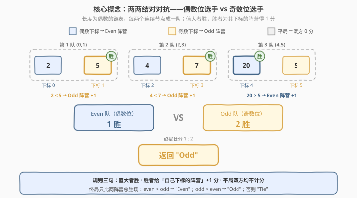
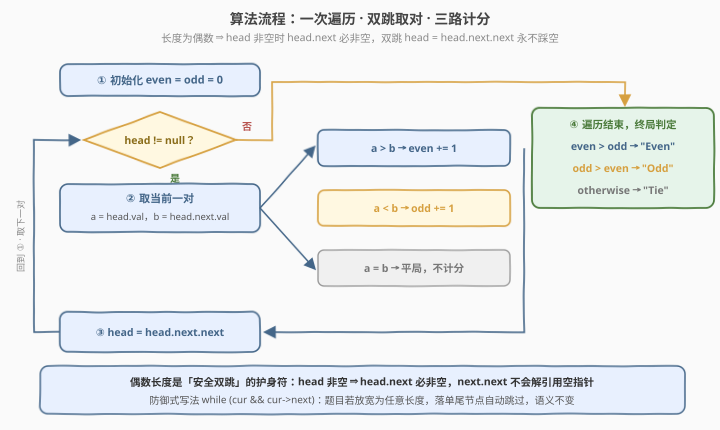
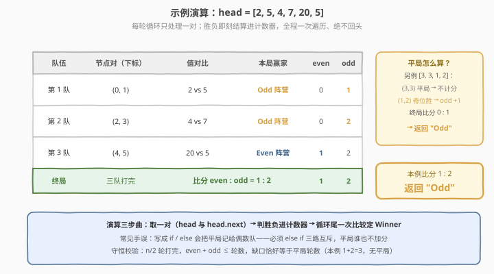

# LeetCode 链表游戏的获胜者 题解

## 1. 题目概述

- **标题 / 题号**：链表游戏的获胜者（#3062，easy）
- **链接**：https://leetcode.cn/problems/winner-of-the-linked-list-game/
- **难度**：简单
- **标签**：链表、一次遍历、双跳指针、计数、LeetCode 锁题

> ⚠️ 本题为 LeetCode 付费题，题意描述根据官方示例用例与 hints 重建，可能与官方题面有出入。

**题意**：给定一个**长度为偶数**、节点值为整数的链表头节点 `head`。节点从 $0$ 到 $n-1$ 编号，每两个连续节点组成一队：$(0,1)$、$(2,3)$、$(4,5)$……共 $n/2$ 队。

每个节点的值代表该选手的**力量值**。每队中力量值较大的选手获胜；若两人力量值相等，则**无人获胜（不计分）**：

- 下标为**偶数**的选手获胜 → **Even 阵营**得 $1$ 分；
- 下标为**奇数**的选手获胜 → **Odd 阵营**得 $1$ 分。

全部队伍打完后比较两阵营总得分，返回 `"Even"`（偶阵营分高）、`"Odd"`（奇阵营分高）或 `"Tie"`（平分）。

官方 hints 三句话，恰好就是全部套路：

1. *"Traverse linked list and try to find pairs."* —— 遍历链表，两两取对；
2. *"For each team, keep the number of its winning games in a variable."* —— 每个阵营一个胜场计数器；
3. *"Compare the winning variables and find the answer."* —— 最后比较两个计数器。

**示例 1**（官方 `jsonExampleTestcases` 给出的唯一用例）：

```text
输入：head = [2,1]
输出："Even"
解释：唯一一队 (0,1)：下标 0 的值 2 > 下标 1 的值 1，偶数位选手获胜。
      终局比分 even = 1, odd = 0 → 返回 "Even"。
```

**示例 2**：

```text
输入：head = [2,5,4,7,20,5]
输出："Odd"
解释：三队依次为 (2,5)、(4,7)、(20,5) → 奇位胜、奇位胜、偶位胜。
      终局比分 even = 1, odd = 2 → 返回 "Odd"。
```

**示例 3**：

```text
输入：head = [4,4,5,5]
输出："Tie"
解释：两队均为平局，双方都不得分。终局比分 0 : 0 → 返回 "Tie"。
```

**约束条件**（据重建题意）：

- 链表长度 $n$ 为**偶数**且 $n \ge 2$（至少一队，且双跳遍历安全）；
- 节点值为整数，可正可负——算法只做比较，值域大小不影响思路。

## 2. 解题思路

### 2.1 暴力思路：拷进数组再两两比较

最直接的笨办法：先把链表值全部拷进数组 `vals`，再 `for i in range(0, len(vals), 2)` 比较 `vals[i]` 与 `vals[i+1]`。

- 结果当然正确，但**白白付出 $O(n)$ 辅助空间**——链表本来就有 `next` 指针，「前进两格」是 $O(1)$ 操作，拷数组等于把链表当成"不能跳跃的数组"在用；
- 更隐蔽的坑：拷进数组后，下标 $i$ 与「奇偶阵营」的对应关系全靠脑子记——`vals[i]` 是偶位、`vals[i+1]` 是奇位，循环里一旦手滑写成 `i += 1`，下标奇偶性就全乱了；
- 至于哈希表、栈之类的结构更是无从谈起：本题既不查重也不配对检索，纯属"杀鸡用牛刀"。

> ⚠️ 暴力的根源是把「链表的遍历能力」看弱了：链表虽然不支持随机访问，但**沿 next 顺序前进任意步是免费的**。本题只需要"一次跳两格"，数组这个中转站毫无必要。

### 2.2 核心观察：双跳遍历 + 两个计数器



**关键洞察**：把「下标奇偶性」翻译成链表语言——

- 每队的**第一个节点**（`head`）永远是偶数下标 → 它赢就是 **Even 阵营 +1**；
- 每队的**第二个节点**（`head.next`）永远是奇数下标 → 它赢就是 **Odd 阵营 +1**；
- `head = head.next.next` **双跳**一步跨到下一队的第一个节点。

于是循环体里只需三个互斥分支，恰好覆盖三种战况：

$$
\text{head.val} > \text{head.next.val} \Rightarrow \text{even}{+}{+}, \qquad
< \Rightarrow \text{odd}{+}{+}, \qquad
= \Rightarrow \text{平局，双方不动}
$$

> 💡 为什么敢直接写 `head.next.next` 不怕空指针？**链表长度为偶数**是本题的隐藏护身符：循环条件 `head != null` 成立时，剩余节点数必为 $\ge 2$ 的偶数（偶数减偶数仍为偶数），`head.next` 必非空。若题目放宽为任意长度，防御式写法 `while (cur && cur->next)` 语义自动兼容——落单的尾节点不组队、不判胜负。

> ⚠️ **平局必须三路互斥**：如果图省事写成 `if (a > b) even++; else odd++;`，相等时会落入 `else`，平局被**系统性记给 Odd 阵营**——比分从此失真。必须用 `else if`（或显式判等）让 `a == b` 谁也不加分。这是本题唯一的考点级细节。

### 2.3 算法流程图



**四步流水线**：

| 步骤 | 操作 | 说明 |
|------|------|------|
| ① | `even = odd = 0` | 两个阵营各一个胜场计数器 |
| ② | 循环条件 `head != null`，取 `a = head.val`、`b = head.next.val` | 每轮只看一对；长度为偶数保证 `head.next` 非空 |
| ③ | 三路计分后 `head = head.next.next` | 双跳到下一对；回到 ② |
| ④ | 循环结束比较 `even` 与 `odd` | 大者胜出，相等返回 `"Tie"` |

### 2.4 示例演算

跟踪 `head = [2,5,4,7,20,5]` 的完整执行过程：



| 轮次 | 节点对（下标） | 值对比 | 本局赢家 | even 计数 | odd 计数 |
|------|--------------|--------|----------|-----------|----------|
| 第 1 轮 | (0, 1) | 2 vs 5 | Odd 阵营（下标 1） | 0 | 1 |
| 第 2 轮 | (2, 3) | 4 vs 7 | Odd 阵营（下标 3） | 0 | 2 |
| 第 3 轮 | (4, 5) | 20 vs 5 | Even 阵营（下标 4） | 1 | 2 |

循环结束：$\text{even} = 1 < \text{odd} = 2$ → 返回 `"Odd"`。

**守恒校验**（防翻车的金标准）：每轮要么恰好一个计数器 +1、要么两个都不动，故 $n/2 = 3$ 轮打完必有 $\text{even} + \text{odd} \le 3$，缺口恰好等于平局轮数——本例 $1 + 2 = 3$，无平局 ✓。

> 💡 若结果对不上，先查两件事：平局分支是否被 `else` 误吞（记给了某一队）；双跳是否写成 `head = head.next`（下标奇偶性整体错位一格，比分全错）。

## 3. 参考代码

### C++

```cpp
class Solution {
public:
    string gameResult(ListNode* head) {
        int even = 0, odd = 0;
        for (ListNode* cur = head; cur != nullptr; cur = cur->next->next) {
            if (cur->val > cur->next->val) {
                ++even;            // 偶数位选手获胜
            } else if (cur->next->val > cur->val) {
                ++odd;             // 奇数位选手获胜
            }                      // 相等：平局，双方均不计分
        }
        if (even > odd) return "Even";
        if (odd > even) return "Odd";
        return "Tie";
    }
};
```

> 💡 **写法要点**：
> - `for` 循环的步进表达式 `cur = cur->next->next` 直接把「双跳」写进循环头，循环体只剩计分逻辑，最贴流程图；
> - 长度为偶数 ⇒ `cur` 非空时 `cur->next` 必非空，`cur->next->next` 永不解引用空指针；
> - 终局判定用两个 `if` 而非 `if / else if / else`，把 `"Tie"` 留给兜底返回——三态枚举不重不漏。

### Python

```python
class Solution:
    def gameResult(self, head: Optional[ListNode]) -> str:
        even = odd = 0
        while head:                    # 长度为偶数 ⇒ head.next 必非空
            a, b = head.val, head.next.val
            if a > b:
                even += 1              # 偶数位选手获胜
            elif b > a:
                odd += 1               # 奇数位选手获胜
            head = head.next.next      # 双跳到下一对
        if even > odd:
            return "Even"
        if odd > even:
            return "Odd"
        return "Tie"
```

> 💡 **写法要点**：
> - `a, b = head.val, head.next.val` 先取值再比较，避免条件里反复 `head.next.val` 拼写拖沓；
> - `elif b > a` 三路互斥是关键——平局（`a == b`）两个分支都不命中，天然不计分；
> - 函数名 `gameResult` 为 LeetCode 官方模板签名（锁题，以提交页模板为准）。

## 4. 复杂度分析

| 维度 | 复杂度 | 说明 |
|------|--------|------|
| **时间** | $O(n)$ | $n$ 为节点数；每个节点在一次遍历中恰好被访问一次（读值或作为双跳落点），无重复扫描 |
| **空间** | $O(1)$ | 仅两个整型计数器 `even` / `odd`，不拷数组、不开哈希、不递归 |
| **输出** | $O(1)$ | 三选一的字符串字面量 `"Even"` / `"Odd"` / `"Tie"` |

> ⚠️ 本题 $n$ 小怎么写都瞬过，复杂度的价值在**姿势**：拷数组的暴力解把空间从 $O(1)$ 拖到 $O(n)$，而双跳遍历是链表题「下标分组」类问题的通用基本功——空间开销为零才是链表原生存储的正确打开方式。

## 5. 扩展：单计数器与防御式变体

### 5.1 单计数器（符号差）写法

两个计数器可以压缩成一个**带符号差值**：偶位胜 $+1$、奇位胜 $-1$，终局看正负零三态：

```python
def gameResult(self, head: Optional[ListNode]) -> str:
    diff = 0
    while head:
        a, b = head.val, head.next.val
        diff += (a > b) - (a < b)      # 三值比较：+1 / -1 / 0
        head = head.next.next
    return "Even" if diff > 0 else ("Odd" if diff < 0 else "Tie")
```

`(a > b) - (a < b)` 是 Python / C++ 通用的「三值比较」惯用法（C++20 的 `a <=> b` 同义）：布尔转整数相减，一式映射出 $\{+1, 0, -1\}$ 三态，正负零恰好对应 Even / Tie / Odd。省一个变量是小事，**把"比分"建模成一个可正可负的数**才是面试里值得展示的抽象。

### 5.2 防御式循环条件

把 `while head:` 换成 `while head and head.next:`（C++ 为 `while (cur && cur->next)`）：

- 题目保证偶数长度时行为完全一致（多出的判断恒真）；
- 若变体题放宽为**任意长度**，落单的尾节点自动跳过——不组队、不判胜负、不会崩溃；
- 代价是每次循环多一次判空。面试口径：**题目保证写裸版，生产代码写防御版**，能说清这层取舍即可。

### 5.3 配对方式的变体

本题的配对是「相邻结对」$(i, i+1)$。同族题型还有：

- **首尾孪生结对**：$n$ 为偶数时第 $i$ 个与第 $n-1-i$ 个配对——见 2130 链表最大孪生和（快慢指针找中点 + 反转后半段）；
- **k 个一组**：每 $k$ 个连续节点为一队——外层 $k$ 跳 + 内层扫 $k$ 个，总复杂度仍 $O(n)$；
- 配对策略与"配对后怎么比"是两个独立自由度，面试可分别展开。

## 6. 面试要点

1. **为什么敢直接解引用 `head.next`，不怕空指针？**

   > 链表长度为偶数：循环条件 `head` 非空意味着剩余节点数是 $\ge 2$ 的偶数（每轮恰好消费 2 个），故 `head.next` 必非空、双跳安全。若面试官追问"长度可能是奇数呢"，答防御式写法 `while (cur && cur->next)`，落单尾节点自动跳过。

2. **平局这一分支怎么处理？为什么强调 `else if`？**

   > 平局两队都不加分。若误写 `if (a > b) even++; else odd++;`，相等时落入 `else`，平局被系统性记给 Odd 阵营，比分失真。必须三路互斥：`>` / `<` / `==` 各归各，`==` 谁也不动。可用守恒式 $\text{even} + \text{odd} + \text{平局数} = n/2$ 自验。

3. **能否只用一个变量完成统计？**

   > 用带符号差值 `diff`：偶位胜 $+1$、奇位胜 $-1$，终局 `diff > 0 → "Even"`、`< 0 → "Odd"`、`= 0 → "Tie"`。核心是 `(a > b) - (a < b)` 三值比较惯用法，一行完成三态映射。

4. **这题和"先拷进数组再比较"相比，优势在哪？**

   > 空间从 $O(n)$ 降到 $O(1)$。链表沿 `next` 前进任意步是 $O(1)$ 的，"两两分组"恰好只需要跳两格，数组中转毫无必要；且拷数组后下标奇偶性靠人肉对齐，双跳遍历则让"队首恒偶位、队尾恒奇位"成为结构性不变量，天然防错。

5. **如果每队改成 $k$ 个连续节点、队内最大者为其下标阵营得分呢？**

   > 外层从双跳改为 $k$ 跳；内层对每 $k$ 个节点扫一遍找最大值及其下标，按「下标相对队首的偏移」的奇偶决定给哪个阵营加分（本题 $k=2$：偏移 0 恒偶位、偏移 1 恒奇位）。每个节点仍只被访问一次，总复杂度不变。

> 💡 **一句话总结**：3062 是「链表下标分组」的入门标本——双跳取对把奇偶下标固化成结构不变量，两个计数器（或一个符号差）三路结算，$O(n)$ / $O(1)$ 一次遍历收工；唯一的坑是平局必须三路互斥，谁也不加分。

## 同类练习题

| # | 题目 | 与本题的关联 |
|---|------|-------------|
| 2130 | [链表最大孪生和](https://leetcode.cn/problems/maximum-twin-sum-of-a-linked-list/)（[题解](../2101-2200/2130_链表最大孪生和.md)） | 同为「偶数长度两两配对」，配对方式从相邻升级为首尾孪生——体会"怎么配对"与"配对后怎么比"两个自由度 |
| 2487 | [从链表中移除节点](https://leetcode.cn/problems/remove-nodes-from-linked-list/)（[题解](../2401-2500/2487_从链表中移除节点.md)） | 一次遍历中对节点值做比较决策的姊妹题 |
| 876 | [链表的中间结点](https://leetcode.cn/problems/middle-of-the-linked-list/)（[题解](../0801-0900/876_链表的中间结点.md)） | 快慢指针「双跳前进」的基本功，本题 `head = head.next.next` 同款动作 |
| 328 | [奇偶链表](https://leetcode.cn/problems/odd-even-linked-list/) | 按下标奇偶性拆分重组链表——「下标奇偶」语义的进阶操作 |
| 3063 | [链表节点频率](https://leetcode.cn/problems/linked-list-frequency/) | 紧邻的下一道锁题，一次遍历统计节点值频率，可作连续打卡（付费） |
