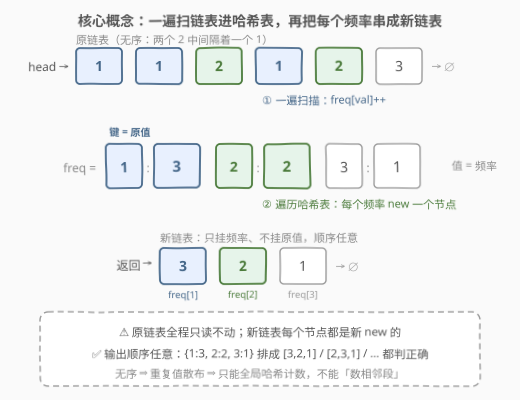
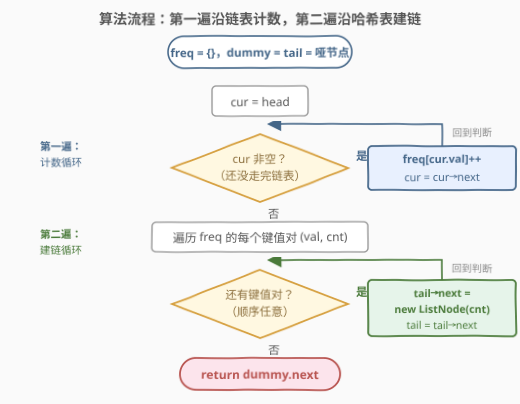

# 链表频率

- **题目名称**：链表频率
- **链接**：[3063. 链表频率](https://leetcode.cn/problems/linked-list-frequency/)
- **难度**：简单
- **标签**：哈希表、链表、计数

## 1. 题目概述

> ⚠️ 本题为 LeetCode 付费题，题意描述根据官方示例用例与 hints 重建，可能与官方题面有出入。

给你一个链表的头节点 `head`，链表中每个节点包含一个整数，**值可能重复出现**。请你构造并返回一个**新链表**：原链表中每个**不同的值**对应新链表中一个节点，该节点的值为这个值在原链表中的**频率**（出现次数）。

新链表中节点的**顺序可以是任意的**——任意排列都会被判为正确。

**示例 1**（来自官方 `jsonExampleTestcases`）：

```text
输入：head = [1,1,2,1,2,3]
输出：[3,2,1]
解释：1 出现 3 次、2 出现 2 次、3 出现 1 次，返回 [3,2,1]；
     [2,3,1]、[3,1,2] 等任意排列同样正确。
```

**示例 2**（重建示例）：

```text
输入：head = [5,5,1,1,1,7]
输出：[2,3,1]
解释：5 出现 2 次、1 出现 3 次、7 出现 1 次；
     图示按「首次出现顺序」给出 [2,3,1]，任意排列均可。
```

**约束条件**（按官方 hints 与数据规模推断）：

- 链表中节点数目范围 $[1, 10^5]$
- $1 \le \text{Node.val} \le 10^5$

> 💡 读题关键：输出链表**只要频率、不要原值**，且**顺序任意**——这两点直接决定了「哈希计数 + 直接建链」就够，不需要排序、也不需要维护任何特定顺序。官方 hint 也只给了一句：*Traverse the linked list and keep the number of occurrences of values using a HashMap.*

---

## 2. 解题思路

### 2.1 暴力思路

最容易想到的暴力做法：外层沿链表枚举「还没统计过的值」，内层从头再扫一遍整条链表数它出现了几次，数完把次数接到结果链表尾部。设不同值有 $U$ 个、链表长 $n$，时间为 $O(n \cdot U)$，最坏 $O(n^2)$——$n = 10^5$ 时约 $10^{10}$ 次操作，必然超时。

另一个「半暴力」是把链表值全抽进数组、排序后数连续段（把 [82. 删除排序链表中的重复元素 II](../0001-0100/82_删除排序链表中的重复元素II.md) 的「数段」思路搬过来），$O(n \log n)$ 能过，但要 $O(n)$ 辅助数组，且丢掉了链表原地处理的练习意义。两个暴力版都在「每个值如何快速查到已数了多少次」这一步卡壳——这正是哈希表的用武之地。

### 2.2 核心观察：哈希一遍计数 + 哑节点尾插建链



两个关键观察把问题拆成两步线性流程：

1. **链表无序，重复值散布**：示例 `[1,1,2,1,2,3]` 中两个 `2` 中间隔着一个 `1`，重复值**不**相邻。所以不能像 82 题那样只比较相邻节点「数段」——必须对整条链表做**全局计数**，即一遍遍历 + 哈希表 `freq[val]++`，均摊 $O(1)$。
2. **只要频率、顺序任意**：答案不含原值本身，也不要求顺序，所以计数之后**直接遍历哈希表**、把每个频率 `new` 成节点接起来即可——排序、去重、维护出现顺序统统不需要。

建链用**哑节点 + 尾指针**的惯用法：`tail->next = new ListNode(cnt)` 一行统一「第一个节点」与「后续节点」两种情况，最后返回 `dummy.next`。

> 💡 **为什么不怕顺序问题**：题目判题器接受任意排列（示例 1 明确说明）。`C++` 的 `unordered_map` 遍历顺序不确定、`Python` 的 `dict` 按插入序（即首次出现序），两者都合法。若面试官强制要求某种顺序，见第 5 节的变体。

### 2.3 算法流程图



两个串行的循环：**第一遍**沿原链表走，每步 `freq[cur.val]++`；**第二遍**沿哈希表走，每步把频率 `new` 成节点尾插。全程对原链表**只读**。

### 2.4 示例演算

![示例演算：[1,1,2,1,2,3] 的逐步计数与建链](../images/p3063_example_walkthrough.svg)

以 `head = [1,1,2,1,2,3]` 走一遍第一遍循环：

| 步骤 | cur.val | freq 状态 | 说明 |
|------|---------|-----------|------|
| 1 | 1 | {1:1} | 值 1 首次出现，入表 |
| 2 | 1 | {1:2} | 1 的计数 +1 |
| 3 | 2 | {1:2, 2:1} | 值 2 首次出现，入表 |
| 4 | 1 | **{1:3**, 2:1} | 1 的计数 +1 |
| 5 | 2 | {1:3, **2:2}** | 2 的计数 +1 |
| 6 | 3 | {1:3, 2:2, **3:1}** | 值 3 首次出现，入表 |

第一遍结束得 `freq = {1:3, 2:2, 3:1}`；第二遍遍历哈希表，把频率 $3, 2, 1$ 依次尾插，得到新链表 `3 → 2 → 1`（按首次出现序；实际任意排列均正确）。

---

## 3. 参考代码

### C++（unordered_map 计数 + 哑节点建链）

```cpp
class Solution {
  public:
    ListNode* frequenciesOfElements(ListNode* head) {
        unordered_map<int, int> freq;               // 值 → 出现次数
        for (ListNode* cur = head; cur; cur = cur->next)
            ++freq[cur->val];                       // 第一遍：无序链表只能全局计数

        ListNode dummy(0), *tail = &dummy;          // 哑节点 + 尾指针：O(1) 尾插
        for (auto& [val, cnt] : freq)               // 顺序任意，直接遍历
            tail = tail->next = new ListNode(cnt);  // 第二遍：只挂频率，不挂原值
        return dummy.next;
    }
};
```

### Python（Counter 计数 + 哑节点建链）

```python
class Solution:
    def frequenciesOfElements(self, head: Optional[ListNode]) -> Optional[ListNode]:
        freq = Counter()
        cur = head
        while cur:
            freq[cur.val] += 1              # 第一遍：沿链表计数
            cur = cur.next

        dummy = tail = ListNode()           # 哑节点：省掉「第一个节点」特判
        for cnt in freq.values():           # dict 按插入序 = 首次出现序
            tail.next = ListNode(cnt)       # 第二遍：每个频率 new 一个节点
            tail = tail.next
        return dummy.next
```

> 💡 Python 3.7+ 的 `dict`（含 `Counter`）按**插入序**遍历，所以 `freq.values()` 天然就是「按首次出现顺序」的频率序列——示例 1 恰好输出 `[3,2,1]`。但这只是巧合福利，算法并不依赖它。

---

## 4. 复杂度分析

| 维度 | 复杂度 | 说明 |
|------|--------|------|
| 时间复杂度 | $O(n)$ | 第一遍计数 $O(n)$ + 第二遍遍历哈希表建链 $O(U)$，$U$ 为不同值个数且 $U \le n$ |
| 空间复杂度 | $O(U)$ | 哈希表存 $U$ 个键值对；输出链表共 $U$ 个节点，是题目要求的输出本身，不计入额外空间 |

其中 $n$ 为链表长度，$U \le \min(n, 10^5)$ 为不同值的个数。$n = 10^5$ 时线性做法轻松通过；暴力 $O(n^2)$ 超时的原因见 2.1。

---

## 5. 扩展：如果对输出顺序有要求

**按首次出现顺序**（示例图示的顺序）：Python 版天然满足（dict 插入序）；C++ 的 `unordered_map` 无序，可**再刷一遍原链表**——用一个 `seen` 集合，只在第一次遇到值 $v$ 时输出 `freq[v]`，或干脆把已输出的频率清零判重。总时间仍 $O(n)$。

**按频率降序**：此时题目变成 [451. 根据字符出现频率排序](https://leetcode.cn/problems/sort-characters-by-frequency/) 的链表版——计数后对 $U$ 个频率排序再建链，时间 $O(n + U \log U)$。

**对照 82 题想清楚边界**：若本题链表**有序**（82 题的前提），重复值相邻成段，一遍「数段」即可，额外空间 $O(1)$（输出除外）；正因为本题无序，才必须付出 $O(U)$ 的哈希表。「有序数段、无序哈希」是链表去重/计数类题目的分水岭。

---

## 6. 面试要点

1. **为什么不能像 82 题那样只比较相邻节点？**

   - 82 题的前提是链表**有序**，重复值相邻成段，比较 `cur->val` 与 `cur->next->val` 就能定位一整段；本题链表**无序**，示例中两个 `2` 中间隔着 `1`，重复值散布全表，必须全局计数（哈希表），局部比较会漏。

2. **哑节点在这里解决了什么问题？**

   - 建新链表的**第一个**节点时尾指针尚不存在，若不用哑节点就得写「`head` 为空则新建，否则接到尾部」的分支；哑节点让第一个与后续节点统一成 `tail->next = new ListNode(cnt)` 一行，最后返回 `dummy.next` 即可。这是链表构建题的通用模板（参见 [21. 合并两个有序链表](../0001-0100/21_合并两个有序链表.md)）。

3. **输出节点的顺序有影响吗？**

   - 判题上没有：题目接受任意排列。但若被追问「要求按首次出现顺序 / 按频率降序」，要能给出第 5 节的两个变体——前者再刷一遍原链表配 `seen` 集合，后者加一次 $O(U \log U)$ 排序。

4. **会不会破坏原链表？**

   - 不会。第一遍只读 `cur->val`；新链表每个节点都是 `new` 出来的，与原链表**零共享**。函数返回后原链表仍完整可复用——这一点在面试中主动说明是加分项。

5. **`unordered_map` 之外还有什么计数结构可选？**

   - 值域 $[1, 10^5]$ 时可用 `int freq[100001]` 数组桶：无哈希计算、缓存友好，实测更快；值域更大、稀疏或键非整数时退回哈希表。两者复杂度同阶，选择标准同 [3005. 最大频率元素计数](../3001-3100/3005_最大频率元素计数.md) 第 5 节的讨论。

---

## 7. 同类练习题

- [82. 删除排序链表中的重复元素 II](https://leetcode.cn/problems/remove-duplicates-from-sorted-list-ii/)（[题解](../0001-0100/82_删除排序链表中的重复元素II.md)）：有序链表相邻成段才能「数段」，对照理解本题无序为何必须哈希
- [347. 前 K 个高频元素](https://leetcode.cn/problems/top-k-frequent-elements/)（[题解](../0301-0400/347_前K个高频元素.md)）：同样哈希计数，再按频率取前 K，本题计数的 Top-K 延伸
- [451. 根据字符出现频率排序](https://leetcode.cn/problems/sort-characters-by-frequency/)：计数 + 按频率重排的完整形态（本题若要求频率降序输出就是它的链表版）
- [817. 链表组件](https://leetcode.cn/problems/linked-list-components/)（[题解](../0801-0900/817_链表组件.md)）：链表遍历 + 哈希集合判段，同款「哈希 × 链表」组合拳
- [1171. 从链表中删去总和值为零的连续节点](https://leetcode.cn/problems/remove-zero-sum-consecutive-nodes-from-linked-list/)（[题解](../1101-1200/1171_从链表中删去总和值为零的连续节点.md)）：哈希表 + 链表指针重连的进阶版
