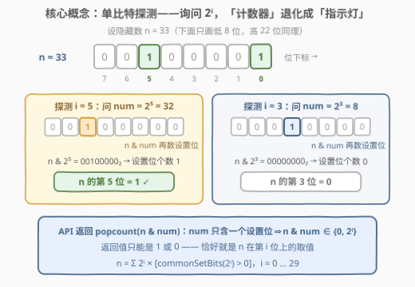
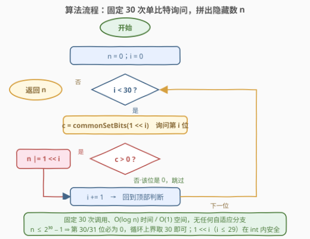
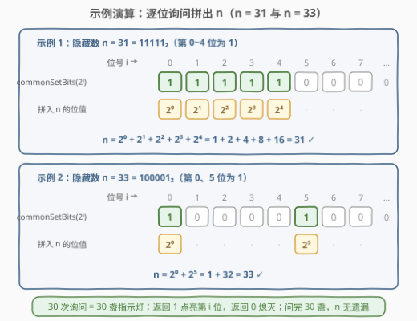

# LeetCode 使用按位查询猜测数字 I 题解

## 1. 题目概述

- **标题 / 题号**：使用按位查询猜测数字 I（#3064，medium）
- **链接**：https://leetcode.cn/problems/guess-the-number-using-bitwise-questions-i/
- **难度**：中等
- **标签**：位运算、交互

> ⚠️ 本题为 LeetCode 付费题，题意描述根据官方示例用例与 hints 重建，可能与官方题面有出入。（题面已与社区镜像 doocs/leetcode 的官方中文翻译交叉核对，出入风险较低。）

**题意**：这是一道**交互题**。你需要找到一个隐藏的数字 $n$，判定系统预定义了一个 API：

`int commonSetBits(int num)`

它返回 `n` 和 `num` 的二进制表示中**同一位置上同为 1 的位数**——换句话说，返回 $n \,\&\, \text{num}$ 的**设置位个数**（即 $\text{popcount}(n \,\&\, \text{num})$，其中 $\&$ 是按位 AND 运算符）。

请实现 `findNumber()`，利用该 API 探测并返回 $n$。

**示例 1**：

```text
输入：n = 31
输出：31
解释：可以证明使用给定的 API 能够找到 31。
```

**示例 2**：

```text
输入：n = 33
输出：33
解释：可以证明使用给定的 API 能够找到 33。
```

**约束**：

- $1 \le n \le 2^{30} - 1$
- $0 \le \text{num} \le 2^{30} - 1$
- 若查询的 `num` 超出上述范围，返回结果不可靠。

> 💡 关键读题点：API 返回的是**个数**（一个 $0 \sim 30$ 的整数），不是「是否有」的布尔值。这既是本题的迷惑点，也是突破口——只要让询问的 `num` 只含一个设置位，「个数」就退化为 0/1，恰好等于 $n$ 在该位上的取值。

## 2. 解题思路

### 2.1 暴力思路：两条死路

朴素的想法有两种，都走不通：

1. **枚举验证**：从 1 枚举到 $2^{30}-1$，逐个「问」是不是 $n$。但 API 没有**相等性反馈**——问 `num = 候选值` 只会得到 $\text{popcount}(n \,\&\, \text{num})$，即使候选值恰好等于 $n$，返回的也只是 $n$ 的设置位个数，而你并不知道这个数「应该」是几，无从确认；何况 $2^{30} \approx 10^9$ 次调用在交互题的开销模型下也不可行。

2. **多比特打包询问**：希望一次问一串位（比如 `num = 0b1011`）多拿点信息。但返回值是这些位上设置位的**总和**——返回 2 时，你无法区分是 $\{\text{bit}_0, \text{bit}_1\}$、$\{\text{bit}_0, \text{bit}_3\}$ 还是 $\{\text{bit}_1, \text{bit}_3\}$。**「和」带来歧义**，多个位的信息混叠在一起无法拆分，除非再追加自适应的消歧询问，得不偿失。

结论：信息的粒度必须缩小到**一次只问一个位**。

### 2.2 核心观察：单比特探测（逐位询问 $2^i$）



让 $\text{num} = 2^i$（二进制中只有第 $i$ 位是 1）：

- $n \,\&\, 2^i$ 只有两种结果：$2^i$（$n$ 的第 $i$ 位是 1）或 $0$（该位是 0）；
- 于是 $\text{commonSetBits}(2^i)$ 的返回值只能是 1 或 0，**恰好就是 $n$ 在第 $i$ 位上的取值**——「计数器」被降维成「指示灯」。

$$n = \sum_{i=0}^{29} 2^i \cdot \big[\,\text{commonSetBits}(2^i) > 0\,\big]$$

由约束 $n \le 2^{30}-1$，$n$ 至多占用第 $0 \sim 29$ 共 30 个二进制位，逐位问一遍即可拼出 $n$。官方 hints 也是这么提示的：*"Ask $2^i$ for $0 \le i < 30$. If the result is greater than zero for some $i$, this bit is a set bit in $n$."*

> 💡 **交互题通用心法**：把「强反馈」API 当作可自由设计的探针——先想清楚「我要什么形状的信息」，再反过来构造「能把这份信息**单独**暴露出来」的询问。本题要的是单个位，就让询问里只有一个位。

### 2.3 算法流程图



流程一句话：`n = 0` → $i$ 从 0 扫到 29，每次调用 $\text{commonSetBits}(2^i)$，返回值大于 0 就 `n |= 1 << i` → 循环结束返回 `n`。整个过程**固定 30 次调用**，没有任何自适应分支，连 `n` 的值域都不影响流程形状。

### 2.4 示例演算



- **示例 1，$n = 31 = 11111_2$**：询问 $2^0 \sim 2^4$ 全部返回 1（第 0～4 位都是设置位），$2^5 \sim 2^{29}$ 全部返回 0，拼出 $1+2+4+8+16 = 31$。
- **示例 2，$n = 33 = 100001_2$**：只有 $2^0$ 与 $2^5$ 返回 1，其余为 0，拼出 $1 + 32 = 33$。

与两个官方示例完全一致。

## 3. 参考代码

### C++

```cpp
/**
 * Definition of commonSetBits API.
 * int commonSetBits(int num);
 */

class Solution {
  public:
    int findNumber() {
        int n = 0;
        for (int i = 0; i < 30; ++i)
            if (commonSetBits(1 << i) > 0)
                n |= 1 << i;
        return n;
    }
};
```

### Python（生成器一行版）

```python
# Definition of commonSetBits API.
# def commonSetBits(num: int) -> int:


class Solution:
    def findNumber(self) -> int:
        return sum(1 << i for i in range(30) if commonSetBits(1 << i))
```

### Python（本地调试：mock 判题机自测）

```python
# Definition of commonSetBits API.
# def commonSetBits(num: int) -> int:

SECRET = 33  # 模拟判题机里隐藏的 n


def commonSetBits(num: int) -> int:  # 按 API 契约本地 mock 一个
    return bin(SECRET & num).count("1")


class Solution:
    def findNumber(self) -> int:
        return sum(1 << i for i in range(30) if commonSetBits(1 << i))


assert Solution().findNumber() == SECRET  # 交互题离线自测的常用姿势
```

> 💡 说明：$n \le 2^{30}-1$ 意味着只有第 $0 \sim 29$ 位可能为 1，循环上界取 30 即可（写成 32 也不影响正确性，只是多两次注定返回 0 的询问）。C++ 中 `1 << i`（$i \le 29$）在 `int` 范围内安全，无溢出风险。交互题的判题机在远端，本地按 API 契约写个 mock 即可自测，提交时删掉 mock 与 `SECRET`。

## 4. 复杂度分析

| 维度 | 复杂度 | 说明 |
|------|--------|------|
| 时间复杂度 | $O(\log n)$ | 固定 30 次 API 调用（$n < 2^{30}$，位数即 $\log_2 n$ 的上界），每次调用后的拼装处理为 $O(1)$ |
| 空间复杂度 | $O(1)$ | 只用常数个变量 `n` / `i` |
| API 调用次数 | 30 次 | 每位恰好一次；镜像题面未标注调用次数上限，逐位询问的 30 次开销完全安全 |

## 5. 扩展：姊妹题 3094（带副作用的续作）

[3094. 使用按位查询猜测数字 II](https://leetcode.cn/problems/guess-the-number-using-bitwise-questions-ii/)（同为付费题、中等）把本题抬了一档：

- API 改为 `commonBits(num)`：统计 `n` 与 `num` 二进制表示中**取值相同**的位数（同为 1 **或同为 0** 都计入，只看前 30 位），返回该计数；
- **副作用**：每次调用后 `n = n XOR num`——你问着问着，目标数自己变了；
- 要求返回 `n` 的**初始值**（且 $n$ 可以取 0）。

解法正是「单比特探测」的升级版：对每个 $i$，对 `commonBits(1 << i)` **连问两次**，记返回值为 $c_1, c_2$。设初始第 $i$ 位为 $b$、其余 29 位中 0 的个数为 $Z$（两次询问之间不变，因为 $1 \ll i$ 只翻转第 $i$ 位）：

$$c_1 = Z + b, \qquad c_2 = Z + (1 - b) \implies c_1 - c_2 = 2b - 1$$

于是 $c_1 > c_2 \iff b = 1$；同时第二次异或恰好把第 $i$ 位翻回原值（**异或自反**），副作用被完全抵消，不影响后续位的探测。总调用 $30 \times 2 = 60$ 次。对比本题可以看到交互题的一条递进线：**先学会把询问设计成无损探针，再学会用「探针 + 复原」对抗副作用**。

## 6. 面试要点

1. **API 返回的是「个数」，为什么逐位询问下等价于布尔值？**

   - $2^i$ 只有一个设置位，所以 $n \,\&\, 2^i \in \{0,\ 2^i\}$，其设置位个数只能是 0 或 1，恰好对应 $n$ 第 $i$ 位是 0 还是 1。「计数器」被降维成「指示灯」，这是单比特探测的全部秘密。

2. **为什么多比特打包询问行不通？**

   - 返回的是若干位上设置位的**总和**，而和不满足唯一分解——返回 2 可能对应 $\binom{k}{2}$ 种位组合。除非追加自适应消歧询问（得不偿失），否则信息混叠不可拆。单比特询问是最简单且无损的信息提取方式。

3. **循环为什么是 0～29 而不是 0～31？**

   - 约束 $n \le 2^{30}-1$ 保证第 30、31 位必为 0，问也只会返回 0。写成 32 不错但浪费两次调用。另注意 `1 << 29` 在 `int` 内安全；若值域放宽到 64 位则要换 `1LL << i`。

4. **交互题本地怎么调试？**

   - 判题机在远端，本地按 API 契约写一个 mock（闭包或全局变量保存 `SECRET`，实现 `commonSetBits`），对自己的 `findNumber()` 做 `assert`；提交前删掉 mock。这也是所有交互题（374、875 式「API 反馈」题）的通用工程姿势。

5. **变体追问：如果 API 每次调用后把 `n` 更新为 `n XOR num`（即 3094 的设定），怎么办？**

   - 对每个 $2^i$ 连问两次：第一次的返回值携带初始位信息（并翻转该位），第二次把该位翻回来（异或自反）。比较两次返回值 $c_1$ 与 $c_2$：$c_1 > c_2$ 说明初始该位为 1。既取到信息又复原了状态。

## 同类练习题

| # | 题目 | 与本题的关联 |
|---|------|-------------|
| 3094 | [使用按位查询猜测数字 II](https://leetcode.cn/problems/guess-the-number-using-bitwise-questions-ii/) | 本题续作，API 统计「相同位」（含同 0）且每次调用后 `n XOR= num`，练「探测 + 复原」双询问 |
| 374 | [猜数字大小](https://leetcode.cn/problems/guess-number-higher-or-lower/) | 交互题入门，API 给大小反馈，练二分把询问次数压到 $O(\log n)$ |
| 375 | [猜数字大小 II](https://leetcode.cn/problems/guess-number-higher-or-lower-ii/) | 猜数游戏的极小化最大化 DP 版，与交互式猜数互为镜像 |
| 191 | [位 1 的个数](https://leetcode.cn/problems/number-of-1-bits/)（[题解](../0001-0100/191_位1的个数.md)） | 本题 API 的本体就是 $\text{popcount}(n \,\&\, \text{num})$，练 `n & (n−1)` 消最低位 |
| 201 | [数字范围按位与](https://leetcode.cn/problems/bitwise-and-of-numbers-range/)（[题解](../0201-0300/201_数字范围按位与.md)） | AND 语义下的另一道位运算经典，练「公共前缀」观察 |
